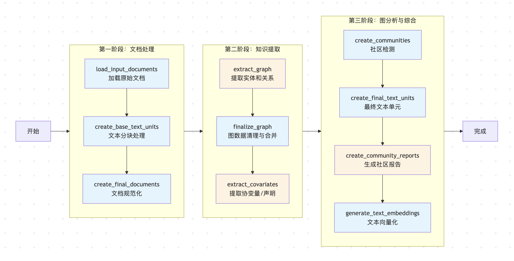
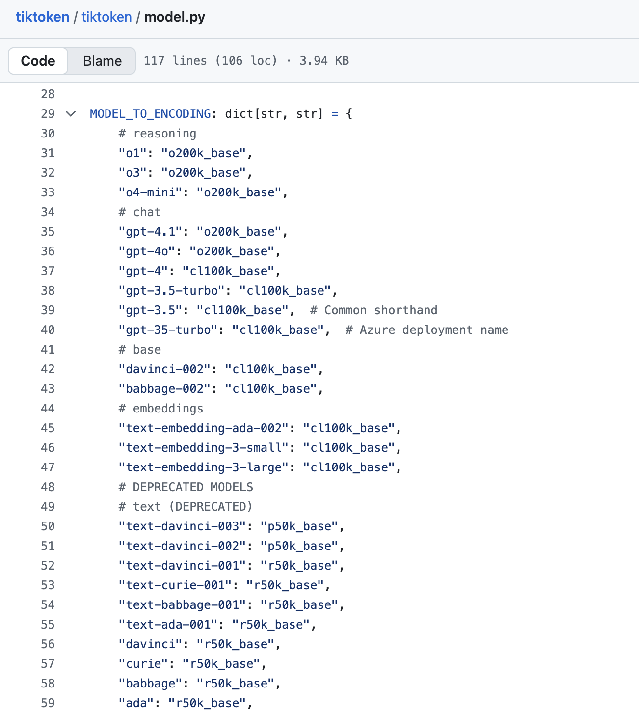

# GraphRAG 索引构建之文档处理

昨天我们对 GraphRAG 的索引构建做了一个基本的概述，了解了其索引构建的整体流程和工作流引擎的设计。今天我们将深入第一个具体阶段 —— **文档处理**，这是整个知识图谱构建的起点，负责将各种格式的原始文档转换为标准化的文本单元，为后续的知识提取奠定基础。

## 回顾索引构建流程

根据前一篇文章的分析，我们可以将 GraphRAG 的索引构建流程分为三个主要阶段：



今天我们重点关注文档处理阶段，它的核心任务是将非结构化的原始数据转换为后续处理流程所需的标准化文本单元。这个阶段包含三个关键工作流：

* **加载原始文档（`load_input_documents`）** - 从各种数据源加载原始文档
* **文本分块处理（`create_base_text_units`）** - 将长文档分割成可处理的文本块
* **文档规范化（`create_final_documents`）** - 对文档进行最终的标准化整理

## 加载原始文档

在 GraphRAG 中，所有工作流的入口都是 `run_workflow()` 方法，加载原始文档也是如此。它的核心逻辑位于 `index/workflows/load_input_documents.py` 文件：

```python
async def run_workflow(
  config: GraphRagConfig,
  context: PipelineRunContext,
) -> WorkflowFunctionOutput:
  
  # 加载输入文档，转换为标准的 pd.DataFrame 格式
  output = await load_input_documents(config.input, context.input_storage)

  # 将原始文档写入 documents 表中
  await write_table_to_storage(output, "documents", context.output_storage)
  return WorkflowFunctionOutput(result=output)
```

这个工作流首先加载输入文档，将其转换为标准的 `pd.DataFrame` 格式，然后写入 `documents` 表中。GraphRAG 通过工厂模式实现了对纯文本、CSV、JSON 三种文件格式的统一处理：

```python
loaders: dict[str, Callable[..., Awaitable[pd.DataFrame]]] = {
  InputFileType.text: load_text,
  InputFileType.csv: load_csv,
  InputFileType.json: load_json,
}
```

> 如果你有不同的格式，官方的建议是编写脚本将其转换为其中一种。

同时，它也支持 Azure Blob、CosmosDB、本地文件、内存这四种不同的存储类型：

```python
StorageFactory.register(StorageType.blob.value, create_blob_storage)
StorageFactory.register(StorageType.cosmosdb.value, create_cosmosdb_storage)
StorageFactory.register(StorageType.file.value, create_file_storage)
StorageFactory.register(StorageType.memory.value, lambda **_: MemoryPipelineStorage())
```

默认情况下是从本地的 `input` 目录下读取文件，并使用 `text` 加载器处理。我们可以在 `settings.yaml` 文件中的 `input` 部分进行配置：

```yaml
input:
  storage:
    type: file # [blob, cosmosdb, file, memory]
    base_dir: "input"
  file_type: text # [csv, text, json]
```

### 文本文件处理

对于纯文本文件，处理逻辑相对简单，在 `index/input/text.py` 中：

```python
async def load_file(path: str, group: dict | None = None) -> pd.DataFrame:
  text = await storage.get(path, encoding=config.encoding)
  new_item = {**group, "text": text}
  new_item["id"] = gen_sha512_hash(new_item, new_item.keys())
  new_item["title"] = str(Path(path).name)
  new_item["creation_date"] = await storage.get_creation_date(path)
  return pd.DataFrame([new_item])
```

每个文本文件被读取为一个完整的字符串，并自动生成标准字段：

- `text`: 文件的完整内容
- `id`: 基于内容的 SHA512 哈希值，确保唯一性
- `title`: 文件名（不含路径）
- `creation_date`: 文件创建日期

### JSON 文件处理

JSON 文件的处理位于 `index/input/json.py` 文件，直接调用 `json.loads()` 加载数据。支持两种格式，一种是单个对象格式：

```json
{
  "text": "文档内容",
  "title": "文档标题"
}
```

另一种是数组格式：

```json
[
  {"text": "文档1内容", "title": "文档1标题"},
  {"text": "文档2内容", "title": "文档2标题"}
]
```

> 注意，目前暂不支持 JSONL 格式（每行一个完整的 JSON 对象），需转换为数组格式。

JSON 解析器会自动为对象增加 `id` 和 `creation_date` 两个字段。另外，如果 JSON 中没有 `text` 和 `title` 字段，还可以在配置文件中设置：

```yaml
input:
  file_type: json
  text_column: content  # 指定 text 列
  title_column: name    # 指定 title 列
```

### CSV 文件处理

CSV 文件的处理位于 `index/input/csv.py` 文件，直接调用 `pd.read_csv()` 加载数据，它的格式如下：

```
text,title
"文档1内容","文档1标题"
"文档2内容","文档2标题"
```

同样的，CSV 解析器也会自动为对象增加 `id` 和 `creation_date` 两个字段，也支持在配置文件中设置 `text` 和 `title` 字段映射。

## 文本分块处理

加载原始文档后，下一步是将长文档切分成更小、更易于处理的文本单元，这一步骤对后续的 LLM 处理至关重要。分块策略通过 `settings.yaml` 中的 `chunks` 部分配置：

```yaml
chunks:
  size: 1200                   # 每个分块的目标 token 数量
  overlap: 100                 # 相邻分块之间重叠的 token 数量
  group_by_columns: [id]       # 按指定列分组，确保分块在文档内部进行
  strategy: tokens             # 分块策略：tokens 或 sentence
  encoding_model: cl100k_base  # 用于计算 token 的编码模型
```

其中 `size` 和 `overlap` 比较好理解，分别表示每个分块的大小和相邻分块之间的重叠；`group_by_columns` 通常设置为 ["doc_id"] 或 ["id"] 表示在分块前先按文档 ID 进行分组，确保文本分块不会跨越不同的文档；`strategy` 表示分块策略，支持 `tokens` 和 `sentence` 两种。

```python
def load_strategy(strategy: ChunkStrategyType) -> ChunkStrategy:
  """分块策略定义"""
  match strategy:
    case ChunkStrategyType.tokens:
      # tokens 分块策略
      from graphrag.index.operations.chunk_text.strategies import run_tokens
      return run_tokens
    case ChunkStrategyType.sentence:
      # sentence 分块策略
      from graphrag.index.operations.chunk_text.bootstrap import bootstrap
      from graphrag.index.operations.chunk_text.strategies import run_sentences
      bootstrap()
      return run_sentences
```

### 基于 `tokens` 的精确分块

**tokens 分块策略** 是 GraphRAG 的默认分块策略，它基于 [tiktoken](https://github.com/openai/tiktoken) 库进行精确的 token 计算和分块，核心实现如下：

```python
def run_tokens(
  input: list[str], config: ChunkingConfig, tick: ProgressTicker,
) -> Iterable[TextChunk]:

  # 获取编码和解码函数
  encode, decode = get_encoding_fn(encoding_name)
  
  # 基于编码 token 将文本分块
  return split_multiple_texts_on_tokens(
    input,
    Tokenizer(
      chunk_overlap=chunk_overlap,
      tokens_per_chunk=tokens_per_chunk,
      encode=encode,
      decode=decode,
    ),
    tick,
  )
```

其中 `get_encoding_fn()` 获取编码和解码函数，它支持通过 tiktoken 库加载不同的编码模型，比如 GPT-3.5 和 GPT-4 的 `cl100k_base` 或者 GPT-4.1 的 `o200k_base` 等，可以在 [tiktoken 源码中](https://github.com/openai/tiktoken/blob/main/tiktoken/model.py) 找到完整的模型列表：



`tokens` 分块的核心算法位于 `split_multiple_texts_on_tokens()` 函数：

```python
def split_multiple_texts_on_tokens(
  texts: list[str], tokenizer: Tokenizer, tick: ProgressTicker
) -> list[TextChunk]:
  """将多个文本进行分块并返回带元数据的块"""
  result = []
  mapped_ids = []

  # 第一步：编码所有文本并记录源文档索引
  for source_doc_idx, text in enumerate(texts):
    encoded = tokenizer.encode(text)
    mapped_ids.append((source_doc_idx, encoded))

  # 第二步：创建全局 token 序列，每个 token 都记录其来源文档
  input_ids = [
    (source_doc_idx, id) for source_doc_idx, ids in mapped_ids for id in ids
  ]

  # 第三步：滑动窗口分块
  start_idx = 0
  cur_idx = min(start_idx + tokenizer.tokens_per_chunk, len(input_ids))
  chunk_ids = input_ids[start_idx:cur_idx]

  while start_idx < len(input_ids):
    # 解码当前块的文本内容
    chunk_text = tokenizer.decode([id for _, id in chunk_ids])
    # 记录当前块涉及的源文档索引
    doc_indices = list({doc_idx for doc_idx, _ in chunk_ids})
    result.append(TextChunk(chunk_text, doc_indices, len(chunk_ids)))
    # 已完成
    if cur_idx == len(input_ids):
      break
    # 滑动窗口：下一个块的起始位置考虑重叠
    start_idx += tokenizer.tokens_per_chunk - tokenizer.chunk_overlap
    cur_idx = min(start_idx + tokenizer.tokens_per_chunk, len(input_ids))
    chunk_ids = input_ids[start_idx:cur_idx]

  return result
```

该算法首先使用 tiktoken 库将所有文档编码成 token 序列（即 `mapped_ids` 数组）；然后将 token 序列展开，变成一个全局的整数序列，每个 token 都保留其来源信息（即 `input_ids` 数组）；然后按 `tokens_per_chunk` 数量对 token 序列进行第一个分块并解码得到文本内容；接着使用滑动窗口往后依次分块，同时考虑相邻块之间有指定数量的重叠 token，保持上下文连续性。

> 有趣的是，这里的分块算法参考了 LangChain 的实现，有兴趣的朋友可以看下 LangChain 的 [TokenTextSplitter](https://python.langchain.com/docs/how_to/split_by_token/)。

### 基于句子的自然分块

**sentence 分块策略** 使用 NLTK 库进行基于句子边界的自然语言分块，它首先调用 `bootstrap()` 初始化必要的 NLTK 资源：

```python
def bootstrap():
  """初始化 NLTK 资源"""
  global initialized_nltk
  if not initialized_nltk:
    import nltk
    from nltk.corpus import wordnet as wn
    # 句子分词
    nltk.download("punkt")
    nltk.download("punkt_tab")
    # 词性标注
    nltk.download("averaged_perceptron_tagger")
    nltk.download("averaged_perceptron_tagger_eng")
    # 命名实体识别相关
    nltk.download("maxent_ne_chunker")
    nltk.download("maxent_ne_chunker_tab")
    # 词汇资源
    nltk.download("words")
    nltk.download("wordnet")
    # 确保 wordnet 数据已加载
    wn.ensure_loaded()
    # 完成初始化
    initialized_nltk = True
```

这里我稍微介绍下这几个 NLTK 资源：

* **句子分词相关**：`punkt` 用于句子边界检测和分词，将文本分割成句子，识别句子的开始和结束；`punkt_tab` 是 `punkt` 的表格化版本，提供更高效的句子分词性能；
* **词性标注相关**：`averaged_perceptron_tagger` 用于词性标注，基于 **平均感知机算法**，为每个单词标注词性（名词、动词、形容词等）；`averaged_perceptron_tagger_eng` 是其英语特化版本，专门针对英语文本的词性标注；
* **命名实体识别相关**：`maxent_ne_chunker` 用于命名实体识别和分块，基于 **最大熵模型**，识别人名、地名、组织名等命名实体；`maxent_ne_chunker_tab` 是 `maxent_ne_chunker` 的表格化版本，提供更快的命名实体识别性能；
* **词汇资源**：`words` 是英语单词词典，包含大量英语单词，用于拼写检查和词汇验证；`wordnet` 是英语词汇的语义网络，提供词汇间的语义关系（同义词、反义词、上下位关系等），支持词义消歧、语义相似度计算等；

然后使用 NLTK 的句子分割器，也就是 `sent_tokenize()` 方法，进行按句子分块：

```python
def run_sentences(
  input: list[str], _config: ChunkingConfig, tick: ProgressTicker
) -> Iterable[TextChunk]:
  """按句子将文本分成多个部分"""
  for doc_idx, text in enumerate(input):
    # 使用 NLTK 进行句子分割
    sentences = nltk.sent_tokenize(text)
    for sentence in sentences:
      yield TextChunk(
        text_chunk=sentence,
        source_doc_indices=[doc_idx],
      )
    tick(1)
```

可以看到，这种分块策略的实现相对简单，每个句子就是一个独立的文本块，句子之间没有重叠，避免信息重复。

### 两种策略的对比

下表对两种策略做了个对比：

| 特性 | tokens 策略 | sentence 策略 |
|------|-------------|----------------|
| **分块依据** | Token 数量 | 句子边界 |
| **块大小控制** | 精确控制 | 依赖句子长度 |
| **上下文保持** | 可配置重叠 | 自然语言完整性 |
| **跨文档支持** | 支持 | 不支持 |
| **计算复杂度** | 较高 | 较低 |
| **适用场景** | 严格 token 限制的 LLM 处理 | 需要保持句子完整性的分析 |

可以根据需要选择适当的分块策略。

无论是哪种分块策略，都返回统一的 `TextChunk` 数据结构：

```python
@dataclass
class TextChunk:
  """文本块类定义"""
  text_chunk: str              # 文本块内容
  source_doc_indices: list[int] # 源文档索引列表
  n_tokens: int | None = None  # token 数量（可选）
```

此外，我们还可以为文档添加一下元数据，分块时也有一些处理元数据的策略，相关配置如下：

```yaml
input:
  metadata: [title,tag] # 增加元数据列
chunks:
  prepend_metadata: true  # 将元数据复制到每个文本块的开头
  chunk_size_includes_metadata: false # 计算分块大小时是否包含元数据
```

关于元数据的使用，可以参考 GraphRAG 官方教程：

* https://microsoft.github.io/graphrag/index/inputs/

## 文档规范化

在完成文本分块后，`create_final_documents` 步骤会对处理结果进行最终的整理和规范化，将分块后的文本单元重新与原始文档关联。让我们详细分析实际的源码实现：

```python
def create_final_documents(documents: pd.DataFrame, text_units: pd.DataFrame) -> pd.DataFrame:
  
  # 展开文本单元的文档ID关联并选择需要的列
  exploded = (
    text_units.explode("document_ids")
    .loc[:, ["id", "document_ids", "text"]]
    .rename(
      columns={
        "document_ids": "chunk_doc_id",
        "id": "chunk_id", 
        "text": "chunk_text",
      }
    )
  )
  
  # 与原始文档信息合并
  joined = exploded.merge(
    documents,
    left_on="chunk_doc_id",
    right_on="id",
    how="inner",
    copy=False,
  )
  
  # 按文档聚合所有相关的文本单元ID
  docs_with_text_units = joined.groupby("id", sort=False).agg(
    text_unit_ids=("chunk_id", list)
  )
  
  # 重新与文档信息合并，形成最终结构
  rejoined = docs_with_text_units.merge(
    documents,
    on="id",
    how="right",
    copy=False,
  ).reset_index(drop=True)
  
  # 数据格式化和添加序号
  rejoined["id"] = rejoined["id"].astype(str)
  rejoined["human_readable_id"] = rejoined.index + 1
  
  # 返回标准化的列结构
  return rejoined.loc[:, DOCUMENTS_FINAL_COLUMNS]
```

这一步的代码看起来很长，其实它的逻辑并不复杂，核心在于数据的操作和转换，看懂这一步的代码需要熟练掌握 pandas 各种数据处理技巧，比如：

- `.explode("document_ids")`：将数组列展开为多行，每个数组元素对应一行
- `.loc[:, ["id", "document_ids", "text"]]`：列切片操作，只保留需要的列，减少内存使用
- `.rename(columns={})`：重命名列以更清晰地表示其含义
- `.merge(documents, ...)`：对两个表执行合并操作，使用 `left_on` 和 `right_on` 明确指定连接键
- `.groupby("id", sort=False)`：按文档 ID 分组，保持原有顺序，提高性能
- `agg(text_unit_ids=("chunk_id", list))`：聚合操作，将每个文档对应的所有文本单元 ID 收集成列表

最后使用预定义的 `DOCUMENTS_FINAL_COLUMNS` 确保输出格式的一致性，包括以下列：

- `id`: 文档唯一标识符
- `human_readable_id`: 人类可读的递增ID
- `title`: 文档标题
- `text`: 原始文档内容
- `text_unit_ids`: 关联的文本单元ID列表
- `metadata`: 元数据信息
- `creation_date`: 创建日期

## 小结

今天我们深入探讨了 GraphRAG 索引构建流程中的文档处理阶段，这个阶段是整个知识图谱构建的基础，负责将各种格式的原始文档转换为标准化的文本单元，为后续的知识提取和图谱构建做好准备。通过本次学习，我们掌握了以下核心要点：

* **统一的文档加载**：学习了 GraphRAG 如何通过工厂模式，支持从多种数据源（如本地文件、Azure Blob）加载不同格式（纯文本、CSV、JSON）的原始文档；
* **灵活的文本分块**：详细分析了两种核心的文本分块策略。`tokens` 策略基于 `tiktoken` 实现精确的 token 级切片和重叠，适合对 LLM 输入有严格限制的场景；而 `sentence` 策略则利用 NLTK 库进行基于句子边界的自然语言分块，更好地保持了语义的完整性；
* **标准化的数据输出**：文档处理的最后一步，将分块后的文本单元与原始文档进行重新关联，最终输出包含标准化字段的文档数据，为后续的索引流程提供了结构清晰、内容一致的输入。

在下一篇文章中，我们将进入知识提取阶段，学习 GraphRAG 如何调用大模型从这些精心处理的文本单元中提取实体和关系，最终构建出结构化的知识图谱。
