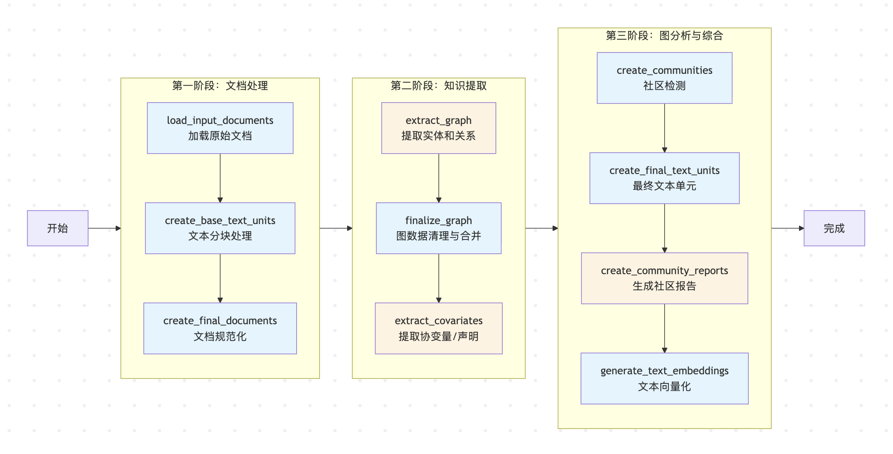
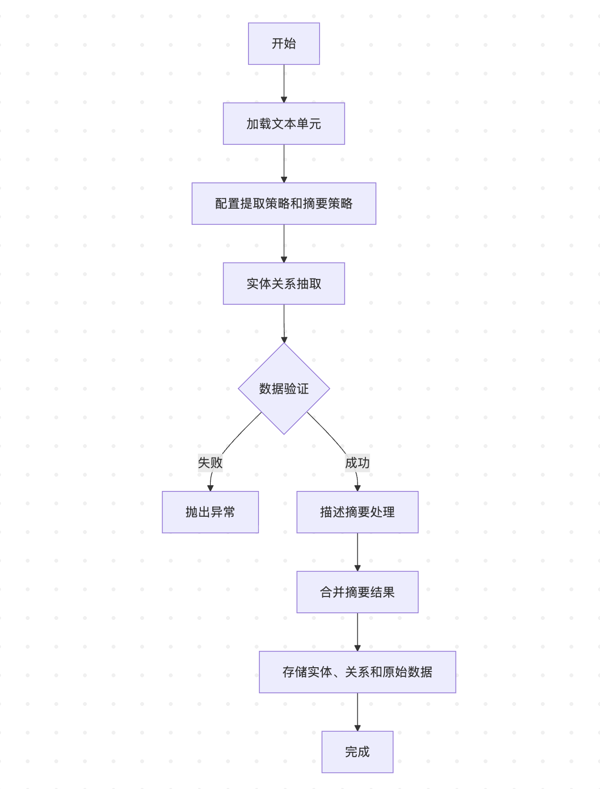

# GraphRAG 索引构建之知识提取

在前面的文章中，我们详细学习了 GraphRAG 索引构建的文档处理阶段，了解了如何将各种格式的原始文档转换为标准化的文本单元。今天我们将深入探索整个索引构建流程中最核心的部分 —— **知识提取**，看看 GraphRAG 是如何利用大语言模型的力量，从非结构化的文本中挖掘出结构化的实体、关系和声明，并最终构建出完整的知识图谱。

## 知识提取阶段总览

让我们回顾一下索引构建的整体流程，知识提取正是连接文本处理和图谱分析的关键桥梁：



知识提取阶段包含三个核心工作流：

- **提取图谱（`extract_graph`）** - 从文本中提取实体和关系，对同一个实体和关系的描述进行总结合并；
- **图谱规范化（`finalize_graph`）** - 对提取结果进行规范化处理，输出最终的实体表和关系表；
- **提取事实声明（`extract_covariates`）** - 提取事实性声明，这一步是可选的，声明通常用于识别诸如欺诈等恶意行为，因此并不适用于所有数据集；

## 提取图谱

图谱提取的实现位于 `index/workflows/extract_graph.py` 文件中，整个工作流包含以下关键步骤：

```python
async def run_workflow(
  config: GraphRagConfig,
  context: PipelineRunContext,
) -> WorkflowFunctionOutput:
  
  # 1. 加载文本单元
  text_units = await load_table_from_storage("text_units", context.output_storage)
  
  # 2. 配置提取策略和摘要策略
  extraction_strategy = config.extract_graph.resolved_strategy()
  summarization_strategy = config.summarize_descriptions.resolved_strategy()
  
  # 3. 执行图谱提取
  entities, relationships, raw_entities, raw_relationships = await extract_graph(
    text_units=text_units,
    extraction_strategy=extraction_strategy,
    summarization_strategy=summarization_strategy
  )
  
  # 4. 保存结果
  await write_table_to_storage(entities, "entities", context.output_storage)
  await write_table_to_storage(relationships, "relationships", context.output_storage)
```

这里值得注意是提取策略和摘要策略，它们对应 `settings.yaml` 文件中的 `extract_graph` 和 `summarize_descriptions` 两个配置：

```yaml
extract_graph:
  model_id: default_chat_model
  prompt: "prompts/extract_graph.txt"
  entity_types: [organization,person,geo,event]
  max_gleanings: 1

summarize_descriptions:
  model_id: default_chat_model
  prompt: "prompts/summarize_descriptions.txt"
  max_length: 500
```

从这里可以看出，整个图谱提取分为两步：首先遍历上一阶段生成的所有文本单元，通过大模型从每个文本片段中识别出实体和关系；然后将相同的实体和关系进行合并，再通过大模型总结合并之后的实体和关系描述；



### 核心提示词

第一步所使用的提示词位于 `prompts/extract_graph.txt`，翻译如下：

```
-目标-
给定一个可能与本活动相关的文本文档和一个实体类型列表，从文本中识别出所有属于这些类型的实体以及已识别实体之间的所有关系。

-步骤-
1. 识别所有实体。对于每个已识别的实体，提取以下信息：
- entity_name: 实体名称，首字母大写
- entity_type: 以下类型之一：[{entity_types}]
- entity_description: 对实体属性和活动的全面描述
每个实体的格式为（"entity"<|><entity_name><|><entity_type><|><entity_description>）

2. 从步骤1中识别出的实体中，识别所有（源实体，目标实体）对，这些实体对之间存在*明确的关系*。
对于每对相关实体，提取以下信息：
- source_entity: 源实体的名称，如步骤1中所识别的
- target_entity: 目标实体的名称，如步骤1中所识别的
- relationship_description: 解释为什么认为源实体和目标实体相关
- relationship_strength: 一个数值分数，表示源实体和目标实体之间关系的强度
每个关系的格式为（"relationship"<|><source_entity><|><target_entity><|><relationship_description><|><relationship_strength>）

3. 以英文返回输出，作为步骤1和步骤2中识别的所有实体和关系的单个列表。使用 **##** 作为列表分隔符。

4. 完成后，输出 <|COMPLETE|>
```

输出的结果每一行包含一条实体信息或关系信息，不同字段之间使用 `<|>` 分割，记录之间使用 `##` 分割，并以 `<|COMPLETE|>` 结尾，下面是一个示例：

```
("entity"<|>ALICE JOHNSON<|>PERSON<|>Alice Johnson is a software engineer at X Corp)
##
("entity"<|>X CORP<|>ORGANIZATION<|>X Corp is a technology company)
##
("relationship"<|>ALICE JOHNSON<|>X CORP<|>Alice Johnson works as a software engineer at X Corp<|>8)
<|COMPLETE|>
```

第二步所使用的提示词位于 `prompts/summarize_descriptions.txt`，这个就比较简单了：

```
你是一名乐于助人的助手，负责对下方提供的数据生成一份全面的总结。
给定一个或多个实体，以及一份描述列表，这些都与同一个实体或一组实体相关。
请将所有这些内容合并成一个单一的、全面的描述。确保包含从所有描述中收集到的信息。
如果所提供的描述存在矛盾，请解决这些矛盾并提供一个单一的、连贯的总结。
确保用第三人称撰写，并包含实体名称，以便我们了解完整的背景。
将最终描述的长度限制在 {max_length} 个单词以内。

#######
-数据-
实体：{entity_name}
描述列表：{description_list}
#######
输出：
```

如果提取实体和关系时，同一个实体或关系出现了多次，就有可能导致信息不完整或矛盾的情况，比如下面两条记录：

```
("entity"<|>ALICE JOHNSON<|>PERSON<|>Alice Johnson is a software engineer at X Corp)
("entity"<|>ALICE JOHNSON<|>PERSON<|>Alice Johnson is a software engineer at Y Corp)
```

通过对描述进行总结，得到一条关于 `ALICE JOHNSON` 的完整记录：

```
("entity"<|>ALICE JOHNSON<|>PERSON<|>Alice Johnson is a software engineer at X Corp and Y Corp)
```

### 多轮迭代提取

此外，在提取图谱时，GraphRAG 还实现了一个多轮迭代提取的机制，通过多次调用 LLM 来确保提取的完整性，可以通过 `max_gleanings` 参数进行配置。其核心逻辑如下：

```python
# 如果指定了 `max_gleanings` 参数，就进入循环以提取更多实体
# 有两个退出条件：（a）达到配置的最大值，（b）模型表示没有更多实体了
if self._max_gleanings > 0:
  for i in range(self._max_gleanings):
    response = await self._model.achat(
      CONTINUE_PROMPT,
      name=f"extract-continuation-{i}",
      history=response.history,
    )
    results += response.output.content or ""

    # 达到配置的最大值
    if i >= self._max_gleanings - 1:
      break

    response = await self._model.achat(
      LOOP_PROMPT,
      name=f"extract-loopcheck-{i}",
      history=response.history,
    )

    # 模型表示没有更多实体了
    if response.output.content != "Y":
      break
```

每次迭代会调用两次大模型，第一次告诉大模型提取有遗漏，让它继续提取，提示词 `CONTINUE_PROMPT` 如下：

```
在上一次提取中遗漏了许多实体和关系。
请记住，只输出与之前提取的任何类型相匹配的实体。
使用相同的格式在下方添加它们：
```

第二次让大模型进一步确认是否还有遗漏，提示词 `LOOP_PROMPT` 如下：

```
似乎仍有一些实体和关系可能被遗漏了。
如果还有需要添加的实体或关系，请回答Y；如果没有，请回答N。
请只用一个字母Y或N回答。
```

## 未完待续

今天我们开始学习 GraphRAG 索引构建流程中最核心的知识提取阶段，它包含 **提取图谱**、**图谱规范化**、**提取事实声明** 三个工作流。今天学习的主要是提取图谱的几个核心要点：

* **两阶段图谱提取**：掌握 GraphRAG 如何通过大模型首先从文本单元中识别实体和关系，然后对相同的实体和关系进行合并和总结，形成完整的知识图谱结构；
* **精心设计的提示词工程**：介绍了 `extract_graph.txt` 和 `summarize_descriptions.txt` 两个核心提示词，了解了如何通过结构化的指令引导大模型提取高质量的实体关系信息；
* **多轮迭代提取机制**：学习了 GraphRAG 通过 `max_gleanings` 配置实现的多轮迭代提取，确保信息提取的完整性和准确性；

关于知识提取阶段还有另外两个工作流，我们明天继续。
