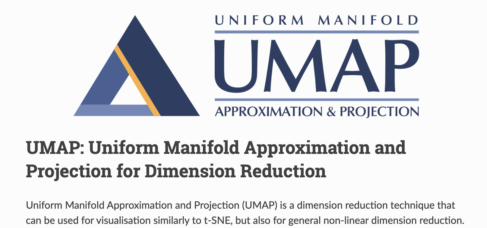

# GraphRAG 索引构建之知识提取（二）

昨天我们学习了知识提取阶段的提取图谱工作流，今天我们继续学习另外两个：**图谱规范化** 和 **提取事实声明**。

## 图谱规范化

提取出的原始实体和关系需要进一步处理才能构成完整的知识图谱，`finalize_graph` 工作流负责这一规范化过程：

```python
async def run_workflow(
  config: GraphRagConfig,
  context: PipelineRunContext,
) -> WorkflowFunctionOutput:

  # 1. 加载实体和关系
  entities = await load_table_from_storage("entities", context.output_storage)
  relationships = await load_table_from_storage("relationships", context.output_storage)

  # 2. 执行图谱规范化
  final_entities, final_relationships = finalize_graph(
    entities,
    relationships,
    embed_config=config.embed_graph,
    layout_enabled=config.umap.enabled,
  )

  # 3. 保存结果
  await write_table_to_storage(final_entities, "entities", context.output_storage)
  await write_table_to_storage(final_relationships, "relationships", context.output_storage)
  if config.snapshots.graphml:
    # 生成图描述文件
    graph = create_graph(final_relationships, edge_attr=["weight"])
    await snapshot_graphml(
      graph,
      name="graph",
      storage=context.output_storage,
    )
```

处理流程很清晰，首先加载上一步提取的实体和关系，然后调用 `finalize_graph()` 函数对其进行规范化处理，最后将处理后的数据重新保存，并根据配置生成 GraphML 图描述文件，便于外部工具进行图分析和可视化，这也就是我们之前学习可视化时所导入的文件。

其中 `finalize_graph()` 函数的实现如下：

```python
def finalize_graph(
  entities: pd.DataFrame,
  relationships: pd.DataFrame,
  embed_config: EmbedGraphConfig | None = None,
  layout_enabled: bool = False,
) -> tuple[pd.DataFrame, pd.DataFrame]:
  # 实体规范化
  final_entities = finalize_entities(
    entities, relationships, embed_config, layout_enabled
  )
  # 关系规范化
  final_relationships = finalize_relationships(relationships)
  return (final_entities, final_relationships)
```

可以看出，它主要包括实体规范化和关系规范化：

* **实体规范化**：使用 NetworkX 创建网络图，计算每个节点的度数，使用 Node2Vec 生成图嵌入向量，使用 UMAP 降维算法进行图布局计算，得到 2D 可视化坐标，为每个实体分配唯一的 UUID 和人类可读的 ID 并输出最终规范化的实体对象；
* **关系规范化**：基于 source 和 target 去除重复的关系，计算每个关系的组合度数，为每个关系分配唯一的 UUID 和人类可读的 ID 并输出最终规范化的关系对象；

下面我们仔细看下这两个部分。

### 实体规范化

实体规范化的逻辑位于 `finalize_entities()` 函数：

```python
def finalize_entities(
  entities: pd.DataFrame,
  relationships: pd.DataFrame,
  embed_config: EmbedGraphConfig | None = None,
  layout_enabled: bool = False,
) -> pd.DataFrame:
  # 创建网络图
  graph = create_graph(relationships, edge_attr=["weight"])
  # 生成图嵌入向量
  graph_embeddings = embed_graph(graph, embed_config)
  # 计算图布局
  layout = layout_graph(graph, layout_enabled, embeddings=graph_embeddings)
  # 计算节点度数
  degrees = compute_degree(graph)
  # 生成最终实体表
  final_entities = (
    entities.merge(layout, left_on="title", right_on="label", how="left")
    .merge(degrees, on="title", how="left")
    .drop_duplicates(subset="title")
  )
  # 字段规整
  final_entities = final_entities.loc[entities["title"].notna()].reset_index()
  final_entities["degree"] = final_entities["degree"].fillna(0).astype(int)
  final_entities.reset_index(inplace=True)
  final_entities["human_readable_id"] = final_entities.index
  final_entities["id"] = final_entities["human_readable_id"].apply(
    lambda _x: str(uuid4())
  )
  # 只保留预定义的规范化的字段
  return final_entities.loc[
    :,
    ENTITIES_FINAL_COLUMNS,
  ]
```

这个函数还比较有意思，涉及了多个图分析和机器学习技术。比如图的构建：

```python
graph = nx.from_pandas_edgelist(edges, edge_attr=["weight"])
```

这里使用 NetworkX 库从边列表构建无向图，同时保留边的权重属性，支持加权图分析。基于这个图，我们可以计算每个节点的度数：

```python
def compute_degree(graph: nx.Graph) -> pd.DataFrame:
  return pd.DataFrame([
    {"title": node, "degree": int(degree)}
    for node, degree in graph.degree
  ])
```

节点度数反映了实体的重要性和连接性，为后续的图分析提供数据基础。

再比如使用 Node2Vec 对图进行嵌入：

```python
embeddings = embed_node2vec(
  graph=graph,
  dimensions=config.dimensions,   # 默认1536维
  num_walks=config.num_walks,     # 默认10次随机游走
  walk_length=config.walk_length, # 默认40步长
  window_size=config.window_size, # 默认2窗口大小
  iterations=config.iterations,   # 默认3次迭代
  random_seed=config.random_seed, # 默认86种子
)
```

该功能默认禁用，可通过下面的配置开启：

```yaml
embed_graph:
  enabled: true
```

这里其实使用的是 graspologic 库的 `embed.node2vec_embed()` 方法，感兴趣的可以看下 graspologic 的文档：

* https://graspologic-org.github.io/graspologic/reference/reference/embed.html

通过将节点映射到 1536 维向量空间，捕获图的拓扑结构和语义信息，主要用于图的可视化分析。

此外，我们还可以通过下面的配置，在图嵌入之前将图限制为 **最大连通分量（Largest Connected Component, LCC）**：

```yaml
embed_graph:
  use_lcc: true
```

这意味着只有图中最大的连通子图会被用于生成嵌入向量，孤立的节点或较小的连通分量会被过滤掉。这样做的好处是：

* 提高嵌入质量：Node2Vec 算法需要在图上进行随机游走，连通的图能产生更有意义的节点嵌入；
* 确保稳定性：使用相同的最大连通分量可以确保结果的一致性；
* 高效率：只处理最重要的连通部分，减少计算开销；

> LCC 的计算同样使用的 graspologic 库，参考 `utils.largest_connected_component()` 函数。

此外，`finalize_entities()` 函数还使用了降维技术，通过 **UMAP** 算法对上一步计算的图嵌入执行降维操作，为实体提供 x/y 位置坐标，便于在 2D 平面下进行可视化分析。这个功能同样需要在配置中开启：

```yaml
umap:
  enabled: true # 必须同时开启 embed_graph 功能
```

UMAP 的全称为 **均匀流形逼近与投影（Uniform Manifold Approximation and Projection）**，是一种用于高维数据降维的机器学习算法。它在保留数据的局部和全局结构方面表现出色，广泛应用于数据可视化、特征学习等领域，与 **t-SNE** 等算法类似，但在计算效率和保留全局结构上往往更具优势。



直接使用 `umap-learn` 库计算即可：

```python
embedding_positions = umap.UMAP(
  min_dist=min_dist,         # 默认0.75最小距离，控制点的紧密程度
  n_neighbors=n_neighbors,   # 默认5个邻居，控制局部/全局平衡
  spread=spread,             # 默认1传播参数
  n_components=2,            # 2D可视化
  metric="euclidean",        # 欧几里得距离
  random_state=86,           # 随机种子
).fit_transform(embedding_vectors)
```

对这些参数感兴趣的同学可以参考 `umap-learn` 的官方文档：

* https://umap-learn.readthedocs.io/en/latest/

> 关于 UMAP 降维，我们之前在学习 RAGFlow 的 RAPTOR 分块策略时也曾简单介绍过，只不过 RAGFlow 是对分块的 Embedding 向量进行降维，方便做聚类，而这里是对 Node2Vec 图嵌入进行降维，用于图的可视化。

上面这些计算结果，最终都会融合到原始的实体表中：

```python
final_entities = (
  entities.merge(layout, left_on="title", right_on="label", how="left")
    .merge(degrees, on="title", how="left")
    .drop_duplicates(subset="title")
)
```

通过 pandas 的左连接策略，确保所有原始实体都被保留，然后过滤 title 为空的记录，对 degree 为空的用 0 填充，以及 UUID 和 ID 的生成，最后使用预定义的 `ENTITIES_FINAL_COLUMNS` 生成规范化的实体表，包含如下字段：

- `id`：实体唯一标识符
- `human_readable_id`：人类可读的递增ID
- `title`：实体名称
- `type`：实体类型
- `description`：实体描述
- `text_unit_ids`：来源文本单元ID
- `frequency`：出现频次
- `degree`：节点度数
- `x` 和 `y`：2D 坐标

### 关系规范化

关系规范化的逻辑相对简洁，没有那么多的弯弯绕绕，位于 `finalize_relationships()` 函数：

```python
def finalize_relationships(
  relationships: pd.DataFrame,
) -> pd.DataFrame:
  # 创建网络图
  graph = create_graph(relationships, edge_attr=["weight"])
  # 计算节点度数
  degrees = compute_degree(graph)
  # 基于 source 和 target 去重
  # 注意这里没有区分关系方向，也没有区分关系类型
  final_relationships = relationships.drop_duplicates(subset=["source", "target"])
  # 计算关系的组合度数
  final_relationships["combined_degree"] = compute_edge_combined_degree(final_relationships, degrees)
  # 字段规整
  final_relationships.reset_index(inplace=True)
  final_relationships["human_readable_id"] = final_relationships.index
  final_relationships["id"] = final_relationships["human_readable_id"].apply(
    lambda _x: str(uuid4())
  )
  # 只保留预定义的规范化的字段
  return final_relationships.loc[
    :,
    RELATIONSHIPS_FINAL_COLUMNS,
  ]
```

首先从关系数据构建图结构，计算节点度数，然后对关系去重处理，计算关系的组合度数，最后字段规整，并通过 `RELATIONSHIPS_FINAL_COLUMNS` 只保留预定义的规范化字段：

- `id`：关系唯一标识符
- `human_readable_id`：人类可读的递增ID
- `source`：关系的源实体
- `target`：关系的目标实体
- `description`：关系描述
- `weight`：关系权重
- `combined_degree`：组合度数
- `text_unit_ids`：关联的文本单元

## 事实声明提取

除了实体和关系，GraphRAG 还可以从文本单元中提取事实性的 **声明（Claims）**，为每个实体提供更丰富的上下文信息。

> 在 GraphRAG 中，**声明（Claims）提取** 有的地方也被称为 **协变量（Covariates）提取**。协变量是一个统计学中的概念，指的是与 **因变量（被解释变量）** 相关，但并非研究中主要关注的 **自变量（解释变量）** 的变量，协变量可能干扰自变量与因变量之间的关系。例如，在研究 “教育水平对收入的影响” 时，“工作经验” 就是一个协变量，它与收入相关，若不控制，可能会混淆教育水平与收入之间的真实关系。协变量提取就是通过一系列方法，从原始数据中识别、筛选出对研究目标有潜在影响的协变量，并将其作为分析变量纳入模型或研究设计中的过程。而声明是关于实体之间的事实性陈述，通常包含主体和客体，声明提取是协变量识别的一种方式。

该工作流默认关闭，需要在 `settings.yaml` 中开启：

```yaml
extract_claims:
  enabled: true
  model_id: default_chat_model
  prompt: "prompts/extract_claims.txt"
  description: "Any claims or facts that could be relevant to information discovery."
  max_gleanings: 1
```

从配置可以看出，声明提取和图谱提取非常类似，都是使用预定义的提示词模板指导大模型提取结构化信息，也可以通过 `max_gleanings` 配置支持多轮提取。提取的声明包含主体、客体、关系类型、状态、时间范围等结构化信息：

- `subject_id`: 声明的主体
- `object_id`: 声明的客体  
- `type`: 声明类型
- `status`: 声明状态（已确认/虚假/未经验证）
- `start_date`: 开始日期
- `end_date`: 结束日期
- `description`: 声明描述
- `source_text`: 来源文本

声明提取的默认提示词如下：

```
-目标活动-
你是一个智能助手，帮助人类分析师分析文本文档中针对某些实体的声明。

-目标-
给定一个可能与该活动相关的文本文档、一个实体规范和一个声明描述，提取所有符合实体规范的实体以及针对这些实体的所有声明。

-步骤-
1. 提取所有符合预定义实体规范的命名实体。实体规范可以是实体名称列表或实体类型列表。
2. 对于步骤1中识别出的每个实体，提取与该实体相关的所有声明。声明需要与指定的声明描述相匹配，并且该实体应是声明的主体。
对于每个声明，提取以下信息：
- 主体：作为声明主体的实体名称，需大写。主体实体是实施声明中所描述行为的实体。主体必须是步骤1中识别出的命名实体之一。
- 客体：作为声明客体的实体名称，需大写。客体实体是要么报告/处理该行为，要么受该行为影响的实体。如果客体实体未知，使用**NONE**。
- 声明类型：声明的总体类别，需大写。命名方式应能在多个文本输入中重复使用，以便相似的声明具有相同的声明类型。
- 声明状态：**TRUE**、**FALSE**或**SUSPECTED**。TRUE表示声明已确认，FALSE表示声明被证实为虚假，SUSPECTED表示声明未经验证。
- 声明描述：详细说明声明背后的推理，以及所有相关证据和参考资料。
- 声明日期：提出声明的时间段（开始日期，结束日期）。开始日期和结束日期都应采用ISO-8601格式。如果声明是在单个日期而非日期范围内提出的，则开始日期和结束日期设置为相同的日期。如果日期未知，返回**NONE**。
- 声明来源文本：所有与该声明相关的原始文本引语列表。

每个声明的格式为：(<主体实体><|><客体实体><|><声明类型><|><声明状态><|><声明开始日期><|><声明结束日期><|><声明描述><|><声明来源>)

3. 以英文返回所有在步骤1和步骤2中识别出的声明，形成一个单一列表。使用**##**作为列表分隔符。

4. 完成后，输出 <|COMPLETE|>
```

官方还提供了两个示例，可以直观的看出 GraphRAG 是如何通过实体规范（对应提取的实体或关系）和声明描述（对应 `extract_claims.description` 配置）从文本中提取出详细的声明信息的：

```
示例1：
实体规范：组织
声明描述：与实体相关的危险信号
文本：根据2022年1月10日的一篇文章，A公司在参与B政府机构发布的多个公共招标时，因串标被罚款。该公司为C个人所有，C个人在2015年被怀疑参与腐败活动。
输出：

(A公司<|>B政府机构<|>反竞争行为<|>TRUE<|>2022-01-10T00:00:00<|>2022-01-10T00:00:00<|>根据2022年1月10日发表的一篇文章，A公司因在B政府机构发布的多个公共招标中串标被罚款，因此被发现存在反竞争行为<|>根据2022年1月10日的一篇文章，A公司在参与B政府机构发布的多个公共招标时，因串标被罚款。)
<|COMPLETE|>

示例2：
实体规范：A公司、C个人
声明描述：与实体相关的危险信号
文本：根据2022年1月10日的一篇文章，A公司在参与B政府机构发布的多个公共招标时，因串标被罚款。该公司为C个人所有，C个人在2015年被怀疑参与腐败活动。
输出：

(A公司<|>B政府机构<|>反竞争行为<|>TRUE<|>2022-01-10T00:00:00<|>2022-01-10T00:00:00<|>根据2022年1月10日发表的一篇文章，A公司因在B政府机构发布的多个公共招标中串标被罚款，因此被发现存在反竞争行为<|>根据2022年1月10日的一篇文章，A公司在参与B政府机构发布的多个公共招标时，因串标被罚款。)
##
(C个人<|>NONE<|>贪污腐败<|>SUSPECTED<|>2015-01-01T00:00:00<|>2015-12-30T00:00:00<|>C个人在2015年被怀疑参与腐败活动<|>该公司为C个人所有，C个人在2015年被怀疑参与腐败活动。)
<|COMPLETE|>
```

声明提取工作流为 GraphRAG 知识图谱增加了时间维度和事实信息，使得其能够追踪实体间关系的时间演变，支持基于时间的查询和推理，提供更丰富的上下文信息用于回答复杂问题。这个工作流与实体关系提取互补，共同构建了一个多层次、多维度的知识表示体系。

## 小结

今天的学习内容主要包括以下两点：

* **图谱规范化处理**：了解实体和关系规范化的复杂流程，包括图嵌入、UMAP 降维、度数计算等多种图分析技术的综合应用；
* **可选的声明提取**：学习如何提取时间相关的事实性声明，为知识图谱增加时间维度和事实验证能力；

通过这个阶段的处理，原本杂乱无序的文本信息被转换为结构化的实体表和关系表，为后续的社区检测和向量化奠定基础。在下一篇文章中，我们将继续学习关于知识提取的内容，还记得我们之前在概述篇提到的，GraphRAG 支持 `Standard` 和 `Fast` 两种索引方法，`Standard` 方法基于大模型实现，也就是这两天学习的内容，`Fast` 方法基于传统的 NLP 算法实现，我们接下来就来看看这一部分内容。
