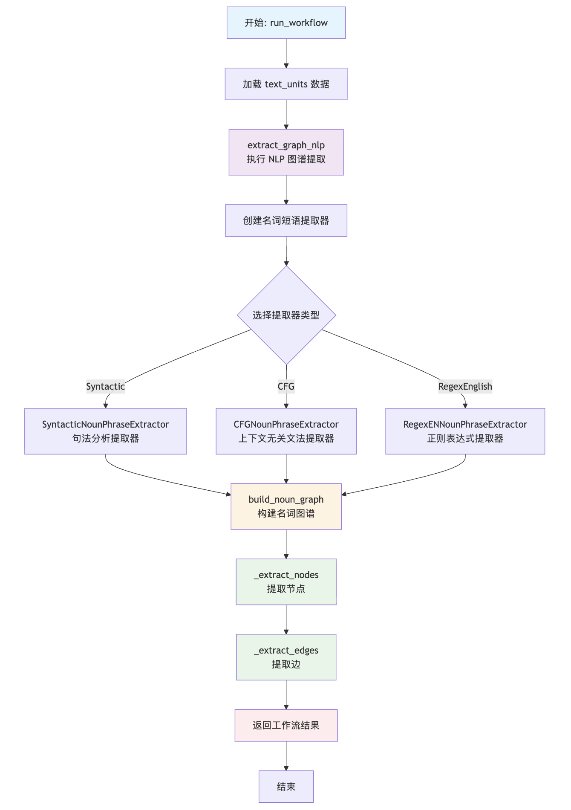
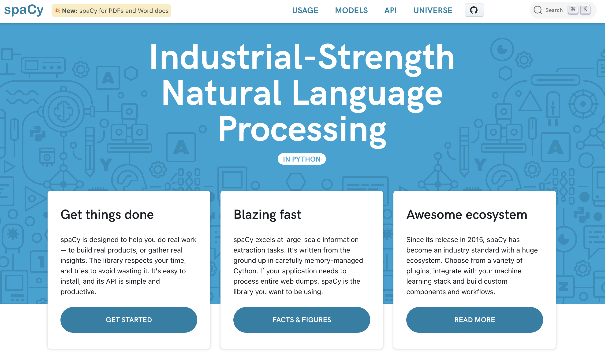
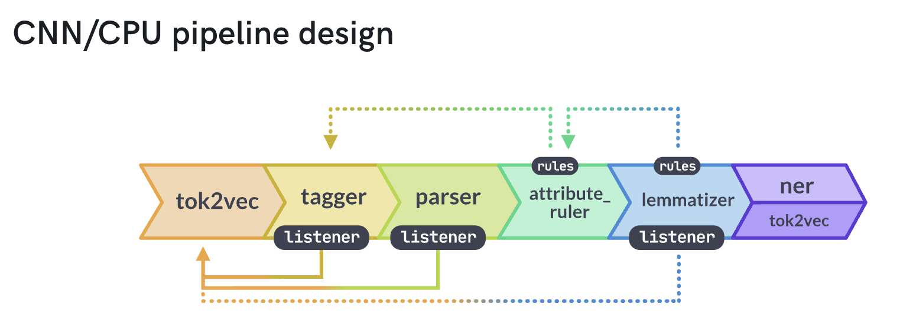
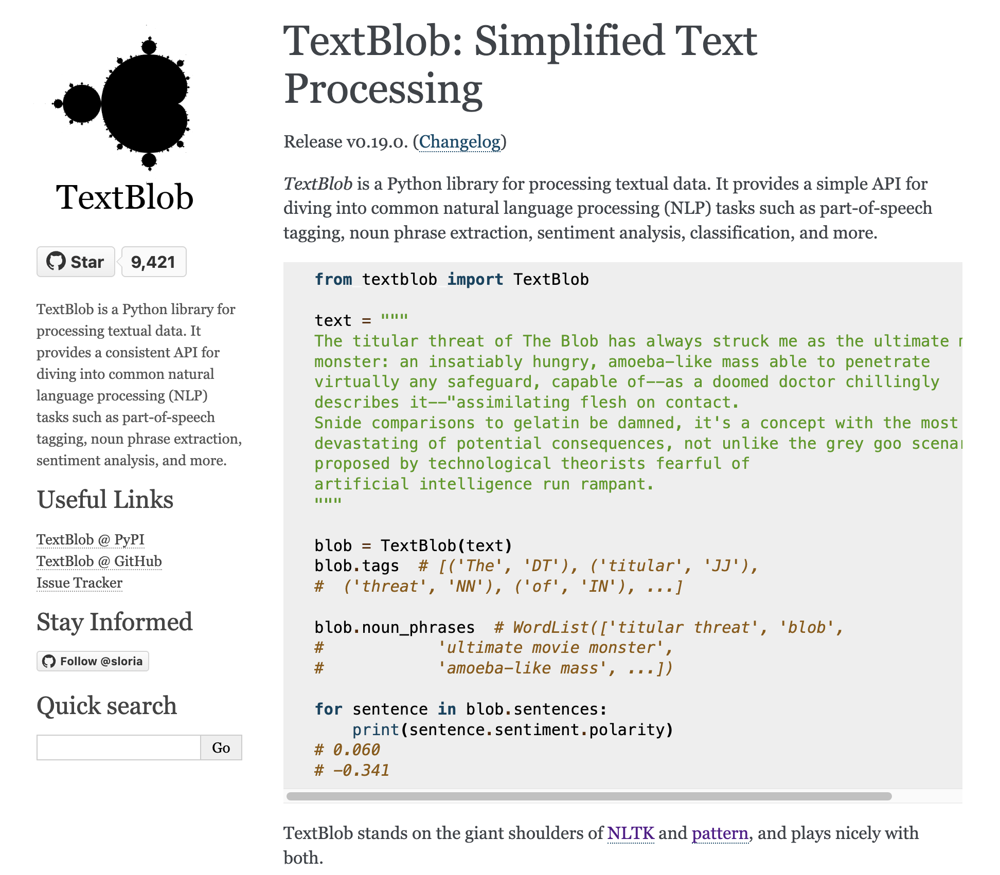

# GraphRAG 索引构建之知识提取（三）

今天，我们将继续学习 GraphRAG 中关于知识提取的内容。上周的 `extract_graph` 工作流，完全基于大语言模型进行实体关系提取，质量高但速度较慢；为此 GraphRAG 还提供了另一种实现，基于传统的自然语言处理（NLP）技术，实现更快速、更低成本的实体关系提取。我们可以通过 **Fast 索引方法** 开启该功能：

```
$ graphrag index --root ./ragtest --method fast
```

我们重点学习 Fast 方法中的两个核心工作流：

- **基于 NLP 的图谱提取（`extract_graph_nlp`）** - 使用 NLP 技术从文本中提取名词短语作为实体
- **图谱修剪（`prune_graph`）** - 对提取结果进行统计过滤和清理

## 基于 NLP 的图谱提取

`extract_graph_nlp` 工作流的核心实现位于 `index/workflows/extract_graph_nlp.py` 文件，整个流程相当简洁：

```python
async def run_workflow(
  config: GraphRagConfig,
  context: PipelineRunContext,
) -> WorkflowFunctionOutput:
  # 1. 加载文本单元
  text_units = await load_table_from_storage("text_units", context.output_storage)

  # 2. 执行 NLP 图谱提取
  entities, relationships = await extract_graph_nlp(
    text_units,
    extraction_config=config.extract_graph_nlp,
  )

  # 3. 保存结果
  await write_table_to_storage(entities, "entities", context.output_storage)
  await write_table_to_storage(relationships, "relationships", context.output_storage)
```

与基于大模型的 `extract_graph` 相比，这个工作流的实现要简单得多，核心逻辑都封装在 `extract_graph_nlp()` 函数中：

```python
async def extract_graph_nlp(
  text_units: pd.DataFrame,
  extraction_config: ExtractGraphNLPConfig,
) -> tuple[pd.DataFrame, pd.DataFrame]:
  # 创建名词短语提取器
  text_analyzer = create_noun_phrase_extractor(text_analyzer_config)

  # 构建名词图谱
  extracted_nodes, extracted_edges = await build_noun_graph(
    text_units,
    text_analyzer=text_analyzer,
    normalize_edge_weights=extraction_config.normalize_edge_weights,
    num_threads=extraction_config.concurrent_requests,
  )

  # 添加下游工作流所需的字段
  extracted_nodes["type"] = "NOUN PHRASE"
  extracted_nodes["description"] = ""
  extracted_edges["description"] = ""

  return (extracted_nodes, extracted_edges)
```

整个工作流的执行流程如下：



大致可分为三个步骤：首先创建名词短语提取器，然后构建名词图谱，最后为提取的节点和边添加必要的元数据字段。

## 名词短语提取器

GraphRAG 提供了三种不同的名词短语提取方法，每种都有其独特的优势和适用场景，通过工厂模式进行统一管理：

```python
class NounPhraseExtractorFactory:
  @classmethod
  def get_np_extractor(cls, config: TextAnalyzerConfig) -> BaseNounPhraseExtractor:
    # 根据配置创建名词短语提取器
    match np_extractor_type:
      # 句法分析提取器
      case NounPhraseExtractorType.Syntactic:
        return SyntacticNounPhraseExtractor(...)
      # 上下文无关文法提取器
      case NounPhraseExtractorType.CFG:
        return CFGNounPhraseExtractor(...)
      # 正则表达式提取器
      case NounPhraseExtractorType.RegexEnglish:
        return RegexENNounPhraseExtractor(...)
```

我们可以在 `settings.yaml` 中配置使用哪种提取器：

```yaml
extract_graph_nlp:
  text_analyzer:
    extractor_type: regex_english # [regex_english, syntactic_parser, cfg]
```

三种提取器的特点如下：

* **句法分析提取器（Syntactic）**：基于 **依存句法分析（Dependency Parsing）** 和 **命名实体识别（NER）** 的名词短语提取器，使用 SpaCy 实现。该提取器相比基于正则表达式的提取器往往能产生更准确的结果，但速度较慢。此外，通过使用 SpaCy 相应的模型，它可以用于不同的语言。
* **上下文无关文法提取器（CFG）**：基于 **上下文无关文法（CFG）** 和 **命名实体识别（NER）** 的名词短语提取器，同样使用 SpaCy 实现。该提取器往往比基于句法分析的提取器更快，但对于不同语言可能需要修改语法规则。
* **正则表达式提取器（RegexEnglish）**：基于正则表达式的名词短语提取器，使用 TextBlob 实现。它是默认提取器，也是 [LazyGraphRAG](https://www.microsoft.com/en-us/research/blog/lazygraphrag-setting-a-new-standard-for-quality-and-cost/) 首次基准测试中使用的提取器，但它只适用于英文。它比基于句法分析的提取器更快，但准确性可能更低。

下表是三种提取器的一个简单对比：

| 特性 | Syntactic | CFG | RegexEnglish |
|------|-----------|-----|--------------|
| **准确性** | 最高 | 中等 | 较低 |
| **速度** | 最慢 | 中等 | 最快 |
| **多语言** | 支持 | 需配置 | 仅英语 |
| **资源占用** | 高 | 中等 | 低 |
| **依赖复杂度** | SpaCy 模型 | SpaCy 基础 | TextBlob+NLTK |
| **可定制性** | 配置参数 | 语法规则 | 有限 |

建议根据实际的需求进行选择，比如：高质量需求选择 Syntactic 提取器，快速原型选择 RegexEnglish 提取器，平衡性能选择 CFG 提取器。下面我们将详细介绍这三种提取器的实现，但在深入具体源码之前，让我们先了解一下这些提取器所依赖的核心 NLP 库。

## SpaCy 简单介绍

[SpaCy](https://spacy.io/) 是一个专为生产环境设计的现代自然语言处理库，在 GraphRAG 的名词短语提取中扮演着重要角色。它提供了高效的文本处理管道，支持多种语言和复杂的 NLP 任务。



SpaCy 基于 Cython 实现，处理速度极快，支持 75+ 不同的语言，并内置了多种语言的预训练模型，下面是一些常用的 SpaCy 模型：

- `en_core_web_sm`: 英语小型模型（12MB）- 基础功能
- `en_core_web_md`: 英语中型模型（31MB）- 包含词向量
- `en_core_web_lg`: 英语大型模型（382MB）- 高精度
- `zh_core_web_sm`: 中文小型模型（46MB）- 支持中文处理

每一种模型都采用管道（Pipeline）架构，文本按顺序经过多个处理组件，每个组件可以选择性的启用或禁用：



这些组件包括：

- `tok2vec`: 将文本转换为向量表示
- `tagger`: 词性标注器，为每个词（token）分配词性标签（Part-of-Speech Tag）
- `parser`: 句法分析器，分析句子的句法结构，包括词语之间的依赖关系（Dependency Parsing）
- `attribute_ruler`: 属性规则器，通过自定义规则修正或补充文本的属性（如词性、形态等）
- `lemmatizer`: 词形还原器，将词语还原为其基本形式（词根）
- `ner`: 命名实体识别器，识别文本中的命名实体（Named Entity）并分类

更多关于 SpaCy 模型、管道和组件的内容，可参考下面的文档：

* https://spacy.io/models

让我们通过一个简单的示例来了解 SpaCy 的基本功能。首先，下载我们所需的模型：

```
$ python -m spacy download en_core_web_sm
```

通过 `spacy.load` 加载模型：

```python
import spacy

nlp = spacy.load("en_core_web_sm")
```

然后准备一段简单的测试文本：

```python
text = "Apple Inc, founded by Steve Jobs, develops innovative iPhone technology in California."
doc = nlp(text)
```

接下来就可以使用 SpaCy 的各个功能了，比如分词和词性标注：

```python
for token in doc:
  print(f"{token.text:12} {token.pos_:8} {token.tag_:6} {token.lemma_}")
```

这里的几个属性解释如下：

- `text` 为单词的原始文本；
- `pos_` 为单词的词性，比如名词（noun）、动词（verb）、形容词（adjective）、副词（adverb）等；
- `tag` 为词性标签，用于表示具体词性的符号或缩写，不同的标注体系会定义不同的 TAG 符号，例如在英文的 Penn Treebank 标注体系中，"NN" 表示名词（noun, singular），"VB" 表示动词（verb, base form），"JJ" 表示形容词（adjective）；而在中文的北大分词标注体系中，"n" 表示名词，"v" 表示动词，"a" 表示形容词等；
- `lemma` 为词根或词元，指的是将词语的各种变形形式（如过去式、复数、比较级等）还原为其最基本的形式，比如将 "running" 还原为 "run"，"better" 还原为 "good" 等；

上面的代码输出如下：

```
Apple        PROPN    NNP    Apple
Inc          PROPN    NNP    Inc
,            PUNCT    ,      ,
founded      VERB     VBN    found
by           ADP      IN     by
Steve        PROPN    NNP    Steve
Jobs         PROPN    NNP    Jobs
,            PUNCT    ,      ,
develops     VERB     VBZ    develop
innovative   ADJ      JJ     innovative
iPhone       PROPN    NNP    iPhone
technology   NOUN     NN     technology
in           ADP      IN     in
California   PROPN    NNP    California
.            PUNCT    .      .
```

命名实体识别和名词块提取功能：

```python
for ent in doc.ents:
  print(f"{ent.text:20} {ent.label_:10} {spacy.explain(ent.label_)}")

for chunk in doc.noun_chunks:
  print(f"{chunk.text:25} {chunk.root.text:10} {chunk.root.dep_}")
```

输出如下：

```
# 命名实体
Apple Inc            ORG        Companies, agencies, institutions, etc.
Steve Jobs           PERSON     People, including fictional
California           GPE        Countries, cities, states

# 名词块
Apple Inc                 Inc        nsubj
Steve Jobs                Jobs       pobj
innovative iPhone technology technology dobj
California                California pobj
```

命名实体（entities）和名词块（noun_chunks）是 SpaCy 中两个不同的概念，但很容易混淆。命名实体基于 NER 模型识别，而名词块基于句法分析识别，命名实体相对于名词块更具语义性，比如 "The big red car was expensive" 这句话，通过识别语法上的名词短语结构，可以抽取出 "The big red car" 名词块，但是可能抽不出命名实体。

## TextBlob 简单介绍

TextBlob 是一个简单而强大的 Python 文本处理库，专为快速原型开发和教学设计。在 GraphRAG 的 RegexEnglish 提取器中，TextBlob 提供了高效的英语文本处理能力。



TextBlob 的核心特性如下：

- **简洁的 API**：提供直观的文本处理接口
- **快速处理**：基于 NLTK 和正则表达式的高效实现
- **内置功能**：集成了常用的 NLP 任务
- **轻量级**：依赖少，安装简单

TextBlob 提供了丰富的文本处理功能：

```python
from textblob import TextBlob

# 创建 TextBlob 对象
text = "Apple Inc, founded by Steve Jobs, develops innovative iPhone technology in California."
blob = TextBlob(text)

# 1. 分词
print("分词结果：")
print(blob.words)
# 输出：['Apple', 'Inc', 'founded', 'by', 'Steve', 'Jobs', 'develops', 'innovative', 'iPhone', 'technology', 'in', 'California']

# 2. 句子分割
print("\n句子分割：")
for sentence in blob.sentences:
    print(f"- {sentence}")
# 输出：- Apple Inc, founded by Steve Jobs, develops innovative iPhone technology in California.

# 3. 词性标注
print("\n词性标注：")
for word, pos in blob.tags:
    print(f"{word:12} {pos}")
# 输出：
# Apple        NNP
# Inc          NNP  
# founded      VBN
# by           IN
# Steve        NNP
# ...

# 4. 名词短语
print("\n名词短语：")
for noun in blob.noun_phrases:
    print(f"- {noun}")
# 输出：
# - apple inc
# - steve jobs
# - innovative iphone technology
# - california
```

由于 TextBlob 基于 NLTK 实现，它依赖 NLTK 的一些资源，比如 `punkt_tab` 用于分割句子，`averaged_perceptron_tagger_eng` 用于词性标注，`brown` 用于名词短语提取（布朗语料库），可以通过 `textblob.download_corpora` 全量下载：

```
$ python -m textblob.download_corpora
```

可以看出，TextBlob 的功能和 SpaCy 是有部分重合的，TextBlob 的优势是轻量级、简单易用、快速上手，比较适合原型开发和教学，但是它准确性有限、多语言支持不足、扩展性和配置选项相对较少，在生产环境建议还是使用 SpaCy。因此在 GraphRAG 的代码里也可以看到，作者计划将 TextBlob 移除，使用 SpaCy 来重新实现 RegexEnglish 提取器。

## 未完待续

我们今天主要学习 GraphRAG 中基于 NLP 的知识提取流程，这是 Fast 索引方法的核心组件。我们了解到 Fast 索引方法中关于知识提取的有两个工作流：**基于 NLP 的图谱提取** 和 **图谱修剪**。为了更好地学习相关的提取技术，我们先介绍了 SpaCy 和 TextBlob 这两个 NLP 库的使用，通过简单示例加深基本概念的理解。

明天我们将继续学习这部分内容，包括三种名词短语提取器的实现原理，通过共现关系构建边，以及多种不同的图谱修剪策略。
