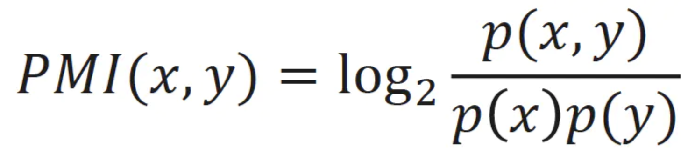

# GraphRAG 索引构建之知识提取（四）

我们昨天大概了解了基于 NLP 的知识提取流程，为了更好地学习相关的提取技术，我们简单介绍了 SpaCy 和 TextBlob 这两个 NLP 库的基本使用。有了 SpaCy 和 TextBlob 的基础，我们再回过头来看看 `extract_graph_nlp` 工作流中的三大名词短语提取器。

## 句法分析提取器（Syntactic）

首先是句法分析提取器，其核心实现位于 `SyntacticNounPhraseExtractor` 类：

```python
def __init__(
  self,
  model_name: str,
  max_word_length: int,
  include_named_entities: bool,
  exclude_entity_tags: list[str],
  exclude_pos_tags: list[str],
  exclude_nouns: list[str],
  word_delimiter: str,
):
  # 根据是否需要命名实体识别来决定加载的组件
  if not include_named_entities:
    # 排除命名实体识别器，提升处理速度
    self.nlp = self.load_spacy_model(model_name, exclude=["lemmatizer", "ner"])
  else:
    # 保留命名实体识别器，只排除词形还原器
    self.nlp = self.load_spacy_model(model_name, exclude=["lemmatizer"])
```

从初始化函数可以看出该提取器有不少配置参数：

```yaml
extract_graph_nlp:
  text_analyzer:
    extractor_type: syntactic_parser
    model_name: en_core_web_md   # SpaCy 模式
    max_word_length: 15          # 最大单词长度
    word_delimiter: " "          # 单词分隔符
    include_named_entities: true # 是否开启命名实体识别
    exclude_nouns:               # 排除停用词，大多是日常交流中使用频繁但本身不携带太多关键信息的词汇
      - stuff
      - thing
      - things
      - ...
    exclude_entity_tags:         # 排除指定类型的实体
      - DATE   # 日期
    exclude_pos_tags:            # 排除特定的词性标签
      - DET    # 限定词，如 a an the 等
      - PRON   # 代词，如 he she it 等
      - INTJ   # 感叹词，如 oh wow hey 等
      - X      # 其他
```

句法分析提取器根据 `include_named_entities` 参数加载 SpaCy 模型，默认模型是 `en_core_web_md`，为提高性能，加载模型时排除了 `lemmatizer` 模块（词形还原器），如果用户关闭了命名实体识别，还会排除 `ner` 模块（命名实体识别器）。

该提取器的核心实现如下：

```python
def extract(self, text: str) -> list[str]:
  
  # SpaCy 文本分析
  doc = self.nlp(text)

  if self.include_named_entities:
    # 命名实体 + 名词块
    entities = [
      ent for ent in doc.ents
      if ent.label_ not in self.exclude_entity_tags
    ]
    spans = entities + list(doc.noun_chunks)

    # 根据规则过滤
    tagged_noun_phrases = [
      self._tag_noun_phrases(span, entities) for span in spans
    ]
  else:
    # 直接获取名词块，根据规则过滤
    tagged_noun_phrases = [
      self._tag_noun_phrases(chunk, []) for chunk in doc.noun_chunks
    ]
```

如果开启了命名实体识别，则将 SpaCy 提取的命名实体（`ents`）和名词块（`noun_chunks`）合并，然后通过一些规则进行过滤得到结果；如果未开启，则直接获取名词块，根据规则过滤。过滤规则比较细碎，比如根据 `exclude_entity_tags` 排除特定类型的实体，根据 `exclude_pos_tags` 排除特定词性，根据 `exclude_nouns` 排除停用词，排除空格和标点，根据 `max_word_length` 判断长度是否有效，等等。

## 上下文无关文法提取器（CFG）

第二个是上下文无关文法（CFG，Context-Free Grammar）提取器，其核心实现位于 `CFGNounPhraseExtractor` 类：

```python
def __init__(
  self,
  model_name: str,
  max_word_length: int,
  include_named_entities: bool,
  exclude_entity_tags: list[str],
  exclude_pos_tags: list[str],
  exclude_nouns: list[str],
  word_delimiter: str,
  noun_phrase_grammars: dict[tuple, str],
  noun_phrase_tags: list[str],
):
  # 根据是否需要命名实体识别来决定加载的组件
  if not include_named_entities:
    # 排除命名实体识别器，提升处理速度
    self.nlp = self.load_spacy_model(model_name, exclude=["lemmatizer", "parser", "ner"])
  else:
    # 保留命名实体识别器，只排除词形还原器和句法分析器
    self.nlp = self.load_spacy_model(model_name, exclude=["lemmatizer", "parser"])
```

可以看出这个提取器和句法分析提取器非常像，同样是基于 SpaCy 实现的，而且配置参数也基本上一样。只不过 CFG 提取器在加载模型时排除了句法分析器（`parser`），因为它不依赖复杂的依存句法分析，只需要基本的词性标注功能即可。另外，它在初始化函数里多了两个参数：

```yaml
extract_graph_nlp:
  text_analyzer:
    extractor_type: cfg
    # ... 同上
    noun_phrase_tags:            # 识别名词短语的词性标签
      - PROPN  # 专有名词，指特定的人、地方、组织等的名称，如 "London"（伦敦）、"Apple"（苹果公司）、"Alice"（爱丽丝）等
      - NOUNS  # 普通名词，如 "book"（书）、"city"（城市）、"idea"（想法）等
    noun_phrase_grammars:        # CFG 语法规则
      "PROPN,PROPN": "PROPN"
      "NOUN,NOUN": "NOUNS"
      "NOUNS,NOUN": "NOUNS"
      "ADJ,ADJ": "ADJ"
      "ADJ,NOUN": "NOUNS"
```

这两个参数就是 CFG 提取器的核心，CFG 其实是一种形式语法，由四元组 G = (V, Σ, R, S) 定义：

- V: 非终结符集合 (如 NP, VP)
- Σ: 终结符集合 (如具体单词)
- R: 产生式规则集合 (如 NP → DT NN)
- S: 起始符号

光看这个定义可能比较抽象，实际上就是先定义一个 CFG 规则集合，集合中包含多个键值对，键为词性标签对 `(POS1, POS2)`，值为合并后的词性，比如上面的配置对应下面的语法规则：

```
"PROPN,PROPN": "PROPN", # 专有名词 + 专有名词 → 专有名词
"NOUN,NOUN": "NOUNS",   # 名词 + 名词 → 复合名词  
"NOUNS,NOUN": "NOUNS",  # 复合名词 + 名词 → 复合名词
"ADJ,ADJ": "ADJ",       # 形容词 + 形容词 → 形容词
"ADJ,NOUN": "NOUNS",    # 形容词 + 名词 → 复合名词
```

然后依次获取相邻两个词的词性标签对，在规则集合中查找匹配的规则并合并，通过反复应用语法规则，将简单词汇组合成更复杂的名词短语。我们看一个具体的例子，假设有文本 "big red car"，处理过程如下：

1. 初始标注: [("big", "ADJ"), ("red", "ADJ"), ("car", "NOUN")]
2. 第一轮合并:
    - 检查 ("ADJ", "ADJ") → 找到规则 "ADJ,ADJ": "ADJ"
    - 合并: [("big red", "ADJ"), ("car", "NOUN")]
3. 第二轮合并:
    - 检查 ("ADJ", "NOUN") → 找到规则 "ADJ,NOUN": "NOUNS"
    - 合并: [("big red car", "NOUNS")]
4. 结果筛选:
    - 如果 "NOUNS" 在 noun_phrase_tags 中，则提取为名词短语

CFG 提取器的核心就是一个迭代式的合并算法：

```python
def extract_cfg_matches(self, doc: Doc) -> list[tuple[str, str]]:
  # 1. 预处理：提取词汇和词性标注对，过滤无效词汇
  tagged_tokens = [
    (token.text, token.pos_) for token in doc
    if token.pos_ not in self.exclude_pos_tags  # 过滤指定词性
    and token.is_space is False                 # 过滤空格
    and token.text != "-"                       # 过滤连字符
  ]

  # 2. 迭代式合并：持续寻找匹配的语法模式
  merge = True
  while merge:
    merge = False
    for index in range(len(tagged_tokens) - 1):
      first, second = tagged_tokens[index], tagged_tokens[index + 1]
      key = first[1], second[1]  # 构建POS标签对作为查找键
      value = self.noun_phrase_grammars.get(key, None)  # 查找语法规则
      if value:
        # 找到匹配模式：移除原来的两个词汇，插入合并结果
        merge = True
        tagged_tokens.pop(index)     # 移除第一个词汇
        tagged_tokens.pop(index)     # 移除第二个词汇（索引已向前移动）
        match = f"{first[0]}{self.word_delimiter}{second[0]}"  # 合并文本
        pos = value  # 使用语法规则定义的新词性
        tagged_tokens.insert(index, (match, pos))  # 插入合并结果
        break
    
  # 3. 筛选结果：只返回符合目标词性的词汇
  return [t for t in tagged_tokens if t[1] in self.noun_phrase_tags]
```

通过自底向上的迭代合并，CFG 提取器从词汇级别逐步构建更复杂的语法结构，能有效识别复合名词短语，如 "Microsoft Corporation"、"machine learning algorithm" 等。由于少了依存句法分析，CFG 提取器一般比句法分析提取器更快，但需要为不同语言定制语法规则。另外有趣的是，CFG 的提取逻辑实际上参考了 TextBlob 的 [FastNPExtractor](https://github.com/sloria/TextBlob/blob/6dd8b0fdf4ed50989432544041df78274ceb91df/src/textblob/en/np_extractors.py#L92) 实现，感兴趣的可以看下 TextBlob 的源码。

## 正则表达式提取器（RegexEnglish）

这是基于 TextBlob 的最快速提取器，专门针对英语文本优化，它充分利用了前面介绍的 TextBlob 库的名词短语提取能力。核心实现位于 `RegexENNounPhraseExtractor` 类：

```python
def __init__(
    self,
    exclude_nouns: list[str],
    max_word_length: int,
    word_delimiter: str,
):
    # 自动下载必需的语料库
    download_if_not_exists("brown")    # 布朗语料库
    download_if_not_exists("treebank") # 宾州树库
    download_if_not_exists("averaged_perceptron_tagger_eng") # 词性标注器

    # 下载分词器
    download_if_not_exists("punkt")     # 句子分割器
    download_if_not_exists("punkt_tab") # 句子分割器的表格版本

    # 预加载语料库，避免多线程竞争条件
    nltk.corpus.brown.ensure_loaded()
    nltk.corpus.treebank.ensure_loaded()
```

提取器在初始化时会自动下载和预加载所需的 NLTK 资源，另外能看到它的配置参数要简单的多：

```yaml
extract_graph_nlp:
  text_analyzer:
    extractor_type: regex_english
    max_word_length: 15          # 最大单词长度
    word_delimiter: " "          # 单词分隔符
    exclude_nouns:               # 排除停用词，大多是日常交流中使用频繁但本身不携带太多关键信息的词汇
      - stuff
      - thing
      - things
      - ...
```

提取器的核心实现基于 TextBlob 的词性标注和名词短语提取能力：

```python
def extract(self, text: str) -> list[str]:
  # 1. 创建TextBlob对象，自动执行分词和词性标注
  blob = TextBlob(text)
  
  # 2. 提取专有名词：识别NNP标签的词汇
  proper_nouns = [token[0].upper() for token in blob.tags if token[1] == "NNP"]
  
  # 3. 使用TextBlob内置的noun_phrases属性提取名词短语  
  tagged_noun_phrases = [
    self._tag_noun_phrases(chunk, proper_nouns)
    for chunk in blob.noun_phrases  # 
  ]
  
  # 4. 应用过滤规则，保留有效的名词短语
  filtered_noun_phrases = set()
  for tagged_np in tagged_noun_phrases:
    if (
      tagged_np["has_proper_nouns"]           # 包含专有名词
      or len(tagged_np["cleaned_tokens"]) > 1  # 多词短语
      or tagged_np["has_compound_words"]      # 复合词
    ) and tagged_np["has_valid_tokens"]:       # 词汇长度有效
      filtered_noun_phrases.add(tagged_np["cleaned_text"])
      
  return list(filtered_noun_phrases)
```

值得注意的是，这里的 `noun_phrases` 是通过 TextBlob 的 FastNPExtractor 提取的，正如上面所说，CFG 提取器就是参考它实现的，因此这个提取器虽然名字叫正则表达式提取器，实际上仍然是基于 CFG 实现的。

## 名词图谱构建

选定名词短语提取器后，下一步是构建名词图谱，这个过程由 `build_noun_graph()` 函数实现：

```python
async def build_noun_graph(
  text_unit_df: pd.DataFrame,
  text_analyzer: BaseNounPhraseExtractor,
  normalize_edge_weights: bool,
  num_threads: int = 4,
  cache: PipelineCache | None = None,
) -> tuple[pd.DataFrame, pd.DataFrame]:

  # 提取节点
  nodes_df = await _extract_nodes(
    text_units, text_analyzer, num_threads=num_threads, cache=cache
  )
  # 提取边
  edges_df = _extract_edges(
    nodes_df, normalize_edge_weights=normalize_edge_weights
  )

  return (nodes_df, edges_df)
```

整个构建过程分为两个关键步骤：节点提取和边提取。

### 节点提取

节点提取的核心逻辑位于 `_extract_nodes()` 函数：

```python
async def _extract_nodes(
  text_unit_df: pd.DataFrame,
  text_analyzer: BaseNounPhraseExtractor,
  num_threads: int = 4,
  cache: PipelineCache | None = None,
) -> pd.DataFrame:

  # 定义提取函数
  async def extract(row):
    text = row["text"]
    attrs = {"text": text, "analyzer": str(text_analyzer)}
    key = gen_sha512_hash(attrs, attrs.keys())
    
    # 缓存机制：先检查缓存
    result = await cache.get(key)
    if not result:
      # 缓存未命中，使用提取器提取
      result = text_analyzer.extract(text)
      await cache.set(key, result)
    return result

  # 并行处理所有文本单元
  text_unit_df["noun_phrases"] = await derive_from_rows(
    text_unit_df,
    extract,
    num_threads=num_threads,
    async_type=AsyncType.Threaded,
  )

  # 展开名词短语到单独行
  noun_node_df = text_unit_df.explode("noun_phrases")
  noun_node_df = noun_node_df.rename(
    columns={"noun_phrases": "title", "id": "text_unit_id"}
  )

  # 按名词短语标题分组，统计频率
  grouped_node_df = (
    noun_node_df.groupby("title").agg({"text_unit_id": list}).reset_index()
  )
  grouped_node_df["frequency"] = grouped_node_df["text_unit_id"].apply(len)

  return grouped_node_df[["title", "frequency", "text_unit_id"]]
```

整个过程比较简单，在代码中已有详细注释，核心点有几个：

- **提取器调用**：根据配置调用对应的提取器，从文本单元中提取出名词短语
- **异步并发处理**：使用 `derive_from_rows` 进行多线程并行处理
- **缓存机制**：通过 SHA512 哈希键实现缓存，避免重复计算
- **频率统计**：统计每个名词短语在多少个文本单元中出现

### 边提取

边提取的核心逻辑位于 `_extract_edges()` 函数：

```python
def _extract_edges(
  nodes_df: pd.DataFrame,
  normalize_edge_weights: bool = True,
) -> pd.DataFrame:

  # 1. 展开节点到文本单元级别
  text_units_df = nodes_df.explode("text_unit_ids")
  text_units_df = text_units_df.rename(columns={"text_unit_ids": "text_unit_id"})

  # 2. 按文本单元分组，只保留包含2个或更多名词短语的文本单元
  text_units_df = (
    text_units_df.groupby("text_unit_id")
    .agg({"title": lambda x: list(x) if len(x) > 1 else np.nan})
    .reset_index()
  )
  text_units_df = text_units_df.dropna()

  # 3. 使用组合算法生成所有可能的边对
  from itertools import combinations
  titles = text_units_df["title"].tolist()
  all_edges = [list(combinations(t, 2)) for t in titles]

  # 4. 标准化边方向（确保 source ≤ target）
  edge_df[["source", "target"]] = edge_df.loc[:, "edges"].to_list()
  edge_df["min_source"] = edge_df[["source", "target"]].min(axis=1)
  edge_df["max_target"] = edge_df[["source", "target"]].max(axis=1)
  edge_df = edge_df.rename(
    columns={"min_source": "source", "max_target": "target"}
  )

  # 5. 按源节点和目标节点分组，计算权重
  grouped_edge_df = (
    edge_df.groupby(["source", "target"]).agg({"text_unit_id": list}).reset_index()
  )
  grouped_edge_df["weight"] = grouped_edge_df["text_unit_id"].apply(len)

  # 6. 可选的 PMI 权重归一化
  if normalize_edge_weights:
    grouped_edge_df = calculate_pmi_edge_weights(nodes_df, grouped_edge_df)

  return grouped_edge_df
```

边提取采用了基于 **共现（Co-occurrence）** 的关系提取策略，核心思想是：**在同一个文本单元中出现的名词短语之间存在潜在关系**。假设文本单元包含名词短语 `["Apple", "iPhone", "Technology"]`，算法会首先使用 `combinations(t, 2)` 生成所有可能的两两组合：

```python
[
  ("Apple","iPhone"), 
  ("Apple","Technology"), 
  ("iPhone","Technology")
]
```

然后标准化边的方向，确保无向图中的边始终按统一方向存储，避免重复边（如 A-B 和 B-A 被视为同一条边）；接着根据每对边出现的次数计算权重，原始权重=1；再根据各实体的全局频率调整权重，这里的使用的是 PMI 归一化。

**PMI（Pointwise Mutual Information，点互信息）** 是信息论中用于衡量两个事件（或特征）之间关联程度的指标，它描述了两个事件同时发生的概率与它们独立发生时概率乘积之间的偏离程度。使用 PMI 可以减少对低频实体的偏重，它的计算公式如下：



最终生成三条带权重的无向边。

## 图谱修剪

至此，我们终于完成了基于 NLP 的图谱构建，通过传统的自然语言技术，从文本单元中提取出节点和边。不过使用 NLP 提取的原始图谱通常包含大量的噪声节点和边，我们还需要对其进行进一步的修剪，这也就是 `prune_graph` 工作流要做的事：

```python
def prune_graph(
  entities: pd.DataFrame,
  relationships: pd.DataFrame,
  pruning_config: PruneGraphConfig,
) -> tuple[pd.DataFrame, pd.DataFrame]:
  
  # 创建一个临时图
  graph = create_graph(relationships, edge_attr=["weight"], nodes=entities)

  # 根据配置对图进行修剪
  pruned = prune_graph_operation(
    graph,
    min_node_freq=pruning_config.min_node_freq,
    max_node_freq_std=pruning_config.max_node_freq_std,
    min_node_degree=pruning_config.min_node_degree,
    max_node_degree_std=pruning_config.max_node_degree_std,
    min_edge_weight_pct=pruning_config.min_edge_weight_pct,
    remove_ego_nodes=pruning_config.remove_ego_nodes,
    lcc_only=pruning_config.lcc_only,
  )

  # 将修剪后的图还原成 DataFrame 并返回
  pruned_nodes, pruned_edges = graph_to_dataframes(
    pruned, node_columns=["title"], edge_columns=["source", "target"]
  )
```

首先将 `DataFrame` 转换成 NetworkX 图，然后对图进行修剪，最后还原成 `DataFrame` 并返回。修剪的策略主要是通过 `settings.yaml` 文件进行配置：

```yaml
prune_graph:
  min_node_freq: 2           # 最小节点频率阈值
  max_node_freq_std: 2.0     # 节点频率标准差上限  
  min_node_degree: 1         # 最小节点度数阈值
  max_node_degree_std: 2.0   # 节点度数标准差上限
  min_edge_weight_pct: 0.1   # 最小边权重百分位数
  remove_ego_nodes: false    # 是否移除 ego 节点
  lcc_only: true             # 是否只保留最大连通分量
```

这里涉及一些统计学和图形学中的基础概念，比如节点频率、节点度数、标准差、边的权重、百分位数、ego 节点、最大连通分量等，下面是我对这些参数做一个简单的总结：

1. **频率修剪**
    - 移除频率低于最小阈值的节点，如果节点频率（出现次数）低于 `min_node_freq` 则移除；
    - 移除频率高于标准差上限的节点，通过 `np.std` 计算标准差，通过 `np.mean` 计算平均值，如果节点频率高于 `mean + max_node_freq_std * std` 则移除；
2. **度数修剪**
    - 移除度数低于最小阈值的节点，如果节点度数（连接的边个数）低于 `min_node_degree` 则移除；
    - 移除度数高于标准差上限的节点，通过 `np.std` 计算标准差，通过 `np.mean` 计算平均值，如果节点度数高于 `mean + max_node_degree_std * std` 则移除；
3. **权重修剪**：移除权重低于百分位数阈值的边，通过 `np.percentile` 计算所有边权重相对于 `min_edge_weight_pct` 的百分位数，如果边权重低于该值则移除；
4. **中心节点修剪**：可选移除度数最高的节点，ego 节点通常是图中连接最密集的中心节点，可能会过度影响图的结构和分析结果，移除中心节点后，更容易发现图中真实的社区结构和聚类模式；
5. **连通性修剪**：可选只保留图中最大的连通子图，孤立的节点或较小的连通分量会被移除；

## 小结

通过今天的学习，我们掌握了以下要点：

* **三种名词短语提取器**：详细了解了 Syntactic、CFG 和 RegexEnglish 三种提取方法的原理、特点和适用场景，学会了如何根据需求选择合适的提取器；
* **共现关系构建边**：深入理解了基于文本单元内名词短语共现的关系提取算法，包括组合生成、权重计算和 PMI 归一化等关键技术；
* **图谱修剪策略**：掌握了多维度统计过滤的修剪方法，了解如何通过频率、度数、权重等指标清理噪声节点和边；

通过基于 NLP 的知识提取，我们已经从文本单元中构建出了包含实体和关系的初步知识图谱。相比于基于大模型的知识提取，传统 NLP 方法不仅更便宜，而且处理速度也有着显著的提升，不过这种方法的局限性也很明显：

1. **语义理解有限**：很多功能都是基于统计方法实现，缺乏深层语义理解；
2. **关系类型单一**：只能提取隐式共现关系，无法识别具体的关系类型；
3. **上下文依赖**：依赖文本单元的分块质量，为减少这方面的影响，分块大小不要设置的过大，一般在 50 到 100 即可；
4. **噪声问题**：容易引入无意义的共现关系；

因此在技术选型时也需要根据实际情况综合对比，如果你主要就是想做全局搜索，生成点摘要，那 NLP 方法就挺合适，另外一种比较好的做法是将 NLP 方法作为基准。

好了，关于 GraphRAG 知识提取的内容就学到这了。在下一篇文章中，我们将学习 GraphRAG 如何基于这些提取的实体和关系进行更深层的图谱分析，包括社区检测、层次化聚类和向量化索引，最终构建出完整的多层次知识图谱索引体系。
