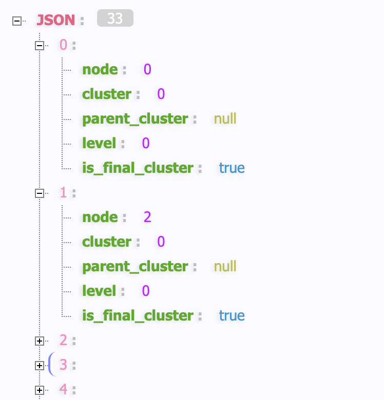
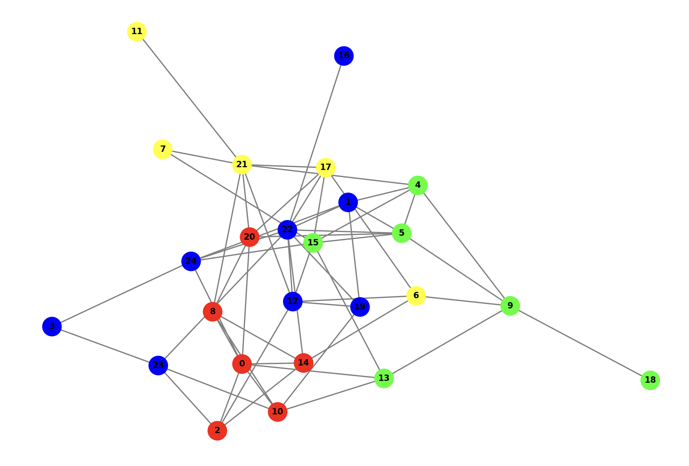
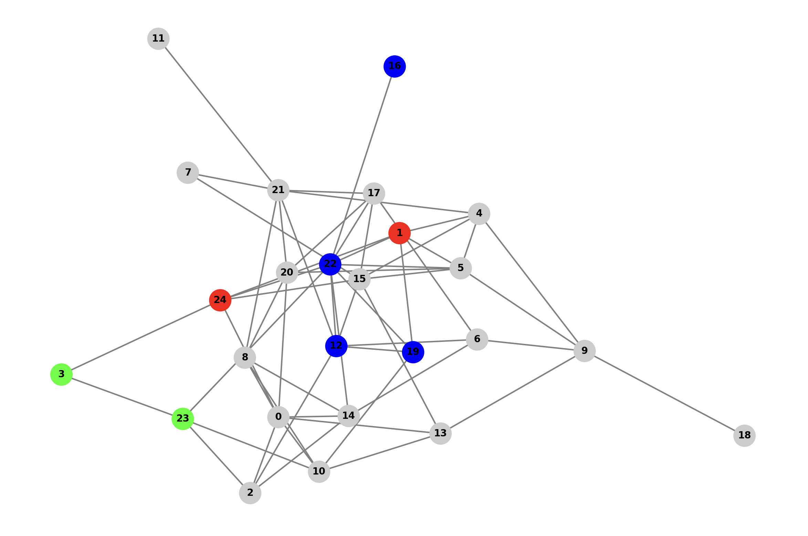

# GraphRAG 索引构建之图谱增强

在前面的文章中，我们已经深入学习了 GraphRAG 索引构建的前两个阶段，从原始文档到文本单元，再从文本单元提取出结构化的知识图谱。现在，我们已经拥有了包含实体和关系的网络图，接下来，我们将进入索引构建的第三阶段 —— **图谱增强**，探索 GraphRAG 如何从这张零散的网络图中挖掘出更高层次的结构和洞见。

图谱增强阶段包含四个核心工作流：

- **创建社区（`create_communities`）** - 使用 Leiden 算法对知识图谱进行层次化社区检测，返回多层次的社区结构；
- **创建最终文本单元（`create_final_text_units`）** - 负责将基础文本单元与实体、关系和协变量信息进行关联，生成最终的文本单元数据；
- **生成社区报告（`create_community_reports`）** - 为每个社区生成高质量的摘要报告；
- **生成文本嵌入（`generate_text_embeddings`）** - 将各层次文本信息向量化，并存储到外部的向量数据库；

其中，创建最终文本单元按理应该放在第二阶段的末尾，当图谱提取结束后就可以创建了，它的作用是将文本单元与提取出来的实体、关系和协变量进行关联并重新保存。这里按照源码中顺序，将其放在第三阶段，这一步也比较简单，本篇不做过多赘述，主要关注另三个工作流的实现。

## 创建社区

创建社区是图谱增强阶段的核心步骤，它通过图聚类算法将零散的实体组织成有意义的主题集群。该工作流的实现位于 `index/workflows/create_communities.py` 文件中：

```python
async def run_workflow(
  config: GraphRagConfig,
  context: PipelineRunContext,
) -> WorkflowFunctionOutput:

  # 1. 加载实体和关系数据
  entities = await load_table_from_storage("entities", context.output_storage)
  relationships = await load_table_from_storage("relationships", context.output_storage)

  # 2. 获取聚类配置
  max_cluster_size = config.cluster_graph.max_cluster_size
  use_lcc = config.cluster_graph.use_lcc
  seed = config.cluster_graph.seed

  # 3. 执行社区创建
  output = create_communities(
    entities,
    relationships,
    max_cluster_size=max_cluster_size,
    use_lcc=use_lcc,
    seed=seed,
  )

  # 4. 保存结果
  await write_table_to_storage(output, "communities", context.output_storage)
```

创建社区使用的配置如下：

```yaml
cluster_graph:
  max_cluster_size: 10 # 最大社区数量
  use_lcc: true        # 是否使用最大连通分量
  seed: 0xDEADBEEF     # 随机种子
```

其中 `max_cluster_size` 表示最多生成 10 个社区；`use_lcc` 表示是否使用最大连通分量，我们在之前计算图嵌入时也见过这个参数，意味着只有图中最大的连通子图会被用于计算，孤立的节点或较小的连通分量会被过滤掉；`seed` 表示随机种子，一般保持默认即可，主要用于在多次运行聚类算法时获得一致的结果。

核心处理逻辑位于 `create_communities()` 函数中：

```python
def create_communities(
  entities: pd.DataFrame,
  relationships: pd.DataFrame,
  max_cluster_size: int,
  use_lcc: bool,
  seed: int | None = None,
) -> pd.DataFrame:

  # 1. 构建图结构
  graph = create_graph(relationships, edge_attr=["weight"])

  # 2. 执行层次化聚类
  clusters = cluster_graph(
    graph,
    max_cluster_size,
    use_lcc,
    seed=seed,
  )

  # 3. 格式化聚类结果
  communities = pd.DataFrame(
    clusters, columns=pd.Index(["level", "community", "parent", "title"])
  ).explode("title")
```

它首先将关系数据转换为图结构，这里使用的是 NetworkX 库的 `nx.from_pandas_edgelist()` 方法，根据边创建加权无向图，然后调用 [**Leiden 聚类算法**](https://en.wikipedia.org/wiki/Leiden_algorithm) 进行社区检测，返回多层次的社区结构。

## 使用 Leiden 进行社区检测

在网络科学或图论中，**社区（Community）** 是指网络中的一组节点，其核心特征是：**社区内部的节点之间连接紧密，而与社区外部节点的连接相对稀疏**，这种 “内密外疏” 的结构是社区的核心标志，反映了网络中节点的聚类性和关联性。Leiden 算法是一种在图数据中识别社区结构的高效算法，由 Traag 等人在莱顿大学于 2018 年提出。它在经典的 [Louvain 算法](https://en.wikipedia.org/wiki/Louvain_method) 基础上进行了改进，解决了 Louvain 算法中可能出现的 “分辨率限制” 和社区划分不精确的问题，因此在复杂网络分析中被广泛应用。

和之前学习的 RAGFlow 一样，GraphRAG 也是使用 [graspologic](https://graspologic-org.github.io/graspologic/) 库的 `hierarchical_leiden()` 方法进行社区检测，为了搞懂 `cluster_graph()` 函数的具体逻辑，我们不妨先快速上手 [graspologic](https://graspologic-org.github.io/graspologic/) 库，通过一个简单的示例 ，看看如何使用它对图中的节点执行层次化聚类：

```python
import json
import networkx as nx
from graspologic.partition import hierarchical_leiden

def create_random_graph(num_nodes, edge_probability, seed):
  """生成一个随机图"""
  
  G = nx.erdos_renyi_graph(num_nodes, edge_probability, seed=seed)
  
  # 给节点加上 label 属性
  for node in G.nodes():
    G.nodes[node]['label'] = f"Node_{node}"
  
  return G

def apply_hierarchical_leiden_clustering(graph, max_cluster_size=10, seed=42):
  """调用 Leiden 层次化聚类算法"""
  
  # 层次化聚类
  community_mapping = hierarchical_leiden(
    graph, 
    max_cluster_size=max_cluster_size, 
    random_seed=seed
  )
  
  # 组织聚类结果
  results = {}
  hierarchy = {}
  
  for partition in community_mapping:
    level = partition.level
    if level not in results:
      results[level] = {}
    results[level][partition.node] = partition.cluster
    hierarchy[partition.cluster] = partition.parent_cluster if partition.parent_cluster is not None else -1
  
  return results, hierarchy

if __name__ == "__main__":
  
  # 生成一个随机图
  G = create_random_graph(num_nodes=25, edge_probability=0.2, seed=42)
  
  # 调用 Leiden 层次化聚类算法
  clustering_results, hierarchy = apply_hierarchical_leiden_clustering(
    G, max_cluster_size=8, seed=42
  )
```

这里先用 `nx.erdos_renyi_graph()` 创建一个符合 **Erdős-Rényi 模型（ER 模型）** 的随机图，图中有 25 个节点，然后使用 graspologic 库的 `hierarchical_leiden()` 方法对其进行聚类，聚类返回的结果是一个列表：



列表中的对象结构如下：

```python
class HierarchicalCluster(NamedTuple):
  # 节点 ID
  node: Any
  # 聚类 ID
  cluster: int
  # 父聚类 ID
  parent_cluster: Optional[int]
  # 聚类层次
  level: int
  # 是否为最终聚类
  is_final_cluster: bool
```

尽管返回的是列表结构，实际上，它是一个层次化的树状结构。每当某个聚类的数量超过某个限制时，Leiden 算法就会为该聚类划分子聚类，每划分一次，聚类层次 level 就会加 1，并将 `parent_cluster` 设置为父聚类的 ID；如果聚类不会进一步划分，就将 `is_final_cluster` 设置为 `true`；下面是聚类返回结果的示例：

```json
[
  {
    "node": 0,
    "cluster": 0,
    "parent_cluster": null,
    "level": 0,
    "is_final_cluster": true
  },
  // 省略 5 个 cluster == 0 的节点
  {
    "node": 24,
    "cluster": 1,
    "parent_cluster": null,
    "level": 0,
    "is_final_cluster": false
  },
  // 省略 7 个 cluster == 1 的节点
  {
    "node": 13,
    "cluster": 2,
    "parent_cluster": null,
    "level": 0,
    "is_final_cluster": true
  },
  // 省略 5 个 cluster == 2 的节点
  {
    "node": 21,
    "cluster": 3,
    "parent_cluster": null,
    "level": 0,
    "is_final_cluster": true
  },
  // 省略 4 个 cluster == 3 的节点
  {
    "node": 24,
    "cluster": 4,
    "parent_cluster": 1,
    "level": 1,
    "is_final_cluster": true
  },
  // 省略 1 个 cluster == 4 的节点
  {
    "node": 22,
    "cluster": 5,
    "parent_cluster": 1,
    "level": 1,
    "is_final_cluster": true
  },
  // 省略 3 个 cluster == 5 的节点
  {
    "node": 3,
    "cluster": 6,
    "parent_cluster": 1,
    "level": 1,
    "is_final_cluster": true
  },
  // 省略 1 个 cluster == 6 的节点
]
```

这个图共有 25 个节点，通过聚类算法检测出了 6 个聚类（即社区）：



可以看到 1 号聚类共 8 个节点，被进一步划分成了 4、5、6 三个聚类，它们的 `parent_cluster` 是 1，表示由 1 号聚类派生而来，`level` 是 1，表示聚类的层级：



接着 GraphRAG 将聚类结果组织成层次关系，`results` 是每个层级下的节点和节点所属的聚类：

```json
{
  "0": {
    "0": 0,
    "1": 1,
    "2": 0,
    "3": 1,
    "4": 2,
    // ...
    "21": 3,
    "22": 1,
    "23": 1,
    "24": 1
  },
  "1": {
    "1": 4,
    "3": 6,
    "12": 5,
    "16": 5,
    "19": 5,
    "22": 5,
    "23": 6,
    "24": 4
  }
}
```

`hierarchy` 是每个聚类对应的父聚类：

```json
{
  "0": -1,
  "1": -1,
  "2": -1,
  "3": -1,
  "4": 1,
  "5": 1,
  "6": 1
}
```

然后进一步将其格式化成最终的社区数据，包含以下字段：

- `id`: 社区唯一标识符
- `human_readable_id`: 人类可读的递增ID
- `level`: 社区层级
- `community`: 社区ID
- `parent`: 父社区ID
- `children`: 子社区ID列表
- `title`: 社区标题，字符串 `Community N`
- `entity_ids`: 包含的实体ID列表
- `relationship_ids`: 包含的关系ID列表
- `text_unit_ids`: 关联的文本单元ID列表
- `period`: 创建时间
- `size`: 社区大小（实体数量）

## 生成社区报告

识别出社区结构后，下一步通过 LLM 对社区内的信息进行深度分析和总结，为每个社区生成摘要报告，代码如下：

```python
async def create_community_reports(
  edges_input: pd.DataFrame,
  entities: pd.DataFrame,
  communities: pd.DataFrame,
  claims_input: pd.DataFrame | None
) -> pd.DataFrame:
  
  # 1. 分解社区数据，建立社区和实体映射
  nodes = explode_communities(communities, entities)

  # 2. 准备节点、边和声明数据
  nodes = _prep_nodes(nodes)
  edges = _prep_edges(edges_input)
  claims = _prep_claims(claims_input)

  # 3. 构建本地上下文
  local_contexts = build_local_context(
    nodes,
    edges,
    claims,
  )

  # 4. 生成社区摘要
  community_reports = await summarize_communities(
    nodes,
    communities,
    local_contexts,
    build_level_context,
  )

  # 5. 最终化报告
  return finalize_community_reports(community_reports, communities)
```

其中 `local_contexts` 被称为本地上下文，包含所有社区的详细信息，`build_local_context()` 函数将社区内的所有节点、边和声明汇总成一个字符串 `CONTEXT_STRING`，同时计算上下文长度是否超过 `max_context_tokens` 配置，如果超过则打上 `CONTEXT_EXCEED_FLAG` 标记。

生成社区摘要的核心逻辑位于 `summarize_communities()` 函数，它首先获取所有的社区层级，**并从高到低排序**，这里的倒序是关键，先生成最底层（层级最大）的社区报告，因为越底层包含的节点越少，不容易超出 token 限制；然后通过 `build_level_context()` 构建层级上下文，只包含特定层级的社区信息，针对每一个社区，有两种情况：

* 如果上下文未超出 token 限制，则直接使用该社区的上下文；
* 如果上下文超出 token 限制，则判断是否存在子社区报告；
    * 不存在子社区报告，一般出现在最底层的社区，则对该社区的上下文进行裁剪；
    * 存在子社区报告，则使用子社区报告作为该社区的上下文，如果超出 token 限制，也需要裁剪；

就这样从最底层的社区开始，一层层往上遍历，生成每个社区的摘要，使用的提示词如下：

```
你是一个帮助人类分析师进行一般信息挖掘的人工智能助手。信息挖掘是在一个网络中识别和评估与特定实体（如组织和个人）相关的信息的过程。

# 目标
根据属于某个社区的实体列表及其关系和可选的相关声明，撰写一份关于该社区的综合报告。这份报告将用于向决策者告知与该社区相关的信息及其潜在影响。报告内容包括社区主要实体的概述、它们的合规性、技术能力、声誉以及值得关注的声明。

# 报告结构

报告应包含以下部分：
- 标题：代表社区主要实体的名称——标题应简短但具体。可能的话，在标题中包含有代表性的命名实体。
- 摘要：对社区整体结构、其内部实体之间的关系以及与这些实体相关的重要信息的执行摘要。
- 影响严重程度评级：一个介于0-10之间的浮点分数，代表社区内实体所带来的影响的严重程度。影响是对一个社区重要性的评分。
- 评级解释：用一句话解释影响严重程度评级。
- 详细发现：关于该社区的 5-10 个关键见解。每个见解都应有一个简短摘要，随后是根据以下依据规则展开的多个段落的解释性文本。内容需全面详实。
```

> 这里和 RAGFlow 是一模一样的，因为 RAGFlow 就是参考了 GraphRAG 的实现。

最终的报告输出为 JSON 格式：

```json
{
  "title": "<报告标题>",
  "summary": "<执行摘要>",
  "rating": "<影响严重程度评级>",
  "rating_explanation": "<评级解释>",
  "findings": [
    {
      "summary":"<见解1摘要>",
      "explanation": "<见解1解释>"
    },
    {
      "summary":"<见解2摘要>",
      "explanation": "<见解2解释>"
    }
  ]
}
```

## 生成文本嵌入

社区报告生成后，索引构建就基本上结束了。最后一步是将各个工作流中生成的文本信息向量化，为了在查询阶段能够快速地进行语义检索。该步骤位于 `generate_text_embeddings` 工作流：

```python
async def run_workflow(
  config: GraphRagConfig,
  context: PipelineRunContext,
) -> WorkflowFunctionOutput:
  
  # 加载所有含文本信息的表
  documents = await load_table_from_storage("documents", context.output_storage)
  relationships = await load_table_from_storage("relationships", context.output_storage)
  text_units = await load_table_from_storage("text_units", context.output_storage)
  entities = await load_table_from_storage("entities", context.output_storage)
  community_reports = await load_table_from_storage("community_reports", context.output_storage)
  
  # 获取配置
  embedded_fields = config.embed_text.names
  text_embed = get_embedding_settings(config)

  # 根据配置，只计算特定文本字段的向量
  output = await generate_text_embeddings(
    documents=documents,
    relationships=relationships,
    text_units=text_units,
    entities=entities,
    community_reports=community_reports,
    text_embed_config=text_embed,
    embedded_fields=embedded_fields,
  )

  # 持久化存储向量数据
  if config.snapshots.embeddings:
    for name, table in output.items():
      await write_table_to_storage(table, f"embeddings.{name}", context.output_storage)

  return WorkflowFunctionOutput(result=output)
```

值得注意的一点是，GraphRAG 支持 8 个字段的向量计算：

- `entity.title` - 实体标题
- `entity.description` - 实体描述
- `relationship.description` - 关系描述
- `document.text` - 文档文本
- `community.title` - 社区标题
- `community.summary` - 社区摘要
- `community.full_content` - 社区完整内容
- `text_unit.text` - 文本单元

但是默认只计算实体描述、社区内容和文本单元的向量，可以在 `embed_text` 配置进行调整：

```yaml
embed_text:
  model: text-embedding-3-small
  batch_size: 16
  batch_max_tokens: 8191
  model_id: default_embedding_model
  vector_store_id: default_vector_store
  names:
    - entity.description
    - community.full_content
    - text_unit.text
```

GraphRAG 使用这里配置的嵌入模型（如 `text-embedding-3-small`）来执行向量化。这里的处理比较有意思，GraphRAG 首先使用 `TokenTextSplitter` 将长文本按 `batch_max_tokens` 分割为符合 token 限制的片段；如果只有一个片段，则返回该片段的向量，如果文本被分成了多个片段，那么计算平均向量并归一化：

```python
if size == 0:
  embeddings.append(None)
elif size == 1:
  embedding = raw_embeddings[cursor]
  embeddings.append(embedding)
else:
  chunk = raw_embeddings[cursor : cursor + size]
  average = np.average(chunk, axis=0)
  normalized = average / np.linalg.norm(average)
  embeddings.append(normalized.tolist())
```

生成的向量会与对应的文本和 ID 一同存储在向量数据库中，支持批量处理，默认使用 **LanceDB**，这是一个现代化的、为 AI 优化的高性能向量数据库，它将索引文件直接存储在本地文件系统中。除此之外，GraphRAG 还支持 Azure 认知搜索服务 **Azure AI Search** 以及 Azure 的 NoSQL 数据库 **CosmosDB** 等向量存储。可以通过 `vector_store` 配置进行修改：

```yaml
vector_store:
  default_vector_store:
    type: lancedb
    db_uri: output/lancedb
    container_name: default
    overwrite: True
```

另外，如果我们配置了 `snapshots.embeddings`，向量数据还会被存到独立的 Parquet 文件中：

- `embeddings.entity.description.parquet`
- `embeddings.community.full_content.parquet`
- `embeddings.text_unit.text.parquet`

## 小结

今天我们深入学习了 GraphRAG 索引构建流程中的最后一个阶段，将零散的知识组织成层次化结构的社区。主要内容总结如下：

* **Leiden 聚类**：详细了解了 GraphRAG 如何使用 Leiden 算法对知识图谱进行社区检测，构建层次化的社区结构；
* **层次化报告生成**：探讨了如何从底层社区开始一层一层的往上为每个社区生成摘要报告，以及高层社区上下文超出 token 限制的解决方法；
* **文本列向量化**：了解了如何将文本单元、实体描述和社区报告等不同层次的文本信息转化为向量嵌入，为语义检索提供支持。

至此，GraphRAG 的索引构建阶段就完成了，索引构建的产物位于 `output` 目录中，包括一系列 Parquet 格式的文件和 LanceDB 数据：

- 文档表（`documents.parquet`）
- 文本单元表（`text_units.parquet`）
- 实体表（`entities.parquet`）
- 关系表（`relationships.parquet`）
- 社区表（`communities.parquet`）
- 社区报告（`community_reports.parquet`）
- 向量数据库（`lancedb`）

接下来，我们就可以通过 `query` 命令来查询这些数据，正式进入检索和问答环节。
