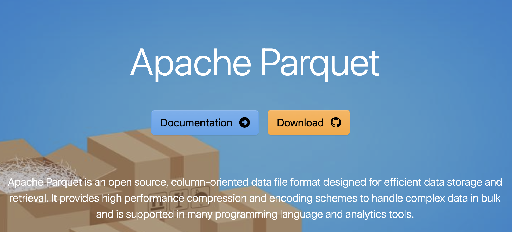

# 详解 GraphRAG 索引构建的输出文件

在前面的系列文章中，我们深入学习了 GraphRAG 索引构建的完整流程，从文档加载、文本分片，到实体关系提取、社区检测和向量化。经过这些复杂的处理步骤，GraphRAG 最终生成了一系列结构化的输出文件，这些文件就是整个知识图谱的数字化资产。通过这些文件，GraphRAG 实现了不同的检索策略，可以回答用户的各种问题。但是在正式进入检索阶段之前，让我们先来详细剖析下这些输出文件，了解每个文件的格式、字段信息和存储机制。

## 输出文件概览

当 GraphRAG 索引构建完成后，所有结果都保存在 `output` 目录中。让我们先来看看完整的文件结构：

```
output/
├── documents.parquet              # 文档表
├── text_units.parquet             # 文本单元表
├── entities.parquet               # 实体表
├── relationships.parquet          # 关系表
├── communities.parquet            # 社区表
├── community_reports.parquet      # 社区报告表
├── embeddings.entity.description.parquet       # 实体描述向量
├── embeddings.community.full_content.parquet   # 社区内容向量
├── embeddings.text_unit.text.parquet          # 文本单元向量
├── graph.graphml                  # 图结构文件
├── lancedb/                       # LanceDB 向量数据库
├── stats.json                     # 统计信息
└── context.json                   # 上下文信息
```

这些文件可以分为三类：

1. **核心数据表**：存储结构化数据，包括文档、文本单元、实体、关系、社区、社区报告等，使用 Parquet 格式；
2. **向量数据**：存储嵌入向量，包括文本单元、实体描述、社区内容等，使用 Parquet 和 LanceDB 双重存储；
3. **元数据文件**：包含图结构、统计信息等辅助数据；其中 `graph.graphml` 文件在之前学习可视化的时候已经详细介绍过，此处不再赘述；

## 核心数据表详解

这一节对所有的核心数据表做个总结。

### 1. documents.parquet - 文档表

文档表存储了原始文档的基础信息和预处理后的文本内容：

| 字段 | 描述 |
|------|------|
| id | 文档唯一标识符（SHA-256 哈希） |
| human_readable_id | 人类可读的递增 ID |
| title | 文档标题（通常是文件名，或 CSV 中的 title 列） |
| text | 文档的完整文本内容 |
| text_unit_ids | 关联的文本单元 ID 列表 |
| creation_date | 创建时间戳 |
| metadata | 额外的元数据信息 |

文档表是整个知识图谱的源头，每个文档都会被分解成多个文本单元进行后续处理。

### 2. text_units.parquet - 文本单元表

文本单元是 GraphRAG 处理的基本单位，通过 `tokens` 策略将长文档分解成固定长度的片段，或者通过 `sentence` 策略将其分解成自然语言的句子：

| 字段 | 描述 |
|------|------|
| id | 文本单元唯一标识符 |
| human_readable_id | 人类可读的递增 ID |
| text | 文本单元的具体内容 |
| n_tokens | 文本的 token 长度，应该和配置文件中的 chunk_size 相等，除了最后一个分块 |
| document_ids | 所属文档 ID 列表，通常情况下只有一个，但是也可以修改分组策略让一个分块跨多个文档 |
| entity_ids | 包含的实体 ID 列表 |
| relationship_ids | 包含的关系 ID 列表 |
| covariate_ids | 关联的协变量 ID 列表（如果存在） |

文本单元表是连接文档和知识图谱的桥梁，每个文本单元都详细记录了从中提取的结构化信息。

### 3. entities.parquet - 实体表

实体表存储了从文本中识别出的所有命名实体及其详细信息：

| 字段 | 描述 |
|------|------|
| id | 实体唯一标识符 |
| human_readable_id | 人类可读的递增 ID |
| title | 实体名称 |
| type | 实体类型，默认支持 "organization", "person", "geo" 和 "event" 四种 |
| description | 实体详细描述，一个实体可能出现在多个文本单元中，使用大模型生成总结摘要 |
| text_unit_ids | 出现的文本单元 ID 列表 |
| frequency | 出现频次 |
| degree | 图中的度数（连接的边数量） |
| x | 图布局中的 x 坐标，必须开启图嵌入和 UMAP 配置 |
| y | 图布局中的 y 坐标，必须开启图嵌入和 UMAP 配置 |

实体表是知识图谱的节点集合，每个实体都包含了丰富的语义信息和图结构属性。

### 4. relationships.parquet - 关系表

关系表记录了实体之间的连接关系：

| 字段 | 描述 |
|------|------|
| id | 关系唯一标识符 |
| human_readable_id | 人类可读的递增 ID |
| source | 源实体名称 |
| target | 目标实体名称 |
| description | 关系的详细描述，一个关系也可能出现在多个文本单元中，使用大模型生成总结摘要 |
| weight | 关系的权重，如果是基于大模型的提取，让大模型评估关系的强度，如果是基于 NLP 的提取，则通过共现频次计算 |
| combined_degree | 源和目标实体的度数总和 |
| text_unit_ids | 支持该关系的文本单元 ID 列表 |

关系表定义了知识图谱的边集合，捕捉了实体间的语义关联。

### 5. communities.parquet - 社区表

社区表存储了通过 Leiden 算法识别出的图社区结构：

| 字段 | 描述 |
|------|------|
| id | 社区唯一标识符 |
| human_readable_id | 人类可读的递增 ID |
| level | 社区层级（支持层次化聚类） |
| community | 社区 ID，通过 Leiden 算法生成的唯一标识 |
| parent | 父社区 ID |
| children | 子社区 ID 列表 |
| title | 社区标题 |
| entity_ids | 包含的实体 ID 列表 |
| relationship_ids | 包含的关系 ID 列表 |
| text_unit_ids | 关联的文本单元 ID 列表 |
| period | 创建时间，用于增量更新合并 |
| size | 社区大小（实体数量），用于增量更新合并 |

社区表将知识图谱组织成层次化的主题集群，为生成高质量摘要提供了基础。

### 6. community_reports.parquet - 社区报告表

社区报告是通过大模型对每个社区生成的结构化摘要：

| 字段 | 描述 |
|------|------|
| id | 报告唯一标识符 |
| human_readable_id | 人类可读的递增 ID |
| community | 关联的社区 ID |
| parent | 父社区 ID |
| children | 子社区 ID 列表 |
| level | 社区层级 |
| title | 报告标题 |
| summary | 执行摘要 |
| full_content | 完整报告内容 |
| rank | 重要性排名 |
| rank_explanation | 排名解释 |
| findings | 关于社区的前 5-10 条关键发现（JSON 格式） |
| full_content_json | 大模型返回的完整内容，大多数内容已经被提取到对应列中 |
| period | 创建时间，用于增量更新合并 |
| size | 社区大小（实体数量），用于增量更新合并 |

社区报告表是知识图谱的智能摘要，将复杂的图结构转化为人类可理解的洞察。

## Parquet：高效的列式存储

上述这些核心数据表最终都使用 Parquet 格式进行存储。[Apache Parquet](https://parquet.apache.org/) 是一种开源的列式数据文件格式，专为大数据场景设计，旨在优化数据存储效率和查询性能。它由 Twitter 和 Cloudera 联合开发，现为 Apache 顶级开源项目，广泛应用于 Hadoop 生态系统及各类大数据处理框架。



传统数据库（如 MySQL）采用行式存储（一行数据连续存储），适合 **整行读取** 场景（如事务处理）；而 Parquet 的列式存储（一列数据连续存储），更适合大数据 **多列筛选、聚合** 场景（如数据分析）。它的核心特性包括：

- **列式存储**：按列而非按行存储数据，查询时仅读取目标列（而非整行），减少 I/O 开销；
- **高效压缩**：基于列的相似数据特征（如同一列数据类型一致、重复值多），支持多种高效的编码和压缩算法，存储成本降低 3-5 倍；
- **谓词下推（Predicate Pushdown）**：配合 Spark 等查询引擎，将过滤条件下推到存储层，提前过滤无效数据，减少数据传输量；
- **Schema 演进**：支持 Schema 的动态修改，比如新增列或修改列类型，无需重写历史数据，兼容新旧数据查询；
- **平台无关性**：不依赖特定计算框架或存储系统，可在 Spark、Flink、Hive、Presto 等工具中通用；
- **支持嵌套数据**：原生支持数组、字典、结构体等复杂数据类型，无需将嵌套数据扁平化，适配 JSON、Avro 等半结构化数据；

在 GraphRAG 中，使用了 Pandas 库对 Parquet 文件进行读取和写入，具体的逻辑位于 `utils/storage.py` 中：

```python
async def load_table_from_storage(name: str, storage: PipelineStorage) -> pd.DataFrame:
  """从存储中读取表格数据"""
  filename = f"{name}.parquet"
  return pd.read_parquet(BytesIO(await storage.get(filename, as_bytes=True)))

async def write_table_to_storage(
  table: pd.DataFrame, name: str, storage: PipelineStorage
) -> None:
  """向存储中写入表格数据"""
  await storage.set(f"{name}.parquet", table.to_parquet())
```

其中 `pd.read_parquet()` 用于读取 `Parquet` 文件，`table.to_parquet()` 用于将 `DataFrame` 转换为 `Parquet` 格式。下面是一个完整示例，演示了如何使用 Pandas 写入和读取 Parquet 文件：

```python
import pandas as pd
from pathlib import Path

def write_parquet_example(filepath):
  """写入示例数据"""
  
  # 创建示例数据
  data = {
    'id': [1, 2, 3, 4, 5],
    'name': ['Alice', 'Bob', 'Charlie', 'David', 'Eve'],
    'age': [25, 30, 35, 28, 32],
    'city': ['New York', 'London', 'Paris', 'Tokyo', 'Berlin'],
    'salary': [50000.0, 60000.0, 70000.0, 55000.0, 65000.0]
  }
  
  # 创建 DataFrame
  df = pd.DataFrame(data)
  
  # 写入 Parquet 文件
  output_path = Path(filepath)
  df.to_parquet(output_path, engine='pyarrow')
  
  print(f"数据已写入到: {output_path}")
  print(f"数据形状: {df.shape}")
  print(f"数据预览:\n{df.head()}")
  
  return output_path

def read_parquet_example(file_path: str):
  """读取示例文件"""
  
  # 读取完整数据
  df = pd.read_parquet(file_path, engine='pyarrow')
  print(f"\n读取完整数据:\n{df}")
  
  # 读取特定列
  df = pd.read_parquet(file_path, columns=['name', 'age', 'city'])
  print(f"\n读取特定列:\n{df}")
  
  return df

if __name__ == "__main__":
  
  # 1. 写入 Parquet 文件
  parquet_file = write_parquet_example('sample_data.parquet')
  
  # 2. 读取 Parquet 文件
  df = read_parquet_example('sample_data.parquet')
```

有兴趣的同学可以将 `filepath` 改成 GraphRAG 的 `output` 目录，研究下每个 Parquet 文件的内容。

## 向量数据存储

我们昨天学过，GraphRAG 支持对多种文本字段进行向量化，默认包括文本单元、实体描述和社区完整内容。根据配置，这些向量既保存在 Parquet 文件中（快照存储），也存储在 LanceDB 向量数据库中（用于高效检索）:

```
├── lancedb
│   ├── default-community-full_content.lance
│   ├── default-entity-description.lance
│   └── default-text_unit-text.lance
├── embeddings.community.full_content.parquet
├── embeddings.entity.description.parquet
└── embeddings.text_unit.text.parquet
```

GraphRAG 的输出文件形成了完整的数据血缘链路，每一级的输出都基于上一级的结果：


在 LanceDB 中，每条记录都包含以下字段：

```python
columns = [
  'id',         # 源数据的唯一标识符
  'text',       # 原始文本内容
  'vector',     # 嵌入向量（浮点数数组）
  'attributes'  # 额外属性，比如 title 文档标题
]
```

## LanceDB：面向 AI 的向量数据库

[LanceDB](https://lancedb.com/) 是一款基于 **Lance 存储格式**（一种高性能列式存储格式）构建的开源向量数据库，主打 **低延迟查询**、**高吞吐量**、**易用性** 三大核心优势，专为大规模向量数据的存储、检索与管理设计。它由 Lance 生态团队开发，旨在解决传统向量数据库在性能、成本、易用性之间的平衡问题，尤其适配机器学习和人工智能场景的需求，比如语义搜索、推荐系统、多模态检索、特征存储等。


LanceDB 的核心定位是 **为 AI 原生应用打造的向量数据库**，其设计理念围绕以下几点展开：

- **存储与计算融合**：基于 Lance 格式的底层优化，将向量存储与向量索引、过滤计算深度整合，避免传统数据库 **存算分离** 带来的性能损耗；
- **极简易用性**：提供 Python、Rust 等简洁 API，支持本地文件级存储，同时兼容 S3、GCS 等云存储，降低开发者上手门槛；
- **多模态数据支持**：原生支持多模态数据管理，不仅存储向量和元数据，还能存储原始数据（文本、图像、视频等）；
- **混合检索能力**：支持 [向量检索](https://lancedb.com/docs/search/vector-search/)、[多向量检索](https://lancedb.com/docs/search/multivector-search/)、[全文检索](https://lancedb.com/docs/search/full-text-search/)、[混合检索](https://lancedb.com/docs/search/hybrid-search/)、[元数据过滤](https://lancedb.com/docs/search/filtering/)、[SQL 检索](https://lancedb.com/docs/search/sql-queries/) 等多种检索策略；

在 GraphRAG 中，操作 LanceDB 的代码位于 `vector_stores/lancedb.py` 文件中的 `LanceDBVectorStore` 类：

```python
import lancedb

class LanceDBVectorStore(BaseVectorStore):

  def connect(self, **kwargs: Any) -> Any:
    """连接 LanceDB 数据库"""
    self.db_connection = lancedb.connect(kwargs["db_uri"])

  def load_documents(
    self, documents: list[VectorStoreDocument], overwrite: bool = True
  ) -> None:
    """将文档存入 LanceDB 数据库"""
    if overwrite:
      self.document_collection = self.db_connection.create_table(self.collection_name, data=data, mode="overwrite")
    else:
      self.document_collection = self.db_connection.open_table(self.collection_name)
      self.document_collection.add(data)

  def similarity_search_by_vector(
    self, query_embedding: list[float], k: int = 10, **kwargs: Any
  ) -> list[VectorStoreSearchResult]:
    """使用向量，执行向量相似性检索"""
    docs = (
      self.document_collection.search(
        query=query_embedding, vector_column_name="vector"
      )
      .limit(k)
      .to_list()
    )

  def similarity_search_by_text(
    self, text: str, text_embedder: TextEmbedder, k: int = 10, **kwargs: Any
  ) -> list[VectorStoreSearchResult]:
    """使用文本，执行向量相似性检索"""
    query_embedding = text_embedder(text)
    if query_embedding:
      return self.similarity_search_by_vector(query_embedding, k)
    return []

  def search_by_id(self, id: str) -> VectorStoreDocument:
    """根据 ID 搜索文档"""
    doc = (
      self.document_collection.search()
        .where(f"id == '{id}'", prefilter=True)
        .to_list()
    )
```

我们可以针对 `LanceDBVectorStore` 类写一个简单的测试脚本：

```python
import openai

# 使用 OpenAI Embedding
def embedder(text: str) -> list[float]:
  return openai.embeddings.create(
    input=text, model="text-embedding-3-small"
  ).data[0].embedding

# 连接 LanceDB 数据库
from graphrag.vector_stores.lancedb import LanceDBVectorStore
vector_store = LanceDBVectorStore(collection_name="default-entity-description")
vector_store.connect(db_uri="./ragtest/output/lancedb")

# 向量相似性检索
results = vector_store.similarity_search_by_text(
  "Who is Scrooge?", embedder, k=2
)
print(results)
```

感兴趣的同学可以用它来查询 GraphRAG 生成的这几个 LanceDB 数据库文件，研究其数据结构和内容。

## 小结

今天我们深入学习了 GraphRAG 索引构建的输出文件，这些结构化的输出文件是 GraphRAG 查询阶段的基础数据源。通过逐一分析 6 个核心数据表和 3 个向量数据库的字段结构和存储内容，了解 Parquet 列式存储格式以及专为 AI 优化的 LanceDB 向量数据库，我们对 GraphRAG 如何组织输出数据有了更清晰的认知。

在下一篇文章中，我们将转入查询阶段的学习，探索 GraphRAG 如何基于这些数据文件实现智能问答，包括全局查询、局部查询和混合查询等不同的检索策略。
