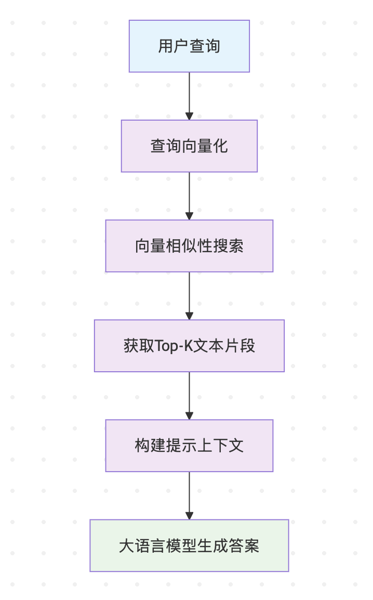
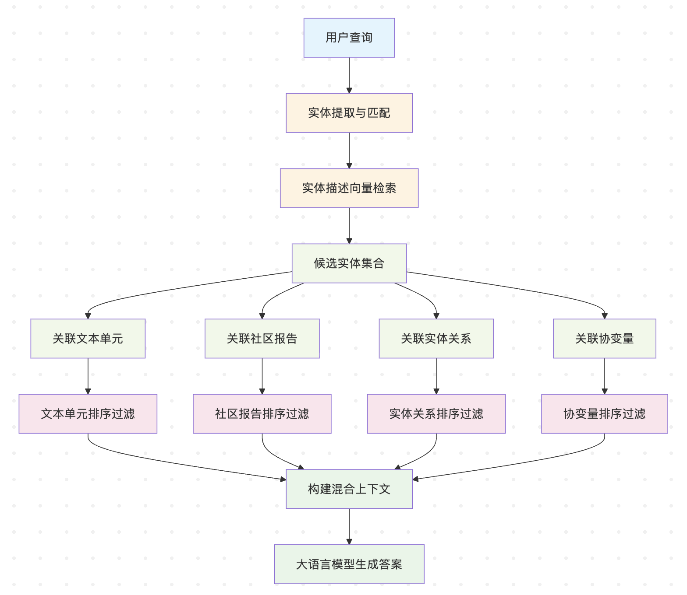
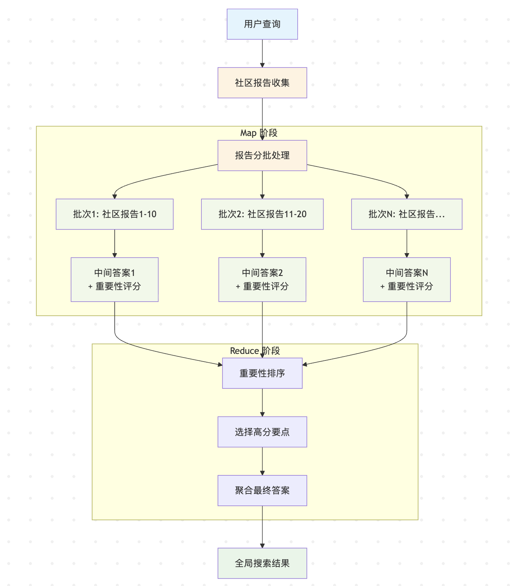
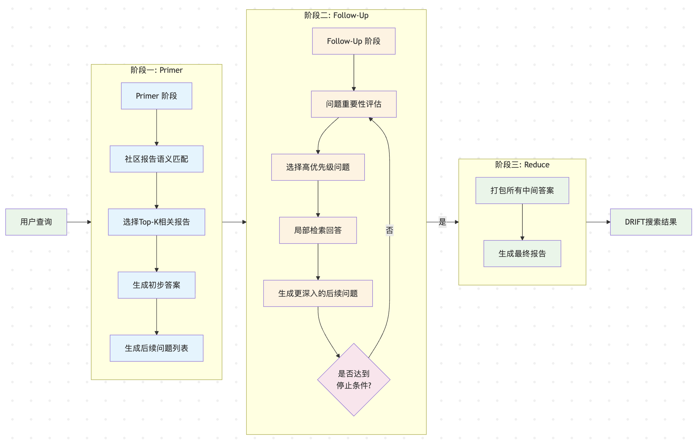
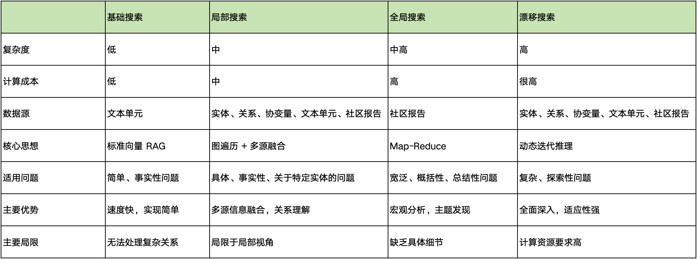

# 学习 GraphRAG 四大搜索策略

在前面的系列文章中，我们深入学习了 GraphRAG 索引构建的完整流程，从文档加载、文本分片，到实体关系提取、社区检测，最终生成了包括实体表、关系表、社区报告等在内的结构化输出文件。这些文件构成了 GraphRAG 的知识库基础，为查询阶段提供了丰富的数据源。现在，让我们转入查询阶段的学习，探索 GraphRAG 如何基于这些数据实现智能问答。

在之前的入门篇中，我们已经体验了通过 `query` 命令来查询，并通过 `--method` 参数指定搜索策略：

```
$ uv run poe query \
    --root ./ragtest \
    --method global \
    --query "What are the top themes in this story?"
```

GraphRAG 提供了四种不同的搜索策略，按照复杂程度递增的顺序，它们分别是：**基础搜索（Basic Search）**、**本地搜索（Local Search）**、**全局搜索（Global Search）** 和 **漂移搜索（DRIFT Search）**。本文将由浅入深地剖析这四种搜索策略的工作原理和使用场景。

## 基础搜索（Basic Search）

基础搜索是 GraphRAG 中最简单的查询方式，本质上是传统向量 RAG 的实现。它主要用于与其他搜索策略进行对比，帮助用户了解 GraphRAG 相对于传统方法的优势。



基础搜索的核心思想非常直接：对用户查询进行向量化，然后在文本单元的向量数据库中进行相似性搜索，找到最相关的前 K 个文本片段，最后使用这些片段作为上下文，连同原始问题一起提交给大语言模型，生成最终答案。

基础搜索适用于简单的事实性问题，特别是答案可以直接从单个或少数几个文档片段中获得的情况，比如：

- 什么是机器学习？
- Python 中如何定义函数？
- 苹果公司的总部在哪里？

由于基础搜索仅依赖向量相似性，它无法处理需要多步推理或全局理解的复杂问题。这正是 GraphRAG 引入图结构和社区检测的动机。

## 本地搜索（Local Search）

本地搜索，或者叫 **局部搜索**，是 GraphRAG 的核心创新之一，它利用知识图谱的实体关系结构来增强传统 RAG 的检索能力。相比基础搜索，本地搜索能够理解查询中的实体，并利用这些实体在知识图谱中的连接关系来查找更丰富、更相关的上下文信息。

本地搜索的流程分为三个主要阶段：实体识别、上下文扩展和答案生成。



这个过程的详细步骤如下：

1. **实体识别阶段**：对用户查询进行向量化，在实体描述向量数据库中进行相似性搜索，获取语义相关的候选实体集合；
2. **上下文扩展阶段**：
   - **文本单元扩展**：根据实体和文本单元映射关系，找到包含这些实体的原始文本片段；
   - **社区报告扩展**：根据实体和社区映射关系，获取相关的社区摘要报告；
   - **实体关系扩展**：使用实体名称和描述等信息构建实体上下文，然后再依次查找与实体相连的关系构建关系上下文；
   - **协变量扩展**：如果配置了协变量提取，还会包含相关的声明信息；
3. **排序过滤阶段**：
   - **排序**：对每类候选数据进行重要性排序，比如对于文本单元来说，关系数量更多优先级更高，对于社区来说，包含的选中实体数量更多的优先级更高；
   - **过滤**：根据 token 预算进行过滤，确保上下文适合大语言模型的输入窗口；
4. **答案生成阶段**：将过滤后的多源信息整合成结构化上下文，调用大模型生成最终答案；

本地搜索的过程就像是一次从图谱中的特定节点出发，向外探索和收集信息的侦察任务，它的关键优势在于 **多源信息融合** 能力：通过文本单元保留原始文档的详细信息，通过知识图谱揭示实体间的复杂关系，通过社区报告提供结构化的主题总结。它特别适合需要理解特定实体及其关系的问题，比如：

- 洋甘菊有什么治疗功效？（需要理解洋甘菊这个实体的属性）
- 苹果公司和微软公司有什么合作关系？（需要理解两个实体间的关系）
- 机器学习领域的主要算法有哪些？（需要找到与机器学习相关的算法实体）

## 全局搜索（Global Search）

全局搜索解决了传统 RAG 的一个根本性问题：**无法处理需要理解整个数据集的查询**。当用户问 *数据中的主要主题是什么？* 或 *最重要的趋势有哪些？* 这种需要全局视角和高度概括性的问题时，传统的向量检索往往无法给出满意的答案，因为这类问题需要对整个数据集进行宏观理解和总结。

全局搜索采用了 **Map-Reduce 架构**，分为两个核心阶段：



首先是 Map 阶段，收集指定层级的社区报告，并行处理：

1. **报告收集**：从指定层级的社区层次结构中收集所有的社区报告；如果开启了动态社区选择，则使用大模型根据用户问题对社区报告进行打分，选择得分大于阈值的社区报告；
2. **分批处理**：将社区报告按照 token 预算随机分成多个批次；
3. **并行分析**：对于每个批次，将其中的社区报告作为上下文，连同用户查询一起发送给大模型，使用 Map 系统提示词生成一个中间响应；这个响应包含一系列观点，每个观点都有一个重要性评分（1-100 分）；

```json
{
  "points": [
    { "description": "观点1的描述 [数据：报告（报告ID）]", "score": "评分值" },
    { "description": "观点2的描述 [数据：报告（报告ID）]", "score": "评分值" }
  ]
}
```

第一阶段并不回答用户的原始问题，只是生成中间响应，然后再通过 Reduce 阶段，对其聚合生成最终答案：

1. **重要性排序**：收集所有中间响应的观点并按重要性评分排序；
2. **智能过滤**：按评分选出最重要的观点，并确保在 token 预算内；
3. **最终聚合**：使用 Reduce 系统提示将选中的观点整合起来，作为最终的上下文，再次提交给大模型，生成一个全面连贯的最终答案；

可以看出，全局搜索通过直接利用最高度浓缩的知识（社区报告），避免了在海量细碎文本块中进行检索，特别适合需要宏观理解和数据集级别分析的问题：

- 这个数据集中讨论的主要主题有哪些？
- 文档中提到的最重要的趋势是什么？
- 数据中的关键人物和组织有哪些？
- 这些文档反映了什么样的总体情况？

它的效果很大程度上取决于选择的社区层级：

- **底层社区**：包含更详细的信息，答案更全面，但需要更多的计算资源和时间；
- **顶层社区**：处理速度更快，成本更低，但答案可能较为宏观；

用户可以根据问题的复杂程度和计算预算选择合适的社区层级。

## 漂移搜索（DRIFT Search）

我们看到，全局搜索通过检索社区报告来回答宏观问题，而本地搜索则通过图遍历和多源信息融合来回答关于具体实体的微观问题，用户在使用时，必须先判断出问题的类型，然后再明确指定对应的策略，使用起来非常费脑子，如果能将两种搜索策略融合起来那就完美了。

因此，GraphRAG 推出了一种更高级的混合搜索策略 —— **漂移搜索（DRIFT Search）**，这里的 DRIFT 其实是首字母缩写，全称为 **Dynamic Reasoning and Inference with Flexible Traversal**，它巧妙地结合了全局搜索和本地搜索的优势，通过动态推理和灵活遍历实现了更全面、更深入的查询能力。

漂移搜索的设计理念是渐进式查询精化，首先进行全局层面的主题探索，建立宏观认知，然后基于初步发现生成深入的后续问题，最后通过本地搜索验证和细化这些问题的答案。这种方式避免了全局搜索过于宏观和本地搜索过于狭隘的问题，实现了广度和深度的平衡。它的运行流程包含三个核心阶段：



阶段一被称为 `Primer`，用于建立初步的、较宽泛的全局认知，分为两步：

1. **报告选择**：将用户查询与所有社区报告进行语义相似性比较，选择最相关的 Top-K 个社区报告作为初始上下文；这里使用了 **HyDE（Hypothetical Document Embeddings）** 策略，首先根据用户查询生成和社区报告结构类似的假设性文档，然后使用这个假设性文档的嵌入来选择社区报告，这通常比原始的用户查询嵌入效果更好；
2. **初步回答**：将这些报告拆成 N 个批次，针对每个批次，生成一个宏观层面的初步答案，分析初步答案和原始查询的相关性，并识别需要进一步探索的方向，生成具体的后续问题；

```json
{
  "intermediate_answer": "<初步答案>",
  "score": "<和原始查询的相关性>",
  "follow_up_queries": [
    "<后续问题1>",
    "<后续问题2>"
  ]
}
```

阶段二叫做 `Follow-Up`，对生成的后续问题进一步的深入探索：

1. **问题选择**：从后续问题列表中选择评分最高的 Top-K 个问题，如果没有评分则随机选择；
3. **局部问答**：使用本地搜索（Local Search）对选定的问题进行详细回答，这个过程会产生更精确的中间答案，并可能生成新一轮的、更具针对性的后续问题；

```json
{
  "response": "<对后续问题进行回答，注意不要回答原始查询>",
  "score": "<和原始查询的相关性>",
  "follow_up_queries": [
    "<后续问题1>",
    "<后续问题2>"
  ]
}
```

阶段二是一个 `while` 循环，这个循环过程会持续进行，直到满足停止条件，当达到预设的深度限制（默认 3 层）或所有后续问题均已回答时。然后进入阶段三 `Reduce`，系统将所有的中间答案汇聚起来，为用户提供一个既有全局概览又有局部细节的综合性答案。

漂移搜索通过动态地在全局和局部信息之间“漂移”，模拟了人类分析师的探索过程，这和最近流行的 Deep Research 技术非常类似，能够更智能地应对复杂的、探索性的查询需求，这类需求通常会从一个宽泛的起点开始逐步深入到具体细节，比如：

- 这个数据集中的关键问题是什么，它们是如何相互关联的？
- 分析一下某个领域的发展趋势及其影响因素
- 深入探讨某个复杂事件的原因、过程和影响
- 比较分析多个概念或实体的异同及其关系

## 综合对比

为了更好地理解这四种搜索策略的特点和适用场景，我们来做一个综合对比：



只有根据问题场景选择最适合的搜索策略，才能达到最好的效果。

## 技术实现细节

最后，我们来看下 GraphRAG 搜索策略的技术实现，源码位于 `query/structured_search` 目录下：

```
├── base.py
├── basic_search
│   ├── basic_context.py
│   └── search.py
├── drift_search
│   ├── action.py
│   ├── drift_context.py
│   ├── primer.py
│   ├── search.py
│   └── state.py
├── global_search
│   ├── community_context.py
│   └── search.py
└── local_search
    ├── mixed_context.py
    └── search.py
```

GraphRAG 采用了一致的架构设计，所有的搜索策略都统一继承自 `BaseSearch` 基类，提供 `search()` 和 `stream_search()` 两个方法：

```python
class BasicSearch(BaseSearch[BasicContextBuilder]):
  '''基础搜索'''
class LocalSearch(BaseSearch[LocalContextBuilder]):
  '''本地搜索'''
class GlobalSearch(BaseSearch[GlobalContextBuilder]):
  '''全局搜索'''
class DRIFTSearch(BaseSearch[DRIFTSearchContextBuilder]):
  '''漂移搜索'''
```

每个搜索策略都对应一个 **上下文构建器（Context Builder）**，负责从索引数据中构建查询上下文。不同的搜索策略使用专门优化的系统提示：

- 基础搜索：
    - `BASIC_SEARCH_SYSTEM_PROMPT`：基于文本片段回答用户问题
- 本地搜索：
    - `LOCAL_SEARCH_SYSTEM_PROMPT`：基于实体关系、社区报告、文本片段等回答用户问题
- 全局搜索：
    - `RATE_QUERY`：根据用户问题对社区报告进行打分，用于选择最合适的社区报告；
    - `MAP_SYSTEM_PROMPT`：根据社区报告，让大模型生成一个中间响应，包含一系列关于用户查询的观点及重要性评分；
    - `REDUCE_SYSTEM_PROMPT`：聚合中间观点，生成最终答案；
- 漂移搜索：
    - `HyDE`：根据用户问题生成假设性文档；
    - `DRIFT_PRIMER_PROMPT`：基于社区报告对用户问题作出初步回答，生成后续问题；
    - `DRIFT_LOCAL_SYSTEM_PROMPT`：针对后续问题调用本地搜索后，生成中间答案，并生成新一轮的、更具针对性的后续问题；
    - `DRIFT_REDUCE_PROMPT`：基于所有的中间答案，回答用户的原始问题；

具体的源码解读就不再展开了，有兴趣的朋友可以对照着上面各节的讲解去看下对应的代码。

## 小结

今天，我们详细剖析了 GraphRAG 的四大搜索策略，从简单到复杂，从局部到全局，从静态到动态，每种策略都有其独特的设计理念，通过合理选择和组合这些策略，GraphRAG 能够处理从简单事实查询到复杂推理问题的各种场景。

至此，我们对 GraphRAG 的探索之旅也告一段落。从最初的快速上手，到深入索引构建的三个核心阶段（文档处理、知识提取、图谱增强），再到今天的搜索策略，我们系统地学习了 GraphRAG 如何将扁平的非结构化文本，一步步转化为一个结构丰富、可深度推理的知识库，并最终利用它来赋能更智能的问答系统。

希望这个系列的文章能帮助你全面理解 GraphRAG 的核心思想与实现原理，并为你构建自己的高级 RAG 应用带来启发。
