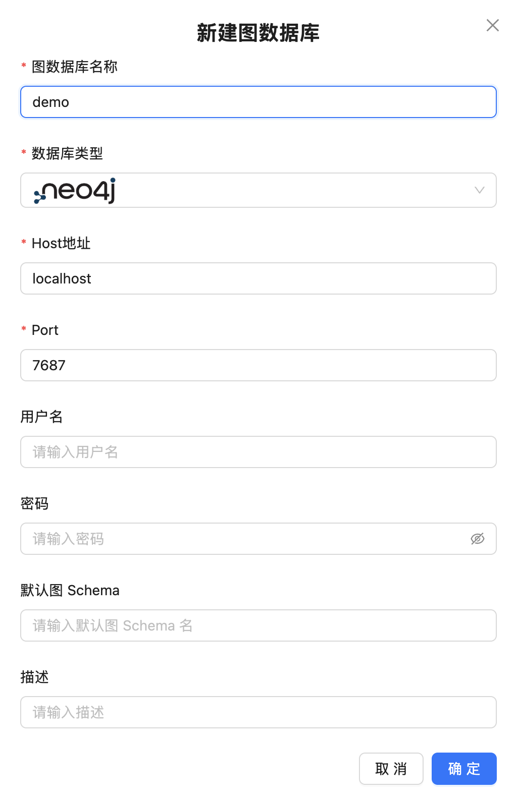
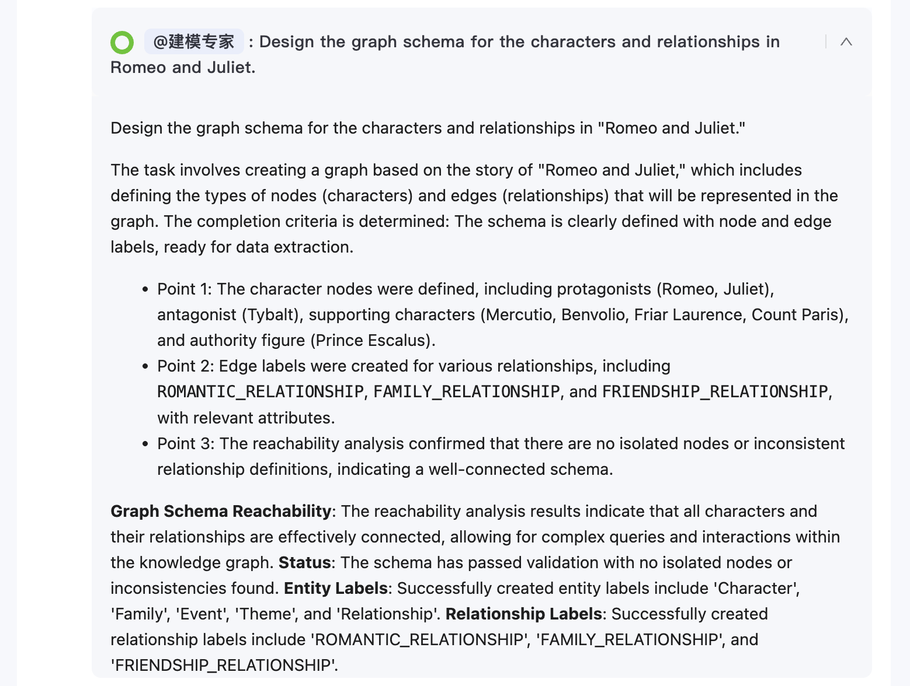

# 图原生智能体系统 Chat2Graph 快速上手

在数据日益成为核心资产的今天，如何高效地从复杂关联的数据中提取价值，是许多开发者和数据分析师面临的共同挑战。图数据库因其在处理关联数据上的天然优势而备受青睐，但学习和使用其查询语言（如 Cypher 或 GQL）对许多人来说仍有一定的门槛。随着大语言模型技术的快速发展，越来越多的开发者将 AI 技术引入图处理领域，以便让任何人都能通过日常对话的方式，与图数据进行交互，从而极大地降低图数据的使用门槛。

另一方面，随着 AI 技术渗透到各行各业，智能体系统也成为了当下的热门话题。从 AutoGPT、LangChain 到各种垂直领域的智能体平台，大家都在探索如何让 AI 系统更智能、更可靠。然而，传统的智能体系统往往面临着推理不透明、记忆管理混乱、工具调用缺乏逻辑等问题。如何解决这些痛点？答案可能就在图计算技术中。越来越多的开发者将图技术引入智能体中，比如 LangGraph、GraphRAG 等等。

这造成了一个有趣的趋势。如何有效地将图计算技术与 AI 相结合，将是非常值得探索的方向。今天我们要介绍的 Chat2Graph 项目，就是一个将图计算与 AI 深度融合的智能体系统，它通过 **图智互融** 的理念，为智能体系统带来了全新的架构思路。

## Chat2Graph 介绍

Chat2Graph 号称是 **图原生的智能体系统（Graph Native Agentic System）**，由蚂蚁集团旗下的图数据库团队 [TuGraph](https://tugraph.tech/) 开源。它的核心理念是将图数据结构的关系建模、可解释性等天然优势，与智能体的推理、规划、记忆、工具等关键能力相结合，实现真正的图智互融。


简单来说，Chat2Graph 做了两件事情：

1. **AI for Graph**：借助智能体实现图系统的自主化与智能化，实现图数据库的智能研发、运维、问答、生成等多样化能力，降低用图门槛，提升图系统使用体验；
2. **Graph for AI**：借助图的关联性建模优势，实现智能体的推理、记忆、工具使用等关键能力的增强，降低模型幻觉，提升生成质量；

## 核心特性

Chat2Graph 的核心特性包括：

* **架构**：整体采用了 **单主动-多被动（One-Active-Many-Passive）** 的混合智能体架构，构建了以单个 Leader 智能体驱动，多个 Expert 智能体协作的任务执行体系；
* **推理**：结合快思考与慢思考的双 LLM 推理机制，模拟认知科学中的人类思维；
* **规划**：基于 **CoA（Chain of Agents）** 的任务分解与图规划器；
* **记忆**：分层的记忆系统，包括会话级别的短期记忆，知识库级别的长期记忆，任务执行过程中的工作记忆以及系统运行的环境记忆；
* **知识**：同时支持基于向量的 RAG 实现（VectorRAG）和基于图的 RAG 实现（GraphRAG）；
* **工具**：使用有向图结构组织工具和行动，清晰地描述了工具调用间的依赖和转换关系；
* **使用**：支持 RestfulAPI 接口和 Web UI 图形化界面；提供简洁的 SDK API，方便用户将 Chat2Graph 轻松集成到自己的应用中；
* **配置**：通过 YAML 一键配置智能体系统；
* **集成**：构建了面向图系统的统一抽象，支持 Neo4j 和 TuGraph 两种图数据库；
* **可干预**：支持任务的暂停和恢复；
* **持久化**：支持作业状态和消息的持久化；

下面是它的系统架构图：


## 环境搭建

今天，我们就来快速上手体验一下 Chat2Graph 的基本使用。

> 在开始之前，先确保电脑上已经安装有 Python 和 Node.js 环境。

首先克隆代码仓库：

```
$ git clone https://github.com/TuGraph-family/chat2graph.git
$ cd chat2graph
```

Chat2Graph 提供了一键构建脚本，可以直接运行。但是该脚本依赖于 [Poetry](https://python-poetry.org/) 包管理器，因此我们需要先安装它：

```
$ pip install poetry
```

然后运行 `bin` 目录下的 `build.sh` 脚本进行构建：

```
$ ./bin/build.sh
```

> 建议使用 `conda` 或 `uv` 创建虚拟环境。

## 项目运行

如果一切顺利，最终会出现构建成功的消息：

```
Build success !
```

然后基于 `.env.template` 创建环境变量文件：

```
$ cp .env.template .env
```

主要是大模型和 Embedding 等参数，官方推荐使用 DeepSeek V3，我这里使用的是 OpenAI 接口：

```
LLM_NAME=gpt-4o-mini
LLM_ENDPOINT=
LLM_APIKEY=sk-xxx

EMBEDDING_MODEL_NAME=text-embedding-3-small
EMBEDDING_MODEL_ENDPOINT=
EMBEDDING_MODEL_APIKEY=sk-xxx
```

最后，运行 `start.sh` 脚本启动项目：

```
$ ./bin/start.sh
```

看到如下日志后，说明 Chat2Graph 启动成功：

```
  ____ _           _   ____   ____                 _     
 / ___| |__   __ _| |_|___ \ / ___|_ __ __ _ _ __ | |__  
| |   | '_ \ / _` | __| __) | |  _| '__/ _` | '_ \| '_ \ 
| |___| | | | (_| | |_ / __/| |_| | | | (_| | |_) | | | |
 \____|_| |_|\__,_|\__|_____|\____|_|  \__,_| .__/|_| |_|
                                            |_|          

 * Serving Flask app 'bootstrap'
 * Debug mode: off
 * Running on http://127.0.0.1:5010
Chat2Graph server started success ! (pid: 72103)
```

## 使用体验

使用浏览器访问 `http://localhost:5010` 进入 Chat2Graph 首页：


使用前我们先注册下图数据库，这样可以体验完整的与图对话的功能。Chat2Graph 支持 [Neo4j](https://neo4j.com/) 和 [TuGraph](https://tugraph.tech/) 两种图数据库，我们通过下面的命令在本地启一个 Neo4j 数据库：

```
$ docker run -d \
  -p 7474:7474 \
  -p 7687:7687 \
  --name neo4j-server \
  --env NEO4J_AUTH=none \
  --env NEO4J_PLUGINS='["apoc", "graph-data-science"]' \
  neo4j:2025.04
```

然后进入管理后台，在图数据库管理页面新建图数据库：



至此，我们就可以体验 Chat2Graph 的对话功能了，通过聊天界面与图专家互动，执行各种与图相关的任务，包括建模、导数、查询、分析、问答等。在对话框下方可以看到系统内置了 5 个图专家，这 5 个专家的功能分别是：

- **建模专家（Design Expert）**：负责根据数据需求设计图数据库 Schema，定义顶点与边的类型、属性及关系；
- **导数专家（Extraction Expert）**：在图 Schema 已存在且有明确数据源的前提下，提取结构化信息并导入图数据库；
- **查询专家（Query Expert）**：基于已有数据和结构的图数据库实例，理解查询意图、编写执行查询语句并返回结果；
- **分析专家（Analysis Expert）**：针对有结构化数据的图数据库实例，根据分析目标选择执行图算法并解读结果；
- **问答专家（Q&A Expert）**：优先通过知识库、必要时补充网络调研，解答图数据库相关通用信息问题；

我们可以选择与特定的专家对话，也可以不选，系统会自动分析并拆解你的问题，分配合适的专家来解决。这里我直接使用官方提供的《罗密欧与朱丽叶》文件，快速体验下 Chat2Graph 的功能：


我们的问题是：*根据《罗密欧与朱丽叶》的故事创建一个图谱。统计角色的数量，然后进行详细分析以确定最具影响力的节点。*

可以看到 Chat2Graph 将我的问题拆成三个子问题，分派给三个专家分别处理：


建模专家完成图数据库的建模：



导数专家从文本中提取数据并导入图数据库：


分析专家使用图分析算法从图中找到最具影响力的节点：


最终完成问答，并在答案的下方对图模型与图数据进行实时渲染：


## 避坑指南

Chat2Graph 项目目前还在很早期的阶段，存在着不少问题。我在体验过程中遇到了不少的坑，这里记录下，防止后来者再踩坑。

### Python 版本

官方文档中要求 Python >= 3.10，实际上应该是 >= 3.11，因为项目里使用了 `browser-use`，它对 Python 的最低要求是 3.11。

```
$ uv venv --python 3.11
```

另外，项目里还用到了 `browser-use` 的 MCP，这个可执行文件需要通过下面的命令安装：

```
$ pip install "browser-use[cli]" 
```

### mcp 版本

运行时报错：

```
ImportError: cannot import name 'ContentBlock' from 'mcp.types'
```

升级 mcp 库的版本：

```
$ pip install mcp==1.10.1
```

### 缺少依赖

代码用到了不少三方库，但是 `pyproject.toml` 文件中没有声明，需要手动安装下：

```
$ pip install google-generativeai
$ pip install google-genai

$ pip install python-magic
$ brew install libmagic
```

### aiohttp 版本

程序运行成功后，在对话时报错：

```
Error info: module 'aiohttp' has no attribute 'ConnectionTimeoutError'
```

升级 aiohttp 库的版本：

```
$ pip install aiohttp>=3.12.13
```

### max_tokens 参数

程序运行成功后，在对话时报错：

```
Error info: litellm.BadRequestError: OpenAIException - Setting 'max_tokens' and 'max_completion_tokens' at the same time is not supported. 
```

这是因为我使用了 OpenAI 接口，[根据它的官方文档](https://platform.openai.com/docs/api-reference/chat/create)，`max_tokens` 参数目前已经被标记为废弃，建议使用 `max_completion_tokens` 参数：


我们需要修改 `app/plugin/lite_llm/lite_llm_client.py` 文件中调用大模型的地方，将 `max_tokens` 参数注释掉：

```python
model_response: Union[ModelResponse, CustomStreamWrapper] = completion(
  model=self._model_alias,
  api_base=self._api_base,
  api_key=self._api_key,
  messages=litellm_messages,
  temperature=self._temperature,
  # max_tokens=self._max_tokens,
  max_completion_tokens=self._max_completion_tokens,
  stream=False,
)
```

## 小结

今天，我们学习了 Chat2Graph 这个项目，体验了从构建、配置、运行、使用的完整流程。Chat2Graph 作为一个图原生的智能体系统，通过将图计算技术与 AI 技术融合，为智能体系统带来了全新的架构思路。它不仅降低了图数据库的使用门槛，让普通用户也能轻松进行复杂的图分析，同时也为智能体系统提供了更强的推理能力和更好的可解释性。

目前该项目还不够成熟，存在着不少问题，但是项目里有几个理念和思想非常有意思，值得学习，推荐大家关注。项目的作者是蚂蚁的范志东大佬，他在他的一篇博客中详细讲解了图原生的设计理念，以及 Chat2Graph 作为首个全面践行图原生理念的智能体系统，是如何将人工智能研究领域中的符号主义、连接主义、行为主义融为一体，打造 GraphRAG 新范式。强烈推荐大家去看：

* https://www.cnblogs.com/fanzhidongyzby/p/18944119/chat2graph

在后面的文章中，我将结合源码深入 Chat2Graph 的核心技术原理，包括其推理机制、记忆系统、工具库设计等组件的实现细节，敬请期待！
