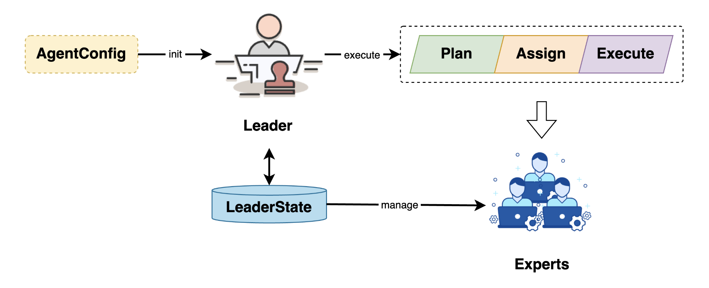
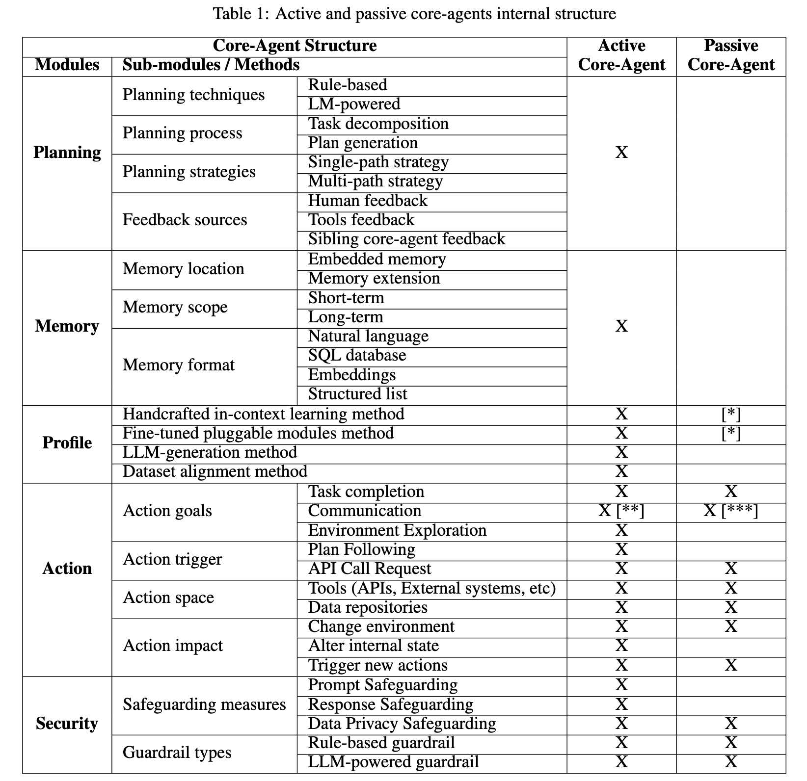
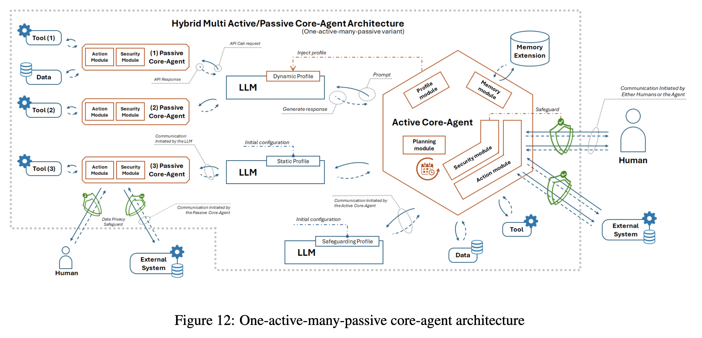

# 学习 Chat2Graph 的多智能体协作机制

昨天我们简单体验了 Chat2Graph 这个项目的安装和使用，通过一个例子演示了 Chat2Graph 的完整流程，了解了 Chat2Graph 作为一个图原生的智能体系统，通过将图计算技术与 AI 技术融合，不仅降低了用图门槛，同时也为智能体系统提供了更强的推理能力和更好的可解释性。

Chat2Graph 这个项目里引入了不少新的理念和思想，我们将结合源码深入它的核心原理，让我们先从它的多智能体协作机制开始。

## 用户对话的基本流程

当用户在聊天窗口发起对话时，调用 `chat` 接口，其实现位于 `app/server/api/session_api.py` 文件中：

```python
@sessions_bp.route("/<string:session_id>/chat", methods=["POST"])
def chat(session_id: str):

  # 构造 chat_message 并调用 SessionManager
  response_data, message = manager.chat(chat_message)
  return make_response(data=response_data, message=message)
```

它将请求传递到 `SessionManager` 进行处理：

```python
class SessionManager:
  def chat(self, chat_message: ChatMessage) -> Tuple[Dict[str, Any], str]:
    
    # 创建 SessionWrapper
    session_wrapper = self._agentic_service.session(session_id=chat_message.get_session_id())

    # 通过 SessionWrapper 将消息提交到多智能体系统
    job_wrapper = session_wrapper.submit(message=chat_message)

    # 保存会话
    # 更新会话名称
```

该方法通过 `AgenticService` 创建 `SessionWrapper`，并通过 `SessionWrapper` 将消息提交到多智能体系统。Chat2Graph 的代码采用分层架构，项目结构如下：

```
app/
├── core/           # 核心智能体框架
│   ├── agent/      # 智能体实现 (Leader, Expert)
│   ├── reasoner/   # 推理引擎  
│   ├── sdk/        # 开发者SDK
│   ├── service/    # 核心服务
│   └── toolkit/    # 工具系统
├── plugin/         # 插件生态 (Neo4j, LiteLLM等)
├── server/         # Flask Web 服务
└── web/            # React 前端界面
```

对前端请求的处理都是先到达 `server` 层，再由 `server` 层调用 `core` 层，而对 `core` 层的调用一般都通过 SDK 实现。SDK 中包含一个核心的 `AgenticService` 和一堆对核心服务的包装类（`XXXWrapper`）：

```
app/core/sdk
├── agentic_service.py
├── chat2graph.yml
└── wrapper
    ├── agent_wrapper.py
    ├── env_wrapper.py
    ├── graph_db_wrapper.py
    ├── job_wrapper.py
    ├── knowledge_wrapper.py
    ├── operator_wrapper.py
    ├── reasoner_wrapper.py
    ├── session_wrapper.py
    ├── toolkit_wrapper.py
    └── workflow_wrapper.py
```

因此这里的 `SessionWrapper` 就是对 `SessionService` 的包装，它的 `submit()` 函数实现如下：


```python
class SessionWrapper:
  def submit(self, message: ChatMessage) -> JobWrapper:
    
    # 获取当前用户消息
    # 获取历史会话消息
    
    # 创建并保存任务
    job = Job(
      goal=text_message.get_payload(),
      context=historical_context,
      session_id=self._session.id,
      assigned_expert_name=text_message.get_assigned_expert_name(),
    )
    job_service.save_job(job=job)
    job_wrapper = JobWrapper(job)

    # 将任务信息更新至会话

    # 异步运行任务
    run_in_thread(job_wrapper.execute)

    return job_wrapper
```

这里的核心逻辑是创建了一个任务，也就是 `Job` 对象，包含目标、上下文、会话 ID 等信息，然后通过 `JobWrapper` 异步运行它：

```python
class JobWrapper:
  def execute(self):
    # 调用 Leader 智能体
    agent_service: AgentService = AgentService.instance
    agent_service.leader.execute_original_job(original_job=self._job)
```

任务的运行由智能体模块 `AgentService` 负责，它包含 Leader 和 Expert 两类智能体，通过调用 Leader 智能体，多智能体系统由此开始启动。

## 智能体模块

智能体模块是 Chat2Graph 的核心，它负责接收任务、执行具体操作并返回结果。系统中存在两类特殊的智能体：

* **Leader 智能体**：作为总指挥，它接收用户的请求，理解用户意图，并将复杂任务分解为多个子任务，并根据每个子任务的特点分配给相应的 Expert 执行；
* **Expert 智能体**：专注于特定领域的任务处理，每个专家都具有明确的专业能力边界和执行职责，Chat2Graph 内置了建模、导数、查询、分析和问答 5 个专家；



其中 Leader 负责任务的规划、分配和执行，还包括 Expert 生命周期的管理，它通过 `AgentConfig` 初始化：

```python
class AgenticService(metaclass=Singleton):
  @staticmethod
  def load(yaml_path: Union[str, Path] = "app/core/sdk/chat2graph.yml") -> "AgenticService":

    # 加载 YAML 配置
    agentic_service_config = AgenticConfig.from_yaml(yaml_path, encoding)
    mas = AgenticService(agentic_service_config.app.name)

    # 推理机
    mas.reasoner(reasoner_type=agentic_service_config.reasoner.type)
    # 工具集
    mas.toolkit(*AgenticService._build_toolkit(agentic_service_config))

    # 构建 Leader 智能体
    mas.leader("Leader").workflow(
      AgenticService._build_leader_workflow(
        agentic_service_config=agentic_service_config,
      ),
      platform_type=workflow_platform_type,
    ).build()

    # 构建 Export 智能体
    for expert_config in agentic_service_config.experts:
      mas.expert(
        name=expert_config.profile.name,
        description=expert_config.profile.desc,
      ).workflow(
        *AgenticService._build_expert_workflow(
          expert_config=expert_config,
          agentic_service_config=agentic_service_config,
        ),
        platform_type=workflow_platform_type,
      ).build()

    return mas
```

这段代码在程序启动时就会被调用，通过 `chat2graph.yml` 配置文件构建出 1 个 Leader 智能体和 5 个 Expert 智能体。这个 YAML 文件比较复杂，包含了很多 Chat2Graph 中的概念，基本结构如下：

```yaml
app:
  name: "Chat2Graph"
  desc: "A Graph Native Agentic System."
  version: "0.0.1"

# 插件系统
plugin:
  workflow_platform: "DBGPT"

# 推理机
reasoner:
  type: "DUAL"

# 工具
tools:
  - &document_reader_tool
    name: "DocumentReader"
    module_path: "app.plugin.neo4j.resource.graph_modeling"
  # ...

# 行动
actions:
  - &content_understanding_action
    name: "content_understanding"
    desc: "Understand the main content and structure of the document through reading and annotating (requires calling one or more tools)."
    tools:
      - *document_reader_tool
  # ...

# 工具集
toolkit:
  - [
      *content_understanding_action,
      *deep_recognition_action
    ]
  # ...

# 算子
operators:
  - &analysis_operator
    instruction: |
      You are a professional document analysis expert, specializing in extracting key information from documents to lay a solid foundation for building knowledge graphs...
    output_schema: |
      ...
    actions:
      - *content_understanding_action
      - *deep_recognition_action

# 5 个 Export 智能体
experts:
  - profile:
      name: "Design Expert"
      desc: |
        He is a knowledge graph modeling (schema) expert...
    reasoner:
      actor_name: "Design Expert"
      thinker_name: "Design Expert"
    workflow:
      - [*analysis_operator, *concept_modeling_operator]

  - profile:
      name: "Extraction Expert"
      desc: |
        He is a Raw Data Extraction and Data Import Graph Data Expert...
    reasoner:
      actor_name: "Extraction Expert"
      thinker_name: "Extraction Expert"
    workflow:
      - [*data_importation_operator]

  - profile:
      name: "Query Expert"
      desc: |
        He is a Graph Data Query Expert...
    reasoner:
      actor_name: "Query Expert"
      thinker_name: "Query Expert"
    workflow:
      - [*query_design_operator]

  - profile:
      name: "Analysis Expert"
      desc: |
        He is a Graph Data Analysis and Algorithm Application Expert...
    reasoner:
      actor_name: "Analysis Expert"
      thinker_name: "Analysis Expert"
    workflow:
      - [*algorithms_execute_operator]

  - profile:
      name: "Q&A Expert"
      desc: |
        He is a General Q&A and Information Retrieval Expert with prioritized multi-source research capabilities...
    reasoner:
      actor_name: "Q&A Expert"
      thinker_name: "Q&A Expert"
    workflow:
      - [*retrieval_operator, *summary_operator]

# 1 个 Leader 智能体
leader:
  actions:
    - *query_system_status_action
    - *job_decomposition_action
```

这里的插件、推理机、工具、动作、算子我们暂时不用管，重点关注 1 个 Leader 智能体和 5 个 Expert 智能体的配置。可以看出每个智能体都由三个核心组件构成：

* **角色（Profile）**：定义了智能体的身份和能力范围；
* **推理机（Reasoner）**：提供了基于大语言模型的推理能力；
* **工作流（Workflow）**：则编排了任务执行的具体流程；

> Leader 智能体使用了内置的 Profile、Reasoner 和 Workflow，不需要在 YAML 文件中配置。

当用户输入自然语言指令时，Leader 智能体首先会理解任务意图，并将复杂任务分解为多个子任务，然后分配给相应的 Expert 智能体进行执行。

## 一主动多被动混合架构

像 Chat2Graph 这样的 1 个 Leader + 多个 Experts 智能体协作机制又被称为 **一主动多被动（One-Active-Many-Passive）** 架构，这种思想其实来自于去年的一篇论文：

* https://arxiv.org/abs/2409.11393

论文指出，传统的多智能体系统面临三大核心挑战：

1. **协调复杂性**：多个主动智能体同时决策容易产生冲突和混乱
2. **同步开销**：需要复杂的同步机制（如 Raft 共识算法）来协调多个主动智能体
3. **扩展困难**：添加新的智能体需要重新设计整个协调机制

因此，论文提出 **LLM-Agent-UMF（基于 LLM 的智能体统一建模框架）**，从功能和软件架构双视角明确智能体组件划分，引入 **Core-Agent（核心智能体）** 概念，并构建模块化、可扩展的体系。LLM-Agent-UMF 框架定义了 Core-Agent 的五大核心模块：

* **规划模块（Planning Module）**：将复杂任务分解为可执行的子任务，并生成最优执行计划；
* **记忆模块（Memory Module）**：存储和检索智能体运行过程中的关键信息，解决 LLM 上下文窗口有限问题；
* **角色模块（Profile Module）**：定义 LLM 的角色与行为模式，确保其输出符合任务场景需求；
* **行动模块（Action Module）**：将规划模块的高层指令转化为具体操作，调用工具或与环境交互；
* **安全模块（Security Module）**：基于 CIA 三元组（机密性、完整性、可用性），防范 LLM 应用的安全风险；

并根据智能体是否主导任务决策，将 Core-Agent 分为两类：

* **主动核心智能体（Active Core-Agent）**：具备完整的五大模块（规划、记忆、角色、行动、安全），主导任务决策与协调；有状态实体，可存储历史交互信息；典型能力包括自主分解复杂任务、动态调整角色或主动发起双向通信，适用于复杂任务处理；
* **被动核心智能体（Passive Core-Agent）**：仅保留行动模块与安全模块，无规划/记忆/角色模块；无状态实体，完全遵循外部指令；典型能力包括执行简单操作，如 API 调用、工具调用等，仅能被动响应通信；

这两类 Core-Agent 对比如下：



基于主动/被动的分类，论文提出两类多智能体架构：**统一架构（Uniform Architecture）** 和 **混合架构（Hybrid Architecture）**，统一架构又分为 **多被动核心架构**（1个LLM + 多个被动核心智能体）和 **多主动核心架构**（多个主动核心智能体协作）。多被动架构使用简单，易于扩展，但是缺乏高层决策能力，无法处理复杂任务；而多主动架构虽然具备强大的决策能力，但是需要设计复杂的同步机制（比如 Raft 选主），避免多个智能体决策冲突。

基于理论分析和实验验证，LLM-Agent-UMF 研究发现 **一主动多被动的混合架构为最优架构**，兼顾了决策能力与扩展性：



正是该理论为 Chat2Graph 的架构设计提供了科学依据。

## 小结

今天，我们通过对 Chat2Graph 源码和 LLM-Agent-UMF 论文的分析，学习了一主动多被动的多智能体混合架构：Leader 作为主动核心智能体，具备完整的规划、记忆、角色管理能力，统一协调整个系统；Expert 作为被动核心智能体，专注于特定领域的任务执行，简化了系统复杂度。

这种架构设计的核心优势在于：

1. **统一决策**：单一的 Leader 智能体避免了多个主动智能体之间的决策冲突，简化了协调机制；
2. **专业分工**：每个 Expert 智能体专注于特定领域（建模、导数、查询、分析、问答），提高了任务执行效率；
3. **扩展性强**：新增 Expert 智能体无需修改现有架构，只需在配置文件中定义新的专家即可；
4. **降低复杂度**：被动智能体无需维护状态和规划能力，降低了系统整体复杂度；

通过这种架构，Chat2Graph 不仅实现了高效的任务分解和执行，还为图原生智能体系统提供了一个可扩展的技术框架。在下一篇文章中，我们将深入分析 Chat2Graph 中智能体的具体实现，了解它使用的 **智能体链（CoA）** 以及 **快慢思考结合的双LLM推理机** 等高级机制。
