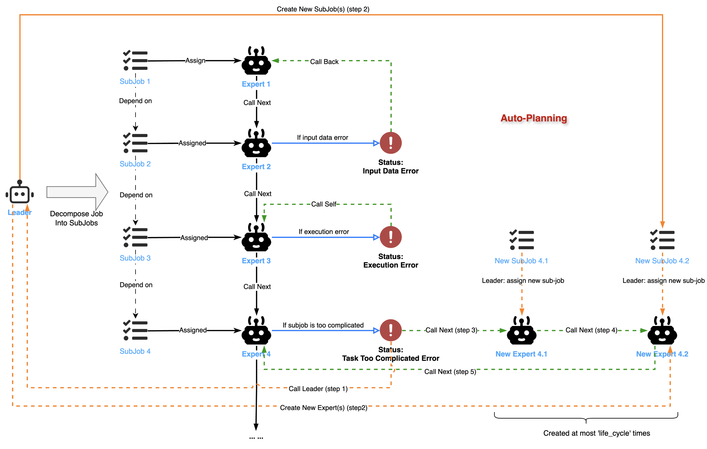

# 学习 Chat2Graph 的任务分解与执行

在前一篇文章中，我们学习了 Chat2Graph 一主动多被动的多智能体混合架构，了解了 Leader 智能体作为主动核心，负责统一决策和任务协调，而 Expert 智能体作为被动核心，专注于特定领域的任务执行。今天，我们将继续深入源码，详细分析 Leader 接受到任务之后的具体执行逻辑。

## Leader 智能体的实现

我们接着昨天的流程往下走，当通过 `JobWrapper` 提交任务后，系统调用 `AgentService` 的 Leader 智能体开始处理。让我们深入 `leader.py` 文件的 `execute_original_job()` 方法，了解 Leader 的完整工作流程：

```python
class Leader(Agent):
  
  # 执行原始任务
  def execute_original_job(self, original_job: Job) -> None:
    
    # 更新任务状态为 `RUNNING`
    original_job_result.status = JobStatus.RUNNING
    self._job_service.save_job_result(job_result=original_job_result)

    # 将任务分解为子任务图
    decomposed_job_graph: JobGraph = self.execute(
      agent_message=AgentMessage(
        job_id=original_job.id,
      )
    )

    # 将子任务图更新到 JobService
    self._job_service.replace_subgraph(
      original_job_id=original_job.id, new_subgraph=decomposed_job_graph
    )

    # 执行子任务图
    self.execute_job_graph(original_job_id=original_job.id)
```

该方法接收一个原始任务，首先将其状态更新为 `RUNNING`，然后调用 `execute()` 方法将其分解为子任务图，并将此图存入 `JobService`，最后调用 `execute_job_graph()` 来执行这张图。

## 任务分解和分配

我们先看一下任务分解的逻辑：

```python
class Leader(Agent):

  # 将任务分解为子任务图
  def execute(self, agent_message: AgentMessage, retry_count: int = 0) -> JobGraph:

    # 如果已经预设了 Expert，那么 Leader 将会跳过任务分解，直接将该任务分配给预设的 Expert
    # 此时，子任务图只有一个节点，即原始任务
    assigned_expert_name: Optional[str] = job.assigned_expert_name
    if assigned_expert_name:
      subjob = SubJob(
        original_job_id=original_job_id,
        goal=job.goal,
        assigned_expert_name=assigned_expert_name,
      )
      self._job_service.save_job(job=subjob)
      job_graph: JobGraph = JobGraph()
      job_graph.add_vertex(subjob.id)
      return job_graph

    # 获取专家列表
    # 组装分解提示词

    try:
      # 调用 Leader 智能体分解任务
      workflow_message = self._workflow.execute(job=decomp_job, reasoner=self._reasoner)

      # 解析子任务
      results: List[Union[Dict[str, Dict[str, str]], json.JSONDecodeError]] = parse_jsons(
        text=workflow_message.scratchpad,
        start_marker=r"^\s*<decomposition>\s*",
        end_marker="</decomposition>",
      )

    except (ValueError, json.JSONDecodeError, Exception) as e:
      # 出错后，提供异常信息再重试一次
      print("\033[38;5;208m[INFO]: Retrying decomposition with lesson...\033[0m")
      lesson = "<异常信息>"
      workflow_message = self._workflow.execute(
        job=decomp_job,
        reasoner=self._reasoner,
        lesson=lesson,
      )

    # 根据模型返回，创建子任务图
    job_graph = JobGraph()
    for subjob_id, subjob_dict in job_dict.items():
      # 每个子任务分配一个专家，对应图中的节点
      expert_name = subjob_dict["assigned_expert"]
      subjob = SubJob(
        original_job_id=original_job_id,
        goal=subjob_dict["goal"],
        assigned_expert_name=expert_name,
      )
      self._job_service.save_job(job=subjob)
      job_graph.add_vertex(subjob.id)

    for subjob_id, subjob_dict in job_dict.items():
      # 根据任务之间的依赖关系构建边
      current_unique_id = temp_to_unique_id_map[subjob_id]
      for dep_id in subjob_dict.get("dependencies", []):
        job_graph.add_edge(dep_unique_id, current_unique_id)

    # 确保子任务图为 DAG
    if not nx.is_directed_acyclic_graph(job_graph.get_graph()):
      self.fail_job_graph(...)
      return JobGraph()

    return job_graph
```

代码首先判断是否已经预设了 Expert，也就是用户对话时手动选定了某个专家，那么 Leader 将会跳过任务分解，直接将该任务分配给预设的 Expert，此时，子任务图只会有一个节点，即原始任务。

如果没有预设 Expert，Leader 则将用户的原始任务分解为一张子任务图。不同于传统智能体系统的线性规划器，Chat2Graph 采用了基于图结构的规划器，将原始任务拆分为可执行单元的同时，还保留了子任务间的依赖关系，以更好地应对任务执行的不确定性。

这是一个有向无环图（DAG），其中节点代表子任务，边代表子任务间的依赖关系：


任务分解的核心在于一个精心设计的 Prompt，即 `JOB_DECOMPOSITION_PROMPT`，它指导 Leader 将一个主任务分解为一系列可执行的子任务并分配给对应的 Expert：

```
## 任务范围与大语言模型能力

### 角色

将核心任务拆解为多个子任务（分配给多个领域专家）或单个子任务（分配给单个领域专家）。有时，一名专家可承担多个子任务。需确保下游专家获取完成任务所需的全部信息。构建上下文字段时，不得因总结或简化而丢失用户原始请求中的任何约束条件、数据或上下文信息。数学公式、代码片段、特定名称、假设前提、限制条件及指定要求等关键信息，必须完整保留原始形式。

### 能力

1. **主动推断意图（强制第一步）**：至关重要的是，你必须结合给定任务、完整对话历史及当前系统状态，推断用户的**真实潜在意图及下一步合理操作**。需自问：“结合当前系统状态、过往交互记录及用户最新输入（即便非指令形式），用户在整体任务中真正希望下一步实现什么目标？”  
2. **确定目标专家与行动**：分析当前系统状态（若提供相关工具/函数，可调用以获取信息），理解系统环境。随后，基于第一步推断的意图、当前系统状态、专家资质及其他潜在信息，确定具备完成下一步合理操作所需能力与资质的专家。  
3. **强制任务拆解**：你的**唯一输出内容为任务拆解结果**。必须针对第二步确定的专家，制定一个或多个子任务以实现推断的意图。若已根据所有要求生成完整且格式正确的拆解JSON，即表示拆解任务正在进行，随后需使用 `<deliverable>...</deliverable>` 标记任务结束。  
   - **信息不完整时仍需推进**：即便给定任务或对话历史显示存在缺失的前提条件（如用户提及忘记提供文件），仍需为相关专家制定子任务。默认必要条件将得到满足，或由专家处理该问题。  
   - **谨慎整合上下文**：需将给定任务、对话历史及其他系统状态信息中的所有可用上下文整合到子任务描述中。若发现潜在问题（如根据用户表述得知文件缺失），需在子任务的上下文部分简要注明，供专家参考（示例：“上下文：用户此前因文件缺失导致任务失败，并表示已忘记提供文件。默认本次导入任务所需文件将可用。”）。
   - 简单任务或仅需一名专家完成的任务（基于推断意图），应作为单个子任务处理。
   - **拆解时的最小必要步骤**：力求用最少的合理子任务实现推断意图，同时需以不违背推断意图及其他规则为前提。
4. **拆解时的目标专家分配**：仅将子任务分配给第二步确定的专家。
5. **自包含性**：每个子任务需包含完成所需的全部信息。  
6. **角色中立性**：除非任务中明确提及，否则避免在子任务中涉及特定角色。  
7. **边界意识**：子任务范围不得超出原始任务边界。  
8. 若任务仅需一步操作/一名专家完成，需将其作为单个子任务呈现。

## 任务结构与依赖关系

### 颗粒度

仅当任务确实需要多步操作且涉及不同专家能力时，才创建可执行、边界清晰的多个子任务。对于可由一名专家解决的简单任务，需结合对话历史，将整个给定任务整合为单个子任务。

### 目标制定（受对话历史影响）

子任务的目标字段**必须**详细表述，以反映结合对话历史理解的用户最新需求。

### 上下文（整合对话历史、强制要求且丰富信息以保证准确性）

需为专家提供所有必要细节。该字段**必须包含**：

1. 相关对话历史的摘要：说明此前提出的问题/给出的答案。
2. 用户反馈/方向调整：注明用户是否表达过不满、请求澄清、修正方向或缩小范围（示例：“用户认为此前答案过于笼统”、“用户明确要求忽略X并聚焦Y”、“用户修正了此前关于Z的假设”、“用户希望基于此前工作推进至下一任务”）。  
3. 对话历史对当前任务的影响：明确说明上述1、2点等如何决定当前目标的具体要求。

此外，还需说明预期输入（若除上下文外还有其他输入）及预期输出的性质。必须完整保留用户当前指令（来自对话历史）中的所有关键数据、假设、约束条件及要求，不得遗漏。这是为了防止子任务传递过程中出现信息丢失。例如，若用户提供数学方程`x+y=10, 2x-y=4`，则上下文部分必须包含完整方程。

### 依赖关系

仅当生成多个子任务时，才定义子任务间的逻辑流程。简单的单条子任务拆解不存在依赖关系。

### 完成标准（反映对话历史）

需为子任务成功完成制定清晰、可量化或可验证的标准。该标准**必须**直接应对对话历史中凸显的具体需求或修正内容，以及细化后的目标。示例：若对话历史显示用户缺少语法细节，完成标准需明确为“输出需提供操作A、B、C的具体语法示例”；若对话历史显示用户对笼统表述不满，完成标准需明确为“解释需避免过于宽泛的表述，聚焦用户要求的特定方面”。

### 子任务生成思考过程

对于每个子任务的思考字段，需以第一人称（“我”）解释子任务生成的推理过程。内容不得仅复述目标，而需展现生成该特定子任务的思考逻辑。简要包含：该子任务为何必要？我解决该子任务的初步思路是什么？我预见该子任务存在哪些关键注意事项、所需工具或潜在挑战？思考过程需聚焦当前子任务，体现规划性与前瞻性（参考示例风格），同时保持简洁清晰，避免冗余。
```

同时，Chat2Graph 明确定义了子任务包含的字段，参考 `JOB_DECOMPOSITION_OUTPUT_SCHEMA`，当任务完成时，返回下面这样的分解结果：

```
<decomposition>
  {
    "subtask_1": {
      "goal": "目标，必须精确反映用户最新请求。",
      "context": "上下文，需包含对话历史摘要、用户反馈以及这些上下文如何塑造当前任务。",
      "completion_criteria": "完成标准，需明确且可衡量，直接回应对话历史中突显的需求或修正。",
      "dependencies": ["subtask_*", "subtask_*", ...], // 依赖关系，仅在生成多个子任务时定义，用于确定子任务之间的依赖关系
      "language of the assigned_expert": "English",
      "assigned_expert": "分配的专家名，Leader 指定该子任务由哪位专家完成。",
      "thinking": "思考过程，要求 LLM 以第一人称解释生成该子任务的思考过程，包括其必要性、初步方法及关键考量。",
    },
    ... // 确保 JSON 格式正确
  }
</decomposition>
```

下面这个 JSON 就是入门篇里的示例在执行完任务分解后得到的结果：

```json
{
  "subtask_1": {
    "goal": "基于《罗密欧与朱丽叶》中的人物及人物关系创建图谱模式",
    "context": "该任务需为《罗密欧与朱丽叶》的故事定义图谱模式，将人物设定为 “节点”，人物间的关系设定为 “边”。此模式需清晰明确，以适用于后续的数据提取与分析工作。",
    "completion_criteria": "已定义带有合适节点标签与边标签的模式，可用于数据导入。",
    "dependencies": [],
    "language of the assigned_expert": "English",
    "assigned_expert": "Design Expert",
    "thinking": "我需要创建一个能准确呈现《罗密欧与朱丽叶》中人物及人物关系的模式。这对后续步骤至关重要，因为提取专家将依据此模式进行数据导入。我会确保该模式全面且清晰，为高效的数据提取与分析提供支持。"
  },
  "subtask_2": {
    "goal": "根据已定义的模式，从提供的文本文件中提取数据并导入图谱数据库",
    "context": "模式创建完成后，提取专家需依据已定义的模式，从文本文件《罗密欧与朱丽叶.txt》中提取结构化信息，并将其导入图谱数据库。",
    "completion_criteria": "数据已成功提取并导入图谱数据库，且与已定义的模式一致。",
    "dependencies": ["subtask_1"],
    "language of the assigned_expert": "English",
    "assigned_expert": "Extraction Expert",
    "thinking": "我的工作重点是从文本文件中提取相关人物及其关系信息。这需要格外细致，确保提取的数据与建模专家创建的模式相匹配。数据的成功导入对分析阶段而言至关重要。"
  },
  "subtask_3": {
    "goal": "对图谱进行详细分析，确定影响力最大的节点",
    "context": "数据导入图谱数据库后，分析专家需对图谱进行分析，基于人物间的关联与关系确定影响力最大的人物。",
    "completion_criteria": "分析结果可清晰识别出图谱中影响力最大的节点。",
    "dependencies": ["subtask_2"],
    "language of the assigned_expert": "English",
    "assigned_expert": "Analysis Expert",
    "thinking": "我将运用图谱分析技术来识别《罗密欧与朱丽叶》中影响力最大的人物。这包括计算中心性指标，并对结果进行解读，以理解人物关系的动态变化。"
  }
}
```

## 任务执行

完成任务分解和分配后，调用 `execute_job_graph()` 开始进入真正的任务执行流程：

```python
class Leader(Agent):

  # 执行子任务图
  def execute_job_graph(self, original_job_id: str) -> None:

    # 使用线程池，没有依赖的多个任务可以并行执行
    with ThreadPoolExecutor() as executor:

      # 只要任务没完成，就一直循环
      while pending_job_ids or running_jobs:

        # 找到所有就绪的任务（依赖任务已完成）
        ready_job_ids: Set[str] = set()
        for job_id in pending_job_ids:
          if all_predecessors_completed:
            job: SubJob = self._job_service.get_subjob(job_id)
            ready_job_ids.add(job_id)

        # 执行已就绪的任务
        for job_id in ready_job_ids:
          expert_id = self._job_service.get_subjob(job_id).expert_id
          expert = self.state.get_expert_by_id(expert_id=expert_id)
          # 调用 Expert 智能体
          running_jobs[job_id] = executor.submit(
            self._execute_job, expert, job_inputs[job_id]
          )
          pending_job_ids.remove(job_id)

        # 如果 running 任务已完成，移到 completed 列表里
        completed_job_ids = []
        for job_id, future in running_jobs.items():
          if future.done():
            completed_job_ids.append(job_id)

        # 处理已完成任务
        for completed_job_id in completed_job_ids:
          
          # 获取任务结果
          future = running_jobs[completed_job_id]
          agent_result: AgentMessage = future.result()

          if agent_result.get_workflow_result_message().status == WorkflowStatus.INPUT_DATA_ERROR:
            # 输入数据错误：将此子任务及其前置依赖任务重新加入待处理队列
            pending_job_ids.add(completed_job_id)
            predecessors = list(job_graph.predecessors(completed_job_id))
            pending_job_ids.update(predecessors)
          elif agent_result.get_workflow_result_message().status == WorkflowStatus.JOB_TOO_COMPLICATED_ERROR:
            # 子任务过于复杂：调用 execute() 方法再次分解
            old_job_graph: JobGraph = JobGraph()
            old_job_graph.add_vertex(completed_job_id)
            new_job_graqph: JobGraph = self.execute(agent_message=agent_result)
            self._job_service.replace_subgraph(
              original_job_id=original_job_id,
              new_subgraph=new_job_graqph,
              old_subgraph=old_job_graph,
            )
          else:
            # 任务正常完成
            expert_results[completed_job_id] = agent_result.get_workflow_result_message()

          # 移除已完成任务
          del running_jobs[completed_job_id]

        # 等待 0.5 秒，进入下一轮循环
        if not completed_job_ids and running_jobs:
          time.sleep(0.5)
```

这是 Chat2Graph 任务执行的核心逻辑，整体流程还是比较清晰的，主要就是一个 `while` 循环，首先找到所有已就绪的任务（依赖任务已完成），然后丢给 Expert 智能体执行，这里使用了线程池，没有依赖的多个任务可以并行执行，提高执行效率，这也是图规划器相比于传统的线性规划器的优势。这个过程持续循环，当子任务图中的所有子任务都成功完成，整个原始任务即告完成。若任何关键子任务失败或整个图的执行被中断，则原始任务会相应地标记为 `FAILED` 或 `STOPPED`。

这里对子任务的执行比较有意思，当 Expert 执行完子任务后，会返回一个 `WorkflowMessage`，其中包含任务的执行状态，该状态决定了后续流程：

* **子任务执行成功（SUCCESS）**：Leader 会记录结果，并更新子任务的状态，进而可能触发后续依赖任务的执行；
* **子任务执行出错（EXECUTION_ERROR）**：Expert 执行过程中发生内部错误，如 API 请求失败；Leader 会根据重试策略决定是否重试该 Expert 的执行。若达到最大重试次数，则该子任务及整个子图可能会被标记为 `FAILED`；
* **输入数据错误（INPUT_DATA_ERROR）**：Expert 判断输入数据有问题，无法继续执行；Leader 接收到此状态后，会将此子任务及其前置依赖任务重新加入待处理队列，并可能附带 lesson（经验教训）给前置任务的 Expert，以便修正输出；
* **子任务过于复杂（JOB_TOO_COMPLICATED_ERROR）**：Expert 认为当前子任务过于复杂，无法独立完成；Leader 会将此子任务视为一个新的原始任务，再次调用任务分解逻辑，将其进一步细化为更小的子任务，并更新到子任务图中。为防止无限分解，子任务设有生命周期（life_cycle）计数，每一次任务分解，生命周期将会减少 1，直到 0 为止；

可以看到，这里的 `EXECUTION_ERROR` 状态是在 Expert 智能体内部处理的，而 `INPUT_DATA_ERROR` 和 `JOB_TOO_COMPLICATED_ERROR` 是由 Leader 智能体处理；每个子任务的状态在 Leader 智能体和 Expert 智能体之间传递和转换，如下所示：



这种状态机确保了任务能够根据依赖关系进行并行处理，同时具备对执行过程中各类情况的适应性和纠错能力。此外，任务执行流程还支持中断和恢复操作，使得 Chat2Graph 的多智能体协作更加灵活和可控。

## 小结

今天，我们深入分析了 Chat2Graph 中 Leader 智能体的任务分解与执行机制。从任务提交到最终完成，Leader 智能体展现了强大的统筹能力：首先通过精心设计的 Prompt 将复杂任务分解为基于 DAG 的子任务图，明确定义了每个子任务的目标、上下文、完成标准和依赖关系；然后通过线程池实现并行执行，根据依赖关系动态调度任务，大大提高了执行效率。

特别值得关注的是 Chat2Graph 的容错与纠错机制。系统通过不同的状态码来处理任务执行过程中的各种情况，其中 `INPUT_DATA_ERROR` 状态会触发前置任务的重新执行以修正输出，而 `JOB_TOO_COMPLICATED_ERROR` 状态会触发任务的进一步分解，这种动态调整机制让系统具备了强大的自适应能力。

相比传统的线性规划器，Chat2Graph 基于图结构的规划器不仅能够表达更复杂的任务依赖关系，还支持任务的并行执行，在提高执行效率的同时保持了良好的灵活性和扩展性。这种设计为智能体系统处理复杂任务提供了新的思路和范式。
