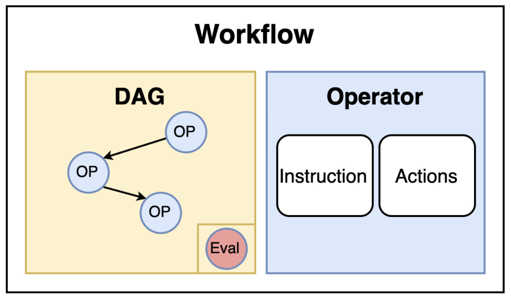
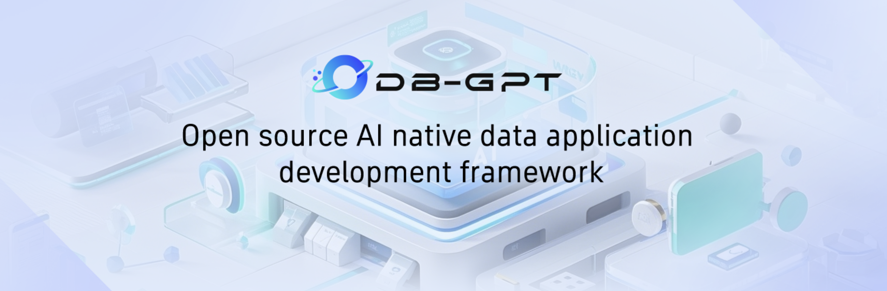
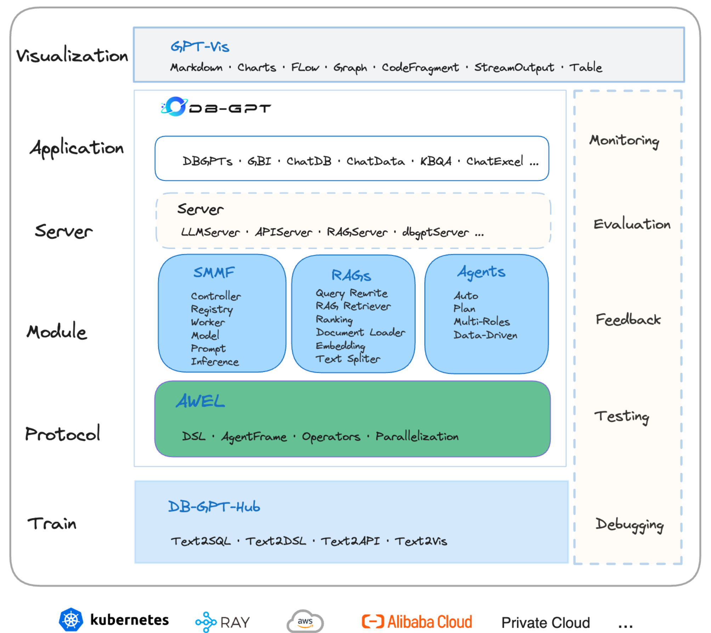

# 详解 Chat2Graph 的工作流实现

在前一篇文章中，我们深入分析了 Chat2Graph 中 Leader 智能体的任务分解与执行机制，了解了基于 DAG 的子任务图规划器和状态驱动的容错机制。今天，我们将继续深入源码，从 Expert 接受子任务开始，详细剖析智能体的初始化过程和工作流的实现原理。

## Expert 智能体的实现

我们昨天学到，当 Leader 完成任务分解后，子任务会被分配给对应的 Expert 智能体执行。Expert 智能体的实现位于 `app/core/agent/expert.py` 文件：

```python
class Expert(Agent):
  
  # 调用 Expert 智能体执行子任务
  def execute(self, agent_message: AgentMessage, retry_count: int = 0) -> AgentMessage:
    
    # 更新任务状态为 `RUNNING`
    job_result.status = JobStatus.RUNNING
    self._job_service.save_job_result(job_result=job_result)

    # 获取前置 Expert 的输出和经验教训
    workflow_messages: List[WorkflowMessage] = agent_message.get_workflow_messages()

    # 执行 Expert 智能体的工作流
    workflow_message: WorkflowMessage = self._workflow.execute(
      job=job,
      reasoner=self._reasoner,
      workflow_messages=workflow_messages,
      lesson=agent_message.get_lesson(),
    )

    # 检查执行状态
    self._message_service.save_message(message=workflow_message)
    if workflow_message.status == WorkflowStatus.SUCCESS:
      # 执行成功，保存结果，更新任务状态
      return expert_message
    if workflow_message.status == WorkflowStatus.EXECUTION_ERROR:
      # 执行出错，基于失败经验重试一次
      lesson = workflow_message.evaluation + "\n" + workflow_message.lesson
      agent_message.add_lesson(lesson)
      return self.execute(agent_message=agent_message, retry_count=retry_count + 1)
    if workflow_message.status == WorkflowStatus.INPUT_DATA_ERROR:
      # 输入数据错误，通知 Leader 重新执行前置任务
      lesson = "The output data is not valid"
      expert_message = self.save_output_agent_message(
        job=job, workflow_message=workflow_message, lesson=lesson
      )
      return expert_message
    if workflow_message.status == WorkflowStatus.JOB_TOO_COMPLICATED_ERROR:
      # 子任务过于复杂，通知 Leader 重新分解任务
      lesson = "The job is too complicated to be executed by the expert"
      expert_message = self.save_output_agent_message(
        job=job, workflow_message=workflow_message, lesson=lesson
      )
      return expert_message
    raise Exception("The workflow status is not defined.")
```

Expert 的执行和 Leader 的执行非常类似，都是先将状态置为 `RUNNING`，然后获取前置 Expert 的输出和经验教训，调用该智能体的工作流，最后根据不同的返回状态进行相应的处理。当返回 `EXECUTION_ERROR` 时，Expert 智能体会基于失败经验重试；当返回 `INPUT_DATA_ERROR` 时，通知 Leader 重新执行前置任务；当返回 `JOB_TOO_COMPLICATED_ERROR` 时，通知 Leader 重新分解任务。我们昨天已经详细学习过这些状态，此处不再赘述。

## 智能体的核心组成

从 Leader 智能体和 Expert 智能体的执行过程可以看出，其本质都是调用其内置的工作流实现的。在学习 `chat2graph.yml` 配置文件时，我们曾介绍过，Chat2Graph 的智能体由 **角色（Profile）**、**推理机（Reasoner）** 和 **工作流（Workflow）** 三个核心组件构成。下面是 5 位专家的详细配置：

```yaml
experts:
  - profile:
      name: "Design Expert"
      desc: |
        他是一位知识图谱建模（模式）专家。
        他的任务是根据特定的数据需求设计图谱的模式，清晰定义顶点（Vertices）和边（Edges）的类型、属性及关系。同时，他负责在图谱数据中创建/更新模式。
        他只能为特定的图数据库实例创建或修改数据结构（模式）。
        他的输出是清晰的模式定义，供后续数据导入使用。**他本身不处理具体数据（增删改查），也从不回答关于图数据库产品或技术本身的一般性介绍或询问。**
    reasoner:
      actor_name: "Design Expert"
      thinker_name: "Design Expert"
    workflow:
      - [*analysis_operator, *concept_modeling_operator]

  - profile:
      name: "Extraction Expert"
      desc: |
        他是一位原始数据提取与图数据导入专家。
        其前提条件是：目标图数据库中必须已存在图模式，且该模式已定义好节点和边的标签（无论其是否采用弱模式；否则，该专家无法执行任务），同时必须指定明确的原始数据源（例如用户提供的文档、文件、数据库表、待处理文本等），以便进行处理并导入到特定的图数据库实例中。
        他的任务是：1. 根据已定义的模式从原始数据中提取结构化信息。2. 将提取到的信息导入到目标图数据库中。
        他会输出数据导入过程的摘要或状态报告。**他不负责设计模式或执行查询分析，也绝不会提供有关图数据库技术或产品的一般性介绍。**
    reasoner:
      actor_name: "Extraction Expert"
      thinker_name: "Extraction Expert"
    workflow:
      - [*data_importation_operator]

  - profile:
      name: "Query Expert"
      desc: |
        他是一位图数据查询专家。
        假设有一个具有现有数据和已知结构的特定图数据库实例，需要执行精确的查询来检索特定的数据点或关系。
        他的任务是：1. 理解用户的具体查询意图。2. 编写精确的图查询语句。3. 在目标图数据库上执行查询。
        他将返回从查询中获得的具体数据结果。**他不进行复杂的图算法分析，不负责数据建模或导入，并且绝对不回答关于图数据库概念、产品或技术本身的一般性问题。**
    reasoner:
      actor_name: "Query Expert"
      thinker_name: "Query Expert"
    workflow:
      - [*query_design_operator]

  - profile:
      name: "Analysis Expert"
      desc: |
        他是一位图数据分析与算法应用专家。
        假设有一个特定的图数据库实例，其中包含现有的结构化数据，需要进行超出简单查询的复杂网络分析（如社区检测、中心性计算等）。
        他的任务是：根据分析目标，在目标图数据库上选择、配置并执行相应的图算法。
        他会返回算法的执行结果及其解释。**他不负责数据建模、导入、简单的节点/关系查询，也从不提供关于图数据库技术或产品的一般性介绍。**
    reasoner:
      actor_name: "Analysis Expert"
      thinker_name: "Analysis Expert"
    workflow:
      - [*algorithms_execute_operator]

  - profile:
      name: "Q&A Expert"
      desc: |
        他是一位通用问答与信息检索专家，具备不同优先级的多源研究能力。
        **当任务是要求提供关于某个概念、技术或产品的一般信息、定义、解释、比较或总结（例如，“介绍图”）时，他是首选专家，通常也是唯一的专家，** 尤其是当问题不涉及使用现有数据操作或查询特定的图数据库实例时。
        他的任务是：1. 理解问题。2. **优先将知识库检索作为主要信息来源。** 3. **仅在知识库结果不足或不完整时才进行网络研究。** 4. 综合信息时明确优先考虑知识库内容，将网络研究作为战略性补充。
        他会输出包含分层引用的全面答案，且优先引用知识库来源。** 他绝对不与任何特定项目的图数据库进行交互，不执行图查询或图算法，也不进行数据建模或导入。他专注于通过多源研究提供全面信息：知识库优先，网络研究作为智能备用。**
    reasoner:
      actor_name: "Q&A Expert"
      thinker_name: "Q&A Expert"
    workflow:
      - [*retrieval_operator, *summary_operator]
```

其中角色比较好理解，它是智能体的身份标识和能力定义，包含名称和描述两个字段。在 Expert 中，角色名称是被 Leader 识别的唯一标识，用于任务分配和结果追溯；描述部分则详细说明了智能体的专业能力、任务范围和操作限制，帮助 Leader 更好地根据专家配置信息来分配任务。在定义角色描述时，必须明确说明其能够处理的任务类型、执行所需的前置条件以及明确不应承担的职责范围。下面是定义角色描述的一些指导原则，供开发者参考：

* **能力边界明确定义**：应明确列出智能体的核心能力和操作限制。比如在 “建模专家” 的描述中，明确说明了 *“他只能为特定的图数据库实例创建或修改数据结构”* 以及 *“他本身不处理具体数据（增删改查）”*，这种明确的边界定义避免了任务分配时的歧义。
* **前置条件和依赖关系声明**：对于有特定前置要求的智能体，必须在描述中明确声明。比如在 “导数专家” 的描述中，要求 *“目标图数据库中必须已存在图模式，且该模式已定义好节点和边的标签”*，确保 Leader 在分配任务时能够正确评估任务的可执行性。
* **职责范围的精确表述**：使用否定描述来明确智能体不应承担的职责。比如在 “导数专家” 的描述中，要求 *“他不负责设计模式或执行查询分析，也绝不会提供有关图数据库技术或产品的一般性介绍”*，帮助 Leader 避免将不合适的任务分配给该智能体。
* **输出预期的具体化**：角色描述应说明智能体的典型输出形式。比如在 “建模专家” 的描述中，说明了 *“他的输出是清晰的模式定义，供后续数据导入使用”*，这有助于后续工作流的设计和任务链的构建。

通过这些指导原则，开发者能够创建具有清晰职责边界和明确能力定位的智能体，确保多智能体系统的高效协作。

第二个核心组件是推理机，它提供了基于大语言模型的推理能力。在智能体的工作流执行过程中，推理机承担着理解任务指令、生成响应内容、调用外部工具以及进行复杂推理等职责。

第三个核心组件是工作流，它是智能体执行任务的核心机制。它编排了任务执行的具体流程，定义了从任务接收到结果输出的完整处理步骤。

今天我们先来了解下工作流的实现原理，推理机的内容我们放到后面再看。

## 工作流的定义

工作流是由多个 **算子（Operator）** 按照特定的依赖关系组织而成的有向无环图（DAG），这是 Chat2Graph 作为图原生智能体系统的又一体现。在这个图中，每个节点代表一个算子，边代表算子之间的数据流向和执行顺序。



每个智能体（包括 Leader 和 Expert）都必须内置一个工作流，该工作流规定了智能体为完成特定类型任务所应遵循的标准化流程（SOP）。比如上面的 “建模专家”，它的工作流配置如下：

```yaml
experts:
  - profile:
      name: "Design Expert"
    workflow:
      - [*analysis_operator, *concept_modeling_operator]
```

这表示 “建模专家” 包含两个算子，它的工作流程是先进行文档分析（`analysis_operator`），然后再进行概念建模（`concept_modeling_operator`）。

每个算子负责特定阶段的任务处理，算子之间通过 `WorkflowMessage` 进行数据传递，形成了一个有序的处理链路。此外，除了主要的执行算子外，工作流还可以在末尾集成一个可选的评估算子，负责对整个工作流的输出结果进行评估，并可能生成反馈，供后续的算子或智能体参考和使用。

> Chat2Graph 默认并没有开启评估算子，如果要开启，需要修改 `AgenticService.load()` 的代码，在构建智能体的地方加上 `evaluator()` 方法。

## 工作流的实现

接下来我们来看下调用工作流的具体实现，其代码逻辑位于 `app/core/workflow/workflow.py` 文件：

```python
class Workflow(ABC):

  def execute(
    self,
    job: Job,
    reasoner: Reasoner,
    workflow_messages: Optional[List[WorkflowMessage]] = None,
    lesson: Optional[str] = None,
  ) -> WorkflowMessage:

    # 构建工作流
    def build_workflow():
      with self.__lock:
        if self.__workflow is None:
          self.__workflow = self._build_workflow(reasoner)
        return self.__workflow
    built_workflow = build_workflow()

    # 执行工作流
    workflow_message = self._execute_workflow(
      built_workflow, job, workflow_messages, lesson
    )
    return workflow_message
```

当工作流首次被调用时，它会触发一个构建工作流的方法（由线程锁保护，确保只构建一次），此方法负责将配置的所有算子转换成一个具体的可执行工作流实例。构建完成后，调用工作流，传入当前任务（`job`）、来自先前智能体的输出（`workflow_messages`）以及可能的经验教训（`lesson`）。

> 这里的 `self.__lock` 是通过 `threading.Lock()` 创建的，是一个线程锁对象，结合 `with` 语句确保在进入代码块时自动获取锁，在退出代码块时自动释放锁。这是 Python 中线程同步的标准做法，用于保护临界区代码，防止多个线程同时访问共享资源。

值得注意的是，这里的 `_build_workflow` 和 `_execute_workflow` 都是抽象方法，Chat2Graph 通过插件系统支持不同的工作流实现：

```yaml
plugin:
  workflow_platform: "DBGPT"
```

不过目前暂时只支持一种，即 DB-GPT 工作流，由 `DbgptWorkflow` 类实现：

```python
class DbgptWorkflow(Workflow):
  
  # 构建 DB-GPT 工作流
  def _build_workflow(self, reasoner: Reasoner) -> DbgptMapOperator:
    
    # 创建 DAG
    with DAG("dbgpt_workflow"):

      # 创建 InputOperator
      input_op = InputOperator(input_source=SimpleCallDataInputSource())

      # 第一步：将所有的算子转换为 MapOperator
      map_ops: Dict[str, DbgptMapOperator] = {}  # op_id -> map_op
      for op_id in self._operator_graph.nodes():
        base_op = self._operator_graph.nodes[op_id]["operator"]
        map_ops[op_id] = DbgptMapOperator(operator=base_op, reasoner=reasoner)

      # 第二步：插入 JoinOperator 连接 MapOperator
      for op_id in nx.topological_sort(self._operator_graph):
        current_op: DbgptMapOperator = map_ops[op_id]
        in_edges = list(self._operator_graph.in_edges(op_id))
        # 如果有前驱节点，连接前驱 MapOperator 到 JoinOperator，再连接到当前 MapOperator
        # JoinOperator 用于合并 InputOperator 和所有前驱 MapOperator 的数据
        if in_edges:
          join_op = JoinOperator(combine_function=_merge_workflow_messages)
          for src_id, _ in in_edges:
            map_ops[src_id] >> join_op
          input_op >> join_op
          join_op >> current_op
        else:
          # 如果没有前置节点，直接连接 InputOperator 和当前节点
          input_op >> current_op

      # 第三步：找到工作流的尾部，出度为 0 的算子（应该只有一个）
      tail_map_op_ids = [
        n for n in self._operator_graph.nodes() if self._operator_graph.out_degree(n) == 0
      ]
      _tail_map_op: DbgptMapOperator = map_ops[tail_map_op_ids[0]]

      # 第四步：如果存在评估器，添加到工作流末尾
      if self._evaluator:
        eval_map_op = DbgptMapOperator(operator=self._evaluator, reasoner=reasoner)
        join_op = JoinOperator(combine_function=_merge_workflow_messages)
        _tail_map_op >> join_op
        input_op >> join_op
        join_op >> eval_map_op
        self._tail_map_op = eval_map_op
      else:
        self._tail_map_op = _tail_map_op
      
      # 返回尾部算子
      return self._tail_map_op

  # 执行 DB-GPT 工作流
  def _execute_workflow(
    self,
    workflow: DbgptMapOperator,
    job: Job,
    workflow_messages: Optional[List[WorkflowMessage]] = None,
    lesson: Optional[str] = None,
  ) -> WorkflowMessage:
    return run_async_function(workflow.call, call_data=(job, workflow_messages, [], lesson))
```

这里的代码比较晦涩难懂，主要是因为这里使用了 DB-GPT 的 AWEL 语法，为了搞清楚这里的逻辑，我们不妨先了解下 DB-GPT 以及它的 AWEL 技术。

## DB-GPT 和 AWEL

[DB-GPT](https://github.com/eosphoros-ai/DB-GPT) 是一个开源的 AI 原生数据应用开发框架。2023 年 6 月由蚂蚁集团发起，通过 **多模型管理**、**Text2SQL 效果优化**、**RAG 框架**、**多智能体框架协作**、**基于 AWEL 的工作流编排** 等多项技术能力，让以数据库为基础的大模型应用变得更简单、更便捷。



DB-GPT 的主要功能特性包括：

- **检索增强生成**：实现了一套基于 RAG 的框架，用户可基于此构建知识类应用，支持自定义构建知识库，对海量结构化和非结构化数据进行统一向量存储与检索；
- **生成式商业智能**：支持自然语言与 Excel、数据库、数据仓库等多种数据源交互，并能进行分析报告，为企业报表分析、业务洞察提供数智化技术保障；
- **微调框架**：提供 Text2SQL 的自动化微调框架，支持 LoRA/QLoRA/Pturning 等微调方法，与 DB-GPT 项目无缝集成，在 Spider 数据集的准确率达到了 82.5%；
- **多智能体框架**：提供了一个数据驱动的自进化多智能体框架，旨在基于数据持续进行决策和执行，且原生支持 Auto-GPT 插件模型，智能体协议遵循 Agent Protocol 标准；
- **数据工厂**：主要用于在大模型时代对可信的知识和数据进行清洗与处理；
- **数据源**：整合各种数据源，将生产业务数据与 DB-GPT 的核心能力无缝连接；

以下为它的架构图：



在架构图的下方，可以看到一块绿色，这就是 DB-GPT 独创的智能工作流表达语言 **AWEL (Agentic Workflow Expression Language)**，Chat2Graph 的工作流就是基于它实现的。

AWEL 中的一个核心概念是 **算子（Operator）**，Chat2Graph 中的算子就是来源于他，下面是 AWEL 的入门示例：

```python
import asyncio

from dbgpt.core.awel import DAG, MapOperator

with DAG("awel_hello_world") as dag:
  task = MapOperator(map_function=lambda x: print(f"Hello, {x}!"))

asyncio.run(task.call(call_data="world"))
```

这段代码创建了一个名为 `awel_hello_world` 的 DAG，该 DAG 仅包含一个简单的 `MapOperator` 算子，它是 AWEL 内置的基础算子，接收一个 `map_function` 函数并使用传递给它的数据来调用该函数。所有的算子都是异步执行的，因此我们用 `asyncio.run()` 来执行工作流。

上面这个 DAG 只有一个节点，让我们看一个包含多节点的例子：

```python
import asyncio

from dbgpt.core.awel import DAG, MapOperator, InputOperator, SimpleCallDataInputSource

with DAG("awel_hello_world") as dag:
  input_task = InputOperator(input_source=SimpleCallDataInputSource())
  task = MapOperator(map_function=lambda x: print(f"Hello, {x}!"))
  input_task >> task

asyncio.run(task.call(call_data="world"))
```

在这段代码中，我们新加了一个 `InputOperator` 算子，这也是 AWEL 的基础算子之一，该算子接受工作流的输入，并传递给下一个算子。我们使用 `>>` 运算符来连接两个算子，该运算符用于定义算子之间的父子关系，也称为任务依赖。你也可以使用 `set_downstream()` 方法来定义任务依赖，比如：

```python
  input_task.set_downstream(task)
```

了解了 AWEL 中的这些概念，再回过头看 `DbgptWorkflow` 的实现就简单多了。其中 `DbgptMapOperator` 就是 `MapOperator` 的一个实现，它是对 Chat2Graph 算子的封装，每个 Chat2Graph 算子都是通过推理机调用大模型完成某项具体的任务；另外，前后 `MapOperator` 算子之间使用 `JoinOperator` 算子连接，它接受一个 `combine_function` 函数将来自多个输入的数据合并为一个数据；最后将评估器算子 `EvalOperator` 添加到整个工作流的尾部。

值得留意的一点是，在 AWEL 定义的工作流中，可以有多个起始节点，但只有一个结束节点，因此在调用工作流时是通过尾节点进行调用的。看 `_build_workflow()` 的代码，返回尾部算子即可，在 `_execute_workflow()` 中，直接调用这个尾部算子的 `call()` 方法。

更多关于 AWEL 的内容，可以参考 DB-GPT 的官方文档：

* http://docs.dbgpt.cn/docs/awel/

## 小结

今天，我们深入分析了 Chat2Graph 中工作流的实现原理，从 Expert 智能体的执行逻辑开始，详细了解了智能体的三大核心组件：角色、推理机和工作流。工作流作为智能体执行任务的核心机制，通过多个算子按照 DAG 结构组织，形成了标准化的任务处理流程，同时也体现了 Chat2Graph 作为图原生智能体系统的特色。

此外，通过对 DB-GPT 和 AWEL 技术的学习，我们理解了 Chat2Graph 工作流的底层实现机制。AWEL 作为智能工作流表达语言，提供了基于算子和有向无环图的编程模型，使得复杂的智能体工作流能够以声明式的方式进行定义和执行。

在下一篇文章中，我们将继续深入 Chat2Graph 的推理机制，了解它如何实现快思考与慢思考的双 LLM 推理，以及这种设计如何提升智能体的推理质量和可解释性。
