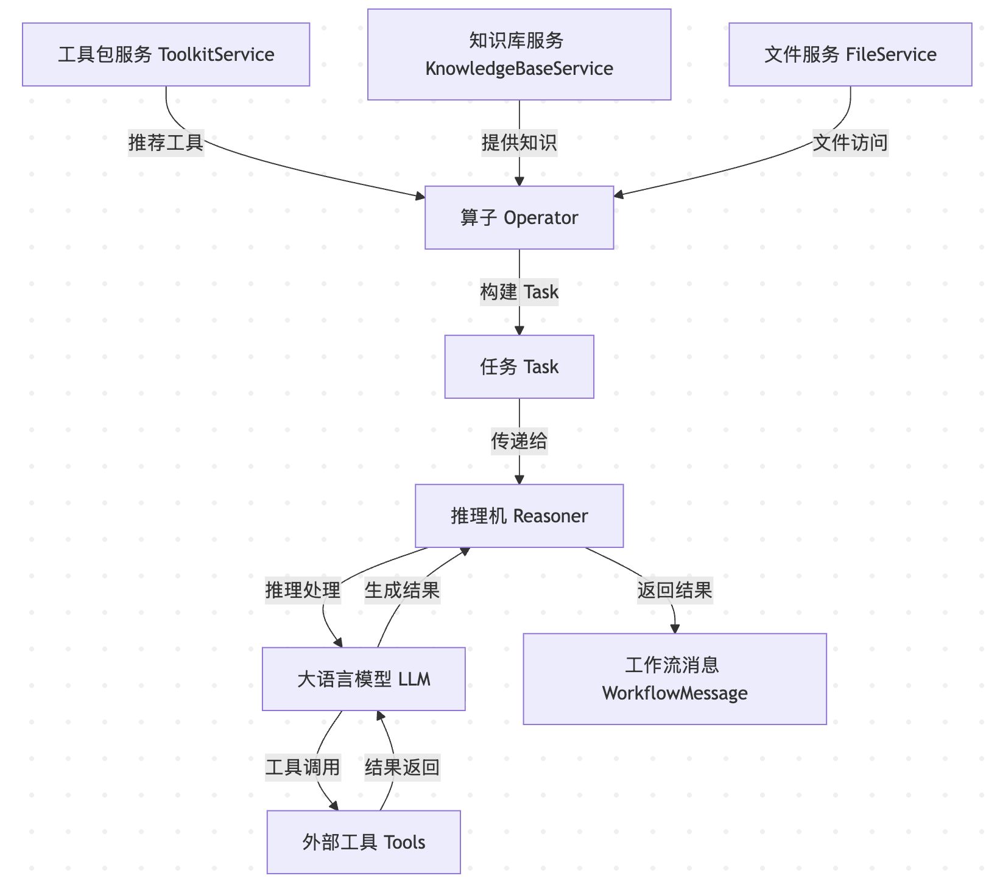
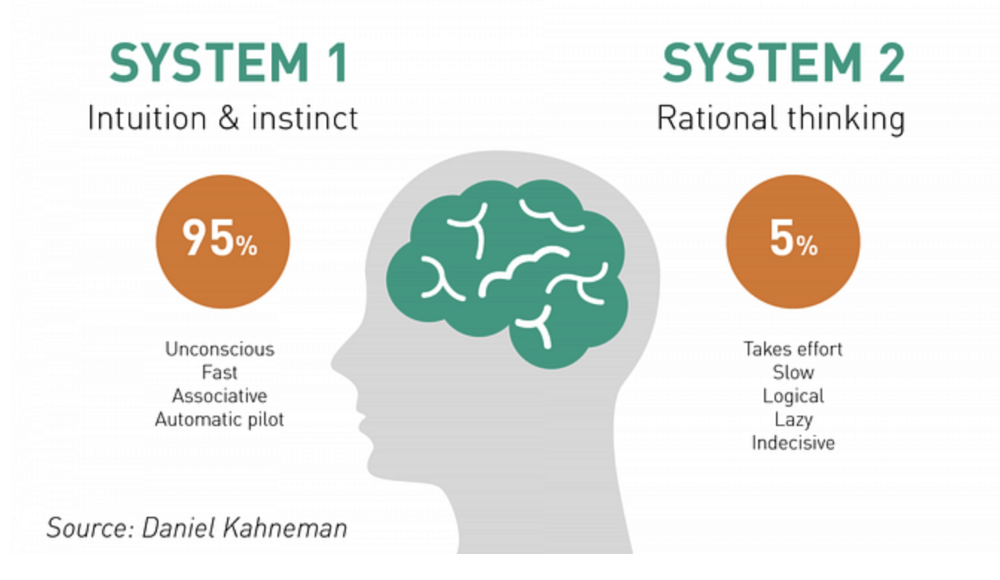
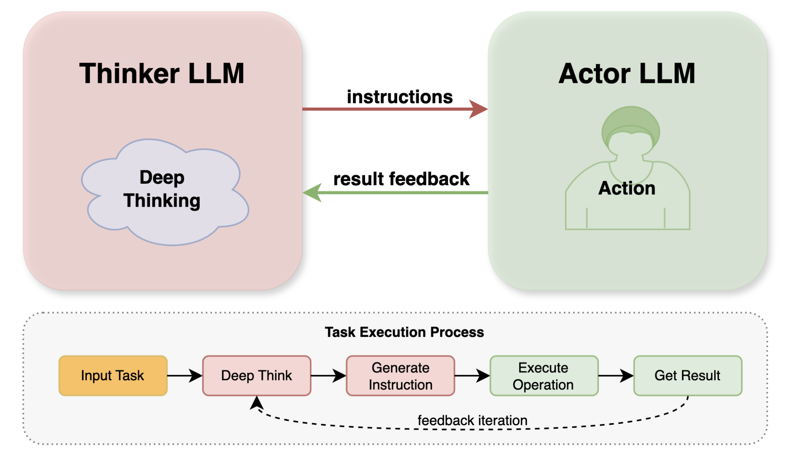
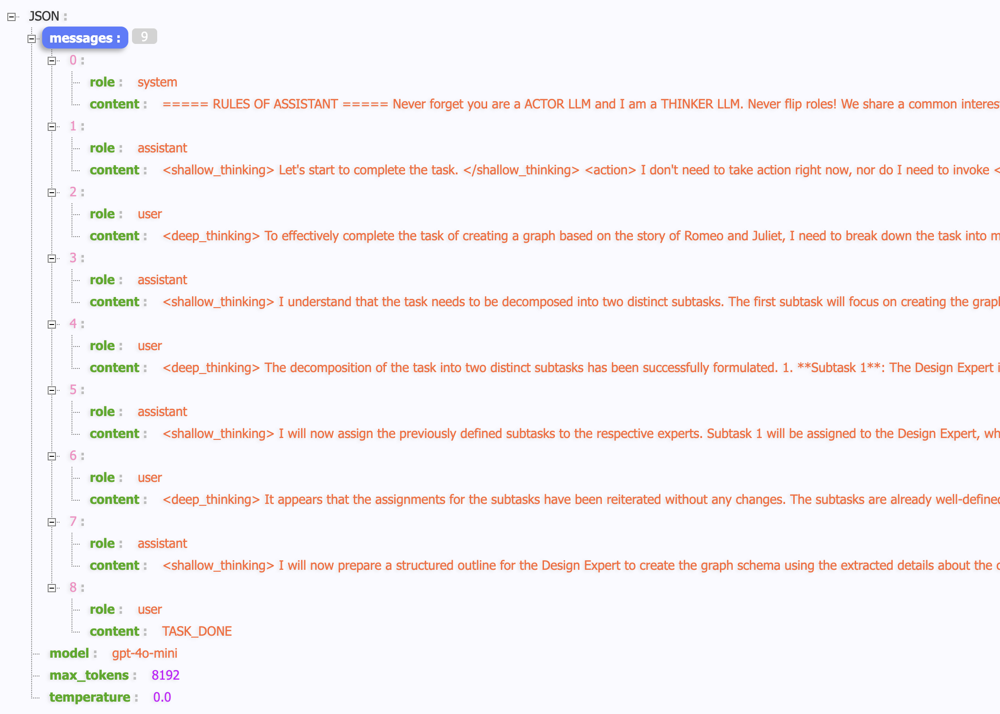
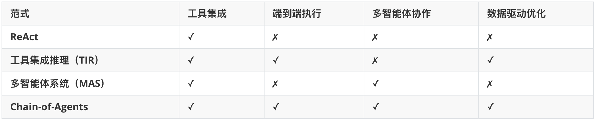
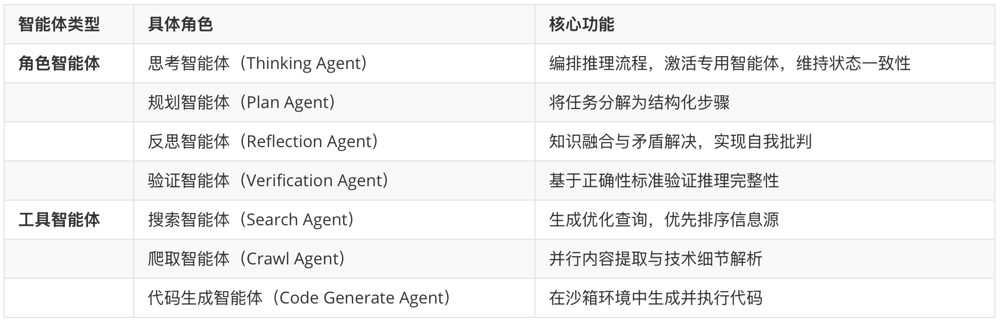
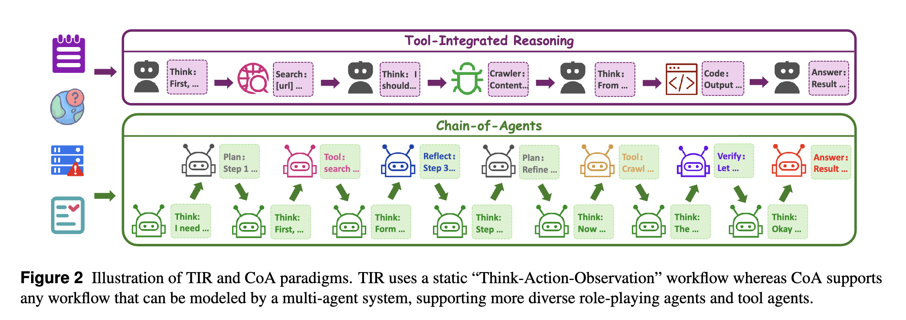

# 详解 Chat2Graph 的推理机实现

经过昨天的学习，我们了解了智能体的三大核心组件：角色、推理机和工作流。角色用于对智能体的专业能力、任务范围和操作限制进行描述，帮助 Leader 更好地分配任务；工作流则是通过将多个算子按照 DAG 结构组织，形成标准化的任务处理流程；而推理机是整个系统的核心，它通过调用大模型并执行推理任务，承担着理解任务指令、生成响应内容、调用外部工具以及进行复杂推理等职责。

Chat2Graph 的推理机和工作流中的算子是密不可分的，今天，我们将继续深入源码，从算子的配置和运行逻辑开始，详细分析推理机的实现机制。

## 算子的配置

我们知道，工作流由多个算子组成，每个算子承担着特定阶段的任务处理，Chat2Graph 的算子和 AWEL 中的基础算子不同，Chat2Graph 中的每个算子都是由推理机驱动的。在构建工作流时，我们会对算子执行初始化：

```python
operator = (
  OperatorWrapper()
  .instruction(op_config.instruction)
  .output_schema(op_config.output_schema)
  .actions(operator_actions)
  .build()
)
```

可以看到算子的配置包括 `instruction`、`output_schema` 和 `actions` 三个字段，这些信息都是供推理机使用的：

* **instruction** - 给推理机的指令，用于描述算子的角色、需要完成的任务目标、执行任务时的注意事项以及期望的输出风格等；推理机会根据这个指令来理解任务并规划执行步骤；
* **output_schema**	- 定义算子执行完成后期望输出内容的格式和结构，可以是 YAML、JSON 格式或者自然语言的字符串描述，用于指导推理机生成符合预期的结构化输出；
* **actions** - 算子在执行任务时可以调用的一系列动作，算子会基于这些动作，通过 `ToolkitService` 获取推荐的工具和更具体的动作，供推理机选择和执行；

昨天我们提到，“建模专家” 的工作流包含两个算子：文档分析（`analysis_operator`）和概念建模（`concept_modeling_operator`），我们可以看下这两个算子在 `chat2graph.yml` 文件中的配置：

```yaml
operators:
  - &analysis_operator
    instruction: |
      你是一名专业的文档分析专家，擅长从文档中提取关键信息，为构建知识图谱奠定坚实基础。
      你需要理解文档内容。请注意，你所分析的文档可能只是完整集合的一部分，这要求你能从局部细节推断出整体情况。
      请注意，你的任务不是操作图数据库。你的任务是对文档进行分析，为后续的知识图谱建模提供重要信息。
      请确保你的分析全面且详细，并为每个结论提供充分的推理依据。
    output_schema: |
      **领域**: 对文档领域的描述，有助于后续的建模和数据提取。
      **数据全景视图**：对文档内整体数据的详细评估，包括数据结构、规模、实体关系等，并提供推理和依据。
      **概念**：已识别的关键概念列表，每个概念包含名称、描述和重要性。
      **属性**：为概念识别出的属性列表，每个属性包括其关联的概念、名称、描述和数据类型。
      **潜在关系**：已识别的潜在关系列表，每个关系包括其类型、涉及的实体、描述和强度。
      **文档洞察**：该文档特有的其他重要信息或发现，用分号分隔。例如，对文档中提到的特定事件或概念的独特解读。
      **文档片段**：文档中用于支持分析结论并提供上下文的关键片段。可以是直接引语或重要段落。
    actions:
      - *content_understanding_action
      - *deep_recognition_action

  - &concept_modeling_operator
    instruction: |
      你是一位知识图谱建模专家，擅长将概念和关系转化为图数据库模式。
      你需要基于文档分析的结果完成概念建模任务，同时确保图模型的正确性和可达性。

      1. 模式生成
      使用 `graph_schema_creator` 函数生成模式，为顶点和边创建特定的模式。你不能直接编写 Cypher 语句，而是使用提供的工具函数与数据库进行交互。
      请注意：模式生成不是关于向数据库中插入特定数据（如节点、关系），而是定义图数据库的结构（模式/标签）。期望是定义实体类型、关系类型、约束等内容。
      该任务的背景是知识图谱，因此应关注相对通用的实体类型，而非特定的个体实体。例如，考虑时间、抽象概念、物理实体和社会实体等主要维度。
      你需要多次阅读现有的 TuGraph 模式，以确保使用该工具创建的模式符合预期。

      2. 验证图的可达性
      可达性是图数据库的核心特性之一，它确保图中的实体和关系之间存在有效的连接路径，以支持复杂的查询需求。这在图建模中很重要，因为如果图不可达，就无法构建完整的知识图谱。
      通过查询图数据库以检索图的结构信息，来验证实体和关系的可达性。
    output_schema: |
      **图模式可达性**：可达性分析结果，描述图中实体与关系之间的连接路径。
      **状态**：模式状态，指示其是否通过验证。
      **实体标签**：成功创建的实体标签列表，例如 “Person（人）”、“Organization（组织）”。
      **关系标签**：成功创建的关系标签列表，例如 “WorksAt（就职于）”、“LocatedIn（位于）”。
    actions:
      - *content_understanding_action
      - *deep_recognition_action
      - *entity_type_definition_action
      - *relation_type_definition_action
      - *schema_design_and_import_action
      - *graph_validation_action
```

注意这里的 YAML 语法，使用 `&` 表示引用，在定义专家时，可以使用 `*` 表示引用的内容：

```yaml
experts:
  - profile:
      name: "Design Expert"
    workflow:
      - [*analysis_operator, *concept_modeling_operator]
```

## 算子的运行逻辑

让我们深入 `app/core/workflow/operator.py` 文件，了解算子的执行逻辑：

```python
class Operator:

  async def execute(
    self,
    reasoner: Reasoner,
    job: Job,
    workflow_messages: Optional[List[WorkflowMessage]] = None,
    previous_expert_outputs: Optional[List[WorkflowMessage]] = None,
    lesson: Optional[str] = None,
  ) -> WorkflowMessage:
    
    # 1. 构建 Task 对象
    task = self._build_task(
      job=job,
      workflow_messages=workflow_messages,
      previous_expert_outputs=previous_expert_outputs,
      lesson=lesson,
    )

    # 2. 通过推理机进行推理
    result = await reasoner.infer(task=task)

    # 3. 返回工作流消息
    return WorkflowMessage(payload={"scratchpad": result}, job_id=job.id)
```

算子的执行过程比较简单，可以分为三个核心步骤：

1. **构建任务对象**：将原始的 Job 信息、前置算子的输出、相关工具和动作等整合成一个完整的 Task 对象，具体的整合步骤包括：
  - **获取推荐工具和动作**：通过 `ToolkitService` 根据算子配置中的 `actions`、相似度阈值和图中的跳数，推荐相关的工具和动作；
  - **整合上下文信息**：合并来自前置算子和专家的输出消息，形成完整的上下文；
  - **检索知识信息**：从知识库中获取与任务目标相关的知识；
  - **获取文件资源**：提取任务相关的文件描述符，便于推理机访问文件内容；
  - **包含经验教训**：如果存在来自智能体的反馈，也会包含在任务中指导执行；
2. **调用推理机推理**：将构建好的 Task 对象交给推理机处理，这是算子执行的核心环节；
3. **返回工作流消息**：将推理机的执行结果封装为 `WorkflowMessage` 返回，供后续算子使用；

## 算子和推理机的关系

从算子的执行流程可以看出，算子和推理机之间是一种明确的协作关系：

- **算子是调度者**：负责收集和整理任务执行所需的所有资源和上下文信息，包括工具、动作、知识、文件、经验教训等；
- **推理机是执行者**：接收算子构建的 Task 对象，基于大语言模型的推理能力，理解任务指令、选择合适的工具、执行相应的动作，并生成最终结果。



这种分工让系统具备了良好的可扩展性。算子专注于任务的资源准备和流程编排，而推理机专注于智能推理和工具调用。两者通过标准化的 Task 对象进行交互，实现了松耦合的设计。

## 推理机的定义

Chat2Graph 的推理机模块是与大语言模型交互的核心，其职责在于处理提示词，执行推理任务，并提供工具调用的能力。它封装了底层大模型的调用细节，为算子提供统一的推理接口。推理机的基类定义在 `app/core/reasoner/reasoner.py` 中：

```python
class Reasoner(ABC):
  
  @abstractmethod
  async def infer(self, task: Task) -> str:
    # 通过推理机进行推理

  @abstractmethod
  async def conclude(self, reasoner_memory: ReasonerMemory) -> str:
    # 总结推理结果
```

推理机的核心职责包括：

1. **任务理解**：解析算子传递的 Task 对象，理解任务目标、上下文信息和可用资源；
2. **推理规划**：基于任务要求制定执行计划，选择合适的工具和动作；
3. **工具调用**：与外部工具进行交互，获取必要的信息或执行特定操作；
4. **结果生成**：综合推理过程和工具调用结果，生成最终的任务输出；

Chat2Graph 提供了两种推理机实现：**单模推理机（MonoModelReasoner）** 和 **双模推理机（DualModelReasoner）**，以适应不同场景下的推理需求。我们可以在 `chat2graph.yml` 配置文件中切换：

```yaml
reasoner:
  type: "DUAL" # MONO 单模，DUAL 双模
```

## 单模推理机

单模推理机依赖于单个大模型实例来完成所有任务处理阶段，包括理解用户指令、进行思考、选择必要的工具，并最终生成回复或执行动作。它的实现如下：

```python
class MonoModelReasoner(Reasoner):

  async def infer(self, task: Task) -> str:
    
    # 设置系统提示词
    sys_prompt = self._format_system_prompt(task=task)
    
    # 初始消息，触发推理过程
    init_message = ModelMessage(
      source_type=MessageSourceType.MODEL,
      payload=(
        "<deep_thinking>\nLet's start to complete the task.\n</deep_thinking>\n"
        "<action>\nEmpty\n</action>\n"
      ),
      job_id=task.job.id,
      step=1,
    )
    reasoner_memory.add_message(init_message)

    # 不断调用大模型生成响应
    for _ in range(max_reasoning_rounds):
      response = await self._model.generate(
        sys_prompt=sys_prompt,
        messages=reasoner_memory.get_messages(),
        tools=task.tools,
        tool_call_ctx=task.get_tool_call_ctx(),
      )
      response.set_source_type(MessageSourceType.MODEL)
      reasoner_memory.add_message(response)

      # 判断任务是否完成
      if self.stopped(response):
        break

    # 提取最终的推理结果
    return await self.conclude(reasoner_memory=reasoner_memory)
```

单模推理机的工作方式相对直观：

1. **系统提示词**：结合算子的配置和任务上下文等信息构建系统提示词；
2. **初始化推理**：创建一个固定的初始消息，包含基本的思考和行动框架；
3. **循环推理**：在最大推理轮数内不断调用模型生成响应；
4. **结果判断**：检查模型是否完成任务，通过 `stopped()` 方法检查是否包含 `<deliverable>` 标签；
5. **结论生成**：从 `<deliverable>` 标签中提取最终的推理结果；

单模推理机的核心在于 `MONO_PROMPT_TEMPLATE` 这个提示词模板，这个提示词比较长，我们主要关注几点：

- **元认知框架**：要求大模型使用元认知框架和自己对话，进行深度思考 (`<deep_thinking>`)，展示其推理过程和深度；
- **思考与行动一体**：在深度思考之后，在 `<action>` 部分执行具体的行动，包括文本生成、分析或调用外部工具；
- **终止条件与交付**：当大模型判断任务已解决时，必须使用 `TASK_DONE` 和 `<deliverable>` 标签来标记任务完成；

> **元认知（Metacognition）** 是心理学和教育学领域的一个概念，简单来说，它指的是 **对认知的认知**，也就是我们主动监控、评估、调节自己思考过程的能力。

单模推理机旨在使单个大模型能够以自给自足的方式处理复杂任务，它的主要优点在于配置简单直观，推理链路相对简短。但在处理需要强大推理能力或复杂能力组合的任务时，可能会表现出性能不足。

## 双模推理机

心理学家卡尼曼提出，人类大脑中存在两套系统：**系统1** 和 **系统2**。系统1是无意识的、快速的、直观的，而系统2则是有意识的、缓慢的、需要付出心理努力的，这两套系统在我们日常生活中相互作用，共同影响着我们的思考、决策和行为。



双模推理机模拟了人类的快思考和慢思考系统，采用两个大模型实例协同工作的模式。让我们看看它的实现：

```python
class DualModelReasoner(Reasoner):

  async def infer(self, task: Task) -> str:
    
    # 设置 Thinker 和 Actor 的系统提示词
    actor_sys_prompt = self._format_actor_sys_prompt(task=task)
    thinker_sys_prompt = self._format_thinker_sys_prompt(task=task)
    
    # 交替调用大模型生成响应
    for _ in range(max_reasoning_rounds):
      # Thinker 思考
      response = await self._thinker_model.generate(
        sys_prompt=thinker_sys_prompt,
        messages=reasoner_memory.get_messages(),
        tool_call_ctx=task.get_tool_call_ctx(),
      )
      response.set_source_type(MessageSourceType.THINKER)
      reasoner_memory.add_message(response)

      # Actor 执行
      response = await self._actor_model.generate(
        sys_prompt=actor_sys_prompt,
        messages=reasoner_memory.get_messages(),
        tools=task.tools,
        tool_call_ctx=task.get_tool_call_ctx(),
      )
      response.set_source_type(MessageSourceType.ACTOR)
      reasoner_memory.add_message(response)

      # 判断任务是否完成
      if self.stopped(response):
        break

    # 提取最终的推理结果
    return await self.conclude(reasoner_memory=reasoner_memory)
```

双模推理机和单模推理机的代码结构几乎是一样的，只是在每轮推理时调用了两次大模型，分别扮演两个不同的角色：

- **Thinker（思考者）**：负责理解复杂的用户意图、分解任务、制定计划，并在需要时决定调用哪个工具或子任务；
- **Actor（执行者）**：负责接收并执行 Thinker 的指令，擅长快速思考，专注于工具调用和格式化输出；



双模推理机为 Thinker 和 Actor 分别设计了不同的提示词模板。

Thinker 提示词（`THINKER_PROMPT_TEMPLATE`）的要点如下：

- **元认知框架**：同样要求大模型使用元认知框架，使用 `<deep_thinking>` 标签进行深度思考，结合思考模式标记来展现其推理过程；
- **指令生成**：主要输出是为 Actor 生成清晰、具体的指令 (`<instruction>`) 和必要的输入 (`<input>`)；
- **结果评估**：负责评估 Actor 的执行结果，包括工具调用的结果，基于此进行下一步规划；
- **禁止行为**：不应自己执行工具调用或生成最终交付成果；

Actor 提示词（`ACTOR_PROMPT_TEMPLATE`）的要点如下：

- **指令执行**：接收并执行 Thinker 提供的指令和输入；
- **浅层思考**：使用 `<shallow_thinking>` 进行浅层思考，主要聚焦于如何准确执行当前指令；
- **动作执行**：在 `<action>` 部分执行具体操作，包括生成文本、分析或调用工具；
- **最终交付**：当 Thinker 发出 `TASK_DONE` 指令后，负责整合信息并生成 `<deliverable>` 最终交付物；

下面是我在任务执行时抓的一次请求：



可以看到，Thinker 和 Actor 就像人一样，你一言我一语地交叉式对话，直到 Thinker 认为任务已经完成，发出 `TASK_DONE` 指令。当 Actor 收到该指令后，就会通过 `<deliverable>` 标签生成最终结果，完成推理。

## CoA 多智能体范式

Chat2Graph 的双模推理机设计受到了 OPPO 提出的 **Chain-of-Agents（CoA）** 范式的启发。CoA 是一种将多智能体协作能力融入单一模型的创新方法，通过 **单一模型模拟多智能体协作** 来解决传统多智能体系统效率低、泛化弱、数据驱动学习缺失等问题。论文地址：

* https://arxiv.org/abs/2508.13167

这是一种端到端的训练方法，在单一模型内动态激活，模拟多智能体协作，通过 **智能体监督微调（Agentic SFT）** 与 **智能体强化学习（Agentic RL）** 两个阶段，训练出 **智能体基础模型（Agent Foundation Models, AFMs）**，在网页搜索、代码生成、数学推理三大领域的近 20 个基准测试中刷新了 SOTA 水平。

与传统的智能体范式相比，CoA 的优势如下表所示：



前两种范式用于单智能体：ReAct 基于 Prompt 实现，是最早也是最简单的智能体实现，但是这种方式不是端到端的，没办法训练，于是提出了 TIR 工具集成推理。

后两种范式用于多智能体：传统的 MAS 框架和 ReAct 一样，也很难训练，无法通过数据驱动学习，CoA 方法的提出就是弥补这块的缺口。

CoA 将智能体划分为 **角色智能体** 与 **工具智能体**，这和之前介绍的 LLM-Agent-UMF 框架将智能体划分为 **主动核心智能体** 和 **被动核心智能体** 有着异曲同工之妙：



CoA 和 TIR 很像，只不过两者推理的轨迹不同，TIR 推理轨迹是工具的调用，而 CoA 的轨迹是不同智能体的激活：



Chat2Graph 的双模推理机借鉴了 CoA 的核心思想，但做了适合系统架构的简化：比如 Thinker 承担了 CoA 中思考智能体、规划智能体和反思智能体的职责，负责深度分析、任务规划和结果评估；而 Actor 类似于 CoA 中的各种工具智能体，专注于执行具体的工具调用和操作；通过 Thinker 和 Actor 之间的交替对话，实现了推理状态的动态转移和智能体角色的切换；但是与 CoA 端到端优化的训练方法不同，Chat2Graph 通过提示词工程和推理机架构设计，在推理时实现了多智能体协作的效果。

## 小结

今天，我们深入分析了 Chat2Graph 中算子与推理机的协作机制，算子作为调度者负责收集和整理任务资源，推理机作为执行者基于大语言模型的能力完成智能推理和工具调用，两者通过标准化的 Task 对象实现了松耦合的协作。

特别值得关注的是 Chat2Graph 的双模推理机设计，它借鉴了 OPPO 提出的 Chain-of-Agents 范式，通过 Thinker 和 Actor 两个角色的协作，模拟了人类的快慢思考系统。Thinker 负责深度分析和规划，Actor 专注于执行和工具调用，这种分工让系统在处理复杂任务时展现出了更强的推理能力和更好的可解释性。

相比单模推理机的简洁直观，双模推理机虽然增加了一定的复杂度，但通过角色专业化和任务分工，能够在复杂场景下提供更优的推理质量。这种设计为智能体系统的推理能力提升提供了新的思路和实践路径。

在下一篇文章中，我们将继续深入 Chat2Graph 的工具系统，了解它如何实现智能体与外部世界的交互，以及如何通过有向图来优化工具调用的效果。
