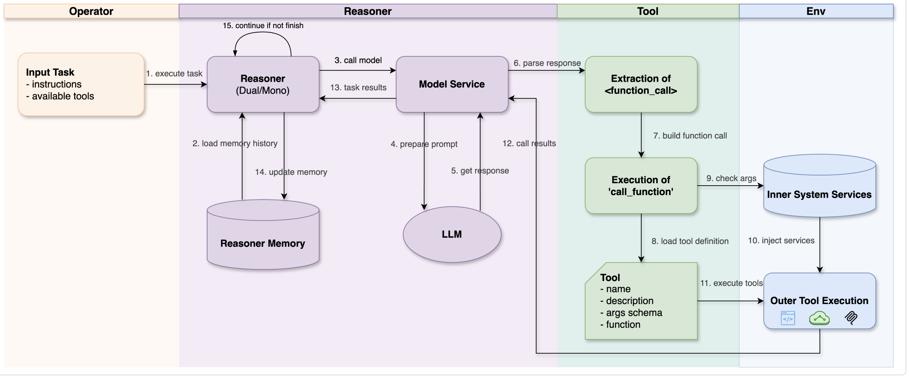
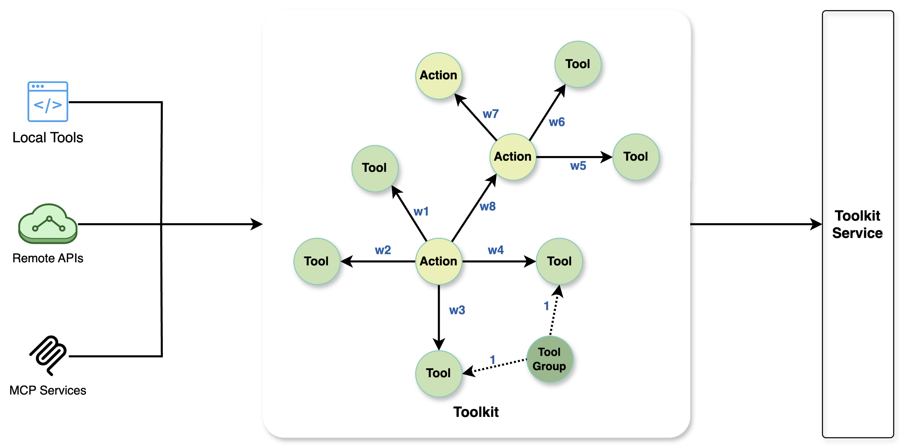
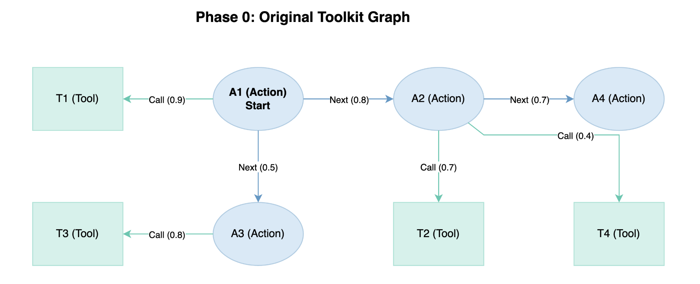
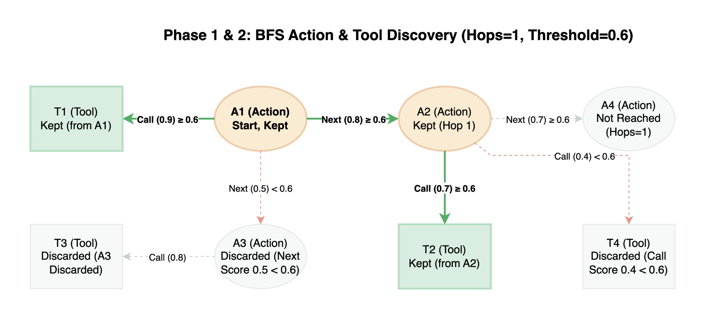
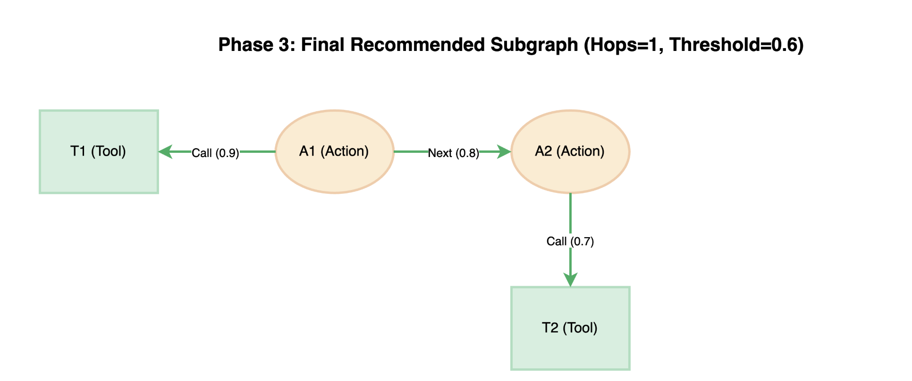

# 详解 Chat2Graph 的工具系统实现

在上一篇文章中，我们深入分析了 Chat2Graph 中算子与推理机的协作机制，以及双模推理机的设计原理。今天，我们将继续深入源码，从推理机如何调用大模型开始，详细介绍 Chat2Graph 的工具系统实现，包括 `Action`、`Tool`、`ToolGroup`、`Toolkit` 等核心概念，以及它们如何通过有向图来优化工具调用的效果。

## 模型服务

在 Chat2Graph 的架构中，推理机并不直接与大模型交互，而是通过 **模型服务（`ModelService`）** 这个中间层来实现。模型服务封装了不同 LLM 平台的调用细节，为推理机提供了统一的接口，它是一个抽象基类，定义在 `app/core/reasoner/model_service.py` 中：

```python
class ModelService(ABC):

  @abstractmethod
  async def generate(
    self,
    sys_prompt: str,
    messages: List[ModelMessage],
    tools: Optional[List[Tool]] = None,
    tool_call_ctx: Optional[ToolCallContext] = None,
  ) -> ModelMessage:
    """生成模型响应"""

  async def call_function(
    self,
    tools: List[Tool],
    model_response_text: str,
    tool_call_ctx: Optional[ToolCallContext] = None,
  ) -> Optional[List[FunctionCallResult]]:
    """基于模型响应调用工具函数"""
```

模型服务的核心职责包括：

1. **统一接口**：通过 `generate()` 方法为推理机提供统一的模型调用接口；
2. **工具调用**：通过 `call_function()` 方法解析模型响应中的工具调用请求并执行；
3. **服务注入**：自动注入系统内部服务到工具参数中，比如 `GraphDbService`、`KnowledgeBaseService` 等；
4. **错误处理**：处理工具调用过程中的各种异常情况；

Chat2Graph 支持三种模型服务的实现：

- `LiteLlmClient` - 使用 [LiteLLM](https://github.com/BerriAI/litellm) 库调用大模型，；
- `AiSuiteLlmClient` - 使用 [AiSuite](https://github.com/andrewyng/aisuite) 库调用大模型，该项目由大佬吴恩达领导开发，旨在提供统一接口来调用不同的 LLM API，简化 AI 模型的调用过程，不过项目不怎么活跃，已不推荐使用；
- `DbgptLlmClient` - 使用 [DB-GPT](https://github.com/csunny/DB-GPT) 中的 `LLMClient` 类调用大模型；

可以在 `.env` 环境变量中切换：

```shell
MODEL_PLATFORM_TYPE="LITELLM"
```

## 工具调用原理

Chat2Graph 没有使用目前比较流行的 Function Call 或 Tool Call 技术，而是使用纯 Prompt 方式，通过让大模型生成带 `<function_call>...</function_call>` 这样的标签，实现工具调用。

工具调用的 Prompt 参考 `FUNC_CALLING_PROMPT`，我对其进行总结如下：

1. 所有工具调用都必须包裹在 `<action>` 部分内的 `<function_call>...</function_call>` 标签中。如需调用多个函数，可包含多个 `<function_call>` 代码块。
2. 每个 `<function_call>` 内部的内容必须是有效的 JSON 对象，且包含三个必填键：
    * `"name"`：待调用函数的名称（字符串类型）；
    * `"call_objective"`：调用此函数的简要目的说明（字符串类型）；
    * `"args"`：包含该函数所有参数的对象，若无需参数，使用空对象 `{}`；
3. 对于标准数据类型（如短字符串、数字、布尔值或简单嵌套对象/数组），使用标准 JSON 格式：
    * 键名和字符串必须使用 **双引号**（`"`）包裹；
    * 不得使用末尾逗号；
4. 对于复杂的、多行参数（如代码、HTML、Markdown），使用 **Payload 包装器**：
    * **Payload 包装器** 以 **起始标记（Start Marker）** `__PAYLOAD_START__` 开始，并以 **结束标记（End Marker）** `__PAYLOAD_END__` 结束；
    * 对于多行参数，只需将原始内容放置在这两个标记之间即可，无需手动转义；

下面是一个简单的工具调用示例：

```xml
<action>
  <function_call>
  {
    "name": "update_user_profile",
    "call_objective": "更新用户姓名和通知设置。",
    "args": {
      "user_id": 123,
      "profile": {
        "name": "Alice",
        "notifications_enabled": true
      }
    }
  }
  </function_call>
</action>
```

这里比较有意思的一点是 **Payload 包装器（Payload Wrapper）** 的设计。当 JSON 字符串中包含多行代码或含特殊字符的文本时，需要进行转义处理，比如让大模型生成下面这样的代码片段，不仅可读性差，而且很容易出错：

```json
{
  "code": "def greet(name):\n\t# 这是代码内部的注释\n\tmessage = f\"Hello, {name}! Welcome.\"\n\tprint(message)"
}
```

使用 Payload 包装器，无需对特殊符号进行转义，大模型的输出更加可控：

```xml
<action>
  <function_call>
  {
    "name": "execute_python_code",
    "call_objective": "定义一个向用户打招呼的函数，并调用该函数。",
    "args": {
      "code": __PAYLOAD_START__
def greet(name):
  # 这是代码内部的注释
  # 注意：此处无需添加任何转义字符
  message = f"Hello, {name}! Welcome."
  print(message)

greet("World")
__PAYLOAD_END__
    }
  }
  </function_call>
</action>
```

然后，模型服务通过 `call_function()` 方法解析模型响应中的这些标签，找到对应的工具并执行：

```python
async def call_function(
  self,
  tools: List[Tool],
  model_response_text: str,
  tool_call_ctx: Optional[ToolCallContext] = None,
) -> Optional[List[FunctionCallResult]]:

  # 解析模型响应中的 `<function_call>` 标签
  func_calls = self._parse_function_calls(model_response_text)

  func_call_results: List[FunctionCallResult] = []
  for func_tuple, err in func_calls:

    # 根据名称找到可执行的函数
    func_name, call_objective, func_args = func_tuple
    func = self._find_function(func_name, tools)
    
    # 通过反射获取函数签名，根据参数类型注入一些内置的参数或服务
    # 比如 `ToolCallContext`、`GraphDbService`、`KnowledgeBaseService` 等
    sig = inspect.signature(func)
    for param_name, param in sig.parameters.items():
      injection_type_found: bool = False
      param_type: Any = param.annotation

      # 注入 `ToolCallContext` 参数
      if param_type is ToolCallContext:
        func_args[param_name] = tool_call_ctx
        injection_type_found = True
        continue

      # 注入内置服务
      if not injection_type_found:
        if param_type in injection_services_mapping:
          func_args[param_name] = injection_services_mapping[param_type]

    # 调用函数
    if inspect.iscoroutinefunction(func):
      result = await func(**func_args)
    else:
      result = func(**func_args)

    # 封装函数调用结果
    func_call_results.append(
      FunctionCallResult(
        func_name=func_name,
        call_objective=call_objective,
        func_args=func_args,
        status=FunctionCallStatus.SUCCEEDED,
        output=str(result),
      )
    )

  return func_call_results
```

整个过程比较简单：首先解析 `<function_call>` 标签，然后根据名称找到可执行的函数并调用，最后返回封装后的调用结果。

这里值得一提的是 Chat2Graph 的服务注入机制，通过自动检测函数签名中的参数类型，允许工具函数自动获取系统内部服务的实例，比如 `ToolCallContext`、`GraphDbService`、`KnowledgeBaseService` 等。例如，一个图数据库查询工具可以这样定义：

```python
def query_graph_database(
  query: str,
  graph_service: GraphDbService
) -> str:
  """查询图数据库
  
  Args:
    query: Cypher 查询语句
    graph_service: 图数据库服务
  """
  return graph_service.execute_query(query)
```

当 LLM 调用这个工具时，只需要提供 `query` 参数，`graph_service` 参数会由系统自动注入。

最后，工具执行的结果会返回给推理机，推理机基于执行结果判断是否完成了算子所定义的任务目标，推理下一步的动作，如果未完成，可能会继续调用其他工具，直到完成为止。整个流程如下所示：



## 基于图的工具库设计

那么这些工具是哪里来的呢？答案是 Chat2Graph 的 **工具库（`Toolkit`）** 模块。工具库是一个有向图，这是 Chat2Graph 作为图原生智能体系统的又一体现，它通过 **动作（`Action`）** 、**工具（`Tool`）**、**工具组（`ToolGroup`）** 构成的图结构来实现智能化的工具推荐和调用。



这里对几个概念稍加解释：

1. **工具（`Tool`）** 是工具系统的基本执行单元，包含其名称、功能描述以及具体的执行逻辑；支持 `LOCAL_TOOL` 和 `MCP_TOOL` 两种类型的工具，`LOCAL_TOOL` 指的是一个本地函数，可以是同步或异步函数，Chat2Graph 会自动检测函数类型并适配调用方式；`MCP_TOOL` 指的是 MCP Server 中的一个工具，一般通过工具组来配置，不会单独配置；
2. **动作（`Action`）**  代表大模型在执行任务过程中的一个状态或决策点，是工具库中的核心节点，它的描述信息有助于大模型理解其代表的意图和功能；一个动作可以关联一个或多个工具，也可以一个都不关联；
3. **工具组（`ToolGroup`）** 是工具的一个逻辑集合，通常代表一组功能相关的工具，比如 MCP Server 就是一个工具组；另外，看代码中有一个 `ToolPackage` 类，不过还没实现，应该是想将同一个包下的多个函数打包成一组；总之，工具组使得批量注册和管理工具变得更加便捷；

工具库中存在三种类型的边：

- **Next 边**：连接 `Action` 与 `Action`，表示动作间的顺序关系，边上可以带权重，表示两个动作之间的关联强度；
- **Call 边**：连接 `Action` 与 `Tool`，表示动作可以调用的工具，边上也可以带权重，表示动作调用工具的可能性；
- **Group_Has_Tool 边**：连接 `ToolGroup` 与 `Tool`，表示工具的归属关系；

通过这些点和边，这个图不仅精确地定义了不同工具之间的调用关系，还明确了它们之间潜在的执行顺序，相比于传统的工具列表，图能表达的含义要丰富的多。基于图结构，系统能够更智能地向大模型推荐当前情境下可调用的工具及相关的动作，显著提高了推荐的准确率。同时，图的精确性有效约束了大模型选择工具的范围，从而降低了工具调用的不确定性和潜在的错误率。

## 基于图的工具推荐

工具库的核心优势在于能够基于图结构进行上下文感知的工具推荐。当算子执行时，`ToolkitService` 会根据算子配置的 `actions` 列表，在图中进行广度优先搜索（`BFS`），找到相关的工具和动作，搜索的深度由图遍历的跳数 `hops` 来控制，关联的强度由阈值 `threshold` 来决定。

```python
rec_tools, rec_actions = toolkit_service.recommend_tools_actions(
  actions=self._config.actions,
  threshold=self._config.threshold,
  hops=self._config.hops,
)
```

下面通过一个简单示例来演示 Chat2Graph 的推荐过程。我们看这样一个工具库，它包含四个动作（A1 ~ A4）和四个工具（T1 ~ T4），各个节点之间的关系和权重如下图所示：



假设现在 A1 是起始点，并且配置的跳数是 1，阈值是 0.6。首先，A1 有一个工具 T1，且权重为 0.9 大于阈值，因此直接保留。然后，通过 BFS 搜索下一个节点，A1 到 A2 之间权重 0.8 大于阈值，因此可以到达，A1 到 A3 之间权重 0.5 小于阈值，所以被丢弃；然后再看 A2 的工具 T2 和 T4，同样的，大于阈值保留，小于阈值丢弃。搜索过程如下：



搜索结束后仅保留子图，子图中的工具和动作将作为上下文送给推理机进行推理：



这种基于图的推荐机制带来了显著优势：

1. **上下文感知**：系统能根据当前 Action 的位置，推荐最相关的工具和后续动作；
2. **减少搜索空间**：通过预定义的图结构，有效缩小了大模型选择工具的范围；
3. **提高准确性**：基于权重的推荐机制，确保优先推荐最匹配的工具；
4. **便于扩展**：新增工具只需要在图中添加相应的节点和边，无需修改现有逻辑；

> 值得注意的是，这里的跳数 `hops` 默认是 0，阈值 `threshold` 默认是 0.5，暂时没看到哪里可以配，所以目前的工具推荐逻辑比较简单，算子里配了哪些动作，就推荐哪些动作以及关联的工具。关于工具库的能力还在持续优化中，后面可能会支持工具集的一键注册，以及基于强化学习的工具图谱优化等，大家可以关注项目的后续发展。

## 小结

今天我们深入分析了 Chat2Graph 工具系统的实现原理。从推理机如何通过 `ModelService` 调用大模型开始，我们了解了工具调用的完整流程；然后深入探讨了基于有向图的工具系统设计，包括 `Action`、`Tool`、`ToolGroup`、`Toolkit` 等核心概念，以及它们如何协作实现智能化的工具推荐。

这种图结构清晰地定义了任务执行过程中的不同阶段、每个阶段可用的工具，以及它们之间潜在的转换路径，从而为任务执行提供了明确的流程引导。

关于工具系统的原理我们就学到这，不过 Chat2Graph 到底有哪些工具，每个工具又是做什么的，我们目前还不太清楚，明天就来看看这块。
