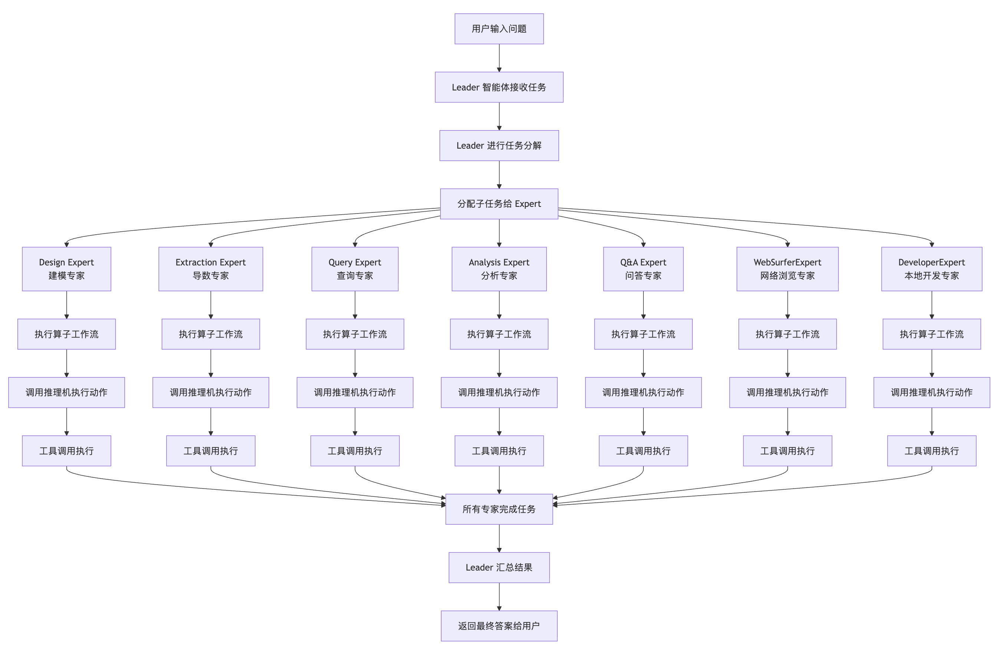
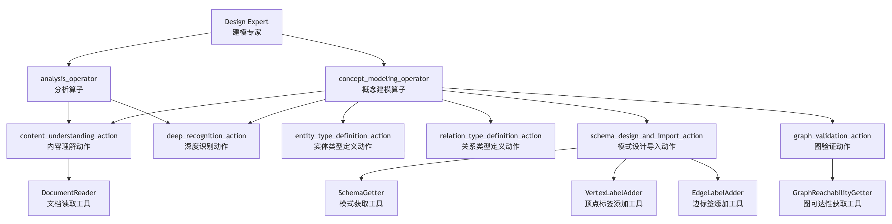
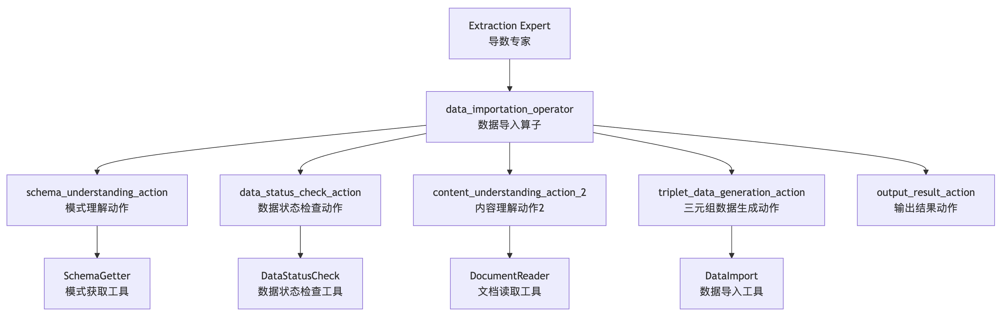
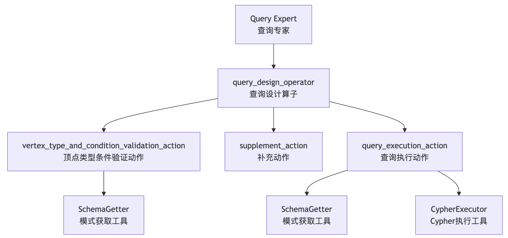
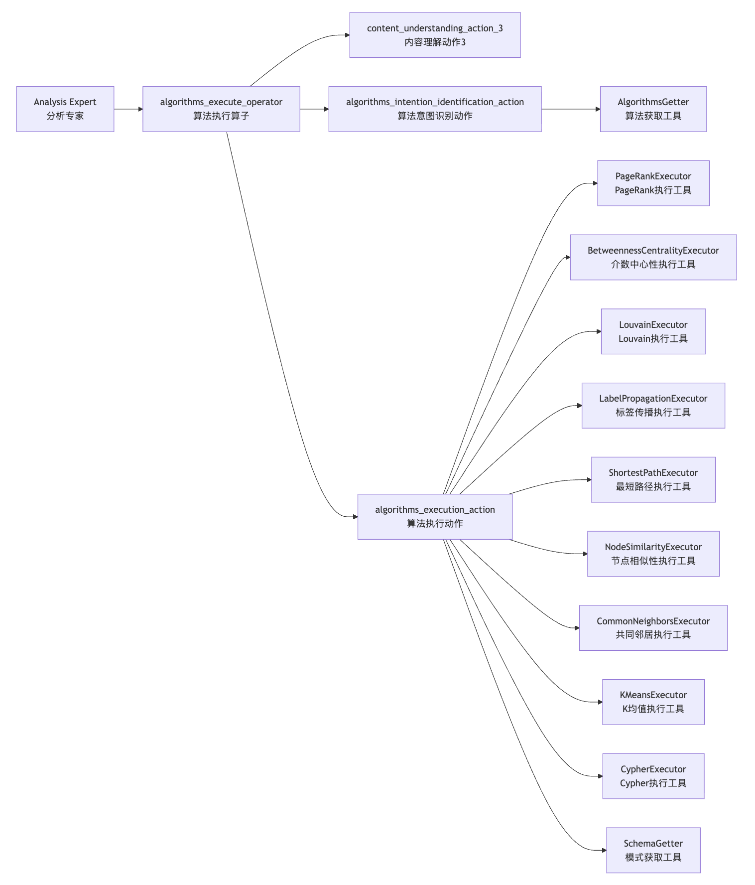
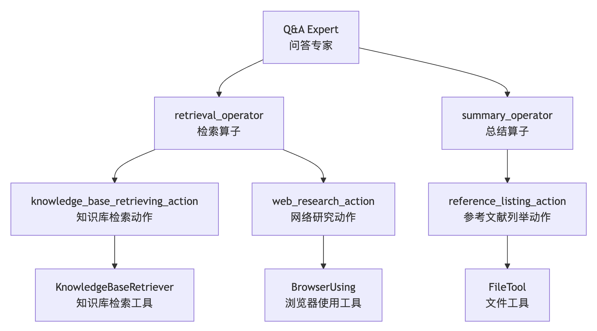
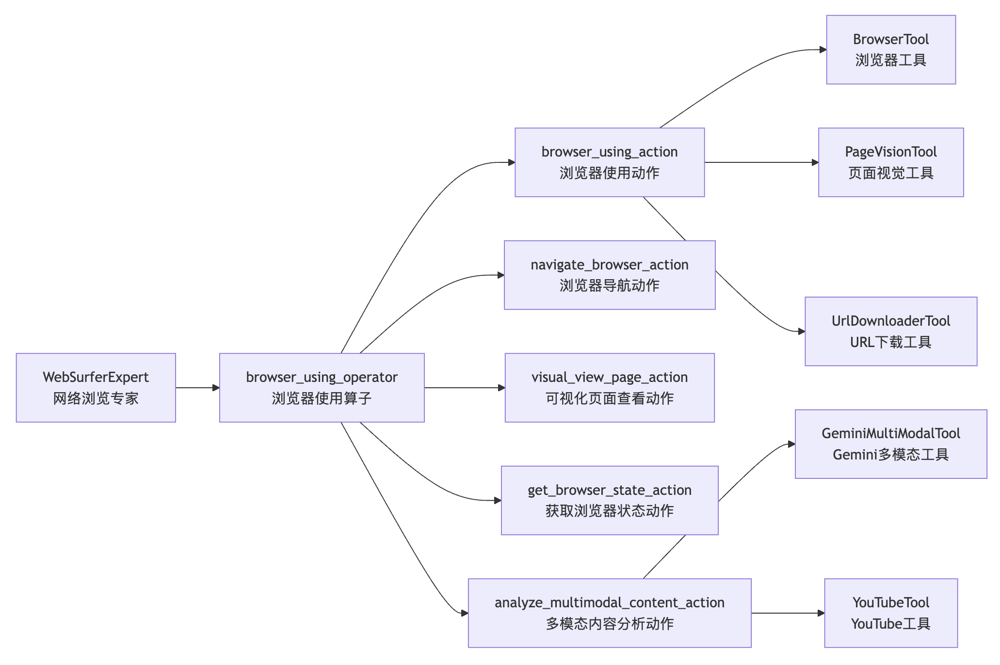
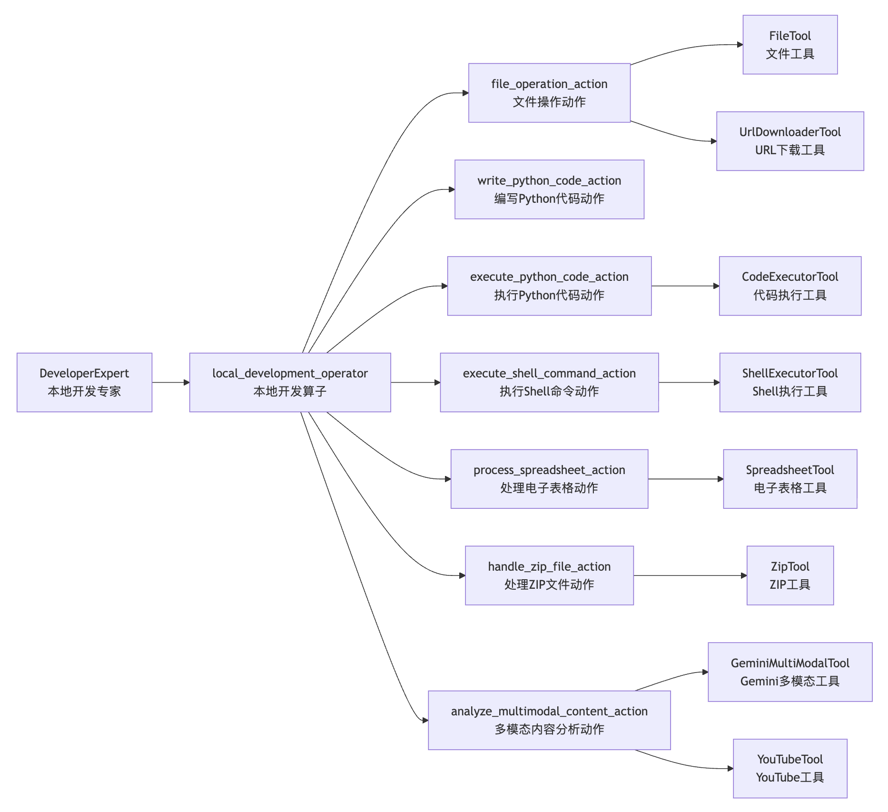
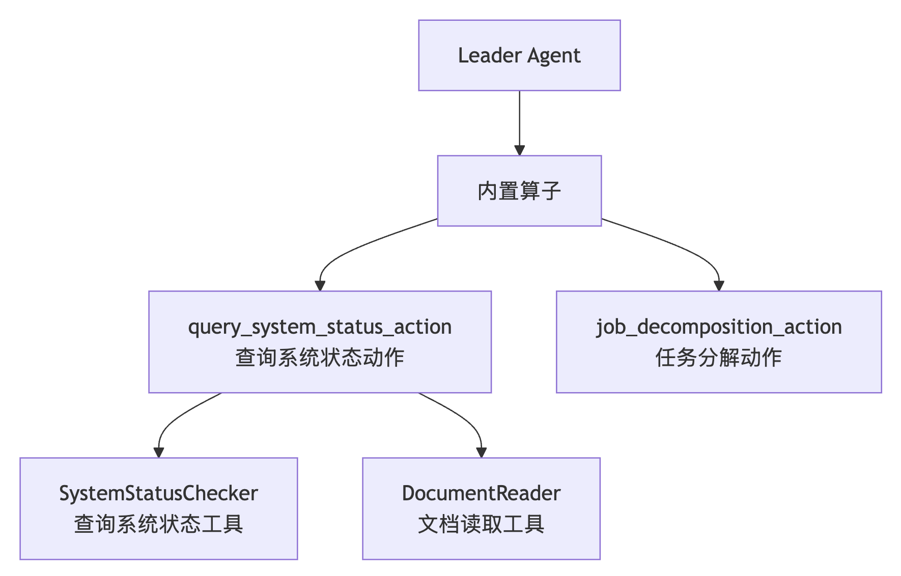

# 盘点 Chat2Graph 中的专家和工具

至此，我们完成了 Chat2Graph 中从用户会话到工具执行的完整链路的学习。让我们先通过一个流程图来回顾 Chat2Graph 的整体运行流程：



这个流程处处都体现着图原生的理念，里包含了三个循环：

1. Chat2Graph 实现了一主动多被动多智能体架构，当用户的问题到来时，Leader 智能体会将任务分配给多个 Expert 智能体执行，这些 Expert 智能体是以图的形式组织的；
2. 每个智能体由一个工作流实现，也是一个有向无环图，工作流包含多个算子，它们按序执行，等到所有算子都执行完成，整个工作流才算完成；
3. 算子和推理机相互协作，推理机通过大模型判断下一步的动作和该执行的工具，工具的结果又会返回给推理机判断下一步的动作，直到完成了算子所定义的任务目标为止；

最后，所有智能体全部运行结束，才算完成了一次用户的会话过程。

今天，我们将从专家和工具的角度，详细盘点 Chat2Graph 中都有哪些专家智能体，每个专家都包含哪些算子，每个算子又配置了哪些动作，以及每个动作关联了哪些工具。根据 `chat2graph.yml` 配置文件，我们可以看出，Chat2Graph 一共内置了 7 个专家，除了我们之前介绍过的 5 大核心专家，还专门为 GAIA 基准测试新增了两个专家。

## Design Expert - 建模专家

`Design Expert` 是知识图谱建模（Schema）专家，专注于根据特定的数据需求设计图的 Schema，清晰定义顶点（Vertices）和边（Edges）的类型、属性及关系。



它的核心工具包括：

1. **DocumentReader**：从指定路径读取并返回文档内容，支持多种文档格式解析，为后续的图建模提供原始数据输入；
2. **SchemaGetter**：连接到图数据库并获取其当前的 Schema 信息，用于了解现有的图结构；
3. **VertexLabelAdder**：在图数据库中创建新的顶点标签，定义新的实体类型；
4. **EdgeLabelAdder**：在图数据库中创建新的边标签，定义新的关系类型；
5. **GraphReachabilityGetter**：查询图数据库以获取图的可达性信息，验证图结构的连通性；

## Extraction Expert - 导数专家

`Extraction Expert` 是原始数据提取和数据导入图数据专家，负责根据已定义的 Schema 从原始数据中提取结构化信息，并将其导入到目标图数据库中。



它的核心工具包括：

1. **DataStatusCheck**：检查图数据库中当前数据的状态，了解现有数据情况，确保后续数据导入的一致性；
2. **DataImport**：将提取的三元组数据导入到图数据库中，支持批量导入和增量更新；

## Query Expert - 查询专家

`Query Expert` 专注于图数据查询，能够理解用户的查询意图，编写精确的图查询语句，并在目标图数据库上执行查询。



它的核心工具包括：

1. **CypherExecutor**：执行 Cypher 查询语句，支持复杂的图遍历和数据检索操作；

## Analysis Expert - 分析专家

`Analysis Expert` 专注于图数据分析和算法应用，能够基于分析目标选择、配置并执行相应的图算法。



这个专家包含大量图分析的工具：

1. **AlgorithmsGetter**：获取图数据库支持的算法列表和相关信息；
2. **PageRankExecutor**：执行 PageRank 算法，计算图中节点的重要性得分；
3. **BetweennessCentralityExecutor**：执行介数中心性算法，识别图中的关键连接节点；
4. **LouvainExecutor**：执行 Louvain 社区发现算法，识别图中的社区结构；
5. **LabelPropagationExecutor**：执行标签传播算法，进行社区检测；
6. **ShortestPathExecutor**：计算图中两点间的最短路径；
7. **NodeSimilarityExecutor**：计算节点间的相似性得分；
8. **CommonNeighborsExecutor**：分析节点间的共同邻居关系；
9. **KMeansExecutor**：执行 K-means 聚类算法；

值得注意的是，这些算法都是基于 Neo4j 的 **[GDS（Graph Data Science）](https://neo4j.com/docs/graph-data-science/current/)** 库实现的，这是 Neo4j 推出的一套 **图数据科学库**，专为在 Neo4j 图数据库上执行高效、可扩展的图算法而设计。它允许开发者、数据科学家和分析师通过图结构挖掘隐藏的关系模式（如社区、路径、影响力），广泛应用于推荐系统、欺诈检测、社交网络分析、供应链优化等场景。

因此在部署 Neo4j 时，需要开启 `graph-data-science` 插件：

```
$ docker run -d \
  -p 7474:7474 \
  -p 7687:7687 \
  --name neo4j-server \
  --env NEO4J_AUTH=none \
  --env NEO4J_PLUGINS='["apoc", "graph-data-science"]' \
  neo4j:2025.04
```

Neo4j GDS 内置算法覆盖图分析的主流场景，以下是核心分类及典型应用：

- **社区检测**：
    - 典型算法：Louvain、Weakly Connected Components（WCC）
    - 应用场景：社交网络圈子识别、客户分群、欺诈团伙检测
- **中心性分析**
    - 典型算法：PageRank、Betweenness Centrality、Degree Centrality
    - 应用场景：影响力节点识别（如社交网络 KOL）、关键路径分析（如供应链核心节点）
- **路径分析**
    - 典型算法：Shortest Path（最短路径）、All Pairs Shortest Path（APSP）
    - 应用场景：物流路线优化（比如从仓库 A 到门店 B 的最短配送路径）、导航系统
- **相似性分析**
    - 典型算法：Jaccard Similarity、Cosine Similarity
    - 应用场景：推荐系统（比如购买过相似商品的用户）、内容相似度匹配
- **链接预测**
    - 典型算法：Common Neighbors、Preferential Attachment
    - 应用场景：社交网络可能认识的人、客户潜在购买行为预测
- **图嵌入**
    - 典型算法：Node2Vec、FastRP
    - 应用场景：将图节点转换为向量（可输入机器学习模型），用于分类、聚类、推荐的预处理

以社交网络为例，通过 PageRank 算法识别最具影响力的用户：

```cyper
// 1. 先投影社交网络图（节点：User，关系：FOLLOWS）
CALL gds.graph.project('socialGraph', 'User', 'FOLLOWS');

// 2. 运行 PageRank 算法
CALL gds.pageRank.stream('socialGraph')
YIELD nodeId, score
MATCH (user:User) WHERE id(user) = nodeId
RETURN user.name AS userName, score
ORDER BY score DESC LIMIT 10;
```

## Q&A Expert - 问答专家

`Q&A Expert` 是通用问答和信息检索专家，具备优先级多源研究能力，优先使用知识库检索作为主要信息源，必要时进行网络研究作为补充。



它的核心工具包括：

1. **KnowledgeBaseRetriever**：从外部知识库中检索相关文档和信息；
2. **BrowserUsing**：使用浏览器进行网络搜索和内容抓取，基于 MCP 协议实现；
3. **FileTool**：文件系统操作工具，用于读写本地文件；

其中 `BrowserUsing` 是一个 MCP 工具，能基于 Playwright 操作浏览器，运行程序时通过 `start_mcp_server.sh` 脚本启动：

```
$ npx @playwright/mcp@latest --port 8931
```

## WebSurferExpert - 网络浏览专家

`WebSurferExpert` 负责所有在线信息获取任务，具备多模态分析能力，可以处理网页中的图像、音频和 PDF 文件。



它的核心工具包括：

1. **BrowserTool**：基于 `browser-use` 的浏览器自动化工具，支持网页导航和交互；
2. **UrlDownloaderTool**：从 URL 下载文件的工具；
3. **GeminiMultiModalTool**：基于 Gemini 的多模态分析工具，支持图像、音频等内容分析；
4. **PageVisionTool**：页面视觉分析工具，能够理解网页的视觉布局和内容，它首先通过 `browser-use` 将网页保存成 PDF，然后调用 Gemini 多模态大模型对其进行分析；
5. **YouTubeTool**：YouTube 视频内容分析工具；

## DeveloperExpert - 本地开发专家

`DeveloperExpert` 负责所有本地环境中的操作，包括文件读写、数据处理、代码执行等任务。



它的核心工具包括：

1. **CodeExecutorTool**：执行 Python 代码的工具，支持动态代码执行；
2. **ShellExecutorTool**：执行 Shell 命令的工具；
3. **SpreadsheetTool**：处理电子表格文件的工具，比如 Excel、CSV 等；
4. **ZipTool**：处理 ZIP 压缩文件的工具，支持压缩和解压操作；

## Leader 智能体

除了 Expert 智能体的特定工具之外，Chat2Graph 还有一个 Leader 智能体。



它提供了一个系统级的工具：

1. **SystemStatusChecker**：查询系统状态的工具，帮助智能体了解当前系统的运行状态，用于更好的推理和决策；

## 工具的实现

Chat2Graph 中的工具主要分为两种类型：**本地工具（`LOCAL_TOOL`）** 和 **MCP 工具（`MCP_TOOL`）**。

本地工具是直接在 Agent 运行的 Python 环境中通过函数调用执行的工具。这些工具通过 `module_path` 指向包含工具实现的 Python 模块。比如下面是文档读取工具的定义：

```yaml
tools:
  - &document_reader_tool
    name: "DocumentReader"
    module_path: "app.plugin.neo4j.resource.graph_modeling"
```

其实现位于 `app/plugin/neo4j/resource/graph_modeling.py` 文件中的 `DocumentReader` 类：

```python
class DocumentReader(Tool):
  """Tool for analyzing document content."""

  async def read_document(self, file_service: FileService, file_id: str) -> str:
    """Read the document content given the document name and chapter name.

    Args:
      file_id (str): The ID of the file to be used to fetch the doc content.

    Returns:
      The content of the document.
    """
    return file_service.read_file(file_id=file_id)
```

Chat2Graph 同时支持同步或异步函数，它会自动检测函数类型，并适配调用方式（基于 `inspect` 库的 `iscoroutinefunction()` 函数实现）：

```python
# execute function call
if inspect.iscoroutinefunction(func):
  result = await func(**func_args)
else:
  result = func(**func_args)
```

MCP 工具基于 Model Context Protocol 协议，用于与独立的外部进程或服务进行交互。这对于集成非 Python 实现的或需要隔离环境的复杂工具（如 Playwright 浏览器自动化）至关重要。下面是两个 MCP 工具的示例：

```yaml
  - &browser_tool
    name: "BrowserUsing"
    type: "MCP"
    mcp_transport_config:
      transport_type: "SSE"
      url: "http://localhost:8931/sse"

  - &file_tool
    name: "FileTool"
    type: "MCP"
    mcp_transport_config:
      transport_type: "STDIO"
      command: "npx"
      args: ["@modelcontextprotocol/server-filesystem", "."]
```

    STDIO = "STDIO"
    SSE = "SSE"
    WEBSOCKET = "WEBSOCKET"
    STREAMABLE_HTTP = "STREAMABLE_HTTP"


MCP 工具的配置包括：

- `transport_type`：支持 `STDIO`、`SSE`、`WEBSOCKET`、`STREAMABLE_HTTP` 四种不同的通信协议；
- `command/args`：启动外部进程的命令和参数，适用于 `STDIO` 模式；
- `url`：连接外部服务的网络地址，适用于 `SSE`、`WEBSOCKET` 或 `STREAMABLE_HTTP` 模式；

MCP 工具的实现位于 `app/core/toolkit/mcp/mcp_connection.py` 文件：

```python
class McpConnection(ToolConnection):

  # 调用 MCP 工具
  async def call(self, tool_name: str, **kwargs) -> List[ContentBlock]:
    with self._lock:
      result = await self._session.call_tool(tool_name, kwargs or {})
      return result.content

  # 根据通信协议创建 MCP 连接
  async def connect(self) -> None:
    with self._lock:
      # 建立连接
      if transport_config.transport_type == McpTransportType.STDIO:
        await self._connect_stdio()
      elif transport_config.transport_type == McpTransportType.SSE:
        await self._connect_sse()
      elif transport_config.transport_type == McpTransportType.WEBSOCKET:
        await self._connect_websocket()
      elif transport_config.transport_type == McpTransportType.STREAMABLE_HTTP:
        await self._connect_streamable_http()
      else:
        raise ValueError(f"Unsupported transport type: {transport_config.transport_type}")

      # 初始化会话
      session: ClientSession = cast(ClientSession, self._session)
      await session.initialize()
```

这段代码基于 MCP 官方的 Python SDK 实现，其用法可参考文档：

* https://github.com/modelcontextprotocol/python-sdk

## 小结

今天我们详细盘点了 Chat2Graph 中的所有专家和工具，通过清晰的职责划分，不同专家可完成从图谱建模、数据提取、查询分析、知识问答等不同的任务。此外，还简单讲解了工具的实现原理，支持本地工具和 MCP 工具两种类型，满足不同场景的需求。

Chat2Graph 通过这种分层的 **专家-算子-动作-工具** 架构，不仅实现了复杂任务的有序执行，还为图原生智能体系统提供了一个完整的工具生态。每个专家都在自己的专业领域内发挥最大价值，通过丰富的工具集合来完成具体的任务执行。
