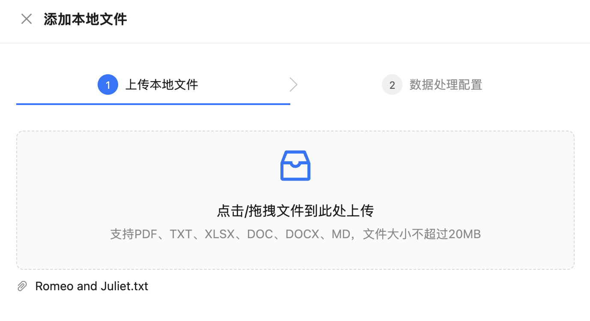

# 学习 Chat2Graph 的知识库服务

在前面的系列文章中，我们已经深入学习了 Chat2Graph 的多个核心模块：从智能体的协作机制，到任务规划与执行，再到工作流引擎，以及推理机和工具系统的实现。今天，我们将继续学习 Chat2Graph 的另一个关键组件——**知识库服务**，探索它如何为智能体系统提供强大的知识管理和检索能力。

知识库为智能体提供持久化的知识存储和检索服务，使得智能体能够基于领域知识回答专业问题，而不仅仅依赖于大模型的训练数据。在 Chat2Graph 中，知识库的设计兼顾了向量检索和图检索两种方式，形成了一套完整的知识管理体系。

## 知识库基本使用

Chat2Graph 的知识库在使用上分为 **全局知识库** 与 **会话知识库** 两个层次：

- **全局知识库**：存储整个智能体系统的基础知识，任何会话都可以获取全局知识库中的知识；
- **会话知识库**：存储与当前会话相关的私有知识，与会话一一对应，只在当前会话中生效，不会被其他会话的知识干扰；

可以在 “知识库管理” 页面对这两种知识库进行管理：


另外，Chat2Graph 支持两种不同的知识存储和检索方式：

- **向量知识库**：基于 Chroma 设计的向量知识库，检索时根据向量相似度匹配与问题最接近的文档片段；
- **图知识库**：基于 TuGraph 设计的图知识库，检索时在知识图谱中匹配与问题相关的子图与社区摘要；

> 尽管 Chat2Graph 支持 TuGraph 和 Neo4j 两种图数据库的管理，但是知识库这里暂时只支持 TuGraph。

用户可以通过 `.env` 环境变量配置来选择使用哪种知识库类型。

配置向量知识库：

```bash
KNOWLEDGE_STORE_TYPE=VECTOR
```

向量知识库默认存储在本地 Chroma 文件中，位于 `~/.chat2graph/knowledge_bases` 目录。

配置图知识库：

```bash
KNOWLEDGE_STORE_TYPE=GRAPH
# TuGraph 配置
GRAPH_KNOWLEDGE_STORE_HOST=127.0.0.1
GRAPH_KNOWLEDGE_STORE_PORT=17687
GRAPH_KNOWLEDGE_STORE_USERNAME=admin
GRAPH_KNOWLEDGE_STORE_PASSWORD=password
```

配置好知识库类型后，点击 “全局知识库” 或 “会话知识库”，上传文件：



支持 PDF、TXT、XLSX、DOC、DOCX、MD 等文件格式。然后点击 “下一步” 进入数据处理的配置，这块目前很粗糙，就一个分块大小参数：


然后点击 “确定” 完成知识的添加。

## 知识库接口

Chat2Graph 的知识库服务提供了一套完整的 RESTful API：

```python
# 获取所有知识库
GET /knowledgebases/

# 获取指定知识库
GET /knowledgebases/{kb_id}

# 更新知识库信息
PUT /knowledgebases/{kb_id}

# 清空/删除知识库
DELETE /knowledgebases/{kb_id}?drop=true

# 向知识库添加文档
POST /knowledgebases/{kb_id}/files/{file_id}

# 从知识库删除文档
DELETE /knowledgebases/{kb_id}/files/{file_id}
```

上一节点击 “确实” 后实际上调用的就是 “向知识库添加文档” 这个接口：

```python
@knowledgebases_bp.route("/<string:knowledge_base_id>/files/<string:file_id>", methods=["POST"])
def load_knowledge_with_file_id(knowledge_base_id: str, file_id: str):
  
  manager = KnowledgeBaseManager()
  data: Dict[str, Any] = cast(Dict[str, Any], request.json)

  # 加载文档
  result, message = manager.load_knowledge(
    kb_id=knowledge_base_id,
    file_id=file_id,
    knowledge_config=KnowledgeBaseViewTransformer.deserialize_knowledge_config(
      json.loads(data.get("config", "{}"))
    ),
  )
  return make_response(data=result, message=message)
```

`KnowledgeBaseManager` 通过核心服务 `KnowledgeBaseService` 实现知识的管理。它采用单例模式，负责：

- 知识库的创建、管理和删除
- 文件与知识库的映射关系管理
- 知识的加载、检索和删除
- 全局知识库和会话知识库的统一管理

## 知识库服务实现

`KnowledgeStore` 是一个抽象基类，定义了知识存储的标准接口：

```python
class KnowledgeStore(ABC):

  @abstractmethod
  def load_document(self, file_path: str, config: Optional[KnowledgeConfig]) -> str:
    """加载文档"""

  @abstractmethod
  def delete_document(self, chunk_ids: str) -> None:
    """删除文档"""

  @abstractmethod
  def retrieve(self, query: str) -> List[KnowledgeChunk]:
    """检索知识"""

  @abstractmethod
  def drop(self) -> None:
    """删除整个知识库"""
```

Chat2Graph 通过 `KnowledgeStoreFactory` 工厂模式提供了两种实现：

```python
class KnowledgeStoreFactory:

  @classmethod
  def get_or_create(cls, name: str) -> KnowledgeStore:
    if SystemEnv.KNOWLEDGE_STORE_TYPE == KnowledgeStoreType.VECTOR:
      return VectorKnowledgeStore(name)
    elif SystemEnv.KNOWLEDGE_STORE_TYPE == KnowledgeStoreType.GRAPH:
      return GraphKnowledgeStore(name)
```

有意思的是，这两种都是基于 DB-GPT 框架实现的：

* 向量知识库：使用 `ChromaStore` 定义向量存储，使用 `EmbeddingAssembler` 加载知识，使用 `EmbeddingRetriever` 检索知识；
* 图知识库：使用 `CommunitySummaryKnowledgeGraph` 定义图存储，使用 `EmbeddingAssembler` 加载知识，使用图存储的 `asimilar_search_with_scores()` 方法检索知识；

实现都比较简单，这里就不赘述了。具体内容可参考 DB-GPT 的 RAG 文档：

* http://docs.dbgpt.cn/docs/cookbook/rag/keyword_rag_app_develop
* http://docs.dbgpt.cn/docs/cookbook/rag/graph_rag_app_develop

## 与推理机的集成

知识库服务与推理机系统紧密集成，在算子的执行过程中，会通过知识库服务获取相关知识，注入到推理上下文中：

```python
task = Task(
  job=job,
  operator_config=self._config,
  workflow_messages=merged_workflow_messages,
  tools=rec_tools,
  actions=rec_actions,
  knowledge=self.get_knowledge(job), # 注入知识
  insights=self.get_env_insights(),
  lesson=lesson,
  file_descriptors=file_descriptors,
)

result = await reasoner.infer(task=task)
```

推理机会将检索到的知识作为上下文信息，帮助大模型生成更准确、更符合领域知识的回答。

## 与记忆系统的关系

20 世纪 70 年代，管理学家 **罗素・艾可夫（Russell L. Ackoff）** 等人提出 [**DIKW 金字塔模型**](https://en.wikipedia.org/wiki/DIKW_pyramid)，它将人类对世界的认知过程拆解为四个层层递进的层级，清晰展现了原始素材如何转化为决策能力的逻辑链条。


1. **数据（Data）** 是未经处理的、客观存在的原始符号或事实，不包含任何上下文或意义，仅代表 **“是什么”**。它是认知的起点，没有价值判断，也无法直接指导决策。
2. **信息（Information）** 是经过加工、赋予上下文和意义的数据，通过 “数据 + 背景” 的组合，回答 **“这是什么意思”**。它解决了数据的无意义性，让原始素材具备了初步价值。
3. **知识（Knowledge）** 是信息之间建立关联、经过验证并可用于指导实践的结构化体系，它回答 **“为什么会这样”** 和 **“如何应用”**。知识源于对信息的归纳、总结和验证，是可复用的经验或规律。
4. **智慧（Wisdom）** 是基于知识进行价值判断、权衡利弊后做出最优决策的能力，它回答 **“这样做是否明智”** 和 **“如何实现长期目标”**。智慧是认知的最高层级，需要结合价值观、伦理观和长期视角。

DIKW 模型是信息科学与知识管理领域的核心框架，如今已广泛应用于企业管理、信息技术、教育、科研等多个领域。

Chat2Graph 参考 DIKW 模型，设计了一个分层的记忆架构：


每一层和 DIKW 的对应关系如下：


> 注意，目前 Chat2Graph 的记忆系统功能还在建设中，文档中只是介绍了它的设计理念，我们在设计记忆系统时也可以参考之。

分层记忆系统引入了多级的知识抽象，包含三个关键能力：

1. **知识精练（Knowledge Refinement）**：原始知识经过逐级的处理、分析、抽象、压缩，形成更高层次的知识；
2. **知识下钻（Knowledge Drilling）**：在使用高维知识的同时，还可以按需下钻低维知识，让推理上下文粗中有细；
3. **知识延拓（Knowledge Expansion）**：同层级知识关联的构建和召回，通过特定方法丰富知识上下文；

不难看出，知识库服务可以视为记忆系统 L2 层（Lesson）的初步实现，主要存储领域知识和最佳实践。当前 Chat2Graph 只是初步地将 RAG 作为知识库的实现形式，未来随着分层记忆架构的完善，知识库将进一步整合到完整的记忆体系中，形成更加智能的知识管理和利用机制。

此外，除了知识库，环境也可以当做记忆的一部分。环境指的是智能体执行过程中可交互的外部空间，智能体可以通过工具操作感知环境变化，影响环境状态。Chat2Graph 还提出了一个有趣的观点：**环境可以被视为当前时刻的外部记忆，而记忆则是历史时刻的环境快照**。这种同质性使得环境可以无缝地融入分层记忆模型中，从技术实现角度来看，记忆系统、知识库和环境的架构可以统一。通过工具这座桥梁，打通记忆系统与环境状态，构建智能体的精神世界与外部环境的物理世界的映射关系，即世界知识模型。

## 小结

通过这篇文章，我们学习了 Chat2Graph 知识库服务的设计与实现，包括全局知识库与会话知识库的分离，基于 DB-GPT 的向量知识库和图知识库实现，以及与记忆系统的关系。知识库服务作为智能体系统的重要组成部分，为智能体提供了强大的知识管理和检索能力。同时，它也是更大的记忆系统的一部分，通过多层级记忆系统的设计，从记忆存储、信息评估、经验提取到洞察生成，记忆系统从原始数据逐步提炼到高层次的智慧洞察，为 Chat2Graph 提供持久化的学习和适应能力，提升系统的整体智能水平。
