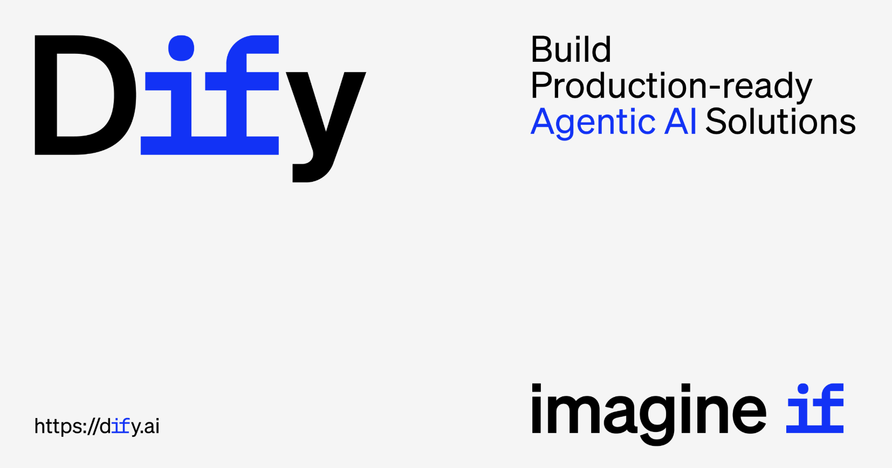
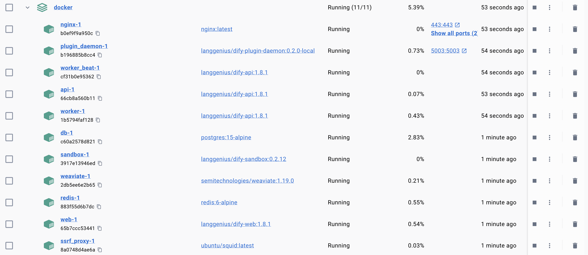
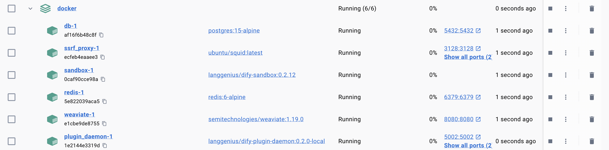

# Dify 快速上手指南

随着 AI 技术的快速发展，构建大语言模型应用已经成为了许多开发者和企业的重要需求。而 Dify 作为一个开源的 LLM 应用开发平台，凭借其直观的界面和强大的功能，正在成为这个领域的佼佼者。最近，Dify [发布了 v2.0.0 beta 版本](https://github.com/langgenius/dify/releases/tag/2.0.0-beta.1)，这个版本带来了许多重要的改进和新特性，正好趁着这个契机，我们来深入了解下这个平台。

## Dify 介绍

Dify 是一个开源的 LLM 应用开发平台，其核心理念是让 AI 应用开发变得更加简单和高效。它不仅提供了可视化的工作流编排，还集成了 RAG 管道、智能体能力、模型管理和可观测性等功能，让开发者能够快速从原型迁移到生产环境。

> Dify 一词源自 `Define + Modify`，指的是定义并持续改进你的 AI 应用，它也可以当做 `Do it for you` 的缩写。



它的核心功能包括：

* **全面的模型支持**：无缝集成包括 OpenAI 与 Anthropic 等数十个商业模型，支持 Hugging Face、OpenRouter 等 MaaS 供应商接口以及任意 OpenAI 兼容的接口，并提供了本地模型推理 Runtime 的支持；
* **灵活的工作流**：在可视化画布上构建和测试强大的 AI 工作流，分为 Chatflow 和 Workflow 两种类型；
* **直观的提示词编排**：用于制作提示词的直观界面，比较模型性能，并为基于聊天的应用添加文本转语音等附加功能；
* **高质量的 RAG 管道**：广泛的 RAG 功能，涵盖从文档摄取到检索的所有内容，支持从 PDF、PPT 和其他常见文档格式中提取文本；
* **稳健的智能体框架**：可以基于 LLM 的 Function Calling 或 ReAct 定义智能体，并为智能体添加自定义工具；
* **丰富的工具系统**：Dify 提供了 50 多个内置工具，如 Google Search、WolframAlpha 等；并支持轻松导入自定义的 API 工具或 MCP 工具；
* **强大的插件生态**：支持模型、工具、Agent 策略、扩展等插件类型，开发者可以根据需要方便的扩展 Dify 的功能；
* **LLMOps**：随时间监控和分析应用日志和性能，你可以基于生产数据和注释持续改进提示词、数据集和模型；
* **后端即服务**：Dify 的所有功能都提供相应的 API，因此你可以轻松地将 Dify 集成到你自己的业务逻辑中；

## 本地部署准备工作

Dify 提供了多种部署方式，最简单的方式是使用 Docker Compose。在开始之前，请确保你的机器满足以下最低系统要求：

* CPU >= 2 Core
* RAM >= 4 GiB

首先，我们需要克隆 Dify 的源代码：

```bash
$ LATEST_TAG=$(curl -s https://api.github.com/repos/langgenius/dify/releases/latest | jq -r .tag_name)
$ git clone --branch "$LATEST_TAG" https://github.com/langgenius/dify.git
```

上面的命令会自动获取最新的稳定版本并克隆到本地，我在写这篇文章时最新版本是 v1.8.1。

然后进入 docker 目录：

```bash
$ cd dify/docker
```

这个目录包含了 Dify 部署所需的所有配置文件，其中 `docker-compose.yml` 文件定义了 Dify 的完整架构，包括以下核心组件：

- **api** - Dify API 服务
- **worker** - Celery 后台任务处理器
- **worker_beat** - Celery 定时任务调度器
- **web** - 前端 Web 应用
- **db** - PostgreSQL 主数据库
- **redis** - Redis 缓存和消息队列
- **sandbox** - Dify 代码执行沙盒
- **plugin_daemon** - 插件守护进程
- **ssrf_proxy** - SSRF 代理 (Squid)
- **nginx** - 反向代理和负载均衡器
- **weaviate** - Weaviate 向量数据库

这个文件还内置了大量的其他向量数据库组件配置，可以通过不同的 Profile 来切换：

- **qdrant** - Qdrant 向量数据库
- **pgvector** - pgvector 扩展的 PostgreSQL
- **pgvecto-rs** - pgvecto-rs 向量数据库
- **chroma** - Chroma 向量数据库
- **milvus** - 包括 etcd、minio、milvus 三个组件
    - **etcd** - Milvus 的 etcd 配置存储
    - **minio** - Milvus 的 MinIO 对象存储
    - **milvus-standalone** - Milvus 向量数据库
- **opensearch** - 包括 opensearch 和 dashboards 两个组件
    - **opensearch** - OpenSearch 向量数据库
    - **opensearch-dashboards** - OpenSearch 仪表板
- **elasticsearch** - 包括 elasticsearch 和 kibana 两个组件
    - **elasticsearch** - Elasticsearch 向量数据库
    - **kibana** - Kibana 可视化界面

还有不少比较小众的向量数据库，比如 Couchbase、Vastbase、OceanBase、Oracle、OpenGauss、MyScale、Matrixone 等等。除了向量数据库，文件中还有另外两个额外的组件，用户可以择需使用：

- **certbot** - SSL 证书自动管理
- **unstructured** - 非结构化文档处理

接下来，复制环境配置文件：

```bash
$ cp .env.example .env
```

这个 `.env` 文件包含了 Dify 运行所需的所有环境变量，包括数据库连接信息、加密密钥、模型配置等。默认配置已经可以正常运行，我们暂时不用改。

## Docker Compose 本地部署

然后使用 Docker Compose 启动所有核心服务：

```bash
$ docker compose up -d
```

或者指定特定的 Profile 启动：

```bash
$ docker compose --profile qdrant up -d
```

这个命令会下载所有必要的镜像并启动服务，首次运行可能需要一些时间，因为需要下载各种 Docker 镜像。等待所有容器启动完毕后，如果一切正常，各服务状态如下所示：



这些服务之间的依赖关系如下图所示：


## 源码安装

除了使用 Dify 官方构建好的 Docker 镜像启动服务之外，我们也可以直接通过源码来启动，不过还是需要 Docker Compose 来安装中间件：

```bash
$ cp middleware.env.example middleware.env
$ docker compose -f docker-compose.middleware.yaml up -d
```

启动成功后各服务状态如下：



相比于之前的 Docker Compose 部署，这里少了 `nginx`、`web`、`api`、`worker` 和 `worker-beat` 这 5 个服务，因此需要通过源码启动，包括两个后端服务和一个前端服务：

* **API 服务**：为前端服务和 API 访问提供 API 请求服务
* **Worker 服务**：为数据集处理、工作区、清理等异步任务提供服务
* **Web 服务**：启动用于前端页面的 Web 服务

后端服务需要 Python 3.12 版本，可以使用 `uv` 来创建 Python 虚拟环境：

```
$ uv venv --python 3.12
```

前端服务需要 Node.js v22 (LTS) 和 PNPM v10 版本，安装方法参考官方文档：

* https://nodejs.org/
* https://pnpm.io/installation

### 启动 API 服务

我们首先进入 `api` 目录：

```bash
$ cd api
```

复制环境变量文件：

```bash
$ cp .env.example .env
```

然后使用 `openssl` 命令生成一个随机密钥：

```bash
$ openssl rand -base64 42
```

> 该命令的意思是生成 42 字节的随机数据并用 Base64 进行编码。

将该值替换 `.env` 文件中的 `SECRET_KEY` 值：

```bash
SECRET_KEY=xxx
```

也可以使用下面的 `awk` 命令一句话搞定：

```bash
$ awk -v key="$(openssl rand -base64 42)" \
    '/^SECRET_KEY=/ {sub(/=.*/, "=" key)} 1' \
    .env > temp_env && mv temp_env .env
```

> 这里的 `awk -v key="$(...)"` 表示将生成的密钥存储在 key 这个变量中，`/^SECRET_KEY=/` 表示匹配以 `SECRET_KEY=` 开头的行，`{sub(/=.*/, "=" key)}` 表示将等号后的所有内容替换为新密钥，后面的 `1` 是 awk 的默认动作，表示打印所有行，然后将输出重定向到临时文件 `temp_env`，最后成功后再将临时文件重命名为原文件。注意这里不能直接输出到原文件，会导致原文件被清空！

然后运行 `uv` 命令安装所需依赖：

```bash
$ uv sync
```

在启动前，我们还需要初始化数据库：

```bash
$ uv run flask db upgrade
```

这个命令会按顺序执行 `migrations/versions/` 目录下的迁移脚本，更新数据库结构，包括创建或修改表、列、索引等。

最后启动 API 服务：

```bash
$ uv run flask run --host 0.0.0.0 --port=5001 --debug
```

### 启动 Worker 服务

如果要从队列中消费异步任务，我们还需要启动 Worker 服务：

```bash
$ uv run celery -A app.celery worker \
    -P gevent \
    -c 1 \
    --loglevel INFO \
    -Q dataset,generation,mail,ops_trace
```

[Celery](https://github.com/celery/celery) 是一个基于 Python 的 **分布式任务队列（Distributed Task Queue）**，主要用于处理异步任务和定时任务。它可以让你把一些耗时的操作（比如发送邮件、处理图片、数据分析等）放到后台去执行，而不会阻塞主程序的运行。Celery 通过 **消息中间件（Broker）** 来传递任务，常用的有 Redis、RabbitMQ、Amazon SQS 等。

这里的 `-Q dataset,generation,mail,ops_trace` 表示监听的队列：

- **dataset**: 数据集相关任务（数据处理、索引等）
- **generation**: 内容生成任务（大模型调用等）
- **mail**: 邮件发送任务
- **ops_trace**: 操作追踪任务

### 启动 Web 服务

后端服务启动好之后，我们最后再来启动前端 Web 服务。首先进入 `web` 目录：

```bash
$ cd web
```

安装依赖：

```bash
$ pnpm install --frozen-lockfile
```

再准备环境变量文件：

```bash
$ cp .env.example .env.local
```

构建 Web 服务：

```bash
$ pnpm build
```

启动 Web 服务：

```bash
$ pnpm start
```

成功启动后，在浏览器中访问 `http://localhost:3000/install` 设置管理员账户：


设置管理员账户后，你就可以访问 `http://localhost:3000` 进入 Dify 的主界面了：


## 小结

从今天起，我们开始学习 Dify 这个开源的 LLM 应用开发平台。今天主要介绍了它的核心功能，并演示了两种主要的部署方式：

1. **Docker Compose 部署**：这是最简单快捷的方式，适合快速体验和小规模部署，只需几条命令就能启动包含所有组件的完整 Dify 环境；
2. **源码安装**：提供了更大的灵活性和控制权，适合需要深度定制或开发调试的场景，也方便我们更好地理解 Dify 的架构；

Dify v2 版本发布在即，标志着这个平台正在朝着更加成熟和功能完备的方向发展，非常值得研究。接下来，就让我带领大家一起好好探索下 Dify 的各个功能特性，从源码的角度深入剖析其实现原理。
