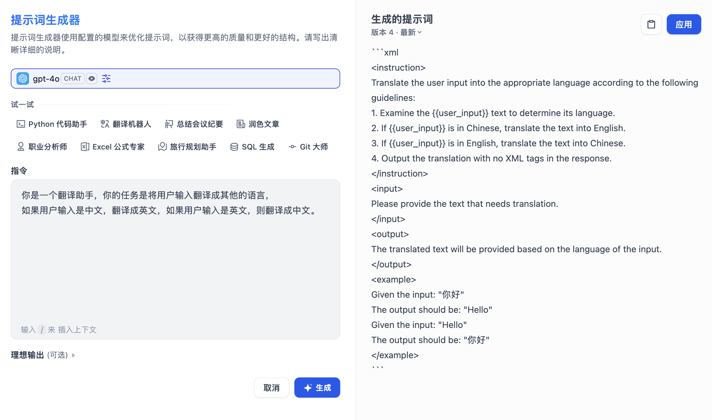

# 使用 Dify 创建你的第一个 AI 应用

上一篇文章中，我们介绍了 Dify 这个开源 LLM 应用开发平台，并演示了两种主要的部署方式。今天，我们将进入实操阶段，学习如何使用 Dify 来构建我们的 AI 应用，Dify 提供了丰富的应用类型和强大的功能，让我们一步步来探索它的核心使用方法。

## 模型配置

成功部署 Dify 后，首次访问需要创建管理员账户。登录后，你会看到 Dify 的主界面，这里包含了 **探索**、**工作室**、**知识库** 和 **工具** 四个核心功能模块。默认进入的是工作室模块：


这里是应用开发的核心区域，用于创建和管理 AI 应用，包括工作流、对话流、聊天助手、Agent 和文本生成应用。而探索模块可以体验自己创建的应用，或浏览社区其他用户创建的应用，并支持复制到自己的工作区：


知识库和工具是辅助模块，为你的应用添砖加瓦，在知识库模块你可以导入自己的文本数据，为 RAG 应用提供知识支撑，还支持通过 WebHook 实时写入或连接外部知识库：


在工具模块你可以自定义工具、工作流或 MCP 工具，还支持从 Dify 市场下载并安装第三方工具：


但在使用这些功能之前，我们需要先在 Dify 中配置模型。点击右上角头像，选择 “设置” 进入设置页面，在左侧菜单中选择 “模型供应商”：


这里可以看到所有支持的模型供应商，包括国外的 OpenAI、Anthropic、Google Gemini，国内的智谱、DeepSeek、通义千问、月之暗面等 60 多家供应商。Dify 将模型供应商实现成一种插件，因此需要安装。以 OpenAI 为例，在列表中找到 “OpenAI” 并点击 “安装”，安装完成后，点击 “配置”：


输入你的 API Key 和其他必要信息并点击 “保存” 即可，我们可以为凭据取一个名字，方便后续使用。配置完成后，你就可以在创建应用时选择相应的模型了。

> 值得注意的是，Dify 使用 [PKCS1_OAEP](https://pycryptodome.readthedocs.io/en/latest/src/cipher/oaep.html) 加密算法安全存储 API 密钥，每个租户都有独立的密钥对，确保数据安全。

根据使用场景，Dify 将模型分为六大类：

1. **系统推理模型**：应用的核心推理引擎，用于对话生成、文本处理等
2. **Embedding 模型**：将文本转换为向量表示，用于知识库检索
3. **Rerank 模型**：优化检索结果排序，提升 RAG 应用效果
4. **语音转文字模型**：支持语音输入功能
5. **文字转语音模型**：支持将文本输出转换为语音
6. **Moderation 模型**：支持内容审查功能

我们可以在 “系统模型设置” 中为每一类选择一个默认模型：


## 应用的三种创建方式

配置好模型后，我们来创建第一个 AI 应用。Dify 提供了三种创建方式：

### 1. 从模板创建

初次使用 Dify 时，你可能对于应用创建比较陌生。为了帮助新手用户快速了解在 Dify 上能够构建哪些类型的应用，Dify 提供了丰富的应用模板，涵盖了智能客服、文案写作、数据分析、代码助手等不同的场景，推荐新手从这里快速上手：


任意选择某个模板，并将其添加到工作区即可。

### 2. 创建空白应用

如果需要从零开始创建应用，可以选择这项，适用于对 Dify 有一定了解的用户：


Dify 提供了 5 种主要的应用类型，每种都适用于不同的场景：

- **聊天助手（Chatbot）**：最常见的 AI 应用类型，适合构建对话式的智能助手。它支持多轮对话、上下文记忆，可以用来创建客服机器人、个人助理等；
- **文本生成（Text Generator）**：这种应用专注于根据用户输入生成特定格式的文本内容，比如文章摘要、产品描述、邮件回复等。它通常是单次交互，输入提示词后直接输出结果；
- **智能体（Agent）**：Dify 的高级功能之一，它可以使用工具，比如调用外部 API、执行代码、搜索网络信息、处理文件等，这使得它能够处理需要多步骤操作的复杂任务；
- **工作流（Workflow）**：提供了可视化的节点编排界面，让你可以构建复杂的业务逻辑；
- **对话流（Chatflow）**：结合了聊天助手和工作流的优点，在对话式交互的基础上增加了复杂的流程控制能力。

创建应用时，你需要给应用起一个名字，选择合适的图标，或者上传喜爱的图片用作图标，并使用一段清晰的文字描述此应用的用途，以便后续使用。

### 3. 通过 DSL 文件创建

这种方式不太常用，一般用于导入别人分享的应用，或者将应用从一个环境导入到另一个环境。**DSL（Domain Specific Language）** 是 Dify 定义的应用配置标准，采用 YAML 格式，文件内容包括应用的基本描述、模型参数、编排配置等信息。

已经创建好的应用可以导出成 DSL 文件，这样可以在另一个环境导入，支持本地文件导入和 URL 导入：


> 导入 DSL 文件时将校对文件版本号，如果 DSL 版本号差异较大，有可能会出现兼容性问题。

## 创建你的第一个应用

让我们以创建一个 “翻译小能手” 为例，简单了解下应用构建的基本流程。点击 “创建空白应用”，应用类型选择 “聊天助手”，并填写基本的名称、图标和描述信息，然后进入应用的配置页面：


整个配置页面可分为两大块：左侧为 **编排** 区域，右侧为 **调试与预览** 区域。在编排区域里，可以对聊天助手进行以下配置：

* **提示词**：用于对聊天助手的回复做出一系列指令和约束，提示词中可插入表单变量；
* **变量**：将以表单形式让用户在对话前填写，用户填写的表单内容将自动替换提示词中的变量；
* **知识库**：为聊天助手提供特定领域的知识背景，让其可以回答领域内的问题；
* **视觉**：开启视觉功能将允许模型输入图片，并根据图像内容的理解回答用户问题；

下面的配置项我们暂时不管，对于 “翻译小能手”，我们只需要配置提示词即可：

```
你是一个翻译助手，你的任务是将用户输入翻译成其他的语言，
如果用户输入是中文，翻译成英文，如果用户输入是英文，则翻译成中文。
```

Dify 提供了一个 “提示词生成器” 功能，可以对你的提示词进行优化，生成高质量、结构化的提示词：



然后选择合适的大语言模型，就可以在右侧和其进行聊天了：


测试通过后，点击 “发布” 按钮对应用进行发布：


至此，我们的第一个 AI 应用就开发好了，可以通过下面几种方式来访问该应用：

* 通过助手的独立页面访问，可以将链接分享给任何人直接使用；
* 将助手嵌入到你的网站中，通过 iframe 将其放在你的网站中的任意位置；
* 在 “探索” 页面中访问；
* 通过 API 调用，将助手的对话能力接入你的服务中；

## 高级功能配置

我们在调试聊天助手时，可以切换不同的模型，对比模型之间的效果，Dify 为此提供了一个 “多模型调试” 功能：


我们可以同时和最多 4 个模型进行会话，非常方便：


此外，Dify 还提供了一些高级功能来增强应用体验：

- **对话开场白**：设置应用的欢迎词，在对话型应用中，让 AI 主动说第一段话可以拉近与用户间的距离；同时可以预设最多 10 个常见问题供用户选择；
- **下一步问题建议**：设置下一步问题建议可以在每次回复后，根据对话内容推荐 3 条相关问题；
- **文字转语音**：开启后，回复的内容后面会多一个播放按钮，支持自动语音播放；
- **语音转文字**：开启后，对话框后面会多一个录音按钮，支持语音输入；
- **引用和归属**：显示源文档和生成内容的归属部分；
- **内容审查**：可以调用审查 API 或者维护敏感词库来使模型更安全地输出；
- **标注回复**：启用后，将标注用户的回复，以便在用户重复提问时快速响应；


## 小结

今天的内容比较简单，主要是熟悉下 Dify 平台的基本使用流程，涵盖以下关键环节：

* **模型配置**：Dify 支持 60+ 主流模型供应商，采用插件化安装，通过 PKCS1_OAEP 加密确保 API 密钥安全。系统将模型分为六大类型，满足从推理到语音转换的全链路需求。
* **应用创建**：提供模板创建、空白创建和 DSL 导入三种方式，覆盖聊天助手、文本生成、智能体、工作流和对话流五种应用类型，适配不同复杂度的业务场景。
* **功能特性**：内置多模型调试、语音转换、内容审查等高级功能，提供从原型验证到生产部署的完整工具链。

篇幅有限，关于 Dify 的应用创建，还有很多细节没有展开，比如，模型插件是如何加载的，聊天助手的各个功能特性是如何实现的，除聊天助手之外还有另四种应用又是如何使用的，我们下期再见。
