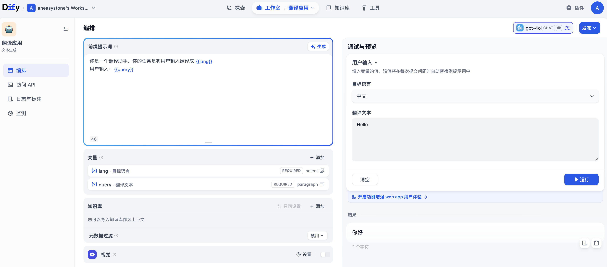
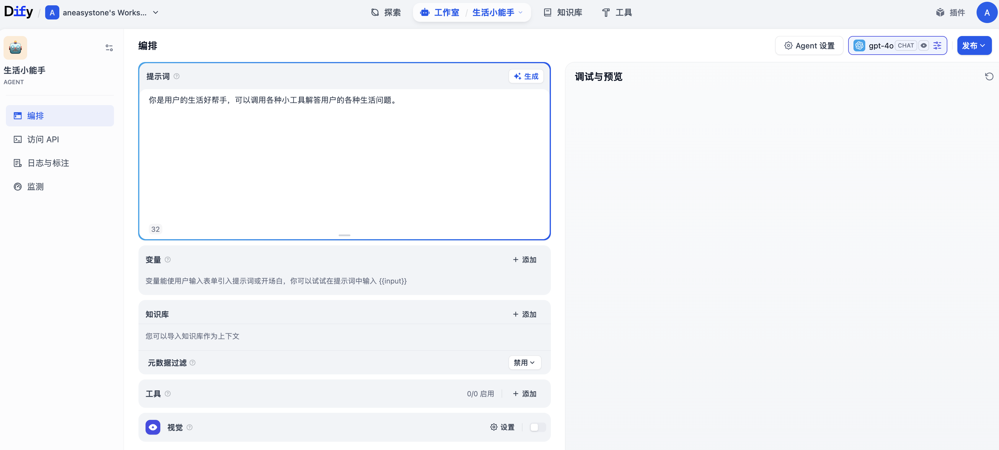

# 学习 Dify 的文本生成和 Agent 应用

在前两篇文章中，我们介绍了 Dify 的基本概念和部署方式，并通过创建一个简单的翻译助手初步体验了聊天助手的构建流程。今天，我们将继续学习 Dify 的另外两种应用类型：**文本生成应用** 和 **Agent 应用**，了解它们的用法、特点以及应用场景。

## 文本生成应用

文本生成应用是 Dify 提供的一种专门用于内容创作的应用类型，它专注于根据用户输入生成特定格式的文本内容。与聊天助手的多轮对话不同，文本生成应用采用 **单次输入、单次输出** 的交互模式，非常适合批量处理和标准化内容生成场景。比如：

- **内容创作**：文章摘要、产品描述、营销文案
- **文本处理**：翻译、分类、情感分析
- **模板化生成**：邮件回复、报告生成、技术文档
- **批量处理**：大规模内容生成和数据处理等

我们进入 “工作室” 页面，点击 “创建空白应用”，应用类型选择 “文本生成应用”：


我们继续以之前翻译助手为例，填写助手名称，以及可选的图标和描述，进入应用的配置页面：



文本生成应用和聊天助手的配置页面几乎完全一样，整个配置页面也是分为左侧的 **编排** 和 右侧的 **调试与预览** 两大块。在编排区域里，同样可以配置 **提示词**、**变量**、**知识库** 和 **视觉** 四个选项。

我们在这里添加两个变量：

* `lang` - 目标语言，字段类型为下拉选项，选项配置有中文、英文、日文等
* `query` - 翻译文本，字段类型为段落

然后在提示词中以 `{{lang}}` 和 `{{query}}` 占位符插入变量，完整的提示词如下：

> 你是一个翻译助手，你的任务是将用户输入翻译成 {{lang}}
> 用户输入：{{query}}

这里定义的变量将以表单的形式显现在右侧的调试区域，和聊天助手不同的是，文本生成应用的对话页面就只有一个表单，用户填写的表单内容将自动替换提示词中的变量，然后调用大模型输出结果。

### 使用变量

Dify 变量支持的字段类型包括：文本（`string`）、段落（`string`）、下拉选项（`string`）、数字（`number`）和复选框（`boolean`）。

> 这里不支持文件上传类型，功能其实是很受限的，如果有上传文件的需求，可以考虑使用工作流。

此外，Dify 还支持以 API 扩展的方式创建 **基于 API 的变量**：


> 关于 API 变量，我们后面在学习 API 扩展时再作讨论。

### 批量生成

文本生成应用的一个强大特性是支持 CSV 批量处理，非常适合批量数据处理或内容生产场景。点击右上角的 “发布” 按钮，可以看到 “批量运行” 的选项：


点击后进入翻译应用，页面有 “Run Once” 和 “Run Batch” 两个标签页：


要使用批量运行功能，需要准备一个 CSV 格式的文件，包含多条要处理的数据，文件内容要满足一定的格式要求，可以下载模版文件填写：

```
翻译文本,目标语言
"Hello","中文"
"What's your name?","中文"
```

批量运行结果如下：


运行的结果可以点击下载按钮导出。

### 和聊天助手的区别

文本生成应用和聊天助手在架构和使用方式上存在显著差异：

| 特性 | 文本生成应用 | 聊天应用 |
|------|-------------|----------|
| **WebApp 界面** | 表单 + 结果展示 | 聊天对话框 |
| **API 端点** | `completion-messages` | `chat-messages` |
| **交互模式** | 单次问答 | 多轮对话 |
| **上下文保持** | 仅当前会话 | 跨会话持久化 |
| **开场白支持** | 不支持 | 支持 |
| **批量处理** | 支持 CSV 批量处理 | 不支持 |

## Agent 应用

Agent（智能体）是 Dify 中最强大的应用类型之一，它利用大语言模型的推理能力，能够 **自主规划目标、分解任务、调用工具并迭代执行**，无需人工干预即可完成复杂任务。

我们进入 “工作室” 页面，点击 “创建空白应用”，应用类型选择 “Agent”：


我们创建一个 “生活小能手”，可以调用各种小工具解答用户的各种生活问题，填写应用名称，以及可选的图标和描述，进入应用的配置页面：



Agent 应用和聊天助手以及文本生成应用的配置页面也没有太多的区别，总的来说有两点不同：

* **工具配置**：可以使用工具扩展 Agent 应用的能力，比如联网搜索或科学计算等；
* **Agent 设置**：可以配置 Agent 的工作模式，默认支持 Function Calling 策略；

Dify 很贴心地内置了几个小工具：

* **语音转写**：支持文本转语音（Text to Speech）和语音转文本（Speech to Text）；
* **代码执行**：运行一段代码并返回结果；
* **时间计算**：各种时间小工具，比如获取当前时间、计算星期几、时区转换等；
* **网页抓取**：根据网页链接获取网页内容；

我们不妨全都加上：


这样一个 “生活小能手” 智能体就做好了：


### 工具配置

值得注意的是，这里语音转写的两个工具需要配置后才能使用，可以点击工具右侧的 “信息和设置” 图标：


在工具配置页面选择 TTS 或 ASR 模型即可：


> 需要提前在设置中的模型供应商里配置对应的模型。

不过经过我的测试，这两个工具配在智能体里其实有点多余。首先对话窗口不支持上传音频文件，因此调不了语音转文本的工具；其次生成的音频文件直接保存在本地文件，也无法直接播放，也无法下载：


### Agent 设置

在 Agent 设置中，Dify 会根据模型特性自动设置 Agent 的推理模式。Dify 在源码中定义了 9 种不同的模型特性：

```python
class ModelFeature(Enum):
  # 单工具调用，模型能够理解工具描述并生成符合格式的工具调用请求
  TOOL_CALL = "tool-call"
  # 多工具调用，模型能够在一次响应中同时调用多个工具
  MULTI_TOOL_CALL = "multi-tool-call"
  # 流式工具调用，在流式响应中实时输出工具调用信息
  STREAM_TOOL_CALL = "stream-tool-call"
  # 思考能力，模型具备思维链推理能力
  AGENT_THOUGHT = "agent-thought"
  # 视觉理解能力，模型支持图像输入和理解
  VISION = "vision"
  # 文档理解能力，模型支持处理和理解文档格式内容
  DOCUMENT = "document"
  # 视频理解能力，模型支持视频内容的处理和分析
  VIDEO = "video"
  # 音频处理能力，模型支持音频内容的理解和处理
  AUDIO = "audio"
  # 结构化输出，模型能够按照指定的 JSON Schema 输出结果
  STRUCTURED_OUTPUT = "structured-output"
```

当模型支持工具调用能力时，默认使用 Function Calling 模式，拥有效果更佳、更稳定的表现：


对于不支持工具调用的模型系列，Dify 通过 ReAct 推理框架实现类似的效果：


我们可以在这里对 ReAct 提示词进行适当调整。此外，我们还可以修改最大迭代次数防止死循环，默认 10 次。

### 文件上传

当模型具备处理图片、文档、视频或音频时，智能体的对话入口会多一个文件上传按钮，比如 Gemini 2.5 Pro 同时支持视觉、文档和音频：


开启之后，我们就可以对话时处理上传的文件：


## 小结

今天我们探索了 Dify 的文本生成和 Agent 应用：

* **文本生成应用**：专注于单次输入输出的内容生成场景，支持批量处理，它不维护对话状态，特别适合标准化内容生产；
* **Agent 应用**：通过 Function Calling 或 ReAct 策略实现，支持工具调用和多步骤执行，利用大模型推理能力自主完成复杂任务；

文本生成、Agent 与之前学习的聊天助手这三种应用很相似，都是围绕大模型的调用来实现的，根据不同的业务场景选择合适的应用类型：

- **简单对话**：选择聊天助手
- **内容生成**：选择文本生成应用
- **复杂任务**：选择 Agent 应用

下一篇文章中，我们继续学习 Dify 的工作流应用和对话流应用，了解如何通过可视化编排构建更加复杂的业务逻辑。
