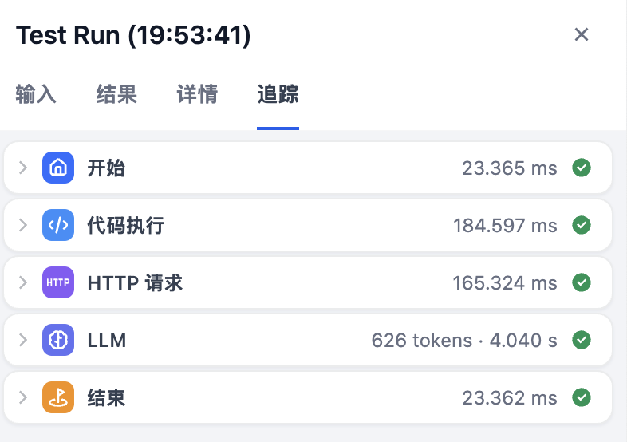

# 学习 Dify 的工作流和对话流应用

在前面的文章中，我们学习了 Dify 的聊天助手、文本生成和 Agent 应用，这些应用虽然功能强大，但在处理一些复杂业务逻辑时仍有局限性。今天，我们将学习 Dify 的 **工作流（Workflow）** 和 **对话流（Chatflow）** 应用，了解如何通过可视化编排构建更加复杂和灵活的 AI 应用。

## 工作流基本概念

工作流是 Dify 提供的一种可视化应用构建方式，它通过将复杂的任务分解成较小的步骤（节点）来降低系统复杂度，减少了对提示词技术和模型推理能力的依赖，提高了 LLM 应用面向复杂任务的性能，同时提升了系统的可解释性、稳定性和容错性。

Dify 将工作流分为两种类型，每种都有不同的适用场景：

* **Workflow（工作流）**：面向自动化和批处理情景，比如高质量翻译、数据分析、内容生成、电子邮件自动化等，它的交互特点是单次输入输出，无法进行多轮对话；
* **Chatflow（对话流）**：面向对话类情景，比如客户服务、语义搜索、需要多步逻辑的对话式应用，它的交互特点是支持多轮对话交互，可以调整生成结果；

> Workflow 这个单词翻译成中文是工作流，但是在 Dify 的概念中，工作流指的是 Workflow 和 Chatflow 两种。不过我感觉这种分类容易让人混淆，所以我倾向于把 Workflow 就叫做工作流，Chatflow 叫做对话流。

## 创建工作流

我们进入 “工作室” 页面，点击 “创建空白应用”，应用类型选择 “工作流”：


我们拿之前学习 Coze Studio 时用过的天气查询的例子，来体验下 Dify 的工作流。填写助手名称，以及可选的图标和描述，进入应用的配置页面：


可以看出 Dify 和 Coze Studio 工作流差不多，也提供了大量的节点可供使用，包括：

### 基础节点

* **LLM**：调用大语言模型的能力，根据给定的提示词处理广泛的任务类型，比如意图识别、文本生成、内容分类、文本转换、代码生成、RAG、图片理解等；
* **知识检索**：从知识库中检索与用户问题相关的文本内容，可作为下游 LLM 节点的上下文来使用，实现 RAG 问答；
* **结束**：每一个工作流在完整执行后都需要至少一个结束节点，用于输出完整执行的最终结果；若流程中出现条件分叉，则需要定义多个结束节点；
* **Agent**：通过集成不同的 Agent 推理策略，使大语言模型能够在运行时动态选择并执行工具，从而实现多步推理；

### 问题理解

* **问题分类器**：通过大模型对用户输入进行分类，类似于条件分支，只不过是用自然语言来定义分支；

### 逻辑

* **条件分支**：根据 if 条件表达式将工作流程拆分成多个分支；
* **迭代**：对数组中的元素依次执行相同的操作步骤，直至输出所有结果，可以理解为任务批处理器，支持并行模式；
* **循环**：用于执行依赖前一轮结果的重复任务，直到满足退出条件或达到最大循环次数；

### 转换

* **代码执行**：支持执行 Python 或 JavaScript 代码，对输入变量进行处理；
* **模版转换**：借助 Jinja2 模板引擎灵活地进行数据转换、文本处理等；
* **变量聚合器**：将多路分支的变量聚合为一个变量，确保无论哪个分支被执行，其结果都能通过一个统一的变量来引用和访问；
* **文档提取器**：解析并读取文件，返回文件内容，支持 TXT、Markdown、PDF、HTML、DOCX 等格式；
* **变量赋值**：将工作流内的变量赋值到会话变量中用于临时存储，并可以在后续对话中持续引用；
* **参数提取器**：利用 LLM 从自然语言推理并提取结构化参数，用于后置的工具调用或 HTTP 请求；

### 工具

* **HTTP 请求**：向指定的网络地址发送定制化的 HTTP 请求，实现与各种外部服务的互联互通；
* **列表操作**：对列表进行过滤、排序、取第 N 项或取前 N 项等操作；
* **Dify 工具**：支持调用平台上所有的工具，包括插件工具、自定义工具、工作流工具、MCP 工具等；

> 相比于 Coze Studio 的工作流，Dify 的工作流少了文本处理（字符串拼接和分割）、知识库写入以及一些数据库相关的组件。

## 编排工作流

接下来我们开始创建 “天气小助手” 工作流，我们首先在 “开始节点” 上定义输入字段 `city` 表示要查询的城市名称：


在 “开始节点” 中，除了我们定义的输入字段外，还有很多内置的系统变量，都以 `sys` 开头：

* `sys.files`：用户上传的文件
* `sys.user_id`：用户唯一标识
* `sys.app_id`：应用唯一标识
* `sys.workflow_id`：工作流标识
* `sys.workflow_run_id`：工作流运行标识

这些参数面向具备开发能力的用户，以区分调用工作流的用户和应用或查询工作流或工作流的运行情况。

假设我们要对接 [高德的天气查询接口](https://lbs.amap.com/api/webservice/guide/api-advanced/weatherinfo)，这个接口通过城市编码查询该城市的天气详情。因此第二步是想办法将用户输入的城市名称转换为城市编码，这可以通过 “代码执行” 节点实现：


这个节点的输入参数为 `city_name` 引用自 “开始节点”，输出参数为 `city_id`，转换的代码如下：

```python
# 城市编码表，可以从高德官网下载
city_list = [
  "北京市,110000",
  "天津市,120000",
  "石家庄市,130100",
  # ...
]
def main(city_name: str) -> dict:
  city_id = '110000'
  for city_info in city_list:
    city_info = city_info.split(',')
    if city_name in city_info[0]:
      city_id = city_info[1]
      break
  return {
    'city_id': city_id
  }
```

代码写好后，可以点击上面的小三角测试该节点，验证没问题后，接着再在代码节点后面加一个 “HTTP 请求” 节点，调用高德的天气查询接口：


该节点配置如下：

* 接口方式 - `GET`
* API 地址 - `https://restapi.amap.com/v3/weather/weatherInfo`
* 请求参数
    * `city` - 引用自代码节点的 `city_id` 参数；
    * `extensions` - 填写 `all`，表示返回的天气类型，`base` 返回实况天气，`all` 返回预报天气；
    * `output` - 填写 `json` 表示希望接口返回 JSON 格式；
    * `key` - 填写高德 API KEY，可以从高德开放平台免费申请；

这里的 `key` 我并没有直接填写 API KEY，而是使用了环境变量，可以点击上面的 “ENV” 按钮创建，类型选择 “Secret”：


> 使用环境变量的好处是，可以保护工作流内所涉及的敏感信息，例如运行工作流时所涉及的 API 密钥、数据库密码等。导出工作流时会提示用户，可以剔除掉 “Secret” 类型的变量值。

同样点击小三角验证，测试通过后，在 “HTTP 请求” 节点后再接一个 “LLM” 节点：


使用大模型将 HTTP 返回的 JSON 结果转换为自然语言，方便用户查看。最后将 “LLM” 节点和 “结束” 节点连接起来，在结束节点上添加 `text` 参数，并引用 “LLM” 节点的出参：


至此，整个工作流搭建完成：


可以点击上方的 “运行” 按钮，对整个工作流进行测试：


在输出面板上，我们还可以点击 “详情” 查看工作流完整的入参和出参：


以及工作流中每个节点的执行情况：



调试完成后，点击右上角的发布按钮：


可以将工作流发布为不同形式：

- **直接运行**：通过 Web 界面直接使用
- **批量运行**：支持 CSV 文件批量处理
- **在 “探索” 中打开**：在 “探索” 页面使用
- **API 访问**：通过 REST API 调用
- **发布为工具**：这是工作流和其他应用的一大区别，可以将其发布成工具，可以在其他应用中复用

## 创建对话流

接下来我们再看看对话流。我们进入 “工作室” 页面，点击 “创建空白应用”，应用类型选择 “Chatflow”：


还是以天气助手为例，填写助手名称，以及可选的图标和描述，进入应用的配置页面：


可以看出，对话流和工作流的节点几乎一样，只不过工作流的 “结束” 节点在这里变成了 “直接回复” 节点，它和 “结束” 节点的最大区别在于，“直接回复” 节点可以不作为最终的输出节点，作为流程过程节点时，可以在中间步骤流式输出结果。

## 编排对话流

由于对话流直接是以对话框的形式交互，因此我们无需在 “开始节点” 定义输入字段：


> 其实，对话流的 “开始节点” 也可以添加输入字段，如果添加的话，就会在对话框的上方多出一个表单，供用户填写。

和工作流一样，对话流的 “开始节点” 也有很多以 `sys` 开头的系统变量，相比于工作流，它还多了几个和会话相关的变量：

* `sys.query`：用户输入内容
* `sys.dialogue_count`：对话的轮次，每轮对话后自动加 1
* `sys.conversation_id`：会话唯一标识

> 除此之外，对话流还多了一个 “会话变量” 的功能，用于临时存储一些信息，比如上下文、用户偏好等，确保在多轮对话中都能够引用该信息。会话变量为可读写变量，我们可以通过 “变量赋值” 节点修改会话变量的内容。

然后再 “开始节点” 后加入一个 “问题分类” 节点：


我们添加两个分类，分类 1 为天气查询，分类 2 为其他。天气查询分类后接一个参数提取器：


该节点的作用是从用户问题中提取出城市名称，这样后面的流程就和之前的工作流一样了，通过代码节点转换城市编码，再通过高德接口查询天气，最后通过大模型输出润色结果，这里不再赘述。

其他分类后接 “LLM” 节点：


对话流的 “LLM” 节点和工作流也有一点区别，多了一个 “记忆” 选项，可以开启，这样在多轮对话时，大模型就能记住之前的对话内容。

至此，对话版的天气小助手就开发好了：


点击上面的 “预览” 按钮，和小助手进行对话：


调试完成后，点击右上角的发布按钮，可以将对话流发布为不同形式：

- **直接运行**：通过 Web 界面直接使用
- **嵌入网站**：通过 iframe 嵌入到其他网站
- **在 “探索” 中打开**：在 “探索” 页面使用
- **API 访问**：通过 REST API 调用

## 小结

我们今天学习了 Dify 的工作流和对话流应用，通过可视化拖拽的方式连接各个节点，实现复杂的业务逻辑：

- **Workflow（工作流）**：单次输入输出，适用于自动化和批处理场景；
- **Chatflow（对话流）**：支持会话变量、对话记忆等功能，更适合多轮交互场景；

至此，我们已经完整体验了 Dify 的 5 种应用类型（聊天助手、文本生成、Agent、工作流、对话流），每种类型都有其独特的优势和适用场景。接下来，我们将进入 Dify 的源码，看看这些应用的实现原理，同时我们还会学习 Dify 的其他高级特性，比如知识库、工具、插件系统等，这些模块为应用提供了更强大的功能，为我们构建企业级 AI 应用提供技术基础。
