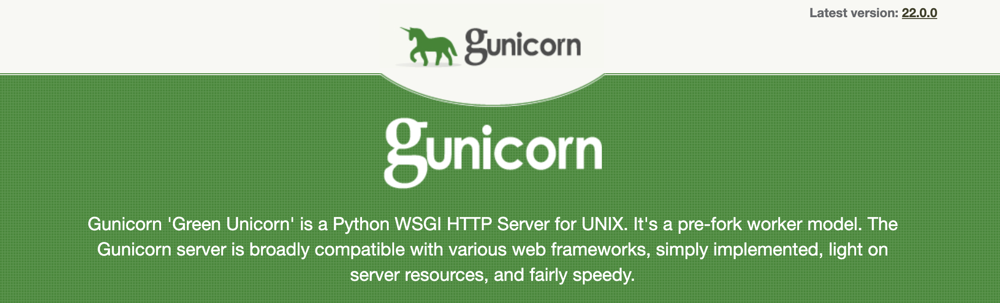
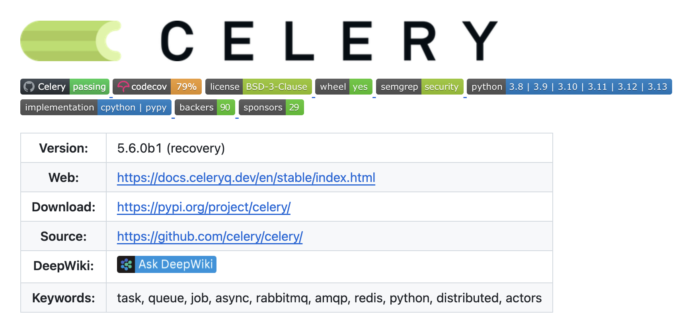

# 学习 Dify 的代码结构

在前面的系列文章中，我们从实用的角度学习了 Dify 的部署方式、应用创建和各种应用类型的使用方法。今天，我们将深入 Dify 的源码，从技术架构的角度来理解这个 LLM 应用开发平台是如何构建的。

## 目录结构

首先，让我们从 Dify 的源码目录结构开始，了解整个项目的组织方式：

```
dify/
├── api/                    # 后端 API 服务 (Python Flask)
├── web/                    # 前端 Web 应用 (Next.js 15 + React 19)
├── sdks/                   # 多语言 SDK
│   ├── python-client/      # Python SDK
│   ├── nodejs-client/      # Node.js SDK
│   └── php-client/         # PHP SDK
├── dev/                    # 开发工具脚本
└── docker/                 # Docker 部署配置
```

从这个目录结构可以看出，Dify 采用了经典的前后端分离架构。**后端 API** 使用 Python Flask 框架提供 RESTful API 服务，**前端 Web** 使用 Next.js 构建现代化的用户界面，两者通过 HTTP API 进行通信。此外，Dify 还提供了多语言的 SDK，方便开发者在不同技术栈中集成 Dify 的能力。

## 后端架构

让我们继续深入后端 `api/` 目录，这里是 Dify 的核心逻辑所在：

```
api/
├── app.py                 # 应用入口文件
├── app_factory.py         # Flask 应用工厂
├── dify_app.py            # 自定义 Flask 应用类
├── controllers/           # 控制器层 (路由处理)
├── services/              # 服务层 (业务逻辑)
├── models/                # 模型层 (数据模型)
├── repositories/          # 仓储层 (数据访问)
├── core/                  # 核心功能模块
├── extensions/            # Flask 扩展
├── libs/                  # 工具库
├── configs/               # 配置管理
├── tasks/                 # 异步任务
├── migrations/            # 数据库迁移
└── tests/                 # 测试代码
```

很显然 Dify 采用了分层的设计思想，将代码按照功能职责进行了清晰的分层：

- **控制器层（Controllers）**：处理 HTTP 请求和响应，负责参数验证和路由分发；
- **服务层（Services）**：包含核心业务逻辑，协调各个组件完成复杂的业务操作；
- **仓储层（Repositories）**：封装数据访问逻辑，提供统一的数据操作接口；
- **模型层（Models）**：定义数据模型和实体关系；

## 应用启动入口

其中 `app.py` 文件是 Dify 的启动入口，核心代码如下：

```python
if is_db_command():
  from app_factory import create_migrations_app
  app = create_migrations_app()
else:
  from app_factory import create_app
  app = create_app()
  celery = app.extensions["celery"]

if __name__ == "__main__":
  app.run(host="0.0.0.0", port=5001)
```

Dify 应用有三种启动模式：

### 数据库迁移模式

在入门篇里我们学习过，首次运行 Dify 之前，需要运行下面的命令初始化数据库：

```bash
$ flask db upgrade
```

Dify 通过判断命令行参数是否包含 `flask db` 子命令，如果包含则调用 `create_migrations_app()` 执行数据库迁移逻辑。

这里使用了 [Flask-SQLAlchemy](https://github.com/pallets-eco/flask-sqlalchemy) 和 [Flask-Migrate](https://github.com/miguelgrinberg/flask-migrate) 库，其核心是通过 SQLAlchemy 的迁移工具 Alembic 管理数据库结构的版本化变更。在软件开发过程中，我们经常会对数据模型进行修改，这时如果手动写 SQL 同步表结构，极有可能会导致不一致或误操作。而 Flask-Migrate 会自动跟踪数据库模型的变更、生成版本化迁移脚本、执行脚本更新数据库表结构，让数据迁移变得非常容易。

> 除了 `flask db upgrade` 命令，Flask-Migrate 还支持很多其他的 `flask db` 子命令，比如 `init`、`migrate`、`downgrade` 等。

### API 服务模式

正常情况下我们通过 `flask run` 运行程序时，Dify 会调用 `create_app()` 函数来创建 `DifyApp` 实例（其实就是 Flask 应用实例）：

```python
def create_app() -> DifyApp:

  # 1. 创建 Flask 应用并加载配置
  dify_app = DifyApp(__name__)
  dify_app.config.from_mapping(dify_config.model_dump())

  # 2. 初始化扩展系统
  initialize_extensions(app)

  return app
```

应用创建流程分为两个关键步骤：

1. **创建 Flask 应用**：初始化 DifyApp 实例，并加载配置
2. **初始化扩展系统**：按顺序加载所有功能扩展，这里是程序启动的关键

要注意的是 `flask run` 一般用于开发调试，在生产环境部署 Dify 时，建议使用 [Gunicorn](https://gunicorn.org/)：

```
$ gunicorn \
    --bind "0.0.0.0:5001" \
    --workers 1 \
    --worker-class gevent \
    --worker-connections 10 \
    --timeout 200 \
    app:app
```

> `flask run` 是为开发阶段设计的轻量级工具，而 `gunicorn` 是为生产环境优化的专业 **WSGI 应用服务器**，专门解决生产场景下的高并发、稳定性和资源管理等问题。



### Celery 任务模式

此外，Dify 支持通过 [Celery](https://github.com/celery/celery) 处理异步任务和定时任务，它利用 Redis 作为消息中间件，把一些耗时的操作（比如发送邮件、处理图片、数据分析等）放到后台去执行，而不会阻塞主程序的运行。



我们可以执行下面的命令启动 Celery 的任务处理服务：

```
$ celery -A app.celery worker <其他参数>
```

或执行下面的命令启动 Celery 的定时任务调度器：

```
$ celery -A app.celery beat <其他参数>
```

这里的 `-A` 参数使用 Python 的模块导入机制，`app.celery` 指向 `app.py` 模块的 `celery` 变量，它其实是一个 [Celery 应用](https://docs.celeryq.dev/en/v5.5.3/userguide/application.html)，通过 `ext_celery` 扩展系统初始化的。

## 模块化的扩展系统

Dify 的扩展系统是其架构的一大亮点，通过模块化的方式组织各种功能：

```python
def initialize_extensions(app: DifyApp):

  # 按顺序初始化所有扩展
  extensions = [
    ext_timezone,        # 时区设置
    ext_logging,         # 日志系统
    ext_warnings,        # 警告处理
    ext_import_modules,  # 模块导入
    ext_orjson,         # JSON 序列化
    ext_set_secretkey,   # 密钥设置
    ext_compress,        # 响应压缩
    ext_code_based_extension,  # 代码扩展
    ext_database,        # 数据库连接
    ext_app_metrics,     # 应用指标
    ext_migrate,         # 数据库迁移
    ext_redis,          # Redis 缓存
    ext_storage,        # 文件存储
    ext_celery,         # 异步任务队列
    ext_login,          # 登录认证
    ext_mail,           # 邮件服务
    ext_hosting_provider, # 托管提供商
    ext_sentry,         # 错误监控
    ext_proxy_fix,      # 代理修复
    ext_blueprints,     # 路由蓝图注册
    ext_commands,       # CLI 命令
    ext_otel,           # OpenTelemetry
    ext_request_logging, # 请求日志
  ]

  for ext in extensions:
    is_enabled = ext.is_enabled() if hasattr(ext, "is_enabled") else True
    if not is_enabled:
      continue  # 跳过禁用的扩展
    ext.init_app(app)  # 初始化扩展
```

扩展系统按照扩展之间的依赖关系顺序执行，确保正确初始化，并支持动态地启用或禁用扩展。

## 小结

通过对 Dify 代码结构的分析，我们可以看到：

1. **前后端分离架构**：后端使用 Python Flask 提供 API 服务，前端使用 Next.js 构建用户界面
2. **分层设计思想**：控制器、服务、仓储、模型层职责清晰，代码组织良好
3. **灵活的启动模式**：支持数据库迁移、API 服务和 Celery 任务三种运行模式
4. **模块化扩展系统**：通过扩展机制组织各种功能，支持按需加载和禁用

不过细心的读者可能会发现一个问题：在应用启动过程中，我们并没有看到路由注册的相关代码。那么 Dify 是如何处理 HTTP 请求路由的呢？

答案就在扩展系统中的 `ext_blueprints` 模块。Dify 通过 Flask 的 Blueprint 机制和 Flask-RESTX 的 Namespace 来组织和注册所有的 API 路由，我们明天就来看看这部分内容。
