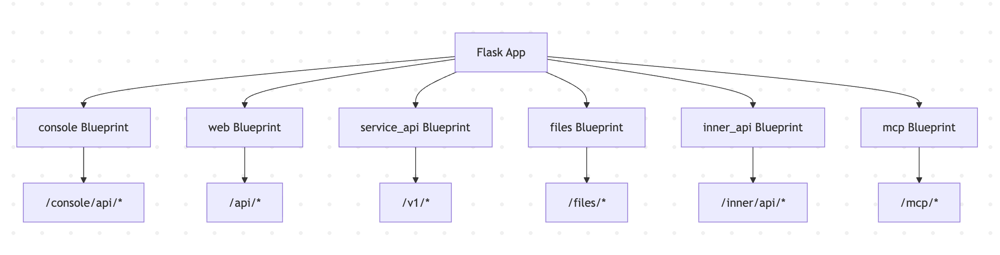
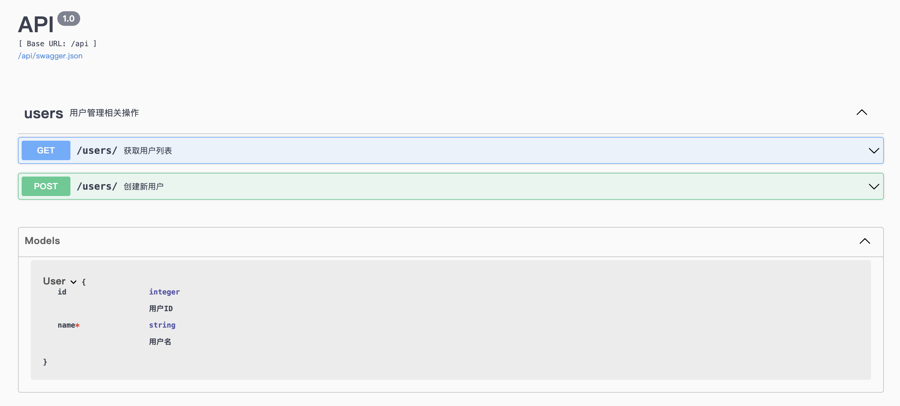

# 学习 Dify 的路由系统

我们昨天学习了 Dify 的代码架构和三种启动模式，不过在应用启动过程中，我们并没有看到路由注册的相关代码，这里的关键就在于它模块化的扩展系统。Dify 通过 `ext_blueprints` 模块注册路由，使用 Flask 的 Blueprint 和 Flask-RESTX 等 Namespace 实现模块化的 API 路由管理。我们今天就来学习这部分内容。

## Flask 框架

在深入分析 Dify 的路由系统之前，我们先简单了解一下 Flask 框架。[Flask](https://github.com/pallets/flask) 是一个基于 Python 的轻量级 Web 应用框架，它设计简洁、易于扩展，特别适合构建 API 服务。


Flask 的主要优势包括：

- **简单易用**：代码简洁，学习曲线平缓
- **灵活扩展**：可以根据需要选择和集成各种扩展
- **成熟稳定**：经过多年发展，社区生态丰富
- **适合 API**：非常适合构建 RESTful API 服务

Flask 的设计哲学是 **微框架**，它只提供 Web 开发的核心功能，其他功能通过扩展来实现。在 Dify 项目中采用了大量的 Flask 扩展，比如：

- **Flask-RESTX**：用于构建 RESTful API 和自动生成文档
- **Flask-SQLAlchemy**：ORM 数据库操作
- **Flask-Migrate**：数据库迁移管理
- **Flask-Login**：用户认证和会话管理
- **Flask-CORS**：跨域资源共享支持
- **Flask-Compress**：自动压缩 HTTP 响应内容
- **Flask-orjson**：使用用 orjson（一个高性能的 JSON 库）替换 Flask 默认的 JSON 编码器和解码器

### Flask 基本使用

下面是 Flask 框架的基本用法：

```python
# 创建应用
from flask import Flask
app = Flask(__name__)

# 注册路由
@app.route('/user/profile')
def user_profile():
  return 'user profile'

@app.route('/user/settings')
def user_settings():
  return 'user settings'

if __name__ == "__main__":
  app.run(host="0.0.0.0", port=6001)
```

寥寥几行代码就可以创建一个 RESTful API 服务。可以看到，这里使用了 Flask 最原始的装饰器方式 `@app.route` 来注册路由，Flask 也支持手动注册路由，这种方式更灵活：

```python
# 手动注册路由
app.add_url_rule('/user/prifile', 'user_profile', user_profile)
app.add_url_rule('/user/settings', 'user_settings', user_settings)
```

### 使用 Blueprint 注册路由

不过上述两种方式都存在着明显的缺点，所有路由都注册到同一个 `app` 对象上，难以按功能模块分离，导致代码组织混乱；如果是大型项目，路由会分散在各处，而且无法统一为一组相关路由设置 URL 前缀，维护起来很困难。

于是 Flask 引入了 **Blueprint** 功能，也被称为 **蓝图**，允许你将相关的路由、视图函数、模板和静态文件组织在一起，形成一个可重用的组件。通过模块化和代码隔离，很好地解决了这些问题。

下面演示下蓝图的基本用法，首先我们创建一个独立的 `user.py` 文件，内容如下：

```python
# 创建蓝图
from flask import Blueprint
user_bp = Blueprint('user', __name__, url_prefix='/user')

# 定义路由
@user_bp.route('/profile')
def profile():
  return 'user profile'

@user_bp.route('/settings')
def settings():
  return 'user settings'
```

在这个文件中，我们创建了一个名为 `user` 的蓝图，并约定了统一的 URL 前缀，然后通过装饰器 `@user_bp.route` 定义路由。接着我们创建主程序：

```python
# 创建应用
from flask import Flask
app = Flask(__name__)

# 注册蓝图
from user import user_bp
app.register_blueprint(user_bp)

if __name__ == "__main__":
  app.run(host="0.0.0.0", port=6001)
```

在主程序中，我们导入刚刚的蓝图，并通过 `app.register_blueprint()` 注册蓝图，这样蓝图中定义的路由就注册好了。

Flask 的 Blueprint 功能允许我们将大型应用拆分成多个模块，每个模块负责处理特定的功能，优势如下：

- **模块化**：将大型应用拆分成多个模块
- **URL 前缀管理**：为一组路由添加统一的 URL 前缀
- **代码复用**：相同功能可以在不同应用中重复使用
- **团队协作**：不同开发者可以独立开发不同的 Blueprint

Dify 充分利用了这一特性来组织其复杂的 API 结构。

## 学习 Dify 的 `ext_blueprints` 扩展

在 Dify 中，所有的蓝图都在 `api/extensions/ext_blueprints.py` 文件中统一注册：

```python
def init_app(app: DifyApp):
    
  # 导入所有蓝图
  from controllers.console import bp as console_app_bp     # 管理控制台
  from controllers.web import bp as web_bp                 # Web 应用
  from controllers.service_api import bp as service_api_bp # 服务 API
  from controllers.files import bp as files_bp             # 文件操作
  from controllers.inner_api import bp as inner_api_bp     # 内部 API
  from controllers.mcp import bp as mcp_bp                 # MCP 协议

  # 为不同蓝图配置 CORS 策略
  from flask_cors import CORS
  CORS(service_api_bp,
     allow_headers=["Content-Type", "Authorization", "X-App-Code"])
  CORS(web_bp,
     resources={r"/*": {"origins": dify_config.WEB_API_CORS_ALLOW_ORIGINS}},
     supports_credentials=True)
  CORS(console_app_bp,
     resources={r"/*": {"origins": dify_config.CONSOLE_CORS_ALLOW_ORIGINS}},
     supports_credentials=True)
  
  # 注册所有蓝图到 Flask 应用
  app.register_blueprint(service_api_bp) # /v1/*
  app.register_blueprint(web_bp)         # /api/*
  app.register_blueprint(console_app_bp) # /console/api/*
  app.register_blueprint(files_bp)       # /files/*
  app.register_blueprint(inner_api_bp)   # /inner/api/*
  app.register_blueprint(mcp_bp)         # /mcp/*
```

可以看出，Dify 将 API 按照使用场景分成了几个主要的蓝图：

- **console**：管理控制台的 API，用于应用管理、配置等
- **web**：Web 端使用的 API，用于应用展示和交互
- **service_api**：对外提供的服务 API，供第三方集成使用
- **files**：文件上传下载相关的 API
- **inner_api**：内部服务间通信的 API
- **mcp**：MCP（Model Context Protocol）相关的 API

每个蓝图都对应自己的 URL 前缀：



而且 Dify 为不同蓝图配置了不同的 CORS 策略，比如 `console` 蓝图用于管理控制台 API，只允许管理控制台域名访问；`web` 蓝图用于前端应用 API，只允许配置的前端域名访问；`service_api` 蓝图用于第三方开发者 API，无 origins 限制，允许任何域名访问，并支持 `X-App-Code` 头，用于应用身份验证。这种分层的接口安全设计，同样得益于 Flask Blueprint 的模块化特性。

此外，不同的蓝图还使用了不同的认证策略：

| Blueprint | 认证方式 | 用途 | 示例端点 |
|-----------|---------|------|---------|
| `console` | JWT | 管理后台操作 | `/console/api/apps` |
| `web` | Token/Session | 前端应用调用 | `/api/chat-messages` |
| `service_api` | API Key | 第三方服务调用 | `/v1/chat-messages` |
| `files` | 多重认证 | 文件上传下载 | `/files/upload` |
| `inner_api` | 内网限制 | 服务间通信 | `/inner/api/health` |

## 使用 Flask-RESTX 增强 API 开发体验

虽然 Flask 本身已经很适合构建 API，但 Dify 选择了 Flask-RESTX 这个扩展来进一步增强 API 开发体验。Flask-RESTX 是 Flask-RESTPlus 的社区维护版本，它在 Flask 的基础上提供了更多 RESTful API 开发的便利功能。

Flask-RESTX 的主要特性包括：

- **自动 API 文档生成**：通过装饰器自动生成 Swagger/OpenAPI 文档
- **请求参数验证**：内置参数验证和序列化功能
- **命名空间管理**：支持 API 版本控制和模块化组织
- **响应模型定义**：可以定义标准化的响应格式

### 使用 `Api` 注册路由

Flask-RESTX 在 Flask 的基础上，引入了 `Resource` 和 `Api` 的概念：`Resource` 用于定义 RESTful 资源，可以更方便地创建 RESTful 接口；而 `Api` 则是对 Flask 的 `Blueprint` 的扩展，专门用于添加 RESTful 资源类，它能够自动处理 HTTP 方法映射（GET、POST、PUT、DELETE 等），支持自动生成 API 文档和 Swagger UI，支持参数的解析和验证。下面是使用 `Api` 注册路由的示例代码：

```python
from flask import Blueprint
from flask_restx import Api, Resource

# 创建 Blueprint 和 API
bp = Blueprint('api', __name__, url_prefix='/api')
api = Api(bp, doc='/docs')  # 启用 Swagger UI

# 定义 API 资源
class UserResource(Resource):
  
  def get(self):
    # 获取用户列表
    return []

  def post(self):
    # 创建新用户
    return {"message": "用户创建成功"}, 201

# 注册资源
api.add_resource(UserResource, '/users')
```

和直接在蓝图中添加路由不同，这里需要先定义 API 资源，它会自动生成资源对应的增删改查 RESTful 接口，然后通过 `api.add_resource()` 添加资源。而本质上 `Api` 还是对蓝图进行操作的，因此我们只要在主程序中通过 `app.register_blueprint()` 注册蓝图即可，和普通的蓝图用法一样。

### 使用 `Namespace` 管理路由

Flask-RESTX 的另一大特点是增加了 `Namespace` 的功能，可以对蓝图下的 API 端点进一步组织和分组。下面的示例演示了 `Namespace` 的基本用法：

```python
from flask import Blueprint
from flask_restx import Api, Namespace, Resource, fields

# 创建 Blueprint 和 API
bp = Blueprint('api', __name__, url_prefix='/api')
api = Api(bp, doc='/docs')  # 启用 Swagger UI

# 创建命名空间
user_ns = Namespace('users', description='用户管理相关操作')

# 定义数据模型
user_model = user_ns.model('User', {
    'id': fields.Integer(description='用户ID'),
    'name': fields.String(required=True, description='用户名')
})

# 定义 API 资源
@user_ns.route('/')
class UserList(Resource):
    @user_ns.doc('get_users')
    @user_ns.marshal_list_with(user_model)
    def get(self):
        """获取用户列表"""
        return []

    @user_ns.doc('create_user')
    @user_ns.expect(user_model)
    def post(self):
        """创建新用户"""
        return {"message": "用户创建成功"}, 201

# 注册命名空间
api.add_namespace(user_ns, path='/users')
```

和上面 `api.add_resource()` 添加资源不同的是，这里是通过 `api.add_namespace()` 注册命名空间，`Api` 会将命名空间下的所有路由注册到蓝图中。主程序还是一样，通过 `app.register_blueprint()` 注册蓝图即可。

此外，我们还可以通过 `@user_ns` 对接口进行增强，比如定义数据模型，增加参数验证。访问 `/api/docs` 地址，可以查看 Swagger 页面：



## Dify 如何组织路由

我们上面已经了解到，Dify 将 API 分成了 `console`、`web`、`service_api`、`files`、`inner_api`、`mcp` 六个蓝图，所有的蓝图注册逻辑都位于 `api/controllers` 目录。让我们以 `console` 蓝图为例，看看它是如何组织的：

```python
from flask import Blueprint
from libs.external_api import ExternalApi

# 创建 console Blueprint
bp = Blueprint("console", __name__, url_prefix="/console/api")
api = ExternalApi(bp)

# 文件相关 API
api.add_resource(FileApi, "/files/upload")
api.add_resource(FilePreviewApi, "/files/<uuid:file_id>/preview")

# 应用导入相关 API
api.add_resource(AppImportApi, "/apps/imports")
api.add_resource(AppImportConfirmApi, "/apps/imports/<string:import_id>/confirm")

# 导入各个子模块的控制器
from . import admin, apikey, extension, feature, ping, setup, version
# 导入应用相关的控制器
from .app import app, workflow, completion, conversation, message, model_config, statistic
# 导入认证相关的控制器
from .auth import login, oauth, forgot_password
# 导入数据集相关的控制器
from .datasets import datasets, datasets_document, hit_testing
```

从代码可以看出，`console` 蓝图都是通过 `api.add_resource()` 的方式注册路由的。我们再看看 `service_api` 蓝图：

```python
from flask import Blueprint
from flask_restx import Namespace
from libs.external_api import ExternalApi

# 创建 service_api Blueprint
bp = Blueprint("service_api", __name__, url_prefix="/v1")

api = ExternalApi(
  bp,
  version="1.0",
  title="Service API",
  description="API for application services",
  doc="/docs",  # Enable Swagger UI at /v1/docs
)

# 创建 service_api Namespace
service_api_ns = Namespace("service_api", description="Service operations", path="/")

from . import index
# 导入应用相关的控制器
from .app import annotation, app, audio, completion, conversation, file, file_preview, message, site, workflow
# 导入数据集相关的控制器
from .dataset import dataset, document, hit_testing, metadata, segment, upload_file
# 导入模型相关的控制器
from .workspace import models

# 添加 Namespace
api.add_namespace(service_api_ns)
```

## 小结

今天我们深入学习了 Dify 的路由系统。Dify 基于 Flask 的 Blueprint 功能，将复杂的 API 按照 `console`、`web` 和 `service_api` 等不同场景进行模块化拆分。这种设计不仅使代码结构更加清晰，还允许为不同模块配置独立的 CORS 和认证策略，增强了系统的安全性。此外，它还借助 Flask-RESTX 扩展，通过 `Api`、`Resource` 和 `Namespace` 等概念进一步优化了 API 的组织方式，并实现了 API 文档的自动生成和参数验证等功能。

明天我们将接着研究 Dify 的源码，来看看具体的接口实现，先从用户和助手对话时的后端逻辑开始。
