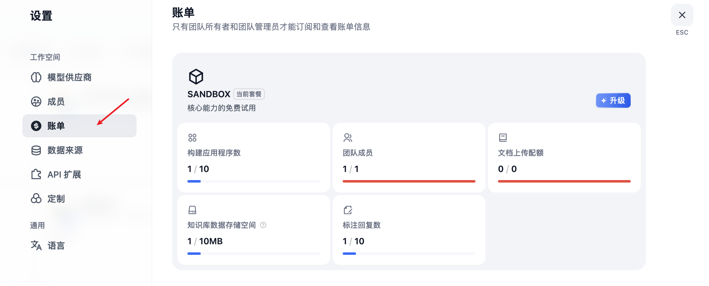
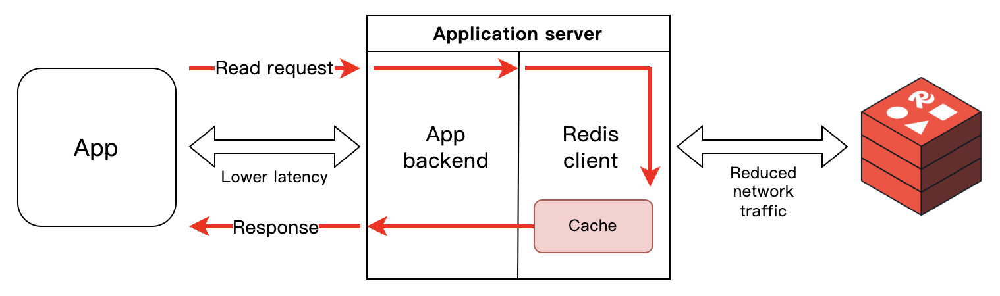

# 深入 Dify 应用的会话流程之限流策略

在前面的文章中，我们梳理了 Dify 应用的各种会话接口，了解了不同蓝图下五种应用类型的接口实现，以及各自的认证方式和用户类型。如果我们仔细阅读源码就会发现，所有应用的会话接口背后处理逻辑几乎一样：

```python
def post(self, app_model: App, end_user: EndUser):
  response = AppGenerateService.generate(
    app_model=app_model, user=end_user, args=args, invoke_from=InvokeFrom.SERVICE_API, streaming=streaming
  )
  return helper.compact_generate_response(response)
```

都是通过统一调用核心服务 `AppGenerateService` 的 `generate()` 方法，然后返回响应。今天我们就看看这个核心服务的具体实现，深入探索 Dify 的会话流程，解析其中涉及的关键技术要点。

## 统一的会话入口

正如上文提到的，无论是 Console、Web 还是 Service API 蓝图下的会话接口，最终都会调用到 `AppGenerateService` 的 `generate()` 方法。这个方法是 Dify 会话处理的核心枢纽，负责协调不同类型应用的生成流程。

让我们来看看这个方法的实现逻辑：

```python
@classmethod
def generate(
  cls, 
  app_model: App, 
  user: Union[Account, EndUser], 
  args: Mapping[str, Any], 
  invoke_from: InvokeFrom, 
  streaming: bool = True,
):
  # 如果是 sandbox 订阅计划
  # 开启系统级限流：总请求数限流
  if dify_config.BILLING_ENABLED:
    limit_info = BillingService.get_info(app_model.tenant_id)
    if limit_info["subscription"]["plan"] == "sandbox":
      if cls.system_rate_limiter.is_rate_limited(app_model.tenant_id):
        raise InvokeRateLimitError(
          "Rate limit exceeded, please upgrade your plan "
          f"or your RPD was {dify_config.APP_DAILY_RATE_LIMIT} requests/day"
        )
      cls.system_rate_limiter.increment_rate_limit(app_model.tenant_id)

  # 应用级限流：并发请求数限流
  max_active_request = cls._get_max_active_requests(app_model)
  rate_limit = RateLimit(app_model.id, max_active_request)
  request_id = RateLimit.gen_request_key()
  try:
    request_id = rate_limit.enter(request_id)

    # 调用不同类型的应用生成器
    if app_model.mode == AppMode.COMPLETION.value:
      # 文本生成
    elif app_model.mode == AppMode.AGENT_CHAT.value or app_model.is_agent:
      # 智能体
    elif app_model.mode == AppMode.CHAT.value:
      # 聊天助手
    elif app_model.mode == AppMode.ADVANCED_CHAT.value:
      # 对话流
    elif app_model.mode == AppMode.WORKFLOW.value:
      # 工作流
    else:
      raise ValueError(f"Invalid app mode {app_model.mode}")

  # 退出应用级限流
  except Exception:
    rate_limit.exit(request_id)
    raise
  finally:
    if not streaming:
      rate_limit.exit(request_id)
```

从这个核心方法可以看出，Dify 的会话处理流程包含以下几个关键步骤：

1. **系统级限流**：基于应用的租户进行全局限流控制，开启账单功能后才有这个功能
2. **应用级限流**：基于应用的并发请求数量限制
3. **应用类型路由**：根据应用模式选择对应的生成器，统一的流式响应处理

## 系统级限流

Dify 支持开启账单功能，在 `.env` 文件中添加：

```
BILLING_ENABLED=true
```

然后重启 API 服务，用户设置页面就会多一个 “账单” 菜单：



用户默认是 sandbox 订阅计划，对话时就会经过系统级限流，用于限制某个租户下的应用一天的总请求数量。

> 注意 Dify 的限流不是针对请求的用户，而是以应用或应用的租户作为维度。

系统级限流器的定义如下：

```python
system_rate_limiter = RateLimiter(
  "app_daily_rate_limiter", 
  dify_config.APP_DAILY_RATE_LIMIT, 
  86400
)
```

Dify 的限流基于 Redis 实现，这里的 `app_daily_rate_limiter` 是 Redis 键的前缀，`APP_DAILY_RATE_LIMIT` 表示最大请求数，默认是 5000 次，86400 是时间窗口，单位秒，表示一天 24 小时。

系统级限流的核心算法是滑动窗口，通过 Redis 的 **Sorted Set** 实现。每次用户会话时增加请求计数：

```python
def increment_rate_limit(self, email: str):

  # 生成 Redis 键: "app_daily_rate_limiter:tenant_id"
  key = self._get_key(email)

  # 在 Sorted Set 中添加当前时间戳
  current_time = int(time.time())
  redis_client.zadd(key, {current_time: current_time})

  # 设置 key 过期时间，为时间窗口的 2 倍，防止数据残留
  redis_client.expire(key, self.time_window * 2)
```

实际上就是使用 `ZADD` 命令将当前时间戳添加到 Sorted Set 中，key 为 `app_daily_rate_limiter:tenant_id`，可按租户隔离限流，同时为 key 设置一个过期时间，防止数据残留。限流的校验逻辑如下：

```python
def is_rate_limited(self, email: str) -> bool:

  # 生成 Redis 键: "app_daily_rate_limiter:tenant_id"
  key = self._get_key(email)  
  
  # 清除时间窗口外的记录
  current_time = int(time.time())
  window_start_time = current_time - self.time_window
  redis_client.zremrangebyscore(key, "-inf", window_start_time)

  # 统计当前时间窗口内的请求数
  attempts = redis_client.zcard(key)

  # 判断是否超限
  if attempts and int(attempts) >= self.max_attempts:
    return True
  return False
```

这里比较巧妙的通过 Sorted Set 的 `ZREMRANGEBYSCORE` 命令，由于存储的分数都是时间戳，因此很容易根据时间清除时间窗口外的记录，然后再通过 `ZCARD` 命令获取集合大小，也就是当前时间窗口内的请求数，判断是否超出限制。

这是一个经典的分布式限流实现，使用 Redis 的 Sorted Set 实现了 24 小时的滑动窗口限流，每个请求都有精确的时间戳记录，既保证了精确性又具备良好的性能。

### 学习 Sorted Set 数据结构

**[Sorted Set（有序集合）](https://redis.io/docs/latest/develop/data-types/sorted-sets/)** 是 Redis 的核心数据结构之一，结合了 Set 的唯一性和排序功能，具有如下特点：

- **有序性**: 元素按分数（score）排序
- **唯一性**: 成员（member）不能重复
- **双重索引**: 支持按分数和成员查找
- **高效操作**: 大部分操作时间复杂度为 `O(log N)`

它的常用命令包括：

#### 添加元素

我们创建一个有序集合 `leaderboard` 表示分数排行榜，并添加三个人的数据：

```
> ZADD leaderboard 100 "alice" 200 "bob" 150 "charlie"
(integer) 3
```

#### 获取元素

按排名获取，根据分数从小到大排序：

```
> ZRANGE leaderboard 0 2 WITHSCORES
1) "alice"
2) "100"
3) "charlie"
4) "150"
5) "bob"
6) "200"
```

按排名获取，根据分数从大到小排序：

```
> ZREVRANGE leaderboard 0 2 WITHSCORES
1) "bob"
2) "200"
3) "charlie"
4) "150"
5) "alice"
6) "100"
```

#### 按分数范围查询

按分数范围获取：

```
> ZRANGEBYSCORE leaderboard 100 180 WITHSCORES
1) "alice"
2) "100"
3) "charlie"
4) "150"
```

#### 统计计数

统计总元素数：

```
> ZCARD leaderboard
(integer) 3
```

统计分数范围内元素数：

```
> ZCOUNT leaderboard 100 180
(integer) 2
```

#### 分数和排名

获取成员分数：

```
> ZSCORE leaderboard "alice"
"100"
```

获取成员排名（从0开始，小到大）：

```
> ZRANK leaderboard "alice"
(integer) 0
```

获取成员排名（从0开始，大到小）：

```
> ZREVRANK leaderboard "alice"
(integer) 2
```

#### 修改操作

增加分数，下面的命令将 alice 分数增加 50：

```
> ZINCRBY leaderboard 50 "alice"
"150"
```

#### 删除元素

删除指定成员：

```
> ZREM leaderboard "alice"
```

按排名删除，比如下面的命令表示删除排名最低的：

```
> ZREMRANGEBYRANK leaderboard 0 0
```

按分数范围删除：

```
> ZREMRANGEBYSCORE leaderboard 0 100
```

## 应用级限流

通过系统级限流之后，会话流程还会经过一层应用级限流。可以在 `.env` 文件中通过 `APP_MAX_ACTIVE_REQUESTS` 变量设置限额，默认是 0 不限制：

```
APP_MAX_ACTIVE_REQUESTS=0
```

Dify 为每次会话生成一个请求 ID，然后调用 `enter()` 方法：

```python
def enter(self, request_id: Optional[str] = None) -> str:

  # 检查当前活跃请求数
  active_requests_count = redis_client.hlen(self.active_requests_key)
  if active_requests_count >= self.max_active_requests:
    raise AppInvokeQuotaExceededError(...)

  # 记录新的活跃请求
  redis_client.hset(self.active_requests_key, request_id, str(time.time()))
  return request_id
```

这里使用了 Redis 的 **Hash（哈希表）** 数据结构来记录活跃请求，每次会话时，使用 `HSET` 命令将请求 ID 和当前时间存入 `active_requests_key`，这个键的格式是 `dify:rate_limit:{}:active_requests`，如果这个 Hash 的长度超出 `max_active_requests` 则抛出额度超限的异常。

当请求结束或异常，通过 `exit()` 方法将请求从 Redis 中移除：

```python
def exit(self, request_id: str):

  # 从活跃请求集合中移除
  redis_client.hdel(self.active_requests_key, request_id)
```

可以看出，应用级限流采用并发请求数控制模式，与系统级的滑动窗口不同，它控制的是 **同时进行的活跃请求数量**，防止某个应用同一时间请求数过大。

## Dify 的 `ext_redis` 扩展

这里还有一个知识点值得一提，在限流的代码里，Dify 通过 `redis_client` 执行 Redis 操作：

```python
from extensions.ext_redis import redis_client
```

我们前面介绍过 Dify 的扩展系统，这个变量就是在 `ext_redis` 扩展中初始化的：

```python
def init_app(app: DifyApp):
  
  global redis_client

  # 哨兵模式
  if dify_config.REDIS_USE_SENTINEL:
    redis_params = _get_base_redis_params()
    client = _create_sentinel_client(redis_params)
  # 集群模式
  elif dify_config.REDIS_USE_CLUSTERS:
    client = _create_cluster_client()
  # 单例模式
  else:
    redis_params = _get_base_redis_params()
    client = _create_standalone_client(redis_params)

  # 初始化 redis_client
  redis_client.initialize(client)
  app.extensions["redis"] = redis_client
```

从初始化代码可以看出，Dify 支持 **哨兵**、**集群**、**单例** 三种 Redis 模式，这种统一的处理方式很值得我们学习和借鉴。

### 客户端缓存

此外，在 Reids 的配置参数中，还有一点比较有意思：

```python
def _get_cache_configuration() -> CacheConfig | None:

  # 是否开启客户端缓存
  if not dify_config.REDIS_ENABLE_CLIENT_SIDE_CACHE:
    return None
  # 必须是 RESP3 协议
  resp_protocol = dify_config.REDIS_SERIALIZATION_PROTOCOL
  if resp_protocol < 3:
    raise ValueError("Client side cache is only supported in RESP3")
  return CacheConfig()

def _get_base_redis_params() -> dict[str, Any]:
  return {
    "username": dify_config.REDIS_USERNAME,
    "password": dify_config.REDIS_PASSWORD or None,
    "db": dify_config.REDIS_DB,
    "encoding": "utf-8",
    "encoding_errors": "strict",
    "decode_responses": False,
    # 协议
    "protocol": dify_config.REDIS_SERIALIZATION_PROTOCOL,
    # 缓存配置
    "cache_config": _get_cache_configuration(),
  }
```

这里使用了 Redis 的 **[客户端缓存（Client-side caching）](https://redis.io/docs/latest/develop/clients/client-side-caching/)** 特性，这是从 Redis 6.0 开始引入的一个功能特性，允许客户端在本地缓存从服务器读取的数据，具有如下特性：

- **本地缓存**: 数据存储在客户端内存中
- **自动失效**: 服务器数据变化时自动通知客户端
- **透明操作**: 对应用代码透明，自动命中缓存
- **性能提升**: 减少网络往返，提高读取性能

可以在 `.env` 文件中通过 `REDIS_ENABLE_CLIENT_SIDE_CACHE` 配置开启：

```
REDIS_ENABLE_CLIENT_SIDE_CACHE=true
REDIS_SERIALIZATION_PROTOCOL=3
```

注意开启这个功能需要 Redis 支持 `RESP3` 协议。**[RESP（REdis Serialization Protocol）](https://redis.io/docs/latest/develop/reference/protocol-spec/)** 是 Redis 的通信协议，目前有 `RESP2` 和 `RESP3` 两个版本：`RESP2` 协议比较老，后面大概率是要废弃的，它只支持简单的字符串、整数、大字符串、数组这些数据类型；而 `RESP3` 是新一代 Redis 通信协议，支持更丰富的数据类型，支持发布订阅模式，并支持服务器推送能力，这也是实现客户端缓存的关键。

开启客户端缓存后，工作流程如下：

1. 客户端首次读取时，从服务器获取，并存储到本地缓存
2. 后续读取时，直接从本地缓存返回，无网络开销，大大提升程序的读取性能
3. 当服务器缓存发生变化时，会向客户端发送缓存失效通知，客户端清除本地缓存
4. 下次读取时，客户端会重新从服务器获取，更新本地缓存



客户端缓存非常适合频繁读取且变化较少的场景，比如应用的配置、用户的权限、模型的参数等。通过该特性，可以大幅减少网络延迟，降低 Redis 服务器的压力，提高应用性能。但由于客户端需要额外的内存存储缓存，因此在使用时，需要特别关注客户端的内存使用情况，

## 小结

我们今天开始深入分析 Dify 的会话处理流程，了解了所有类型的应用都是通过 `AppGenerateService.generate()` 方法进行统一处理的，并经过了两层限流策略：

- **系统级限流**：基于 Redis Sorted Set 实现的滑动窗口算法，按租户维度限制每日总请求数
- **应用级限流**：基于 Redis Hash 实现的并发控制，限制应用同时活跃的请求数量

两者对比如下：

| 特性   | 系统级限流      | 应用级限流      |
|------|------------|------------|
| 算法   | 滑动窗口       | 并发控制       |
| 维度   | 租户ID       | 应用ID       |
| 限制   | 24小时请求总数   | 同时活跃请求数    |
| 数据结构 | Redis ZSET | Redis Hash |
| 清理机制 | 时间窗口自动清理   | 请求结束时清理    |

在学习过程中，我们看到 Dify 应用了大量的 Redis 技术：

- **Sorted Set**：用于实现精确的滑动窗口限流，巧妙利用时间戳作为分数进行时间窗口管理
- **Hash**：用于追踪活跃请求，实现并发数控制
- **客户端初始化**：支持多种 Redis 部署模式（单例、哨兵、集群），使用统一的客户端管理 Redis 连接
- **客户端缓存**：基于 RESP3 协议的服务器推送特性，适合读多写少的场景

这些内容都很值得我们在构建高并发系统时学习和借鉴。在下一篇文章中，我们将继续深入探讨 Dify 应用的会话流程，了解每种应用生成器的执行流程。
