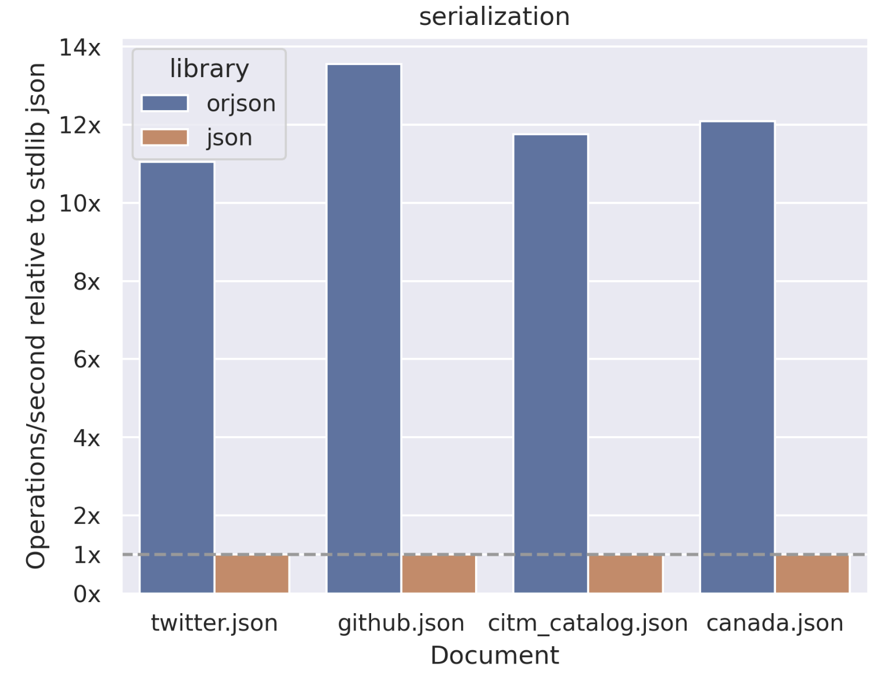
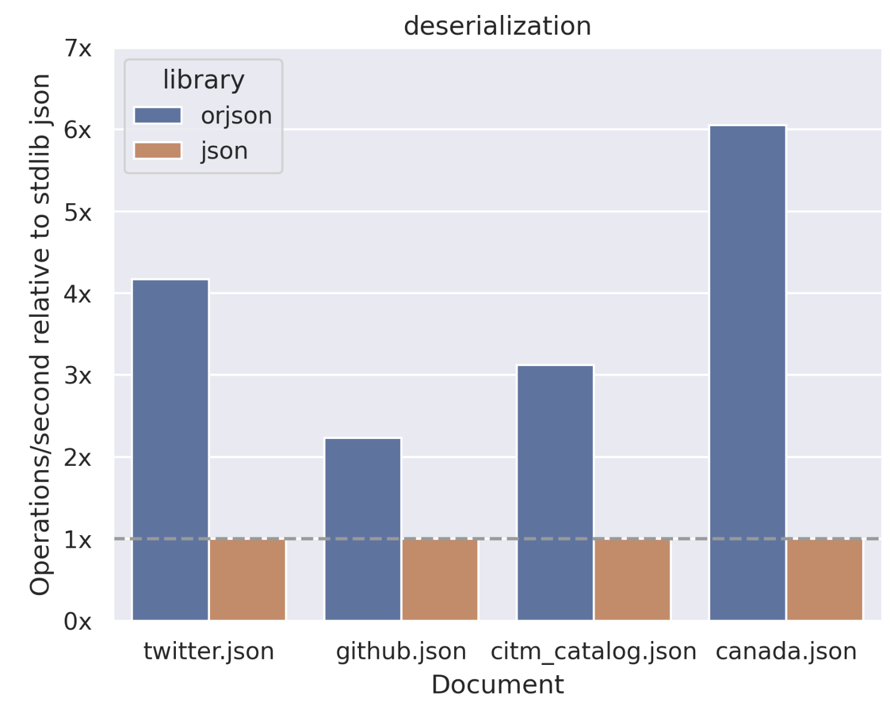
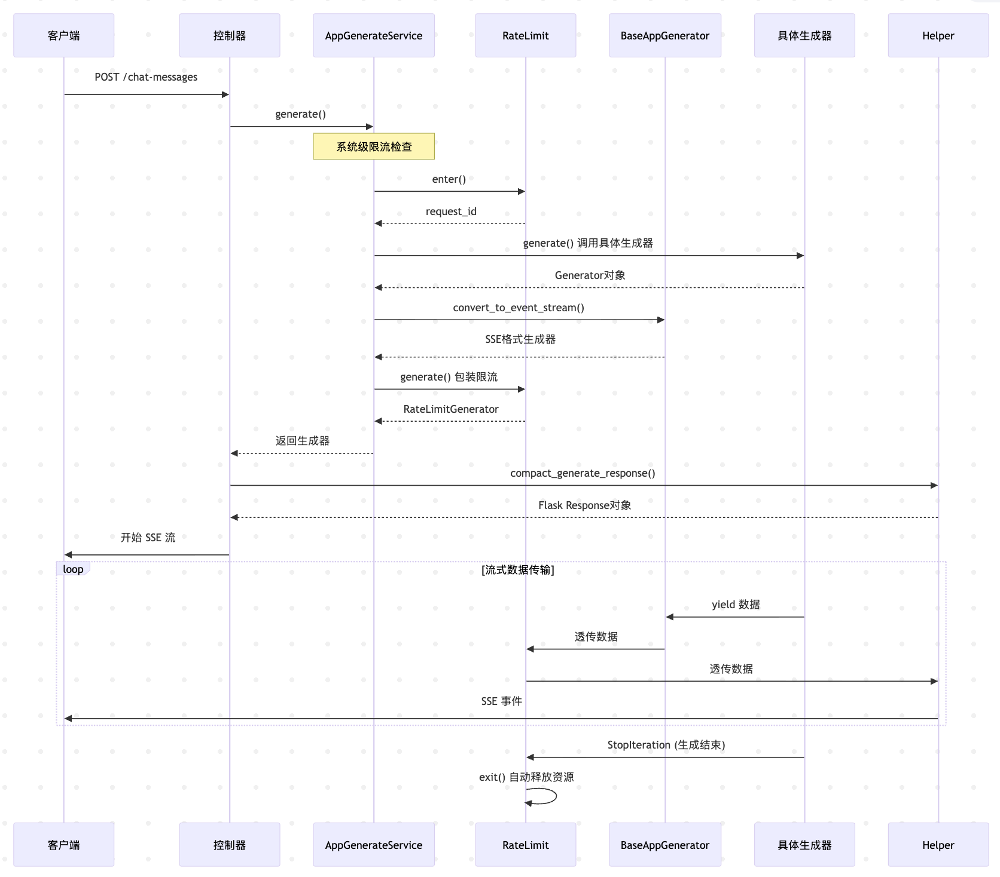

# 深入 Dify 应用的会话流程之流式处理

在昨天的文章中，我们学习了 Dify 会话处理流程的核心服务 `AppGenerateService`，并通过分析它的 `generate()` 方法了解了 Dify 如何通过系统级和应用级两层限流策略来保障服务的稳定性。不过这个方法昨天只分析了一半，今天我们继续来看看剩下的部分。

Dify 会根据不同的应用类型走不同的应用生成器逻辑，通过源码可以发现，无论是文本生成、聊天对话、智能体、工作流还是对话流，都遵循着固定的流式处理流程。比如文本生成：

```python
if app_model.mode == AppMode.COMPLETION.value:
  return rate_limit.generate(                        # 步骤1：限流包装
    CompletionAppGenerator.convert_to_event_stream(  # 步骤2：事件流转换
      CompletionAppGenerator().generate(             # 步骤3：具体应用逻辑
        app_model=app_model, user=user, args=args,
        invoke_from=invoke_from, streaming=streaming
      ),
    ),
    request_id=request_id,
  )
```

我们先不急着看具体的应用生成器，而是先看看外面的两层方法，学习 Dify 是如何统一处理流式和非流式响应的。

## 限流生成器

在 `generate()` 方法最后的 `finally` 语句里，有一点特别值得注意，这里有一个判断很奇怪，只有当请求是非流式时才调用 `exit()` 释放限流：

```python
  finally:
    if not streaming:
      rate_limit.exit(request_id)
```

在传统的非流式处理中，在 `finally` 块中释放限流确实是可以的；但在流式处理中，当 `generate()` 方法返回时，**请求实际上还没有结束！** 客户端会持续从生成器中读取数据，直到生成器耗尽或发生异常。因此，我们需要一个机制来确保只有当生成器正常结束或异常时才释放限流，并且不影响原有生成器的任何功能。

我们可以看看 Dify 是如何处理流式请求的限流的，核心就在 `rate_limit.generate()` 方法里：

```python
def generate(self, generator: Union[Generator[str, None, None], Mapping[str, Any]], request_id: str):
  if isinstance(generator, Mapping):
    # 非流式响应直接返回
    return generator
  else:
    # 流式响应使用 RateLimitGenerator 包装
    return RateLimitGenerator(
      rate_limit=self,
      generator=generator,
      request_id=request_id,
    )
```

这里首先通过 `generator` 的类型自动区分流式响应（`Generator`）和非流式响应（`Mapping`），对于非流式响应直接返回，而对于流式响应，使用 `RateLimitGenerator` 进行包装而不影响原有接口。它的实现如下：

```python
class RateLimitGenerator:
  def __init__(self, rate_limit: RateLimit, generator: Generator[str, None, None], request_id: str):
    self.rate_limit = rate_limit
    self.generator = generator
    self.request_id = request_id
    self.closed = False

  def __iter__(self):
    return self

  def __next__(self):
    if self.closed:
      raise StopIteration
    try:
      # 正常情况下透传数据
      return next(self.generator)
    except Exception:
      # 异常时自动释放资源
      self.close()
      raise

  def close(self):
    if not self.closed:
      self.closed = True
      # 从 Redis 中移除活跃请求记录
      self.rate_limit.exit(self.request_id)
      if self.generator is not None and hasattr(self.generator, "close"):
        self.generator.close()
```

可以看到 `RateLimitGenerator` 是一个实现了 **迭代器协议** 的包装类，它最精妙的地方在于可以监听到生成器的异常（迭代器结束也会抛出异常），这样就可以在流式响应结束时释放限流。

### 迭代器和生成器

在 Python 中，**迭代器（Iterator）** 和 **生成器（Generator）** 都是用于处理可迭代对象的工具，但它们在实现方式、功能和使用场景上有明显区别。

**迭代器** 是实现了迭代器协议的对象，需要手动实现 `__iter__()` 和 `__next__()` 这两个方法：

- `__iter__()` 方法返回迭代器自身
- `__next__()` 方法返回下一个元素，没有元素时抛出 `StopIteration` 异常

**生成器** 是一种特殊的迭代器，无需手动实现迭代器协议，通过 `yield` 关键字创建。只要函数中包含 `yield` 语句即为生成器函数，调用生成器函数时返回生成器对象：

```python
def func():
    yield "a"
    yield "b"
    yield "c"

print(type(func()))
# 输出为 <class 'generator'>
```

迭代器通常需要在初始化时准备好所有元素或定义元素的生成逻辑，可能占用较多内存（如存储一个大列表）；它需要自行维护迭代状态（如当前位置索引），实现较复杂。而生成器采用 **惰性计算（Lazy Evaluation）**，只在需要时生成下一个元素，不提前存储所有元素，内存效率更高，特别适合处理大数据流或无限序列；并且它可以自动维护状态，每次执行到 `yield` 时暂停并保存当前状态，下次调用时从暂停处继续执行。

从 Dify 的代码可以看出，底层的应用生成器返回的是生成器对象，`rate_limit.generate()` 方法将其封装成迭代器，供上层使用。当上层消费结束后，释放流式响应的限流。

## 事件流转换

我们接着看 `convert_to_event_stream()` 方法，它位于 `BaseAppGenerator` 类中，所有的应用生成器都继承自它。该方法负责将生成器输出转换为标准的 SSE 格式：

```python
@classmethod
def convert_to_event_stream(cls, generator: Union[Mapping, Generator[Mapping | str, None, None]]):
  if isinstance(generator, dict):
    # 非流式响应直接返回
    return generator
  else:
    # 将流式响应转换为 SSE 格式
    def gen():
      for message in generator:
        if isinstance(message, Mapping | dict):
          # 结构化数据使用 JSON 格式，通过 data 字段传输
          yield f"data: {orjson_dumps(message)}\n\n"
        else:
          # 简单字符串使用 event 字段传输
          yield f"event: {message}\n\n"

    return gen()
```

这个实现有几个关键之处：

1. 自动识别流式响应和非流式响应，非流式响应直接返回，流式响应转换为 SSE 格式
2. 使用高性能的 `orjson` 库对 JSON 进行序列化
3. 内部的 `gen()` 函数是另一个生成器，保持流式特性

### SSE 协议介绍

**[SSE（Server-Sent Events，服务器发送事件）](https://developer.mozilla.org/zh-CN/docs/Web/API/Server-sent_events)** 是一种 **基于 HTTP 的轻量级实时通信协议**，旨在解决 **服务器向客户端单向、持续推送数据** 的场景需求。与 WebSocket 的双向通信不同，它专注于服务器到客户端的单向通信，无需客户端频繁轮询，同时保持了 HTTP 协议的简洁性和兼容性，是实时消息通知、数据更新、AI 对话等场景的高效解决方案。它的核心特性如下：

1. **基于 HTTP 协议**：SSE 复用 HTTP 协议的传输层，无需额外创建新协议（如 WebSocket 的 `ws://` 协议），可直接使用现有的 HTTP 基础设施（如 Nginx 反向代理、CDN、防火墙规则），部署成本低；
2. **单向通信**：通信方向固定为服务器 → 客户端，仅服务器能主动向客户端推送数据；
3. **自动重连机制**：若 SSE 连接因网络波动断开，浏览器会自动尝试重新连接，无需开发者手动实现重连逻辑；在重新连接时，客户端可以通过 HTTP 请求头 Last-Event-ID 发送最后接收到的事件 ID 给服务器，服务器可以根据这个 ID 来恢复中断处的数据流，避免重复发送；
4. **支持事件分类**：服务器可推送不同类型的事件，客户端可按事件类型分别监听，实现消息的分类处理；
5. **轻量级数据格式**：SSE 推送的数据以 **文本流（UTF-8 编码）** 传输，格式简单（由 `field: value` 键值对组成），无需复杂的序列化和反序列化，解析成本低；

SSE 对服务器的响应头有特殊要求，必须通过 `Content-Type: text/event-stream` 声明响应体是 SSE 格式的事件流，否则客户端无法识别。服务器推送的每一条消息由多个 `field: value` 键值对组成，`field` 为字段名，`value` 为文本格式的数据。SSE 支持的核心字段有：

- `data` - 消息的核心数据，为文本内容，可多行，每行以 `data:` 开头，客户端接收时会自动合并多行 `data` 为一个字符串；
- `event` - 自定义消息的事件类型，客户端可按类型监听，比如 `log` `notification` 等，若不指定 `event`，客户端默认触发 `onmessage`；
- `id` - 消息的唯一标识（可选），用于断线重连时恢复数据，客户端会记录最后一条消息的 `id`，重连时通过 `Last-Event-ID` 请求头告知服务器，服务器可据此补发未接收的消息；
- `retry` - 客户端重连间隔（单位：毫秒），覆盖默认的 3 秒，仅当连接断开时生效，客户端会按此间隔重连；
- `:` - 注释行，客户端会忽略，用于保持连接活跃，若服务器长时间无数据推送，可定期发送注释行避免连接被网关或防火墙断开；

下面是一些消息的示例：

```
: 这是一条测试消息

data: 这是一条消息

data: 这是另一条
data: 多行消息

event: userconnect
data: {"username": "bobby", "time": "02:33:48"}

event: usermessage
data: {"username": "bobby", "time": "02:34:11", "text": "Hi everyone."}
```

综上，SSE 是一种 **轻量、简洁、低成本** 的实时单向通信方案，适合无需客户端交互的场景，如果需要双向通信，可选择 WebSocket 协议；另外，SSE 仅能传输 UTF-8 编码的文本数据，若需推送图片、音频等二进制内容，需先将其编码为 Base64 文本（会增加 33% 的带宽开销），此时 WebSocket 更优；还有一点要注意的是，若使用 Nginx 等反向代理 SSE 连接，需配置禁用缓存，避免数据被缓存后延迟推送，并保持连接持久化，避免代理提前关闭 SSE 流。示例 Nginx 配置：

```nginx
location /api/sse-stream {
  proxy_pass http://localhost:3000;
  proxy_http_version 1.1;

  # 禁用连接关闭
  proxy_set_header Connection '';

  # 禁用缓冲（避免数据被缓存后延迟推送）
  proxy_buffering off; 
  proxy_cache off;

  # 禁用分块编码
  chunked_transfer_encoding off;
}
```

### 高性能 JSON 库 `orjson`

正如上一节所学，SSE 的输出是文本内容，因此我们需要将结构化的对象序列化为 JSON 字符串返回。在流式处理中，JSON 序列化的性能至关重要，因为每个流式消息都需要序列化，高并发场景下的性能差异会被放大。因此 Dify 选择 [orjson](https://github.com/ijl/orjson) 而不是 Python 内置的 json 库来做 JSON 的序列化。

orjson 是一个用 Rust 编写的高性能 JSON 库，专为 Python 设计。它是标准库 json 模块的直接替代品，但性能更优秀。根据官方的测试数据，orjson 的序列化速度比 json 快了十几倍：



反序列化也有 2 到 6 倍的提升：



我也写了一个简单的例子来测试它们之间的性能差异：

```python
import json
import orjson
import time

# 测试数据，构造大对象
data = {
  "users": [
    {"id": i, "name": f"user_{i}", "email": f"user_{i}@example.com"}
    for i in range(10000)
  ]
}

# 性能对比
def benchmark_json():
  start = time.time()
  for _ in range(10000):
    json.dumps(data)
  return time.time() - start

def benchmark_orjson():
  start = time.time()
  for _ in range(10000):
    orjson.dumps(data).decode('utf-8')
  return time.time() - start

json_time = benchmark_json()
orjson_time = benchmark_orjson()
print(f"json 耗时：{json_time}")
print(f"orjson 耗时：{orjson_time}")
print(f"orjson 比 json 快了 {json_time / orjson_time:.2f} 倍")
```

我构造了一个大对象用于测试，测试结果如下：

```
json 耗时：36.9989538192749
orjson 耗时：3.828395128250122
orjson 比 json 快了 9.66 倍
```

可以看出，虽然没有官网宣称的十几倍，但 orjson 确实比 json 快了一个数量级。

## 响应格式化

我们准备好 SSE 的消息格式之后，最后一个环节是响应格式化，位于控制器层的 `helper.compact_generate_response()` 函数，它负责将前面处理的结果转换为标准的 HTTP 响应，也就是 Flask 的 Response 对象：

```python
def compact_generate_response(response: Union[Mapping, Generator, RateLimitGenerator]) -> Response:
  if isinstance(response, dict):
    # 模式1：非流式响应 - 返回标准 JSON
    return Response(
      response=json.dumps(jsonable_encoder(response)),
      status=200,
      mimetype="application/json"
    )
  else:
    # 模式2：流式响应 - 返回 Server-Sent Events
    def generate() -> Generator:
      yield from response  # 使用 yield from 委托

    return Response(
      stream_with_context(generate()), # 注入请求上下文
      status=200,
      mimetype="text/event-stream"
    )
```

这个函数虽然简洁，但有两点值得关注：

- 通过 `yield from` 实现生成器委托
- 通过 `stream_with_context` 保持流式处理时的请求上下文

### `yield from` 生成器委托

在 Python 中，`yield from` 是 Python 3.3 引入的语法，用于简化生成器中的迭代操作，主要作用是将一个 **可迭代对象（iterable）** 的元素逐个返回，相当于在生成器内部对这个可迭代对象进行了 `for` 循环并逐个 `yield` 其元素。

因此下面两个生成器函数的功能完全相同：

```python
# 使用 for 循环 + yield
def generator1(iterable):
  for item in iterable:
    yield item

# 使用 yield from
def generator2(iterable):
  yield from iterable
```

`yield from` 更强大的功能是实现 **生成器委托（generator delegation）**，即允许一个生成器将部分操作委托给另一个生成器或可迭代对象。比如当需要迭代嵌套的可迭代对象时，`yield from` 可以简化代码：

```python
def flatten(nested_iterable):
  for item in nested_iterable:
    if isinstance(item, list):
      # 委托给 flatten 处理嵌套列表
      yield from flatten(item)
    else:
      yield item

# 测试
nested = [1, [2, 3], [4, [5, 6]]]
for num in flatten(nested):
  print(num, end=' ')  # 输出：1 2 3 4 5 6 
```

通过前面的章节我们知道，限流返回的 `RateLimitGenerator` 是一个迭代器，Dify 在这里使用 `yield from` 主要目的是将迭代器转换为生成器，为后面的 `stream_with_context` 注入请求上下文。

### 流式响应的上下文管理

在 Flask 应用中，**请求上下文的生命周期管理** 非常重要，在流式响应或多线程处理时，我们往往面临着上下文丢失的挑战：

```python
def problematic_stream():
  def generate():
    # 这里可能无法访问 request、session、g 等对象
    user_id = request.user.id  # 可能报错！
    yield f"data: {{\"user_id\": \"{user_id}\"}}\n\n"

  return Response(generate(), mimetype="text/event-stream")
```

Flask 的 `stream_with_context` 解决了 Web 框架中流式响应的上下文管理问题：

- **上下文传递**：确保请求上下文在整个流的生命周期中可用
- **资源访问**：数据库、认证、日志等资源持续可用
- **错误隔离**：异常处理机制正常工作

```python
from flask import stream_with_context

def proper_stream():
  def generate():
    # 现在可以安全访问请求上下文
    user_id = request.user.id  # 正常工作
    yield f"data: {{\"user_id\": \"{user_id}\"}}\n\n"

  return Response(
    stream_with_context(generate()),  # 保持上下文
    mimetype="text/event-stream"
  )
```

## 小结

至此，我们已经将 Dify 应用的会话接口外围都扫清了，重点剖析了 `rate_limit.generate()`、`convert_to_event_stream()` 和 `compact_generate_response()` 三个函数的实现原理。

让我们用一个完整的序列图来总结下整个流式处理的流程：



接下来我们将继续深入具体的应用生成器源码，看看五种应用的具体实现。
