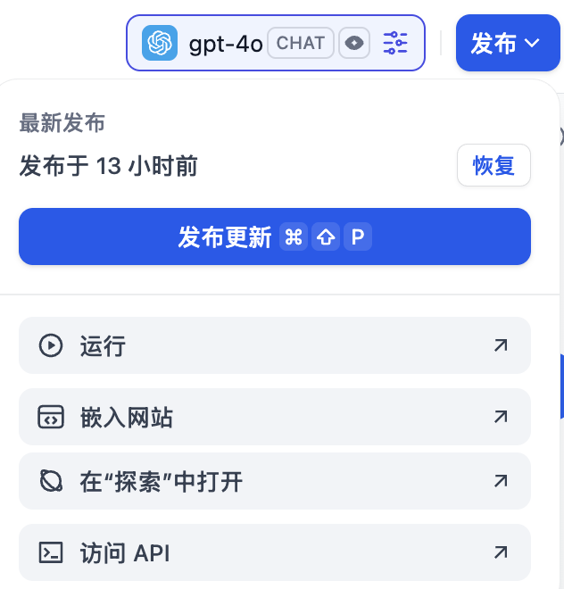
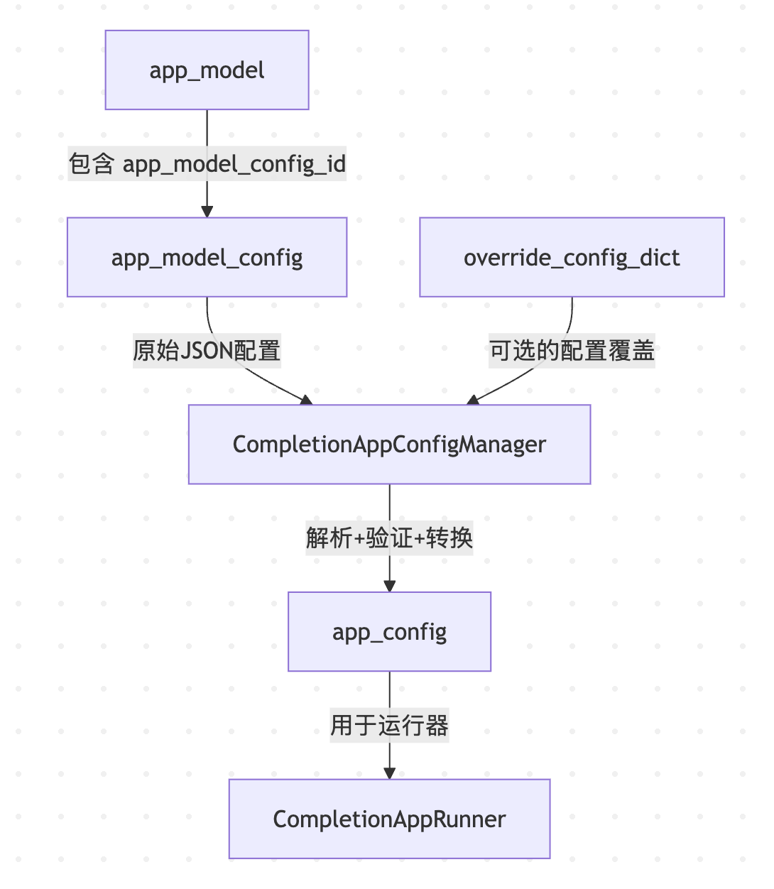

# 深入 Dify 应用的会话流程之配置管理

在节前的文章中，我们深入分析了 Dify 会话处理流程的流式处理机制，学习了限流生成器、事件流转换和响应格式化的实现原理。通过分析 `rate_limit.generate()`、`convert_to_event_stream()` 和 `compact_generate_response()` 三个核心函数，我们理解了 Dify 是如何优雅地统一处理流式和非流式响应的。

今天我们将继续深入应用生成器的内部实现，也就是下面代码中的 “步骤 3”：

```python
if app_model.mode == AppMode.COMPLETION.value:
  return rate_limit.generate(                        # 步骤1：限流生成器
    CompletionAppGenerator.convert_to_event_stream(  # 步骤2：事件流转换
      CompletionAppGenerator().generate(             # 步骤3：应用生成器
        app_model=app_model, user=user, args=args,
        invoke_from=invoke_from, streaming=streaming
      ),
    ),
    request_id=request_id,
  )
```

## Python 中的方法重载机制

首先，在 `CompletionAppGenerator` 的 `generate()` 方法中，我们可以看到一个有意思的写法：

```python
class CompletionAppGenerator(MessageBasedAppGenerator):
  
  @overload
  def generate(
    self,
    app_model: App,
    user: Union[Account, EndUser],
    args: Mapping[str, Any],
    invoke_from: InvokeFrom,
    streaming: Literal[True], # 明确指定为 True
  ) -> Generator[str | Mapping[str, Any], None, None]: ... # 返回生成器

  @overload
  def generate(
    self,
    app_model: App,
    user: Union[Account, EndUser],
    args: Mapping[str, Any],
    invoke_from: InvokeFrom,
    streaming: Literal[False], # 明确指定为 False
  ) -> Mapping[str, Any]: ... # 返回字典

  @overload
  def generate(
    self,
    app_model: App,
    user: Union[Account, EndUser],
    args: Mapping[str, Any],
    invoke_from: InvokeFrom,
    streaming: bool = False, # 通用情况
  ) -> Union[Mapping[str, Any], Generator[str | Mapping[str, Any], None, None]]: ...

  def generate(
    self,
    app_model: App,
    user: Union[Account, EndUser],
    args: Mapping[str, Any],
    invoke_from: InvokeFrom,
    streaming: bool = True,
  ) -> Union[Mapping[str, Any], Generator[str | Mapping[str, Any], None, None]]:
    # 实际的实现逻辑
    pass
```

可以看到这里定义了几种不同签名的 `generate()` 方法，并带有 `@overload` 装饰器，但是却没有真正的实现（实现部分只有 `...`），这其实是 Python 中特殊的方法重载机制。

**方法重载（Method Overloading）** 在传统的强类型语言中是原生支持的特性，然而，Python 作为动态语言，并不支持方法重载。在 Python 中，如果在同一个类中定义多个同名方法，后定义的方法会覆盖先定义的方法：

```python
class Example:
  def method(self, x: int):
    return f"Integer: {x}"

  def method(self, x: str):  # 覆盖了上面的方法
    return f"String: {x}"

example = Example()
print(example.method(42))  # 运行时错误！参数不匹配
```

为了解决这个问题，Python 3.5 引入了 `typing.overload` 装饰器，它不是真正的方法重载，而是为 **静态类型检查器** 提供类型提示的工具。`@overload` 为同一个函数提供多个类型签名，让类型检查器能够根据不同的参数类型组合推断出相应的返回类型。被 `@overload` 装饰的方法称为 **重载签名**，用于描述不同调用方式的类型信息，但这些方法本身不会被执行。最后一个不带 `@overload` 装饰器的同名方法才是真正的实现。

> Python 的 `@overload` **并不是真正的方法重载**，而是为静态类型检查器提供类型提示的工具。

通过 `@overload` 装饰器，可以提供几个好处：

1. **类型安全性**：在编译时就能检测出类型错误，避免运行时错误
2. **IDE 智能提示**：IDE 可以根据参数类型提供更精确的代码提示

在上面的例子中：

- 当 `streaming=True` 时，返回类型是 `Generator`（流式响应）
- 当 `streaming=False` 时，返回类型是 `Mapping`（非流式响应）
- 当 `streaming` 是 `bool` 类型时，返回联合类型

这样，当开发者调用 `generate()` 方法时，IDE 和类型检查器就能根据 `streaming` 参数的值自动推断出正确的返回类型，提升了代码的类型安全性和开发体验。

## 应用模型配置

我们继续看 `generate()` 的实现，首先是获取 **应用模型配置（app model config）**，这里有三种情况。第一种是无会话状态的应用，比如文本生成，直接根据 **应用模型（app model）** 获取配置：

```python
# get conversation
conversation = None

# get app model config
app_model_config = self._get_app_model_config(app_model=app_model, conversation=conversation)
```

第二种是有会话状态的应用，比如聊天助手或智能体，根据传入的会话 ID 获取配置：

```python
# get conversation
conversation = None
conversation_id = args.get("conversation_id")
if conversation_id:
  conversation = ConversationService.get_conversation(
    app_model=app_model, conversation_id=conversation_id, user=user
  )

# get app model config
app_model_config = self._get_app_model_config(app_model=app_model, conversation=conversation)
```

第三种是工作流或对话流应用，它们没有应用模型配置，因此忽略这一步。

**应用模型（app model）** 和 **应用模型配置（app model config）** 是两个不同的概念：应用模型对应数据库中的 `apps` 表，代表一个应用的基本信息和元数据，它的 ORM 模型如下：

```python
class App(Base):
  __tablename__ = "apps"
  __table_args__ = (sa.PrimaryKeyConstraint("id", name="app_pkey"), sa.Index("app_tenant_id_idx", "tenant_id"))

  # 应用ID
  id: Mapped[str] = mapped_column(StringUUID, server_default=sa.text("uuid_generate_v4()"))
  # 租户ID
  tenant_id: Mapped[str] = mapped_column(StringUUID)
  # 应用名称
  name: Mapped[str] = mapped_column(String(255))
  # 应用描述
  description: Mapped[str] = mapped_column(sa.Text, server_default=sa.text("''::character varying"))
  # 应用模式 (chat, completion, workflow, etc.)
  mode: Mapped[str] = mapped_column(String(255))
  # 图标类型 (image, emoji)
  icon_type: Mapped[Optional[str]] = mapped_column(String(255))
  # 图标
  icon = mapped_column(String(255))
  # 关联的配置ID
  app_model_config_id = mapped_column(StringUUID, nullable=True)
  # 关联的工作流ID (可选)
  workflow_id = mapped_column(StringUUID, nullable=True)
  # 应用状态
  status: Mapped[str] = mapped_column(String(255), server_default=sa.text("'normal'::character varying"))
  # 是否启用站点
  enable_site: Mapped[bool] = mapped_column(sa.Boolean)
  # 是否启用API
  enable_api: Mapped[bool] = mapped_column(sa.Boolean)
  # ... 其他基础字段  
```

而应用模型配置对应数据库中的 `app_model_configs` 表，存储应用的详细配置信息，对应的 ORM 模型如下：

```python
class AppModelConfig(Base):
  __tablename__ = "app_model_configs"
  __table_args__ = (sa.PrimaryKeyConstraint("id", name="app_model_config_pkey"), sa.Index("app_app_id_idx", "app_id"))

  # 配置ID
  id = mapped_column(StringUUID, server_default=sa.text("uuid_generate_v4()"))
  # 所属应用ID
  app_id = mapped_column(StringUUID, nullable=False)
  # 模型提供商
  provider = mapped_column(String(255), nullable=True)
  # 模型ID
  model_id = mapped_column(String(255), nullable=True)
  # 通用配置 (JSON格式)
  configs = mapped_column(sa.JSON, nullable=True)
  # 开场白 (JSON字符串)
  opening_statement = mapped_column(sa.Text)
  # 建议问题 (JSON字符串)
  suggested_questions = mapped_column(sa.Text)
  # 语音转文字 (JSON字符串)
  speech_to_text = mapped_column(sa.Text)
  # 文字转语音 (JSON字符串)
  text_to_speech = mapped_column(sa.Text)
  # 更多类似的 (JSON字符串)
  more_like_this = mapped_column(sa.Text)
  # 模型配置 (JSON字符串)
  model = mapped_column(sa.Text)
  # 用户输入表单 (JSON字符串)
  user_input_form = mapped_column(sa.Text)
  # 提示词模板
  pre_prompt = mapped_column(sa.Text)
  # 智能体模式 (JSON字符串)
  agent_mode = mapped_column(sa.Text)
  # 敏感词审查 (JSON字符串)
  sensitive_word_avoidance = mapped_column(sa.Text)
  # 引用和归属 (JSON字符串)
  retriever_resource = mapped_column(sa.Text)
  # 知识库配置 (JSON字符串)
  dataset_configs = mapped_column(sa.Text)
  # 文件上传配置 (JSON字符串)
  file_upload = mapped_column(sa.Text)
  # ... 其他基础字段
```

可以看到，应用模型配置里的大多数字段都是 JSON 字符串，因此 `AppModelConfig` 还提供了一些便捷的属性访问器（通过 `@property` 装饰器实现），将 JSON 字符串转换为 Python 对象：

```python
@property
def model_dict(self) -> dict:
  """模型配置字典"""
  return json.loads(self.model) if self.model else {}

@property
def suggested_questions_list(self) -> list:
  """建议问题列表"""
  return json.loads(self.suggested_questions) if self.suggested_questions else []

@property
def file_upload_dict(self) -> dict:
  """文件上传配置字典"""
  return json.loads(self.file_upload) if self.file_upload else {
    "image": {
      "enabled": False,
      "number_limits": DEFAULT_FILE_NUMBER_LIMITS,
      "detail": "high",
      "transfer_methods": ["remote_url", "local_file"],
    }
  }

@property
def dataset_configs_dict(self) -> dict:
  """知识库配置字典"""
  if self.dataset_configs:
    dataset_configs = json.loads(self.dataset_configs)
    if "retrieval_model" not in dataset_configs:
      return {"retrieval_model": "single"}
    return dataset_configs
  return {"retrieval_model": "multiple"}
```

应用配置可能会被反复修改，因此一个应用可能会有多个版本的配置，每当点击 “发布更新” 时就会生成一条配置记录：



要特别注意的是，当用户第一次创建会话时，会话和应用配置关联，该会话的后续聊天内容都将以该配置为准，如果此时修改应用配置，可能会不生效，必须创建一个新会话。

## SQLAlchemy 介绍

我们再继续看 `_get_app_model_config()` 方法的实现：

```python
def _get_app_model_config(self, app_model: App, conversation: Optional[Conversation] = None) -> AppModelConfig:
  # 获取应用模型配置
  # 支持两种获取方式：会话配置或应用默认配置
  if conversation:
    # 1. 从特定会话获取配置
    stmt = select(AppModelConfig).where(
      AppModelConfig.id == conversation.app_model_config_id,
      AppModelConfig.app_id == app_model.id
    )
    app_model_config = db.session.scalar(stmt)
  else:
    # 2. 从应用默认配置获取（属性访问器）
    app_model_config = app_model.app_model_config

  return app_model_config
```

这里使用了 [SQLAlchemy](https://www.sqlalchemy.org/) 访问数据库。

SQLAlchemy 是 Python 中最流行的 ORM（对象关系映射）工具之一，它提供了一套高层 API 用于操作关系型数据库，同时也支持底层的 SQL 表达式操作。它的核心优势在于将 Python 对象与数据库表结构进行映射，让开发者可以用面向对象的方式操作数据库，而不必直接编写复杂的 SQL 语句。它的主要特点有：

1. **ORM 功能**：允许开发者定义 Python 类作为数据库表的映射，通过操作类实例来实现对数据库的增删改查
2. **SQL 表达式语言**：提供了一种灵活的方式构建 SQL 语句，既保留了 SQL 的表达能力，又具备 Python 代码的可读性和可维护性
3. **支持多种数据库**：兼容 PostgreSQL、MySQL、SQLite、Oracle、Microsoft SQL Server 等主流数据库，且操作接口统一
4. **事务支持**：内置事务管理机制，确保数据库操作的原子性、一致性、隔离性和持久性（ACID）
5. **连接池管理**：自动管理数据库连接池，优化数据库连接的创建和释放，提升性能

以下是一个使用 SQLAlchemy ORM 操作 SQLite 数据库的简单示例：

```python
from sqlalchemy import create_engine, select, Column, Integer, String
from sqlalchemy.ext.declarative import declarative_base
from sqlalchemy.orm import sessionmaker

# 创建基类
Base = declarative_base()

# 定义数据模型（映射到数据库表）
class User(Base):
  __tablename__ = 'users'  # 表名
  
  id = Column(Integer, primary_key=True)
  name = Column(String(50), nullable=False)
  age = Column(Integer)

# 创建数据库引擎（SQLite 数据库）
engine = create_engine('sqlite:///example.db')

# 创建所有表（根据定义的模型）
Base.metadata.create_all(engine)

# 创建会话工厂
Session = sessionmaker(bind=engine)
session = Session()

# 添加数据
new_user = User(name='Alice', age=30)
session.add(new_user)
new_user = User(name='Bob', age=31)
session.add(new_user)
session.commit()

# 查询数据（1.x 语法）
users = session.query(User).all()
for user in users:
  print(f"ID: {user.id}, Name: {user.name}, Age: {user.age}")

# 查询数据（2.0 语法）
stmt = select(User).where(
  User.name == "Alice",
)
user = session.scalar(stmt)
print(f"ID: {user.id}, Name: {user.name}, Age: {user.age}")

# 关闭会话
session.close()
```

这段代码非常简单，主要是了解下 SQLAlchemy 的几个核心概念：

- **Engine**：数据库连接的核心，负责管理数据库连接池和执行 SQL 语句
- **Session**：用于操作数据库的会话对象，类似数据库事务的上下文
- **Declarative Base**：所有 ORM 模型类的基类，通过继承它可以定义数据库表结构
- **MetaData**：用于描述数据库 schema（表、列、约束等）的元数据容器

SQLAlchemy 平衡了高层 ORM 的便捷性和底层 SQL 的灵活性，是 Python 后端开发中处理数据库的重要工具，广泛应用于 Flask、Django 等 Web 框架中。

### 查询语法

SQLAlchemy 2.0 引入了全新的现代查询语法，更加直观且符合 Python 风格。这种新语法将核心查询操作统一到了 `select()` 等函数中，并提供了更流畅的链式调用体验。

在 Dify 中使用了 SQLAlchemy 2.0 查询语法：

```python
stmt = select(AppModelConfig).where(
  AppModelConfig.id == config_id,
  AppModelConfig.app_id == app_id
)
app_model_config = db.session.scalar(stmt)
```

不过也有不少地方使用的是 1.x 传统语法，比如根据应用获取默认配置：

```python
@property
def app_model_config(self):
  if self.app_model_config_id:
    return db.session.query(AppModelConfig).where(
      AppModelConfig.id == self.app_model_config_id
    ).first()
  return None
```

SQLAlchemy 2.0 的现代查询语法更加直观，将所有查询操作都统一到了函数式的 API 中，避免了旧版本中 `Query` 对象与核心表达式之间的不一致性。这种新语法也更好地支持类型提示，提高了代码的可维护性和开发效率。大家在阅读源码时注意区分。

### `ext_database` 扩展模块

Dify 通过 `ext_database` 扩展模块（位于 `extensions/ext_database.py` 文件）管理数据库连接：

```python
def init_app(app: DifyApp):
  db.init_app(app)                # 初始化 Flask-SQLAlchemy
  _setup_gevent_compatibility()   # 设置 Gevent 兼容性
```

其中 `db` 是 [Flask-SQLAlchemy](https://flask-sqlalchemy.readthedocs.io/en/stable/) 实例：

```python
from flask_sqlalchemy import SQLAlchemy
from sqlalchemy import MetaData

# PostgreSQL 索引命名约定
POSTGRES_INDEXES_NAMING_CONVENTION = {
  "ix": "%(column_0_label)s_idx",                    # 普通索引
  "uq": "%(table_name)s_%(column_0_name)s_key",      # 唯一约束
  "ck": "%(table_name)s_%(constraint_name)s_check",  # 检查约束
  "fk": "%(table_name)s_%(column_0_name)s_fkey",     # 外键约束
  "pk": "%(table_name)s_pkey",                       # 主键约束
}

metadata = MetaData(naming_convention=POSTGRES_INDEXES_NAMING_CONVENTION)
db = SQLAlchemy(metadata=metadata)
```

而 `db.init_app()` 则是用于初始化 [Flask-SQLAlchemy](https://flask-sqlalchemy.readthedocs.io/en/stable/) 扩展，它有两个重要的配置参数：

```python
@computed_field  # type: ignore[misc]
@property
def SQLALCHEMY_DATABASE_URI(self) -> str:
  db_extras = (
    f"{self.DB_EXTRAS}&client_encoding={self.DB_CHARSET}" if self.DB_CHARSET else self.DB_EXTRAS
  ).strip("&")
  db_extras = f"?{db_extras}" if db_extras else ""
  return (
    f"{self.SQLALCHEMY_DATABASE_URI_SCHEME}://"
    f"{quote_plus(self.DB_USERNAME)}:{quote_plus(self.DB_PASSWORD)}@{self.DB_HOST}:{self.DB_PORT}/{self.DB_DATABASE}"
    f"{db_extras}"
  )

@computed_field  # type: ignore[misc]
@property
def SQLALCHEMY_ENGINE_OPTIONS(self) -> dict[str, Any]:
  # Parse DB_EXTRAS for 'options'
  db_extras_dict = dict(parse_qsl(self.DB_EXTRAS))
  options = db_extras_dict.get("options", "")
  # Always include timezone
  timezone_opt = "-c timezone=UTC"
  if options:
    # Merge user options and timezone
    merged_options = f"{options} {timezone_opt}"
  else:
    merged_options = timezone_opt

  connect_args = {"options": merged_options}

  return {
    "pool_size": self.SQLALCHEMY_POOL_SIZE,
    "max_overflow": self.SQLALCHEMY_MAX_OVERFLOW,
    "pool_recycle": self.SQLALCHEMY_POOL_RECYCLE,
    "pool_pre_ping": self.SQLALCHEMY_POOL_PRE_PING,
    "connect_args": connect_args,
    "pool_use_lifo": self.SQLALCHEMY_POOL_USE_LIFO,
    "pool_reset_on_return": None,
  }
```

分别是数据库连接和连接池配置，可以根据需要，在 `.env` 文件中通过环境变量来修改默认值。

## 覆盖模型配置

获取应用模型配置之后，紧接着处理调试模式下的配置覆盖：

```python
# 覆盖模型配置（仅在调试模式下允许）
override_model_config_dict = None
if args.get("model_config"):
  if invoke_from != InvokeFrom.DEBUGGER:
    raise ValueError("Only in App debug mode can override model config")

  # 验证配置的有效性，设置默认值
  override_model_config_dict = CompletionAppConfigManager.config_validate(
    tenant_id=app_model.tenant_id, config=args.get("model_config", {})
  )
```

在正常情况下，会话接口的入参类似下面这样：

```json
{
  "response_mode": "streaming",
  "conversation_id": "773bc365-5faa-4716-b11d-6e77fffd2639",
  "files": [],
  "query": "<用户问题>",
  "inputs": {},
  "parent_message_id": "9841bc16-0a8a-4fad-812d-ee5703cde868"
}
```

但是在调试模式，会多一个 `model_config` 参数：

```json
{
  "response_mode": "streaming",
  "conversation_id": "773bc365-5faa-4716-b11d-6e77fffd2639",
  "files": [],
  "query": "<用户问题>",
  "inputs": {},
  "parent_message_id": "9841bc16-0a8a-4fad-812d-ee5703cde868",
  "model_config": {
    // 和 AppModelConfig 基本一致
  }
}
```

## 组装应用配置

最后，将应用模型、应用模型配置和覆盖模型配置转换为统一的 **应用配置（app config）** 对象：

```python
app_config = CompletionAppConfigManager.get_app_config(
  app_model=app_model,
  app_model_config=app_model_config,
  override_config_dict=override_model_config_dict
)
```

各个应用类型都有自己的配置类。所有简单 UI 的应用配置都继承自 `EasyUIBasedAppConfig`：

```python
# 文本生成应用配置  
class CompletionAppConfig(EasyUIBasedAppConfig):
  pass

# 聊天助手配置
class ChatAppConfig(EasyUIBasedAppConfig):
  pass

# 智能体配置
class AgentChatAppConfig(EasyUIBasedAppConfig):
  agent: Optional[AgentEntity] = None
```

而工作流和对话流的应用配置则是继承自 `WorkflowUIBasedAppConfig`：

```python
# 工作流配置
class WorkflowAppConfig(WorkflowUIBasedAppConfig):
  pass

# 对话流配置
class AdvancedChatAppConfig(WorkflowUIBasedAppConfig):
  pass
```

**应用配置（AppConfig）** 是经过解析和验证后的配置实体对象，为应用运行时提供类型安全的配置访问。Dify 为每种应用定义了各自的 **运行器（AppRunner）**，应用配置组装完成后，就传给运行器开始执行。大致流程如下：



## 小结

今天，我们详细分析了 Dify 应用生成器的配置管理机制，从应用模型（app model）到应用模型配置（app model config），到覆盖模型配置（override model config），到最后统一的应用配置对象组装（app config）。在阅读代码的同时，我们穿插学习了 Python 中的方法重载机制，SQLAlchemy 的基本使用和查询语法相关的知识，以及基于 Flask-SQLAlchemy 的 `ext_database` 扩展模块。通过本文的学习，相信大家对 Dify 中配置相关的概念和实现原理都有了基本的了解。
