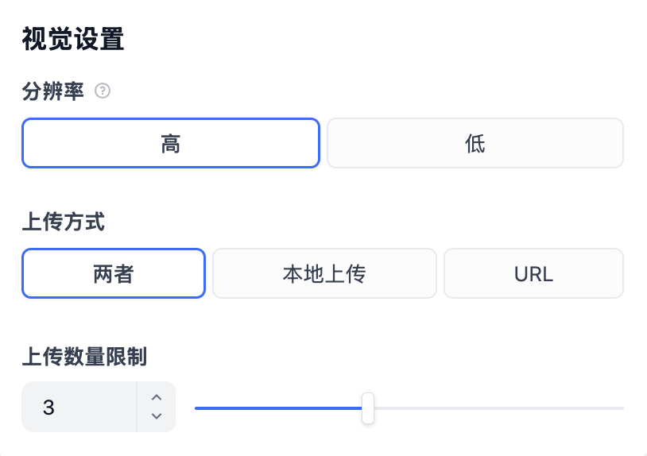
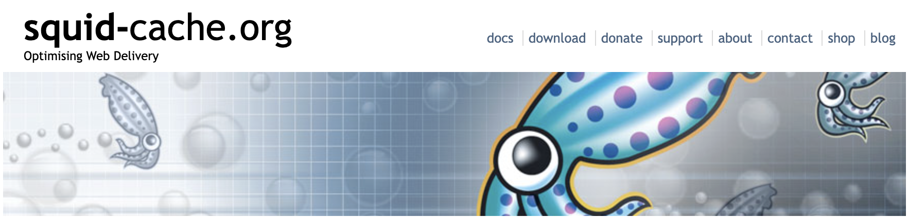

# 深入 Dify 应用的会话流程之文件上传

我们之前曾学习过，当模型具备处理图片、文档、音视频的能力时（比如 Gemini 2.5 Pro），在应用的配置页面会多出三个配置开关：


在 “视觉” 右侧有一个设置按钮，还可以进行更细致的配置：



> 这个设置按钮虽然在 “视觉” 右侧，但是 “上传方式” 和 “上传数量限制” 对所有类型的文件都是生效的。

开启之后，我们就可以在对话时上传文件：


今天我们将继续深入 Dify 应用生成器的内部实现，聚焦于文件上传部分，看看 Dify 是如何处理这几种不同类型的文件，以及 Dify 如何通过 SSRF 防护机制保障文件处理的安全性。

## 文件上传配置

我们昨天已经学习了 **应用模型配置** 和 **覆盖模型配置** 的概念，它存储着应用的详细配置信息，其中就包括文件上传相关的配置：

```json
{
  "image": {
    "detail": "high",
    "enabled": true,
    "number_limits": 3,
    "transfer_methods": [
      "remote_url",
      "local_file"
    ]
  },
  "enabled": true,
  "allowed_file_types": [
    "image"
  ],
  "allowed_file_extensions": [
    ".JPG", ".JPEG", ".PNG", ".GIF", ".WEBP", ".SVG", ".MP4", ".MOV", ".MPEG", ".WEBM"
  ],
  "allowed_file_upload_methods": [
    "remote_url",
    "local_file"
  ],
  "number_limits": 3,
  "fileUploadConfig": {
    "file_size_limit": 15,
    "batch_count_limit": 5,
    "image_file_size_limit": 10,
    "video_file_size_limit": 100,
    "audio_file_size_limit": 50,
    "workflow_file_upload_limit": 10
  }
}
```

这里的几个参数解释如下：

- `enabled` 是否开启文件上传，当开启视觉、文档、音频三个开关中的任意一个时，该值即为 `true`
- `allowed_file_types` 允许的文件类型，支持 image、document、audio 和 video 四种类型
- `allowed_file_extensions` 允许的文件后缀，这个配置貌似没什么用，以 `allowed_file_types` 为准
- `allowed_file_upload_methods` 允许的文件上传方式，支持 **本地上传** 和 **通过 URL 上传**，默认两者都支持，对话框中上传文件的样式会根据这个参数而改变
- `number_limits` 允许最多上传多少个文件
- `image.detail` 图片分辨率设置，仅针对图片生效；**低分辨率模式** 将使模型接收图像的低分辨率版本，适用于对图片细节要求不高的场景，比如图片分类或简单的图片理解任务；**高分辨率模式** 处理速度慢，并消耗更多的处理资源，适用于需要分析图片细节的场景，比如 OCR、识别图片中的文字或复杂内容等

其中 `fileUploadConfig` 中的参数限制了前端上传各种类型文件的大小和数量，可以在 `.env` 文件中调整：

```python
# Upload configuration
UPLOAD_FILE_SIZE_LIMIT=15
UPLOAD_FILE_BATCH_LIMIT=5
UPLOAD_IMAGE_FILE_SIZE_LIMIT=10
UPLOAD_VIDEO_FILE_SIZE_LIMIT=100
UPLOAD_AUDIO_FILE_SIZE_LIMIT=50

# Workflow file upload limit
WORKFLOW_FILE_UPLOAD_LIMIT=10
```

我们继续来看看 `CompletionAppGenerator` 的 `generate()` 方法，昨天从数据库中获取应用配置之后，接下来就是从应用配置中提取 **文件上传配置**：

```python
file_extra_config = FileUploadConfigManager.convert(
  override_model_config_dict or app_model_config.to_dict()
)
```

经过 `convert()` 方法后，得到 `FileUploadConfig` 对象：

```python
class FileUploadConfig(BaseModel):
  image_config: Optional[ImageConfig] = None
  allowed_file_types: Sequence[FileType] = Field(default_factory=list)
  allowed_file_extensions: Sequence[str] = Field(default_factory=list)
  allowed_file_upload_methods: Sequence[FileTransferMethod] = Field(default_factory=list)
  number_limits: int = 0
```

## 文件工厂

当用户对话时传入了文件，在会话接口的入参中会多一个 `files` 参数，它是一个数组，格式如下：

```json
[
  {
    "type": "image",
    "transfer_method": "local_file",
    "url": "",
    "upload_file_id": "d9341dfc-ceab-4041-9faf-a1a28579c589"
  },
  {
    "type": "image",
    "transfer_method": "remote_url",
    "url": "http://localhost:5001/files/90a2c3ad-d0c9-4d48-a7f9-b40e1dada22e/file-preview...",
    "upload_file_id": "90a2c3ad-d0c9-4d48-a7f9-b40e1dada22e"
  }
]
```

接下来的代码逻辑是，根据文件上传配置，将传入的文件转换为统一的 `File` 对象。这一步通过文件工厂的 `build_from_mappings()` 方法构建：

```python
if file_extra_config:
  files = args["files"] if args.get("files") else []
  file_objs = file_factory.build_from_mappings(
    mappings=files,
    tenant_id=app_model.tenant_id,
    config=file_extra_config,
  )
else:
  file_objs = []
```

文件工厂通过一个简洁的分发机制来处理不同类型的文件：

```python
def build_from_mapping(
  *,
  mapping: Mapping[str, Any],
  tenant_id: str,
  config: FileUploadConfig | None = None,
  strict_type_validation: bool = False,
) -> File:
  
  # 根据传输方式分发到不同的构建函数
  build_functions: dict[FileTransferMethod, Callable] = {
    FileTransferMethod.LOCAL_FILE: _build_from_local_file,
    FileTransferMethod.REMOTE_URL: _build_from_remote_url,
    FileTransferMethod.TOOL_FILE: _build_from_tool_file,
  }

  # 根据 transfer_method 找到对应的构建方法
  transfer_method = FileTransferMethod.value_of(mapping.get("transfer_method"))
  build_func = build_functions.get(transfer_method)

  # 构建文件对象
  file: File = build_func(
    mapping=mapping,
    tenant_id=tenant_id,
    transfer_method=transfer_method,
    strict_type_validation=strict_type_validation,
  )
  return file
```

可以看到不同的文件传输方式有不同的构建方法，Dify 支持三种文件传输方式：

1. **LOCAL_FILE** - 本地文件
2. **REMOTE_URL** - 远程文件
3. **TOOL_FILE** - 工具文件

前两种我们在文章开篇已经见过了，在 Dify 的对话框中，支持两种文件上传方式：**本地上传** 和 **通过 URL 上传**，他们都会获取并检查文件名，验证文件大小和类型，并生成一个唯一的文件键，保存到配置的存储后端（本地或云存储），同时还会创建一条数据库记录，保存到 `upload_files` 表中。

另外，Dify 中还支持通过工具生成文件，比如我们之前使用的文本转语音工具，它会生成一个音频文件，这个文件就是 **工具文件**，它同样保存在配置的存储后端，对应数据库中的 `tool_files` 表。

## 文件存储后端

Dify 支持本地存储、S3、阿里云 OSS、Azure Blob 等多种存储后端：

- **opendal** （默认，推荐）
- **s3** （Amazon S3 或兼容 S3 的服务）
- **aliyun-oss** （阿里云对象存储）
- **azure-blob** （Azure Blob 存储）
- **google-storage** （Google Cloud Storage）
- **tencent-cos** （腾讯云对象存储）
- **huawei-obs** （华为云对象存储）
- **baidu-obs** （百度对象存储）
- **oci-storage** （Oracle Cloud Infrastructure）
- **volcengine-tos** （火山引擎对象存储）
- **supabase** （Supabase 存储）
- **clickzetta-volume** （ClickZetta 卷存储）
- **local** （本地存储，已弃用）

默认使用的是 `opendal` 本地存储，存储路径位于 `./api/storage`，文件上传后，完整的路径结构为：

```
./api/storage/upload_files/{tenant_id}/{uuid}.{extension}
```

工具生成的文件存储路径为：

```
./api/storage/tools/{tenant_id}/{uuid}.{extension}
```

Dify 的文件存储按租户隔离，确保租户的文件安全，并通过 SHA3-256 哈希值支持文件去重检测。

> [Apache OpenDAL（Open Data Access Layer）](https://github.com/apache/opendal) 是一个开源的数据访问层项目。它允许用户通过统一的 API 简单且高效地访问不同存储服务上的数据，其核心愿景是 **One Layer, All Storage（一层接口，所有存储）**。

如果要切换到不同的存储后端，可以在 `.env` 文件中设置 `STORAGE_TYPE` 和相应的配置参数，比如切换到 Amazon S3：

```python
# 基础配置
STORAGE_TYPE=s3

# S3 配置参数
S3_USE_AWS_MANAGED_IAM=false
S3_ENDPOINT=https://s3.amazonaws.com  # 或其他 S3 兼容服务
S3_BUCKET_NAME=your-bucket-name
S3_ACCESS_KEY=your-access-key
S3_SECRET_KEY=your-secret-key
S3_REGION=us-east-1
S3_ADDRESS_STYLE=auto  # auto, virtual, or path
```

## 构建本地文件

本地文件是用户通过 Dify 的文件上传界面上传到服务器存储的文件。这些文件会先存储在 Dify 的文件系统中（如本地磁盘、S3 等），并在数据库中记录相关元信息。接下来，我们看看本地文件的构建过程：

```python
def _build_from_local_file(
  *,
  mapping: Mapping[str, Any],
  tenant_id: str,
  transfer_method: FileTransferMethod,
  strict_type_validation: bool = False,
) -> File:
  upload_file_id = mapping.get("upload_file_id")

  # 从数据库查询文件信息
  stmt = select(UploadFile).where(
    UploadFile.id == upload_file_id,
    UploadFile.tenant_id == tenant_id,
  )
  row = db.session.scalar(stmt)

  # 根据文件扩展和 MIME 类型获取文件类型
  # 文件类型可以是 IMAGE、DOCUMENT、AUDIO、VIDEO、CUSTOM
  file_type = _standardize_file_type(
    extension="." + row.extension,
    mime_type=row.mime_type
  )

  # 构建 File 对象
  return File(
    id=mapping.get("id"),
    filename=row.name,
    extension="." + row.extension,
    mime_type=row.mime_type,
    tenant_id=tenant_id,
    type=file_type,
    transfer_method=transfer_method,
    remote_url=row.source_url,
    related_id=mapping.get("upload_file_id"),
    size=row.size,
    storage_key=row.key,  # 存储系统中的键值
  )
```

本地文件的处理流程相对简单，主要包括：

1. **查询文件记录**：根据 `upload_file_id` 从数据库中查询文件的基本信息，包含文件名、文件大小、扩展名、MIME 类型以及存储系统中的键值等，这些信息是在文件上传时保存到数据库中的 
2. **类型检测**：根据文件扩展名和 MIME 类型自动检测文件类型，文件类型是 IMAGE、DOCUMENT、AUDIO、VIDEO、CUSTOM 之一
3. **构建 File 对象**：将获取到的文件信息构建成统一的 `File` 对象，供后续使用

## 构建远程文件

远程文件是通过 URL 引用的外部文件，比如用户提供的图片链接、文档链接等。Dify 针对远程文件有两种处理方式，第一种是通过远程文件上传接口，根据 URL 从远程下载文件到存储系统，此时和本地文件的处理逻辑几乎一样；第二种是直接在会话接口中传入 URL 地址，这种方式不需要将文件上传到 Dify 服务器，而是在需要时动态获取。

```python
def _build_from_remote_url(
  *,
  mapping: Mapping[str, Any],
  tenant_id: str,
  transfer_method: FileTransferMethod,
  strict_type_validation: bool = False,
) -> File:

  # 检查是否有关联的上传文件记录
  upload_file_id = mapping.get("upload_file_id")
  if upload_file_id:
    # 已缓存的远程文件，和本地文件一样处理...

  # 处理纯远程 URL
  url = mapping.get("url") or mapping.get("remote_url")

  # 获取远程文件信息
  mime_type, filename, file_size = _get_remote_file_info(url)
  extension = mimetypes.guess_extension(mime_type) or (
    "." + filename.split(".")[-1] if "." in filename else ".bin"
  )

  # 根据文件扩展和 MIME 类型获取文件类型
  file_type = _standardize_file_type(
    extension=extension, 
    mime_type=mime_type
  )

  # 构建 File 对象
  return File(
    id=mapping.get("id"),
    filename=filename,
    tenant_id=tenant_id,
    type=file_type,
    transfer_method=transfer_method,
    remote_url=url,
    mime_type=mime_type,
    extension=extension,
    size=file_size,
    storage_key="",  # 远程文件没有本地存储键
  )
```

远程文件的关键在于 `_get_remote_file_info()` 函数，它负责获取远程文件的元信息，包括 MIME 类型、文件名、文件大小：

```python
def _get_remote_file_info(url: str):
  
  # 解析 URL 获取路径部分
  parsed_url = urllib.parse.urlparse(url)
  url_path = parsed_url.path

  # 从路径中提取文件名
  filename = os.path.basename(url_path)

  # 从文件名推测 MIME 类型
  mime_type, _ = mimetypes.guess_type(filename)

  # 初始化文件大小
  file_size = -1

  # 发送 HEAD 请求获取文件信息（注意这里使用了 ssrf_proxy）
  resp = ssrf_proxy.head(url, follow_redirects=True)
  if resp.status_code == httpx.codes.OK:
    # 从 Content-Disposition 头获取真实文件名
    if content_disposition := resp.headers.get("Content-Disposition"):
      filename = str(content_disposition.split("filename=")[-1].strip('"'))
      mime_type, _ = mimetypes.guess_type(filename)

    # 从 Content-Length 头获取文件大小
    file_size = int(resp.headers.get("Content-Length", file_size))

    # 从 Content-Type 头获取 MIME 类型
    if not mime_type:
      mime_type = resp.headers.get("Content-Type", "").split(";")[0].strip()

  return mime_type, filename, file_size
```

它的核心流程是，先通过 URL 解析，提取出初始文件名，基于文件名推测出 MIME 类型，接着再向远程 URL 发送 HEAD 请求，获取 HTTP 响应头，从响应头中获取准确的文件元信息:

* 从 `Content-Disposition` 头获取真实文件名
* 从 `Content-Length` 头获取文件大小
* 从 `Content-Type` 头获取 MIME 类型

这里 Dify 使用的两个技巧值得我们学习：

1. Dify 使用 `HEAD` 请求而非 `GET`，只获取元数据不下载文件内容，可以提高效率
2. Dify 使用 `ssrf_proxy` 而不是直接的 HTTP 请求，防止 SSRF 攻击，这是一个很重要的安全考虑，我们稍后会详细讨论这个安全机制

## 构建工具文件

工具文件是智能体或工具在执行过程中生成的临时文件，比如代码解释器生成的图表、文件处理工具创建的文档等。

```python
def _build_from_tool_file(
  *,
  mapping: Mapping[str, Any],
  tenant_id: str,
  transfer_method: FileTransferMethod,
  strict_type_validation: bool = False,
) -> File:

  # 从数据库获取工具文件信息
  tool_file = db.session.scalar(
    select(ToolFile).where(
      ToolFile.id == mapping.get("tool_file_id"),
      ToolFile.tenant_id == tenant_id,
    )
  )

  # 根据文件扩展和 MIME 类型获取文件类型
  # 构建 File 对象
```

工具文件的构建过程和本地文件差不多，唯一的区别在于它存储在数据库的 `tool_files` 表中。

## SSRF 防护机制

在远程文件处理中，我们注意到 Dify 使用了 `ssrf_proxy.head()` 而不是直接的 HTTP 请求。这涉及到一个重要的安全概念 —— **SSRF（Server-Side Request Forgery，服务器端请求伪造）**。

### 什么是 SSRF

**SSRF 是一种安全漏洞**，攻击者可以诱使服务器代表他们向任意目标发起 HTTP 请求。这种攻击通常发生在 Web 应用需要获取用户提供的 URL 资源时，比如：

- 图片预览功能
- 网页截图服务
- 文件下载功能
- Webhook 回调

如果 Web 应用直接使用用户提供的 URL 而没有进行适当的验证和过滤，就可能遭受 SSRF 攻击。攻击者可以利用 SSRF 漏洞：

1. **扫描内网**：通过服务器访问内网地址（如 `127.0.0.1`、`192.168.x.x`）来探测内网服务
2. **绕过防火墙**：利用服务器的网络位置访问被防火墙保护的资源
3. **访问云元数据**：在云环境中访问实例元数据服务（如 AWS EC2 的 `169.254.169.254`）
4. **端口扫描**：探测服务器可访问的其他服务端口

例如，攻击者可能提供这样的恶意 URL：

- `http://127.0.0.1:6379/` - 访问本地 Redis
- `http://169.254.169.254/latest/meta-data/` - 访问 AWS 元数据服务
- `file:///etc/passwd` - 读取本地文件

关于 SSRF 相关知识，推荐阅读这篇文章：

* https://portswigger.net/web-security/ssrf

### Dify 的 SSRF 防护策略

在之前的入门篇中，细心的读者可能已经注意到，在 `docker-compose.yaml` 文件中，一些服务配置了 `SSRF_PROXY` 和 `HTTP_PROXY` 环境变量，全部指向一个 `ssrf_proxy` 容器：

```yaml
ssrf_proxy:
  image: ubuntu/squid:latest
  restart: always
  volumes:
    - ./ssrf_proxy/squid.conf.template:/etc/squid/squid.conf.template
    - ./ssrf_proxy/docker-entrypoint.sh:/docker-entrypoint-mount.sh
  entrypoint:
    [ "sh", "-c", "docker-entrypoint.sh" ]
 environment:
   HTTP_PORT: ${SSRF_HTTP_PORT:-3128}
 networks:
   - ssrf_proxy_network
   - default
```

为避免不必要的风险，Dify 为所有可能引发 SSRF 攻击的服务配置了代理，并强制像 Sandbox 这样的沙盒服务只能通过代理访问外部网络，以确保数据和服务安全。在生产环境中，Dify 推荐使用 [Squid](https://www.squid-cache.org/) 作为 SSRF 防护的代理服务器。



默认情况下，该代理不会拦截任何本地请求，但我们可以通过修改其配置文件自定义代理行为。它的配置文件如下：

```
# 网络范围定义
# - 定义各种私有网络和本地网络范围，包括 RFC 1918 私有网络（10.x.x.x, 172.16-31.x.x, 192.168.x.x）
# - 包含 IPv6 本地网络范围和链路本地地址
acl localnet src 0.0.0.1-0.255.255.255	# RFC 1122 "this" network (LAN)
acl localnet src 10.0.0.0/8		# RFC 1918 local private network (LAN)
acl localnet src 100.64.0.0/10		# RFC 6598 shared address space (CGN)
acl localnet src 169.254.0.0/16 	# RFC 3927 link-local (directly plugged) machines
acl localnet src 172.16.0.0/12		# RFC 1918 local private network (LAN)
acl localnet src 192.168.0.0/16		# RFC 1918 local private network (LAN)
acl localnet src fc00::/7       	# RFC 4193 local private network range
acl localnet src fe80::/10      	# RFC 4291 link-local (directly plugged) machines

# 端口访问控制
# - SSL_ports：允许的 SSL 端口（443）
# - Safe_ports：允许的安全端口（HTTP 80, HTTPS 443, FTP 21 等标准端口）
acl SSL_ports port 443
# acl SSL_ports port 1025-65535   # Enable the configuration to resolve this issue: https://github.com/langgenius/dify/issues/12792
acl Safe_ports port 80		# http
acl Safe_ports port 21		# ftp
acl Safe_ports port 443		# https
acl Safe_ports port 70		# gopher
acl Safe_ports port 210		# wais
acl Safe_ports port 1025-65535	# unregistered ports
acl Safe_ports port 280		# http-mgmt
acl Safe_ports port 488		# gss-http
acl Safe_ports port 591		# filemaker
acl Safe_ports port 777		# multiling http

# 方法和域名控制
# - CONNECT：CONNECT 方法控制
# - allowed_domains：只允许访问 .marketplace.dify.ai 域名
acl CONNECT method CONNECT
acl allowed_domains dstdomain .marketplace.dify.ai

# HTTP 访问规则，按优先级顺序：
# 1. 允许访问指定域名：允许访问 marketplace.dify.ai
# 2. 拒绝不安全端口：拒绝访问非安全端口
# 3. 限制 CONNECT 方法：只允许对 SSL 端口使用 CONNECT
# 4. 管理访问控制：只允许 localhost 进行管理
# 5. 拒绝所有其他访问：默认拒绝策略
http_access allow allowed_domains
http_access deny !Safe_ports
http_access deny CONNECT !SSL_ports
http_access allow localhost manager
http_access deny manager
http_access allow localhost
include /etc/squid/conf.d/*.conf
http_access deny all

# 为沙箱提供反向代理
http_port ${REVERSE_PROXY_PORT} accel vhost
cache_peer ${SANDBOX_HOST} parent ${SANDBOX_PORT} 0 no-query originserver
acl src_all src all
http_access allow src_all
```

通过 Squid 的访问控制列表（ACL），Dify 实现了有效的网络隔离和访问控制，大大降低了 SSRF 攻击的风险。这是一个值得学习和借鉴的安全最佳实践！

## 小结

我们今天学习了 Dify 对上传文件的处理过程，主要内容总结如下：

- 支持 OpenDAL、S3、阿里云 OSS 等多样化的存储后端，默认按租户隔离文件，保障数据安全性；
- 采用工厂模式统一文件处理逻辑，支持 `LOCAL_FILE`、`REMOTE_URL`、`TOOL_FILE` 三种不同的文件传输方式，统一转换为 `File` 对象；
- 对于远程文件，Dify 引入 Squid 代理，通过 ACL 规则禁止访问内网地址与非安全端口，防范远程文件带来的 SSRF 风险；

在下一篇文章中，我们将继续深入会话流程的源码，探讨 Dify 是如何通过集成外部 Ops 工具，实现全面的追踪和深度评估能力。
