# 深入 Dify 应用的会话流程之追踪调试

在前面的几篇文章中，我们深入分析了 Dify 应用生成器的源码，包括限流策略、流式响应、配置管理以及上传文件的处理，今天我们将继续深入 `CompletionAppGenerator` 的 `generate()` 方法，学习另一个重要的组件 —— **追踪管理器（Trace Manager）**，通过它引出 LLMOps 的概念，并以 LangFuse 为例演示其使用方式，最后再详细讲解它的实现机制。

## 创建追踪管理器

让我们继续深入 `generate()` 方法的后续实现，在组装完成应用配置后，接下来就是创建追踪管理器：

```python
trace_manager = TraceQueueManager(
  app_id=app_model.id,
  user_id=user.id if isinstance(user, Account) else user.session_id
)
```

这个 `trace_manager` 将贯穿整个会话流程，负责收集和记录各种运行时数据，为后续的分析和调试提供数据基础。接下来，将 `trace_manager` 注入到应用生成实体中：

```python
application_generate_entity = CompletionAppGenerateEntity(
  task_id=str(uuid.uuid4()),
  app_config=app_config,
  model_conf=ModelConfigConverter.convert(app_config),
  file_upload_config=file_extra_config,
  inputs=self._prepare_user_inputs(
    user_inputs=inputs, variables=app_config.variables, tenant_id=app_model.tenant_id
  ),
  query=query,
  files=list(file_objs),
  user_id=user.id,
  stream=streaming,
  invoke_from=invoke_from,
  extras={},
  trace_manager=trace_manager,  # 将 trace_manager 注入到实体中
)
```

应用生成实体 `CompletionAppGenerateEntity` 是一个携带所有生成所需信息的数据载体，其中就包含了 `trace_manager`，这样在整个应用执行过程中，各个模块都可以通过这个实体访问到追踪管理器，记录相应的运行数据。

后续的运行流程将分成两条线路：一条为工作线程，执行具体的业务逻辑；另一条为追踪线程，通过 Celery 任务队列，离线记录业务运行时产生的数据，并发送到外部 Ops 工具：

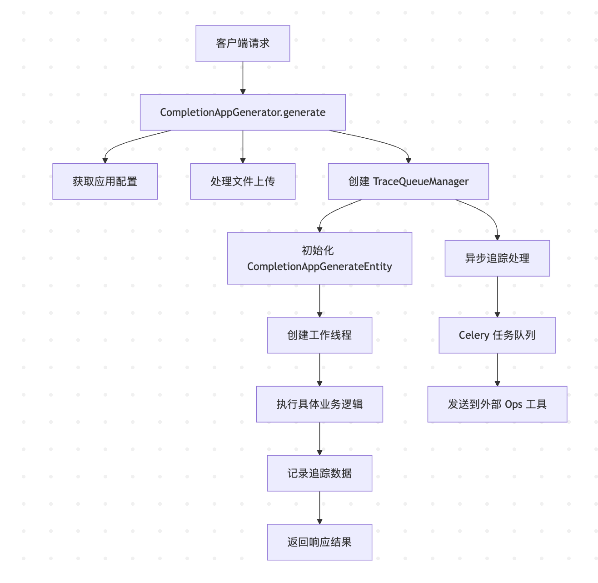

## 什么是 LLMOps

**LLMOps（Large Language Model Operations）** 即大语言模型运维，是 MLOps 在大语言模型领域的扩展，它涵盖了从 LLM 应用的开发、部署、监控到维护的完整生命周期管理。尽管 LLM 拥有出色的推理和文本生成能力，但其内部运作机制仍然难以完全理解，这给基于 LLM 的应用开发带来了挑战，比如：

- 评估模型输出质量
- 降低推理成本
- 减少模型响应延迟
- 链式调用、Agent 和工具引入的调试复杂性

目前市面上已经涌现出不少 LLMOps 工具，比如 **LangSmith**、**Langfuse** 等，能够为 LLM 应用提供全面的追踪和深度评估能力。LLMOps 的核心概念包括：

- **模型管理**: 版本控制、A/B 测试、模型切换
- **监控观测**: 性能指标、成本跟踪、用户行为分析
- **数据管理**: 训练数据、推理日志、反馈收集
- **部署运维**: 自动化部署、扩缩容、故障恢复

不过我们一般更关注监控观测部分，通过在 LLM 应用中埋点，能够实现对模型性能的精细化监控，从而及时发现和解决潜在问题。

Dify 支持多种外部 Ops 工具的集成，包括：

- [Langfuse](https://langfuse.com/)
- [LangSmith](https://www.langchain.com/langsmith)
- [Opik](https://www.comet.com/site/products/opik/)
- [W&B Weave](https://wandb.ai/site/weave)
- [Arize Phoenix](https://phoenix.arize.com/)
- [阿里云监控](https://help.aliyun.com/zh/arms/)

下面我们以 **Langfuse** 为例，演示如何在 Dify 中配置和使用 LLMOps 工具。

## Langfuse 集成演示

[Langfuse](https://langfuse.com/) 是一个开源的 LLM 工程平台，可以帮助团队协作调试、分析和迭代他们的应用程序。

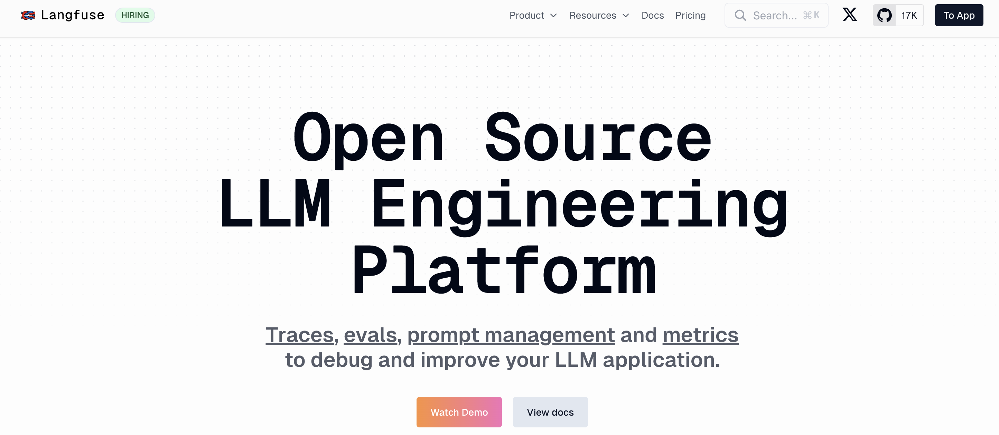

它提供了以下核心功能：

- **追踪（Tracing）**：记录 LLM 应用的完整执行过程
- **观测（Observability）**：提供实时的性能监控和可视化
- **评估（Evaluation）**：支持多种评估指标和人工标注
- **数据集管理**：管理测试数据和历史记录
- **成本追踪**：监控 Token 使用和费用

### 获取 Langfuse 的 API Key

我们首先访问 Langfuse 官网，注册账号并登录，然后创建一个组织：

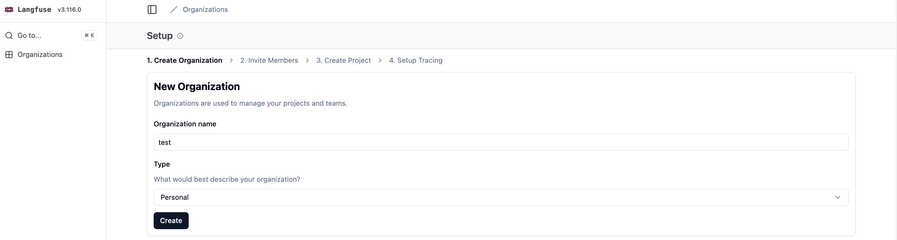

然后在组织下创建一个项目：

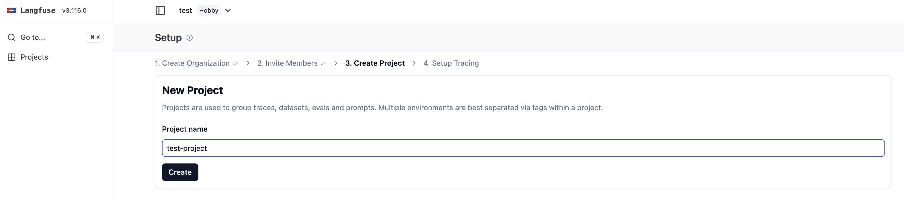

创建成功后，接着为项目创建 API Key：

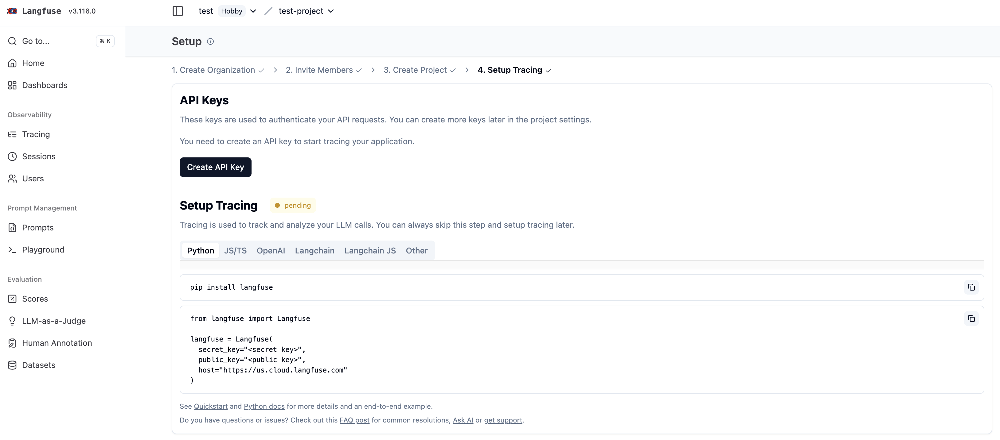

点击创建按钮，获取以下三个重要参数：

- **Public Key**：公开密钥，用于客户端身份验证
- **Secret Key**：私钥，用于服务端 API 调用
- **Host**：Langfuse 服务器地址

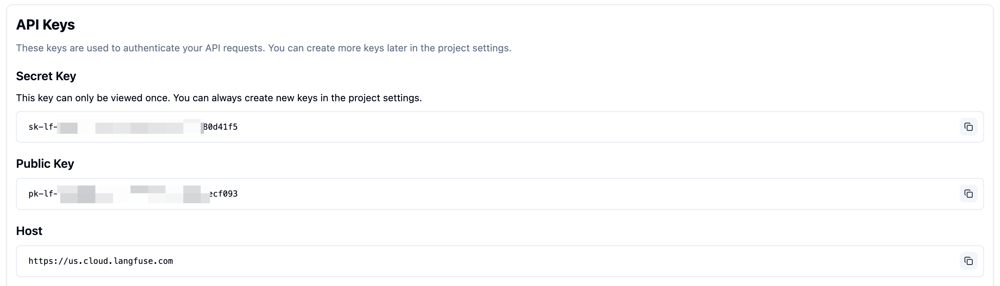

> Langfuse 是开源项目，我们也可以本地部署它。

### 在 Dify 中配置 Langfuse

接下来，我们再在 Dify 中配置 Langfuse，打开需要监测的应用，点击左侧的 **监测** 菜单：

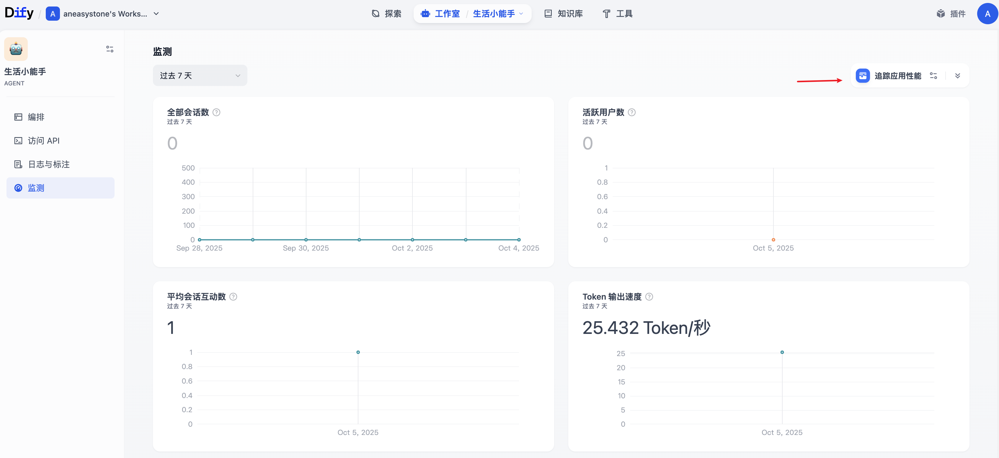

这个页面显示了该应用的统计指标，包括会话数、活跃用户数、平均会话互动数、Token 输出速度、用户满意度、费用消耗、全部消息数等。然后再点击右上角的 **追踪应用性能** 按钮：

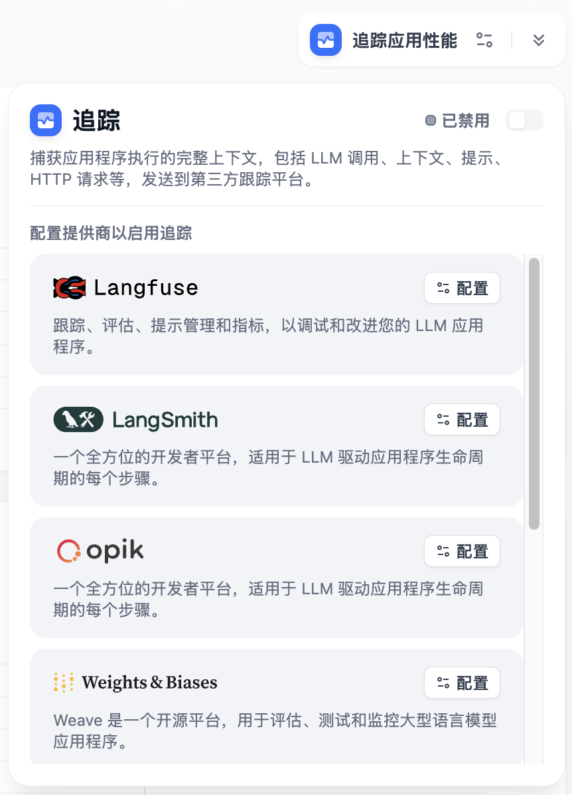

该选项默认是禁用的，我们点击 Langfuse 右侧的配置按钮，将上面获取的 API 凭据粘贴到配置中并保存：

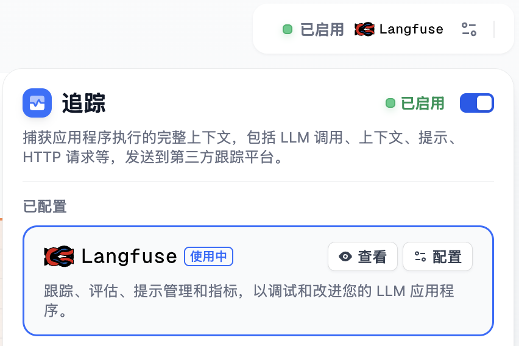

配置成功后，可以在页面中看到状态显示为已启用，表示正在监测。

### 查看监测数据

配置完成后，当你在 Dify 中调试或使用应用时，所有的执行数据都会自动发送到 Langfuse 平台：

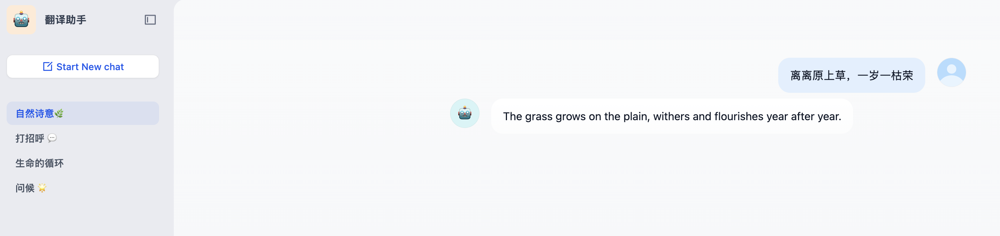

在 Langfuse 中可以看到详细的追踪数据：

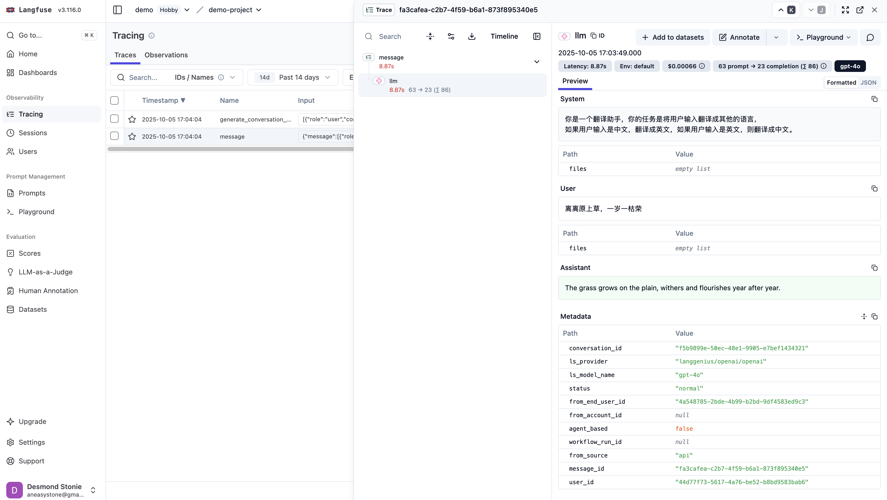

## `trace_manager` 的实现

现在让我们来看下 Dify 中追踪管理器 `trace_manager` 的实现机制，了解它是如何收集、处理和发送追踪数据的。它的初始化代码如下：

```python
trace_manager_timer: Optional[threading.Timer] = None
trace_manager_queue: queue.Queue = queue.Queue()

class TraceQueueManager:
  def __init__(self, app_id=None, user_id=None):
    self.app_id = app_id
    self.user_id = user_id
    # 获取该 app 的追踪实例（如 Langfuse, LangSmith 等）
    self.trace_instance = OpsTraceManager.get_ops_trace_instance(app_id)
    # Flask 实例
    self.flask_app = current_app._get_current_object()
    # 启动定时器
    if trace_manager_timer is None:
      self.start_timer()
```

这里主要有两个关键步骤：

1. **获取追踪实例**：根据应用 ID 查询该应用的追踪配置，初始化对应供应商的追踪实例
2. **定时处理追踪任务**：创建一个定时任务，每隔一段时间扫描一次追踪队列，将队列中的追踪任务发送 Celery 异步处理

### 获取追踪实例

首先根据应用 ID 查询该应用的追踪配置，也就是 `apps` 表的 `tracing` 字段：

```json
{
  "enabled": true,
  "tracing_provider": "langfuse"
}
```

获取到对应的追踪供应商（如 Langfuse, LangSmith 等），然后再查询 `trace_app_config` 表获取详细的供应商配置，Dify 通过插件化的架构支持多种追踪供应商：

```python
case TracingProviderEnum.LANGFUSE:
  return {
    "config_class": LangfuseConfig,
    "secret_keys": ["public_key", "secret_key"],
    "other_keys": ["host", "project_key"],
    "trace_instance": LangFuseDataTrace,
  }
case TracingProviderEnum.LANGSMITH:
  return {
    "config_class": LangSmithConfig,
    "secret_keys": ["api_key"],
    "other_keys": ["project", "endpoint"],
    "trace_instance": LangSmithDataTrace,
  }
case TracingProviderEnum.OPIK:
  # ...
case TracingProviderEnum.WEAVE:
  # ...
case TracingProviderEnum.ARIZE:
  # ...
case TracingProviderEnum.PHOENIX:
  # ...
case TracingProviderEnum.ALIYUN:
  # ...
case _:
  raise KeyError(f"Unsupported tracing provider: {provider}")
```

每个供应商的实现都由四个部分组成：

- `config_class` - 该供应商的配置类
- `secret_keys` - 该供应商的密钥信息，比如 Langfuse 的 `public_key` 和 `secret_key`，注意这些信息 Dify 都做了加密处理，防止密钥的泄漏
- `other_keys` - 其他无需加密处理的信息
- `trace_instance` - 该供应商的具体实现

### 定时处理追踪任务

然后通过 `threading.Timer` 创建一个定时任务，默认每隔 5s 执行一次：

```python
trace_manager_interval = int(os.getenv("TRACE_QUEUE_MANAGER_INTERVAL", 5))

def start_timer(self):
  trace_manager_timer = threading.Timer(trace_manager_interval, self.run)
  trace_manager_timer.name = f"trace_manager_timer_{time.strftime('%Y-%m-%d %H:%M:%S', time.localtime())}"
  trace_manager_timer.daemon = False
  trace_manager_timer.start()
```

该任务的实现 `run()` 方法如下：

```python
trace_manager_queue: queue.Queue = queue.Queue()
trace_manager_batch_size = int(os.getenv("TRACE_QUEUE_MANAGER_BATCH_SIZE", 100))

def run(self):
  tasks = self.collect_tasks()
  self.send_to_celery(tasks)

# 从队列中收集任务
def collect_tasks(self):
  tasks: list[TraceTask] = []
  while len(tasks) < trace_manager_batch_size and not trace_manager_queue.empty():
    # 批量收集，最多 batch_size 个
    task = trace_manager_queue.get_nowait()
    tasks.append(task)
    trace_manager_queue.task_done()
  return tasks

# 异步处理任务
def send_to_celery(self, tasks: list[TraceTask]):
  with self.flask_app.app_context():
    for task in tasks:

      # 获取任务数据
      trace_info = task.execute()
      task_data = TaskData(
        app_id=task.app_id,
        trace_info_type=type(trace_info).__name__,
        trace_info=trace_info.model_dump() if trace_info else None,
      )

      # 将数据保存到文件中
      file_id = uuid4().hex
      file_path = f"{OPS_FILE_PATH}{task.app_id}/{file_id}.json"
      storage.save(file_path, task_data.model_dump_json().encode("utf-8"))

      # 将任务发送到 Celery 队列进行异步处理
      file_info = {
        "file_id": file_id,
        "app_id": task.app_id,
      }
      process_trace_tasks.delay(file_info)
```

核心逻辑主要分为两个步骤：

1. **收集任务**：调用 `collect_tasks()` 从队列中收集一批待处理的追踪任务；该方法从全局队列 `trace_manager_queue` 中取出最多 `trace_manager_batch_size` 个任务；
2. **发送任务**：如果有任务，则调用 `send_to_celery(tasks)` 将任务发送到 Celery 异步任务队列；该方法首先将任务序列化后保存到存储系统，然后通过 `process_trace_tasks.delay()` 异步执行；

值得注意的是，这里的 `process_trace_tasks` 是一个 Celery 任务，因此可以调用 `delay()` 方法。它通过 `@shared_task` 装饰：

```python
from celery import shared_task

@shared_task(queue="ops_trace")
def process_trace_tasks(file_info):
  #...
```

`@shared_task` 是 Celery 框架提供的装饰器，用于创建可以在不同 Celery 应用实例之间共享的异步任务。它最大的优势是应用无关性，不依赖特定的 Celery 应用实例，可以提高代码的可重用性。

### 添加追踪任务

上面提到，追踪管理器 `trace_manager` 被注入到应用生成实体中，因此在整个应用执行过程中，各个模块都可以通过追踪管理器记录相应的运行数据。当需要记录追踪数据时，通过 `add_trace_task()` 方法将任务添加到队列：

```python
def add_trace_task(self, trace_task: TraceTask):
  global trace_manager_timer, trace_manager_queue
  try:
    if self.trace_instance:
      # 只有配置了追踪时才添加任务
      trace_task.app_id = self.app_id
      trace_manager_queue.put(trace_task)
  except Exception:
    logger.exception("Error adding trace task, trace_type %s", trace_task.trace_type)
  finally:
    # 确保定时器在运行
    self.start_timer()
```

Dify 支持多种类型的追踪任务，每种类型记录不同的运行时数据：

```python
class TraceTaskName:
  # 会话追踪（未使用）
  CONVERSATION_TRACE = "conversation_trace"
  # 工作流追踪，记录工作流的执行详情
  WORKFLOW_TRACE = "workflow_trace"
  # 消息追踪，在消息处理过程中记录完整的对话数据
  MESSAGE_TRACE = "message_trace"
  # 审核追踪，记录内容审核的详细过程
  MODERATION_TRACE = "moderation_trace"
  # 建议问题追踪
  SUGGESTED_QUESTION_TRACE = "suggested_question_trace"
  # 数据集检索追踪，记录 RAG 检索的过程和结果
  DATASET_RETRIEVAL_TRACE = "dataset_retrieval_trace"
  # 工具调用追踪，记录智能体工具调用的详细信息
  TOOL_TRACE = "tool_trace"
  # 会话标题生成追踪
  GENERATE_NAME_TRACE = "generate_name_trace"
```

## 小结

今天我们深入学习了 Dify 的追踪调试机制，通过源码剖析，了解了 `trace_manager` 作为追踪系统的入口点，负责收集整个会话过程中的运行数据。此外，我们学习了 LLMOps 的概念以及常见的 LLMOps 工具，并通过 LangFuse 的实际使用，了解了如何在 Dify 中集成外部 Ops 工具，实现对应用运行状态的全面监控。

通过追踪管理器，Dify 实现了对应用执行过程的全面追踪，从消息对话、工具调用到知识库检索，不仅为开发者提供了强大的调试能力，也为生产环境下的性能优化和问题诊断奠定了坚实的基础。
