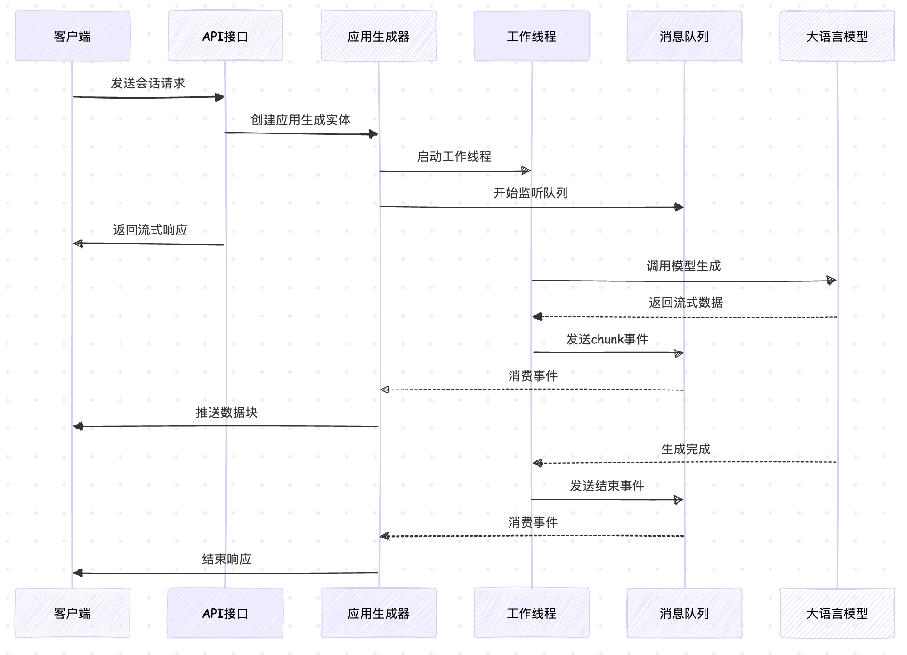
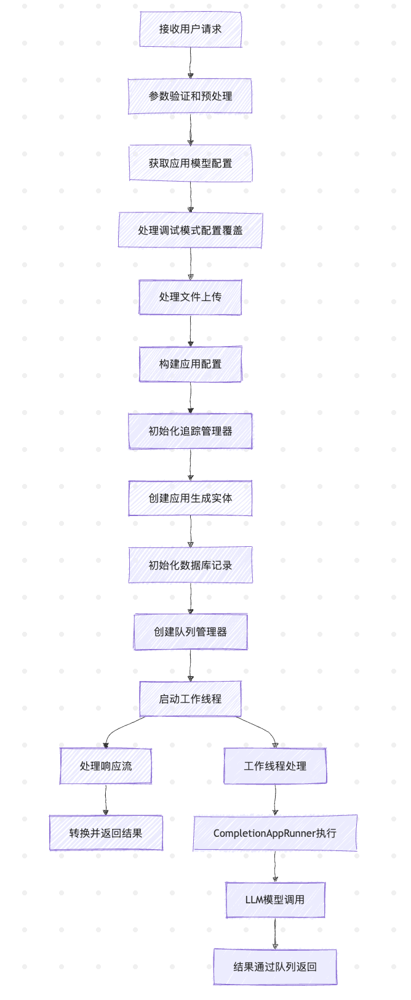
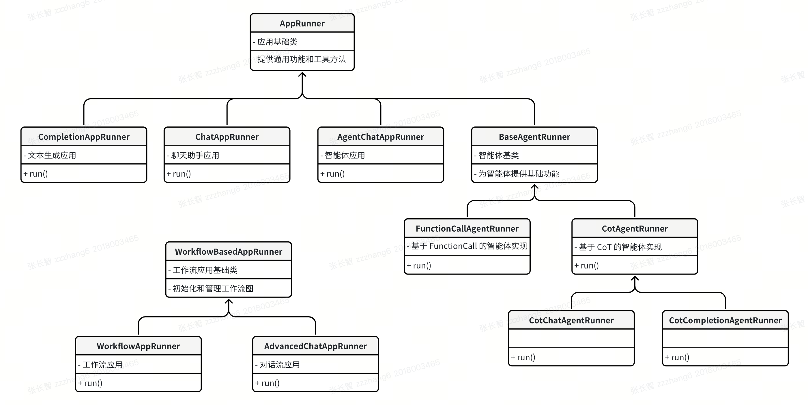

# 深入 Dify 的应用运行器

在前面的文章中，我们深入分析了 Dify 应用生成器的源码实现，从限流策略、流式响应、配置管理、文件上传处理，到追踪调试机制，逐步了解了 Dify 会话处理的完整流程。今天我们将继续深入 `CompletionAppGenerator` 的 `generate()` 方法，看看在创建好应用生成实体后，Dify 是如何通过 **应用运行器（App Runner）** 来执行具体的业务逻辑。

## 从生成器到运行器

让我们回顾一下 `CompletionAppGenerator` 的 `generate()` 方法，在完成配置管理、文件处理、追踪管理器初始化等前置工作后，接下来的步骤是创建 **应用生成实体（App Generate Entity）**：

```python
application_generate_entity = CompletionAppGenerateEntity(
  
  # 任务ID
  task_id=str(uuid.uuid4()),
  # 应用配置
  app_config=app_config,
  # 模型配置
  model_conf=ModelConfigConverter.convert(app_config),
  # 文件上传配置
  file_upload_config=file_extra_config,

  # 用户输入变量
  inputs=self._prepare_user_inputs(
    user_inputs=inputs, variables=app_config.variables, tenant_id=app_model.tenant_id
  ),
  # 用户查询
  query=query,
  # 上传文件
  files=list(file_objs),
  # 用户ID
  user_id=user.id,
  
  # 是否流式输出
  stream=streaming,
  # 调用来源
  invoke_from=invoke_from,

  # 扩展参数
  extras={},
  # 追踪管理器
  trace_manager=trace_manager,
)
```

应用生成实体包含了执行一次应用调用所需的所有信息，包括：

- **配置信息**：应用配置、模型配置、文件上传配置
- **用户数据**：输入变量、查询内容、上传文件
- **执行控制**：流式开关、调用来源
- **附加功能**：追踪管理器、扩展参数

后续的运行流程将分成两条线路：一条是我们昨天学习的追踪线程，通过 Celery 任务队列，离线记录业务运行时产生的数据，并发送到外部 Ops 工具：另一条则为工作线程，根据应用生成实体执行具体的生成逻辑：

```python
# 初始化数据库记录（会话和消息）
(conversation, message) = self._init_generate_records(application_generate_entity)

# 初始化队列管理器
queue_manager = MessageBasedAppQueueManager(
  task_id=application_generate_entity.task_id,
  user_id=application_generate_entity.user_id,
  invoke_from=application_generate_entity.invoke_from,
  conversation_id=conversation.id,
  app_mode=conversation.mode,
  message_id=message.id,
)

# 创建工作线程，并传递 Flask 请求上下文
@copy_current_request_context
def worker_with_context():
  return self._generate_worker(
    flask_app=current_app._get_current_object(),  # type: ignore
    application_generate_entity=application_generate_entity,
    queue_manager=queue_manager,
    message_id=message.id,
  )

# 启动工作线程
worker_thread = threading.Thread(target=worker_with_context)
worker_thread.start()

# 主线程处理响应或流生成器
response = self._handle_response(
  application_generate_entity=application_generate_entity,
  queue_manager=queue_manager,
  conversation=conversation,
  message=message,
  user=user,
  stream=streaming,
)
return CompletionAppGenerateResponseConverter.convert(response=response, invoke_from=invoke_from)
```

这里首先根据应用生成实体创建两条数据库记录，一条是会话记录（`conversations`），一条是消息记录（`messages`），如果消息中带有文件，还会创建对应的消息文件记录（`message_files`）；接着创建一个 **队列管理器（App Queue Manager）**，它负责管理应用执行过程中的事件流，实现 **生产者-消费者** 模式的异步通信；最后启动工作线程，创建 **应用运行器（App Runner）**，执行具体的生成逻辑，并通过队列管理器传递生成结果，同时主线程通过队列管理器监听执行结果，实现了请求处理和业务执行的解耦。整体流程如下：



至此，我们完成了整个生成器的处理流程的学习，开始进入运行器的学习：



### 队列管理器

队列管理器采用了 **生产者-消费者** 模式，通过 Python 的 `queue.Queue` 实现线程间的安全通信：

```python
class AppQueueManager:
  def __init__(self, task_id: str, user_id: str, invoke_from: InvokeFrom):
    # 创建线程安全的队列
    self._q: queue.Queue = queue.Queue()

  def listen(self):
    # 监听队列事件，通过 yield 返回生成器
    listen_timeout = dify_config.APP_MAX_EXECUTION_TIME
    start_time = time.time()

    while True:
      try:
        # 从队列中获取消息，超时时间为 1 秒
        message = self._q.get(timeout=1)
        yield message
      except queue.Empty:
        # 检查是否超时或被停止
        elapsed_time = time.time() - start_time
        if elapsed_time >= listen_timeout or self._is_stopped():
          self.publish(QueueStopEvent(), PublishFrom.TASK_PIPELINE)

  def publish(self, event: AppQueueEvent, pub_from: PublishFrom):
    # 发布事件到队列
    self._q.put(event)
```

队列管理器支持多种类型的事件，包括：

- `QueuePingEvent`：Ping 事件，心跳检测，保持连接活跃
- `QueueErrorEvent`：错误事件，处理任务执行过程中的错误
- `QueueTextChunkEvent`：文本块事件，处理流式文本输出
- `QueueLLMChunkEvent`：LLM 流式响应块
- `QueueMessageEndEvent`：消息结束事件
- `QueueStopEvent`：停止事件

除此之外，还有很多关于工作流的事件，比如节点事件、并行分支事件、迭代事件、循环事件、控制事件等，参考 `api/core/app/entities/queue_entities.py` 文件。

在整个应用运行过程中，队列管理器扮演着重要的角色。它负责将运行过程中的各种事件发布到队列，实现服务端与客户端的实时通信，并统一处理和发布错误信息：

```python
# 发布生成内容块事件
queue_manager.publish(
    QueueLLMChunkEvent(chunk=result), 
    PublishFrom.APPLICATION_MANAGER
)

# 发布消息结束事件
queue_manager.publish(
    QueueMessageEndEvent(llm_result=llm_result),
    PublishFrom.APPLICATION_MANAGER,
)

# 发布错误事件
queue_manager.publish_error(
    exception, 
    PublishFrom.APPLICATION_MANAGER
)
```

### Flask 请求上下文传递

Flask 的请求上下文默认只在当前线程中有效，当你创建新线程时，新线程无法访问原始请求的信息。Dify 通过 `@copy_current_request_context` 装饰器解决这个问题：

```python
from flask import copy_current_request_context

@copy_current_request_context
def worker_with_context():
  # 在这里可以访问 current_app、request 等 Flask 上下文对象
  return self._generate_worker(...)
```

这个装饰器会将当前请求的上下文（包括 `current_app`、`request`、`session` 等）复制到新线程中，这样，工作线程就可以访问数据库连接、配置信息等依赖于 Flask 应用上下文的资源。比如在 `_generate_worker()` 函数中，使用 `with flask_app.app_context()` 手动创建并进入应用上下文：

```python
def _generate_worker(...) -> None:
  with flask_app.app_context():
    # 在这里可以使用 Flask 应用相关的功能，如数据库操作
    message = self._get_message(message_id)
    # ...
```

> 注意，这个装饰器和之前学过的 `stream_with_context` 有所不同，后者用于确保在整个流式响应过程中都能访问请求上下文。

### 使用 `contextvars` 拷贝上下文

需要注意的是，前面的代码都是以文本生成应用为例的，和它类似的还有一个聊天应用，这两个应用都比较简单，因此直接使用 Flask 提供的 `@copy_current_request_context` 装饰器，复制请求上下文即可。

但是在智能体和工作流应用中，包含了更复杂的执行流程，可能涉及多个异步任务，除了 Flask 的请求上下文，还需要更全面的上下文保持。Dify 使用了 Python 3.7+ 的 `contextvars` 模块，复制所有的上下文变量。我们可以看下 `AgentChatAppGenerator` 的实现：

```python
# new thread with request context and contextvars
context = contextvars.copy_context()
worker_thread = threading.Thread(
  target=self._generate_worker,
  kwargs={
    "flask_app": current_app._get_current_object(),  # type: ignore
    "context": context,
    "application_generate_entity": application_generate_entity,
    "queue_manager": queue_manager,
    "conversation_id": conversation.id,
    "message_id": message.id,
  },
)
worker_thread.start()
```

然后在 `_generate_worker()` 中使用：

```python
with preserve_flask_contexts(flask_app, context_vars=context):
  runner = AgentChatAppRunner()
  runner.run(
    application_generate_entity=application_generate_entity,
    queue_manager=queue_manager,
    conversation=conversation,
    message=message,
  )
```

结合自定义的 `preserve_flask_contexts()` 函数，同时处理：

- ContextVars 上下文 - Python 原生的上下文变量
- Flask App 上下文 - Flask 应用上下文
- 用户认证上下文 - Flask-Login 的用户对象

### 上下文变量

`contextvars` 是 Python 3.7 引入的标准库，用于管理 **上下文变量（Context Variables）**，主要解决多线程或异步任务中变量传递的问题，主要应用场景有：

1. **异步编程**：在 `asyncio` 中，每个任务可以有独立的上下文变量
2. **Web开发**：跟踪请求ID、用户身份等，无需在函数间显式传递
3. **日志系统**：自动在日志中包含上下文信息（如请求ID）

下面的代码演示了上下文变量的基本用法：

```python
import contextvars

# 创建上下文变量
user_id = contextvars.ContextVar('user_id', default=None)

# 设置值（返回Token对象，用于后续重置）
token = user_id.set(123)

# 获取值
print(user_id.get())  # 输出: 123

# 重置值（使用之前保存的Token）
user_id.reset(token)
print(user_id.get())  # 输出: None（默认值）

# 重新设置值
token = user_id.set(456)

# 在函数中使用
def func():
    print(user_id.get())  # 输出: 456

func()
```

也可以模仿 Dify 的写法，在多线程中使用：

```python
from contextlib import contextmanager

@contextmanager
def preserve_flask_contexts(context_vars: contextvars.Context):
  # Set context variables if provided
  if context_vars:
    for var, val in context_vars.items():
      var.set(val)
  yield

# 在新线程中使用
import threading

def func2(context: contextvars.Context):
  with preserve_flask_contexts(context_vars=context):
    print(user_id.get())  # 输出: 456

context = contextvars.copy_context()
worker_thread = threading.Thread(
  target=func2,
  kwargs={
    "context": context,
  },
)
worker_thread.start()
```

可以看出它和线程局部变量 `threading.local` 很像，两者区别如下：

| 特性 | `contextvars` | `threading.local` |
|------|--------------|-------------------|
| 适用场景 | 线程、异步任务 | 仅线程 |
| 可复制性 | 支持上下文复制 | 不支持 |
| 异步友好 | 是 | 否 |

`contextvars` 特别适合需要在复杂调用链或异步任务中共享状态，但又不希望使用全局变量或显式参数传递的场景。但是上下文变量的查找速度略慢于普通变量，还可能使代码逻辑变得隐晦，在使用时需要特别注意，避免过度使用。

## 创建应用运行器

让我们继续看工作线程中创建应用运行器的部分：

```python
def _generate_worker(
  self,
  flask_app: Flask,
  application_generate_entity: CompletionAppGenerateEntity,
  queue_manager: AppQueueManager,
  message_id: str,
) -> None:
  with flask_app.app_context():
    try:
      # 获取消息记录
      message = self._get_message(message_id)

      # 创建应用运行器并执行
      runner = CompletionAppRunner()
      runner.run(
        application_generate_entity=application_generate_entity,
        queue_manager=queue_manager,
        message=message,
      )
    except Exception as e:
      # 错误处理逻辑...
```

这里的代码是以文本生成应用为例的，其实，不同类型的应用（如聊天应用、智能体应用、工作流应用）都有对应的运行器实现，它们都遵循统一的接口规范：



Dify 的应用运行器采用了清晰的继承结构，主要基于下面两个基类：

- **AppRunner（应用基础类）**：提供所有应用运行器的通用功能：提示消息组织、模型调用、内容审核、直接输出响应、外部数据集成等
- **WorkflowBasedAppRunner（工作流基础类）**：专门处理基于工作流的应用运行逻辑：图初始化、变量池管理、事件处理等

下面是具体的实现类：

- **ChatAppRunner（聊天应用）**：记忆管理、数据集检索、注释回复、外部数据工具、数据集检索等
- **CompletionAppRunner（文本生成应用）**：与聊天应用类似但没有对话记忆
- **AgentChatAppRunner（智能体）**：根据模型能力选择不同的智能体策略（函数调用或思维链）
- **WorkflowAppRunner（工作流）**：支持单次迭代运行和循环运行
- **AdvancedChatAppRunner（对话流）**：对话变量管理、输入审核、注释回复等

其中智能体的应用运行器比较特殊，它会根据模型能力选择不同的智能体策略，包括：

- **FunctionCallAgentRunner（函数调用）**：使用模型原生的函数调用能力，支持流式和非流式调用
- **CotAgentRunner（思维链）**：实现 ReAct (Reasoning + Acting) 模式的推理循环，它是一个抽象类，使用模板方法设计模式，定义了思维链的算法骨架，由子类实现具体步骤，包括：聊天模式的思维链（`CotChatAgentRunner`）和文本生成模式的思维链（`CotCompletionAgentRunner`）

## 小结

今天我们深入学习了 Dify 的应用运行器机制。通过分析 `CompletionAppGenerator` 的 `generate()` 方法，我们了解了如何从生成器过渡到工作线程，并在其中创建应用运行器以执行具体生成任务。关键流程包括创建应用生成实体、初始化数据库记录、构建队列管理器以及启动工作线程等。总结如下：

1. 了解队列管理器的异步管道机制，采用生产者-消费者模式，确保线程间安全通信，并实时处理和发布生成事件；
2. 学习如何通过 `@copy_current_request_context` 和 `contextvars` 实现跨线程的请求上下文传递，确保工作线程可以访问原始请求中的信息；
3. 深入分析了不同类型的应用运行器及其继承结构，展示了如何根据具体应用需求选择不同的策略和实现类。

应用运行器是 Dify 的执行引擎，也是其核心所在。今天我们对这一机制进行了初步探索，明天我们将继续深入它的内部实现，揭示更多细节。
