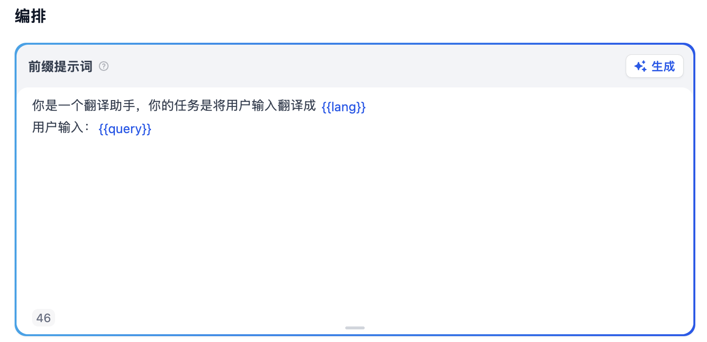
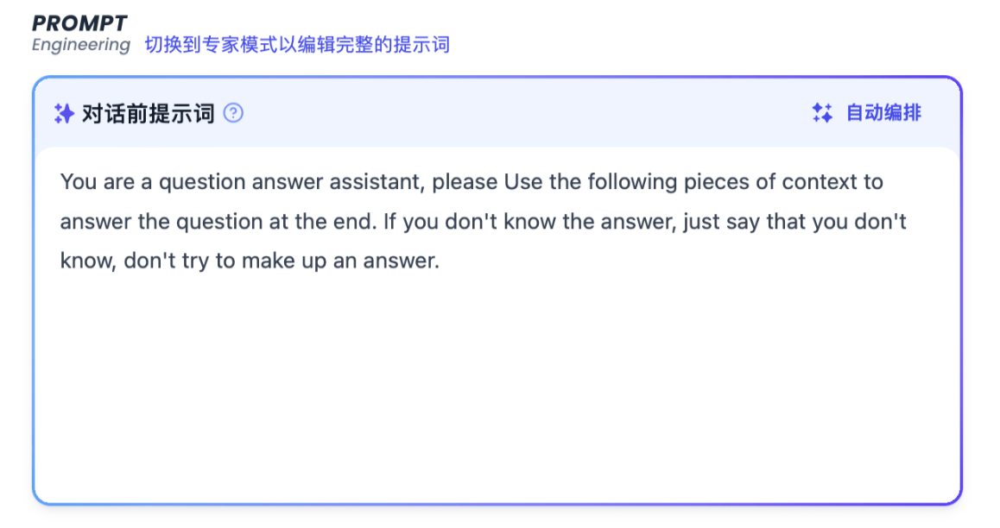
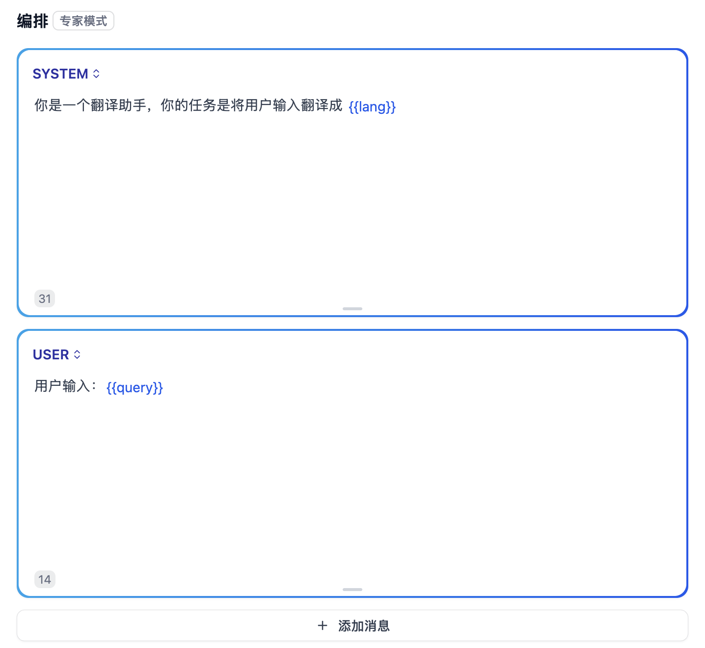
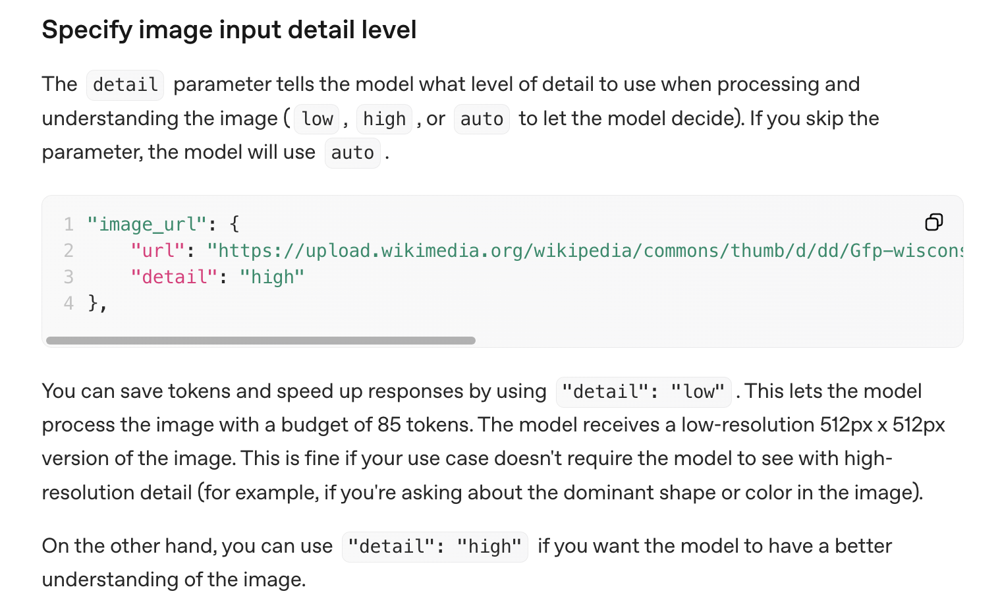

# 深入 Dify 的应用运行器之提示词组装

**应用运行器（App Runner）** 是 Dify 应用的核心执行器，负责处理具体的生成逻辑，今天，我们将继续深入应用运行器的内部实现。

## 应用运行器的概览

让我们以文本生成应用为例，深入 `CompletionAppRunner` 的 `run()` 方法的实现：

```python
def run(
  self,
  application_generate_entity: CompletionAppGenerateEntity,
  queue_manager: AppQueueManager,
  message: Message
) -> None:

  # 1. 提取配置和输入参数
  app_config = application_generate_entity.app_config
  inputs = application_generate_entity.inputs
  query = application_generate_entity.query
  files = application_generate_entity.files

  # 2. 组装提示词消息
  prompt_messages, stop = self.organize_prompt_messages(...)

  # 3. 内容审核
  try:
    _, inputs, query = self.moderation_for_inputs(...)
  except ModerationError as e:
    self.direct_output(queue_manager, ..., text=str(e))
    return

  # 4. 外部数据工具处理
  if app_config.external_data_variables:
    inputs = self.fill_in_inputs_from_external_data_tools(...)

  # 5. 知识库检索
  context = None
  if app_config.dataset and app_config.dataset.dataset_ids:
    dataset_retrieval = DatasetRetrieval(application_generate_entity)
    context = dataset_retrieval.retrieve(...)

  # 6. 重新组装包含上下文的提示词
  prompt_messages, stop = self.organize_prompt_messages(..., context=context)

  # 7. 托管审核检查
  if self.check_hosting_moderation(...):
    return

  # 8. 调整 Token 限制
  self.recalc_llm_max_tokens(...)

  # 9. 调用模型
  model_instance = ModelInstance(...)
  invoke_result = model_instance.invoke_llm(...)

  # 10. 处理调用结果
  self._handle_invoke_result(invoke_result, queue_manager, streaming)
```

其核心执行流程如下：

* **配置和参数提取**: 从应用生成实体中提取应用配置以及输入参数 (inputs)、查询 (query) 和文件 (files) 等；
* **第一次提示词组装**：将模板、输入、查询、文件组合成完整的提示消息，同时处理图片细节配置，生成初始的 `prompt_messages` 和 `stop` 序列；
* **内容审核**：对输入内容进行敏感词检测，如果检测到违规内容，直接返回错误消息；
* **外部数据填充**：从外部数据源获取变量值，动态补充应用输入参数；
* **知识库检索**：使用 `DatasetRetrieval` 进行向量检索，获取相关上下文；
* **第二次提示词重组**：整合所有信息：模板 + 输入 + 查询 + 文件 + 记忆 + 外部数据 + 知识库上下文，生成最终的提示消息；
* **托管审核**：检查提示消息是否符合托管方的内容政策，如果违规，直接返回标准回复；
* **令牌重计算**：计算提示令牌数量，如果 `prompt_tokens` + `max_tokens` > 模型上下文限制，则调整 `max_tokens`，确保请求不超过模型的令牌限制；
* **模型调用**：使用组装好的提示消息调用大模型，支持使用 `stop` 序列控制生成停止；
* **结果处理**：将模型调用结果通过队列管理器传递到主线程，并返回给最终用户，支持流式和非流式输出；

## 两次提示词组装

可以看出，运行器的整体流程还是蛮复杂的，其中经历了两次提示词组装：

1. **第一次组装**：使用基础的用户输入和查询，主要用于输入审核和知识库检索；
2. **第二次组装**：在获得完整上下文（包括外部数据和知识库检索结果）后重新组装；

提示词组装是应用运行器的核心功能之一，我们今天就详细地讲解下提示词组装的源码，同时对比其他几种应用运行器在提示词处理上的差异。让我们先看看两次提示词组装的具体实现：

```python
# 第一次提示词组装 - 基础模板
prompt_messages, stop = self.organize_prompt_messages(
  app_record=app_record,
  model_config=application_generate_entity.model_conf,
  prompt_template_entity=app_config.prompt_template,
  inputs=inputs,
  files=files,
  query=query,
  image_detail_config=image_detail_config,
)

# 第二次提示词组装 - 包含完整上下文
prompt_messages, stop = self.organize_prompt_messages(
  app_record=app_record,
  model_config=application_generate_entity.model_conf,
  prompt_template_entity=app_config.prompt_template,
  inputs=inputs,   # 填充外部数据
  files=files,
  query=query,
  context=context, # 新增知识库上下文
  image_detail_config=image_detail_config,
)
```

这两段代码几乎一模一样，只是第二次多了个 `context` 字段，另外 `inputs` 字段相比于第一次填充了外部数据。提示词组装的核心逻辑在父类 `AppRunner` 的 `organize_prompt_messages()` 方法中：

```python
def organize_prompt_messages(...) -> tuple[list[PromptMessage], Optional[list[str]]]:

  # 根据提示词模板类型选择转换器
  if prompt_template_entity.prompt_type == PromptTemplateEntity.PromptType.SIMPLE:
    # 简单提示词模板：使用预设的模板格式
    prompt_transform = SimplePromptTransform()
    prompt_messages, stop = prompt_transform.get_prompt(
      prompt_template_entity=prompt_template_entity,
      ...
    )
  else:
    # 高级提示词模板：用户自定义的完整模板
    prompt_transform = AdvancedPromptTransform()
    prompt_messages = prompt_transform.get_prompt(
      prompt_template=prompt_template,
      ...
    )
    stop = model_config.stop

  return prompt_messages, stop
```

Dify 根据提示词模板类型选择不同的处理策略，它支持两种模式：

- **简单模式（Simple Mode）**：适用于大多数基础场景，通过模板变量替换的方式生成提示词
- **高级模式（Advanced Mode）**：提供了更精细的控制，支持多轮对话和角色定制

### 简单模式提示词组装

当我们在应用的编排页面配置提示词时，默认就是简单模式：



简单模式由 `SimplePromptTransform` 实现，它负责处理大多数常见场景的提示词组装：

```python
def get_prompt(...) -> tuple[list[PromptMessage], Optional[list[str]]]:

  # 根据模型类型选择处理方式
  model_mode = ModelMode(model_config.mode)
  if model_mode == ModelMode.CHAT:
    # Chat 模型：生成多条消息（系统提示 + 用户消息）
    prompt_messages, stops = self._get_chat_model_prompt_messages(...)
  else:
    # Completion 模型：生成单条完整提示词
    prompt_messages, stops = self._get_completion_model_prompt_messages(...)

  return prompt_messages, stops
```

它又将大模型分成两种类型：

- 对于 **对话模型（Chat）**，Dify 会构建结构化的消息列表，生成多条消息（系统提示 + 历史记录 + 用户消息）；
- 对于传统的 **文本补全模型（Completion）**，Dify 会将所有内容拼在一起，生成单条完整的提示词；

目前市面上绝大多数的模型都是对话模型，通过结构化方式组装消息有几个优势：

1. **清晰的角色分离**：系统提示、历史记录、当前查询分别处理
2. **更好的模型兼容性**：充分利用 Chat 模型的对话能力
3. **灵活的上下文管理**：可以精确控制每部分内容的位置和格式

### 提示词模板

无论是对话模型，还是文本补全模型，Dify 都统一使用一套灵活的模板系统来构建提示词。提示词模板存放在 `prompt_templates` 目录下的 JSON 文件中：

- `common_completion.json`: 文本生成应用的提示词模板规则
- `common_chat.json`: 聊天应用或智能体应用的提示词模板规则

Dify 根据不同的应用切换不同的模板规则，以 `common_chat.json` 文件为例，它的内容如下：

```json
{
  "human_prefix": "Human",
  "assistant_prefix": "Assistant",
  "context_prompt": "Use the following context as your learned knowledge...",
  "histories_prompt": "Here is the chat histories between human and assistant...",
  "system_prompt_orders": [
    "context_prompt",
    "pre_prompt",
    "histories_prompt"
  ],
  "query_prompt": "\n\nHuman: {{#query#}}\n\nAssistant: ",
  "stops": ["\nHuman:", "</histories>"]
}
```

提示规则包含以下核心字段：

1. 提示词组装顺序
    - `system_prompt_orders`：定义系统提示的组装顺序，默认按照 `context_prompt` -> `pre_prompt` -> `histories_prompt` 这个顺序来组装，其中 `pre_prompt` 就是用户在编排页面自定义的提示词模板；
2. 提示模板字段
    - `context_prompt`: 知识库上下文的提示模板
    - `histories_prompt`: 历史对话的提示模板
    - `query_prompt`: 用户查询的提示模板，拼接在系统提示之后
3. 对话角色前缀 (仅聊天模型)
    - `human_prefix`: "Human" - 用户角色标识
    - `assistant_prefix`: "Assistant" - 助手角色标识
4. 停止词
    - `stops`：定义模型生成时的停止标记，用于控制模型输出边界

> 注意，只有对话类应用的提示词模板设有停止词，这是因为对话应用需要明确的角色分工，使用停止词来防止模型继续生成不应该生成的内容，比如 `"\nHuman:"` 防止模型继续模拟用户发言，`"</histories>"` 防止模型破坏历史对话的 XML 标签结构。

提示词中预定义了几个占位符，用于变量替换：

- `{{#context#}}`: 替换为实际上下文内容
- `{{#query#}}`: 替换为用户查询
- `{{#histories#}}`: 替换为对话历史

另外，它还针对百川大模型使用了定制的模板（其实就是翻译成中文）：

- `baichuan_chat.json`: 聊天应用的提示词模板规则（针对百川大模型定制）
- `baichuan_completion.json`: 文本生成应用的提示词模板规则（针对百川大模型定制）

### 高级模式提示词组装

高级模式允许用户直接在页面上更精细的控制提示词顺序，而不是基于 JSON 配置文件。在老版本的编排页面，我们可以看到一个链接，点击后切换到 **专家模式**：



不过这个模式在新版本中已经看不到了，不知道是废弃了？还是变成收费功能了？

尽管页面上看不到切换入口，但是相关的代码逻辑还没删，所以通过修改数据库中的应用配置，还可以切换到该模式。我们创建一个应用，然后在数据库中找到该应用的配置，将 `prompt_type` 改为 `advanced`，将 `chat_prompt_config` 改为 `{"prompt":[]}`，刷新页面后就能看到专家模式了：



高级模式由 `AdvancedPromptTransform` 实现，它的实现就比较简单，直接根据用户配置来组装提示词即可。

### 文件处理

在提示词的组装过程中，文件的处理至关重要，其实现位于 `file_manager.to_prompt_message_content()` 函数：

```python
def to_prompt_message_content(f: File) -> PromptMessageContentUnionTypes:

  # 支持 4 种文件类型：图片、音频、视频、文件
  prompt_class_map: Mapping[FileType, type[PromptMessageContentUnionTypes]] = {
    FileType.IMAGE: ImagePromptMessageContent,
    FileType.AUDIO: AudioPromptMessageContent,
    FileType.VIDEO: VideoPromptMessageContent,
    FileType.DOCUMENT: DocumentPromptMessageContent,
  }

  # 对于不支持的文件类型，返回一句话描述
  if f.type not in prompt_class_map:
    return TextPromptMessageContent(data=f"[Unsupported file type: {f.filename} ({f.type.value})]")

  # 对于支持的文件类型，返回文件信息
  params = {
    "base64_data": _get_encoded_string(f) if dify_config.MULTIMODAL_SEND_FORMAT == "base64" else "",
    "url": _to_url(f) if dify_config.MULTIMODAL_SEND_FORMAT == "url" else "",
    "format": f.extension.removeprefix("."),
    "mime_type": f.mime_type,
    "filename": f.filename or "",
  }

  # 对于图片类型，增加 detail 参数
  if f.type == FileType.IMAGE:
    params["detail"] = image_detail_config or ImagePromptMessageContent.DETAIL.LOW

  return prompt_class_map[f.type].model_validate(params)
```

该函数将上传的文件转换为适合的 prompt 消息，它会根据配置将文件表示成 BASE64 编码或 URL 链接，默认使用 BASE64 方式：

```
MULTIMODAL_SEND_FORMAT=base64
```

值得注意的是，对于图片类型，还会增加一个 `detail` 参数，用于控制图片处理精度，支持 LOW 和 HIGH 两种：

- 低精度：处理速度快，消耗资源少；适用于对图片细节要求不高的场景；比如图片分类、简单的图片理解任务；
- 高精度：处理时间较长，消耗更多计算资源；适用于需要分析图片细节的场景；比如 OCR、详细图片分析、需要识别图片中细小文字或复杂内容；

模型供应商需要支持这个参数该特性才能生效，参考 [OpenAI 的接口文档](https://platform.openai.com/docs/guides/images-vision?api-mode=chat#specify-image-input-detail-level)：



可以看到，模型供应商接收到 `detail="low"` 参数后，会将图片缩放到较低分辨率（如 512x512）进行处理，Dify 本身不会对图片做任何处理。

## 不同应用运行器的提示词组装对比

现在让我们对比分析不同类型应用运行器在提示词组装上的差异。首先，聊天应用和文本生成应用在提示词组装上的主要区别在于 **记忆管理**，在提示词组装时会传入记忆：

```python
memory = None
if application_generate_entity.conversation_id:
  model_instance = ModelInstance(
    provider_model_bundle=application_generate_entity.model_conf.provider_model_bundle,
    model=application_generate_entity.model_conf.model,
  )
  # 创建基于会话的记忆缓冲区
  memory = TokenBufferMemory(conversation=conversation, model_instance=model_instance)

# 在提示词组装时传入记忆
prompt_messages, stop = self.organize_prompt_messages(
  # ... 其他参数
  memory=memory,  # ChatAppRunner 会传入记忆
)
```

智能体应用和聊天应用一样，在提示词组装时也会传入记忆，不过组装后的提示词仅仅用于内容审核。审核通过后，它会根据模型能力动态选择智能体策略，创建对应的 **智能体运行器（Agent Runner）**，真正的提示词组装逻辑位于智能体运行器中：

```python
def run(self, application_generate_entity: AgentChatAppGenerateEntity, ...):
  # 1. 基础提示词组装（与 ChatAppRunner 相同）
  prompt_messages, _ = self.organize_prompt_messages(
    app_record=app_record,
    model_config=application_generate_entity.model_conf,
    prompt_template_entity=app_config.prompt_template,
    inputs=dict(inputs),
    files=list(files),
    query=query,
    memory=memory,
  )

  # 2. 根据模型能力选择智能体策略
  model_instance = ModelInstance(...)
  llm_model = cast(LargeLanguageModel, model_instance.model_type_instance)
  model_schema = llm_model.get_model_schema(...)

  # 检查模型是否支持函数调用
  if {ModelFeature.MULTI_TOOL_CALL, ModelFeature.TOOL_CALL}.intersection(model_schema.features or []):
    agent_entity.strategy = AgentEntity.Strategy.FUNCTION_CALLING

  # 3. 选择对应的智能体运行器
  if agent_entity.strategy == AgentEntity.Strategy.FUNCTION_CALLING:
    runner_cls = FunctionCallAgentRunner
  elif agent_entity.strategy == AgentEntity.Strategy.CHAIN_OF_THOUGHT:
    # 根据 LLM 模式选择思维链实现
    if model_schema.model_properties.get(ModelPropertyKey.MODE) == LLMMode.CHAT.value:
      runner_cls = CotChatAgentRunner
    else:
      runner_cls = CotCompletionAgentRunner

  # 4. 创建专门的智能体运行器处理后续逻辑
  runner = runner_cls(...)
  invoke_result = runner.run(...)
```

因为需要支持工具调用，它有着更复杂的提示词组装逻辑，需要在提示词中集成工具描述和调用指令。

最后，对于工作流应用，运行器采用了完全不同的方式处理输入，它使用 **变量池（Variable Pool）** 而非传统提示词来管理整个工作流的数据流：

```python
def run(self) -> None:
  inputs = self.application_generate_entity.inputs
  files = self.application_generate_entity.files

  # 创建系统变量
  system_inputs = SystemVariable(
    files=files,
    user_id=self._sys_user_id,
    app_id=app_config.app_id,
    workflow_id=app_config.workflow_id,
    workflow_execution_id=self.application_generate_entity.workflow_execution_id,
  )

  # 构建变量池
  variable_pool = VariablePool(
    system_variables=system_inputs,
    user_inputs=inputs,  # 用户输入变量
    environment_variables=self._workflow.environment_variables,  # 环境变量
    conversation_variables=[],  # 对话变量（对话流应用使用）
  )

  # 初始化工作流图
  graph = self._init_graph(graph_config=self._workflow.graph_dict)

  # 运行工作流
  workflow_entry = WorkflowEntry(
    tenant_id=self._workflow.tenant_id,
    # ... 其他参数
    variable_pool=variable_pool,
  )

  generator = workflow_entry.run(callbacks=workflow_callbacks)
```

工作流的每个节点首先从变量池中获取所需的输入数据，然后执行节点特定的逻辑（LLM 调用、工具执行、条件判断等），最后将处理结果写回变量池供后续节点使用。

关于智能体策略和工作流的执行细节，我们后面将专门学习，此处暂不展开。

## 小结

今天我们深入分析了 Dify 应用运行器的提示词组装机制，从 `CompletionAppRunner` 的双重组装策略开始，详细解析了简单提示词模板和高级提示词模板的处理流程，包括 Chat 和 Completion 模型的不同处理方式。我们也对比了不同应用运行器的提示词处理差异：

1. **CompletionAppRunner**：专注单次文本生成
2. **ChatAppRunner**：支持对话记忆，提供连续的多轮对话体验
3. **AgentChatAppRunner**：结合工具调用能力，支持复杂的推理和执行流程
4. **WorkflowAppRunner**：采用变量池机制，支持复杂的数据流处理

提示词组装是 Dify 的核心能力之一，它决定了用户输入如何转化为模型能够理解的格式。理解这一机制对于开发者深入使用 Dify 或定制应用逻辑具有重要意义。在后面的文章中，我们将继续探索应用运行器的其他核心功能，包括内容审核、外部数据扩展、知识库检索、模型调用，以及不同的智能体策略和工作流的执行细节等。
