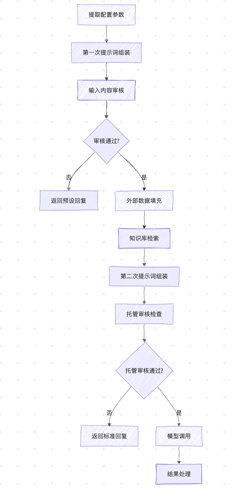
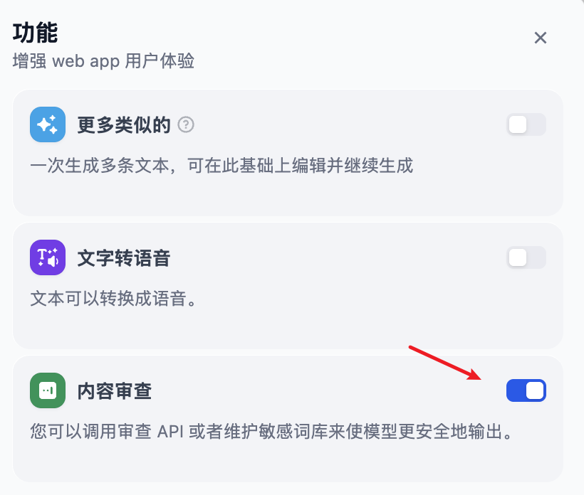
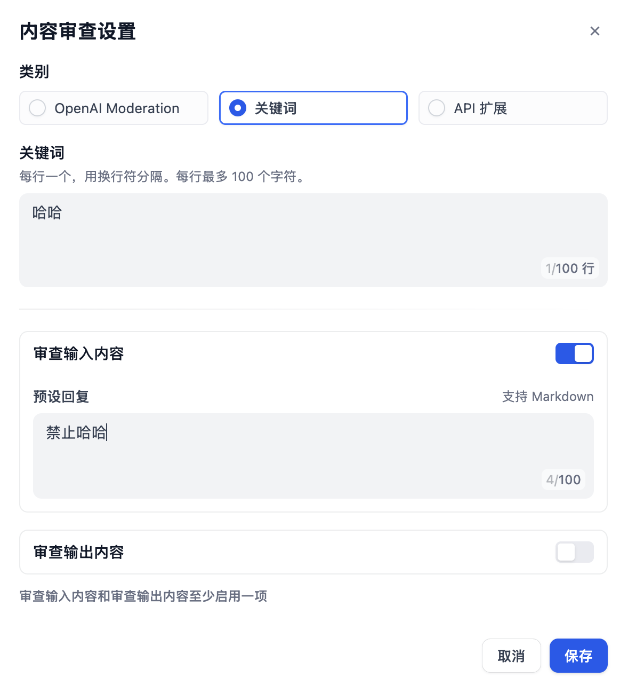
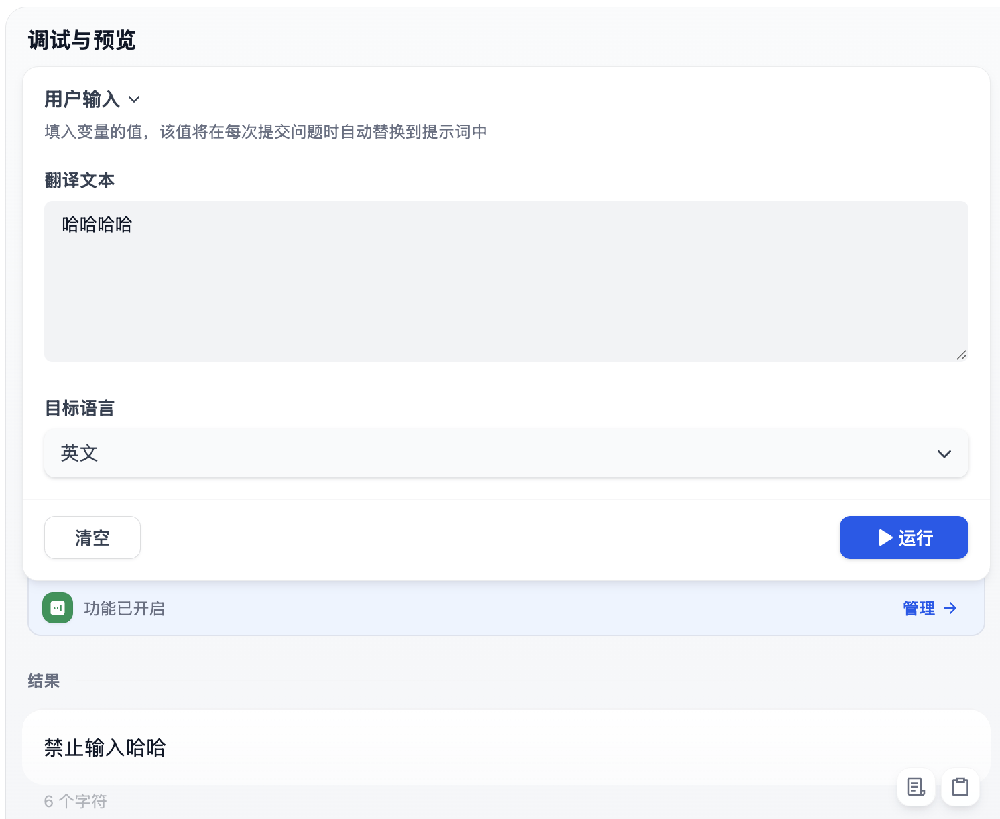
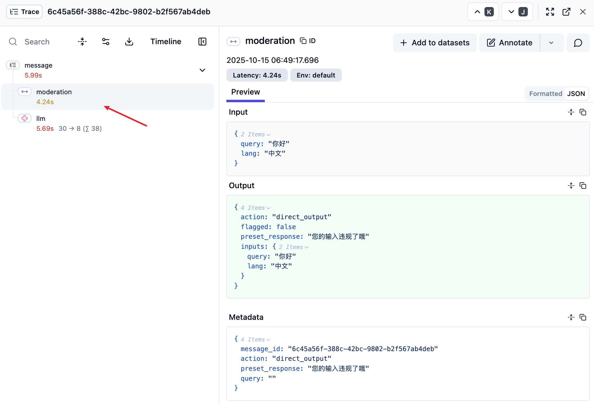
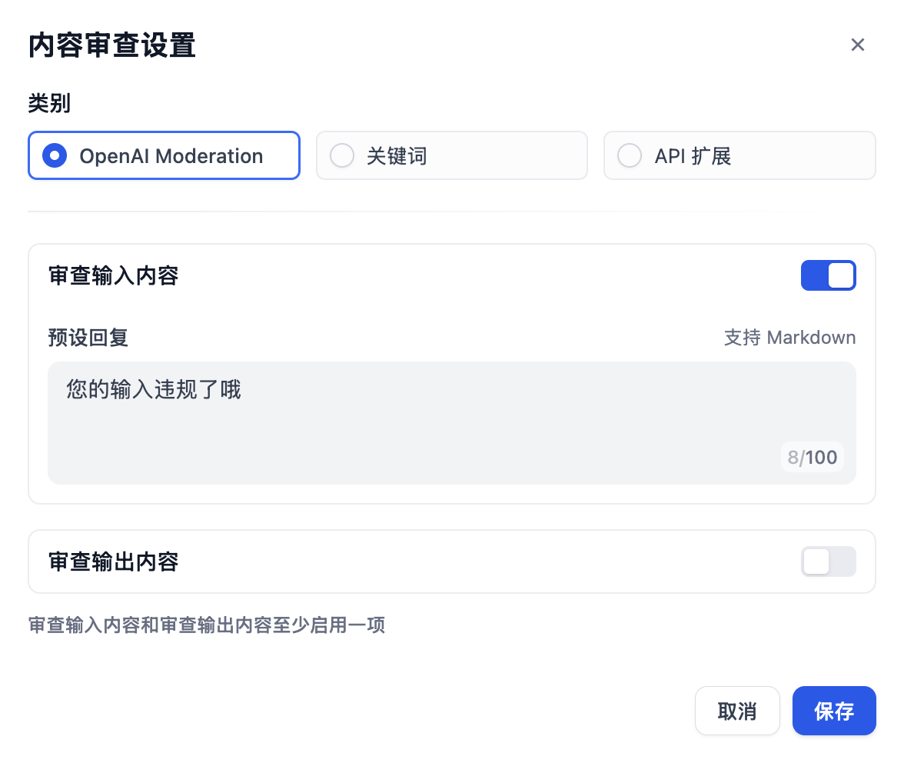
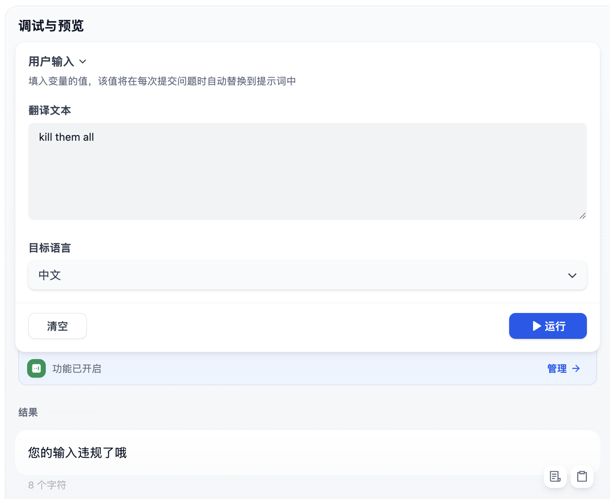

# 深入 Dify 的应用运行器之内容审核

在上一篇文章中，我们学习了 Dify 应用运行器的提示词组装机制，了解了从用户输入到模型调用的完整转换流程。今天我们将继续深入 `CompletionAppRunner` 的 `run()` 方法源码，详细讲解其中的内容审核相关逻辑，包括输入审核、托管审核和输出审核，以及审核的三种实现方式。

## 应用运行器流程回顾

让我们先回顾一下 `CompletionAppRunner` 的 `run()` 方法的核心流程，在这个流程中，内容审核扮演着重要的安全守门员角色：



可以看到，Dify 在输入处理时设置了两道内容安全防线：

1. **输入审核**：在第一次提示词组装后，根据已配置的审核策略，检查用户输入是否包含违规内容；
2. **托管审核**：在第二次提示词组装后，模型调用前，对完整的提示词进行合规性检查；托管审核是 Dify 提供的一个系统级别的额外安全层，它是在用户配置的常规审核机制之外，由 Dify 平台自动提供的内容安全保障服务；

此外，Dify 还有一套输出审核机制，在生成最终的输出内容时触发。通过这三重保障，确保了 AI 应用的内容安全。

## 输入审核

输入审核紧跟在第一次提示词组装之后，代码如下：

```python
# 第一次提示词组装
prompt_messages, stop = self.organize_prompt_messages(...)

try:
  # 输入内容审核
  _, inputs, query = self.moderation_for_inputs(
    app_id=app_record.id,
    tenant_id=app_config.tenant_id,
    app_generate_entity=application_generate_entity,
    inputs=inputs,
    query=query or "",
    message_id=message.id,
  )
except ModerationError as e:
  # 审核失败，直接返回预设回复
  self.direct_output(
    queue_manager=queue_manager,
    app_generate_entity=application_generate_entity,
    prompt_messages=prompt_messages,
    text=str(e),  # 预设的错误回复
    stream=application_generate_entity.stream,
  )
  return
```

当审核检测到违规内容时，会抛出 `ModerationError` 异常，应用运行器捕获异常后调用 `direct_output()` 方法，直接向用户返回预设的安全回复，跳过后续的模型调用流程。这里的关键是 `moderation_for_inputs()` 方法，它位于基类 `AppRunner` 中：

```python
def moderation_for_inputs(...) -> tuple[bool, Mapping[str, Any], str]:
  # 输入审核检查
  moderation_feature = InputModeration()
  return moderation_feature.check(...)
```

真正的审核逻辑位于 `InputModeration` 类的 `check()` 方法中：

```python
def check(
    self,
    app_id: str,
    tenant_id: str,
    app_config: AppConfig,
    inputs: Mapping[str, Any],
    query: str,
    message_id: str,
    trace_manager: Optional[TraceQueueManager] = None,
) -> tuple[bool, Mapping[str, Any], str]:

  # 检查应用是否启用了内容审查功能
  if not app_config.sensitive_word_avoidance:
    return False, inputs, query

  # 获取内容审查配置
  sensitive_word_avoidance_config = app_config.sensitive_word_avoidance
  moderation_type = sensitive_word_avoidance_config.type

  # 创建审核工厂实例
  moderation_factory = ModerationFactory(
    name=moderation_type,
    app_id=app_id,
    tenant_id=tenant_id,
    config=sensitive_word_avoidance_config.config
  )

  # 执行审核，并记录耗时
  with measure_time() as timer:
    moderation_result = moderation_factory.moderation_for_inputs(inputs, query)

  # 添加追踪记录（用于调试和监控）
  if trace_manager:
    trace_manager.add_trace_task(
      TraceTask(
        TraceTaskName.MODERATION_TRACE,
        message_id=message_id,
        moderation_result=moderation_result,
        inputs=inputs,
        timer=timer,
      )
    )

  # 处理审核结果
  if not moderation_result.flagged:
    return False, inputs, query  # 审核通过

  # 根据审核动作进行相应处理
  if moderation_result.action == ModerationAction.DIRECT_OUTPUT:
    # 直接输出预设回复
    raise ModerationError(moderation_result.preset_response)
  elif moderation_result.action == ModerationAction.OVERRIDDEN:
    # 覆盖用户输入
    inputs = moderation_result.inputs
    query = moderation_result.query

  return True, inputs, query
```

这个方法的执行流程如下：

1. **检查审核配置**：从应用配置中获取内容审查设置，如果没有配置，则跳过输入审核；
2. **创建审核实例**：根据配置的审核策略，通过审核工厂 `ModerationFactory` 创建对应的审核实例；
3. **执行审核检查**：调用具体的审核实现进行内容检查，并通过追踪管理器将审核的输入、输出、耗时等添加到追踪记录；
4. **处理审核结果**：根据审核结果采取相应的行动，如果审核通过，继续后续流程；如果审核失败，支持 **直接输出预设回复** 和 **覆盖用户输入** 两种处理手段；

## 审核策略详解

应用开发者可以在功能设置里开启 “内容审查” 开关：



Dify 通过工厂模式支持多种审核策略：

* **关键词**：这是最简单的一种审核策略，开发者可以定义需要审查的敏感词，当用户输入中包含这些关键词时触发，返回预设的回复内容；
* **OpenAI Moderation**：调用 OpenAI 的 [Moderation API](https://platform.openai.com/docs/guides/moderation/overview) 实现内容审查；
* **API 扩展**：不同的企业内部往往有着不同的内容审查机制，Dify 支持通过 API 扩展的方式实现高度自定义的审核策略；

### 关键词策略

在应用编排页面，打开 “内容审查设置” 对话框，类别选择 “关键词”，在输入框中填上需要审查的敏感词，1 行 1 个，最多 100 行：



然后选择 “审查输入内容”，并填上预设回复，点击 “确定” 后，在调试面板进行验证：



关键词策略的实现比较简单，直接基于字符串匹配即可，不区分大小写：

```python
class KeywordsModeration(Moderation):
  name: str = "keywords"

  def moderation_for_inputs(self, inputs: dict, query: str = "") -> ModerationInputsResult:
    flagged = False
    preset_response = ""

    if self.config["inputs_config"]["enabled"]:
      preset_response = self.config["inputs_config"]["preset_response"]

      # 将查询内容也加入检查范围
      if query:
        inputs["query__"] = query

      # 过滤掉空关键词
      keywords_list = [
        keyword for keyword in self.config["keywords"].split("\n")
        if keyword
      ]

      # 执行关键词违规检查
      flagged = self._is_violated(inputs, keywords_list)

    return ModerationInputsResult(
      flagged=flagged,
      action=ModerationAction.DIRECT_OUTPUT,
      preset_response=preset_response
    )

  def _is_violated(self, inputs: dict, keywords_list: list) -> bool:
    # 检查输入是否包含违规关键词
    return any(
      self._check_keywords_in_value(keywords_list, value)
      for value in inputs.values()
    )

  def _check_keywords_in_value(self, keywords_list: Sequence[str], value: Any) -> bool:
    # 在单个值中检查关键词（不区分大小写）
    return any(
      keyword.lower() in str(value).lower()
      for keyword in keywords_list
    )
```

关键词策略的特点是简单高效，是最基础也是最常用的审核策略。

### 审核结果处理

内容审核的结果通过 `ModerationInputsResult` 对象返回，它定义了审核系统的核心数据结构：

```python
class ModerationInputsResult(BaseModel):
  flagged: bool = False              # 是否违反审核规则
  action: ModerationAction           # 执行动作
  preset_response: str = ""          # 预设回复
  inputs: dict = Field(default_factory=dict)  # 处理后的输入
  query: str = ""                    # 处理后的查询
```

调用方通过 `flagged` 字段判断输入是否违反审核规则，如果违反，则执行 `action` 对应的动作。Dify 支持两种审核动作：

1. **直接输出（DIRECT_OUTPUT）**：这是最常见的处理方式，当检测到违规内容时，直接返回预设的回复消息；用户会看到类似 "您的输入包含不当内容，请重新输入" 这样的提示，而不会看到模型的任何响应；
2. **内容覆盖（OVERRIDDEN）**：这种方式更加智能，它不是简单地拒绝用户输入，而是对内容进行修正或替换；这种方式允许审核器删除或替换敏感词，然后继续正常的处理流程。例如，可以将 "这个人是个XX" 修正为 "这个人是个不好的人"；

我们可以开启应用追踪，在 LLMOps 平台查看审核的追踪记录：



### OpenAI Moderation 策略

在 “内容审查设置” 对话框中选择 “OpenAI Moderation” 类别：



同样勾选 “审查输入内容”，并填上预设回复，点击 “确定” 后，在调试面板进行验证：



OpenAI Moderation 策略的实现如下：

```python
class OpenAIModeration(Moderation):
  name: str = "openai_moderation"

  def moderation_for_inputs(self, inputs: dict, query: str = "") -> ModerationInputsResult:
    flagged = False
    preset_response = ""

    if self.config["inputs_config"]["enabled"]:
      preset_response = self.config["inputs_config"]["preset_response"]

      # 将查询内容加入检查
      if query:
        inputs["query__"] = query

      # 使用 OpenAI Moderation API 进行内容检查
      flagged = self._is_violated(inputs)

    return ModerationInputsResult(
      flagged=flagged,
      action=ModerationAction.DIRECT_OUTPUT,
      preset_response=preset_response
    )

  def _is_violated(self, inputs: dict):
    # 将所有输入值合并为一个文本
    text = "\n".join(str(inputs.values()))

    # 获取 OpenAI Moderation 模型实例
    model_manager = ModelManager()
    model_instance = model_manager.get_model_instance(
      tenant_id=self.tenant_id,
      provider="openai",
      model_type=ModelType.MODERATION,
      model="text-moderation-stable"
    )

    # 调用 OpenAI Moderation API
    openai_moderation = model_instance.invoke_moderation(text=text)
    return openai_moderation
```

整体逻辑也很简单，直接调用 OpenAI 的 `text-moderation-stable` 模型即可。不过要注意的是，使用此策略需要提前在设置中添加 OpenAI 模型供应商，并启用对应的模型。

OpenAI Moderation 策略的优势是基于 OpenAI 训练的专业模型，能够更准确地识别各种类型的有害内容，包括暴力、性内容、自残、仇恨等多种分类。

### 学习 OpenAI Moderation API

这一节我们对 OpenAI 的 Moderation API 稍加介绍。其实，该 API 支持两种模型：

1. **omni-moderation-latest**（推荐）：最新的多模态模型，支持更多分类选项和文本+图像输入
2. **text-moderation-latest**（遗留）：仅支持文本输入的旧版模型

可以看到 Dify 使用的还是老版本的模型。

Moderation API 的基本用法如下：

```python
from openai import OpenAI

client = OpenAI()

response = client.moderations.create(
  model="omni-moderation-latest",
  input="kill them all"
)

print(response)
```

对于图像和文本的混合内容审核：

```python
response = client.moderations.create(
  model="omni-moderation-latest",
  input=[
    {"type": "text", "text": "需要检查的文本内容"},
    {
      "type": "image_url",
      "image_url": {
        "url": "https://example.com/image.png"
        # 也支持 base64 编码的图片: "data:image/jpeg;base64,abcdefg..."
      }
    }
  ]
)
```

API 响应结构如下：


```json
{
  "id": "modr-6796",
  "model": "omni-moderation-latest",
  "results": [
    {
      "flagged": true, // 是否被标记为有害内容
      "categories": {
        "harassment": false,
        "harassment/threatening": false,
        "hate": false,
        "hate/threatening": false,
        "illicit": false,
        "illicit/violent": true,
        "self-harm": false,
        "self-harm/instructions": false,
        "self-harm/intent": false,
        "sexual": false,
        "sexual/minors": false,
        "violence": true,  // 检测到暴力内容
        "violence/graphic": false
      },
      "category_scores": {
        // 每个类别的置信度分数 (0-1)
        "harassment": 0.1996759395892913,
        "violence": 0.9430467818012114,
        // ... 其他分数
      },
      "category_applied_input_types": {
        // 指明哪些输入类型触发了特定类别
        "harassment": [ "text" ],
        "violence": [ "text" ],
        // ... 其他类别
      }
    }
  ],
  "usage": { // 消耗的 token 数
    "prompt_tokens": 6,
    "completion_tokens": 0,
    "total_tokens": 6
  }
}
```

Moderation API 支持以下内容分类：

| 分类 | 描述 | 支持的输入类型 |
|------|------|---------------|
| **harassment** | 表达、煽动或促进对任何目标的骚扰语言 | 仅文本 |
| **harassment/threatening** | 包含暴力或严重伤害的骚扰内容 | 仅文本 |
| **hate** | 基于种族、性别、民族等的仇恨言论 | 仅文本 |
| **hate/threatening** | 包含暴力威胁的仇恨内容 | 仅文本 |
| **illicit** | 提供非法行为建议或指导的内容 | 仅文本（仅 omni 模型） |
| **illicit/violent** | 涉及暴力或获取武器的非法内容 | 仅文本（仅 omni 模型） |
| **self-harm** | 促进、鼓励或描述自残行为的内容 | 文本和图像 |
| **self-harm/intent** | 表达自残意图的内容 | 文本和图像 |
| **self-harm/instructions** | 教授自残方法的内容 | 文本和图像 |
| **sexual** | 旨在引起性兴奋的内容 | 文本和图像 |
| **sexual/minors** | 涉及18岁以下个体的性内容 | 仅文本 |
| **violence** | 描绘死亡、暴力或身体伤害的内容 | 文本和图像 |
| **violence/graphic** | 以图形方式描绘暴力的内容 | 文本和图像 |

## 托管审核

除了输入内容审核，Dify 还在模型调用前还会进行一次托管审核检查，这是第二道安全防线：

```python
hosting_moderation_result = self.check_hosting_moderation(
  application_generate_entity=application_generate_entity,
  queue_manager=queue_manager,
  prompt_messages=prompt_messages,
)

if hosting_moderation_result:
  return  # 审核失败，直接返回
```

**托管审核 (Hosting Moderation)** 是 Dify 提供的一个系统级别的额外安全层，由平台统一配置和管理，用户无法直接控制，属于平台安全策略的一部分。这个特性只在云托管环境下才生效，因此我们需要修改 `EDITION` 配置：

```
# 默认是 SELF_HOSTED 自托管
EDITION=CLOUD
```

并配置系统供应商：

```
HOSTED_OPENAI_TRIAL_ENABLED=true
HOSTED_OPENAI_QUOTA_LIMIT=999999
HOSTED_OPENAI_TRIAL_MODELS=
HOSTED_OPENAI_API_KEY=sk-...
HOSTED_OPENAI_API_BASE=...
```

然后启用托管审核：

```
HOSTED_MODERATION_ENABLED=true
HOSTED_MODERATION_PROVIDERS=openai
```

托管审核的核心逻辑位于 `core/helper/moderation.py` 文件：

```python
def check_moderation(tenant_id: str, model_config: ModelConfigWithCredentialsEntity, text: str) -> bool:

  # 1. 检查托管审核配置是否启用
  moderation_config = hosting_configuration.moderation_config

  # 2. 验证 OpenAI 提供商是否可用
  openai_provider_name = f"{DEFAULT_PLUGIN_ID}/openai/openai"

  # 3. 检查当前模型提供商是否在审核范围内
  if using_provider_type == ProviderType.SYSTEM and provider_name in moderation_config.providers:

    # 4. 文本分块处理（每块2000字符）
    length = 2000
    text_chunks = [text[i:i + length] for i in range(0, len(text), length)]

    # 5. 随机选择一个文本块进行审核
    text_chunk = secrets.choice(text_chunks)

    # 6. 调用 OpenAI 的 omni-moderation-latest 模型
    moderation_result = model_type_instance.invoke(
      model="omni-moderation-latest",
      credentials=hosting_openai_config.credentials,
      text=text_chunk
    )
```

这里主要关注几点：

1. 必须在 `.env` 文件中配置 OpenAI 系统供应商并启用托管审核，该功能才会生效；
2. 由于托管审核针对的是第二次组装后的提示词，包含外部数据和知识库，完整的上下文可能非常长，因此这里对文本进行分块处理，并随机选择一个文本块进行审核；通过这种随机采样的策略，不仅提高程序性能，也降低 API 调用成本；
3. 托管审核使用的是 OpenAI 最新的审核模型 `omni-moderation-latest` 模型，而不是输入审核的 `text-moderation-stable` 模型；
4. 托管审核失败后直接返回固定的礼貌拒绝响应，而非用户自定义的消息；
5. 托管审核是 Dify 平台自动提供的内容安全保障服务，不同于应用开发者只需关注用户的输入即可，平台侧需要关注模型的完整输入，包括开发者提供的知识库内容和外部接口数据，这也正是应用运行器中要进行两次提示词组装的根本原因。

### 用户审核和托管审核对比

下表对比了用户审核和托管审核的几点区别：

| 特征    | 用户审核 (User Moderation) | 托管审核 (Hosting Moderation) |
|-------|------------------------|---------------------------|
| 配置主体  | 应用开发者                 | Dify 平台                   |
| 检查内容  | 用户输入                    | 完整提示词                   |
| 检查时机 | 第一次提示词组装后             | 模型调用前                   |
| 配置方式 | 应用级配置                    | 系统级配置                   |
| 配置灵活性 | 高度可定制                  | 固定策略                      |
| 审核类型  | 关键词、OpenAI、API扩展等      | 仅 OpenAI omni-moderation  |
| 触发条件  | 用户启用                   | 系统自动判断                    |
| 失败响应  | 用户自定义                  | 固定响应                      |
| 性能策略  | 全文审核                   | 随机采样                      |

托管审核作为平台的最后一道防线，即使用户没有配置任何审核策略，或者用户配置的审核策略存在漏洞，平台仍能提供基础的内容安全保障，确保 Dify 平台的整体合规性和安全性。

## 输出审核

除了输入审核和托管审核，Dify 还支持对模型生成的输出内容进行审核。输出审核的实现位于 `OutputModeration` 类，当模型输出新的 token 时：

```python
def append_new_token(self, token: str) -> None:
  self.buffer += token
  if not self.thread:
    self.thread = self.start_thread()
```

启动一个后台审核线程：

```python
def worker(self, flask_app: Flask, buffer_size: int):
  while self.thread_running:
    moderation_buffer = self.buffer
    # 当缓冲区大小达到阈值或最终块时进行审核
    if chunk_length < buffer_size and not self.is_final_chunk:
      time.sleep(1)
      continue

    result = self.moderation(...)
    if result and result.flagged:
      # 触发替换事件
      self.queue_manager.publish(QueueMessageReplaceEvent(...))
```

输出审核的具体实现和输入审核是一样的，都是通过审核工厂 `ModerationFactory` 根据配置创建对应的审核实例，支持关键词、OpenAI Moderation 和 API 扩展三种策略。这其实都比较简单，输出审核真正的挑战 **在于实时性要求**，需要在内容流式传输过程中及时检测。Dify 的做法是将模型输出放到一个缓冲区中，然后启动一个后台审核线程，该线程持续监控缓冲区，当缓冲区大小达到 300 时触发审核，该值可以通过 `MODERATION_BUFFER_SIZE` 参数调整。一旦检测到违规内容，立即停止流式传输，并发送一个 `QueueMessageReplaceEvent` 替换事件。该事件会被发送到前端，前端直接将当前已显示内容替换为预设回复。

## 小结

今天我们深入分析了 Dify 应用运行器中的内容审核机制，从整体架构到具体实现，全面了解了 Dify 如何确保应用的内容安全。主要收获包括：

1. **多层防护体系**：Dify 设计了输入审核、托管审核和输出审核三道防线，确保全链路内容安全；
2. **多样化的审核实现**：支持多种审核方式的灵活配置，包括 OpenAI Moderation、关键词审核和 API 扩展三种方式，满足不同场景的需求；
3. **灵活的处理策略**：支持直接拒绝（DIRECT_OUTPUT）和内容覆盖（OVERRIDDEN）两种处理方式；
4. **实时审核能力**：针对流式输出场景，通过后台审核线程实现了分块实时审核机制。

细心的读者可能已经注意到了，关于内容审核还有一点没有讲到，那就是 API 扩展策略，我们将在下一篇文章中，学习外部数据集成的逻辑，到时候一起来看下 Dify 的扩展机制。
