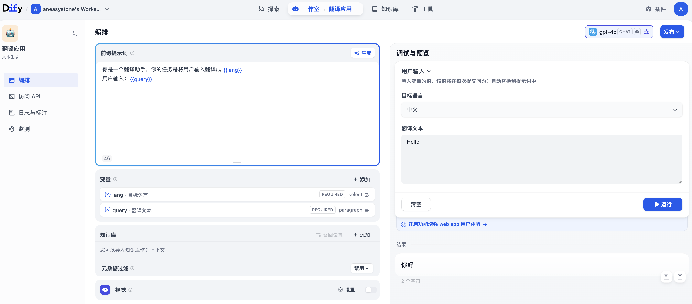
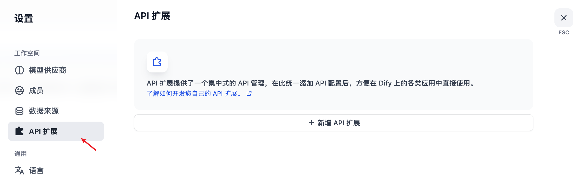
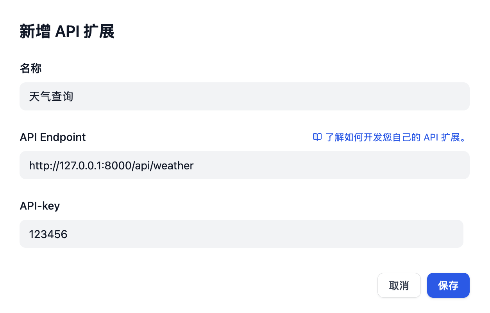
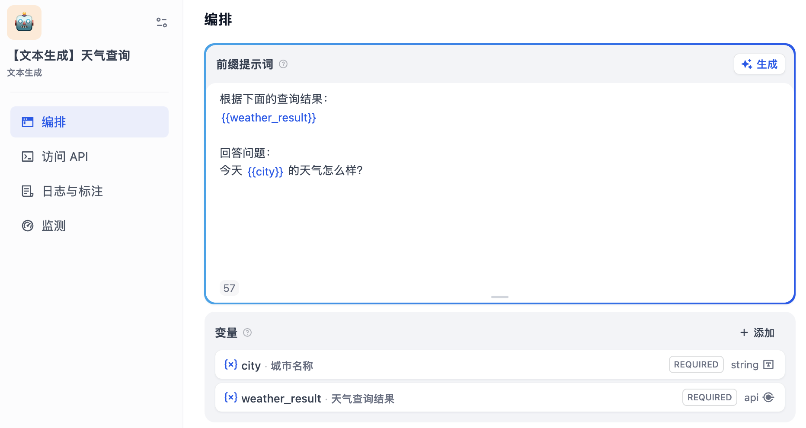
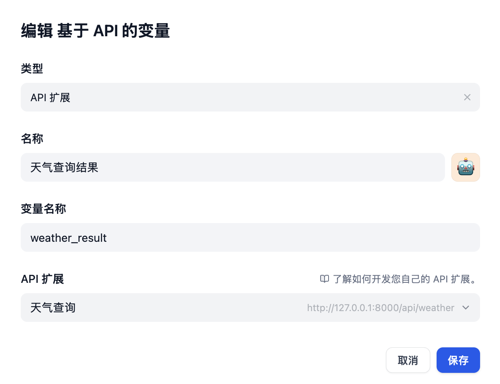
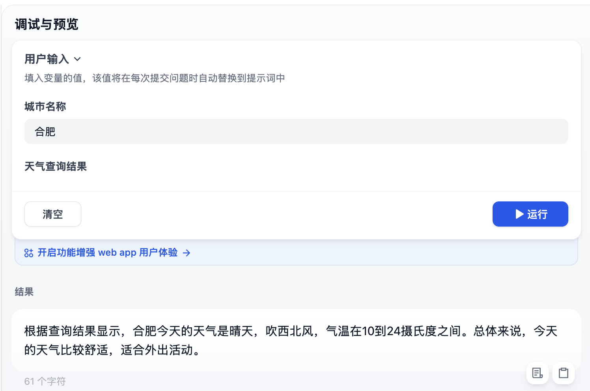
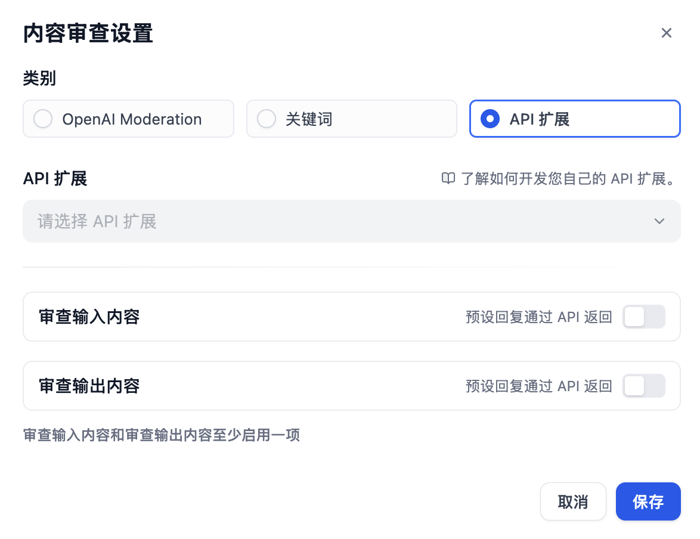
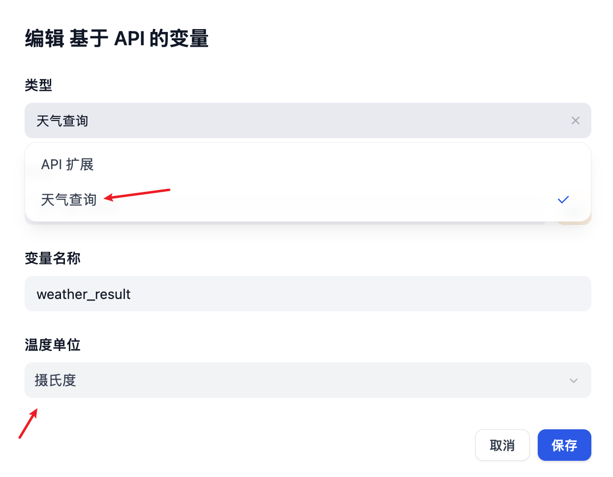
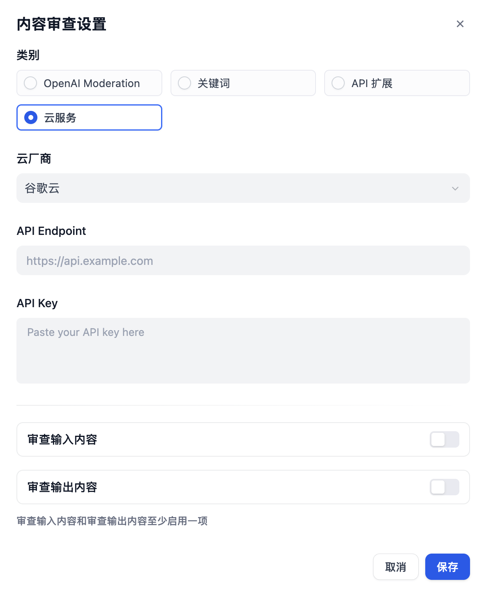

# 深入 Dify 的应用运行器之外部数据扩展

在创建 Dify 应用时，我们可以在提示词中嵌入用户自定义变量，提高应用的灵活性和功能性。比如在之前的文本生成应用中，我们使用 `{{lang}}` 和 `{{query}}` 两个变量，实现了一个简单的中英互译小助手：



Dify 支持文本、段落、下拉选项、数字和复选框等字段类型：


除此之外，它还支持以 API 扩展的方式创建 **基于 API 的变量**。

今天我们就来学习下 Dify 中与扩展相关的内容。

## 使用 API 扩展

首先我们进入 “设置” 页面，打开 “API 扩展” 菜单：



点击 “新增” 按钮，添加已开发好的 API 扩展：



然后创建一个 “天气查询” 应用，类型为文本生成：



我们为该应用添加两个变量：

* `city` - 城市名称，字段类型为文本
* `weather_result` - 天气查询结果，字段类型为基于 API 的变量，选择上一步添加的 API 扩展



接着编写如下提示词：

```
根据下面的查询结果：
{{weather_result}} 

回答问题：
今天 {{city}} 的天气怎么样？
```

一个简单的天气查询助手就开发好了：



可以看出，Dify 会自动调用 API 扩展的接口，并将获取到的外部数据组装至提示词中作为大模型的额外信息。

## 开发 API 扩展

接下来，让我们来看下这个 API 扩展是如何实现的？

首先我们要明确下扩展的概念，不同于 Dify 的插件机制，Dify 的 API 扩展主要针对这两个模块：

* `external_data_tool` 外部数据工具
* `moderation` 敏感内容审计

Dify 的 API 扩展遵循一定的规范，它会按照下面的格式调用你填写的接口地址：

```
POST {Your-API-Endpoint}

Authorization: Bearer {api_key}
Content-Type: application/json

{
  "point":  string, //  扩展点，不同模块可能包含多个扩展点
  "params": {
    ...  // 各模块扩展点传入参数
  }
}
```

其中 `point` 为扩展点，`params` 为不同扩展点对应的传入参数。Dify 支持下面几类不同的扩展点：

- `ping`：测试接口，在添加 API 扩展时通过该扩展点验证接口的可用性；当 API 接收到 `point=ping` 时，接口应返回 `result=pong` 固定值；
- `app.external_data_tool.query`：应用外部数据工具查询扩展点，将用户传入的变量和对话内容作为参数，传给 API；开发者需要实现对应工具的查询逻辑，并返回字符串类型的查询结果；
* `app.moderation.input`：输入内容审查扩展点，用于审查用户传入的变量以及对话内容；
* `app.moderation.output`：输出内容审查扩展点，用于审查大模型输出的内容，当输出为流式时，输出的内容将以 100 个字符为一个批次进行请求 API；

要实现基于 API 的变量，其实就是实现 `app.external_data_tool.query` 扩展点。该扩展点的输入参数如下：

```
{
  "point": "app.external_data_tool.query", // 扩展点类型，此处固定为 app.external_data_tool.query
  "params": {
    "app_id": string,  // 应用 ID
    "tool_variable": string,  // 外部数据工具变量名称，表示对应变量工具调用来源
    "inputs": {  // 用户传入的变量，key 为变量名，value 为变量值
      "var_1": "value_1",
      "var_2": "value_2",
      ...
    },
    "query": string | null  // 用户当前的对话内容
  }
}
```

该扩展点直接输出一个 `result` 字符串即可：

```
{
  "result": string
}
```

### 天气查询示例

这里是一个简单的外部数据工具示例，场景为根据城市获取天气信息作为上下文。创建 `main.py` 文件：

```python
import json
from fastapi import FastAPI, HTTPException, Header

app = FastAPI()

@app.post("/api/weather")
async def query_weather(data: dict, authorization: str = Header(None)):
    
  # 简单鉴权
  expected_api_key = "123456"
  auth_scheme, _, api_key = authorization.partition(' ')
  if auth_scheme.lower() != "bearer" or api_key != expected_api_key:
    raise HTTPException(status_code=401, detail="Unauthorized")

  print("接受到请求：" + json.dumps(data))
  
  # 扩展点
  point = data["point"]
  
  if point == "ping":
    # 测试
    return {
      "result": "pong"
    }

  if point == "app.external_data_tool.query":
    # 外部数据扩展
    return handle_app_external_data_tool_query(params=data["params"])
  
  raise HTTPException(status_code=400, detail="Not implemented")

def handle_app_external_data_tool_query(params: dict):
  # 模拟天气查询接口
  inputs = params.get("inputs")
  if inputs.get("city") == "合肥":
    return {
      "result": "天气晴，西北风，温度10-24摄氏度"
    }
  else:
    return {
      "result": "未知城市"
    }
```

代码比较简单，按照接口规范编写即可，它实现了 `ping` 和 `app.external_data_tool.query` 两个扩展点，并配置了 API Key 为 `123456`。这段代码基于 Python 的 `FastAPI` 框架，因此需要安装对应的依赖：

```
$ pip install fastapi[all] uvicorn
```

然后通过 `uvicorn` 启动 API 服务：

```
$ uvicorn main:app --reload --host 0.0.0.0
```

默认端口为 8000，通过 `curl` 验证之：

```
$ curl 'http://127.0.0.1:8000/api/weather' \
  -H 'Authorization: Bearer 123456' \
  -H 'Content-Type: application/json' \
  -d '{
    "point": "ping"
  }'
```

验证 OK 后，就可以在 Dify 配置页面添加该 API 扩展，然后在应用中选择它。调试时，通过日志可以看到，Dify 发送的请求内容如下：

```
{
  "point": "app.external_data_tool.query",
  "params": {
    "app_id": "6187c87a-9495-4412-8d22-0a11ec409376",
    "tool_variable": "weather_result",
    "inputs": {
      "city": "合肥"
    },
    "query": ""
  }
}
```

### 内容审核扩展

我们在上一篇文章中学习过，Dify 支持多种内容审核方式，除了 OpenAI Moderation 和关键词审核，它还支持 API 扩展方式来实现更加定制化的内容审核策略：



当开启输入内容审查时，Dify 会给相应的 API 扩展发送 HTTP POST 请求，我们必须实现 `app.moderation.input` 扩展点：

```
{
  "point": "app.moderation.input", // 扩展点类型，此处固定为 app.moderation.input
  "params": {
    "app_id": string,  // 应用 ID
    "inputs": {  // 用户传入的变量，key 为变量名，value 为变量值
      "var_1": "value_1",
      "var_2": "value_2",
      ...
    },
    "query": string | null  // 用户当前的对话内容
  }
}
```

接口返回需满足如下规范：

```
{
  "flagged": bool,  // 是否违反校验规则
  "action": string, // 动作，direct_output 直接输出预设回答; overridden 覆写传入变量值
  "preset_response": string,  // 预设回答（仅当 action=direct_output 返回）
  "inputs": {  // 覆写用户传入的变量，key 为变量名，value 为变量值（仅当 action=overridden 返回）
    "var_1": "value_1",
    "var_2": "value_2",
    ...
  },
  "query": string | null  // 覆写用户的对话内容。（仅当 action=overridden 返回）
}
```

当开启输出内容审查时，我们必须实现 `app.moderation.output` 扩展点：

```
{
  "point": "app.moderation.output", // 扩展点类型，此处固定为 app.moderation.output
  "params": {
    "app_id": string,  // 应用 ID
    "text": string  // 大模型的回答内容。当输出为流式时，此处为 100 字为一个分段的内容。
  }
}
```

接口返回需满足如下规范：

```
{
  "flagged": bool,  // 是否违反校验规则
  "action": string, // 动作，direct_output 直接输出预设回答; overridden 覆写传入变量值
  "preset_response": string,  // 预设回答（仅当 action=direct_output 返回）
  "text": string  // 覆写大模型的回答内容。（仅当 action=overridden 返回）
}
```

## 代码扩展

对于在本地部署 Dify 的开发人员来说，使用 API 扩展还是过于麻烦了，针对每个 API 扩展都要独立部署对应的 HTTP 服务。因此 Dify 还提供了另一种扩展方式 —— **代码扩展**，通过代码扩展，你可以在不破坏 Dify 原始代码逻辑的情况下，以代码形式扩展或增强程序的功能。

代码扩展也支持外部数据工具和敏感内容审核两个模块，我们只需要在对应模块下添加代码，遵循一定的接口规范，从而实现平台的横向扩展。

还是以天气查询扩展为例，我们可以在 `api/core/external_data_tool` 目录下新建相关的目录和文件：

```
api/core/external_data_tool/weather_search/
├── __init__.py
├── weather_search.py
└── schema.json
```

其中 `schema.json` 文件用于定义前端组件的样式：

```json
{
  "label": {
    "en-US": "Weather Search",
    "zh-Hans": "天气查询"
  },
  "form_schema": [
    {
      "type": "select",
      "label": {
        "en-US": "Temperature Unit",
        "zh-Hans": "温度单位"
      },
      "variable": "temperature_unit",
      "required": true,
      "options": [
        {
          "label": {"en-US": "Celsius", "zh-Hans": "摄氏度"},
          "value": "celsius"
        },
        {
          "label": {"en-US": "Fahrenheit", "zh-Hans": "华氏度"},
          "value": "fahrenheit"
        }
      ],
      "default": "celsius"
    }
  ]
}
```

`weather_search.py` 文件为具体的扩展实现，外部工具必须继承 `ExternalDataTool` 类：

```python
class WeatherSearch(ExternalDataTool):
  # 天气查询外部数据工具
  # 注意：name 必须与目录名和文件名保持一致
  name: str = "weather_search"

  @classmethod
  def validate_config(cls, tenant_id: str, config: dict) -> None:
    # 验证配置的有效性
    if not config.get('temperature_unit'):
      raise ValueError('temperature unit is required')

  def query(self, inputs: dict, query: Optional[str] = None) -> str:
    # 执行天气查询
    city = inputs.get('city')
    temperature_unit = self.config.get('temperature_unit')

    # 模拟天气 API 调用
    if temperature_unit == 'fahrenheit':
      return f'Weather in {city} is 32°F'
    else:
      return f'Weather in {city} is 0°C'
```

重启 Dify 应用，在添加基于 API 的变量时，就可以看到我们自定义的 “天气查询” 变量类型：



内容审核扩展和外部数据工具的实现基本类似，我们可以在 `api/core/moderation` 目录下新建相关的目录和文件，定义前端样式，实现审核接口，具体的内容此处不再展开，感兴趣的朋友可参考官方的文档：

* https://docs.dify.ai/zh-hans/guides/tools/extensions/code-based/README

当内容审核扩展开发就绪后，在 “内容审查” 的设置页面会多一个选项：



## 小结

我们今天主要学习了 Dify 的扩展机制在 **外部数据工具** 和 **敏感内容审计** 两个模块的应用，通过 API 扩展和代码扩展，开发者可以实现自定义的应用逻辑，创造高定制化的应用解决方案。

回顾 `CompletionAppRunner` 的 `run()` 方法，在第一次提示词组装和输入内容审核之后，接着就是外部数据的填充，通过扩展机制从外部数据源获取额外信息，动态地补充到应用的输入参数中，从而重新组装出最终的提示词。在第二次提示词的组装中，除了外部数据，还有另一个重要部分，那就是知识库的检索结果，我们明天将继续学习这一部分。
