# 深入 Dify 的应用运行器之知识库检索

在构建 AI 应用时，如何让大模型能够准确回答特定领域的问题，一直是开发者面临的挑战。虽然大模型具有丰富的通用知识，但在处理企业内部文档、产品规范或专业领域的问题时，往往存在信息过时、不够准确或无法涵盖最新动态的问题。Dify 的知识库功能就是为了解决这个痛点，它利用 **RAG（检索增强生成）** 技术，将静态的文档内容转化为可被动态检索和使用的知识源，从而提供给大模型用于回复用户的问题。

Dify 的所有应用类型都支持关联知识库。对于聊天应用和文本生成应用，我们之前在应用运行器的 `run()` 方法中已经看到，第二次提示词组装时，会将知识库检索内容作为上下文喂给大模型；对于智能体应用，知识库的使用稍有不同，它是作为工具提供给大模型动态调用的；而对于工作流应用，知识库则是一个独立的检索组件，可以灵活地被编排在应用流程中。

## 创建知识库

无论是哪种情况，我们首先得创建一个知识库。在 Dify 平台顶部导航中点击 “知识库”，然后点击 “创建知识库” 即可开始。Dify 支持三种方式来创建知识库：

1. **导入已有文本**：支持批量上传多种格式的文档，包括 TXT、Markdown、DOCX、HTML、JSON、PDF、CSV、Excel 等；
2. **同步自 Notion 内容**：支持将 Notion 内容导入到知识库，同步 Notion 内容前，须先绑定 Notion 空间；
3. **同步自 Web 站点**：支持 [Jina Reader](https://jina.ai/reader/)、[Firecrawl](https://www.firecrawl.dev/)、[WaterCrawl](https://github.com/watercrawl/watercrawl) 等网页内容提取工具，抓取 Web 站点的内容到知识库；

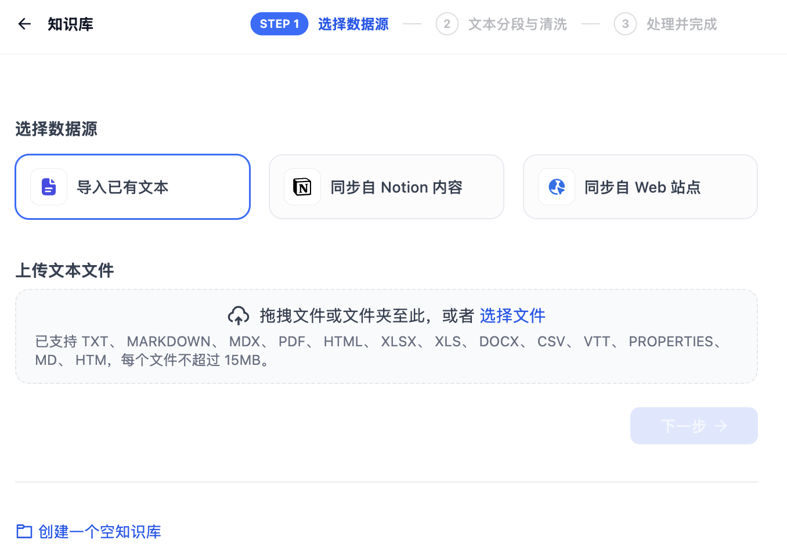

另外，Dify 还支持通过 API 和知识库 ID [连接到外部知识库](https://docs.dify.ai/zh-hans/guides/knowledge-base/connect-external-knowledge-base)，比如 [AWS Bedrock 知识库](https://docs.dify.ai/zh-hans/learn-more/use-cases/how-to-connect-aws-bedrock) 或 [LlamaCloud 知识库](https://github.com/langgenius/dify-official-plugins/tree/main/extensions/llamacloud) 等，感兴趣的同学可以参考官方文档自行尝试。

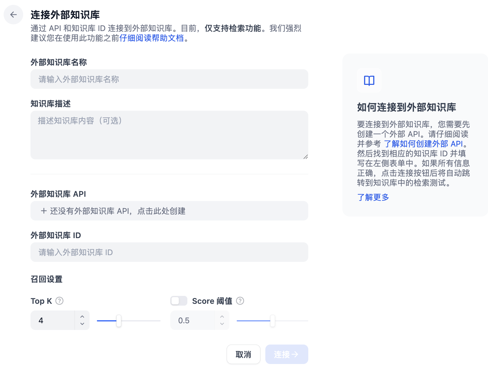

我们这里就以 Dify 文档中的 [术语表](https://docs.dify.ai/zh-hans/resources/termbase) 页面为例，演示下 Dify 知识库的基本用法。

### 分段设置

由于大语言模型的上下文窗口有限，无法一次性处理整个知识库的内容，因此需要对文档中的长文本进行分段处理。即使部分大模型已支持上传完整的文档文件，实验表明检索效率依然弱于检索单个内容分段。

合理的分段大小非常关键，它能够帮助模型准确地找到与问题最相关的内容，减少噪音信息。过大或过小的分段都可能影响召回的效果。

Dify 提供了两种分段模式，以适应不同类型的文档结构和应用场景：

#### 通用模式

系统按照用户自定义的规则将内容拆分为独立的分段。当用户输入问题后，系统自动分析关键词，并计算与知识库中各内容分段的相关度，选取最相关的内容分段发送给大模型。

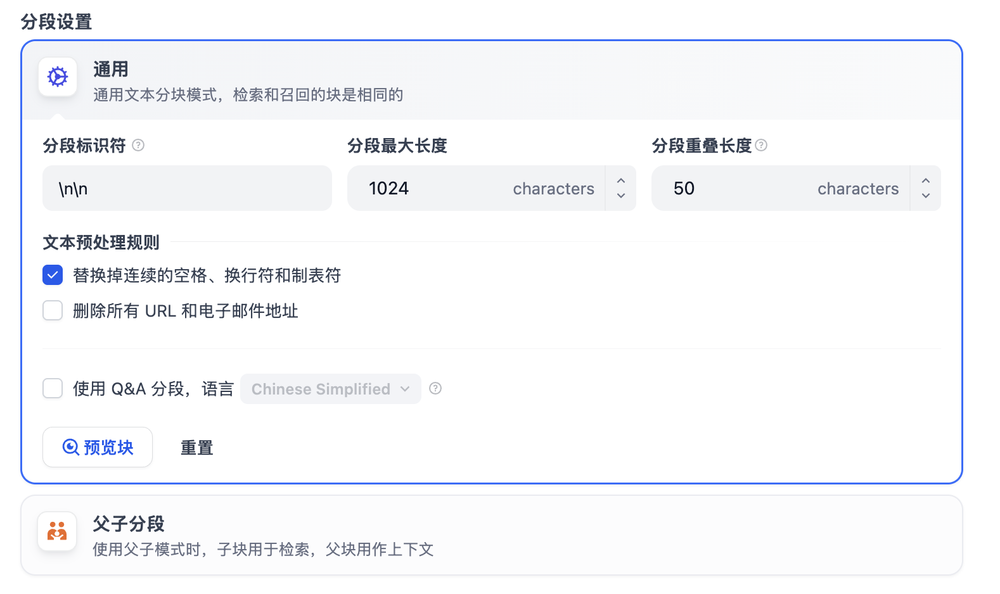

在通用模式下，你可以配置以下设置：

- **分段标识符**：用于文本分割的字符，默认值为 `\n\n`，即按照文章段落进行分段；
- **分段最大长度**：指定分段内的文本字符数最大上限，超出该长度时将强制分段，默认值为 1024 Tokens，最大上限为 4000 Tokens；
- **分段重叠长度**：设置分段之间的重叠长度可以保留分段之间的语义关系，建议设置为最大分段长度的 10%-25%，有助于提高召回效果；

为了保证知识库质量，Dify 还提供了两种文本预处理规则，用于过滤知识库中部分无意义的内容：

- 替换连续的空格、换行符和制表符
- 删除所有 URL 和电子邮件地址

#### 父子模式

父子模式采用双层分段结构，在精确度和上下文信息之间取得平衡。它包含两个层次：

- **父区块**：保持较大的文本单位（如段落、章节甚至整个文档），提供丰富的上下文信息
- **子区块**：较小的文本单位（如句子），用于精确检索，能更加精准地匹配用户所输入的问题

父子模式的配置包括父块的配置和子块的配置，如下所示：

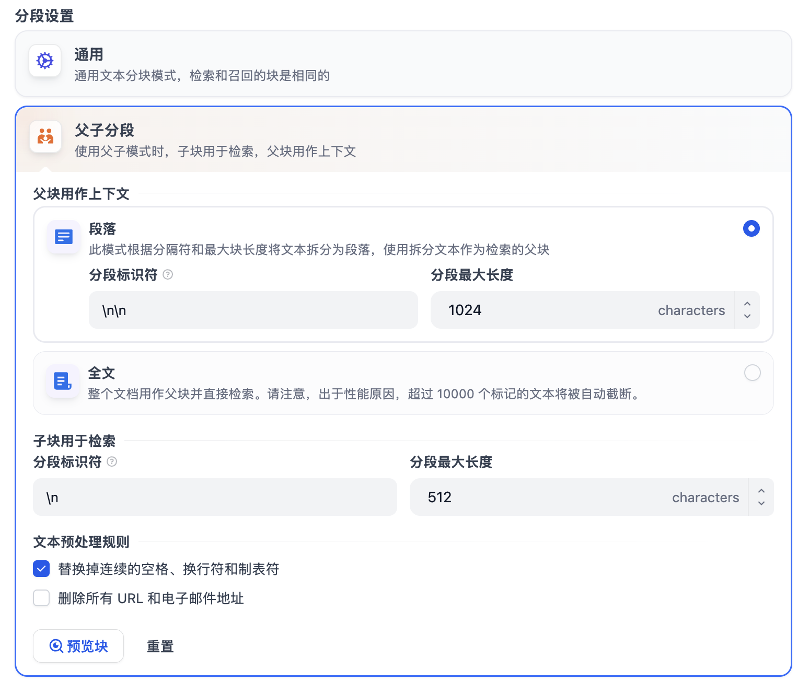

其工作原理是：系统首先通过子区块进行精确检索以确保相关性，然后获取对应的父区块来补充上下文信息，从而在生成响应时既保证准确性又能提供完整的背景信息。

父子模式的优势在于：

- 子分段能精准匹配用户问题
- 父分段提供完整的背景信息
- 检索效果优于传统的单层检索方式

#### Q&A 分段

在通用分段模式下，还有一个 Q&A 模式，开启该模式后，系统首先会对已上传的文本进行分段，然后自动为每个分段生成 Q&A 对。与常见的 **Q2P（用户问题匹配文本段落）** 策略不同，Q&A 模式采用 **Q2Q（问题匹配问题）** 策略。

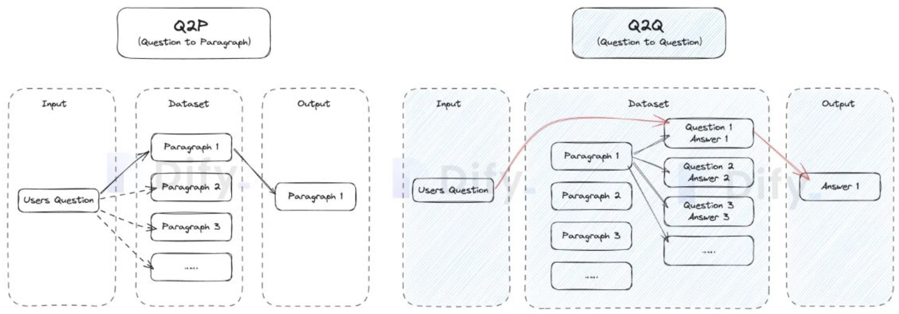

当用户提问时，系统会找出与之最相似的问题，然后返回对应的分段作为答案。这种方式更加精确，因为它直接针对用户问题进行匹配，可以更准确地帮助用户检索真正需要的信息。

> 注意，Q&A 模式要选择语言，生成对应语言的问题，启用该模式后会消耗更多的 Tokens，并且无法使用经济型索引方法。

### 索引方式

选定内容的分段模式后，接下来需要设置知识库的索引方法与检索设置。Dify 提供了两种索引方法：

#### 高质量索引

使用 Embedding 嵌入模型将分段的文本块转换为数字向量，帮助更有效地压缩与存储大量文本信息，使得用户问题与文本之间的匹配更加精准。

高质量索引支持 **向量检索**、**全文检索** 和 **混合检索** 三种检索设置。

#### 经济索引

在经济模式下，每个区块使用 10 个关键词进行检索，降低了准确度但无需产生费用。仅提供 **倒排索引** 方式选择最相关的区块。

### 检索设置

不用的索引方式支持的检索设置也不同，高质量索引支持 **向量检索**、**全文检索** 和 **混合检索** 三种，经济索引仅支持 **倒排索引** 一种。

#### 向量检索

将用户问题向量化，查询知识库中向量距离与之最接近的文本分段，也就是最相似的内容。

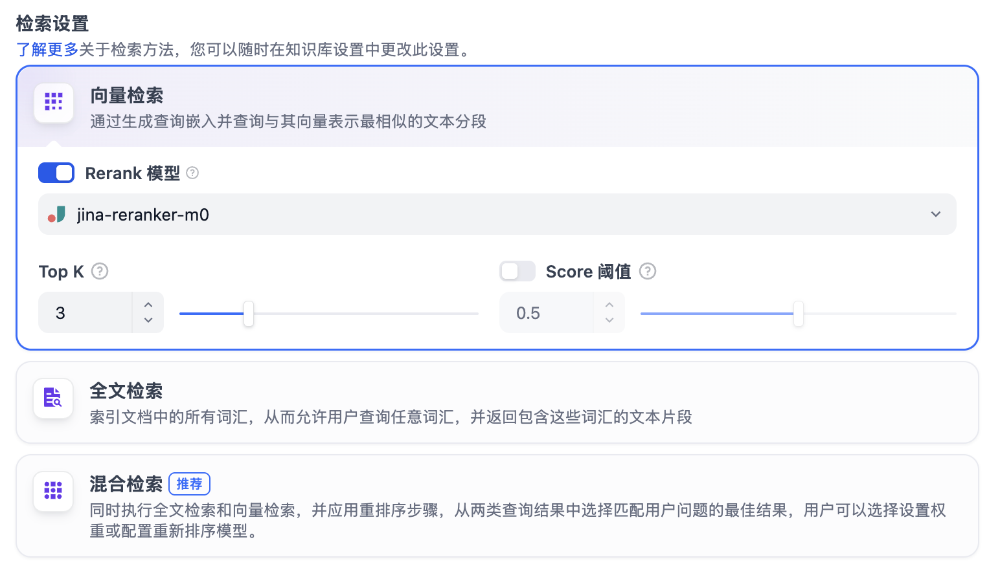

其配置参数有：

- **Rerank 模型**：开启后将使用第三方 Rerank 模型再一次重排序由向量检索召回的内容分段，以优化排序结果；
- **TopK**：用于筛选与用户问题相似度最高的文本片段，系统同时会根据模型的上下文窗口大小动态调整片段数量；
- **Score 阈值**：用于设置文本片段筛选的相似度阈值，只召回超过设置分数的文本片段；

#### 全文检索

也被称为 **关键词检索**，即索引文档中的所有词汇，用户输入问题后，通过关键词匹配知识库内对应的文本片段，返回符合关键词的文本片段。

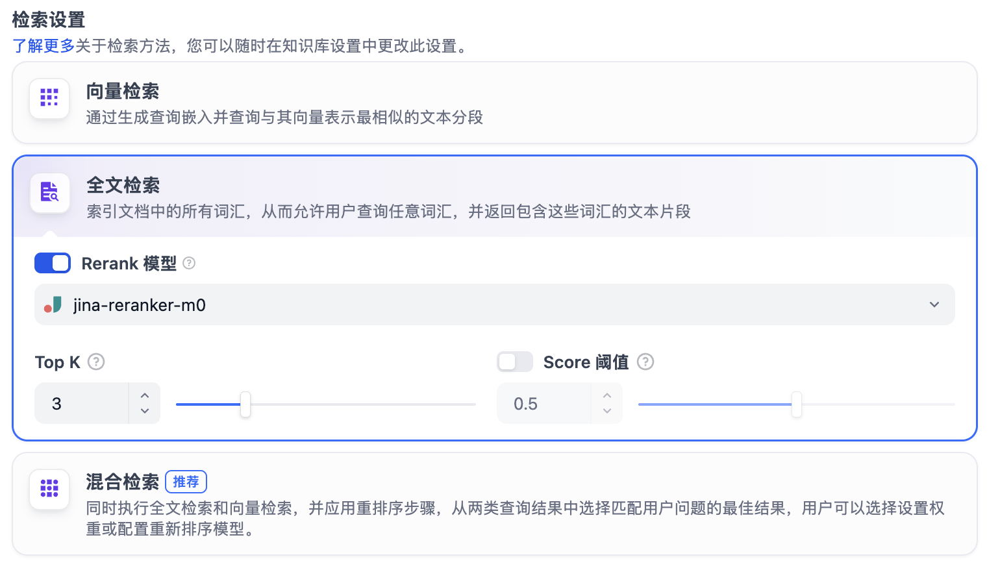

#### 混合检索

同时执行全文检索和向量检索，从查询结果中选择匹配用户问题的最佳结果。

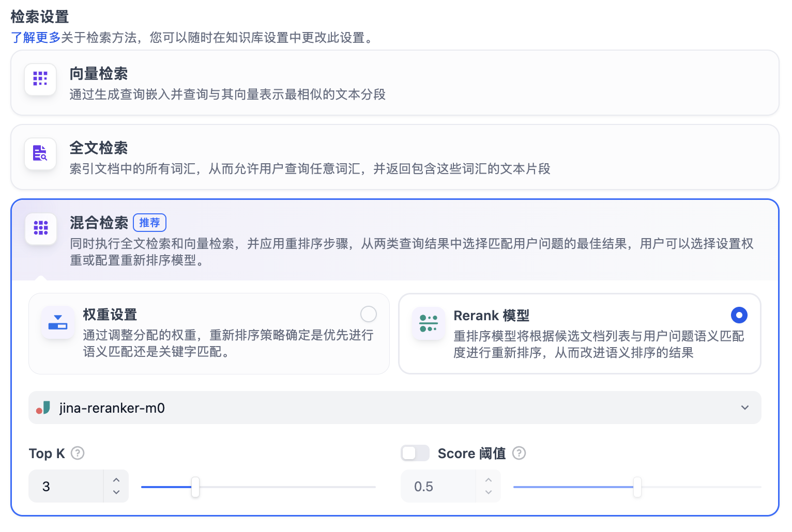

Dify 支持两种混合模式：

- **权重设置**：允许用户设置语义优先（向量检索）和关键词优先（关键词检索）的权重，可以不断调试二者的权重，找到符合业务场景的最佳比例；
- **Rerank 模型**：开启后将使用第三方 Rerank 模型再一次重排序由混合检索召回的内容分段，以优化排序结果；

#### 倒排索引

倒排索引是一种用于快速检索文档中关键词的索引结构，常用于在线搜索引擎。倒排索引仅支持 TopK 设置项。

## 在应用中集成知识库

至此，我们的 “术语表” 知识库已经创建完毕，接下来，我们要将该知识库集成到我们的 AI 应用中。我们进入工作台，创建一个聊天助手应用，取名为 “翻译专家”：

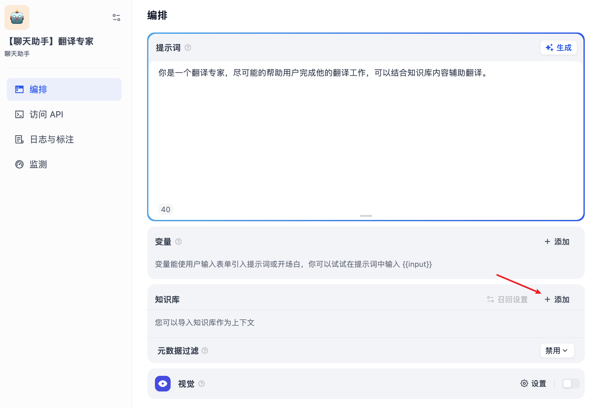

虽然大模型已经具备不错的翻译能力，但在遇到专业术语或领域知识时，往往词不达意，比如我们问 *ToT 是什么意思？*

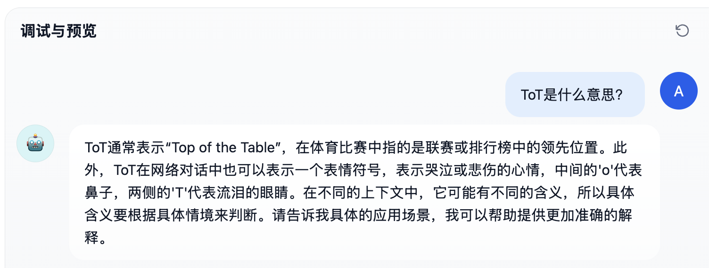

很显然它不知道我们要问的是其实是思维树的缩写，为解决这个问题，我们可以在知识库设置部分点击 “添加” 按钮，引用刚刚创建的 “术语表” 知识库，一个应用可以引用多个知识库；再点击 “召回设置” 配置检索方式：

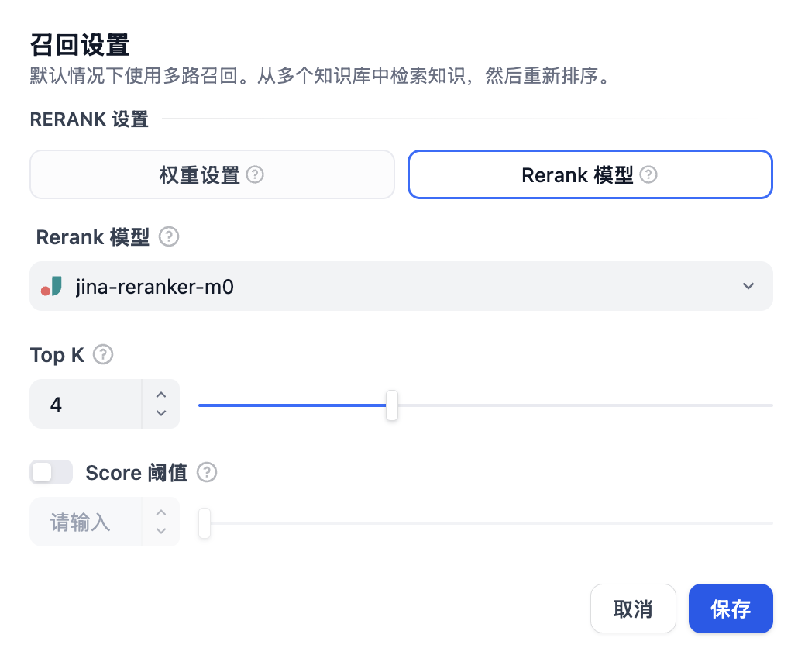

这个设置页面和上面的混合检索很像，只不过这里使用多路召回，系统会从多个知识库中检索知识，然后通过 Rerank 策略找到最适合的内容。

我们保持默认参数即可，然后在右侧的调试面板进行验证：

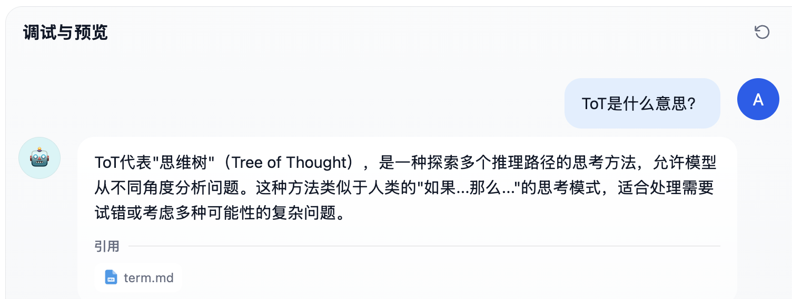

这次大模型就能正常回答我们的问题了。

### 引用和归属

在应用的功能选项中有一个 “引用和归属” 开关，默认是开启的：

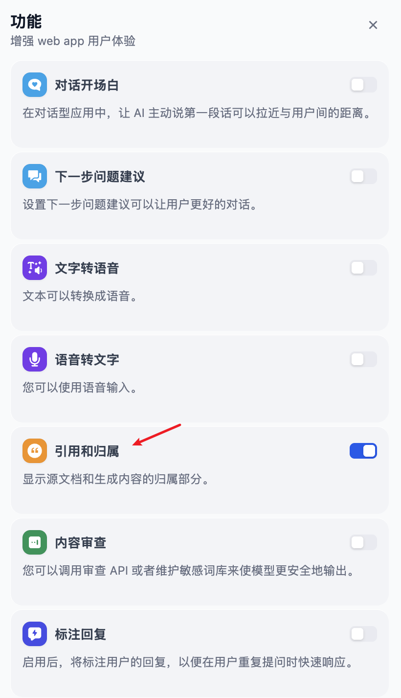

当助手回答用户问题后，若涉及已关联的知识库文档，将将回复内容下方标注引用来源，用户可查看到具体的引用段落信息，包括原始分段文本、分段序号、匹配度等：

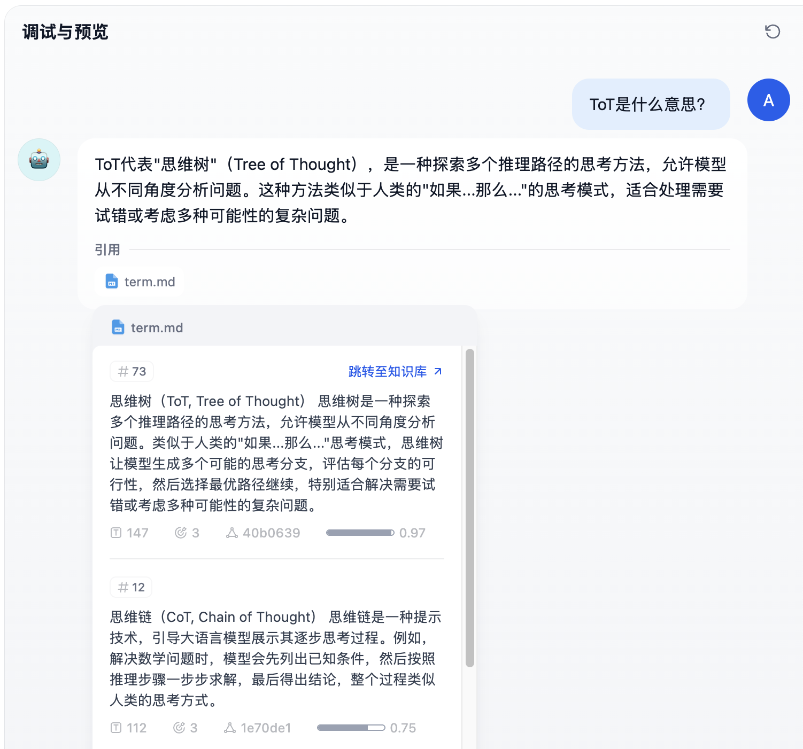

点击引用分段上方的 “跳转至知识库”，可以快捷访问该分段所在的知识库分段列表，方便开发者进行调试编辑。

### 元数据过滤

Dify 的知识库支持元数据功能，我们可以在知识库的管理界面，创建、修改和删除元数据字段（比如标签、类别、作者、时间等），并设置元数据的值：

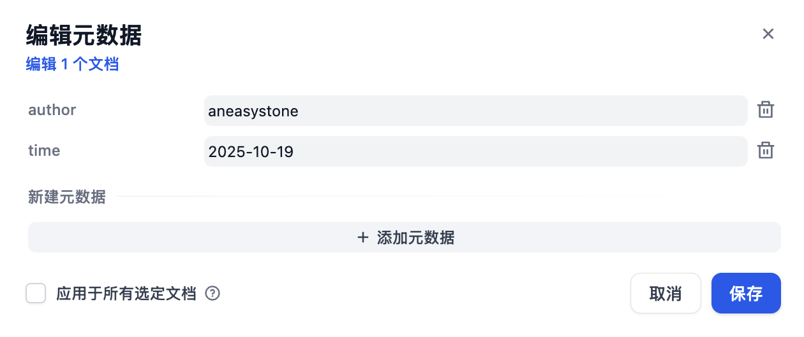

然后我们就可以在应用中使用这些元数据对文档进行精确过滤。一共有三种模式：

- **禁用模式**：不使用元数据过滤
- **自动模式**：系统根据用户问题自动生成过滤条件
- **手动模式**：用户手动配置过滤条件

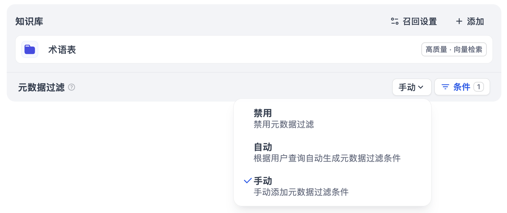

通过元数据，我们可以：

- **提升搜索效率**：用户可以根据元数据标签快速筛选和查找相关信息，节省时间并提高工作效率
- **增强数据安全性**：通过元数据设置访问权限，确保只有授权用户能访问敏感信息，保障数据的安全性
- **优化数据管理能力**：元数据帮助企业或组织有效分类和存储数据，提高数据的管理和检索能力，增强数据的可用性和一致性
- **支持自动化流程**：元数据在文档管理、数据分析等场景中可以自动触发任务或操作，简化流程并提高整体效率

## 未完待续

Dify 的知识库功能为开发者提供了一套完整的 RAG 解决方案，从文档上传、分段处理到检索配置，通过可视化的界面，开发者可以轻松创建和管理知识库，从而让 AI 应用能够访问实时、准确的外部知识，提升回答的质量和可信度。

今天主要是对 Dify 的知识库功能走马观花地过了一遍，对其有一个整体感性的认识，明天我们将继续深入源码，重点看下知识库检索这块的实现。
