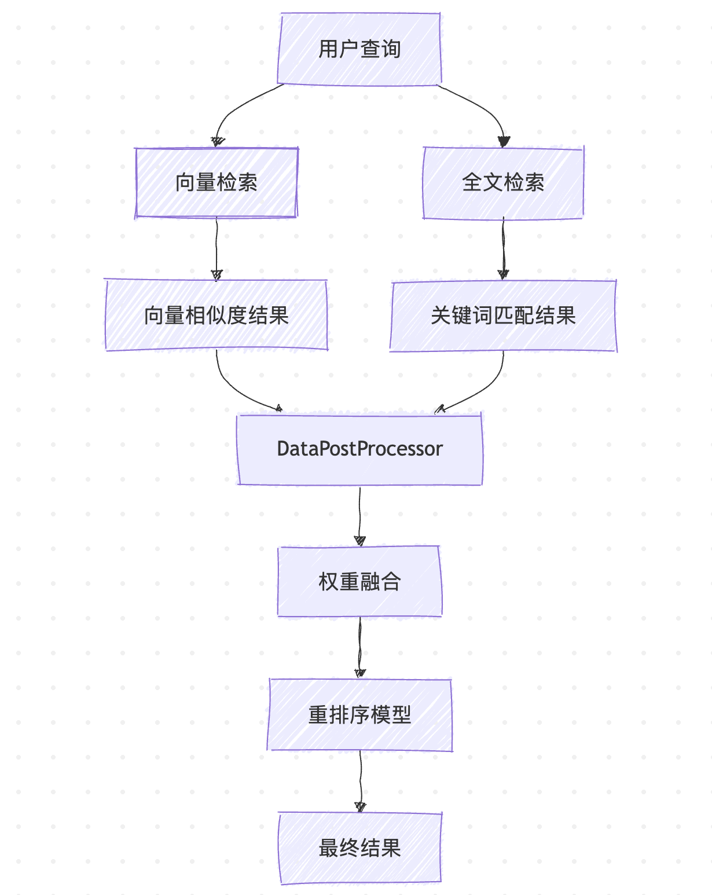

# 深入 Dify 的应用运行器之知识库检索（续）

在上一篇文章中，我们从界面操作的角度了解了 Dify 知识库的功能特性，包括创建知识库、配置分段设置、选择索引方式和检索方法，以及如何在应用中集成知识库。通过这些配置，我们可以让 AI 应用获得外部知识的支持，实现更准确、更专业的回答。

今天我们将继续深入 `CompletionAppRunner` 的 `run()` 方法源码，详细分析知识库检索的具体实现原理，了解 Dify 如何将用户的查询转化为向量检索、如何处理多知识库场景，以及背后的技术机制。

## 应用运行器回顾

让我们先回顾一下 `CompletionAppRunner` 中知识库检索的流程：

```python
def run(...) -> None:

  # 1. 第一次提示词组装
  self.organize_prompt_messages(...)

  # 2. 输入内容审核
  self.moderation_for_inputs(...)

  # 3. 外部数据工具处理
  inputs = self.fill_in_inputs_from_external_data_tools(...)

  # 4. 知识库检索
  context = None
  if app_config.dataset and app_config.dataset.dataset_ids:

    # 创建回调处理器，用于记录检索命中信息
    hit_callback = DatasetIndexToolCallbackHandler(...)

    # 创建知识库检索器并执行检索
    dataset_retrieval = DatasetRetrieval(application_generate_entity)
    context = dataset_retrieval.retrieve(...)

  # 5. 第二次提示词组装，包含知识库上下文
  prompt_messages, stop = self.organize_prompt_messages(
    ..., context=context, ...
  )

  # 6. 后续处理：托管审核、令牌重计算、模型调用等
  ...
```

从代码中可以看出，知识库检索发生在外部数据工具处理之后，第二次提示词组装之前，确保将检索到的上下文信息整合到最终的提示词中。

## 知识库检索的核心逻辑

检索的核心逻辑封装在 `DatasetRetrieval` 类的 `retrieve()` 方法中：

```python
def retrieve(...) -> Optional[str]:
  
  # 从知识库列表中筛选出所有可用的知识库
  available_datasets = []
  for dataset_id in dataset_ids:
    # 从数据库获取知识库信息
    dataset_stmt = select(Dataset).where(Dataset.tenant_id == tenant_id, Dataset.id == dataset_id)
    dataset = db.session.scalar(dataset_stmt)
    # 跳过无效知识库
    if not dataset:
      continue
    # 跳过没有文档的内部知识库（外部知识库除外）
    if dataset and dataset.available_document_count == 0 and dataset.provider != "external":
      continue
    available_datasets.append(dataset)

  # 元数据过滤
  available_datasets_ids = [dataset.id for dataset in available_datasets]
  metadata_filter_document_ids, metadata_condition = self.get_metadata_filter_condition(
    available_datasets_ids,
    query,
    ...
  )

  # 单库检索策略 vs. 多库检索策略
  all_documents = []
  if retrieve_config.retrieve_strategy == DatasetRetrieveConfigEntity.RetrieveStrategy.SINGLE:
    # 判断模型是否支持工具调用，使用不同的选择策略
    planning_strategy = PlanningStrategy.REACT_ROUTER
    if ModelFeature.TOOL_CALL in features or ModelFeature.MULTI_TOOL_CALL in features:
        planning_strategy = PlanningStrategy.ROUTER
    # 单库检索策略：智能选择一个最相关的知识库
    all_documents = self.single_retrieve(...)
  elif retrieve_config.retrieve_strategy == DatasetRetrieveConfigEntity.RetrieveStrategy.MULTIPLE:
    # 多库检索策略：从所有知识库中检索并合并结果
    all_documents = self.multiple_retrieve(...)

  dify_documents = [item for item in all_documents if item.provider == "dify"]
  external_documents = [item for item in all_documents if item.provider == "external"]

  # 分离内部和外部文档
  retrieval_resource_list: list[RetrievalSourceMetadata] = ...
  document_context_list: list[DocumentContext] = ...
  
  # 引用归属
  if hit_callback and retrieval_resource_list:
    retrieval_resource_list = sorted(retrieval_resource_list, key=lambda x: x.score or 0.0, reverse=True)
    for position, item in enumerate(retrieval_resource_list, start=1):
      item.position = position
    hit_callback.return_retriever_resource_info(retrieval_resource_list)

  # 按分数排序并合并为最终上下文
  if document_context_list:
    document_context_list = sorted(document_context_list, key=lambda x: x.score or 0.0, reverse=True)
    return str("\n".join([document_context.content for document_context in document_context_list]))
  return ""
```

其主要逻辑包括：

- **知识库有效性验证**：首先，对知识库列表进行筛选，过滤掉无效知识库，以及没有文档的内部知识库；需要注意的是，外部知识库（`provider == "external"`）即使文档数量为 0 也会被保留，因为它们的文档数量统计可能不准确；
- **元数据过滤处理**：根据文档的属性（如标签、类别、时间等）对文档进行精确过滤，支持用户自定义过滤条件和大模型智能生成过滤条件；
- **执行检索策略**：在前文中我们提到，一个应用可以关联多个知识库，当面对多个知识库时，Dify 提供了两种检索策略：
    - **单库检索策略（SINGLE）**：采用智能路由的方式，从多个候选知识库中自动选择最适合的那一个进行检索；这种策略的优势是减少了检索时间和计算开销，特别适用于知识库间差异较大、各自专注于不同领域的场景；
    - **多库检索策略（MULTIPLE）**：并行检索所有配置的知识库，然后将结果进行合并、重排序和过滤；这种策略能够获得更全面的检索结果，适用于知识库间存在互补关系的场景；
- **结果格式化**：将检索到的文档转换为大模型可以理解的上下文格式；

## 元数据过滤功能

在实际检索之前，Dify 会先进行基于元数据的文档过滤，这是一个强大的功能，允许用户根据文档的属性（如标签、类别、时间等）进行过滤，这对于大型知识库的精准检索非常重要。系统支持三种元数据过滤模式：

1. **禁用模式（disabled）**：不使用元数据过滤，检索所有文档
2. **自动模式（automatic）**：系统根据用户问题自动生成过滤条件
3. **手动模式（manual）**：用户手动配置过滤条件

```python
def get_metadata_filter_condition(...) -> tuple[Optional[dict[str, list[str]]], Optional[MetadataCondition]]:
  
  if metadata_filtering_mode == "disabled":
    # 禁用模式
    return None, None
  elif metadata_filtering_mode == "automatic":
    # 自动模式，根据用户问题自动生成过滤条件
    automatic_metadata_filters = self._automatic_metadata_filter_func(
      dataset_ids, query, tenant_id, user_id, metadata_model_config
    )
    for sequence, filter in enumerate(automatic_metadata_filters):
      filters = self._process_metadata_filter_func(...)
  elif metadata_filtering_mode == "manual":
    # 手动模式，用户手动配置过滤条件
    if metadata_filtering_conditions:
      for sequence, condition in enumerate(metadata_filtering_conditions.conditions):
        # 支持变量替换
        expected_value = condition.value
        if expected_value is not None and condition.comparison_operator not in ("empty", "not empty"):
          if isinstance(expected_value, str):
            expected_value = self._replace_metadata_filter_value(expected_value, inputs)
        filters = self._process_metadata_filter_func(...)
  else:
    raise ValueError("Invalid metadata filtering mode")

  # 根据过滤条件筛选文档
  if filters:
    if metadata_filtering_conditions and metadata_filtering_conditions.logical_operator == "and":
      document_query = document_query.where(and_(*filters))
    else:
      document_query = document_query.where(or_(*filters))
  documents = document_query.all()
  # 根据知识库 ID 分组
  metadata_filter_document_ids = defaultdict(list) if documents else None
  for document in documents:
    metadata_filter_document_ids[document.dataset_id].append(document.id)
  return metadata_filter_document_ids, metadata_condition
```

其中手动模式没什么好讲的，直接根据用户配置组装过滤条件，唯一值得注意的一点是，在手动设置条件时可以使用变量，因此这里先对配置的值进行变量替换；而自动模式则是通过大模型实现，使用了专门的提示词模板，要求大模型分析用户查询并输出 JSON 格式的元数据过滤条件：

```
### 职位描述
您是一个文本元数据提取引擎，需根据用户输入提取文本的元数据，并设定元数据值。

### 任务
您的任务仅从提供的元数据列表中，提取输入文本中实际存在的元数据；并使用以下运算符来表达逻辑关系：

["contains", "not contains", "start with", "end with", "is", "is not", "empty", "not empty", "=", "≠", ">", "<", "≥", "≤", "before", "after"]

然后以 JSON 格式返回结果，其中键包括：

- metadata_fields（元数据字段）
- metadata_field_value（元数据字段值）
- comparison_operator（比较运算符）

### 格式
输入文本存储在变量 input_text 中，元数据以列表形式在变量 metadata_fields 中指定。

### 约束
您的响应中不得包含 JSON 数组以外的任何内容。
```

大模型从用户输入中提取出元数据并设置过滤条件，支持各种类型的比较操作，包括：

1. **文本比较**（contains, start with, end with, is, is not）
2. **数值比较**（=, ≠, >, <, ≥, ≤）
3. **时间比较**（before, after）
4. **存在性检查**（empty, not empty）

比如，用户输入这样的查询：

```
总结2023年的财务报告
```

大模型输出类似这样的结果：

```json
{
  "metadata_map": [
    {
      "metadata_field_name": "year",
      "metadata_field_value": "2023",
      "comparison_operator": "="
    },
    {
      "metadata_field_name": "category",
      "metadata_field_value": "财务",
      "comparison_operator": "contains"
    }
  ]
}
```

## 单库检索策略

单库检索策略适用于知识库主题相对独立的场景，系统会先从多个知识库中智能地选择一个最相关的知识库，然后再在该知识库中进行检索。选择策略根据模型的能力分为两种：

- **ROUTER 策略**：适用于支持工具调用的模型（如 GPT-4、Claude-3.5 等），使用函数调用方式让模型自主选择合适的知识库；这种方式下，每个知识库都被包装成一个工具，工具名称是知识库ID，工具描述是知识库的描述信息；模型会根据用户查询的内容，自主选择最合适的工具（即知识库）进行调用；
- **REACT_ROUTER 策略**：适用于不支持工具调用的模型，使用 ReAct（Reasoning + Acting）方式，通过推理步骤指导模型选择知识库；这种方式，系统会构造一个包含所有可用知识库工具的提示词，要求模型以特定的 JSON 格式输出决策；

```python
def single_retrieve(...) -> list[Document]:

  # 1. 构建知识库工具描述
  tools = []
  for dataset in available_datasets:
    description = dataset.description or f"useful for when you want to answer queries about the {dataset.name}"
    message_tool = PromptMessageTool(
      name=dataset.id,
      description=description,
      parameters={"type": "object", "properties": {}, "required": []},
    )
    tools.append(message_tool)

  # 2. 根据策略选择知识库
  dataset_id = None
  if planning_strategy == PlanningStrategy.REACT_ROUTER:
    # ReAct 方式
    react_multi_dataset_router = ReactMultiDatasetRouter()
    dataset_id = react_multi_dataset_router.invoke(query, tools, model_config, model_instance, user_id, tenant_id)
  elif planning_strategy == PlanningStrategy.ROUTER:
    # Function Call 方式
    function_call_router = FunctionCallMultiDatasetRouter()
    dataset_id = function_call_router.invoke(query, tools, model_config, model_instance)

  # ...
```

当选定知识库后，接下来就针对该库执行具体的检索操作：

```python
  # 3. 执行检索
  if dataset_id:
    dataset = db.session.scalar(select(Dataset).where(Dataset.id == dataset_id))
    if dataset:
      if dataset.provider == "external":
        # 外部知识库检索
        external_documents = ExternalDatasetService.fetch_external_knowledge_retrieval(...)
        results = [Document(page_content=doc.get("content"), metadata=doc.get("metadata"), provider="external") for doc in external_documents]
      else:
        # 内部知识库检索，根据索引技术选择检索方法
        retrieval_model_config = dataset.retrieval_model or default_retrieval_model
        if dataset.indexing_technique == "economy":
          retrieval_method = "keyword_search"
        else:
          retrieval_method = retrieval_model_config["search_method"]

        # 调用 RetrievalService 执行检索
        results = RetrievalService.retrieve(
          retrieval_method=retrieval_method,
          dataset_id=dataset.id,
          query=query,
          ...
        )
      return results
  return []
```

Dify 的知识库分为外部知识库和内部知识库：针对外部知识库，使用统一的 [外部知识库 API](https://docs.dify.ai/zh-hans/guides/knowledge-base/api-documentation/external-knowledge-api-documentation) 进行检索；针对内部知识库，根据知识库的索引配置选择合适的检索方法，最终调用 `RetrievalService` 进行实际的向量检索或关键词检索。

## 多库检索策略

多库检索策略适用于知识库内容互补的场景，系统会同时从多个知识库中检索，并通过重排序获得最佳结果。**实际上，我们在 Dify 页面上创建的应用，默认都是使用多库检索策略，好像没有看到哪里可以设置单库检索策略。**

多库检索策略的核心逻辑位于 `multiple_retrieve()` 方法：

```python
def multiple_retrieve(...):

  # 1. 一致性检查
  index_type_check = all(
    item.indexing_technique == available_datasets[0].indexing_technique
    for item in available_datasets
  )
  if not index_type_check and (not reranking_enable or reranking_mode != RerankMode.RERANKING_MODEL):
    raise ValueError("不同索引技术的知识库需要设置重排序模型")

  # 2. 为每个知识库创建检索线程
  threads = []
  all_documents: list[Document] = []
  for dataset in available_datasets:
    retrieval_thread = threading.Thread(
      target=self._retriever,
      kwargs={
        "flask_app": current_app._get_current_object(),
        "dataset_id": dataset.id,
        "query": query,
        "top_k": top_k,
        "all_documents": all_documents,  # 共享结果列表
        "document_ids_filter": document_ids_filter,
        "metadata_condition": metadata_condition,
      },
    )
    threads.append(retrieval_thread)
    retrieval_thread.start()

  # 3. 等待所有检索线程完成
  for thread in threads:
    thread.join()

  # 4. 结果融合和重排序
  if reranking_enable:
    # 开启重排序
    data_post_processor = DataPostProcessor(tenant_id, reranking_mode, reranking_model, weights, False)
    all_documents = data_post_processor.invoke(
      query=query, documents=all_documents,
      score_threshold=score_threshold, top_n=top_k
    )
  else:
    # 根据索引类型进行简单排序
    if index_type == "economy":
      all_documents = self.calculate_keyword_score(query, all_documents, top_k)
    elif index_type == "high_quality":
      all_documents = self.calculate_vector_score(all_documents, top_k, score_threshold)
    else:
      all_documents = all_documents[:top_k] if top_k else all_documents
  return all_documents
```

多库检索策略的流程主要分为三步：

1. **一致性检查**：确保所有知识库使用相同的索引技术，或者配置了重排序模型；
2. **并发检索**：开启多线程并发检索，每个线程检索一个知识库；根据知识库的类型调用不同的检索方法，使用 `ExternalDatasetService` 检索外部知识库，使用 `RetrievalService` 检索内部知识库，具体的逻辑和单库检索策略类似；
3. **结果融合和排序**：如果开启了重排序，通过 `DataPostProcessor` 对来自不同知识库的结果进行融合和排序；否则根据索引类型进行简单排序；

## 检索服务

`RetrievalService` 是 Dify 检索功能的核心服务类，支持多种检索方法的并发执行：

```python
class RetrievalService:
  
  # 核心检索方法
  @classmethod
  def retrieve(
    cls,
    retrieval_method: str,
    dataset_id: str,
    query: str,
    top_k: int,
    score_threshold: Optional[float] = 0.0,
    reranking_model: Optional[dict] = None,
    reranking_mode: str = "reranking_model",
    weights: Optional[dict] = None,
    document_ids_filter: Optional[list[str]] = None,
  ):

    # 使用线程池并发执行不同的检索方法
    with ThreadPoolExecutor(max_workers=dify_config.RETRIEVAL_SERVICE_EXECUTORS) as executor:  # type: ignore
      futures = []
      if retrieval_method == "keyword_search":
        # 关键词检索
        futures.append(
          executor.submit(cls.keyword_search, ...)
        )
      if RetrievalMethod.is_support_semantic_search(retrieval_method):
        # 语义检索（向量检索）
        futures.append(
          executor.submit(cls.embedding_search, ...)
        )
      if RetrievalMethod.is_support_fulltext_search(retrieval_method):
        # 全文检索
        futures.append(
          executor.submit(cls.full_text_index_search, ...)
        )
      # 等待所有检索任务完成
      concurrent.futures.wait(futures, timeout=30, return_when=concurrent.futures.ALL_COMPLETED)

    # 混合检索需要后处理
    if retrieval_method == RetrievalMethod.HYBRID_SEARCH.value:
      data_post_processor = DataPostProcessor(
        str(dataset.tenant_id), reranking_mode, reranking_model, weights, False
      )
      # 重排序
      all_documents = data_post_processor.invoke(
        query=query,
        documents=all_documents,
        score_threshold=score_threshold,
        top_n=top_k,
      )

    return all_documents
```

Dify 支持四种不同的检索方法：**关键词检索（Keyword Search）**、**向量检索（Embedding Search）**、**全文检索（Full-Text Search）** 和 **混合检索（Hybrid Search）**。其中混合检索就是同时执行向量检索和全文检索，因此这里使用线程池来并发执行，如果不是混合检索，这里实际上就是单线程。最后，针对混合检索的结果，还需要经过后处理，包括格式化、去重、重排序和阈值过滤等操作。

### 关键词检索

该检索方法适用于经济型索引，经济型索引使用关键词提取技术，为每个文档片段提取 10 个关键词，然后通过倒排索引进行检索。虽然准确度相对较低，但成本更加经济。其核心代码位于 `Keyword.search()` 方法：

```python
class Keyword:
  def __init__(self, dataset: Dataset):
    self._dataset = dataset
    self._keyword_processor = self._init_keyword()

  def _init_keyword(self) -> BaseKeyword:
    # 根据配置初始化关键词实现，目前仅支持基于 Jieba 分词的实现
    keyword_type = dify_config.KEYWORD_STORE
    keyword_factory = self.get_keyword_factory(keyword_type)
    return keyword_factory(self._dataset)

  @staticmethod
  def get_keyword_factory(keyword_type: str) -> type[BaseKeyword]:
    match keyword_type:
      case KeyWordType.JIEBA:
        # 使用 Jieba 库提取关键词
        from core.rag.datasource.keyword.jieba.jieba import Jieba
        return Jieba
      case _:
        raise ValueError(f"Keyword store {keyword_type} is not supported.")
  
  # 执行关键词检索
  def search(self, query: str, **kwargs: Any) -> list[Document]:
    return self._keyword_processor.search(query, **kwargs)
```

它通过 Jieba 库的 `jieba.analyse.extract_tags()` 方法提取用户问题的关键词，并和文档片段中的关键词进行匹配，根据匹配度计算得分，然后按得分排序得到检索结果。

```python
class JiebaKeywordTableHandler:
  
  def __init__(self):
    import jieba.analyse  # type: ignore
    from core.rag.datasource.keyword.jieba.stopwords import STOPWORDS
    jieba.analyse.default_tfidf.stop_words = STOPWORDS  # type: ignore

  def extract_keywords(self, text: str, max_keywords_per_chunk: Optional[int] = 10) -> set[str]:
    # 使用 Jieba 库提取关键词
    import jieba.analyse  # type: ignore
    keywords = jieba.analyse.extract_tags(
      sentence=text,
      topK=max_keywords_per_chunk,
    )

    return set(self._expand_tokens_with_subtokens(set(keywords)))
```

### 向量检索

这是一种基于向量相似度的检索方法，适用于高质量索引。其核心代码位于 `embedding_search()` 方法：

```python
@classmethod
def embedding_search(...):
  with flask_app.app_context():
    dataset = cls._get_dataset(dataset_id)
    vector = Vector(dataset=dataset)

    # 执行向量相似度搜索
    documents = vector.search_by_vector(
      query,
      search_type="similarity_score_threshold",
      top_k=top_k,
      score_threshold=score_threshold,
      filter={"group_id": [dataset.id]},
      document_ids_filter=document_ids_filter,
    )

    # 应用重排序（如果配置）
    if reranking_model and retrieval_method == RetrievalMethod.SEMANTIC_SEARCH.value:
      data_post_processor = DataPostProcessor(...)
      all_documents.extend(data_post_processor.invoke(...))
    else:
      all_documents.extend(documents)
```

Dify 支持多种向量数据库，通过工厂模式动态选择合适的向量存储实现，包括：

- **开源方案**：Chroma、Qdrant、Milvus、Weaviate、PGVector
- **云服务**：Pinecone、Elasticsearch、OpenSearch
- **企业级**：AnalyticDB、OceanBase、Oracle、TiDB

每种向量数据库都有对应的实现类，位于 `api/core/rag/datasource/vdb/` 目录下。它们都实现了统一的向量搜索接口：

```python
class VectorBase:

  def search_by_vector(
    self,
    query: str,
    search_type: str,
    top_k: int,
    score_threshold: Optional[float] = None,
    filter: Optional[dict] = None,
    document_ids_filter: Optional[list[str]] = None,
  ) -> list[Document]:
    # 向量相似度检索实现
    pass
```

### 全文检索

基于倒排索引的全文检索：

```python
@classmethod
def full_text_index_search(...):
  with flask_app.app_context():
    dataset = cls._get_dataset(dataset_id)
    vector_processor = Vector(dataset=dataset)

    # 执行全文搜索
    documents = vector_processor.search_by_full_text(
      cls.escape_query_for_search(query),
      top_k=top_k,
      document_ids_filter=document_ids_filter
    )

    # 同样支持重排序
    if reranking_model and retrieval_method == RetrievalMethod.FULL_TEXT_SEARCH.value:
      data_post_processor = DataPostProcessor(...)
      all_documents.extend(data_post_processor.invoke(...))
    else:
      all_documents.extend(documents)
```

Dify 的全文检索也是基于向量数据库实现的，它们同样也实现了统一的全文搜索接口：

```python
class VectorBase:

  def search_by_full_text(
    self,
    query: str,
    top_k: int,
    document_ids_filter: Optional[list[str]] = None,
  ) -> list[Document]:
    # 全文检索实现
    pass
```

### 混合检索

混合检索同时使用向量检索和全文检索，能够结合语义理解和精确匹配的优势，在大多数场景下提供更好的检索效果。



混合检索完成后，系统需要对结果进行后处理，包括格式化、去重、重排序和阈值过滤等操作。这个过程由 `DataPostProcessor` 负责执行：

```python
class DataPostProcessor:

  def invoke(...) -> list[Document]:
    if self.rerank_runner:
      documents = self.rerank_runner.run(query, documents, score_threshold, top_n, user)
    if self.reorder_runner:
      documents = self.reorder_runner.run(documents)
    return documents
```

Dify 将重排序分为两种：

- **重排序（Reranker）** - 这是比较常见的重排序策略，根据用户配置的重排序模式进行处理，又分为两种情况，一种是使用外部重排序模型（如 **Cohere**、**Jina AI** 等），一种是使用权重分数融合，最后排序后的结果通过分数阈值进行过滤，并截取 Top-N 结果；
- **重新排列（Reorder）** - 这是一种特殊的文档重排序策略，首先将文档按奇偶索引分离，然后将偶数位置的文档列表进行反转，最后将奇数位置文档和反转后的偶数位置文档合并；譬如原始文档顺序是 `[1,2,3,4,5,6]`，重排序后的结果是 `[1,3,5,6,4,2]`；这种排序策略可以缓解大模型的位置偏见，避免总是优先考虑列表前面的文档，不过这个策略默认并没有启用，可能只是一种实验性功能。

## 小结

经过上面的步骤，我们最终检索出和用户问题最相关的文档，然后我们还需要将检索到的文档转换为大模型可用的上下文格式。根据不同的分段模式，处理过程略有不同：

1. **普通分段**：直接根据 `index_node_id` 查找对应的文档分段
2. **父子分段**：先查找子分段，再根据 `segment_id` 查找父分段

上下文转换完成之后，经过第二次提示词组装，最终调用大模型，完成对用户问题的回答。

下面对今天的学习内容做一个总结：

- **元数据过滤**：支持自动模式和手动模式；**自动模式** 通过大模型分析查询自动生成过滤条件，智能且动态；**手动模式** 支持复杂的过滤条件配置和变量替换，灵活性强；
- **多层次检索策略**：支持单库检索策略和多库检索策略；**单库检索策略** 智能选择最相关的知识库，精准度高；**多库检索策略** 并发检索多个知识库，覆盖面广；
- **智能路由机制**：针对单库检索策略，系统根据模型特性自动选择函数调用或 ReAct 方式；**函数调用方式** 利用支持工具调用的模型原生能力，准确性更高；**ReAct 方式** 通过结构化提示词实现推理，兼容性更好；
- **多元化检索方法**：通过检索服务，Dify 集成了多种检索技术；**关键词检索** 基于精确匹配，适用于经济型索引；**向量检索** 基于向量相似度，理解能力强；**全文检索** 基于倒排索引，检索效率高；**混合检索** 融合了向量检索和全文检索两种方法的优势，并通过重排序得到更好的检索效果；
- **重排序优化**：支持外部重排序模型和权重分数融合两种重排序策略；
- **上下文构建**：将检索结果转换为大模型友好的格式，注意父子分段的处理过程；

至此，我们已经完成了 Dify 应用会话流程中几乎所有的源码解剖，目前还差最后一步，模型调用，我们明天继续。
