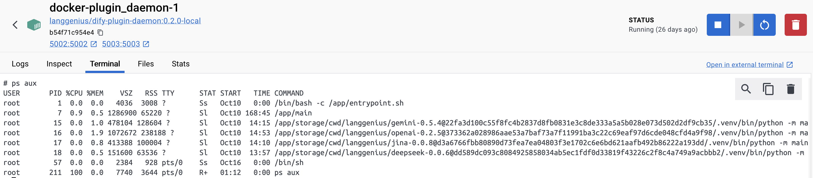
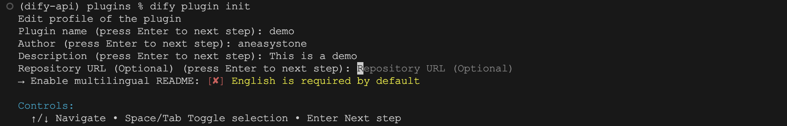
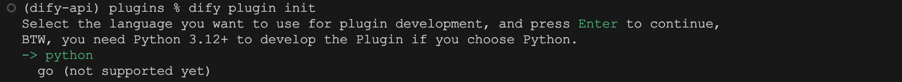
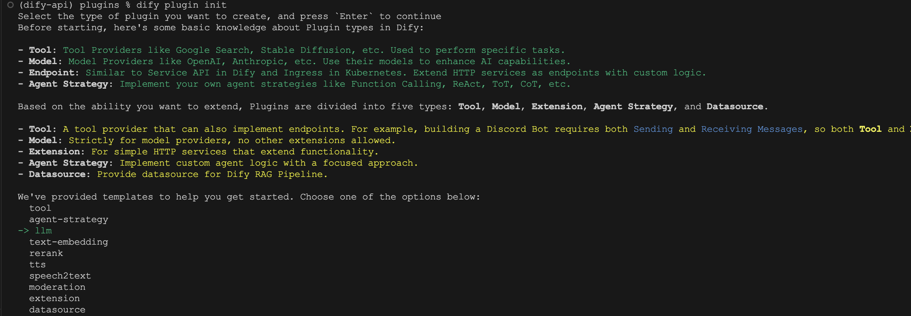
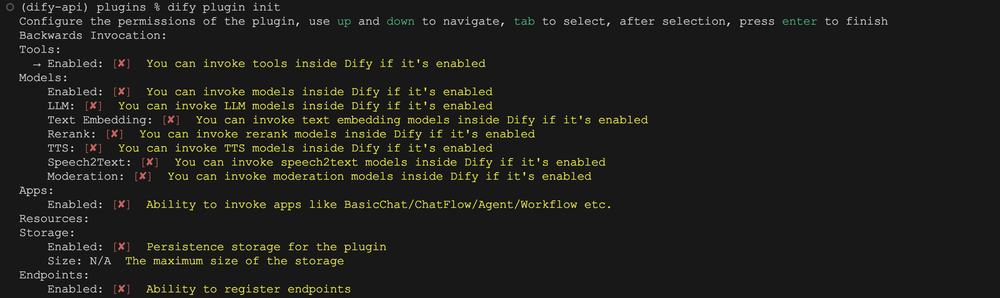
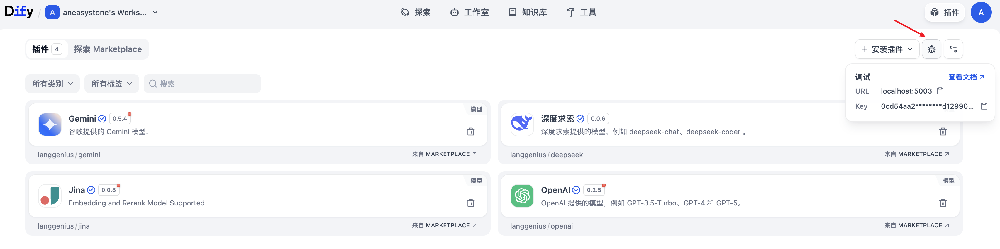
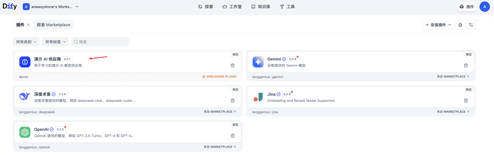
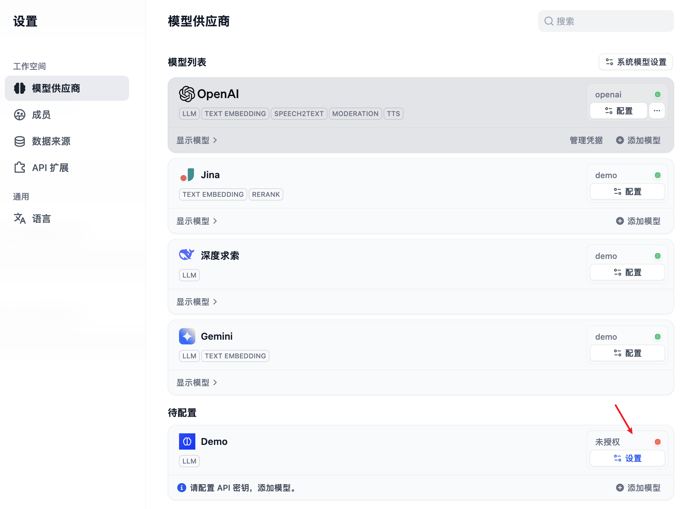
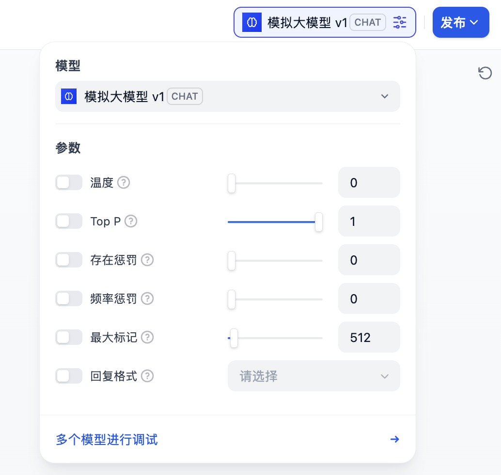
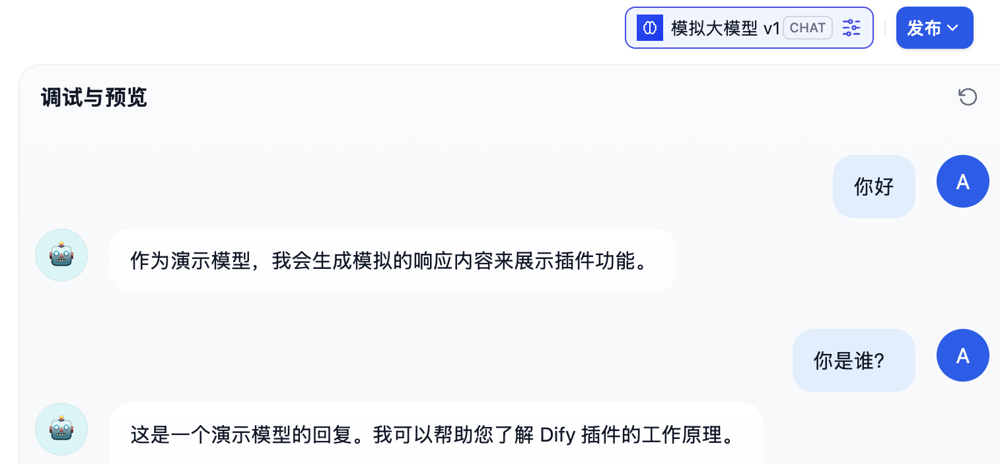

# 深入 Dify 的应用运行器之模型调用

在前面的几篇文章中，我们学习了 Dify 应用运行器中的外部数据扩展和知识库检索相关的内容，至此，万事俱备，只欠东风，我们已经到达应用运行器的收尾阶段。接下来就是重新组装提示词，调用大模型，完成对用户问题的回答。

我们今天就来深入学习模型调用相关的逻辑，以及 Dify 是如何通过插件化的架构来管理和调用各种大语言模型的，顺便看下 Dify 插件的实现原理，并通过一个自定义模型插件演示如何从零开发 Dify 插件。

## 模型实例

回顾 `CompletionAppRunner` 的 `run()` 方法，在处理完外部数据和知识库检索后，核心的模型调用逻辑如下：

```python
# 重新组装提示词，包含外部数据和知识库上下文
prompt_messages, stop = self.organize_prompt_messages(...)

# 创建模型实例
model_instance = ModelInstance(
  provider_model_bundle=application_generate_entity.model_conf.provider_model_bundle,
  model=application_generate_entity.model_conf.model,
)

# 调用大语言模型
invoke_result = model_instance.invoke_llm(
  prompt_messages=prompt_messages, # 处理后的提示消息
  model_parameters=application_generate_entity.model_conf.parameters,  # 模型参数（温度、max_tokens等）
  stop=stop, # 停止词
  stream=application_generate_entity.stream, # 是否流式输出
  user=application_generate_entity.user_id, # 用户ID（用于追踪和限流）
)
```

在 Dify 中，所有的模型调用都通过 `ModelInstance` 类来完成，这个类位于 `api/core/model_manager.py`，它是模型调用的统一入口。`ModelInstance` 不仅支持大语言模型，还支持多种其他类型的模型：

```python
class ModelInstance:
  
  # 大语言模型调用
  def invoke_llm(self, prompt_messages, model_parameters=None, tools=None, stop=None,
        stream=True, user=None, callbacks=None) -> Union[LLMResult, Generator]:
    # 调用大语言模型，支持文本生成、对话、工具调用等
    pass

  # 文本嵌入模型调用
  def invoke_text_embedding(self, texts: list[str], user: Optional[str] = None) -> TextEmbeddingResult:
    # 将文本转换为向量表示，用于语义搜索和相似度计算
    pass

  # 重排序模型调用
  def invoke_rerank(self, query: str, docs: list[str], score_threshold: Optional[float] = None,
          top_n: Optional[int] = None, user: Optional[str] = None) -> RerankResult:
    # 对文档进行重新排序，提高检索质量
    pass

  # 内容审核模型调用
  def invoke_moderation(self, text: str, user: Optional[str] = None) -> ModerationResult:
    # 检测文本中的不当内容，如暴力、色情、仇恨言论等
    pass

  # 语音转文本模型调用
  def invoke_speech2text(self, file: IO[bytes], user: Optional[str] = None) -> str:
    # 将音频文件转换为文本
    pass

  # 文本转语音模型调用
  def invoke_tts(self, content_text: str, voice: str, user: Optional[str] = None) -> bytes:
    # 将文本转换为音频，支持多种语音选择
    pass
```

这种统一的接口设计让开发者可以用一致的方式调用不同类型的 AI 模型。此外，`ModelInstance` 还实现了模型调用的负载均衡和容错机制，当用户配置了多个 API Key 时，系统会自动进行负载均衡；如果某个 API Key 遇到速率限制或认证错误时，系统会自动将其放入冷却期，并切换到其他可用的 API Key，确保服务的连续性。

## 不同类型的模型实现

所有的模型实现都继承自 `AIModel` 基类：

```python
class AIModel(BaseModel):
  tenant_id: str          # 租户 ID
  model_type: ModelType   # 模型类型（LLM、Embedding 等）
  plugin_id: str          # 插件 ID
  provider_name: str      # 供应商名称
  plugin_model_provider: PluginModelProviderEntity  # 插件模型供应商实体
```

具体的模型类型实现包括：

- `LargeLanguageModel` - 大语言模型
- `TextEmbeddingModel` - 文本嵌入模型
- `RerankModel` - 重排序模型
- `ModerationModel` - 内容审核模型
- `Speech2TextModel` - 语音转文本模型
- `TTSModel` - 文本转语音模型

每种模型类型都实现了对应的 `invoke()` 方法，并且它们的共同点是都会通过 `PluginModelClient` 与插件守护进程通信。以大语言模型为例，`LargeLanguageModel` 的实现如下：

```python
class LargeLanguageModel(AIModel):

  def invoke(...) -> Union[LLMResult, Generator[LLMResultChunk, None, None]]:
    # 调用大语言模型
    plugin_model_manager = PluginModelClient()
    result = plugin_model_manager.invoke_llm(
      tenant_id=self.tenant_id,
      user_id=user or "unknown",
      plugin_id=self.plugin_id,
      provider=self.provider_name,
      model=model,
      credentials=credentials,
      model_parameters=model_parameters,
      prompt_messages=prompt_messages,
      tools=tools,
      stop=list(stop) if stop else None,
      stream=stream,
    )
    # 返回流式或非流式结果 ...
```

其中，`PluginModelClient` 是 Dify 应用与插件守护进程的通信桥梁，它负责将模型调用请求转发给插件守护进程：

```python
class PluginModelClient(BasePluginClient):
  def invoke_llm(...) -> Generator[LLMResultChunk, None, None]:
    # 调用插件中的大语言模型
    response = self._request_with_plugin_daemon_response_stream(
      method="POST",
      path=f"plugin/{tenant_id}/dispatch/llm/invoke",
      type=LLMResultChunk,
      data=jsonable_encoder(
        # 构造请求数据
        {
          "user_id": user_id,
          "data": {
            "provider": provider,
            "model_type": "llm",
            "model": model,
            "credentials": credentials,
            "prompt_messages": prompt_messages,
            "model_parameters": model_parameters,
            "tools": tools,
            "stop": stop,
            "stream": stream,
          },
        }
      ),
      headers={
        "X-Plugin-ID": plugin_id,
        "Content-Type": "application/json",
      },
    )

    # 流式返回结果
    yield from response
```

## Dify 插件化架构

可以看出，真正的模型调用是由插件守护进程执行的，这也是 Dify 最具创新性的设计之一，将所有模型供应商都以插件的形式封装在独立的 [Dify Plugin Daemon](https://github.com/langgenius/dify-plugin-daemon) 服务中。通过这种插件化的架构设计，Dify 构建了一个开放、可扩展的模型生态系统。

当然，除了模型供应商，Dify 支持多种类型的插件：

1. **模型插件（Models）**：集成各种 AI 模型，如 LLM、Embedding、TTS 等
2. **工具插件（Tools）**：为 Agent 和工作流提供专业能力，如数据分析、内容处理等
3. **Agent 策略插件（Agent Strategies）**：创建自定义推理策略（ReAct, CoT, ToT），增强 Agent 能力
4. **扩展插件（Extensions）**：通过 HTTP Webhook 集成外部服务
5. **包插件（Bundles）**：将多个插件组合打包

Dify 的插件系统的由两部分组成：

1. **Dify Plugin Daemon** - 独立的插件守护进程，是一个 Go 开发的 Web 服务，提供了插件管理、插件调用等接口
2. **api/core/plugin/**** - Dify 主服务中的客户端集成代码，包括上面我们介绍的 `PluginModelClient`，通过 HTTP 请求调用插件服务的各项功能

尽管插件守护进程是用 Go 开发的，但是每个插件还是用 Python 开发的。插件服务为每个插件创建一个独立的 Python 虚拟环境，并拥有独立的工作目录，每个插件运行在独立的进程中。我们进到 `dify-plugin-daemon` 容器中，使用 `ps` 命令可以看到运行的每个插件进程：



## 从零开发一个模型插件

让我们通过一个具体的例子来了解如何开发一个模型插件。假设我们要接入一个新的大语言模型 "MockGPT"。

### 第一步：准备开发环境

首先安装 Dify 插件开发工具：

```bash
$ brew tap langgenius/dify
$ brew install dify
```

然后运行 `dify version` 验证安装

```bash
$ dify version
v0.3.1
```

如果能正确输出版本号，则说明安装成功。

### 第二步：初始化插件项目

运行 `dify plugin init` 创建新插件项目：



根据提示依次填写插件名称、作者、描述等信息，按回车进入下一步：



看提示 Dify 是计划支持 Python 和 Go 两种编程语言来开发插件的，只不过目前仅支持 Python，继续回车进入下一步：



这里对 Dify 的插件类型做了一个简单的介绍，并为我们准备了几个常见的插件模版，选择 `llm` 模版继续：



这里是对插件权限的配置，比如允许插件反向调用 Dify 中的工具或其他模型等，我们暂时不用管，保持默认即可。再次回车项目初始化完成：

```
[INFO]plugin demo created successfully, you can refer to `demo/GUIDE.md` for more information about how to develop it
```

生成的插件目录结构如下：

```
demo
├── GUIDE.md
├── PRIVACY.md
├── README.md
├── _assets
│   ├── icon-dark.svg
│   └── icon.svg
├── main.py
├── manifest.yaml
├── models
│   └── llm
│       ├── llm.py
│       └── llm.yaml
├── provider
│   ├── demo.py
│   └── demo.yaml
└── requirements.txt
```

### 第三步：插件清单

编辑 `manifest.yaml` 文件，完善插件信息（有一些基础信息上面已经填过），包括标签、描述、图标、资源等：

```yaml
version: 0.0.1
type: plugin
author: aneasystone
name: demo
label:
  en_US: Demo AI Provider                       # 修改
  zh_Hans: 演示 AI 供应商                         # 修改
description:
  en_US: A demo AI model provider for learning   # 修改
  zh_Hans: 用于学习的演示 AI 模型供应商             # 修改
icon: icon.svg
icon_dark: icon-dark.svg
resource:
  memory: 268435456
  permission: {}
plugins:
  models:
    - provider/demo.yaml
meta:
  version: 0.0.1
  arch:
    - amd64
    - arm64
  runner:
    language: python
    version: "3.12"
    entrypoint: main
  minimum_dify_version: null
created_at: 2025-10-22T07:45:17.322263+08:00
privacy: PRIVACY.md
verified: false
```

### 第四步：模型供应商配置

编辑 `provider/demo.yaml` 文件，修改其中的 `icon` 和 `provider_source` 两个地方（因为自动生成文件名不存在），其他参数保持不变：

```yaml
provider: demo
label:
  en_US: "Demo"
description:
  en_US: "Models provided by demo."
  zh_Hans: "Demo 提供的模型。"
icon_small:
  en_US: "icon.svg"  # 保证 _assets 目录下存在
icon_large:
  en_US: "icon.svg"  # 保证 _assets 目录下存在
background: "#E5E7EB"
help:
  title:
    en_US: "Get your API Key from demo"
    zh_Hans: "从 Demo 获取 API Key"
  url:
    en_US: "https://__put_your_url_here__/account/api-keys"
supported_model_types:
  - llm
configurate_methods:
  - predefined-model
  - customizable-model
model_credential_schema:
  model:
    label:
      en_US: Model Name
      zh_Hans: 模型名称
    placeholder:
      en_US: Enter your model name
      zh_Hans: 输入模型名称
  credential_form_schemas:
    - variable: openai_api_key
      label:
        en_US: API Key
      type: secret-input
      required: true
      placeholder:
        zh_Hans: 在此输入您的 API Key
        en_US: Enter your API Key
provider_credential_schema:
  credential_form_schemas:
    - variable: openai_api_key
      label:
        en_US: API Key
      type: secret-input
      required: true
      placeholder:
        zh_Hans: 在此输入您的 API Key
        en_US: Enter your API Key
models:
  llm:
    predefined:
      - "models/llm/*.yaml"
extra:
  python:
    provider_source: provider/demo.py # 修改
    model_sources:
      - "models/llm/llm.py"
```

### 第五步：模型配置

编辑 `models/llm/llm.yaml` 文件，修改模型名称，并根据实际情况配置你的模型特性、参数和价格：

```yaml
model: mock-gpt-v1     # 修改
label:
  zh_Hans: 模拟大模型 v1 # 修改
  en_US: Mock GPT v1   # 修改
model_type: llm
features:
  - multi-tool-call
  - agent-thought
  - stream-tool-call
model_properties:
  mode: chat
  context_size: 16385
parameter_rules:
  - name: temperature
    use_template: temperature
  - name: top_p
    use_template: top_p
  - name: presence_penalty
    use_template: presence_penalty
  - name: frequency_penalty
    use_template: frequency_penalty
  - name: max_tokens
    use_template: max_tokens
    default: 512
    min: 1
    max: 16385
  - name: response_format
    use_template: response_format
pricing:
  input: '0.003'
  output: '0.004'
  unit: '0.001'
  currency: USD
```

### 第六步：实现 MockGPT

编辑 `models/llm/llm.py` 文件，完成 MockGPT 模型的实现，代码逻辑很简单，随机选择一段话，并模拟流式输出：

```python
class MockGptLargeLanguageModel(LargeLanguageModel):
  """
  MockGPT 实现
  """

  def _invoke(...) -> Union[LLMResult, Generator]:
    """
    调用大语言模型
    """

    # 模拟响应内容
    demo_responses = [
      "这是一个演示模型的回复。我可以帮助您了解 Dify 插件的工作原理。",
      "作为演示模型，我会生成模拟的响应内容来展示插件功能。",
      "您好！这是 Demo AI 模型的模拟输出，用于演示插件开发流程。"
    ]

    response_text = random.choice(demo_responses)

    if stream:
      return self._handle_stream_response(model, prompt_messages, response_text)
    else:
      return self._handle_sync_response(model, prompt_messages, response_text)
   
  def _handle_stream_response(self, model: str, prompt_messages: List[PromptMessage], response_text: str) -> Generator:
    """
    处理流式响应
    """

    # 模拟流式输出
    words = response_text.split()
    for i, word in enumerate(words):
      chunk_text = word + (" " if i < len(words) - 1 else "")

      delta = LLMResultChunkDelta(
        index=0,
        message=AssistantPromptMessage(content=chunk_text),
        finish_reason=None if i < len(words) - 1 else "stop",
        usage=self._calc_usage(response_text) if i == len(words) - 1 else None
      )

      yield LLMResultChunk(
        model=model,
        prompt_messages=prompt_messages,
        system_fingerprint=None,
        delta=delta
      )

      # 模拟网络延迟
      time.sleep(0.1)

  def _handle_sync_response(self, model: str, prompt_messages: List[PromptMessage], response_text: str) -> LLMResult:
    """
    处理同步响应
    """
    return LLMResult(
      model=model,
      prompt_messages=prompt_messages,
      message=AssistantPromptMessage(content=response_text),
      usage=self._calc_usage(response_text),
      system_fingerprint=None
    )

  def _calc_usage(self, text: str) -> LLMUsage:
    """
    计算使用量（模拟）
    """
    prompt_tokens = 50  # 模拟
    completion_tokens = len(text.split())

    return LLMUsage(
      prompt_tokens=prompt_tokens,
      prompt_unit_price=0.001,
      prompt_price_unit=1000,
      prompt_price=0.00005,
      completion_tokens=completion_tokens,
      completion_unit_price=0.002,
      completion_price_unit=1000,
      completion_price=completion_tokens * 0.000002,
      total_tokens=prompt_tokens + completion_tokens,
      total_price=0.00005 + completion_tokens * 0.000002,
      currency="USD",
      latency=1.5
    )
   
  def get_num_tokens(...) -> int:
    """
    计算 token 数量（模拟）
    """
    total_text = ""
    for message in prompt_messages:
      if isinstance(message.content, str):
        total_text += message.content

    # 简单估算：中文字符算1个token，英文单词算1个token
    return len(total_text.split()) + len([c for c in total_text if '\u4e00' <= c <= '\u9fff'])

  def validate_credentials(self, model: str, credentials: dict) -> None:
    """
    验证模型凭据
    """
    try:
      pass
    except Exception as ex:
      raise CredentialsValidateFailedError(str(ex))

  def get_customizable_model_schema(self, model: str, credentials: dict) -> AIModelEntity:
    """
    返回模型 Schema
    """
    entity = AIModelEntity(
      model=model,
      label=I18nObject(zh_Hans=model, en_US=model),
      model_type=ModelType.LLM,
      features=[],
      fetch_from=FetchFrom.CUSTOMIZABLE_MODEL,
      model_properties={},
      parameter_rules=[],
    )

    return entity

  @property
  def _invoke_error_mapping(self) -> dict:
    """
    错误映射
    """
    return {
      InvokeError: [Exception]
    }
```

### 插件调试

至此，一个简单的模型插件就开发好了，接下来需要测试插件是否可以正常运行。Dify 提供便捷地远程调试方式，帮助你快速在测试环境中验证插件功能。

首先点击右上角的 “插件” 进入 “插件管理” 页面，在这里可以获取插件服务的地址和调试 Key：



回到插件项目代码，拷贝 `.env.example` 文件并重命名为 `.env`，将获取的插件服务地址和调试 Key 等信息填入其中：

```bash
INSTALL_METHOD=remote
REMOTE_INSTALL_URL=localhost:5003
REMOTE_INSTALL_KEY=0cd54aa2-7731-4368-bac4-6d2ed1299087
```

然后运行 `python -m main` 命令启动插件：

```
$ python -m main
{"event": "log", "data": {"level": "INFO", "message": "Installed model: demo", "timestamp": 1761101795.533712}}
INFO:dify_plugin.plugin:Installed model: demo
```

刷新插件列表，此时就可以看到该插件了：



> 插件守护进程支持三种运行时：**本地运行时（Local Runtime）**，通过运行 Python 子进程，监听 STDIN/STDOUT 管道进行通信，从而实现插件的调用；**调试运行时（Debug Runtime）**，通过 TCP 服务器模式，监听插件连接，支持全双工通信，从而实现开发时的实时调试；**无服务器运行时（Serverless Runtime）**，支持 AWS Lambda 等云函数平台，通过 HTTP 调用模式，可以实现插件服务的自动部署和扩缩容。

### 插件验证

我们进入 “模型供应商” 页面，找到 Demo 后，配置 API 密钥：



由于我们并没有做这块的校验，因此可以随便填。配置之后，进入应用页面，在模型列表中选择 “模拟大模型 v1”：



然后发起对话，验证模型是否可以正常输出：



可以看到，该模型会随机输出我们预先内置的话术，符合预期。

### 插件打包和发布

如果一切验证 OK，我们就可以将插件打包并发布出去。通过 `dify plugin package` 可以将插件打包成 `difypkg` 文件：

```
$ dify plugin package demo
[INFO]plugin packaged successfully, output path: demo.difypkg
```

然后在 Dify 的 “插件管理” 页面上传并安装这个插件，安装完成后，使用就和上面调试验证步骤基本一样了。

Dify 支持三种插件安装方式：

- **Marketplace**：Dify 官方提供的插件市场，用户可以在此浏览、搜索并一键安装各类插件；
- **GitHub 仓库**：将插件开源或托管在 GitHub 上，方便他人查看、下载和安装；
- **本地安装**：将插件打包成本地文件（正如上面的 `difypkg` 文件），通过文件分享的方式供他人安装；

下面是 Dify 市场的官方地址：

* https://marketplace.dify.ai/

另外，Dify 的官方插件也都开源了，可以作为开发参考：

* https://github.com/langgenius/dify-official-plugins

本文的 MockGPT 模型插件我也发布到 Github 上了，感兴趣的同学也可以参考：

* https://github.com/aneasystone/dify-plugins

## 小结

今天我们深入探索了 Dify 应用运行器中模型调用的核心机制。从 `CompletionAppRunner` 的 `run()` 方法开始，我们了解了 `ModelInstance` 作为统一的模型调用入口的设计，以及不同类型的模型实现，然后学习了 Dify 的插件化架构，Dify 的插件化架构构建了一个开放的生态系统，各模型供应商可以作为独立的插件运行，这种设计提供了出色的稳定性、可扩展性和维护性。

最后，我们通过一个实际例子学习了如何从零开发一个模型插件，并学习了插件的调试、验证、打包和发布等流程，通过模型插件的实战，相信大家对 Dify 的模型调用流程有了更深入的认识。
