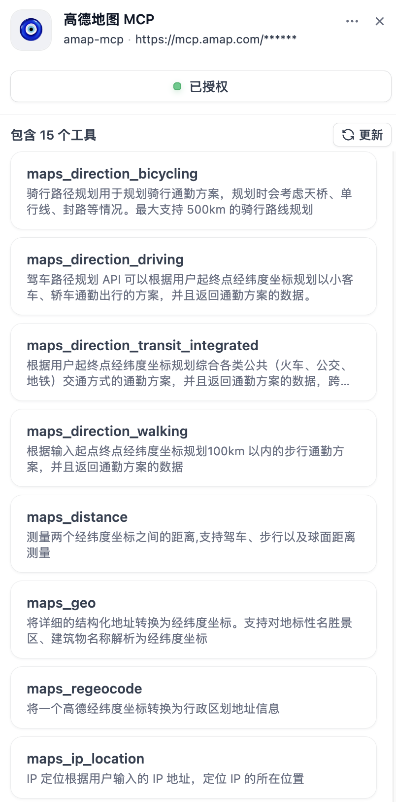

# 学习 Dify 的工具系统

在这一个月的时间里，我们通过源码深入学习了 Dify 的整个会话流程，了解了从应用生成器到运行器的核心机制，从限流控制、文件处理、跟踪调试，到提示词组装、内容审核、外部数据扩展，再到最后的知识库检索和模型调用。通过这个完整的会话过程，我们几乎把 Dify 的各个方面都摸了个遍。

不过，关于 Dify 还有很多未展开的话题值得深入研究，比如智能体、工作流、对话流这些应用的实现，不过这里面的细节也很多，为了防止这个系列过于冗长，我决定不再继续讲解应用的源码，而是挑一些比较重要且有意思的点来写，比如今天将要学习的工具系统。

工具使得 AI 应用能够跳出纯文本对话的局限，连接外部世界的各种服务和功能。无论是在智能体应用中自主决策调用工具，还是在工作流中精确编排工具的执行，工具系统都是 Dify 应用能力的重要体现。本文将详细介绍 Dify 工具的使用和开发，包括内置工具、自定义工具、MCP 工具、工作流工具、工具插件等，带你全面认识 Dify 的工具系统。

## 内置工具

我们之前在实战智能体的时候，曾经使用过 Dify 内置的几个小工具：

* **语音转写**：支持 TTS 文本转语音和 ASR 语音转文本；
* **代码执行**：运行 Python 代码并返回执行结果；
* **时间计算**：各种时间小工具，比如获取当前时间、时区转换、时间戳转换、计算星期几等；
* **网页抓取**：获取指定 URL 的网页内容；

我们打开 “工具” 页面，可以看到所有内置的工具以及来自 Dify 市场的工具，用户可以择需安装：


所有内置工具的实现位于 `api/core/tools/builtin_tool/providers` 目录，以约定的目录结构进行组织：

```
.
├── audio              # 按供应商分组
│   ├── _assets        # 图标资源
│   │   └── icon.svg
│   ├── audio.py       # 供应商代码，主要是认证鉴权
│   ├── audio.yaml     # 供应商配置文件，名称、描述、作者、图标、标签等
│   └── tools
│       ├── asr.py     # 工具的具体实现代码
│       ├── asr.yaml   # 工具配置文件，名称、描述以及参数的详细信息
│       ├── tts.py
│       └── tts.yaml
├── code
├── time
└── webscraper
```

可以看到，内置工具按供应商进行分组，每个供应商可以包含多个工具。供应商和工具都有对应的 YAML 配置文件，用于定义其基本信息和参数，以及对应的 Python 实现代码。

> 在这里 “供应商” 这个词可能不太合适，使用 “工具箱” 可能更容易理解一点。

Dify 在启动时会自动扫描并加载这个目录下的所有工具，因此对于在本地部署 Dify 的开发人员来说，完全可以在这个目录下添加并实现自己的内置工具。

## 自定义工具

自定义工具允许用户通过导入 [OpenAPI 规范](https://swagger.io/specification/) 的 API 文档，快速集成任何 RESTful API 作为工具:


其实，考虑到兼容性，Dify 支持好几种不同的 API 规范：

- **OpenAPI 3.0/3.1**：业界标准的 API 文档格式
- **Swagger 2.0**：OpenAPI 的前身规范
- **OpenAI Plugin**：OpenAI 插件规范

对 Schema 的解析可以参考 `ApiBasedToolSchemaParser` 的源码。下面是一个天气查询接口的 Schema 示例：

```json
{
  "openapi": "3.1.0",
  "info": {
    "title": "天气查询",
    "description": "天气查询",
    "version": "v1.0.0"
  },
  "servers": [
    {
      "url": "https://query.asilu.com"
    }
  ],
  "paths": {
    "/weather/baidu": {
      "get": {
        "description": "查询某个城市的天气信息",
        "operationId": "QueryWeather",
        "parameters": [
          {
            "name": "city",
            "in": "query",
            "description": "城市名称",
            "required": true,
            "schema": {
              "type": "string"
            }
          }
        ],
        "deprecated": false
      }
    }
  },
  "components": {
    "schemas": {}
  }
}
```

其中 `operationId` 会作为工具的名称，`description` 是工具的描述，点击 “测试” 按钮可以对接口进行调试：


自定义工具的实现位于 `api/core/tools/custom_tool/`，系统会自动解析 API 规范并调用相应的工具接口。值得注意的是，对外部接口的调用，统一走 SSRF 代理，防止 SSRF 攻击。

## MCP 工具

MCP 工具是一种更灵活的工具集成方式，通过 [Model Context Protocol](https://modelcontextprotocol.io/) 标准，允许连接任何实现了 MCP 规范的外部服务器。它目前已经是大模型调用工具的事实性规范了，几乎所有的接口提供方都在争相推出他们的 MCP Server。

我们以 [高德地图 MCP Server](https://lbs.amap.com/api/mcp-server/gettingstarted) 为例，演示下如何添加 MCP 工具。首先，需要在高德官网上申请 API KEY，然后点击 “添加 MCP 服务”：


依次填写名称、图标、服务端点、服务器标识符等信息，再点击 “添加并授权”，就可以看到 MCP Server 下的 15 个工具都已添加成功：



MCP 的完整实现位于 `api/core/mcp/`，包括客户端、会话管理、认证等完整的生态支持。

## 工作流工具

当我们开发完一个工作流并点击发布时，可以选择将其发布为一个工具：


我们需要对工具的名称、描述和参数进行配置：


配置完成之后，我们就可以在 “工具管理” 页面看到这个工具，并且可以在智能体和工作流等应用中使用它了。

## 工具插件

我们昨天曾学习过 Dify 的插件机制，并演示了如何从零开始开发一个模型插件。除了模型插件，Dify 也支持工具插件，我们完全可以按照昨天的步骤再开发一个工具插件，注意在选择插件模板时选择 “tool” 模板：


生成的模板目录结构如下：

```
calculator
├── GUIDE.md
├── PRIVACY.md
├── README.md
├── _assets
│   ├── icon-dark.svg
│   └── icon.svg
├── main.py
├── manifest.yaml
├── provider
│   ├── calculator.py
│   └── calculator.yaml
├── requirements.txt
└── tools
    ├── add.py
    └── add.yaml
```

同样是先将插件清单、供应商配置、工具配置这几个 YAML 文件调整下，最后编辑 `add.py` 文件，完成工具的实现：

```python
class AddTool(Tool):
  
  def _invoke(self, tool_parameters: dict[str, Any]) -> Generator[ToolInvokeMessage]:
    """
    加法运算
    """
    x = tool_parameters.get("x", 0)
    y = tool_parameters.get("y", 0)
    result = str(x + y)
    yield self.create_text_message(result)
```

这里的 `create_text_message()` 表示工具返回的是文本消息，Dify 定义了多种工具返回消息类型，支持文本、链接、图片、文件等丰富的内容：

```python
# 创建文本消息
self.create_text_message(text="Hello, World!")

# 创建 JSON 消息
self.create_json_message(data={"key": "value"})

# 创建链接消息
self.create_link_message(link="https://example.com")

# 创建图片消息
self.create_image_message(image="https://example.com/image.jpg")

# 创建文件 BLOB 消息
self.create_blob_message(blob=file_bytes, meta={"mime_type": "application/pdf"})
```

然后将插件打包上传，就可以在智能体或工作流中使用了：


验证工具能否正常工作：


### 插件签名

有一点我们昨天没有提，当使用 `dify plugin package` 打包插件并上传到 Dify 平台时，可能会遇到下面这个签名错误：


可以在 `docker/middleware.env` 环境变量文件的末尾添加如下配置参数：

```sh
# 关闭插件签名
FORCE_VERIFYING_SIGNATURE=false
```

> 如果你不是通过源码部署的，可以修改 `/docker/.env` 文件。

然后重启 Dify 的插件服务即可：

```
$ docker compose -f docker-compose.middleware.yaml up -d \
  --force-recreate \
  --no-deps \
  plugin_daemon
```

不过这种方法将允许安装所有未审核的插件，可能存在安全隐患，最好的做法是对插件进行签名。插件的开发者首先需要创建密钥对：

```sh
$ dify signature generate -f demo
```

这个命令将生成 `demo.private.pem` 和 `demo.public.pem` 两个文件，一个私钥，一个公钥。然后开发者使用私钥对插件进行签名：

```sh
$ dify signature sign calculator.difypkg -p demo.private.pem
```

这个命令将生成一个带签名的插件文件 `calculator.signed.difypkg`，不过这个时候插件还上传不了。开发者需要将公钥提交给 Dify 平台的管理员，管理员审核通过后，将该开发者的公钥放在 `public_keys` 目录下，并修改平台配置：

```sh
# 开启插件签名
FORCE_VERIFYING_SIGNATURE=true
THIRD_PARTY_SIGNATURE_VERIFICATION_ENABLED=true
THIRD_PARTY_SIGNATURE_VERIFICATION_PUBLIC_KEYS=/app/storage/public_keys/demo.public.pem
```

重启插件服务后，开发者就可以上传带签名的插件了。

## 小结

Dify 的工具系统是一个分层次、多维度的生态，从内置工具的开箱即用，到自定义 API 工具的快速集成，再到 MCP 工具的标准化接入，以及最后的插件工具开发，提供了从简单到复杂、从低门槛到高灵活性的完整解决方案。

无论你是想快速为应用增强功能，还是想开发一个功能丰富的工具插件供社区使用，Dify 的工具系统都能满足你的需求。

关于本文中所提到的内置工具的开发，以及工具插件的示例，我已经将完整源码发布到 Github 上了，感兴趣的同学可以参考：

* https://github.com/aneasystone/dify-plugins
