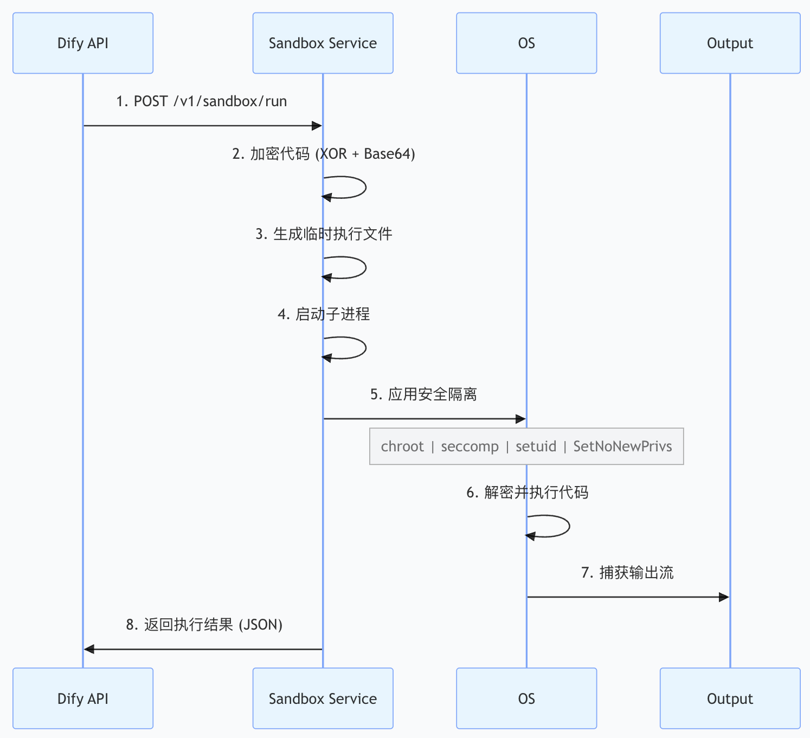
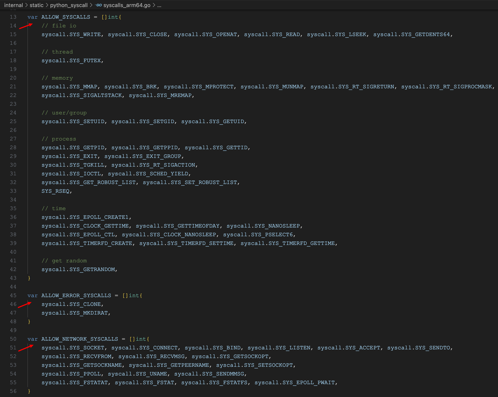

# 学习 Dify 的代码沙箱

在上一篇文章中，我们讲到了 Dify 的工具系统，其中有一个代码执行的内置工具非常重要，无论是在工作流的代码节点中执行用户代码，还是在智能体中作为 Code Interpreter 调用，都离不开这个工具。为了执行用户代码，Dify 需要一个安全的、隔离的、可控的代码执行环境，这也就是本文的主角 —— **Dify 代码沙箱**。

如果没有完善的沙箱隔离机制，恶意用户可以利用代码执行漏洞访问系统文件、盗取数据、甚至获得整个服务器的控制权。因此，Dify 在代码沙箱的设计和实现上下了不少功夫，其中有不少值得学习的点。本文将详细介绍 Dify 代码沙箱的工作原理，以及它所采用的各种安全隔离技术。

## 代码沙箱概述

**代码沙箱（Code Sandbox）** 是一个隔离的代码执行环境，允许在受控的环境中安全地运行不信任的代码。它的核心目标是在提供代码执行功能的同时，防止恶意或有缺陷的代码对系统造成危害。

在 Dify 中，代码沙箱主要用于以下场景：

1. **工作流代码节点**：用户可以在工作流中添加代码节点，用 Python 或 JavaScript 处理工作流中的数据
2. **代码执行工具**：作为智能体的工具，大模型可以自主调用代码执行器完成计算任务
3. **模板转换**：在数据处理过程中，使用代码对数据进行转换和清洗

这些场景的共同点是，代码来自于用户或 AI 生成，具有不可预测性，因此必须在沙箱中执行。

### 沙箱的安全需求

设计一个安全的代码沙箱需要满足以下需求：

| 需求 | 说明 |
|------|------|
| 进程隔离 | 用户代码运行在独立的进程中，不影响主程序 |
| 文件系统隔离 | 代码无法访问主机系统的文件和目录 |
| 网络隔离 | 代码可以根据配置选择性地访问网络 |
| 系统调用限制 | 代码不能调用危险的系统调用（如 fork、exec 等） |
| 权限限制 | 代码以低权限用户身份运行 |
| 资源限制 | 限制代码的 CPU、内存和执行时间 |
| 代码隐私 | 用户的代码在传输和执行过程中受到保护 |

Dify 通过一个独立的沙箱服务 [**dify-sandbox**](https://github.com/langgenius/dify-sandbox) 来实现这些需求，它采用了 Linux 提供的多种安全机制，构建了一套分层的防御体系。

## 代码执行的实现

在深入 Dify 的代码沙箱之前，让我们来看下代码执行相关的逻辑，其实现位于 `CodeExecutor` 类：

```python
class CodeExecutor:

  @classmethod
  def execute_code(cls, language: CodeLanguage, preload: str, code: str) -> str:
    """
    调用代码沙箱，执行代码
    """

    # 接口地址
    url = code_execution_endpoint_url / "v1" / "sandbox" / "run"

    # 简单鉴权
    headers = {"X-Api-Key": dify_config.CODE_EXECUTION_API_KEY}

    # 接口入参
    data = {
      "language": cls.code_language_to_running_language.get(language),
      "code": code,
      "preload": preload,
      "enable_network": True,
    }

    # 发送请求
    response = post(
      str(url),
      json=data,
      headers=headers,
      timeout=Timeout(
        connect=dify_config.CODE_EXECUTION_CONNECT_TIMEOUT,
        read=dify_config.CODE_EXECUTION_READ_TIMEOUT,
        write=dify_config.CODE_EXECUTION_WRITE_TIMEOUT,
        pool=None,
      ),
    )

    # 获取 stdout 输出
    response_data = response.json()
    response_code = CodeExecutionResponse(**response_data)
    return response_code.data.stdout or ""

  @classmethod
  def execute_workflow_code_template(cls, language: CodeLanguage, code: str, inputs: Mapping[str, Any]):
    """
    执行工作流代码节点
    """

    # 将用户代码和输入参数嵌入预置的代码模板
    template_transformer = cls.code_template_transformers.get(language)
    runner, preload = template_transformer.transform_caller(code, inputs)

    try:
      # 调用代码执行
      response = cls.execute_code(language, preload, runner)
    except CodeExecutionError as e:
      raise e

    # 将执行结果转换为工作流的节点出参
    return template_transformer.transform_response(response)
```

其中 `execute_workflow_code_template()` 函数负责工作流中的代码节点的执行，注意它并没有直接执行用户的代码，而是做了一层模板转换。**因为代码执行服务是通过标准输出获取执行结果的**，而工作流的代码节点中用户输入的代码必须包含一个 `main()` 入口：

```python
def main(x: int, y: int) -> dict:
  return {
    'sum' : x + y
  }
```

如果直接执行不会有任何输出，所以 Dify 在调用代码执行服务之前，先使用一段预置的代码模板将用户代码和输入参数包起来。模板如下：

```python
# 用户代码，申明 main 函数
{cls._code_placeholder}

import json
from base64 import b64decode

# 输入参数
inputs_obj = json.loads(b64decode('{cls._inputs_placeholder}').decode('utf-8'))

# 执行 main 函数
output_obj = main(**inputs_obj)

# 将输出转换为 JSON 格式并打印输出
output_json = json.dumps(output_obj, indent=4)
result = f'''<<RESULT>>{{output_json}}<<RESULT>>'''
print(result)
```

最终的输出结果会被转换为 JSON 格式并通过 `print` 打印出来，打印的时候加上 `<<RESULT>>` 这个特殊标签，防止 `main` 函数里其他的 `print` 对结果造成干扰，方便解析。

另外，`CodeExecutor` 中还有一个 `execute_code()` 函数，这才是真正的代码执行入口，支持 Python 或 JavaScript 两种编程语言，它负责将代码发送到代码沙箱服务并处理返回结果：

```
$ curl -X POST http://127.0.0.1:8194/v1/sandbox/run \
  -H "X-Api-Key: dify-sandbox" \
  -H "Content-Type: application/json" \
  -d '{
    "language": "python3",
    "code": "print('"'"'hello'"'"')",
    "preload": "",
    "enable_network": true
  }'
```

该接口通过 `X-Api-Key` 头支持简单的鉴权，该值可以在 `.env` 文件中修改：

```
CODE_EXECUTION_ENDPOINT=http://127.0.0.1:8194
CODE_EXECUTION_API_KEY=dify-sandbox
```

## Dify 代码沙箱架构

Dify 的代码沙箱服务以 Docker 容器运行，采用了 **防御纵深（Defense in Depth）** 的设计思想，实现了多层安全防御，即使某一层防御被突破，其他层仍然能够保护系统。其执行流程如下：



整个过程涉及多个安全层，下面我们逐一探讨。

### 第一层：代码加密与编码

Dify 的代码沙箱在执行用户代码时，首先会将用户代码写到一个临时文件中，然后再启动 Python 或 Node.js 去运行该脚本文件，通过捕获 Python 或 Node.js 进程的 `stdout` 和 `stderr` 获取代码执行结果。

为了防止用户的代码以明文形式出现在磁盘上，Dify 在写入临时文件时对代码做了一次简单的加密：

```go
// 生成一个 512 字节的随机密钥
key_len := 64
key := make([]byte, key_len)
_, err := rand.Read(key)

// 加密代码：采用简单的 XOR 加密，将代码与密钥进行 XOR 操作
encrypted_code := make([]byte, len(code))
for i := 0; i < len(code); i++ {
    encrypted_code[i] = code[i] ^ key[i%key_len]
}

// 对加密后的代码进行 Base64 编码
code = base64.StdEncoding.EncodeToString(encrypted_code)
// 对密钥进行 Base64 编码
encoded_key := base64.StdEncoding.EncodeToString(key)
```

用户的代码也不是直接执行的，而是通过另一个模板文件 `prescript.py` 动态生成的，可以在这个模板文件中看到用户代码的解密过程：

```python
from base64 import b64decode

# 解码密钥
key = b64decode(key)

# 解码用户代码
code = b64decode("{{code}}")

# 定义解密函数
def decrypt(code, key):
  key_len = len(key)
  code_len = len(code)
  code = bytearray(code)
  for i in range(code_len):
    code[i] = code[i] ^ key[i % key_len]  # XOR 操作
  return bytes(code)

# 解密用户代码
code = decrypt(code, key)

# 执行用户代码
exec(code)
```

虽然 XOR 加密的安全性相对较弱，但由于这个密钥是一次性的，考虑到所有操作都在容器中，以及配合其他安全机制，这种方案在实践中是足够的。

### 第二层：进程隔离

每次代码执行都会创建一个独立的子进程，用户代码在这个进程中运行，与沙箱服务的主进程完全隔离。这样，即使代码因某种原因崩溃或消耗过多资源，也不会影响沙箱服务本身。另外，参考 `docker/volumes/sandbox/conf/config.yaml` 文件，沙箱还支持配置以下资源限制：

| 配置项 | 说明 | 默认值 |
|--------|------|--------|
| max_workers | 最大并发执行进程数 | 4 |
| max_requests | 请求队列大小 | 50 |
| worker_timeout | 单个代码执行的超时时间 | 5 秒 |

超过超时时间的进程会被强制杀死，这是一个重要的资源保护机制。

### 第三层：文件系统隔离

`chroot` 是 Linux 提供的一个系统调用，可以改变进程的根目录。当一个进程执行 `chroot("/some/path")` 后，对于这个进程来说，`/some/path` 就变成了新的根目录，进程无法访问此目录之外的任何文件。

在 Dify 沙箱中，Python 代码执行时会被 `chroot` 到一个特殊的沙箱目录，如 `/var/sandbox/sandbox-python` 目录。这个目录包含了 Python 运行时所需的最小文件集合。这样，即使用户代码尝试执行 `open("/etc/passwd")`，它实际上会尝试打开 `/var/sandbox/sandbox-python/etc/passwd`，而这个文件并不存在，因此访问会被拒绝。

这个最小化的文件系统被称为 **chroot 监狱**，即使用户代码知道绝对路径，也无法访问这个监狱之外的文件。

Dify 沙箱通过 Go 语言的 `syscall.Chroot()` 系统调用实现该功能：

```go
import "syscall"

func InitSeccomp(uid int, gid int, enable_network bool) error {

  err := syscall.Chroot(".")

  // 其他安全措施...
}
```

需要注意的是，`chroot` 本身并不是一个强大的安全机制，如果进程有能力调用 `chdir()` 和其他系统调用，可能找到逃逸的方式，需要配合其他机制来形成完整的防护。因此，Dify 在应用 `chroot` 的同时，还使用了 `seccomp` 来限制进程可以调用的系统调用，后面我们会具体介绍。

### 第四层：用户权限隔离

沙箱中的代码不应该以 root 身份运行。Dify 在代码执行时，会使用 `setuid` 和 `setgid` 系统调用，将进程的用户身份和组身份切换到一个非特权用户：

```go
import "syscall"

func InitSeccomp(uid int, gid int, enable_network bool) error {

  // 其他安全措施...

  // setuid
  err = syscall.Setuid(uid)

  // setgid
  err = syscall.Setgid(gid)
}
```

> 这个非特权用户名为 `sandbox`，ID 为 `65537`，是由沙箱服务在启动时自动创建的。

这样做的好处是：

1. 限制文件和目录的访问权限（基于文件的 Unix 权限位）
2. 防止进程获得 root 权限进行的操作
3. 减小代码逃逸后的影响范围

除了权限降级外，Dify 还使用了 `prctl(PR_SET_NO_NEW_PRIVS)` 系统调用来禁止进程及其所有子进程获得新的权限：

```go
import "github.com/langgenius/dify-sandbox/internal/core/lib"

func InitSeccomp(uid int, gid int, enable_network bool) error {

  // 其他安全措施...

  lib.SetNoNewPrivs()

  // 其他安全措施...
}
```

其中 `SetNoNewPrivs()` 函数通过调用 Go 语言的 `syscall.Syscall6()` 系统调用设置进程的 `PR_SET_NO_NEW_PRIVS` 标志：

```go
func SetNoNewPrivs() error {
  // syscall.SYS_PRCTL 表示 Linux 的 prctl 系统调用，用于操作进程的各种属性
  // 它的第一个参数 0x26 是 PR_SET_NO_NEW_PRIVS 标志常数的十六进制值
  // 它的第二个参数 1 表示启用该标志
  _, _, e := syscall.Syscall6(syscall.SYS_PRCTL, 0x26, 1, 0, 0, 0, 0)
}
```

这个标志的作用是，即使进程调用了一个设置了 `setuid` 位的二进制文件（如 `sudo`），也无法获得额外的权限。这是一个额外的保护层，防止通过特殊的二进制文件实现权限提升。

### 第五层：系统调用隔离

**Seccomp（Secure Computing Mode）** 是 Linux 内核提供的一个强大的安全机制，它允许进程通过 **BPF（Berkeley Packet Filter）** 程序来过滤系统调用。当进程执行被禁用的系统调用时，内核会立即终止该进程或返回错误。

`Seccomp` 使用 BPF 字节码来实现系统调用过滤，当进程执行系统调用时，内核会执行这个 BPF 程序来决定是否允许该调用。BPF 程序的结果有几种可能：

| 返回值 | 说明 |
|--------|------|
| SECCOMP_RET_ALLOW | 允许系统调用执行 |
| SECCOMP_RET_ERRNO | 返回错误码，进程继续执行 |
| SECCOMP_RET_KILL_PROCESS | 杀死整个进程（推荐） |
| SECCOMP_RET_KILL_THREAD | 杀死当前线程 |
| SECCOMP_RET_TRAP | 发送信号给进程 |

Dify 采用 **白名单模式**，即只有显式允许的系统调用才能执行，其他所有系统调用都会被拒绝。Dify 针对不同的编程语言（Python 和 Node.js）以及不同的系统架构（ARM64 和 AMD64）提供了不同的白名单：

- `internal/static/python_syscall/` - Python 允许的系统调用
- `internal/static/nodejs_syscall/` - Node.js 允许的系统调用

比如针对 ARM64 架构下的 Python 语言，白名单如下：



这个白名单分三个部分：

- `ALLOW_SYSCALLS` 允许的系统调用
- `ALLOW_ERROR_SYSCALLS` 允许的系统调用，但是返回报错
- `ALLOW_NETWORK_SYSCALLS` 允许的网络系统调用

可以看到，危险的系统调用如 `execve`、`fork`、`ptrace` 等都被禁止了，这确保了用户代码无法执行任意的系统命令或创建新进程。

系统调用隔离的实现同样位于 `InitSeccomp` 函数中：

```go
import "github.com/langgenius/dify-sandbox/internal/core/lib"

func InitSeccomp(uid int, gid int, enable_network bool) error {

  // 其他安全措施...

  allowed_syscalls = append(allowed_syscalls, python_syscall.ALLOW_SYSCALLS...)
  if enable_network {
    allowed_syscalls = append(allowed_syscalls, python_syscall.ALLOW_NETWORK_SYSCALLS...)
  }
  allowed_not_kill_syscalls = append(allowed_not_kill_syscalls, python_syscall.ALLOW_ERROR_SYSCALLS...)

  err = lib.Seccomp(allowed_syscalls, allowed_not_kill_syscalls)

  // 其他安全措施...
}
```

其中 `lib.Seccomp()` 函数的实现如下：

```go
import (
	"syscall"
	sg "github.com/seccomp/libseccomp-golang"
)

func Seccomp(allowed_syscalls []int, allowed_not_kill_syscalls []int) error {
    
  // 初始化 Seccomp 过滤器
  ctx, err := sg.NewFilter(sg.ActKillProcess)

  // 添加规则：允许的系统调用
  for _, syscall := range allowed_syscalls {
    ctx.AddRule(sg.ScmpSyscall(syscall), sg.ActAllow)
  }

  // 添加规则：报错的系统调用
  for _, syscall := range allowed_not_kill_syscalls {
    ctx.AddRule(sg.ScmpSyscall(syscall), sg.ActErrno)
  }

  // 将过滤器规则导出成字节码
  file := os.NewFile(uintptr(writer.Fd()), "pipe")
  ctx.ExportBPF(file)

  // 应用 Seccomp 规则
  _, _, err2 := syscall.Syscall(
    SYS_SECCOMP,
    uintptr(SeccompSetModeFilter),
    uintptr(SeccompFilterFlagTSYNC),
    uintptr(unsafe.Pointer(&bpf)),
  )
```

它通过 [libseccomp-golang](https://github.com/seccomp/libseccomp-golang) 库，创建 Seccomp 过滤器并添加对应的白名单规则。

### 第六层：网络隔离

除了上述安全机制外，Dify 还允许根据配置选择性地启用或禁用网络访问：

```yaml
enable_network: True
```

这是通过上面的 Seccomp 过滤器来实现的，当禁用网络后，所有和网络相关的系统调用（比如 `socket`、`connect` 等）都将被拒绝。

另外，细心的朋友可能会注意到，在 Docker Compose 部署中，沙箱服务是运行在一个隔离的网络中，使用 SSRF 代理容器来控制出站连接：

```yaml
sandbox:
  image: langgenius/dify-sandbox:0.2.12
  environment:
    ENABLE_NETWORK: ${SANDBOX_ENABLE_NETWORK:-true}
    HTTP_PROXY: ${SANDBOX_HTTP_PROXY:-http://ssrf_proxy:3128}
    HTTPS_PROXY: ${SANDBOX_HTTPS_PROXY:-http://ssrf_proxy:3128}
  networks:
    - ssrf_proxy_network
```

因此即使代码绕过了 Seccomp 限制（理论上不可能），Docker 网络层也会提供额外的防护。

## 共享库的奥秘

看到这里，大家可能会疑惑，上述大多数的安全措施都位于 `InitSeccomp()` 函数中，这是一个 Go 函数，它是如何作用在用户编写的 Python 或 Node.js 脚本上的呢？

答案在于 `python.so` 这个 C 共享库。

Dify 通过 CGO（Go 的 C 互操作机制）将 `InitSeccomp()` 中的防护逻辑编译成一个 `so` 库文件，编译命令如下：

```bash
CGO_ENABLED=1 GOOS=linux GOARCH=amd64 go build \
  -o internal/core/runner/python/python.so \
  -buildmode=c-shared \
  -ldflags="-s -w" \
  cmd/lib/python/main.go
```

其中 `CGO_ENABLED=1` 表示启用 CGO，允许 Go 调用 C 代码；`GOOS=linux` 表示目标操作系统为 Linux，Dify 的沙箱服务只能跑在 Linux 环境下；`-buildmode=c-shared` 表示编译为 C 共享库格式；最后的 `-ldflags="-s -w"` 用于移除符号表和调试信息，减小文件大小。

编译后的 `python.so` 文件主要导出函数是 `DifySeccomp`，它在 `cmd/lib/python/main.go` 中定义：

```go
package main

import (
  "github.com/langgenius/dify-sandbox/internal/core/lib/python"
)
import "C"

// 导出的函数
func DifySeccomp(uid int, gid int, enable_network bool) {
  python.InitSeccomp(uid, gid, enable_network)
}

func main() {}
```

这个函数被 Python 脚本通过 `ctypes` 调用，在用户代码执行前完成所有的安全隔离设置：

```python
import ctypes

# 动态加载 python.so，这是 Dify 沙箱的 C 共享库
lib = ctypes.CDLL("./python.so")
lib.DifySeccomp.argtypes = [ctypes.c_uint32, ctypes.c_uint32, ctypes.c_bool]
lib.DifySeccomp.restype = None

# 应用安全隔离：chroot + seccomp + setuid + SetNoNewPrivs
lib.DifySeccomp({{uid}}, {{gid}}, {{enable_network}})

# 执行用户代码 ...
code = decrypt(code, key)
exec(code)
```

## 实际应用示例

让我们通过一个例子来理解 Seccomp 的实际效果，假设用户在工作流的代码节点中尝试执行以下恶意操作：

```python
def main() -> dict:    
  return {
    "result": "hello",
  }

# 尝试删除整个系统
import os
os.system("rm -rf /")
```

当 Python 执行 `os.system()` 时，实际上会调用 `execve` 系统调用来启动新的进程。但由于 `execve` 被 Seccomp 过滤器拒绝了，内核会立即终止这个进程并返回错误：


这种保护是在内核级别进行的，任何绕过尝试都会失败。

## 小结

代码沙箱作为 AI 应用安全的基石，其重要性不言而喻。我们今天详细学习了 Dify 代码沙箱的工作原理，它巧妙地结合了 Linux 提供的多种安全机制：

- **Chroot** 提供文件系统隔离
- **Setuid/Setgid** 实现权限降级
- **SetNoNewPrivs** 防止权限提升
- **Seccomp** 在系统调用级别进行细粒度的控制

通过这些机制的组合，Dify 实现了进程隔离、文件系统隔离、用户权限隔离、系统调用隔离及网络隔离等多层防御，打造了一个既安全又实用的代码执行环境，允许 AI 应用能够动态执行代码，同时避免恶意代码对系统造成伤害。
