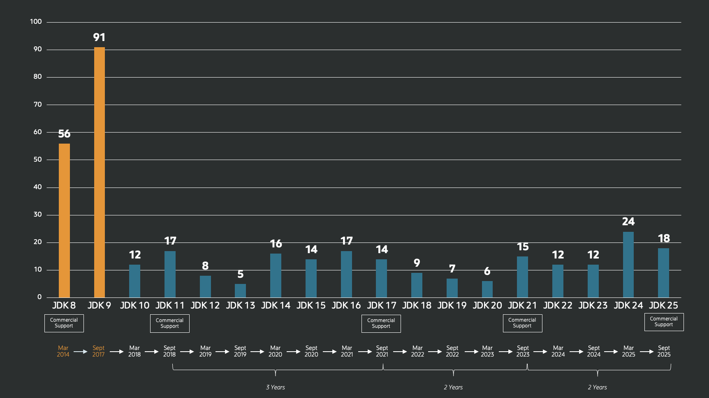
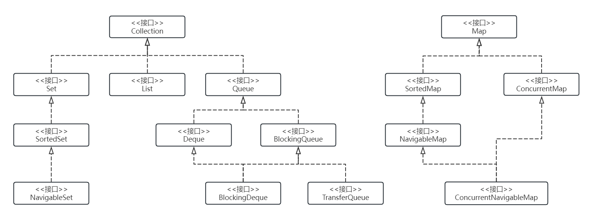
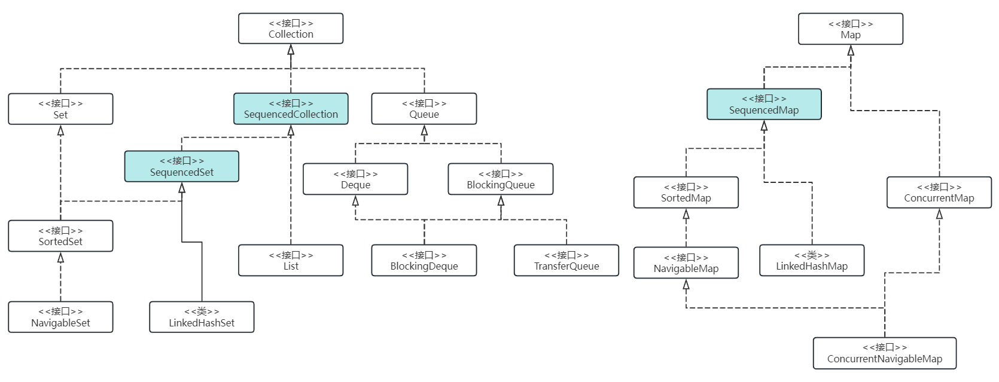

# 重温 Java 21 学习笔记

2025 年 9 月 16 日，Oracle 正式发布了 Java 25 版本，这是 Java 时隔两年发布的又一个 LTS 版本，上一个 LTS 版本是 2023 年 9 月 19 日发布的 [Java 21](https://openjdk.org/projects/jdk/21/)：



还记得当年发布 Java 21 的时候，市场反响很大，它被认为是最近几年内最为重要的版本，带来了一系列重要的功能和特性，包括：[记录模式](https://openjdk.org/jeps/440)，[`switch` 模式匹配](https://openjdk.org/jeps/441)，[字符串模板](https://openjdk.org/jeps/430)，[分代式 ZGC](https://openjdk.org/jeps/439)，[不需要定义类的 Main 方法](https://openjdk.org/jeps/445)，等等等等，不过其中最为重要的一项，当属由 [Loom 项目](https://openjdk.org/projects/loom/) 发展而来的 [虚拟线程](https://openjdk.org/jeps/444)。Java 程序一直以文件体积大、启动速度慢、内存占用多被人诟病，但是有了虚拟线程，再结合 [GraalVM](https://www.graalvm.org/) 的原生镜像，我们就可以写出媲美 C、Rust 或 Go 一样小巧灵活、高性能、可伸缩的应用程序。

转眼间，距离 Java 25 的发布已经 1 个多月了，网上相关的文章也已经铺天盖地，为了不使自己落伍，于是便打算花点时间学习一下，顺便看看我之前写的 Java 21 的学习笔记，重温下 Java 21 的相关知识。

尽管在坊间一直流传着 **版本任你发，我用 Java 8** 这样的说法，但是作为一线 Java 开发人员，最好还是紧跟大势，未雨绸缪，有备无患。而且最重要的是，随着 [Spring Boot 2.7.18 的发布，2.x 版本将不再提供开源支持](https://spring.io/blog/2023/11/23/spring-boot-2-7-18-available-now)，而 3.x 不支持 Java 8，最低也得 Java 17，所以仍然相信这种说法的人除非不使用 Spring Boot，要么不升级 Spring Boot，否则学习 Java 新版本都是势在必行。 

## 特性一览

接下来，我们先来看下 Java 21 的全部特性，包括下面 15 个 JEP：

* 430: [String Templates (Preview)](https://openjdk.org/jeps/430)
* 431: [Sequenced Collections](https://openjdk.org/jeps/431)
* 439: [Generational ZGC](https://openjdk.org/jeps/439)
* 440: [Record Patterns](https://openjdk.org/jeps/440)
* 441: [Pattern Matching for `switch`](https://openjdk.org/jeps/441)
* 442: [Foreign Function & Memory API (Third Preview)](https://openjdk.org/jeps/442)
* 443: [Unnamed Patterns and Variables (Preview)](https://openjdk.org/jeps/443)
* 444: [Virtual Threads](https://openjdk.org/jeps/444)
* 445: [Unnamed Classes and Instance Main Methods (Preview)](https://openjdk.org/jeps/445)
* 446: [Scoped Values (Preview)](https://openjdk.org/jeps/446)
* 448: [Vector API (Sixth Incubator)](https://openjdk.org/jeps/448)
* 449: [Deprecate the Windows 32-bit x86 Port for Removal](https://openjdk.org/jeps/449)
* 451: [Prepare to Disallow the Dynamic Loading of Agents](https://openjdk.org/jeps/451)
* 452: [Key Encapsulation Mechanism API](https://openjdk.org/jeps/452)
* 453: [Structured Concurrency (Preview)](https://openjdk.org/jeps/453)

由于内容较多，我将分成几篇来介绍，这是第一篇，先学习下 431 和 449 两个简单的特性。

## 有序集合

[Java 集合框架（Java Collections Framework，JCF）](https://docs.oracle.com/en/java/javase/21/docs/api/java.base/java/util/doc-files/coll-index.html) 为集合的表示和操作提供了一套统一的体系架构，让开发人员可以使用标准的接口来组织和操作集合，而不必关心底层的数据结构或实现方式。JCF 的接口大致可以分为 `Collection` 和 `Map` 两组，一共 15 个：



在过去的 20 个版本里，这些接口已经被证明非常有用，在日常开发中发挥了重要的作用。那么 Java 21 为什么又要增加一个新的 **有序集合（Sequenced Collections）** 接口呢？

### 不一致的顺序操作

这是因为这些接口在处理集合顺序问题时很不一致，导致了无谓的复杂性，比如要获取集合的第一个元素：

|               | 获取第一个元素                   |
| ------------- | ------------------------------- |
| List          | list.get(0)                     |
| Deque         | deque.getFirst()                |
| SortedSet     | sortedSet.first()               |
| LinkedHashSet | linkedHashSet.iterator().next() |

可以看到，不同的集合有着不同的实现。再比如获取集合的最后一个元素：

|               | 获取最后一个元素           |
| ------------- | ------------------------- |
| List          | list.get(list.size() - 1) |
| Deque         | deque.getLast()           |
| SortedSet     | sortedSet.last()          |
| LinkedHashSet | -                         |

List 的实现显得非常笨重，而 LinkedHashSet 根本没有提供直接的方法，只能将整个集合遍历一遍才能获取最后一个元素。

除了获取集合的第一个元素和最后一个元素，对集合进行逆序遍历也是各不相同，比如 `NavigableSet` 提供了 `descendingSet()` 方法来逆序遍历：

```java
for (var e : navSet.descendingSet()) {
  process(e);
}
```

`Deque` 通过 `descendingIterator()` 来逆序遍历：

```java
for (var it = deque.descendingIterator(); it.hasNext();) {
  var e = it.next();
  process(e);
}
```

而 `List` 则是通过 `listIterator()` 来逆序遍历：

```java
for (var it = list.listIterator(list.size()); it.hasPrevious();) {
  var e = it.previous();
  process(e);
}
```

由此可见，与顺序相关的处理方法散落在 JCF 的不同地方，使用起来极为不便。于是，Java 21 为我们提供了一个描述和操作有序集合的新接口，这个接口定义了一些与顺序相关的方法，将这些散落在各个地方的逻辑集中起来，让我们更方便地处理有序集合。

### 统一的有序集合接口

与顺序相关的操作主要包括三个方面：

* 获取集合的第一个或最后一个元素
* 向集合的最前面或最后面插入或删除元素
* 按照逆序遍历集合

为此，Java 21 新增了三个有序接口：`SequencedCollection`、`SequencedSet` 和 `SequencedMap`，他们的定义如下：

```java
interface SequencedCollection<E> extends Collection<E> {
  SequencedCollection<E> reversed();
  void addFirst(E);
  void addLast(E);
  E getFirst();
  E getLast();
  E removeFirst();
  E removeLast();
}

interface SequencedSet<E> extends Set<E>, SequencedCollection<E> {
  SequencedSet<E> reversed();
}

interface SequencedMap<K,V> extends Map<K,V> {
  SequencedMap<K,V> reversed();
  SequencedSet<K> sequencedKeySet();
  SequencedCollection<V> sequencedValues();
  SequencedSet<Entry<K,V>> sequencedEntrySet();
  V putFirst(K, V);
  V putLast(K, V);
  Entry<K, V> firstEntry();
  Entry<K, V> lastEntry();
  Entry<K, V> pollFirstEntry();
  Entry<K, V> pollLastEntry();
}
```

他们在 JCF 大家庭中的位置如下图所示：



有了这些接口，对于所有的有序集合，我们都可以通过下面的方法来获取第一个和最后一个元素：

```java
System.out.println("The first element is: " + list.getFirst());
System.out.println("The last element is: " + list.getLast());
```

逆序遍历也变得格外简单：

```java
list.reversed().forEach(it -> System.out.println(it));
```

## 弃用 Windows 32-bit x86 移植，为删除做准备

这个特性比较简单。随着 64 位架构的普及，32 位操作系统逐渐被淘汰，比如微软从 Windows 10 开始就只提供 64 位版本了，Windows 10 将是最后一个支持 32 位的 Windows 操作系统，而且 [2025 年 10 月后将不再支持](https://learn.microsoft.com/zh-cn/lifecycle/products/windows-10-home-and-pro)。

64 位架构相比于 32 位，在性能和安全方面都有巨大的提升。比如 64 位架构可以提供更大的内存地址空间，从而提高应用程序的性能和扩展性，同时它也引入了更多的保护机制，提高了应用程序的安全性。

但由于架构的差异，同时兼容 32 位和 64 位需要不少的维护成本，很多 Java 的新特性已经不支持 32 位系统了，比如虚拟线程，所以弃用 32 位势在必行。

在 Windows 32-bit x86 系统下构建 Java 21 的源码将报如下错误：

```
$ bash ./configure
...
checking compilation type... native
configure: error: The Windows 32-bit x86 port is deprecated and may be removed in a future release. \
Use --enable-deprecated-ports=yes to suppress this error.
configure exiting with result code 1
$
```

暂时可以通过 `--enable-deprecated-ports=yes` 参数来解决：

```
$ bash ./configure --enable-deprecated-ports=yes
```

## 小结

从今天开始，我将和大家一起踏上 Java 新特性的学习之旅，我们先从 Java 21 的 15 个 JEP 开始，这些特性涵盖了从简单的语言特性到复杂的运行时优化等多个方面，值得每一个 Java 开发人员学习和了解。

本篇作为系列的第一篇，学习了其中的两个简单特性：**有序集合（Sequenced Collections）** 和 **弃用 Windows 32-bit x86 移植**。

- 有序集合的引入解决了 Java 集合框架长期存在的不一致问题，通过提供统一的顺序操作接口，使得处理集合的第一个和最后一个元素、逆序遍历等操作变得简洁统一；
- 而 Windows 32-bit 支持的移植弃用则进一步精简了 Java 的维护成本，让团队能够更专注于高价值的功能开发；

在后续的篇章中，我们将深入探讨其他更加强大和复杂的特性，包括字符串模板、记录模式、虚拟线程等，敬请期待。
