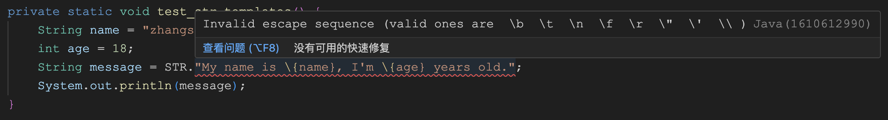

# 重温 Java 21 之字符串模板

字符串模板是很多语言都具备的特性，它允许在字符串中使用占位符来动态替换变量的值，这种构建字符串的方式比传统的字符串拼接或格式化更为简洁和直观。相信学过 JavaScript 的同学对下面这个 [Template literals](https://developer.mozilla.org/en-US/docs/Web/JavaScript/Reference/Template_literals) 的语法不陌生：

```js
const name = 'zhangsan'
const age = 18
const message = `My name is ${name}, I'm ${age} years old.`
console.log(message)
```

如上所示，JavaScript 通过反引号 ` 来定义字符串模板，而 Java 21 则引入了一个叫做 **模版表达式（Template expressions）** 的概念来定义字符串模板。下面是一个简单示例：

```java
String name = "zhangsan";
int age = 18;
String message = STR."My name is \{name}, I'm \{age} years old.";
System.out.println(message);
```

看上去和 JavaScript 的 Template literals 非常相似，但还是有一些区别的，模版表达式包含三个部分：

* 首先是一个 **模版处理器（template processor）**：这里使用的是 `STR` 模板处理器，也可以是 `RAW` 或 `FMT` 等，甚至可以自定义；
* 中间是一个点号（`.`）；
* 最后跟着一个字符串模板，模板中使用 `\{name}` 和 `\{age}` 这样的占位符语法，这被称为 **内嵌表达式（embedded expression）**；

当模版表达式运行的时候，模版处理器会将模版内容与内嵌表达式的值组合起来，生成结果。

不过，当我们执行上述代码时，很可能会报 `Invalid escape sequence (valid ones are  \b  \t  \n  \f  \r  \"  \'  \\ )` 这样的错：



这是因为字符串模板还只是一个预览特性，根据 [JEP 12: Preview Features](https://openjdk.org/jeps/12)，我们需要添加 `--enable-preview` 参数开启预览特性，使用 `javac` 编译时，还需要添加 `--release` 参数。使用下面的命令将 `.java` 文件编译成 `.class` 文件：

```
$ javac --enable-preview --release 21 StringTemplates.java 
Note: StringTemplates.java uses preview features of Java SE 21.
Note: Recompile with -Xlint:preview for details.
```

再使用下面的命令运行 `.class` 文件：

```
$ java --enable-preview StringTemplates
My name is zhangsan, I'm 18 years old.
```

从 Java 11 开始，我们可以直接运行 `.java` 文件了，参见 [JEP 330](https://openjdk.org/jeps/330)，所以上面的两个命令也可以省略成一个命令：

```
$ java --enable-preview --source 21 StringTemplates.java
```

## `STR` 模版处理器

`STR` 模板处理器中的内嵌表达式还有很多其他写法，比如执行数学运算：

```java
int x = 1, y = 2;
String s1 = STR."\{x} + \{y} = \{x + y}";
```

调用方法：

```java
String s2 = STR."Java version is \{getVersion()}";
```

访问字段：

```java
Person p = new Person(name, age);
String s3 = STR."My name is \{p.name}, I'm \{p.age} years old.";
```

内嵌表达式中可以直接使用双引号，不用 `\"` 转义：

```java
String s4 = STR."I'm \{age >= 18 ? "an adult" : "a child"}.";
```

内嵌表达式中可以编写注释和换行：

```java
String s5 = STR."I'm \{
    // check the age
    age >= 18 ? "an adult" : "a child"
}.";
```

## 多行模板表达式

在 Java 13 的 [JEP 355](https://openjdk.org/jeps/355) 中首次引入了 **文本块（Text Blocks）** 特性，并经过 Java 14 的 [JEP 368](https://openjdk.org/jeps/368) 和 Java 15 的 [JEP 378](https://openjdk.org/jeps/378) 两个版本的迭代，使得该特性正式可用，这个特性可以让我们在 Java 代码中愉快地使用多行字符串。在使用文本块之前，定义一个 JSON 格式的字符串可能会写出像下面这样无法直视的代码来：

```java
String json1 = "{\n" +
               "  \"name\": \"zhangsan\",\n" +
               "  \"age\": 18\n" +
               "}\n";
```

但是在使用文本块之后，这样的代码就变得非常清爽：

```java
String json2 = """
               {
                 "name": "zhangsan",
                 "age": 18
               }
               """;
```

文本块以三个双引号 `"""` 开始，同样以三个双引号结束，看上去和 Python 的多行字符串类似，不过 Java 的文本块会自动处理换行和缩进，使用起来更方便。上面的文本块在 Java 中输出如下：

```json
{
  "name": "zhangsan",
  "age": 18
}

```

注意开头没有换行，结尾有一个换行。而在 Python 中输出如下：

```json

               {
                 "name": "zhangsan",
                 "age": 18
               }

```

不仅开头和结尾都有换行，而且每一行有很多缩进，这里可以看出 Python 的处理很简单，它直接把 `"""` 之间的内容原样输出了，而 Java 是根据最后一个 `"""` 和内容之间的相对缩进来决定输出。很显然，我们更喜欢 Java 这样的输出结果，如果希望 Python 有同样的输出结果，就得这样写：

```python
json = """{
  "name": "zhangsan",
  "age": 18
}
"""
```

这在代码的可读性上就比不上 Java 了，这里不得不感叹 Java 的设计，在细节的处理上做的确实不错。

言归正传，说回字符串模板这个特性，我们也可以在文本块中使用，如下：

```java
String json3 = STR."""
               {
                 "name": "\{name}",
                 "age": \{age}
               }
               """;
```

## `FMT` 模板处理器

`FMT` 是 Java 21 内置的另一个模版处理器，它不仅有 `STR` 模版处理器的插值功能，还可以对输出进行格式化操作。**格式说明符（format specifiers）** 放在嵌入表达式的左侧，如下所示：

```
%7.2f\{price}
```

支持的格式说明符参见 [java.util.Formatter](https://cr.openjdk.org/~jlaskey/templates/docs/api/java.base/java/util/Formatter.html) 文档。

> 不过在我的环境里编译时，会报错 `cannot find symbol: variable FMT`，就算是把镜像更换成 `openjdk:22-jdk` 也是一样的错，不清楚是为什么。

## 小结

我们今天学习了 Java 21 引入的 **字符串模板（String Templates）** 特性，它通过 **模板表达式** 和 **内嵌表达式** 的设计，使得字符串的构造更加简洁、直观和类型安全。字符串模板的核心优势在于：

- **简洁性**：相比传统的字符串拼接或 `String.format()` 等方法，模板表达式的写法更加简洁易读，特别是在处理复杂的多行字符串时，结合文本块特性，代码的可读性得到了显著提升；
- **灵活的模板处理器**：Java 21 内置了 `STR` 和 `FMT` 两个模板处理器，满足不同的需求，同时开发者也可以实现自定义的模板处理器来扩展功能；
- **与文本块的完美配合**：字符串模板与文本块特性搭配使用，在处理 JSON、XML、HTML 等多行格式化文本时，表现出了显著的优势，使代码变得更加优雅；

总的来说，字符串模板是 Java 语言在现代化演进中的又一个重要步伐，通过借鉴其他编程语言（如 JavaScript、Python、Kotlin 等）的成功经验，为 Java 开发者提供了更加便利和舒适的开发体验。
