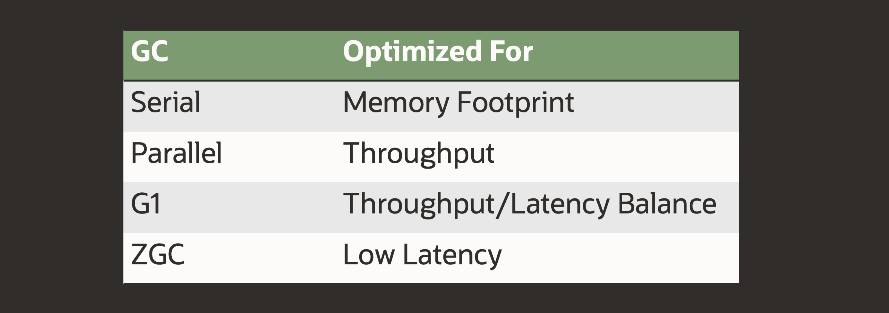
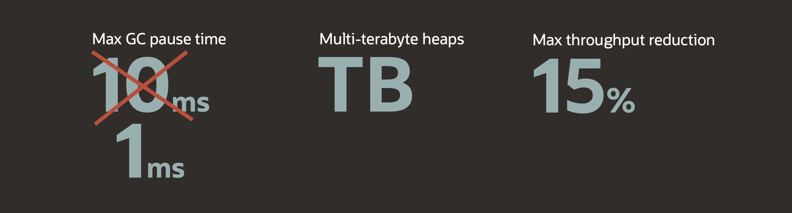
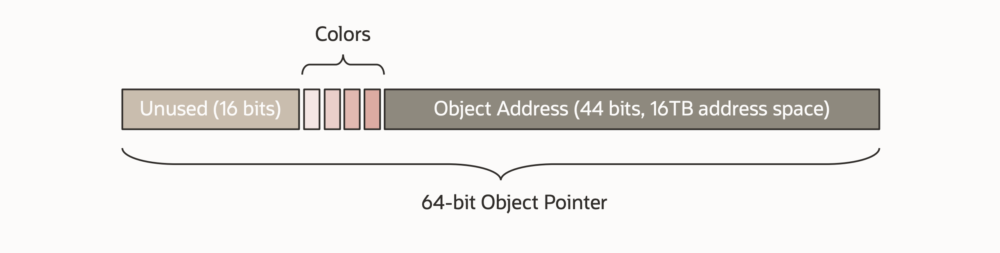
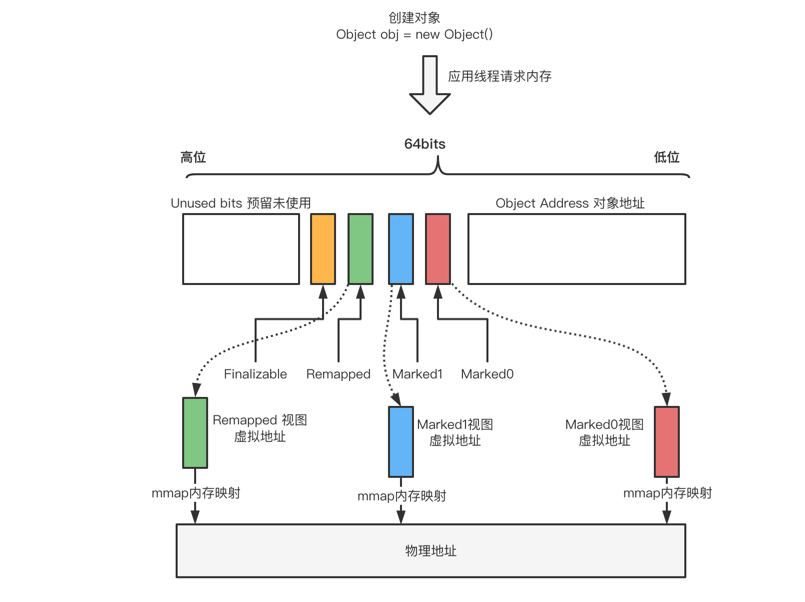
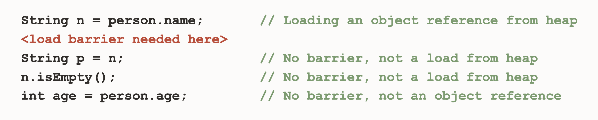
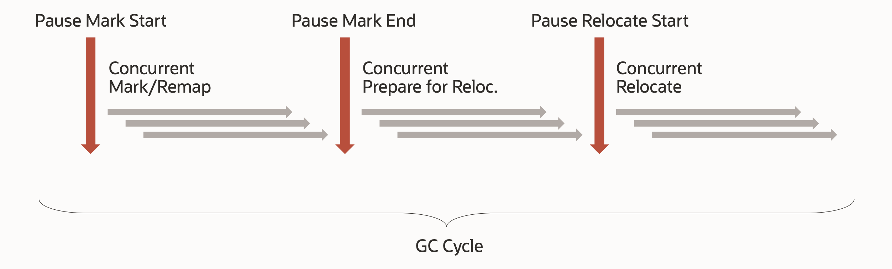
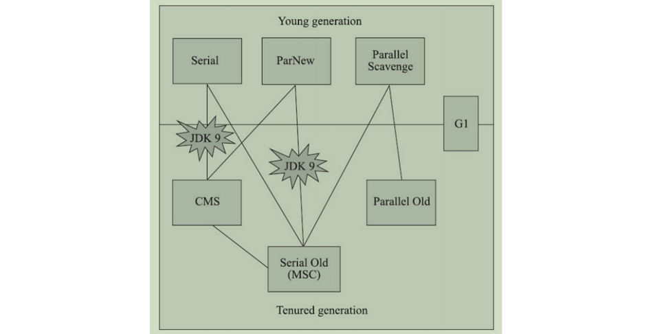

# 重温 Java 21 之分代式 ZGC

想要搞清楚 Java 21 中的 **分代式 ZGC（Generational ZGC）** 这个特性，我们需要先搞清楚什么是 ZGC。

## ZGC 简介

[ZGC（The Z Garbage Collector）](https://wiki.openjdk.org/display/zgc) 是由 Oracle 开发的一款垃圾回收器，最初在 Java 11 中以实验性功能推出，并经过几个版本的迭代，最终在 Java 15 中被宣布为 [Production Ready](https://openjdk.org/jeps/377)，相比于其他的垃圾回收器，ZGC 更适用于大内存、低延迟服务的内存管理和回收。下图展示的是不同的垃圾回收器所专注的目标也各不相同：



低延迟服务的最大敌人是 GC 停顿，所谓 GC 停顿指的是垃圾回收期间的 **STW（Stop The World）**，当 STW 时，所有的应用线程全部暂停，等待 GC 结束后才能继续运行。要想实现低延迟，就要想办法减少 GC 的停顿时间，根据 [JEP 333](https://openjdk.org/jeps/333) 的介绍，最初 ZGC 的目标是：

* GC 停顿时间不超过 10ms；
* 支持处理小到几百 MB，大到 TB 量级的堆；
* 相对于使用 G1，应用吞吐量的降低不超过 15%；

经过几年的发展，目前 ZGC 的最大停顿时间已经优化到了不超过 1 毫秒（Sub-millisecond，亚毫秒级），且停顿时间不会随着堆的增大而增加，甚至不会随着 root-set 或 live-set 的增大而增加（通过 [JEP 376 Concurrent Thread-Stack Processing](https://openjdk.org/jeps/376) 实现），支持处理最小 8MB，最大 16TB 的堆：



ZGC 之所以能实现这么快的速度，不仅是因为它在算法上做了大量的优化和改进，而且还革命性的使用了大量的创新技术，包括：

* Concurrent：全链路并发，ZGC 在整个垃圾回收阶段几乎全部实现了并发；
* Region-based：和 G1 类似，ZGC 是一种基于区域的垃圾回收器；
* Compacting：垃圾回收的过程中，ZGC 会产生内存碎片，所以要进行内存整理；
* NUMA-aware：NUMA 全称 Non-Uniform Memory Access（非一致内存访问），是一种多内存访问技术，使用 NUMA，CPU 会访问离它最近的内存，提升读写效率；
* Using colored pointers：染色指针是一种将数据存放在指针里的技术，ZGC 通过染色指针来标记对象，以及实现对象的多重视图；
* Using load barriers：当应用程序从堆中读取对象引用时，JIT 会向应用代码中注入一小段代码，这就是读屏障；通过读屏障操作，不仅可以让应用线程帮助完成对象的标记（mark），而且当对象地址发生变化时，还能自动实现对象转移（relocate）和重映射（remap）；

关于这些技术点，网上的参考资料有很多，有兴趣的同学可以通过本文的更多部分进一步学习，其中最有意思的莫过于 **染色指针** 和 **读屏障**，下面重点介绍这两项。

## 染色指针

在 64 位的操作系统中，一个指针有 64 位，但是由于内存大小限制，其实有很多高阶位是用不上的，所以我们可以在指针的高阶位中嵌入一些元数据，这种在指针中存储元数据的技术就叫做 **染色指针（Colored Pointers）**。染色指针是 ZGC 的核心设计之一，以前的垃圾回收器都是使用对象头来标记对象，而 ZGC 则通过染色指针来标记对象。ZGC 将一个 64 位的指针划分成三个部分：



其中，前面的 16 位暂时没用，预留给以后使用；后面的 44 位表示对象的地址，所以 ZGC 最大可以支持 2^44=16T 内存；中间的 4 位即染色位，分别是：

* Finalizable：标识这个对象只能通过 Finalizer 才能访问；
* Remapped：标识这个对象是否在转移集（Relocation Set）中；
* Marked1：用于标记可到达的对象（活跃对象）；
* Marked0：用于标记可到达的对象（活跃对象）；

此外，染色指针不仅用来标记对象，还可以实现对象地址的多重视图，上述 Marked0、Marked1、Remapped 三个染色位其实代表了三种地址视图，分别对应三个虚拟地址，这三个虚拟地址指向同一个物理地址，并且在同一时间，三个虚拟地址有且只有一个有效，整个视图映射关系如下：



这三个地址视图的切换是由垃圾回收的不同阶段触发的：

* 初始化阶段：程序启动时，ZGC 完成初始化，整个堆内存空间的地址视图被设置为 Remapped；
* 标记阶段：当进入标记阶段时，视图转变为 Marked0 或者 Marked1；
* 转移阶段：从标记阶段结束进入转移阶段时，视图再次被设置为 Remapped；

## 读屏障

**读屏障（Load Barriers）** 是 ZGC 的另一项核心技术，当应用程序从堆中读取对象引用时，JIT 会向应用代码中注入一小段代码：



在上面的代码示例中，只有第一行是从堆中读取对象引用，所以只会在第一行后面注入代码，注入的代码类似于这样：

```java
String n = person.name; // Loading an object reference from heap
if (n & bad_bit_mask) {
  slow_path(register_for(n), address_of(person.name));
}
```

这行代码虽然简单，但是用途却很大，在垃圾回收的不同阶段，触发的逻辑也有所不同：在标记阶段，通过读屏障操作，可以让应用线程帮助 GC 线程一起完成对象的标记或重映射；在转移阶段，如果对象地址发生变化，还能自动实现对象转移。

## ZGC 工作流程

整个 ZGC 可以划分成下面六个阶段：



其中有三个是 STW 阶段，尽管如此，但是 ZGC 对 STW 的停顿时间有着严格的要求，一般不会超过 1 毫秒。这六个阶段的前三个可以统称为 **标记（Mark）阶段**：

* Pause Mark Start - 标记开始阶段，将地址视图被设置成 Marked0 或 Marked1（交替设置）；这个阶段会 STW，它只标记 GC Roots 直接可达的对象，GC Roots 类似于局部变量，通过它可以访问堆上其他对象，这样的对象不会太多，所以 STW 时间很短；
* Concurrent Mark/Remap - 并发标记阶段，GC 线程和应用线程是并发执行的，在第一步的基础上，继续往下标记存活的对象；另外，这个阶段还会对上一个 GC 周期留下来的失效指针进行重映射修复；
* Pause Mark End - 标记结束阶段，由于并发标记阶段应用线程还在运行，所以可能会修改对象的引用，导致漏标，这个阶段会标记这些漏标的对象；

ZGC 的后三个阶段统称为 **转移（Relocation）阶段**（也叫重定位阶段）：

* Concurrent Prepare for Relocate - 为转移阶段做准备，比如筛选所有可以被回收的页面，将垃圾比较多的页面作为接下来转移候选集（EC）；
* Pause Relocate Start - 转移开始阶段，将地址视图从 Marked0 或者 Marked1 调整为 Remapped，从 GC Roots 出发，遍历根对象的直接引用的对象，对这些对象进行转移；
* Concurrent Relocate - 并发转移阶段，将之前选中的转移集中存活的对象移到新的页面，转移完成的页面即可被回收掉，并发转移完成之后整个 ZGC 周期完成。注意这里只转移了对象，并没有对失效指针进行重映射，ZGC 通过转发表存储旧地址到新地址的映射，如果这个阶段应用线程访问这些失效指针，会触发读屏障机制自动修复，对于没有访问到的失效指针，要到下一个 GC 周期的并发标记阶段才会被修复。

## 为什么要分代？

在 ZGC 面世之前，Java 内置的所有垃圾回收器都实现了分代回收（G1 是逻辑分代）：

| 垃圾回收器（别名）                   | 用法                      | 说明                             |
| --------------------------------- | ------------------------- | ------------------------------- |
| Serial GC、Serial Copying         | `-XX:+UseSerialGC`        | 串行，用于年轻代，使用复制算法 |
| Serial Old、MSC                   | `-XX:+UseSerialOldGC`     | 串行，用于老年代，使用标记-整理算法 |
| ParNew GC                         | `-XX:+UseParNewGC`        | Serial GC 的并行版本，用于年轻代，使用复制算法 |
| Parallel GC、Parallel Scavenge    | `-XX:+UseParallelGC`      | 并行，用于年轻代，使用复制算法 |
| Parallel Old、Parallel Compacting | `-XX:+UseParallelOldGC`   | 并行，用于老年代，使用标记-整理算法 |
| CMS、Concurrent Mark Sweep        | `-XX:+UseConcMarkSweepGC` | 并发，用于老年代，使用标记-清除算法 |
| G1、Garbage First                 | `-XX:+UseG1GC`            | 并发，既可以用于年轻代，也可以用于老年代，使用复制 + 标记-整理算法，用来取代 CMS |

这些分代回收器之间可以搭配使用，周志明老师在《深入理解 Java 虚拟机》这本书中总结了各种回收器之间的关系：



> 其中，Serial + CMS 和 ParNew + Serial Old 这两个组件在 Java 9 之后已经被取消，而 CMS 与 Serial Old 之间的连线表示 CMS 在并发失败的时候（Concurrent Mode Failure）会切换成 Serial Old 备用方案。

分代的基本思想源自于 [弱分代假说（Weak Generational Hypothesis）](https://docs.oracle.com/en/java/javase/21/gctuning/garbage-collector-implementation.html#GUID-71D796B3-CBAB-4D80-B5C3-2620E45F6E5D)，这个假说认为绝大部分对象都是朝生夕死的，也就是说年轻对象往往很快死去，而老对象往往会保留下来。根据这个假说，JVM 将内存区域划分为 **年轻代（Young Generation）** 和 **老年代（Old Generation）**，新生代又进一步划分为 **伊甸园区（Eden）**、**第一幸存区（S0）** 和 **第二幸存区（S1）**。

伊甸园区用来分配新创建的对象，如果没有足够的空间，就会触发一次 **年轻代 GC（Young GC，Minor GC）** 来释放内存空间，这里一般使用 **标记-复制（Mark-Copy）** 算法，将存活的对象标记下来，然后复制到一个幸存区中；年轻代的内存空间一般较小，所以可以更频繁地触发 GC，清理掉那些朝生夕死的对象，从而提高应用程序的性能；如果 GC 后伊甸园区还没有足够的空间存放新创建的对象，或者幸存区中某个对象的存活时间超过一定的阈值，这时就会将对象分配到老年代，如果老年代的空间也满了，就会触发一次 **老年代 GC（Old GC，Full GC）**；老年代的内存空间要大的多，而且其中的对象大部分是存活的，GC 发生的频率要小很多，所以不再使用标记-复制算法，而是采用移动对象的方式来实现内存碎片的整理。

但是在上面的 ZGC 的工作流程中，我们却没有看到分代的影子，这也就意味着每次 ZGC 都是对整个堆空间进行扫描，尽管 ZGC 的 STW 时间已经被优化到不到 1ms，但是其他几个阶段是和应用线程一起执行的，这势必会影响到应用程序的吞吐量。让 ZGC 支持分代是一项巨大的工程，开发团队足足花了三年时间才让我们有幸在 Java 21 中体验到这一令人激动的特性。

> 除了 ZGC，Java 11 之后还引入了一些新的垃圾回收器：
> 
> | 垃圾回收器        | 用法                    | 说明                                    |
> | --------------- | ---------------------- | --------------------------------------- |
> | ZGC             | `-XX:+UseZGC`          | 低延迟 GC，from JDK 11                   |
> | Epsilon GC      | `-XX:+UseEpsilonGC`    | No-op GC，什么都不做，用于测试，from JDK 11 |
> | Shenandoah      | `-XX:+UseShenandoahGC` | CPU 密集型 GC，from JDK 12               |

## ZGC 实践

使用 `-XX:+PrintCommandLineFlags`，可以打印出 Java 的默认命令行参数：

```
$ java -XX:+PrintCommandLineFlags -version
-XX:ConcGCThreads=1 -XX:G1ConcRefinementThreads=4 -XX:GCDrainStackTargetSize=64 -XX:InitialHeapSize=128639872 -XX:MarkStackSize=4194304 -XX:MaxHeapSize=2058237952 -XX:MinHeapSize=6815736 -XX:+PrintCommandLineFlags -XX:ReservedCodeCacheSize=251658240 -XX:+SegmentedCodeCache -XX:+UseCompressedOops -XX:+UseG1GC 
openjdk version "21" 2023-09-19
OpenJDK Runtime Environment (build 21+35-2513)
OpenJDK 64-Bit Server VM (build 21+35-2513, mixed mode, sharing)
```

从上面的结果可以看出，Java 21 默认使用的仍然是 G1 垃圾回收器，它从 Java 9 就开始做为默认垃圾回收器了。

> 注意：Java 8 中默认的垃圾回收器是 Parallel GC。

如果想开启 ZGC，我们需要加上 `-XX:+UseZGC` 参数：

```
$ java -XX:+UseZGC -Xmx100M -Xlog:gc ZgcTest.java
```

其中 `-Xlog:gc` 参数表示打印出 GC 过程中的日志（就是 Java 8 的 `-XX:+PrintGC` 参数），输出结果如下：

```
[0.157s][info][gc] Using The Z Garbage Collector
[0.420s][info][gc] GC(0) Garbage Collection (Warmup) 14M(14%)->12M(12%)
[0.472s][info][gc] GC(1) Garbage Collection (System.gc()) 18M(18%)->8M(8%)
```

也可以使用 `-Xlog:gc*` 参数打印出 GC 过程中的详细日志（就是 Java 8 的 `-XX+PrintGCDetails` 参数），输出结果如下：

```
$ java -XX:+UseZGC -Xmx100M -Xlog:gc* ZgcTest.java
[0.010s][info][gc,init] Initializing The Z Garbage Collector
[0.011s][info][gc,init] Version: 21+35-2513 (release)
[0.011s][info][gc,init] Using legacy single-generation mode
[0.011s][info][gc,init] Probing address space for the highest valid bit: 47
[0.011s][info][gc,init] NUMA Support: Disabled
[0.011s][info][gc,init] CPUs: 4 total, 4 available
[0.011s][info][gc,init] Memory: 7851M
[0.011s][info][gc,init] Large Page Support: Disabled
[0.011s][info][gc,init] GC Workers: 1 (dynamic)
[0.011s][info][gc,init] Address Space Type: Contiguous/Unrestricted/Complete
[0.011s][info][gc,init] Address Space Size: 1600M x 3 = 4800M
[0.011s][info][gc,init] Heap Backing File: /memfd:java_heap
[0.011s][info][gc,init] Heap Backing Filesystem: tmpfs (0x1021994)
[0.012s][info][gc,init] Min Capacity: 8M
[0.012s][info][gc,init] Initial Capacity: 100M
[0.012s][info][gc,init] Max Capacity: 100M
[0.012s][info][gc,init] Medium Page Size: N/A
[0.012s][info][gc,init] Pre-touch: Disabled
[0.012s][info][gc,init] Available space on backing filesystem: N/A
[0.014s][info][gc,init] Uncommit: Enabled
[0.014s][info][gc,init] Uncommit Delay: 300s
[0.134s][info][gc,init] Runtime Workers: 1
[0.134s][info][gc     ] Using The Z Garbage Collector
[0.149s][info][gc,metaspace] CDS archive(s) mapped at: [0x0000006800000000-0x0000006800cb0000-0x0000006800cb0000), size 13303808, SharedBaseAddress: 0x0000006800000000, ArchiveRelocationMode: 1.
[0.149s][info][gc,metaspace] Compressed class space mapped at: 0x0000006801000000-0x0000006841000000, reserved size: 1073741824
[0.149s][info][gc,metaspace] Narrow klass base: 0x0000006800000000, Narrow klass shift: 0, Narrow klass range: 0x100000000
[0.357s][info][gc,start    ] GC(0) Garbage Collection (Warmup)
[0.357s][info][gc,task     ] GC(0) Using 1 workers
[0.357s][info][gc,phases   ] GC(0) Pause Mark Start 0.007ms
[0.366s][info][gc,phases   ] GC(0) Concurrent Mark 8.442ms
[0.366s][info][gc,phases   ] GC(0) Pause Mark End 0.005ms
[0.366s][info][gc,phases   ] GC(0) Concurrent Mark Free 0.000ms
[0.367s][info][gc,phases   ] GC(0) Concurrent Process Non-Strong References 1.092ms
[0.367s][info][gc,phases   ] GC(0) Concurrent Reset Relocation Set 0.000ms
[0.373s][info][gc,phases   ] GC(0) Concurrent Select Relocation Set 5.587ms
[0.373s][info][gc,phases   ] GC(0) Pause Relocate Start 0.003ms
[0.375s][info][gc,phases   ] GC(0) Concurrent Relocate 2.239ms
[0.375s][info][gc,load     ] GC(0) Load: 0.65/0.79/0.63
[0.375s][info][gc,mmu      ] GC(0) MMU: 2ms/99.7%, 5ms/99.9%, 10ms/99.9%, 20ms/99.9%, 50ms/100.0%, 100ms/100.0%
[0.375s][info][gc,marking  ] GC(0) Mark: 1 stripe(s), 2 proactive flush(es), 1 terminate flush(es), 0 completion(s), 0 continuation(s) 
[0.375s][info][gc,marking  ] GC(0) Mark Stack Usage: 32M
[0.375s][info][gc,nmethod  ] GC(0) NMethods: 889 registered, 90 unregistered
[0.375s][info][gc,metaspace] GC(0) Metaspace: 8M used, 8M committed, 1088M reserved
[0.375s][info][gc,ref      ] GC(0) Soft: 142 encountered, 0 discovered, 0 enqueued
[0.375s][info][gc,ref      ] GC(0) Weak: 747 encountered, 602 discovered, 224 enqueued
[0.375s][info][gc,ref      ] GC(0) Final: 0 encountered, 0 discovered, 0 enqueued
[0.375s][info][gc,ref      ] GC(0) Phantom: 146 encountered, 144 discovered, 143 enqueued
[0.375s][info][gc,reloc    ] GC(0) Small Pages: 7 / 14M, Empty: 0M, Relocated: 3M, In-Place: 0
[0.375s][info][gc,reloc    ] GC(0) Large Pages: 1 / 2M, Empty: 0M, Relocated: 0M, In-Place: 0
[0.375s][info][gc,reloc    ] GC(0) Forwarding Usage: 1M
[0.375s][info][gc,heap     ] GC(0) Min Capacity: 8M(8%)
[0.375s][info][gc,heap     ] GC(0) Max Capacity: 100M(100%)
[0.375s][info][gc,heap     ] GC(0) Soft Max Capacity: 100M(100%)
[0.375s][info][gc,heap     ] GC(0)                Mark Start          Mark End        Relocate Start      Relocate End           High               Low         
[0.375s][info][gc,heap     ] GC(0)  Capacity:      100M (100%)        100M (100%)        100M (100%)        100M (100%)        100M (100%)        100M (100%)   
[0.375s][info][gc,heap     ] GC(0)      Free:       84M (84%)          82M (82%)          82M (82%)          88M (88%)          88M (88%)          78M (78%)    
[0.375s][info][gc,heap     ] GC(0)      Used:       16M (16%)          18M (18%)          18M (18%)          12M (12%)          22M (22%)          12M (12%)    
[0.375s][info][gc,heap     ] GC(0)      Live:         -                 6M (6%)            6M (6%)            6M (6%)             -                  -          
[0.375s][info][gc,heap     ] GC(0) Allocated:         -                 2M (2%)            2M (2%)            3M (4%)             -                  -          
[0.375s][info][gc,heap     ] GC(0)   Garbage:         -                 9M (10%)           9M (10%)           1M (2%)             -                  -          
[0.375s][info][gc,heap     ] GC(0) Reclaimed:         -                  -                 0M (0%)            7M (8%)             -                  -          
[0.375s][info][gc          ] GC(0) Garbage Collection (Warmup) 16M(16%)->12M(12%)
[0.403s][info][gc,start    ] GC(1) Garbage Collection (System.gc())
[0.403s][info][gc,task     ] GC(1) Using 1 workers
[0.403s][info][gc,phases   ] GC(1) Pause Mark Start 0.006ms
[0.410s][info][gc,phases   ] GC(1) Concurrent Mark 7.316ms
[0.410s][info][gc,phases   ] GC(1) Pause Mark End 0.006ms
[0.410s][info][gc,phases   ] GC(1) Concurrent Mark Free 0.001ms
[0.412s][info][gc,phases   ] GC(1) Concurrent Process Non-Strong References 1.621ms
[0.412s][info][gc,phases   ] GC(1) Concurrent Reset Relocation Set 0.001ms
[0.414s][info][gc,phases   ] GC(1) Concurrent Select Relocation Set 2.436ms
[0.414s][info][gc,phases   ] GC(1) Pause Relocate Start 0.003ms
[0.415s][info][gc,phases   ] GC(1) Concurrent Relocate 0.865ms
[0.415s][info][gc,load     ] GC(1) Load: 0.65/0.79/0.63
[0.415s][info][gc,mmu      ] GC(1) MMU: 2ms/99.7%, 5ms/99.8%, 10ms/99.9%, 20ms/99.9%, 50ms/100.0%, 100ms/100.0%
[0.415s][info][gc,marking  ] GC(1) Mark: 1 stripe(s), 2 proactive flush(es), 1 terminate flush(es), 0 completion(s), 0 continuation(s) 
[0.415s][info][gc,marking  ] GC(1) Mark Stack Usage: 32M
[0.415s][info][gc,nmethod  ] GC(1) NMethods: 983 registered, 129 unregistered
[0.415s][info][gc,metaspace] GC(1) Metaspace: 9M used, 9M committed, 1088M reserved
[0.415s][info][gc,ref      ] GC(1) Soft: 155 encountered, 0 discovered, 0 enqueued
[0.415s][info][gc,ref      ] GC(1) Weak: 729 encountered, 580 discovered, 58 enqueued
[0.415s][info][gc,ref      ] GC(1) Final: 0 encountered, 0 discovered, 0 enqueued
[0.415s][info][gc,ref      ] GC(1) Phantom: 49 encountered, 47 discovered, 46 enqueued
[0.415s][info][gc,reloc    ] GC(1) Small Pages: 6 / 12M, Empty: 0M, Relocated: 1M, In-Place: 0
[0.415s][info][gc,reloc    ] GC(1) Large Pages: 2 / 4M, Empty: 2M, Relocated: 0M, In-Place: 0
[0.415s][info][gc,reloc    ] GC(1) Forwarding Usage: 0M
[0.415s][info][gc,heap     ] GC(1) Min Capacity: 8M(8%)
[0.415s][info][gc,heap     ] GC(1) Max Capacity: 100M(100%)
[0.415s][info][gc,heap     ] GC(1) Soft Max Capacity: 100M(100%)
[0.415s][info][gc,heap     ] GC(1)                Mark Start          Mark End        Relocate Start      Relocate End           High               Low         
[0.415s][info][gc,heap     ] GC(1)  Capacity:      100M (100%)        100M (100%)        100M (100%)        100M (100%)        100M (100%)        100M (100%)   
[0.415s][info][gc,heap     ] GC(1)      Free:       84M (84%)          84M (84%)          84M (84%)          92M (92%)          92M (92%)          82M (82%)    
[0.415s][info][gc,heap     ] GC(1)      Used:       16M (16%)          16M (16%)          16M (16%)           8M (8%)           18M (18%)           8M (8%)     
[0.415s][info][gc,heap     ] GC(1)      Live:         -                 4M (5%)            4M (5%)            4M (5%)             -                  -          
[0.415s][info][gc,heap     ] GC(1) Allocated:         -                 0M (0%)            2M (2%)            2M (2%)             -                  -          
[0.415s][info][gc,heap     ] GC(1)   Garbage:         -                11M (11%)           9M (9%)            1M (1%)             -                  -          
[0.415s][info][gc,heap     ] GC(1) Reclaimed:         -                  -                 2M (2%)           10M (10%)            -                  -          
[0.415s][info][gc          ] GC(1) Garbage Collection (System.gc()) 16M(16%)->8M(8%)
[0.416s][info][gc,heap,exit] Heap
[0.416s][info][gc,heap,exit]  ZHeap           used 8M, capacity 100M, max capacity 100M
[0.416s][info][gc,heap,exit]  Metaspace       used 9379K, committed 9600K, reserved 1114112K
[0.416s][info][gc,heap,exit]   class space    used 1083K, committed 1216K, reserved 1048576K
```

从日志中可以看到 ZGC 的整个过程。默认情况下并没有开启分代式 ZGC，如果想开启分代式 ZGC，我们还需要加上 `-XX:+ZGenerational` 参数：

```
$ java -XX:+UseZGC -XX:+ZGenerational -Xmx100M -Xlog:gc* ZgcTest.java
```

这个输出比较多，此处就省略了，从输出中可以看到不同分代的回收情况。关于 ZGC，还有很多微调参数，详细内容可参考 [ZGC 的官方文档](https://wiki.openjdk.org/display/zgc)。

> 注意，在 Java 23 中分代式 ZGC 已经是默认选项，不需要再用 `-XX:+ZGenerational` 参数开启，另外，在 Java 24 中非分代模式已被正式移除。

## 小结

今天我们学习了 Java 21 引入的 **分代式 ZGC（Generational ZGC）** 这一新的垃圾回收特性，它在原有 ZGC 的基础上融入了分代回收的思想，进一步优化了应用的吞吐量和延迟性能。

单代 ZGC 汇聚了多个技术创新，包括 **染色指针** 和 **读屏障** 等技术，具有亚毫秒级的 STW 延迟，但由于每次 GC 都要扫描整个堆，这会对应用吞吐量造成影响；分代式 ZGC 继承了 ZGC 的低延迟特性，同时通过分代设计，使得频繁发生的年轻代 GC 更加高效，而老年代 GC 的频率大幅降低，从而实现了更好的整体性能。
