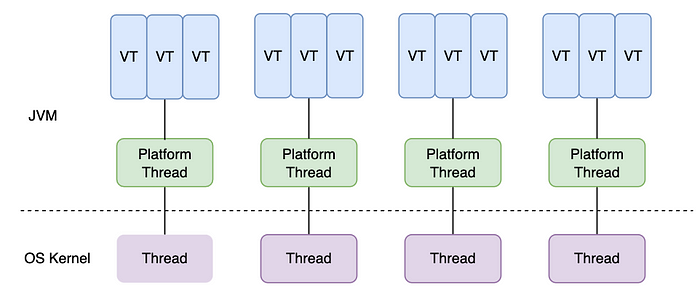

# 重温 Java 21 之虚拟线程

**虚拟线程（Virtual Thread）** 是 Java 21 中最突出的特性之一，作为 [Loom](https://wiki.openjdk.org/display/loom) 项目的一部分，开发人员对这个特性可谓期待已久。它由预览特性变成正式特性经历了两个版本的迭代，第一次预览是 Java 19 的 [JEP 425](https://openjdk.org/jeps/425) ，第二次预览是 Java 20 的 [JEP 436](https://openjdk.org/jeps/436)，在 Java 21 中虚拟线程特性正式发布。 

## 虚拟线程 vs. 平台线程

在引入虚拟线程之前，我们常使用 `java.lang.Thread` 来创建 Java 线程，这个线程被称为 **平台线程（Platform Thread）**，它和操作系统的内核线程是一对一的关系，由内核线程调度器负责调度。


为了提高应用程序的性能和系统的吞吐量，我们将添加越来越多的 Java 线程，下面是一个模拟多线程的例子，我们创建 10 万个线程，每个线程模拟 I/O 操作等待 1 秒钟：

```java
private static void testThread() {
  long l = System.currentTimeMillis();
  try(var executor = Executors.newCachedThreadPool()) {
    IntStream.range(0, 100000).forEach(i -> {
      executor.submit(() -> {
        Thread.sleep(Duration.ofSeconds(1));
        // System.out.println(i);
        return i;
      });
    });
  }
  System.out.printf("elapsed time：%d ms", System.currentTimeMillis() - l);
}
```

这里的 10 万个线程对应着 10 万个内核线程，这种通过大量的线程来提高系统性能是不现实的，因为内核线程成本高昂，不仅会占用大量资源来处理上下文切换，而且可用数量也很受限，一个线程大约消耗 1M~2M 的内存，当系统资源不足时就会报错：

```
$ java ThreadDemo.java
Exception in thread "pool-2-thread-427" java.lang.OutOfMemoryError: Java heap space
  at java.base/java.util.concurrent.SynchronousQueue$TransferStack.snode(SynchronousQueue.java:328)
  at java.base/java.util.concurrent.SynchronousQueue$TransferStack.transfer(SynchronousQueue.java:371)
  at java.base/java.util.concurrent.SynchronousQueue.poll(SynchronousQueue.java:903)
  at java.base/java.util.concurrent.ThreadPoolExecutor.getTask(ThreadPoolExecutor.java:1069)
  at java.base/java.util.concurrent.ThreadPoolExecutor.runWorker(ThreadPoolExecutor.java:1130)
  at java.base/java.util.concurrent.ThreadPoolExecutor$Worker.run(ThreadPoolExecutor.java:642)
  at java.base/java.lang.Thread.runWith(Thread.java:1596)
  at java.base/java.lang.Thread.run(Thread.java:1583)
```

于是人们又发明了各种线程池技术，最大程度地提高线程的复用性。下面我们使用一个固定大小为 200 的线程池来解决线程过多时报错的问题：

```java
private static void testThreadPool() {
  long l = System.currentTimeMillis();
  try(var executor = Executors.newFixedThreadPool(200)) {
    IntStream.range(0, 100000).forEach(i -> {
      executor.submit(() -> {
        Thread.sleep(Duration.ofSeconds(1));
        // System.out.println(i);
        return i;
      });
    });
  }
  System.out.printf("elapsed time：%d ms", System.currentTimeMillis() - l);
}
```

在使用固定大小的线程池后，不会出现创建大量线程导致报错的问题，任务可以正常完成。但是这里的线程池却成了我们应用程序最大的性能瓶颈，程序运行花费了 50 秒的时间：

```
$ java ThreadDemo.java
elapsed time：50863 ms
```

按理说每个线程耗时 1 秒，无论是多少个线程并发，总耗时应该都是 1 秒，很显然这里并没有发挥出硬件应有的性能。

为了充分利用硬件，研究人员转而采用线程共享的方式，它的核心想法是这样的：我们并不需要在一个线程上从头到尾地处理一个请求，当执行到等待 I/O 操作时，可以将这个请求缓存到池中，以便线程可以处理其他请求，当 I/O 操作结束后会收到一个回调通知，再将请求从池中取出继续处理。这种细粒度的线程共享允许在高并发操作时不消耗大量线程，从而消除内核线程稀缺而导致的性能瓶颈。

这种方式使用了一种被称为 **异步编程（Asynchronous Programming）** 的风格，通过所谓的 **响应式框架（Reactive Frameworks）** 来实现，比如著名的 [Reactor](https://projectreactor.io/) 项目一直致力于通过响应式编程来提高 Java 性能。但是这种风格的代码难以理解、难以调试、难以使用，普通开发人员只能对其敬而远之，只有高阶开发人员才能玩得转，所以并没有得到普及。

所以 Java 一直在寻找一种既能有异步编程的性能，又能编写起来简单的方案，最终虚拟线程诞生。

虚拟线程由 [Loom](https://wiki.openjdk.org/display/loom) 项目提出，最初被称为 **纤程（Fibers）**，类似于 **协程（Coroutine）** 的概念，它由 JVM 而不是操作系统进行调度，可以让大量的虚拟线程在较少数量的平台线程上运行。我们将上面的代码改成虚拟线程非常简单，只需要将 `Executors.newFixedThreadPool(200)` 改成 `Executors.newVirtualThreadPerTaskExecutor()` 即可：

```java
private static void testVirtualThread() {
  long l = System.currentTimeMillis();
  try(var executor = Executors.newVirtualThreadPerTaskExecutor()) {
    IntStream.range(0, 100000).forEach(i -> {
      executor.submit(() -> {
        Thread.sleep(Duration.ofSeconds(1));
        // System.out.println(i);
        return i;
      });
    });
  }
  System.out.printf("elapsed time：%d ms", System.currentTimeMillis() - l);
}
```

运行结果显示，虚拟线程使得程序的性能得到了非常显著的提升，10 万个线程全部运行只花费 1 秒多的时间：

```
$ java ThreadDemo.java
elapsed time：1592 ms
```

虚拟线程的数量可以远大于平台线程的数量，多个虚拟线程将由 JVM 调度在某个平台线程上执行，一个平台线程可以在不同的时间执行不同的虚拟线程，当虚拟线程被阻塞或等待时，平台线程可以切换到另一个虚拟线程执行。

虚拟线程、平台线程和系统内核线程的关系图如下所示：



值得注意的是，虚拟线程适用于 I/O 密集型任务，不适用于计算密集型任务，因为计算密集型任务始终需要 CPU 资源作为支持。如果测试程序中的任务不是等待 1 秒钟，而是执行一秒钟的计算（比如对一个巨大的数组进行排序），那么程序不会有明显的性能提升。因为虚拟线程不是更快的线程，它们运行代码的速度与平台线程相比并无优势。虚拟线程的存在是为了提供更高的吞吐量，而不是速度（更低的延迟）。

## 创建虚拟线程

为了降低虚拟线程的使用门槛，官方尽力复用原有的 `java.lang.Thread` 线程类，让我们的代码可以平滑地过渡到虚拟线程的使用。下面列举几种创建虚拟线程的方式：

### 通过 `Thread.startVirtualThread()` 创建

```java
Thread.startVirtualThread(() -> {
  System.out.println("Hello");
});
```

### 使用 `Thread.ofVirtual()` 创建

```java
Thread.ofVirtual().start(() -> {
  System.out.println("Hello");
});
```

上面的代码通过 `start()` 直接启动虚拟线程，也可以通过 `unstarted()` 创建一个未启动的虚拟线程，再在合适的时机启动：

```java
Thread thread = Thread.ofVirtual().unstarted(() -> {
  System.out.println("Hello");
});
thread.start();
```

> 和 `Thread.ofVirtual()` 对应的是 `Thread.ofPlatform()`，用于创建平台线程。

### 通过 `ThreadFactory` 创建

```java
ThreadFactory factory = Thread.ofVirtual().factory();
Thread thread = factory.newThread(() -> {
  System.out.println("Hello");
});
thread.start();
```

### 通过 `Executors.newVirtualThreadPerTaskExecutor()` 创建

```java
try(var executor = Executors.newVirtualThreadPerTaskExecutor()) {
  executor.submit(() -> {
    System.out.println("Hello");
  });
}
```

这种方式和传统的创建线程池非常相似，只需要改一行代码就可以把之前的线程池切换到虚拟线程。

很有意思的一点是，这里我们并没有指定虚拟线程的数量，这是因为虚拟线程非常廉价非常轻量，使用后立即就被销毁了，所以根本不需要被重用或池化。

正是由于虚拟线程非常轻量，我们可以在单个平台线程中创建成百上千个虚拟线程，它们通过暂停和恢复来实现线程之间的切换，避免了上下文切换的额外耗费，兼顾了多线程的优点，简化了高并发程序的复杂，可以有效减少编写、维护和观察高吞吐量并发应用程序的工作量。

## 调试虚拟线程

JDK 长期以来一直提供调试、分析和监控线程的机制，这些机制对于故障排查、维护和优化是必不可少的，JDK 提供了很多工具来实现这点，这些工具现在对虚拟线程也提供了同样的支持。

比如 `jstack` 或 `jcmd` 是流行的线程转储工具，它们可以打印出应用程序的所有线程，这种扁平的列表结构对于几十或几百个平台线程来说还可以，但对于成千上万的虚拟线程来说已经不适合了，于是在 `jcmd` 中引入了一种新的线程转储方式，以 JSON 格式将虚拟线程与平台线程一起打印：

```
$ jcmd <pid> Thread.dump_to_file -format=json <file>
```

以下是这样的线程转储的示例：


## 小结

今天我们学习了 Java 21 中最令人期待的特性之一：**虚拟线程（Virtual Thread）**，这是 Loom 项目从预览到正式发布的重要里程碑。

虚拟线程由 JVM 而非操作系统调度，可以让大量的虚拟线程在较少的平台线程上运行。这种设计使得我们可以创建成百上千甚至百万个虚拟线程而无需担心资源耗尽，虚拟线程之间通过暂停和恢复来实现切换，避免了传统线程上下文切换带来的额外开销。

虚拟线程特别适合 I/O 密集型的应用程序，对于网络服务、数据库连接、文件读写等涉及 I/O 操作的场景，虚拟线程能够带来显著的性能提升。然而需要注意的是，虚拟线程并不能提升 CPU 密集型任务的处理能力，因为其本质上并不是更快的线程，而是通过更高效的线程调度来提高吞吐量。

虚拟线程的推出标志着 Java 在并发编程领域的一次重大进步，它有望改变 Java 应用程序的构建方式，使得开发者能够更加轻松地编写高吞吐量、易于维护的并发应用程序。随着生态中越来越多的框架和库对虚拟线程的支持，相信虚拟线程会逐步成为 Java 并发编程的首选方案。
