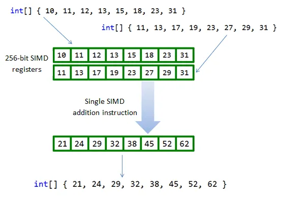

# 重温 Java 21 之向量 API

**向量 API** 最初由 [JEP 338](https://openjdk.java.net/jeps/338) 提出，并作为孵化 API 集成到 Java 16 中，在 Java 17 到 20 中，又经过了 [JEP 414](https://openjdk.java.net/jeps/414)、[JEP 417](https://openjdk.java.net/jeps/417)、[JEP 426](https://openjdk.java.net/jeps/426)、[JEP 438](https://openjdk.org/jeps/438) 四次的孵化，这次在 Java 21 中，已经是第六次孵化了。

**向量 API** 又被称为 **Vector API**，要注意，这里讲的并不是 Java 中的 [Vector 集合类](https://docs.oracle.com/javase/8/docs/api/java/util/Vector.html)，而是一种专门用于向量计算的全新 API。尽管这个 API 还在孵化期，并没有正式发布，但是这项技术很值得我们提前学习和了解，因为这项技术代表了 Java 语言发展的一个重要方向，在未来一定会有着重要的影响。随着生成式人工智能的发展，Embedding 技术也如日中天，它将各种类型的数据（如文本、图像、声音等）转换为高维数值向量，从而实现对数据特征和语义信息的表示。Embedding 技术在个性化推荐、多模态检索和自然语言处理等领域中发挥着重要作用，而这些场景都离不开向量计算。

## 什么是向量？

向量是数学和物理学中的一个基本概念，具有大小和方向两个属性，比如物理学中的力就是向量。向量可以有多种不同的表示方式：

* 在代数中，一般印刷用黑体的小写英文字母来表示（比如 **a**、**b**、**c** 等），手写用在 a、b、c 等字母上加一箭头（→）表示；
* 在几何中，向量可以形象化地表示为带箭头的线段，箭头所指的方向代表向量的方向，线段长度则代表向量的大小；
* 在坐标系中，向量可以用点的坐标位置来表示，比如平面直角坐标系中的向量可以记为 `(x, y)`，空间直角坐标系中的向量可以记为 `(x, y, z)`，多维空间以此类推；此外，向量也可以使用矩阵来表示；
* 在计算机科学中，向量可以被理解为一个数字列表或数组，这在编程语言中尤为常见。

和向量这个概念相对应的，还有标量、矩阵、张量等概念，这几个概念可以代表不同的维度，一般用点线面体来类比：

* 点——标量（scalar）
* 线——向量（vector）
* 面——矩阵（matrix）
* 体——张量（tensor）


## 标量计算 vs. 向量计算

标量就是一个数字，在 Java 中通常可以表示为一个整数或浮点数等，我们所熟知的算术运算基本上都是作用于标量之上的，比如下面的代码对 `a` 和 `b` 两个标量求和：

```java
int a = 1;
int b = 1;
int c = a + b;
```

如果将 `a` 和 `b` 换成向量，也就是数组，该如何求和呢？最简单的方法是使用 `for` 循环依次相加数组中对应的元素：

```java
int[] a = new int[] {1, 2, 3, 4};
int[] b = new int[] {1, 2, 3, 4};
int[] c = new int[4];
for (int i = 0; i < a.length; i++) {
  c[i] = a[i] + b[i];
}
```

很显然这不是什么高明的做法，仔细观察上面的代码就会发现，对于数组中每个元素的相加是互不影响的，那么我们能不能并行计算呢？一种有效的解决方法是使用 **并行流（Parallel Stream）**：

```java
IntStream.range(0, a.length)
  .parallel()
  .forEach(i -> c[i] = a[i] + b[i]);
```

另一种解决方法就是我们将要学习的 **向量 API（Vector API）**：

```java
IntVector aVector = IntVector.fromArray(IntVector.SPECIES_128, a, 0);
IntVector bVector = IntVector.fromArray(IntVector.SPECIES_128, b, 0);
IntVector cVector = aVector.add(bVector);
```

注意，由于向量 API 并没有正式发布，运行时需要手动加上 `jdk.incubator.vector` 模块：

```
$ java --add-modules jdk.incubator.vector VectorDemo.java
```

向量 API 定义了专门的向量类，比如这里的 `IntVector`，并提供了 `fromArray` 方法方便我们将数组转换为向量，然后再通过 `aVector.add(bVector)` 执行两个向量的加法运算。

除了加法运算，向量 API 还提供了一组方法来执行各种其他的向量计算：

* 算术运算（Arithmetic Operations）
    * 加法：`vector1.add(vector2)`
    * 减法：`vector1.sub(vector2)`
    * 乘法：`vector1.mul(vector2)`
    * 除法：`vector1.div(vector2)`
* 逐元素操作（Element-Wise Operations）
    * 绝对值：`vector.abs()`
    * 负数：`vector.neg()`
    * 平方根：`vector.sqrt()`
    * 指数：`vector.exp()`
    * 对数：`vector.log()`
* 规约运算（Reductions）
    * 元素之和：`vector.reduce(VectorOperators.ADD)`
    * 最小元素：`vector.reduce(VectorOperators.MIN)`
    * 最大元素：`vector.reduce(VectorOperators.MAX)`
    * 平均值：`vector.reduce(VectorOperators.ADD).mul(1.0 / vector.length())`
* 逻辑运算（Logical Operations）
    * 与：`vector1.and(vector2)`
    * 或：`vector1.or(vector2)`
    * 非：`vector.not()`
* 比较操作（Comparisons）
    * 等于：`vector1.eq(vector2)`
    * 小于：`vector1.lt(vector2)`
    * 大于：`vector1.compare(VectorOperators.GT, vector2)`

## 单指令多数据（SIMD）

使用向量 API 来执行向量计算，不仅代码精简，容易理解，而且它还有另一个好处，那就是性能提升。尽管使用并行流也能提升一定的性能，但是并行流和向量 API 是两种完全不同的优化技术，前者使用多线程在不同的 CPU 核上并行计算，而后者通过 SIMD 技术，在单个 CPU 周期内对多个数据同时执行相同操作，从而达到并行计算的目的。

**SIMD（Single Instruction, Multiple Data，单指令多数据）** 是一种并行处理技术，它的核心思想是将一个控制器与多个处理单元结合在一起，使得这些处理单元可以针对不同的数据同时执行相同的操作，简单来说就是一个指令能够同时处理多个数据。这与传统的 **SISD（Single Instruction, Single Data，单指令单数据）** 形成对比，在后者中，一个指令只能处理一个数据。

在上面那个向量求和的例子中，我们先是使用 `for` 循环实现：

```java
for (int i = 0; i < a.length; i++) {
  c[i] = a[i] + b[i];
}
```

数组中的每个元素将使用（大致）1 个 CPU 指令进行计算，这意味着我们需要 4 个指令或 4 个 CPU 周期才能完成计算，这就是典型的 SISD。而使用向量 API 可以将向量的计算编译为对应 CPU 架构上的 SIMD 指令集，只要 1 个指令即可完成向量计算：



在实际应用中，许多现代处理器都支持 SIMD 指令集，如 Intel 的 **MMX**、**SSE** 和 **AVX**，ARM 的 **NEON** 和 **SVE** 等，这些指令集能够显著提升程序的执行效率，特别是在需要大量数值计算的场景下。不过使用这些指令集的门槛并不低，通常涉及到汇编语言或一些特殊的函数库，比如 Intel 的跨平台函数库 [IPP（Integrated Performance Primitives）](https://en.wikipedia.org/wiki/Integrated_Performance_Primitives) 或使用 [内置函数 (Intrinsic function)](https://en.wikipedia.org/wiki/Intrinsic_function) 等。

相比于传统的手写 SIMD 代码，Java 的向量 API 提供了更高的可读性和维护性，开发者可以使用熟悉的 Java 语法和类型系统，无需处理底层寄存器和指令，编写出简洁明了的、平台无关的、高性能的向量计算代码。

其实，在向量 API 提出之前，Java 已经在 SIMD 上探索了很长一段时间了，比如 HotSpot 的 [自动向量化（Auto-Vectorization）](https://cr.openjdk.org/~vlivanov/talks/2017_Vectorization_in_HotSpot_JVM.pdf) 功能，它将标量操作转换为 **超字操作（SuperWord Operations）**，然后再映射到 SIMD 指令。然而，这个过程完全依赖 JIT，并没有什么可靠的方法来保证编写的代码一定可以使用 SIMD 指令优化，有些代码甚至根本无法进行优化，开发人员必须深入了解 HotSpot 的自动向量化算法及其限制，才能实现可靠的性能提升。向量 API 使得这个过程完全由开发人员自己控制，因此可以写出更加可预测、更加稳健的代码。

> 我们可以通过 `-XX:-UseSuperWord` 参数关闭 HotSpot 的自动向量化功能。

## 使用向量 API

在学习了向量的基础知识之后，接下来我们将继续深入学习向量 API 的使用。

上面介绍向量计算时，我们已经学习了向量 API 的基本用法，使用 `IntVector` 实现两个向量相加。这个示例为了易于理解，做了简单处理，并没有考虑在实际使用时的边界情况，假设我们将 `a` 和 `b` 两个数组改成 10 个数字：

```java
int[] a = new int[] {1, 2, 3, 4, 5, 6, 7, 8, 9, 10};
int[] b = new int[] {1, 2, 3, 4, 5, 6, 7, 8, 9, 10};
IntVector aVector = IntVector.fromArray(IntVector.SPECIES_128, a, 0);
IntVector bVector = IntVector.fromArray(IntVector.SPECIES_128, b, 0);
IntVector cVector = aVector.add(bVector);
```

运行后得到的结果 `c` 仍然是 `[2, 4, 6, 8]`，后面新加的数字并没有计算。这是因为每个向量的存储空间有限，并不能一次存下所有的数据。这里涉及向量 API 的一个重要概念：**向量种类（Vector Species）**，它是 **数据类型（Data Types）** 和 **向量形状（Vector Shapes）** 的组合；所谓数据类型就是 Java 的基础类型，比如 byte、short、int、long 这些整数类型和 float、double 浮点类型，而所谓向量形状就是向量的位大小或位数；比如这里的向量种类为 `IntVector.SPECIES_128`，它代表数据类型为 int，向量形状为 128 位；而我们知道，一般情况下 int 值的大小为 32 位，所以这个向量一次只能存储 `128/32 = 4` 个 int 值，这也被形象地称为 **通道（Lanes）**，表示向量一次可以处理的数据个数。

知道这一点后，我们就可以写出更加通用的向量计算代码了。首先我们需要将数据按通道数分组，然后一组一组的进行处理：

```java
int[] a = new int[] {1, 2, 3, 4, 5, 6, 7, 8, 9, 10};
int[] b = new int[] {1, 2, 3, 4, 5, 6, 7, 8, 9, 10};
int[] c = new int[10];
int lanes = IntVector.SPECIES_128.length();
int loopBound = IntVector.SPECIES_128.loopBound(a.length);
for (int i = 0; i < loopBound; i += lanes) {
  IntVector aVector = IntVector.fromArray(IntVector.SPECIES_128, a, i);
  IntVector bVector = IntVector.fromArray(IntVector.SPECIES_128, b, i);
  IntVector cVector = aVector.add(bVector);
  cVector.intoArray(c, i);
}
for (int i = loopBound; i < a.length; i++) {
  c[i] = a[i] + b[i];
}
IntStream.of(c).forEach(x -> System.out.println(x));
```

我们可以注意到，在遍历时 i 每次增加 `lanes`，它的值等于 `IntVector.SPECIES_128.length()`，也就是通道数，一般来说该值等于 4，所以我们是按 4 个一组进行处理的。但是要注意数据不一定能被通道数完全整除，比如这里 10 个数字，前 8 个可以分为两组处理掉，还剩下 2 个怎么办呢？这时我们只能使用最原始的标量计算来处理了。

此外，在实际编码时向量种类不建议写死，可以使用 `IntVector.SPECIES_PREFERRED` 替代，它会根据平台自动选择最合适的向量种类：

```java
static final VectorSpecies<Integer> SPECIES = IntVector.SPECIES_PREFERRED;
```

可以看出尽管向量 API 的使用有不少好处，但是我们也需要谨慎对待：

* 首先，在使用向量 API 时，数据对齐是一个重要的考虑因素，不对齐的数据访问可能会导致性能下降。开发者需要确保数据在内存中的对齐方式，以充分发挥 SIMD 指令的优势；
* 另外，向量 API 有硬件依赖性，它依赖于底层硬件支持的 SIMD 指令集，许多功能可能在其他平台和架构上不可用，性能也可能会有所不同。开发者需要了解目标平台的特性，并进行适当的性能优化。

## 小结

今天我们学习了 Java 21 中的 **向量 API（Vector API）**，这个特性从 Java 16 开始就已引入，一直在不断演进和完善。学习内容总结如下：

1. **向量计算基础** - 向量是数学和物理学中的基本概念，在计算机科学中被表示为数组或列表。向量计算相比标量计算，通过一次性处理多个数据元素，显著提高了计算效率，这正是现代高性能计算的关键所在；
2. **SIMD 优势** - 向量 API 充分利用现代处理器的 SIMD（单指令多数据）指令集特性，如 Intel 的 AVX 和 ARM 的 NEON，相比于手写汇编或使用低级 Unsafe API，向量 API 提供了更高的可读性、更好的可维护性和更可靠的性能保证；
3. **向量 API 的使用**：虽然向量 API 带来了性能提升，但我们在使用时也需要关注数据对齐、硬件依赖性等问题，需要根据目标平台的特性进行适当的优化，这样才能充分发挥向量计算的优势；

随着生成式人工智能的快速发展，Embedding 技术和向量计算在推荐系统、多模态检索、自然语言处理等领域的应用日益广泛，向量 API 为 Java 在这些领域的应用提供了基础，有望推动 Java 在 AI 和数据科学领域的进一步发展。
