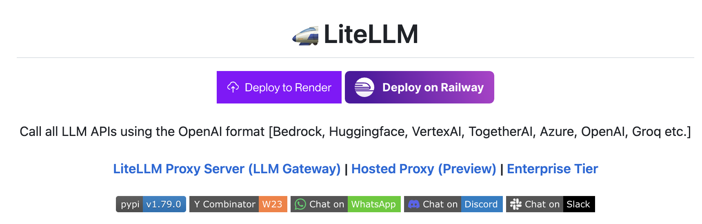
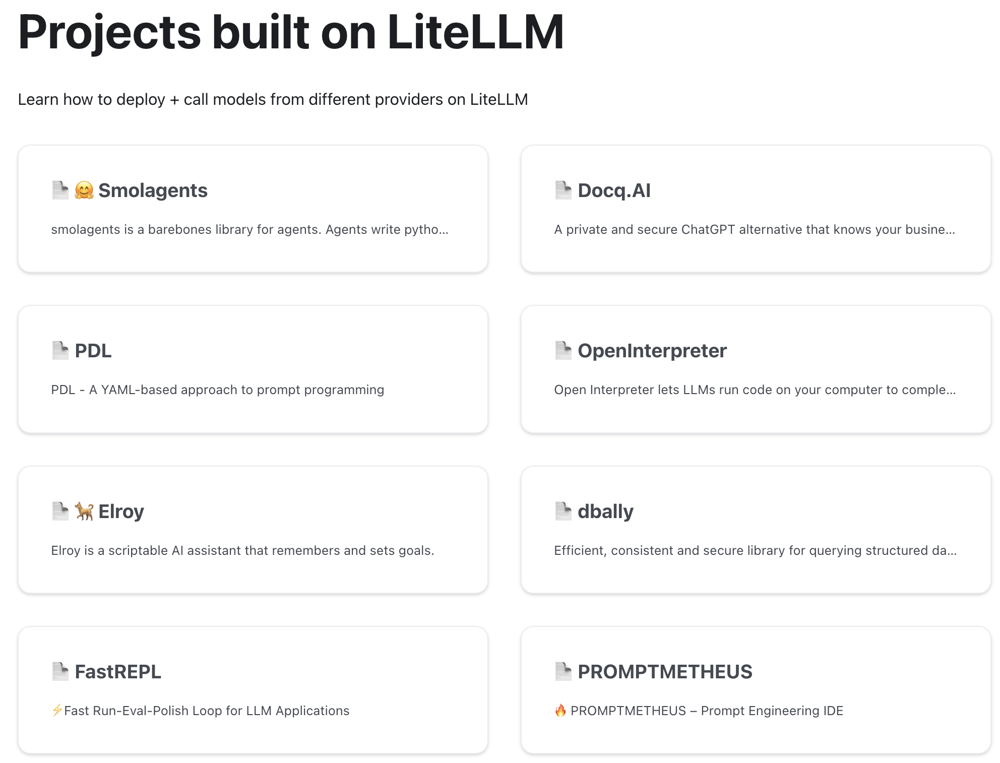
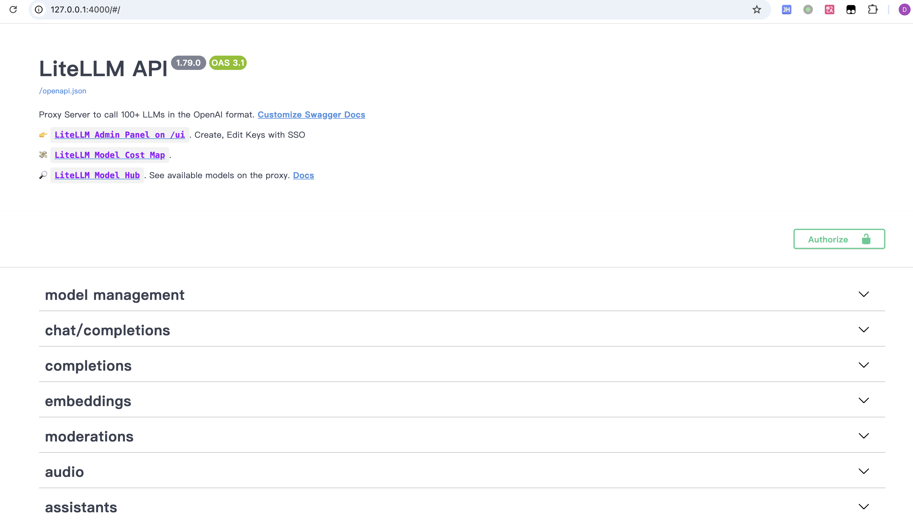
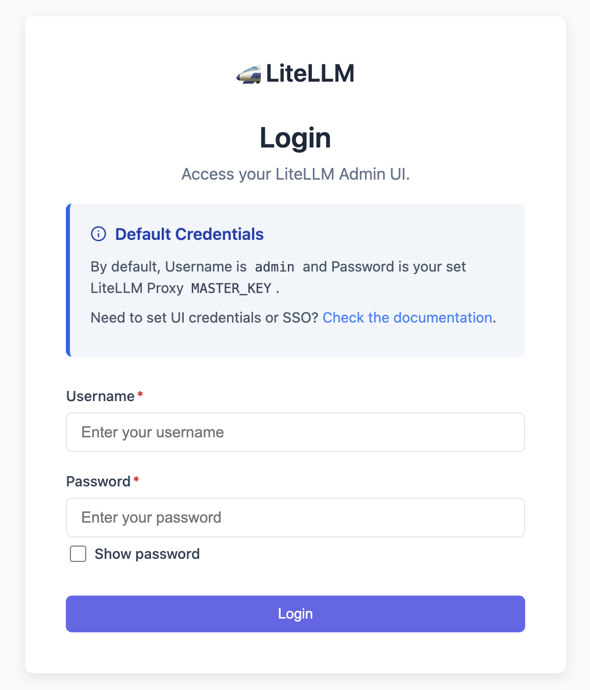
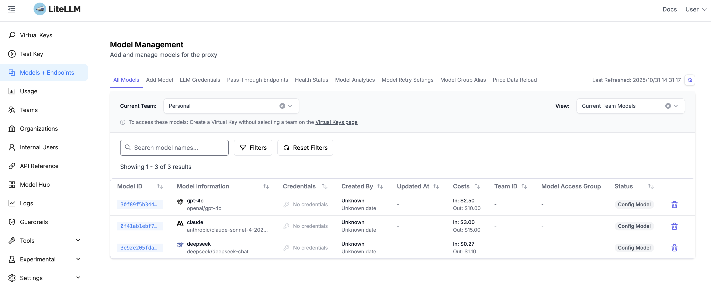

# LiteLLM 快速入门

在 AI 应用的开发过程中，开发者们往往面临一个共同的难题：如何高效地集成多家 LLM 服务商的接口？不同的服务商提供的 API 设计各不相同，OpenAI 有自己的风格，Anthropic 有另一套标准，Azure OpenAI、Google Vertex AI 又有各自的特色。每次需要切换服务商或支持多家模型时，开发者都要费力去学习和适配新的 API 规范，这无疑增加了开发成本和维护难度。

LiteLLM 正是为了解决这个问题而诞生的。它是一个开源的 Python 库，提供了一个统一的接口来调用 100+ 个 LLM 服务商的模型，无论是 OpenAI、Anthropic、Google、Cohere，还是国内的 DeepSeek、Qwen 等，都可以通过相同的 API 来调用。更强大的是，LiteLLM 不仅可以作为客户端 SDK 集成到你的应用中，还提供了一个功能丰富的 Proxy Server，可以用作 LLM Gateway 来统一管理和路由所有的 LLM 请求。



这篇文章是我们 LiteLLM 学习系列的第一篇，今天就让我们一起快速上手 LiteLLM，了解它的核心特性和基本用法。

## LiteLLM 概览

LiteLLM 的核心价值主要体现在以下几个方面：

**统一的 API 接口**：LiteLLM 将所有 LLM 服务商的 API 都转换为 OpenAI 的 API 格式，这意味着你只需要学习一套 API，就可以调用任何支持的模型。无论服务商更换、模型迭代，你的代码基本不需要改动。
**完善的重试和容错机制**：通过 Router 和 Fallback 功能，LiteLLM 支持在多个模型部署之间进行负载均衡和自动容错，当某个服务商出现故障时，可以自动切换到备用方案，确保服务的可用性。
**成本追踪和预算管理**：LiteLLM 可以自动计算每次 API 调用的成本，并支持设定每个用户或团队的预算限额，帮助企业更好地控制成本。
**Proxy Server 网关**：LiteLLM 提供的代理服务器可以作为一个中心化的 LLM 网关，统一处理认证、速率限制、成本追踪等问题，特别适合大型组织内部部署。

目前有[不少开源项目](https://docs.litellm.ai/docs/project)使用了 LiteLLM，比如 [smolagents](https://github.com/huggingface/smolagents)、[Open Interpreter](https://github.com/openinterpreter/open-interpreter)、[Quivr](https://github.com/QuivrHQ/quivr) 等：



我们之前学习的 Surfsense、Mem0、Claude Code、Chat2Graph 等项目，都或多或少地有着 LiteLLM 的影子。

## 作为客户端 SDK 使用

LiteLLM 最简单的使用方式就是作为 Python 客户端库，直接在你的应用中调用。首先安装依赖：

```bash
$ pip install litellm
```

### 基础调用

下面是最基础的使用示例，调用 OpenAI 的 gpt-4o 模型：

```python
from litellm import completion
import os

# 设置 API Key（也可以通过环境变量设置）
os.environ["OPENAI_API_KEY"] = "sk-xxx"

# 发送请求
response = completion(
  model="openai/gpt-4o",
  messages=[
    {"role": "user", "content": "你好，请自我介绍一下"}
  ]
)

# 打印响应
print(response.choices[0].message.content)
```

这里的 `model` 参数遵循 `provider/model_name` 的格式，LiteLLM 通过这个格式来识别应该用哪个服务商的 API。响应格式完全兼容 OpenAI 的 API，所以如果你之前用过 OpenAI SDK，会发现非常熟悉。

```json
{
  "id": "chatcmpl-CWZUWaec9CC3vYyH5WlJN5LJ6tGxj",
  "created": 1761878960,
  "model": "gpt-4o-2024-08-06",
  "object": "chat.completion",
  "system_fingerprint": null,
  "choices": [
    {
      "finish_reason": "stop",
      "index": 0,
      "message": {
        "content": "你好！我是一个由人工智能驱动的助手 ...",
        "role": "assistant",
        "tool_calls": null,
        "function_call": null
      }
    }
  ],
  "usage": {
    "completion_tokens": 68,
    "prompt_tokens": 13,
    "total_tokens": 81,
    "completion_tokens_details": null,
    "prompt_tokens_details": {
      "audio_tokens": null,
      "cached_tokens": 0
    },
    "cache_creation_input_tokens": 0,
    "cache_read_input_tokens": 0
  }
}
```

### 丰富的模型支持

LiteLLM 支持 100+ 个模型，包括：

- **商业模型**：OpenAI、Anthropic、Google Gemini、Cohere、Mistral 等
- **国内模型**：DeepSeek、通义千问、智谱 GLM、百川、千帆 等
- **本地模型**：Ollama、Hugging Face、vLLM 等
- **企业服务**：Azure OpenAI、AWS Bedrock、Google Vertex AI 等

这里是完整的模型供应商列表：

* https://docs.litellm.ai/docs/providers

例如，如果你想切换到 Claude，代码只需要改一行：

```python
os.environ["ANTHROPIC_API_KEY"] = "sk-xxx"

response = completion(
  model="anthropic/claude-sonnet-4-20250514",
  messages=[
    {"role": "user", "content": "你好，请自我介绍一下"}
  ]
)
```

或者使用国内的 DeepSeek：

```python
os.environ["DEEPSEEK_API_KEY"] = "sk-xxx"

response = completion(
  model="deepseek/deepseek-chat",
  messages=[
    {"role": "user", "content": "你好，请自我介绍一下"}
  ]
)
```

### 流式响应

对于需要实时流式输出的应用（比如对话应用），LiteLLM 通过传入 `stream=True` 参数来支持流式响应：

```python
response = completion(
  model="openai/gpt-4o",
  messages=[
    {"role": "user", "content": "写一首关于春天的诗"}
  ],
  stream=True
)

# 逐块输出响应
for chunk in response:
  content = chunk.choices[0].delta.content
  if content:
    print(content, end="")
```

### 异步调用

LiteLLM 也提供了异步 API `acompletion`，方便在异步框架中使用：

```python
import asyncio
from litellm import acompletion

# 异步请求
async def chat():
  response = await acompletion(
    model="openai/gpt-4o",
    messages=[
      {"role": "user", "content": "你好，请自我介绍一下"}
    ]
  )
  return response

# 运行异步函数
response = asyncio.run(chat())
print(response.choices[0].message.content)
```

### 异常处理

LiteLLM 会将所有服务商的异常都映射到 OpenAI 的异常类型，这样你就可以用统一的方式处理各种错误：

```python
from openai.error import APIError, RateLimitError
from litellm import completion

try:
  response = completion(
    model="openai/gpt-4o",
    messages=[{"role": "user", "content": "你好"}]
  )
except RateLimitError:
  print("请求过于频繁，请稍后重试")
except APIError as e:
  print(f"API 错误: {e}")
```

关于异常映射的详细信息可参考下面的文档：

* https://docs.litellm.ai/docs/exception_mapping

### 丰富的接口支持

除了 `completion` 文本补全接口，LiteLLM 还[兼容大量供应商的接口](https://docs.litellm.ai/docs/supported_endpoints)，比如：

- [/assistants](https://docs.litellm.ai/docs/assistants) - 兼容 OpenAI 的 Assistants API（目前已废弃，使用 Responses API 替代）
- [/audio/transcriptions](https://docs.litellm.ai/docs/audio_transcription)
- [/audio/speech](https://docs.litellm.ai/docs/text_to_speech)
- [/batches](https://docs.litellm.ai/docs/batches) - 兼容 OpenAI 的批处理接口
- [/containers](https://docs.litellm.ai/docs/containers) - 兼容 OpenAI 的容器管理接口，为代码解释器创建隔离的执行环境
- [/chat/completion](https://docs.litellm.ai/docs/completion)
- [/completions](https://docs.litellm.ai/docs/text_completion)
- [/converse](https://docs.litellm.ai/docs/bedrock_converse) - 兼容 Amazon Bedrock 的会话接口
- [/embeddings](https://docs.litellm.ai/docs/embedding/supported_embedding)
- [/files](https://docs.litellm.ai/docs/files_endpoints)
- [/fine_tuning](https://docs.litellm.ai/docs/fine_tuning) - 兼容 OpenAI 的模型微调接口
- [/generateContent](https://docs.litellm.ai/docs/generateContent) - 兼容 Google AI 的文本生成和多模交互接口
- [/guardrails/apply_guardrail](https://docs.litellm.ai/docs/apply_guardrail) - 调用内容审核接口
- [/invoke](https://docs.litellm.ai/docs/bedrock_invoke) - 兼容 Amazon Bedrock 的会话接口
- [/images/edits](https://docs.litellm.ai/docs/image_edits)
- [/images/generations](https://docs.litellm.ai/docs/image_generation)
- [/image/variations](https://docs.litellm.ai/docs/image_variations)
- [/videos](https://docs.litellm.ai/docs/videos)
- [/mcp](https://docs.litellm.ai/docs/mcp) - 查看和调用 MCP 工具
- [/v1/messages](https://docs.litellm.ai/docs/anthropic_unified) - 兼容 Anthropic 的大模型对话接口
- [/moderations](https://docs.litellm.ai/docs/moderation) - 兼容 OpenAI 的内容审核接口
- [/ocr](https://docs.litellm.ai/docs/ocr) - 兼容 Mistral 的 OCR API
- [/realtime](https://docs.litellm.ai/docs/realtime)
- [/rerank](https://docs.litellm.ai/docs/rerank) - 兼容 Cohere 的 Rerank API
- [/responses](https://docs.litellm.ai/docs/response_api) - 兼容 OpenAI 的 Responses API
- [/search](https://docs.litellm.ai/docs/search/) - 兼容 Perplexity 的 Search API
- [/vector_stores](https://docs.litellm.ai/docs/vector_stores/create) - 创建向量存储
- [/vector_stores/search](https://docs.litellm.ai/docs/vector_stores/search) - 检索向量存储
- [其他透传接口](https://docs.litellm.ai/docs/pass_through/intro)

## 作为 Proxy Server 使用

除了作为 SDK 使用，LiteLLM 还提供了一个企业级的 **代理服务器（Proxy Server）**，可以作为一个 **大模型网关（LLM Gateway）** 来使用。这对于需要统一管理多个服务商、对接多个应用的场景特别有价值。

### 核心功能

LiteLLM Proxy 主要有以下功能：

**多模型管理和负载均衡**：可以配置多个模型和多个部署，Proxy 会自动进行负载均衡，分散请求到不同的模型部署，提高整体吞吐量。
**密钥管理和成本追踪**：为每个团队或用户生成虚拟 API Key，追踪每个 Key 的成本消耗，支持设定使用预算和速率限制。
**统一的认证和授权**：Proxy 可以作为中心化的认证层，所有应用通过它来访问 LLM 服务，避免将各种 API Key 散布在各个应用中。
**可观测性和日志**：支持与 Langfuse、Helicone、LunaryAI 等可观测平台集成，记录所有 API 调用的详细信息，便于监控和调试。

### 快速启动

安装 Proxy 服务器需要额外的依赖：

```bash
$ pip install 'litellm[proxy]'
```

最简单的启动方式，只需一条命令：

```bash
$ litellm --model openai/gpt-4o

# INFO: Uvicorn running on http://0.0.0.0:4000
```

这样就启动了一个代理服务器，默认监听在 `4000` 端口上，直接浏览器打开可以看到它的 Swagger 文档页面，这里列出了 LiteLLM Proxy 的所有接口：



> 可以通过 `--port` 参数修改监听的端口。

### 使用 Config.yaml 配置

如果你想用其他模型或配置多个模型，可以使用配置文件。创建一个 `config.yaml` 文件来配置多个模型：

```yaml
model_list:
  - model_name: gpt-4o
    litellm_params:
      model: openai/gpt-4o
      api_key: os.environ/OPENAI_API_KEY

  - model_name: claude
    litellm_params:
      model: anthropic/claude-sonnet-4-20250514
      api_key: os.environ/ANTHROPIC_API_KEY

  - model_name: deepseek
    litellm_params:
      model: deepseek/deepseek-chat
      api_key: os.environ/DEEPSEEK_API_KEY

general_settings:
  master_key: sk-1234  # 管理员密钥
```

> 完整的配置文件参数参考官方文档：https://docs.litellm.ai/docs/proxy/configs

然后用配置文件启动：

```bash
$ litellm --config config.yaml

# INFO: Uvicorn running on http://0.0.0.0:4000
```

### 调用 Proxy

启动后，你可以通过 OpenAI SDK 或任何兼容 OpenAI API 的工具来调用 Proxy。Proxy 的 API 与 OpenAI 完全兼容，这意味着你可以无缝地将现有的 OpenAI 集成改为使用 LiteLLM Proxy。

使用 OpenAI Python SDK：

```python
import openai

client = openai.OpenAI(
  api_key="sk-1234",
  base_url="http://127.0.0.1:4000"
)

response = client.chat.completions.create(
  model="gpt-4o",  # 使用配置中的模型名
  messages=[{"role": "user", "content": "你好"}]
)

print(response.choices[0].message.content)
```

使用 cURL：

```bash
$ curl -X POST 'http://127.0.0.1:4000/chat/completions' \
  -H 'Authorization: Bearer sk-1234' \
  -H 'Content-Type: application/json' \
  -d '{
    "model": "gpt-4o",
    "messages": [{"role": "user", "content": "你好"}]
  }'
```

### Docker 部署

对于生产环境，LiteLLM 提供了[完整的 Docker 支持](https://docs.litellm.ai/docs/proxy/deploy)。最简单的方式是使用 Docker Compose：

```bash
# 下载 Docker Compose 配置
$ curl -O https://raw.githubusercontent.com/BerriAI/litellm/main/docker-compose.yml

# 创建 .env 文件设置必要的环境变量
$ cat > .env <<EOF
LITELLM_MASTER_KEY="sk-1234"
OPENAI_API_KEY="your-api-key"
EOF

# 启动服务
$ docker compose up -d
```

或者直接使用 Docker 运行：

```bash
docker run \
  -v $(pwd)/config.yaml:/app/config.yaml \
  -e OPENAI_API_KEY="your-api-key" \
  -p 4000:4000 \
  ghcr.io/berriai/litellm:main-stable \
  --config /app/config.yaml
```

### Web UI 和管理界面

此外，LiteLLM Proxy 还提供了一个管理后台，方便我们添加新的模型配置、查看调用日志、监控成本和使用情况等。启动 Proxy 之后，首次访问 `http://127.0.0.1:4000/ui` 进入登录页面：



默认用户名为 `admin`，密码为 `config.yaml` 文件中配置的 `master_key`，默认就是 `sk-1234`，登录成功后即可进入管理界面：



可以在 `.env` 文件中通过 `UI_USERNAME` 和 `UI_PASSWORD` 修改管理员的用户名和密码：

```sh
UI_USERNAME=aneasystone
UI_PASSWORD=12345678
```

另外，对于不希望有管理后台的用户，可以通过 `DISABLE_ADMIN_UI` 参数关闭 Web UI 功能：

```sh
DISABLE_ADMIN_UI=True
```

## 小结

这篇文章作为 LiteLLM 学习系列的开篇，我们快速了解了 LiteLLM 的核心特性和两种主要的使用方式：

1. **作为 Python SDK**：简单易用，适合快速集成和个人项目，只需几行代码就能调用任何模型；
2. **作为 Proxy Server**：功能完整，适合企业级部署，可以统一管理多个模型，实现成本追踪、速率限制、虚拟 Key 管理等功能；

LiteLLM 通过统一的 API 接口解决了多模型集成的复杂性问题，而 Proxy Server 则进一步提供了一个企业级的 LLM 网关解决方案。在后续的系列文章中，我们将深入探讨 LiteLLM 的高级功能，包括路由和负载均衡、成本追踪和预算管理的细节、与可观测性平台的集成等。

敬请期待！
