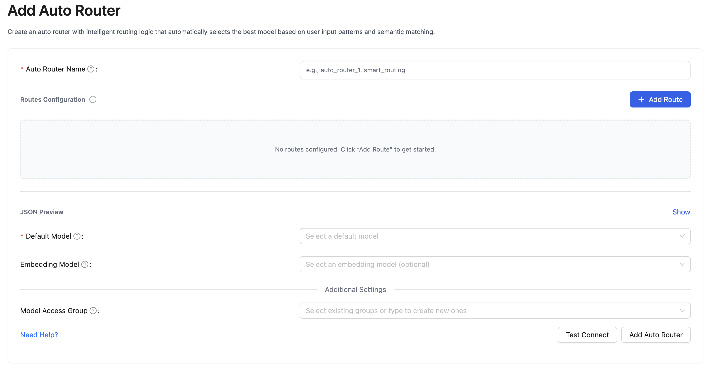
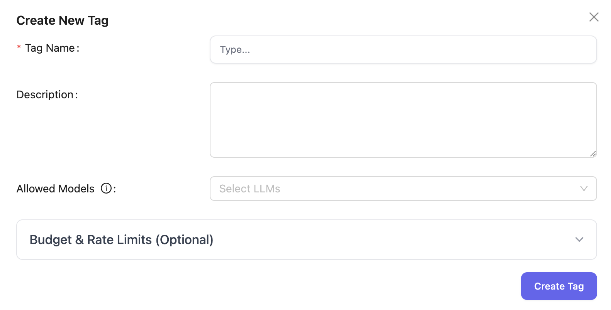

# 学习 LiteLLM 的路由和回退策略

在之前的系列文章中，我们学习了 LiteLLM 的基础使用，包括模型管理、用户管理、权限认证和访问控制机制等。当我们的 LLM 网关要承载越来越多的流量、接入越来越多的模型供应商时，就会面临新的挑战：某个模型供应商的 API 突然出现故障、请求量激增导致速率限制、某些模型的响应时间过长、成本控制需要在多个供应商之间进行优化选择等等。这些问题如果处理不当，会严重影响用户体验，甚至导致业务中断。

为此 LiteLLM 提供了一套完整的智能路由和容错解决方案，它通过智能的负载均衡、自动容错和多层次的回退策略，确保在复杂的多模型环境中提供稳定可靠的服务。今天这篇文章，我们就来深入学习 LiteLLM 的路由和回退策略，了解它是如何帮助我们构建一个高可用、高性能、低成本的 LLM 网关。

## 负载均衡

让我们从最简单的场景开始：假设你有一个 `gpt-4o` 模型，但是在不同的地区部署了多个实例（可能是 Azure 的不同区域，也可能是不同的云厂商），如何在这些实例之间分配请求？

LiteLLM 的路由配置非常简洁，只需要在 `model_list` 中将多个 `model_name` 配置成相同的名字即可：

```yaml
model_list:
  - model_name: gpt-4o
    litellm_params:
      model: azure/gpt-4o
      api_base: https://my-endpoint-us.openai.azure.com/
      api_key: os.environ/AZURE_API_KEY
  - model_name: gpt-4o
    litellm_params:
      model: azure/gpt-4o
      api_base: https://my-endpoint-eu.openai.azure.com/
      api_key: os.environ/AZURE_API_KEY
      api_version: os.environ/AZURE_API_VERSION
  - model_name: gpt-4o
    litellm_params:
      model: gpt-4o
      api_key: os.environ/OPENAI_API_KEY
```

在这个配置中，三个不同的部署都映射到同一个模型名称 `gpt-4o`，它们被称为 **模型组（Model Group）**，当用户请求 `model="gpt-4o"` 时，LiteLLM 会自动在模型组中的部署之间分配请求。

### 路由策略

LiteLLM 提供了多种不同的路由策略，每种策略针对不同的使用场景：

- **简单随机策略（`simple-shuffle`）**：这是默认的路由策略，采用随机选择算法，确保请求在所有可用部署间均匀分布；其优点是实现简单，负载均匀，适用于大多数通用场景；
- **最少忙碌策略（`least-busy`）**：开启该策略后，LiteLLM 会实时监控每个部署的活跃请求数，优先选择当前活跃请求数最少的部署；其优点是动态负载均衡，避免热点，适用于高并发场景；
- **延迟优化策略（`latency-based-routing`）**：基于历史延迟数据，优先选择响应时间最短的部署，开启后 LiteLLM 会维护每个部署的延迟历史，并使用滑动窗口计算平均值；这种策略能优化用户体验，减少等待时间，适用于对延迟敏感的交互式应用；
- **成本优化策略（`cost-based-routing`）**：基于模型定价信息，优先选择成本最低的部署；它的优点是控制成本，优化预算使用，适用于成本敏感的批量处理场景；
- **使用率均衡策略（`usage-based-routing`）**：也被称为 **Rate Limit Aware** 策略，基于 RPM/TPM 使用率选择负载最低的部署，确保各部署的负载均衡；这种策略充分利用所有部署的配额，适用于需要精确控制流量分配的场景；不过这种策略会对性能产生影响，因为它要频繁操作 Redis 来跟踪不同部署的使用情况，从而导致延迟显著增加，不建议用于生产环境；

> 关于使用率策略还有一个 v2 版本（`usage-based-routing-v2`），它将所有 Redis 操作改为异步，有一定的性能提升。

### 简单随机策略

在高流量场景中，为了获得最佳性能，官方建议使用简单随机（`simple-shuffle`）策略，这也是 LiteLLM 的默认路由策略，它随机选择部署，性能开销最小。在 LiteLLM Proxy 中配置路由策略如下：

```yaml
router_settings:
  routing_strategy: "simple-shuffle"
```

或者在 SDK 中通过 `Router` 使用：

```python
router = Router(
  model_list=model_list,
  routing_strategy="simple-shuffle"
)
```

此外，简单随机策略根据配置，又分为 **基于 RPM 随机（RPM-based shuffling）** 和 **基于权重随机（Weight-based shuffling）** 两种。下面是基于权重随机的示例：

```yaml
model_list:
  - model_name: gpt-4o
    litellm_params:
      model: azure/gpt-4o
      api_base: https://my-endpoint-us.openai.azure.com/
      api_key: os.environ/AZURE_API_KEY
      weight: 9  # 90% 的概率被选中
  - model_name: gpt-4o
    litellm_params:
      model: azure/gpt-4o
      api_base: https://my-endpoint-eu.openai.azure.com/
      api_key: os.environ/AZURE_API_KEY
      api_version: os.environ/AZURE_API_VERSION
      weight: 1  # 10% 的概率被选中
```

### 跨实例的负载均衡

在生产环境中，LiteLLM Proxy 通常会部署多个实例。但多实例部署会带来一个问题：不同实例之间无法直接通信，它们无法协调已使用的 RPM/TPM。

例如，假设 OpenAI 限制我们每分钟 1000 个请求，而我们有 3 个 LiteLLM 实例：

```
实例 A：已用 400 个请求
实例 B：已用 300 个请求
实例 C：已用 300 个请求
总计：1000 个请求
```

如果没有跨实例的协调，每个实例可能还会继续发送请求，导致全局超过限制。

为了解决这个问题，LiteLLM 提供了 **Redis 支持**，可以将 RPM/TPM 数据存储在共享的 Redis 中：

```yaml
router_settings:
  redis_host: redis.default.svc.cluster.local
  redis_port: 6379
  redis_db: 0
```

启用 Redis 后，所有实例都会定期同步它们的 RPM/TPM 数据到 Redis，从而实现全局的限流和负载均衡。

## 高级路由策略

除了基础的负载均衡，LiteLLM 还提供了多种智能化路由策略，能够根据内容、预算、标签等维度进行智能路由。

### 自动路由

**自动路由（Auto Routing）** 也被称为 **语义路由 (Semantic Routing)**，能够根据请求内容自动选择最适合的模型。比如，你可以配置：

- 编程相关的请求路由到代码能力强的模型
- 创意写作请求路由到创意能力强的模型
- 普通对话请求路由到性价比高的模型

> 注意，开启自动路由需要额外安装 [semantic-router](https://github.com/aurelio-labs/semantic-router) 依赖。

首先，需要在 `router.json` 文件中定义路由规则：

```json
{
  "encoder_type": "openai",
  "encoder_name": "text-embedding-3-large",
  "routes": [
    {
      "name": "gpt-4o",
      "utterances": [
        "写一首关于春天的诗"
      ],
      "description": "通用助手",
      "score_threshold": 0.5
    },
    {
      "name": "claude-sonnet-4",
      "utterances": [
        "使用 Python 语言实现冒泡排序算法"
      ],
      "description": "代码助手",
      "score_threshold": 0.5
    }
  ]
}
```

然后在模型列表中配置自动路由：

```yaml
model_list:
  
  # 嵌入模型（用于计算内容相似度）
  - model_name: text-embedding-3-large
    litellm_params:
      model: text-embedding-3-large
      api_key: os.environ/OPENAI_API_KEY

  # 自动路由
  - model_name: auto_router
    litellm_params:
      model: auto_router/auto_router
      auto_router_config_path: router.json
      auto_router_default_model: gpt-4o
      auto_router_embedding_model: text-embedding-3-large

  # 目标路由
  - model_name: gpt-4o
    litellm_params:
      model: openai/gpt-4o
      api_key: os.environ/OPENAI_API_KEY
  - model_name: claude-sonnet-4
    litellm_params:
      model: anthropic/claude-sonnet-4-20250514
      api_key: os.environ/ANTHROPIC_API_KEY
```

然后使用下面的命令进行测试：

```bash
# 这条请求会被自动路由到 gpt-4o
$ curl -X POST 'http://127.0.0.1:4000/chat/completions' \
  -H 'Authorization: Bearer sk-1234' \
  -H 'Content-Type: application/json' \
  -d '{
    "model": "auto_router",
    "messages": [{"role": "user", "content": "写一首关于春天的诗"}]
  }'
```

```bash
# 这条请求会被自动路由到 claude-sonnet-4
$ curl -X POST 'http://127.0.0.1:4000/chat/completions' \
  -H 'Authorization: Bearer sk-1234' \
  -H 'Content-Type: application/json' \
  -d '{
    "model": "auto_router",
    "messages": [{"role": "user", "content": "使用 Python 语言实现冒泡排序算法"}]
  }'
```

自动路由也可以在 Admin UI 中添加：



自动路由的工作原理很简单：

1. **内容嵌入**：使用配置的嵌入模型将用户请求转换为向量；
2. **相似度计算**：计算请求向量与每条规则的 `utterances` 向量的相似度；
3. **阈值判断**：如果最高相似度超过 `score_threshold`，则选择对应模型；
4. **默认回退**：如果没有规则匹配，使用 `auto_router_default_model` 默认模型；

### 标签路由

**标签路由（Tag Routing）** 允许基于请求的标签来选择不同的模型部署，这在多租户场景下特别有用。比如：

- **多租户隔离**：不同租户使用不同的模型实例
- **服务分级**：免费用户使用廉价服务，付费用户使用真实服务
- **团队隔离**：不同团队使用不同的部署实例

它的配置也很简单：

```yaml
model_list:
  - model_name: gpt-4o
    litellm_params:
      model: openai/gpt-4o-mini
      api_key: os.environ/OPENAI_API_KEY
      tags: ["free"]          # 免费用户使用
  - model_name: gpt-4o
    litellm_params:
      model: openai/gpt-4o
      api_key: os.environ/OPENAI_API_KEY
      tags: ["paid"]          # 付费用户使用
  - model_name: gpt-4o
    litellm_params:
      model: openai/gpt-4o-mini
      api_key: os.environ/OPENAI_API_KEY
      tags: ["default"]       # 默认路由

router_settings:
  enable_tag_filtering: true  # 开启标签路由
```

注意通过 `enable_tag_filtering` 配置开启标签路由功能，在这个例子中，我们定义了 `gpt-4o` 这个模型，当免费用户（带 `free` 标签）请求时将路由到 `gpt-4o-mini` 模型，只有付费用户（带 `paid` 标签）请求时才会路由到真正的 `gpt-4o` 模型。

客户端调用方式如下：

```bash
# 免费用户请求
$ curl -X POST 'http://127.0.0.1:4000/chat/completions' \
  -H 'Authorization: Bearer sk-1234' \
  -H 'Content-Type: application/json' \
  -d '{
    "model": "gpt-4o",
    "messages": [{"role": "user", "content": "Hello"}],
    "tags": ["free"]
  }'
```

> 请求入参中的 `tags` 也可以放在 `metadata` 中。

```bash
# 付费用户请求
$ curl -X POST 'http://127.0.0.1:4000/chat/completions' \
  -H 'Authorization: Bearer sk-1234' \
  -H 'Content-Type: application/json' \
  -d '{
    "model": "gpt-4o",
    "messages": [{"role": "user", "content": "Hello"}],
    "tags": ["paid"]
  }'
```

我们也可以在 Admin UI 中添加标签并关联对应的模型：



### 预算路由

在企业环境中，成本控制是一个关键考虑因素。LiteLLM 支持按 **供应商**、**模型**、**标签** 三个维度设置预算限制，实现自动的成本控制。

#### 供应商预算（Provider Budget）

为不同的 LLM 供应商设置日预算或月预算：

```yaml
router_settings:
  provider_budget_config:
    openai:
      budget_limit: 100.0    # $100/day
      time_period: "1d"
    azure:
      budget_limit: 500.0    # $500/month
      time_period: "30d"
    anthropic:
      budget_limit: 200.0    # $200/10days
      time_period: "10d"
```

当某个供应商的预算用完后，LiteLLM 会自动将请求路由到其他预算充足的供应商。

#### 模型预算（Model Budget）

为特定模型设置预算：

```yaml
model_list:
  - model_name: gpt-4o
    litellm_params:
      model: openai/gpt-4o
      api_key: os.environ/OPENAI_API_KEY
      max_budget: 10.0         # $10/day
      budget_duration: "1d"
  - model_name: gpt-4o-mini
    litellm_params:
      model: openai/gpt-4o-mini
      api_key: os.environ/OPENAI_API_KEY
      max_budget: 100.0        # $100/month
      budget_duration: "30d"
```

#### 标签预算（Tag Budget）

为特定的业务标签设置预算（企业特性）：

```yaml
litellm_settings:
  tag_budget_config:
    product:chat-bot:         # 客服机器人标签
      max_budget: 50.0        # $50/day
      budget_duration: "1d"
    product:internal-tool:    # 内部工具标签
      max_budget: 200.0       # $200/day
      budget_duration: "1d"
```

## 重试策略

在生产环境中，我们还需要考虑各种故障场景，LiteLLM 提供了一套完整的可靠性保障机制，包括 **重试策略（Retry Policy）** 和 **回退策略（Fallbacks）**。

当请求失败时，LiteLLM 会自动重试，可以通过下面的参数修改重试次数和重试间隔：

```yaml
router_settings:
  num_retries: 2    # 全局重试次数
  retry_after: 5    # 最小重试间隔（秒）
```

LiteLLM 还可以针对不同类型的错误来重试：

```yaml
router_settings:
  num_retries: 2    # 全局重试次数
  retry_after: 5    # 最小重试间隔（秒）
  retry_policy:
    "RateLimitErrorRetries": 3        # 速率限制错误重试3次
    "ContentPolicyViolationErrorRetries": 2  # 内容政策违规重试2次
    "TimeoutErrorRetries": 2          # 超时错误重试2次
    "BadRequestErrorRetries": 0       # 错误请求不重试
    "AuthenticationErrorRetries": 0   # 认证错误不重试
```

> 值得注意的是，针对速率限制错误，LiteLLM 使用 **指数退避（Exponential Backoffs）** 重试策略，每次重试的间隔时间会按照指数级增长，而非固定间隔。

## 回退策略

**回退（Fallbacks）** 是另一种可靠性保障机制，当重试仍然失败时，LiteLLM 会尝试回退到其他模型部署或模型组,它确保在部分模型不可用时系统能够优雅降级，而不是直接失败。

> 回退和重试的区别：重试是针对同一部署的多次尝试，通常用于应对临时性故障（网络抖动等），而回退尝试不同的部署，用于应对永久性故障（服务宕机等）。合理使用这两种机制，能够显著提高系统的可靠性。

LiteLLM 实现了三种不同的回退策略：

1. **上下文窗口回退 (Context Window Fallbacks)** - 当请求的 token 数量超过当前模型的上下文窗口限制时，自动切换到支持更大上下文的模型；
2. **内容策略回退 (Content Policy Fallbacks)** - 当请求因内容审核被拒绝时，自动切换到内容限制更宽松的模型；
3. **通用故障回退 (General Fallbacks)** - 处理网络错误、服务不可用、速率限制等各种故障情况；

回退的配置如下所示：

```yaml
router_settings:
  context_window_fallbacks: [
    {"gpt-4o": ["gpt-4o-long"]}
  ]
  content_policy_fallbacks: [
    {"gpt-4o": ["gpt-4o-permissive"]}
  ]
  fallbacks: [
    {"gpt-4o": ["gpt-4o-mini", "gpt-3.5-turbo"]}
  ]
```

当某个部署频繁失败时，LiteLLM 会将其放入 **冷却期（Cooldown）**，避免继续向故障部署发送请求：

```yaml
router_settings:
  allowed_fails: 3  # 允许失败 3 次
  cooldown_time: 30 # 冷却 30 秒
```

冷却机制可以通过下面的参数关闭：

```yaml
router_settings:
  disable_cooldowns: true # 关闭冷却机制
```

如果客户端不希望触发回退，可以在请求中传入 `disable_fallbacks` 参数：

```bash
$ curl -X POST 'http://127.0.0.1:4000/chat/completions' \
  -H 'Authorization: Bearer sk-1234' \
  -H 'Content-Type: application/json' \
  -d '{
    "model": "gpt-4o",
    "messages": [{"role": "user", "content": "Hello"}],
    "disable_fallbacks": true
  }'
```

## 小结

到这里，我们已经完整梳理了 LiteLLM 的路由与回退策略的核心逻辑，这些能力正是构建高可用 LLM 网关的基石，能帮我们从容应对多模型场景下的流量分配、成本控制与故障容错挑战。

最后我们再对今天学习的内容总结一下：

- **负载均衡与路由策略**：LiteLLM 提供了多种路由策略来应对不同场景需求。在高并发场景下，推荐使用默认的简单随机策略获得最佳性能；在需要精细控制的场景下，可以选择延迟优化、成本优化或使用率均衡策略。
- **智能化路由功能**：除了基础的负载均衡，LiteLLM 还提供了自动路由、标签路由和预算路由等高级功能。自动路由能根据请求内容语义自动选择最适合的模型；标签路由支持多租户隔离和服务分级；预算路由则从供应商、模型、标签三个维度实现精确的成本控制。
- **可靠性保障机制**：通过重试策略和回退策略的组合，LiteLLM 构建了完整的容错体系。重试策略针对临时性故障提供自动恢复能力，支持按错误类型定制重试逻辑；回退策略则处理永久性故障，包括上下文窗口限制、内容策略违规和通用故障等多种场景。

这些能力并非孤立存在，而是可以根据实际业务场景灵活组合，最终帮我们搭建出稳定、高效且成本可控的 LLM 网关，为上层业务提供可靠的模型服务支撑。
