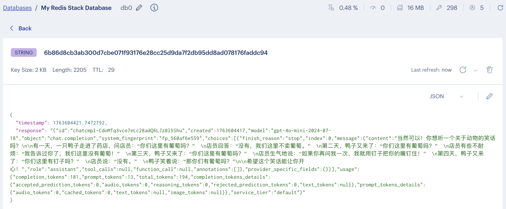
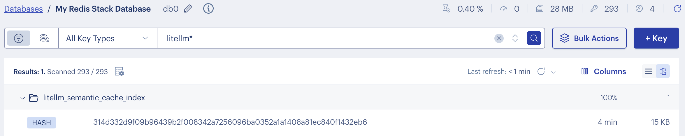
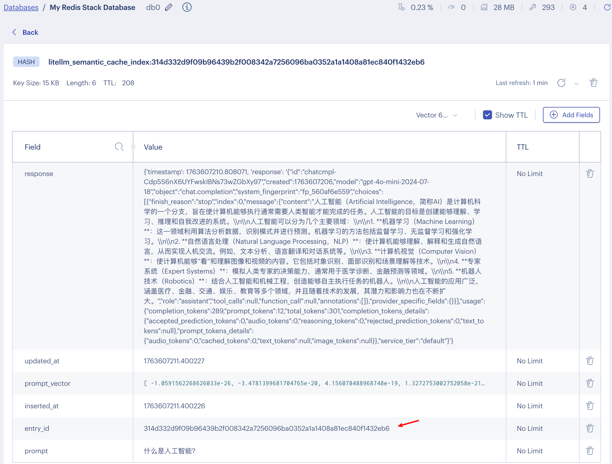

# 学习 LiteLLM 的缓存系统

随着我们的 LLM 网关承载的流量越来越大、接入的模型越来越多，除了稳定性和可靠性，**成本和性能** 也成为了关键的考量因素。实际上，我们的应用每天都在处理很多相似的查询，比如客服系统中的常见问题、代码生成中的重复模式、文档摘要中的相似内容。如果每次都调用真实的 LLM API，不仅延迟高、成本昂贵，还可能触发供应商的速率限制。而且，对于相同或相似的查询，LLM 的回答往往是一致的或高度相似的，这就为缓存的应用提供了天然的基础。

LiteLLM 提供了一套完整的缓存解决方案，它不仅能够缓存完全相同的请求（精确缓存），还能够基于语义相似性缓存相似的请求（语义缓存），从而显著降低成本，并大幅提升性能，同时减轻对上游 API 的压力，提高了系统稳定性。

今天这篇文章，我们就来深入了解一下 LiteLLM 的缓存系统。

## 缓存类型一览

LiteLLM 支持 8 种不同的缓存后端，每种都针对特定的使用场景：

**传统缓存**：
- **内存缓存（In-Memory）**：最快的访问速度，适合单机部署和开发测试
- **磁盘缓存（Disk）**：持久化存储，适合单机长期缓存
- **Redis 缓存**：分布式缓存，适合多实例部署和生产环境

**云存储缓存**：
- **S3 缓存**：利用 AWS S3 进行大规模、低成本的缓存存储
- **GCS 缓存**：基于 Google Cloud Storage 的缓存解决方案
- **Azure Blob 缓存**：微软 Azure 的对象存储缓存

**智能缓存**：
- **Redis 语义缓存**：基于向量相似度的语义匹配缓存
- **Qdrant 语义缓存**：专业向量数据库的语义缓存解决方案

## 基本使用

首先我们来体验下最简单的内存缓存，在 `config.yaml` 文件中添加如下配置：

```yaml
litellm_settings:
  cache: true
  cache_params:
    type: local
```

然后重启 LiteLLM Proxy 服务。发送第一次请求：

```bash
$ curl -X POST 'http://127.0.0.1:4000/chat/completions' \
  -H 'Authorization: Bearer sk-1234' \
  -H 'Content-Type: application/json' \
  -d '{
    "model": "gpt-4o",
    "messages": [{"role": "user", "content": "给我讲个笑话"}]
  }'
```

第一次请求会调用真实的 API，耗时可能在 1-3 秒。再发送完全相同的请求（加了 `-v` 选项用于打印响应头）：

```bash
$ curl -v -X POST 'http://127.0.0.1:4000/chat/completions' \
  -H 'Authorization: Bearer sk-1234' \
  -H 'Content-Type: application/json' \
  -d '{
    "model": "gpt-4o",
    "messages": [{"role": "user", "content": "给我讲个笑话"}]
  }'
```

第二次请求从缓存返回，耗时通常在 50-200 毫秒，响应头中会包含缓存相关信息：

```
x-litellm-cache-key: 6b86d8cb3ab300d7cbe071f93176e28cc25d9da7f2db95dd8ad078176faddc94
```

> 这个 Key 是根据请求内容生成的，相同的请求参数生成的 Key 也是相同的。

## Redis 缓存

内存缓存适合单机部署和开发测试，生产环境一般使用 Redis 作为缓存后端。可以用 Docker 在本地快速启一个 Redis 示例：

```bash
$ docker run -d \
  --name redis-stack \
  -p 6379:6379 \
  -p 8001:8001 \
  redis/redis-stack:latest
```

注意我这里使用的是 Redis Stack 镜像，它是一个包含多个模块的集成软件套件，在 Redis 的基础上，扩展了 **搜索（RedisSearch）**、**JSON（RedisJSON）**、**图数据库（RedisGraph）**、**时间序列（RedisTimeSeries）** 和 **布隆过滤器（RedisBloom）** 等功能，提供了更丰富的数据处理能力，适用于构建复杂应用。相对于 Redis Server 只是核心的内存数据结构存储，更侧重于缓存和消息队列等场景。 

最简单的 Redis 缓存配置如下：

```yaml
litellm_settings:
  cache: true
  cache_params:
    type: redis
    host: localhost          # Redis 服务器地址
    port: 6379               # Redis 端口
    password: your_password  # Redis 密码（可选）
    ttl: 600                 # 默认缓存时间（秒）
```

> 对于大规模部署，LiteLLM 支持配置 Redis 集群或哨兵。

验证方法和内存缓存一样，第二次请求从缓存返回，并且在 Redis 中应该能找到 `x-litellm-cache-key` 对应的缓存键：



## Redis 语义缓存

Redis 不仅可以用来做普通缓存，还可以用来做向量数据库。我们可以将文本、图像等非结构化数据转换为向量，存储到 Redis 中，并利用 Redis 的内存优势实现毫秒级的向量相似性搜索。

LiteLLM 基于 Redis 向量数据库实现了语义缓存功能，**语义缓存** 不同于传统的精确匹配缓存，它能够理解查询的语义含义，并返回语义相似查询的缓存结果。即使这些查询的字面表达完全不同，语义缓存也能识别它们的相似性并返回相同的结果，大大提高了缓存命中率。

Redis 语义缓存基于 [Redis Vector Library (RedisVL)](https://github.com/redis/redis-vl-python) 实现，首先需要安装依赖：

```bash
$ pip install redisvl==0.4.1
```

然后在 LiteLLM 的配置文件中开启 Redis 语义缓存：

```yaml
litellm_settings:
  cache: true
  cache_params:
    type: redis-semantic              # 语义缓存类型
    host: localhost
    port: 6379
    password: your_password
    ttl: 600
    similarity_threshold: 0.8                                     # 相似度阈值（0-1，1为完全匹配）
    redis_semantic_cache_embedding_model: text-embedding-3-large  # 嵌入模型名称
```

其中 `similarity_threshold` 为相似度阈值，范围 `[0-1]`，`redis_semantic_cache_embedding_model` 为嵌入模型名称，必须是在 `model_list` 中定义。

> 注意，如果你的 Redis 没有密码，启动可能会报错 `Missing required Redis configuration: REDIS_PASSWORD`。设置一下环境变量 `export REDIS_PASSWORD=` 即可。

可以使用两个相似的请求来验证，第一次请求：

```bash
$ curl -X POST 'http://127.0.0.1:4000/chat/completions' \
  -H 'Authorization: Bearer sk-1234' \
  -H 'Content-Type: application/json' \
  -d '{
    "model": "gpt-4o",
    "messages": [{"role": "user", "content": "什么是人工智能？"}]
  }'
```

第二次请求：

```bash
$ curl -v -X POST 'http://127.0.0.1:4000/chat/completions' \
  -H 'Authorization: Bearer sk-1234' \
  -H 'Content-Type: application/json' \
  -d '{
    "model": "gpt-4o",
    "messages": [{"role": "user", "content": "AI 是什么？"}]
  }'
```

第二次请求的响应头中不仅包含了缓存 Key，还包含了相似度信息：

```
x-litellm-cache-key: 9cdf6246deaee1f8d96aa8b093029bc129f7eca32f2f8f4a9fd0352138e6ea3e
x-litellm-semantic-similarity: 0.162912428379
```

我们打开 Redis 管理页面，可以发现多了一个 `litellm_semantic_cache_index` 开头的键：



它的内容包含了请求的 Prompt 和对应的响应：



### RedisVL 库介绍

**RedisVL (Redis Vector Library)** 是 Redis 官方提供的 Python 客户端库，专为 AI 应用设计，提供了高级的向量搜索抽象，主要特性包括：

- **简化的 API**：高级抽象，简化向量搜索操作
- **强大的查询能力**：支持混合查询、过滤条件、聚合等
- **语义缓存**：专门为 LLM 缓存优化的 LLMCache 组件，LiteLLM 的 Redis 语义缓存就是基于它实现的

这一节我们通过一个简单示例学习它的基本使用。

首先通过 Schema 创建索引：

```python
from redisvl.index import SearchIndex
from redis import Redis

# 创建连接
client = Redis.from_url("redis://localhost:6379")

# 使用字典定义 Schema
schema = {
  "index": {
    "name": "product_index",
    "prefix": "product:",
  },
  "fields": [
    {"name": "title", "type": "text"},
    {"name": "brand", "type": "tag"},
    {"name": "price", "type": "numeric"},
    {"name": "category", "type": "tag"},
    {
      "name": "description_vector",
      "type": "vector",
      "attrs": {
        "dims": 3072,  # 向量维度
        "distance_metric": "cosine",  # 距离度量
        "algorithm": "flat",  # 向量索引算法
        "datatype": "float32"
      }
    }
  ]
}

# 创建索引
index = SearchIndex.from_dict(schema, redis_client=client)
index.create(overwrite=True)
print(f"索引创建成功！")
```

这是一个产品表，包含产品的名称、品牌、分类、价格、描述等信息，我们为描述加一个向量字段，用于语义搜索。

> 其中向量维度根据你使用的 Embedding 模型来定义，我这里使用的是 OpenAI 的 `text-embedding-3-large` 模型，维度是 3072 维。

接着定义一批示例数据，加载到 Redis 中：

```python
import numpy as np
from litellm import embedding

# 定义产品数据
products = [
  {
    "id": "p001",
    "title": "iPhone 15 Pro Max",
    "brand": "Apple",
    "category": "smartphone",
    "price": 1199,
    "description": "最新的 iPhone，配备 A17 Pro 芯片，48MP 主摄像头，钛金属机身"
  },
  {
    "id": "p002",
    "title": "MacBook Pro 14英寸",
    "brand": "Apple",
    "category": "laptop",
    "price": 1999,
    "description": "搭载 M3 芯片的专业笔记本电脑，适合开发者和创意工作者"
  },
  {
    "id": "p003",
    "title": "AirPods Pro",
    "brand": "Apple",
    "category": "audio",
    "price": 249,
    "description": "主动降噪无线耳机，空间音频技术，透明模式"
  },
  {
    "id": "p004",
    "title": "Samsung Galaxy S24",
    "brand": "Samsung",
    "category": "smartphone",
    "price": 899,
    "description": "Android 旗舰手机，AI 摄影功能，120Hz 显示屏"
  },
  {
    "id": "p005",
    "title": "Dell XPS 13",
    "brand": "Dell",
    "category": "laptop",
    "price": 1299,
    "description": "轻薄笔记本电脑，13.3英寸 4K 触摸屏，Intel 处理器"
  }
]

# 生成向量嵌入
for product in products:
  response = embedding('text-embedding-3-large', product["description"])
  product["description_vector"] = np.array(response.data[0]['embedding'], dtype=np.float32).tobytes()

# 加载产品数据到 Redis
for product in products:
  index.load([product], id_field="id")

print(f"成功加载 {len(products)} 个产品到索引中")
```

我们为每个产品的描述生成对应的向量，并通过 `index.load()` 将产品数据加载到 Redis 中。接下来就可以执行搜索了：

```python
from redisvl.index import SearchIndex
from redisvl.query import VectorQuery

# 使用已有索引
index = SearchIndex.from_existing('product_index', client)

# 生成查询向量
response = embedding('text-embedding-3-large', "适合程序员的电脑")
query_vector = np.array(response.data[0]['embedding'], dtype=np.float32).tobytes()

# 创建向量查询
vector_query = VectorQuery(
  vector=query_vector,
  vector_field_name="description_vector",
  return_fields=["title", "brand", "category", "price", "description"],
  num_results=3,
)

# 执行搜索
results = index.query(vector_query)

print(f"\n查询: '适合程序员的电脑'")
for doc in results:
  score = 1 - float(doc['vector_distance'])  # 转换为相似度分数
  print(f"- {doc['title']} ({doc['brand']}) - 相似度: {score:.3f}")
  print(f"  价格: ${doc['price']} | 描述: {doc['description']}")
```

搜索结果如下：

```
查询: '适合程序员的电脑'
- MacBook Pro 14英寸 (Apple) - 相似度: 0.570
  价格: $1999 | 描述: 搭载 M3 芯片的专业笔记本电脑，适合开发者和创意工作者
- Dell XPS 13 (Dell) - 相似度: 0.435
  价格: $1299 | 描述: 轻薄笔记本电脑，13.3英寸 4K 触摸屏，Intel 处理器
- iPhone 15 Pro Max (Apple) - 相似度: 0.293
  价格: $1199 | 描述: 最新的 iPhone，配备 A17 Pro 芯片，48MP 主摄像头，钛金属机身
```

## 缓存控制参数

LiteLLM 提供了灵活的缓存控制机制，允许在请求级别动态控制缓存行为。这些控制参数借鉴了 HTTP 缓存控制的设计理念，提供了细粒度的缓存管理能力。


| 参数 | 类型 | 说明 | 使用场景 |
|------|------|------|----------|
| `ttl` | int | 指定缓存时间（秒） | 短期缓存、时效性内容 |
| `s-maxage` | int | 只接受指定时间内的缓存（秒） | 强制刷新、数据一致性 |
| `no-cache` | bool | 跳过缓存读取，强制调用 API | 需要最新数据 |
| `no-store` | bool | 不存储响应到缓存 | 敏感内容、一次性查询 |
| `namespace` | str | 自定义缓存命名空间 | 多租户、环境隔离 |

### 动态 TTL 控制

参数 `ttl` 用于控制缓存时间，我们可以为不同类型的请求设置不同的缓存时间：

```python
# 长期缓存：百科类知识
response = client.chat.completions.create(
  model="gpt-4o",
  messages=[{"role": "user", "content": "什么是量子计算？"}],
  extra_body={
    "cache": {
      "ttl": 86400  # 缓存 24 小时
    }
  }
)

# 短期缓存：实时性要求较高的内容
response = client.chat.completions.create(
  model="gpt-4o",
  messages=[{"role": "user", "content": "今天的股市表现如何？"}],
  extra_body={
    "cache": {
      "ttl": 300  # 缓存 5 分钟
    }
  }
)
```

### 缓存年龄控制

参数 `s-maxage` 控制只接受指定年龄内的缓存：

```python
response = client.chat.completions.create(
  model="gpt-4o",
  messages=[{"role": "user", "content": "最新的股票价格"}],
  extra_body={
    "cache": {
      "s-maxage": 60  # 只接受 1 分钟内的缓存
    }
  }
)
```

### 强制刷新缓存

当需要获取最新结果时，可以使用 `no-cache` 强制绕过缓存：

```python
response = client.chat.completions.create(
  model="gpt-4o",
  messages=[{"role": "user", "content": "最新的股票价格"}],
  extra_body={
    "cache": {
      "no-cache": True  # 跳过缓存检查
    }
  }
)
```

### 禁用缓存存储

对于包含敏感信息的查询，可以使用 `no-store` 不缓存当前响应：

```python
response = client.chat.completions.create(
  model="gpt-4o",
  messages=[{"role": "user", "content": "敏感信息查询"}],
  extra_body={
    "cache": {
      "no-store": True  # 不存储此响应
    }
  }
)
```

### 命名空间隔离

在多租户或多环境场景中，LiteLLM 支持命名空间来实现缓存隔离：

```yaml
litellm_settings:
  cache: true
  cache_params:
    type: redis
    namespace: "litellm.production"  # 命名空间前缀
```

这样存储在 Redis 中的键将变成 `{namespace}:<hash>` 格式，我们也可以在请求参数中动态控制，为不同的用户或应用使用独立的缓存空间：

```python
response = client.chat.completions.create(
  model="gpt-4o",
  messages=[{"role": "user", "content": "Hello"}],
  extra_body={
    "cache": {
      "namespace": "user:12345"  # 用户专用命名空间
    }
  }
)
```

### 默认关闭模式

对于需要严格控制的场景，可以将缓存设置为默认关闭，只在需要时显式启用：

```yaml
litellm_settings:
  cache: true
  cache_params:
    mode: default_off  # 缓存默认关闭
```

客户端需要显式启用缓存：

```python
response = client.chat.completions.create(
  model="gpt-4o",
  messages=[{"role": "user", "content": "Hello"}],
  extra_body={
    "cache": {"use-cache": True}  # 显式启用缓存
  }
)
```

## 小结

我们今天简单学习了 LiteLLM 的缓存系统。LiteLLM 提供了从简单的内存缓存到复杂的语义缓存等多种选择，每种缓存都有其特定的适用场景，可以根据业务需求灵活选择最合适的缓存策略。此外，LiteLLM 的缓存控制参数提供了细粒度的缓存管理能力，使开发者能够动态调整缓存行为，以适应不同场景的需求。

通过合理配置和使用这些缓存功能，应用可以更好地处理重复性和相似性的查询，有效降低对上游 LLM API 的压力，提升系统的稳定性与响应速度。
