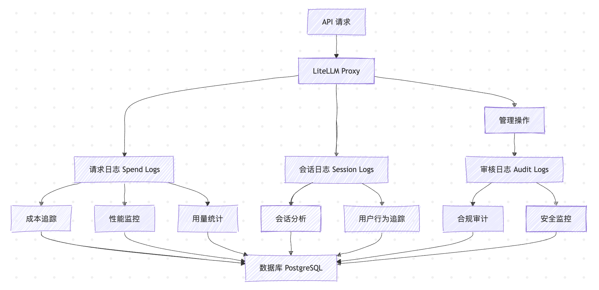
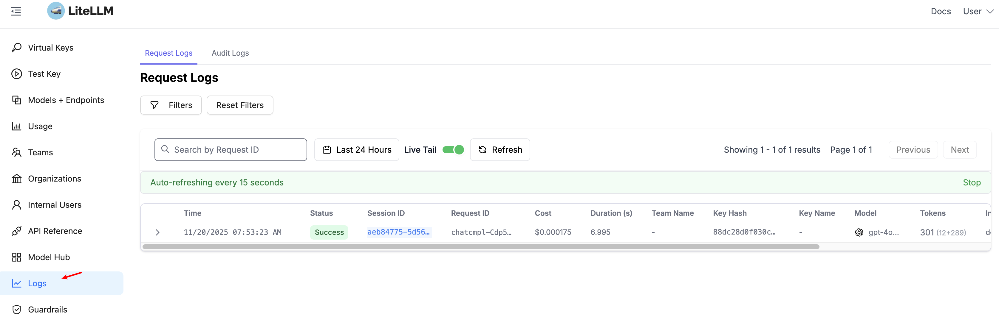
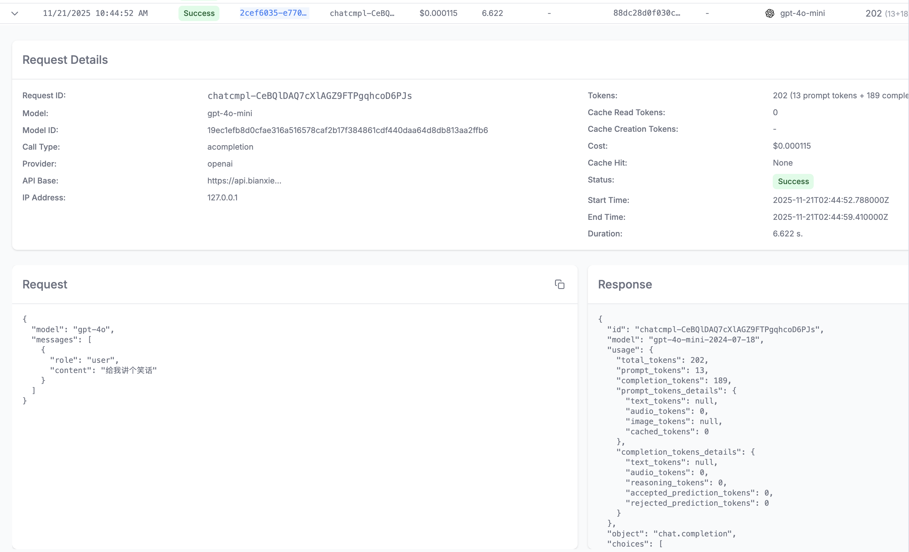
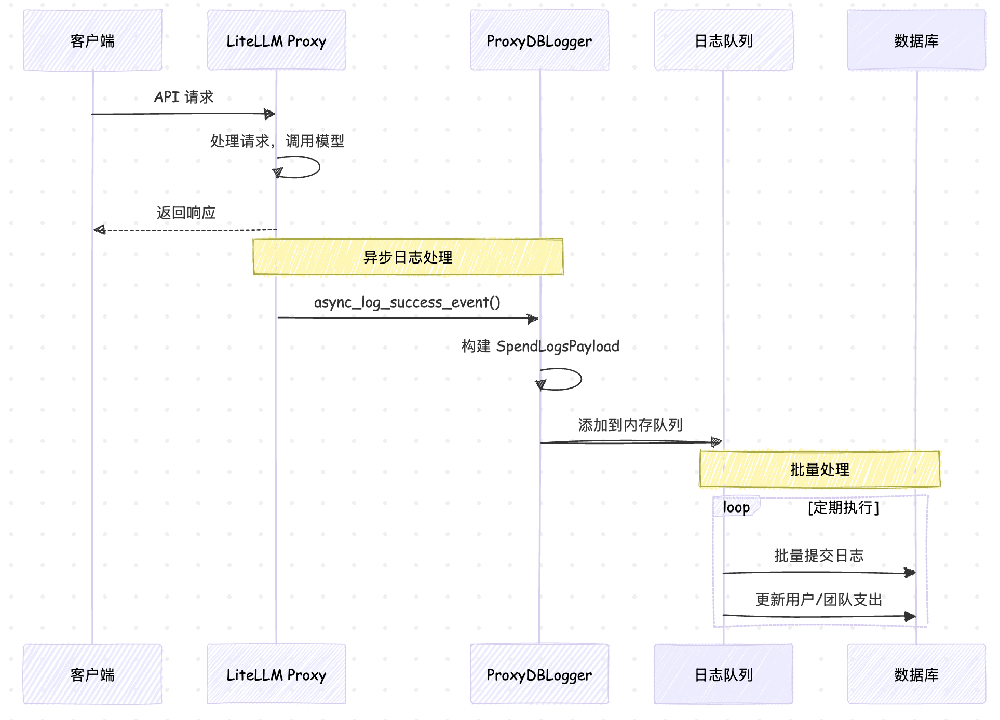
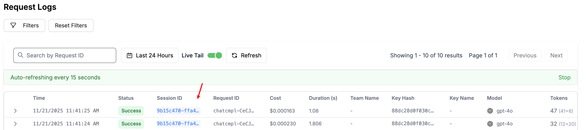
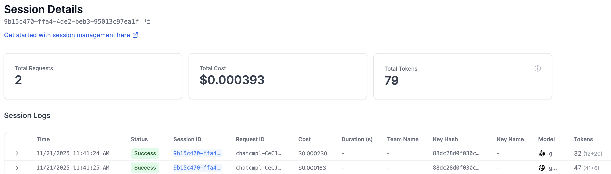
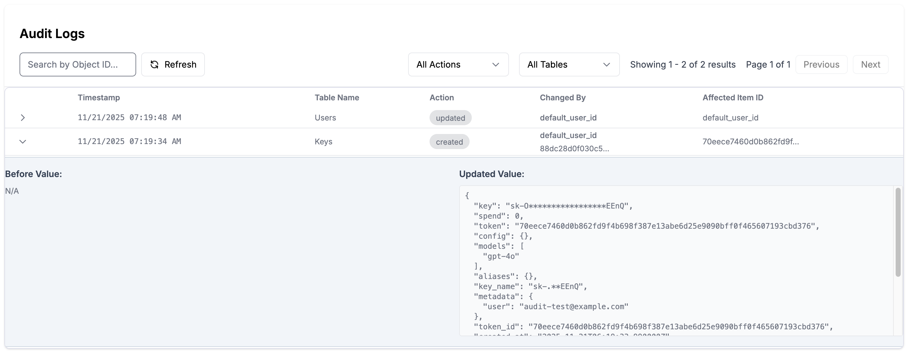

# 学习 LiteLLM 的日志系统

对于一个 LLM 网关来说，日志系统扮演着至关重要的角色：它不仅能帮我们追踪每一笔 API 调用的成本和性能；当模型回复异常或请求失败时，还能提供详细的上下文信息来定位问题；它还确保所有管理操作都有迹可循，以满足合规性要求。

我们今天就来学习下 LiteLLM 的日志体系，主要包括 **请求日志（Spend Logs）**、**会话日志（Session Logs）** 和 **审核日志（Audit Logs）**：



## 请求日志

**请求日志（Spend Logs）** 是整个日志系统的核心，它记录了每一次 API 调用的详细信息，包括调用者、消耗成本、token 使用量、延迟等关键指标，能够用于成本分析和性能监控。

可以进入 Admin UI，点击 Logs 菜单，查看请求日志：



在这里，LiteLLM 记录了所有成功和失败的请求日志。考虑到 **隐私保护** 和 **存储成本**，默认情况下，LiteLLM 只记录元数据信息，而不存储具体的请求和响应内容。如果业务需要进行内容分析或调试，可以通过下面的配置显式开启：

```yaml
general_settings:
  store_prompts_in_spend_logs: true
```

> 注：开启此选项会增加数据库的存储压力，并且可能涉及敏感数据的合规问题，请根据实际情况谨慎开启。

开启后，你就能在 UI 界面中看到完整的对话内容：



### 日志保存逻辑

LiteLLM 的请求日志保存在 Postgre 数据库的 `LiteLLM_SpendLogs` 表中，在高并发场景下，如果每一笔请求都同步写入数据库，会对性能造成巨大影响。为了最小化对主要请求路径的性能影响，它采用了 **异步队列和批量处理** 的优化手段：



这里有几个值得学习的点：

1. **异步处理**：日志记录不会阻塞主要的 API 响应路径
2. **批量提交**：多个日志记录会被聚合后批量写入数据库
3. **内存缓冲**：使用内存队列减少数据库 I/O 频次
4. **事务安全**：通过数据库事务确保数据一致性

### 高级配置选项

除了 `store_prompts_in_spend_logs` 选项之外，LiteLLM 还提供了很多其他的配置选项来控制日志行为：

```yaml
general_settings:
  # 完全禁用错误日志
  disable_error_logs: true

  # 完全禁用支出日志
  disable_spend_logs: true

  # 存储详细的请求/响应内容
  store_prompts_in_spend_logs: true

  # 配置日志保留期
  maximum_spend_logs_retention_period: "30d"  # 30天后自动删除
  maximum_spend_logs_retention_interval: "1d"  # 每天执行一次清理
```

> 其中日志的自动删除功能属于企业特性。此外，在多实例部署环境中，LiteLLM 使用 **Redis 分布式锁** 确保清理任务不会重复执行，因此需要开启 Redis 缓存。

## 会话日志

**会话日志（Session Logs）** 在请求日志的基础上，提供了 **会话级别的聚合视图**，它通过 `session_id` 将相关的请求进行逻辑分组，让你能够跟踪用户的完整交互流程。

可以在发起请求时增加一个 `litellm_session_id` 参数：

```python
response = client.chat.completions.create(
  model="gpt-4o",
  messages=[
    {"role": "user", "content": "你好，我是张三"}
  ],
  extra_body={
    "litellm_session_id": session_id
  }
)
print(response.choices[0].message.content)
```

然后将后续请求也关联到这个会话：

```python
response = client.chat.completions.create(
  model="gpt-4o",
  messages=[
    {"role": "user", "content": "你好，我是张三"},
    {"role": "assistant", "content": response.choices[0].message.content},
    {"role": "user", "content": "我是谁"}
  ],
  extra_body={
    "litellm_session_id": session_id
  }
)
print(response.choices[0].message.content)
```

在 LiteLLM 的 UI 中，可以看到生成的两条请求日志 Session ID 是相同的：



你可以通过 Session ID 筛选出该会话下的所有交互记录，这对于复现 Bug 或分析用户行为模式非常有帮助：



### 使用 Responses API

使用 Chat Completions API 进行多轮对话时，每一次都要带上完整的上下文，这是非常不方便的。可以考虑使用 OpenAI 的 [Responses API](https://platform.openai.com/docs/api-reference/responses/create) 接口，LiteLLM 也对该接口做了兼容。

第一次请求如下：

```python
response = client.responses.create(
  model="gpt-4o",
  input="你好，我是张三"
)
print(response.output_text)
```

第二次请求时通过 `previous_response_id` 参数带上前一次请求的响应 ID 即可：

```python
response = client.responses.create(
    model="gpt-4o",
    input="我是谁",
    previous_response_id=response.id
)
print(response.output_text)
```

LiteLLM 内部对 Chat Completions API 接口做了一层封装，使得我们也可以通过 Responses API 调用 Anthropic、Gemini 等模型。不过需要注意的是，它是根据会话 ID 查询数据库获取历史对话，因此需要开启 `store_prompts_in_spend_logs: true` 保存请求和响应的日志。

> 另一点需要注意的是，由于日志存储是异步的，因此第二次请求不能太快，太快的话可能还查不到历史对话，两次请求中间要等待个 10 秒左右。这个特性目前还是 beta 状态，后面应该会优化。

## 审核日志

**审核日志（Audit Logs）** 则专注于记录所有的管理操作，包括用户创建、权限变更、配置修改等。这类日志对于企业的合规要求、安全审计和问题追踪具有关键作用。

审核日志是企业级特性，需要显式启用：

```yaml
litellm_settings:
  store_audit_logs: true
```

然后我们通过 `/key/generate` 接口生成一个 Key：

```bash
$ curl 'http://127.0.0.1:4000/key/generate' \
  -H 'Authorization: Bearer sk-1234' \
  -H 'Content-Type: application/json' \
  -d '{
    "models": ["gpt-4o"],
    "metadata": {"user": "audit-test@example.com"}
  }'
```

进入 Admin UI，点击 Logs 菜单，查看审核日志如下：



LiteLLM 会自动为以下管理操作创建审核日志：

```
用户管理：
- ✅ 用户创建、更新、删除
- ✅ 用户权限变更
- ✅ 用户状态变更（激活/禁用）

API 密钥管理：
- ✅ 密钥创建、更新、删除
- ✅ 密钥轮换（regenerate）
- ✅ 密钥权限修改

团队管理：
- ✅ 团队创建、更新、删除
- ✅ 团队成员添加/移除
- ✅ 团队预算调整

模型配置：
- ✅ 模型添加、更新、删除
- ✅ 模型权限配置变更
```

## 小结

今天的内容比较简单，主要学习了 LiteLLM 的三大日志系统：

- **请求日志（Spend Logs）** 精确记录每一次 API 调用的详细信息，可以通过 `store_prompts_in_spend_logs` 参数开启存储具体的请求和响应内容；
- **会话日志（Session Logs）** 在请求日志基础上提供了会话级别的聚合视图，通过 Session ID 分组，支持跨多个请求的用户行为追踪和对话模式分析；
- **审核日志（Audit Logs）** 专注于管理操作的完整记录，确保每一个关键操作都有迹可循；

这套完整的日志系统，作为 LiteLLM 的核心能力，直接存储在 Postgre 数据库中。其实，LiteLLM 还支持对接很多外部日志系统或可观测平台，并基于这些丰富的日志数据构建完善的监控体系，我们将在下一篇文章中继续学习。
