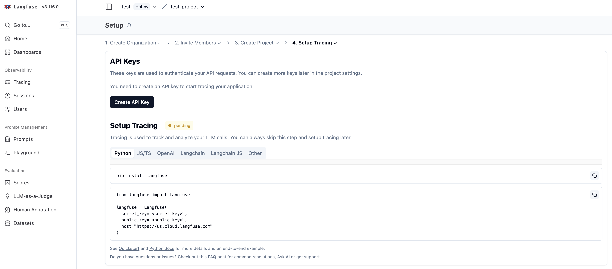
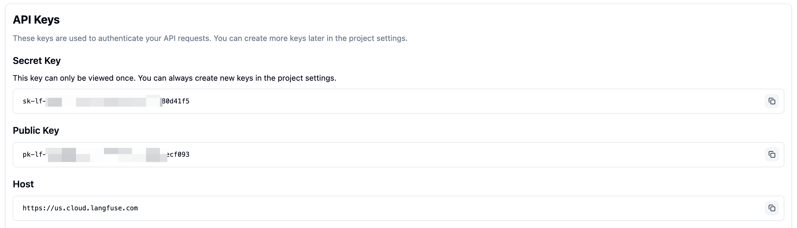
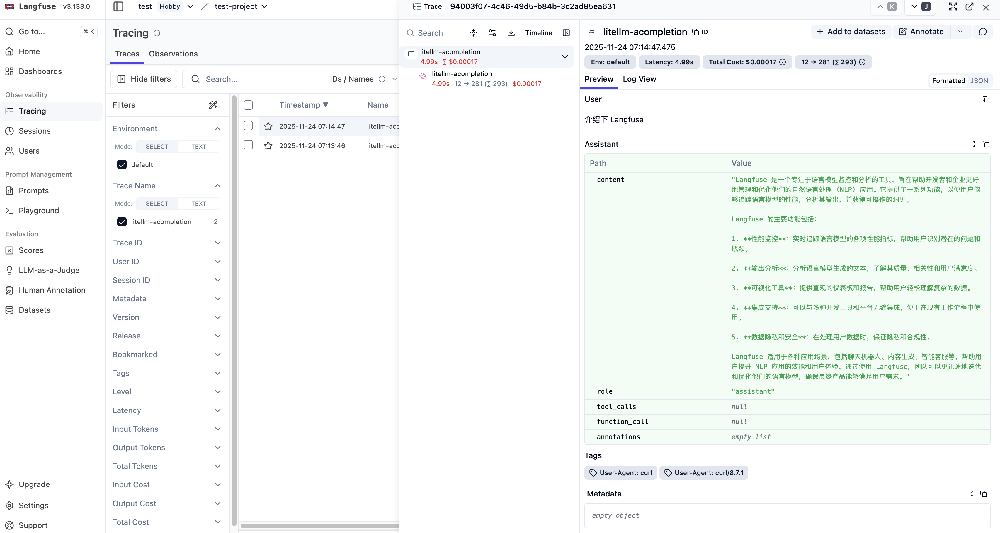
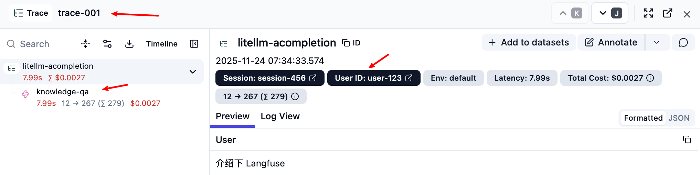
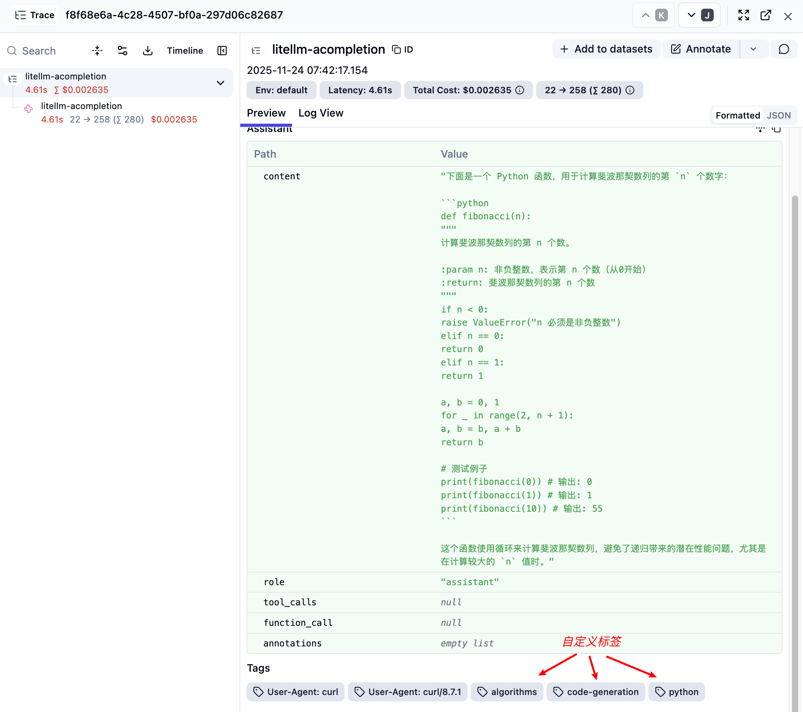
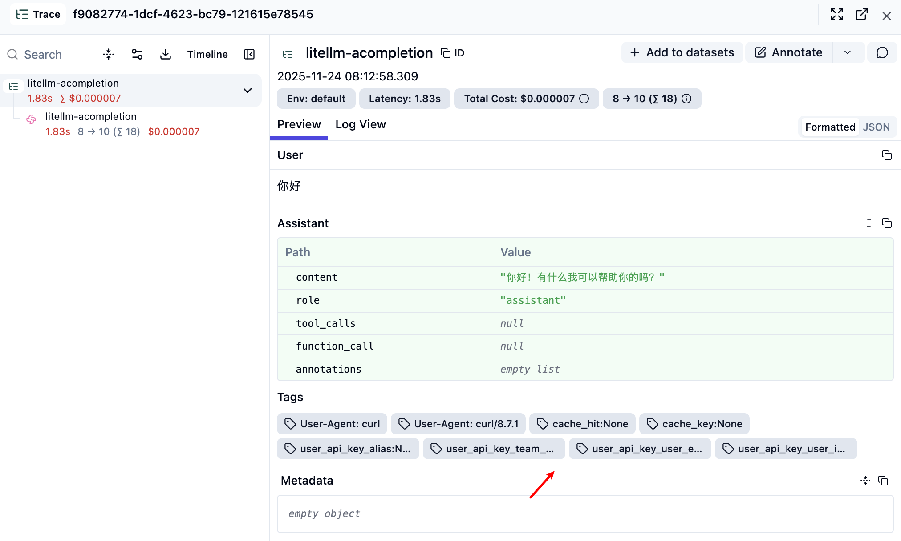
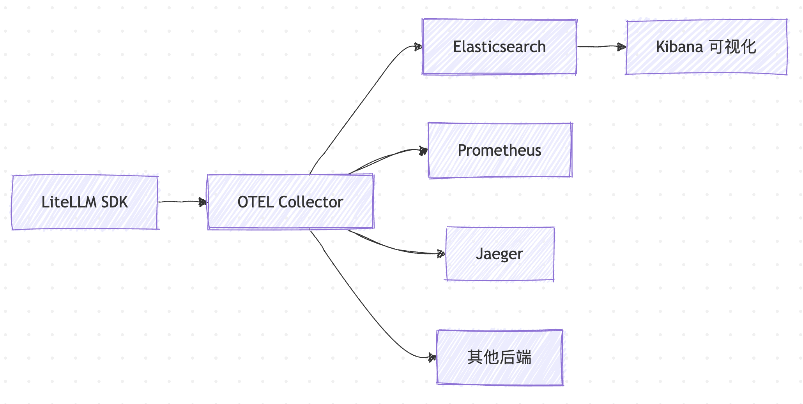
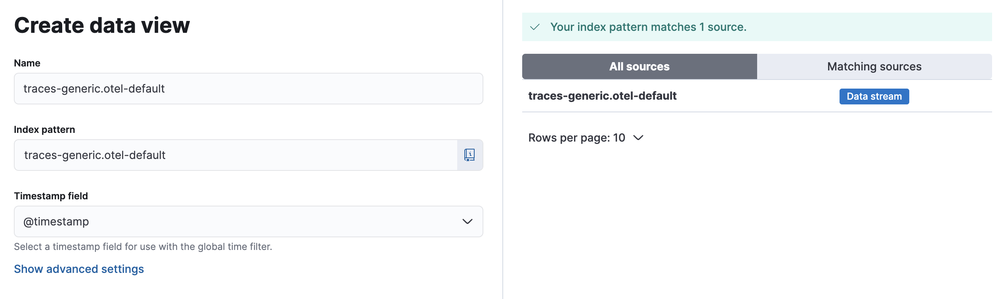
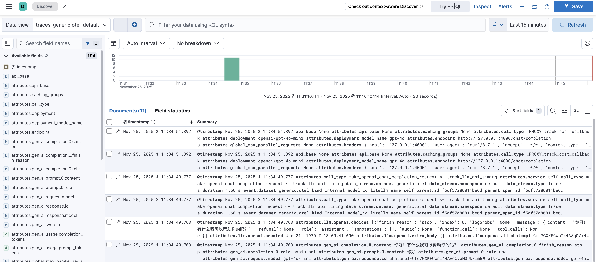

# 实战 LiteLLM 与外部日志系统的集成

在前一篇文章中，我们学习了 LiteLLM 的内置日志系统，包括请求日志、会话日志和审核日志。这些日志为我们提供了完整的 API 调用追踪、成本分析和合规审计能力。然而，在企业级部署场景中，我们往往需要将这些宝贵的数据集成到现有的可观测性生态系统中，比如与 Elasticsearch 进行日志分析、通过 Datadog 进行性能监控，或者利用 Langfuse 进行 LLM 专业化的可观测性管理。

LiteLLM 支持与 **30 多种外部日志和可观测性系统** 的集成，包括传统的云存储（S3、GCS、Azure Blob）、专业的可观测性平台（Langfuse、OpenTelemetry、Datadog）、以及企业级的数据分析工具（Elasticsearch、BigQuery、DynamoDB），为我们构建完整的监控和分析体系提供了强有力的支持。

今天这篇文章，我们就来深入学习 LiteLLM 的外部日志集成能力。

## 支持的外部日志系统

LiteLLM 的日志集成能力非常丰富，支持多达 30+ 种不同类型的外部系统：

**LLM 专业可观测性平台**：
- **Langfuse** - LLM 专业可观测性平台，提供完整的 LLM 应用监控、分析和优化
- **Langsmith** - LangChain 官方的 LLM 开发和监控平台，专为 LangChain 生态设计
- **Lunary** - LLM 监控和分析平台，提供对话流程可视化和性能分析
- **Langtrace** - LLM 应用的可观测性和监控平台，提供详细的追踪分析
- **Helicone** - 开源的 LLM 可观测性平台，简化 LLM 应用监控
- **DeepEval** - Confidential AI 的 LLM 评测平台，专注模型质量评估
- **Athina** - LLM 应用的质量评估和监控平台，提供实时质量检测
- **Braintrust** - AI 产品开发平台，提供评估、监控和数据管理
- **Humanloop** - LLM 应用开发平台，集成提示工程和监控功能
- **Literal AI** - 对话式 AI 监控平台，专注用户体验优化
- **Promptlayer** - 提示工程和监控平台，帮助优化 LLM 提示效果

**通用监控和可观测性平台**：
- **OpenTelemetry** - 开源的可观测性框架，支持分布式追踪和监控
- **Datadog** - 综合性能监控平台，提供全栈监控和告警能力
- **Sentry** - 错误监控和性能追踪平台，帮助快速定位应用问题
- **Logfire** - Pydantic 团队开发的现代可观测性平台
- **PostHog** - 开源的产品分析平台，提供用户行为跟踪和 A/B 测试

**机器学习和实验管理**：
- **MLflow** - 机器学习实验管理平台，支持模型版本控制和部署
- **Arize AI** - 专注于 ML 可观测性的企业级平台，提供模型漂移检测
- **Arize Phoenix OSS** - Arize 的开源版本，专注 ML 模型监控
- **Galileo** - AI 模型质量监控平台，专注于数据和模型性能评估
- **Weights & Biases** - 机器学习实验跟踪和可视化平台
- **Comet Opik** - 机器学习实验管理和模型监控平台

**数据标注和质量管理**：
- **Argilla** - 开源数据标注和质量管理平台，支持 LLM 训练数据优化
- **AgentOps** - AI Agent 运行监控平台，专注 Agent 行为分析

**使用量计量和费用管理**：
- **OpenMeter** - 开源的使用量计量和计费平台，支持 API 使用监控
- **Greenscale** - 云成本优化平台，帮助降低 AI 基础设施成本
- **CloudZero's AnyCost API** - 企业级云成本分析和分配平台
- **Lago** - 开源计费平台，支持基于使用量的灵活计费模式

**云存储服务**：
- **AWS S3** - AWS 的对象存储服务，适合大规模日志归档
- **AWS SQS** - AWS 的消息队列服务，适合实时日志处理
- **Google Cloud Storage Buckets** - 谷歌云的对象存储服务
- **Google Cloud Storage PubSub Topic** - 谷歌云的消息队列服务，可以被 BigQuery 消费
- **Azure Blob Storage** - 微软云的存储解决方案

**数据库和分析**：
- **Elasticsearch** - 分布式搜索和分析引擎
- **DynamoDB** - AWS 的 NoSQL 数据库
- **BigQuery** - 谷歌云的大数据分析平台
- **Supabase** - Firebase 开源替代

下面将以 Langfuse 和 OpenTelemetry 为例，实际体验下集成的详细步骤。

## 实战 Langfuse 集成

[Langfuse](https://langfuse.com/) 是专为 LLM 应用设计的开源可观测性平台，提供了完整的链路追踪、性能分析、成本监控和质量评估能力。


作为专业的 LLM 可观测性平台，Langfuse 具有以下核心特性：

- **追踪（Tracing）**：记录 LLM 应用的完整执行过程
- **观测（Observability）**：提供实时的性能监控和可视化
- **评估（Evaluation）**：支持多种评估指标和人工标注
- **数据集管理**：管理测试数据和历史记录
- **成本追踪**：监控 Token 使用和费用

### 获取 Langfuse 的 API Key

我们首先访问 Langfuse 官网，注册账号并登录，然后创建一个组织：


然后在组织下创建一个项目：


创建成功后，接着为项目创建 API Key：



点击创建按钮，获取以下三个重要参数：

- **Public Key**：公开密钥，用于客户端身份验证
- **Secret Key**：私钥，用于服务端 API 调用
- **Host**：Langfuse 服务器地址



> Langfuse 是开源项目，我们也可以本地部署它。

### 在 LiteLLM 中配置 Langfuse

首先安装依赖：

```bash
$ pip install langfuse==2.59.7
```

> 注意，如果使用最近版本的 Langfuse 可能会报错，可以使用 [Langfuse OTEL](https://docs.litellm.ai/docs/observability/langfuse_otel_integration) 集成方案。

然后配置环境变量：

```bash
export LANGFUSE_PUBLIC_KEY="pk_xxx"
export LANGFUSE_SECRET_KEY="sk_xxx"
export LANGFUSE_HOST="https://cloud.langfuse.com"  # 可选，默认为云版本
```

接着在 `config.yaml` 中添加 Langfuse 回调：

```yaml
litellm_settings:
  success_callback: ["langfuse"]
  failure_callback: ["langfuse"]
```

最后重新启动 LiteLLM 并发送测试请求：

```bash
$ curl -X POST 'http://127.0.0.1:4000/chat/completions' \
  -H 'Authorization: Bearer sk-1234' \
  -H 'Content-Type: application/json' \
  -d '{
    "model": "gpt-4o",
    "messages": [{"role": "user", "content": "介绍下 Langfuse"}]
  }'
```

进入 Langfuse 的 Trace 页面，应该能看到详细的追踪数据：



### 元数据传递

Langfuse 支持传递丰富的元数据信息，用于更精确的分析：

```bash
$ curl -X POST 'http://127.0.0.1:4000/chat/completions' \
  -H 'Authorization: Bearer sk-1234' \
  -H 'Content-Type: application/json' \
  -d '{
    "model": "gpt-4o",
    "messages": [{"role": "user", "content": "介绍下 Langfuse"}],
    "metadata": {
      "generation_name": "knowledge-qa",
      "trace_id": "trace-001",
      "trace_user_id": "user-123",
      "session_id": "session-456"
    }
  }'
```

这些元数据在 Langfuse 中显示如下：



### 自定义标签

我们还可以使用标签对不同类型的请求进行分类：

```bash
$ curl -X POST 'http://127.0.0.1:4000/chat/completions' \
  -H 'Authorization: Bearer sk-1234' \
  -H 'Content-Type: application/json' \
  -d '{
    "model": "gpt-4o",
    "messages": [{"role": "user", "content": "写一个 Python 函数来计算斐波那契数列"}],
    "metadata": {
      "tags": ["code-generation", "python", "algorithms"]
    }
  }'
```

这些标签可以在 Langfuse 的 Tags 一栏看到：



> 注意，这个功能可能和标签路由冲突，如果开启了标签路由，`tags` 就不能随便传了。

除了在请求中自定义标签，LiteLLM 也内置了很多特有的字段作为标签，可以在配置文件中启用：

```yaml
litellm_settings:
  success_callback: ["langfuse"]
  failure_callback: ["langfuse"]
  # 配置要作为标签记录的 LiteLLM 字段
  langfuse_default_tags: [
    "cache_hit",               # 缓存命中状态
    "cache_key",               # 缓存键
    "user_api_key_alias",      # 用户API密钥别名
    "user_api_key_user_id",    # 用户ID
    "user_api_key_user_email", # 用户邮箱
    "user_api_key_team_alias", # 团队
  ]
```

这样在 Langfuse 中就能看到这些额外的标签信息，方便进行更细粒度的分析:



## 实战 OpenTelemetry + Elasticsearch 集成

[OpenTelemetry](https://opentelemetry.io/zh/) 简称 **OTEL**，是 CNCF 的开源可观测性框架，提供了统一的遥测数据收集标准。它的核心优势在于：

- **标准化**：使用业界标准的遥测数据格式
- **灵活性**：可以同时导出到多个不同的监控系统
- **可扩展性**：Collector 可以水平扩展处理大量数据
- **厂商中立**：不依赖特定的监控平台


OpenTelemetry 的主要组件包括：

- **SDK**：各种语言的客户端库，负责收集遥测数据
- **Collector**：数据收集、处理和导出的中间件
- **Exporter**：将数据导出到不同的后端系统

其实现架构如下：



结合 **Elasticsearch** 的强大搜索和分析能力，我们可以构建一个企业级的日志分析系统。

### 环境搭建

第一步，创建一个 Docker 网络：

```bash
$ docker network create otel-network
```

在该网络中启动一个单节点的 Elasticsearch 服务：

```bash
$ docker run -d \
  --name elasticsearch \
  --network otel-network \
  -p 9200:9200 \
  -e "discovery.type=single-node" \
  -e "xpack.security.enabled=false" \
  elasticsearch:8.18.2
```

第二步，创建 `otel_config.yaml` 配置文件：

```yaml
receivers:
  otlp:
    protocols:
      grpc:
        endpoint: 0.0.0.0:4317
      http:
        endpoint: 0.0.0.0:4318

processors:
  batch:
    timeout: 1s
    send_batch_size: 1024

exporters:
  debug:
    verbosity: detailed
  elasticsearch:
    endpoint: "http://elasticsearch:9200"

service:
  pipelines:
    metrics:
      receivers: [otlp]
      exporters: [debug, elasticsearch]
    traces:
      receivers: [otlp]
      exporters: [debug, elasticsearch]
    logs: 
      receivers: [otlp]
      exporters: [debug, elasticsearch]
```

然后启动 OpenTelemetry Collector 服务，注意它和 Elasticsearch 共用一个网络，确保可以使用 `elasticsearch:9200` 这个地址访问 Elasticsearch 服务：

```bash
$ docker run -d \
  --name otel-collector \
  --network otel-network \
  -p 4317:4317 \
  -p 4318:4318 \
  -v $(pwd)/otel_config.yaml:/etc/otel-collector-config.yaml \
  otel/opentelemetry-collector-contrib:latest \
  --config=/etc/otel-collector-config.yaml
```

另一点值得注意的是，这里我使用的是 [otel/opentelemetry-collector-contrib](https://hub.docker.com/r/otel/opentelemetry-collector-contrib) 镜像，该镜像包含大量的**接收器**、**导出器**、**处理器**、**连接器** 和其他可选组件，包括我们这里要使用的 `elasticsearch` 导出器。

第三步，修改 LiteLLM 的配置文件，添加 OTEL 回调：

```yaml
litellm_settings:
  callbacks: ["otel"]
```

并安装 OTEL 相关的依赖：

```bash
$ pip install \
  opentelemetry-api \
  opentelemetry-sdk \
  opentelemetry-exporter-otlp
```

然后设置环境变量：

```bash 
$ export OTEL_EXPORTER=otlp_http
$ export OTEL_EXPORTER_OTLP_ENDPOINT="http://localhost:4318"
```

重启 LiteLLM 服务：

```bash 
$ litellm -c config.yaml
```

### 测试验证

发送测试请求：

```bash
$ curl -X POST 'http://127.0.0.1:4000/chat/completions' \
  -H 'Authorization: Bearer sk-1234' \
  -H 'Content-Type: application/json' \
  -d '{
    "model": "gpt-4o",
    "messages": [{"role": "user", "content": "你好"}]
  }'
```

稍等片刻，搜索 Elasticsearch 验证数据是否正确写入：

```bash
# 搜索最近的一条跟踪数据
$ curl "localhost:9200/_search?pretty&size=1" | jq '.'
```

如果一切顺利，应该能看到类似这样的 OpenTelemetry 跟踪数据：

```json
{
  "took": 119,
  "timed_out": false,
  "_shards": {
    "total": 1,
    "successful": 1,
    "skipped": 0,
    "failed": 0
  },
  "hits": {
    "total": {
      "value": 15,
      "relation": "eq"
    },
    "max_score": 1.0,
    "hits": [
      {
        "_index": ".ds-traces-generic.otel-default-2025.11.25-000001",
        "_id": "AZq5FFC45Ve33J9AiHVu",
        "_score": 1.0,
        "_source": {
          "@timestamp": "2137173047.194915",
          "data_stream": {
            "type": "traces",
            "dataset": "generic.otel",
            "namespace": "default"
          },
          "trace_id": "af20113fb91ba1e2893b1c0e3a6d20e7",
          "span_id": "f8b94554ab20692f",
          "parent_span_id": "f5cf57a86811be6d",
          "name": "router",
          "kind": "Internal",
          "duration": 823751,
          "attributes": {
            "call_type": "async_get_available_deployment",
            "service": "router"
          },
          "links": [],
          "status": {
            "code": "Ok"
          },
          "resource": {
            "attributes": {
              "telemetry.sdk.language": "python",
              "telemetry.sdk.name": "opentelemetry",
              "telemetry.sdk.version": "1.38.0",
              "service.name": "litellm",
              "deployment.environment": "production",
              "model_id": "litellm"
            }
          },
          "scope": {
            "name": "litellm"
          }
        }
      }
    ]
  }
}
```

### Kibana 可视化

我们还可以启动 Kibana 进行数据可视化，注意和 Elasticsearch 共用一个网络：

```bash
$ docker run -d \
  --name kibana \
  --network otel-network \
  -p 5601:5601 \
  kibana:8.18.2
```

访问 `http://localhost:5601`，进入 **探索（Discover）** 页面，创建一个新的 **数据视图（Data View）**：



其中 **索引模式（Index pattern）** 填写 `traces-generic.otel-default`，OTEL 的 trace 数据默认会写入该 **数据流（Data Stream）** 中。然后选择该视图，就可以看到 LiteLLM 推送过来的日志了：



## 小结

今天我们学习了 LiteLLM 与外部日志系统的集成能力，对其中的两种集成方案进行了实战演示：

- **Langfuse 集成**：专业的 LLM 可观测性平台，提供了完整的链路追踪、成本分析和质量评估能力，特别适合需要深度 LLM 应用监控的场景
- **OpenTelemetry + Elasticsearch 集成**：基于开源标准的企业级日志分析方案，利用 OTEL 的标准化数据收集和 Elasticsearch 的强大搜索分析能力

除了本文介绍的这两种方案，LiteLLM 还支持 30 多种其他日志系统的集成，具体内容可参考官方文档：

* https://docs.litellm.ai/docs/proxy/logging

通过统一的回调机制和标准化的日志格式，我们可以将 LiteLLM 的日志数据与现有的可观测性生态系统无缝整合，实现全面的性能监控、成本优化和问题诊断。
