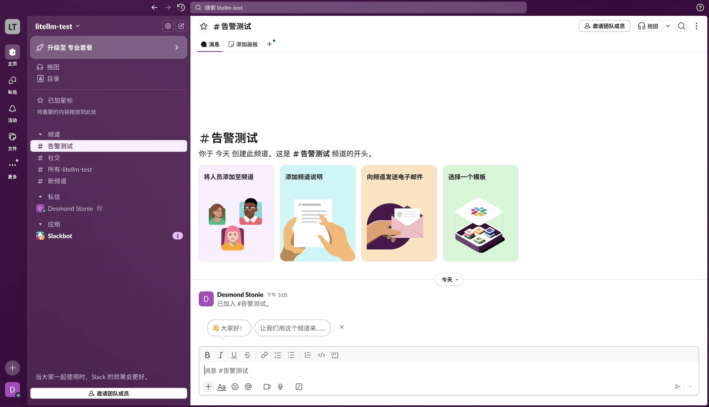
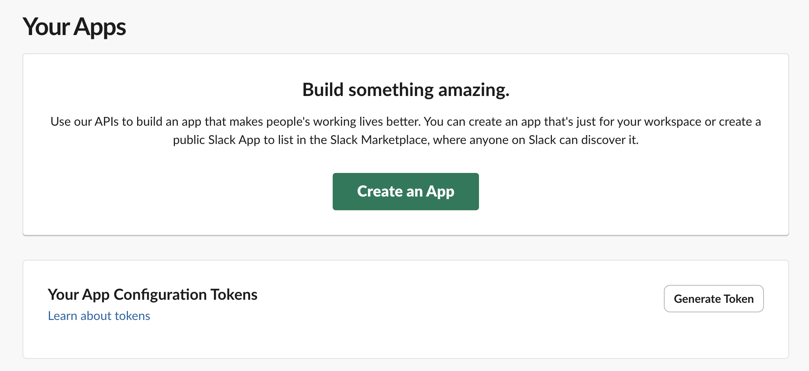
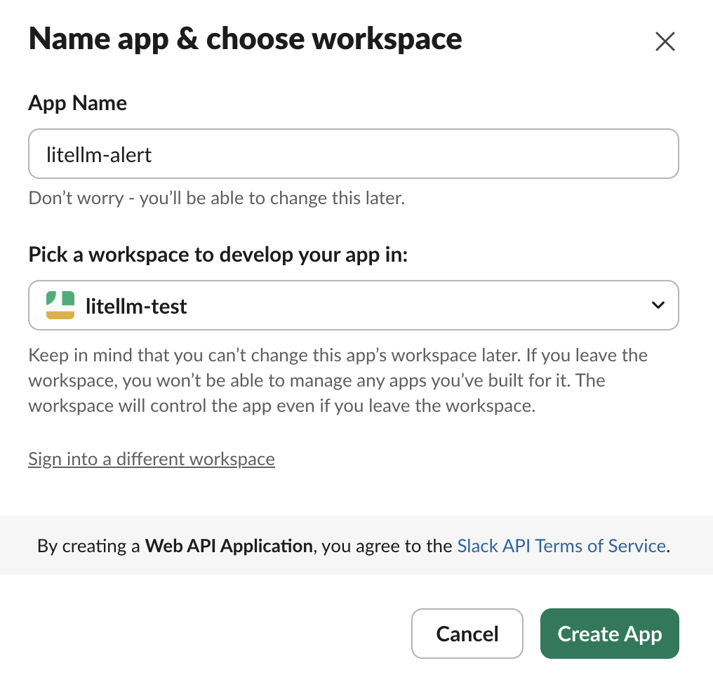
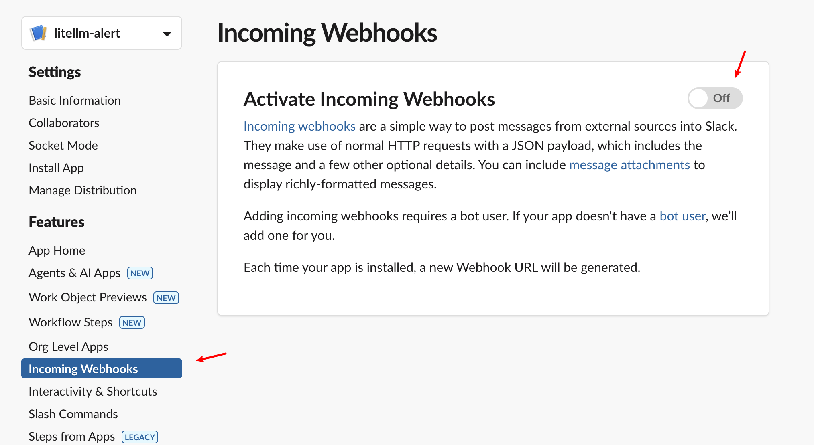
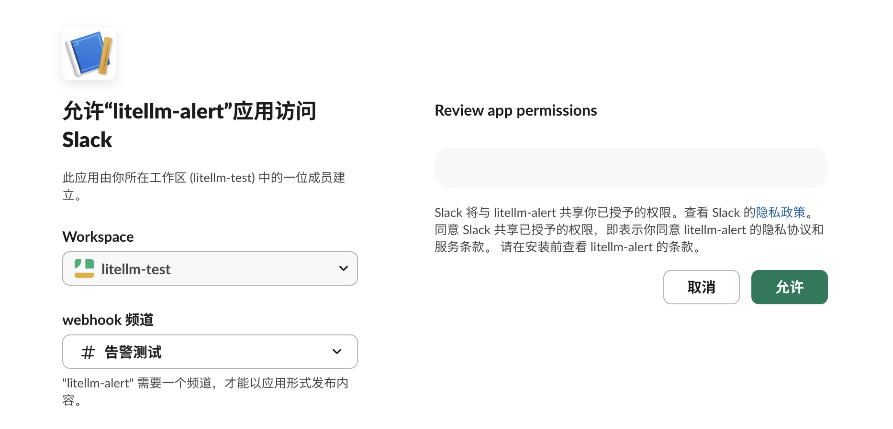
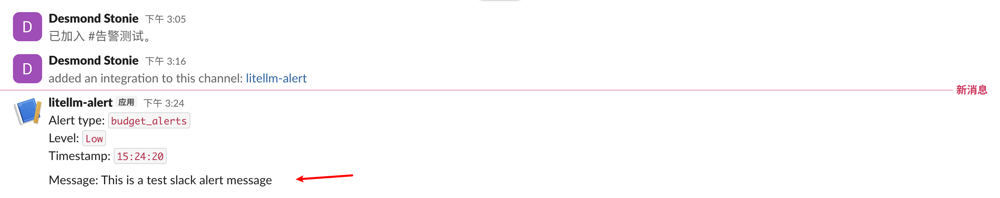
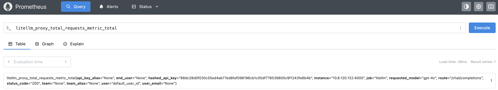
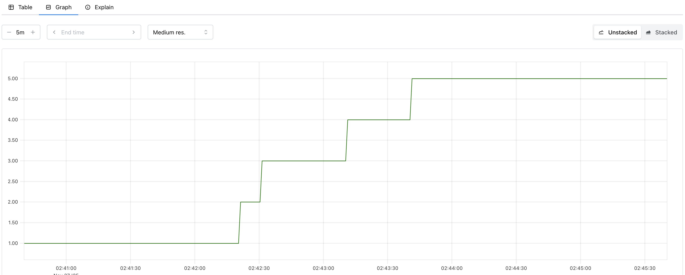

# 实战 LiteLLM 与监控告警系统的集成

在前两篇文章中，我们学习了 LiteLLM 的内置日志系统和外部日志集成能力。基于这些丰富的日志数据，我们可以实现对 LLM 网关的全面观测。然而，在生产环境中，仅仅有日志数据是不够的，我们需要的是一套完整的监控和告警体系，能够在问题发生时第一时间通知运维团队，在预算即将超限时提前预警，在模型服务异常时及时切换，从而保障整个 LLM 服务的稳定性和可靠性。

LiteLLM 提供了完善的监控告警解决方案，支持与 **Slack、Discord、Microsoft Teams** 等通讯平台集成，实现实时告警通知；或者基于 **PagerDuty** 等专业告警平台，实现 7x24 小时的运维响应；同时它还支持 **Prometheus** 指标导出，可以与 **Grafana** 等监控平台构建企业级监控大盘。

今天，我们就来学习下如何将 LiteLLM 与监控告警系统集成，构建一个主动、智能的运维体系。我们会以 Slack 和 Prometheus 为例，演示具体的集成步骤，让你的 AI 应用具备完善的监控告警能力。

## 实战 Slack 告警集成

作为全球最受欢迎的团队协作平台，[Slack](https://slack.com/) 凭借其便捷的沟通体验、灵活的频道管理能力，以及丰富的第三方集成生态，成为了团队接收、流转重要信息的核心枢纽。将告警系统与 Slack 打通，更是能直接消除信息传递的延迟差，确保技术团队、运维团队或业务团队在第一时间捕捉到异常信号，避免因通知滞后导致的问题扩大化。

### 创建 Slack Webhook

LiteLLM 通过 [Slack Webhooks](https://docs.slack.dev/messaging/sending-messages-using-incoming-webhooks/) 向 Slack 频道发送消息，从而实现告警功能。首先我们[访问 Slack 页面](https://slack.com/get-started)，创建一个新的 Slack 工作区：


如果你已有工作区，可跳过此步。我这里为方便演示，创建了一个名为 `litellm-test` 的工作区，并创建了一个名为 `告警测试` 的新频道：



然后访问 [Slack 的应用页面](https://api.slack.com/apps)：



点击 “Create an App” 创建一个名为 `litellm-alert` 的应用：



创建成功后进入该应用的配置页面，我们在左侧菜单选择 “Incoming Webhooks”，点击 “Activate Incoming Webhooks” 启用 Webhook 功能：



然后点击 “Add New Webhook” 按钮，创建一个新的 Webhook 并将其关联到工作区的 “告警测试” 频道：



这时就会生成一个 Webhook 链接，点击 “Copy” 按钮进行复制。

### 配置 LiteLLM

接下来修改 LiteLLM 的配置，开启 Slack 告警功能。首先配置环境变量：

```bash
export SLACK_WEBHOOK_URL="https://hooks.slack.com/services/aaa/bbb/ccc"
```

然后修改 `config.yaml` 配置文件：

```yaml
general_settings:
  # 启用 Slack 告警
  alerting: ["slack"]
  # 告警阈值（秒）- 请求超过 5 分钟视为异常
  alerting_threshold: 300
  # 消费报告频率（可选）
  spend_report_frequency: "1d"
```

重启 LiteLLM 服务：

```bash
$ litellm -c config.yaml
```

可以通过下面的命令测试 Slack 连接：

```bash
$ curl -X GET 'http://127.0.0.1:4000/health/services?service=slack' \
  -H 'Authorization: Bearer sk-1234'
```

如果配置正确，你应该在 Slack 频道看到类似下面这样一条测试消息：



### 告警类型

接下来我们就可以做一些真实的告警测试了。LiteLLM 支持四大类告警类型，覆盖了生产环境的主要监控需求：

**1. LLM 相关告警**
- **LLM API 异常告警（`llm_exceptions`）**：当 LLM API 出现异常时触发告警
- **慢响应告警（`llm_too_slow`）**：当 LLM 响应时间超过设定阈值时触发告警
- **请求挂起告警（`llm_requests_hanging`）**：检测未能完成的 LLM 请求
- **部署冷却告警（`cooldown_deployment`）**：当部署被置于冷却状态时的告警
- **新模型添加告警（`new_model_added`）**：通过 `/model/new` 接口添加新模型时的通知
- **停机告警（`outage_alerts`）**：当特定 LLM 部署面临停机时的告警
- **区域停机告警（`region_outage_alerts`）**：当特定 LLM 区域面临停机时的告警，例如 `us-east-1`

**2. 预算和支出告警**
- **预算告警（`budget_alerts`）**：与预算限制或阈值相关的通知
- **支出报告（`spend_reports`）**：跨团队或标签的定期支出报告
- **支出追踪失败告警（`failed_tracking_spend`）**：当支出追踪失败时的告警
- **每日报告（`daily_reports`）**：每日支出报告
- **回退报告（`fallback_reports`）**：LLM 回退发生情况的周报

**3. 数据库告警**
- **数据库异常告警（`db_exceptions`）**：数据库相关异常的通知

**4. 管理端点告警** - 虚拟密钥、团队、内部用户
- **新虚拟密钥创建告警（`new_virtual_key_created`）**：创建新虚拟密钥时的通知
- **虚拟密钥更新告警（`virtual_key_updated`）**：虚拟密钥被修改时的告警
- **虚拟密钥删除告警（`virtual_key_deleted`）**：虚拟密钥被移除时的通知
- **新团队创建告警（`new_team_created`）**：创建新团队时的告警
- **团队更新告警（`team_updated`）**：团队详情被修改时的通知
- **团队删除告警（`team_deleted`）**：团队被删除时的告警
- **新内部用户创建告警（`new_internal_user_created`）**：新内部用户账户的通知
- **内部用户更新告警（`internal_user_updated`）**：内部用户详情被更改时的告警
- **内部用户删除告警（`internal_user_deleted`）**：内部用户账户被移除时的通知

我们可以在配置文件中手动指定要启用的告警类型（如果不指定，前三类告警默认是启用的，管理端点告警默认禁用）：

```yaml
general_settings:
  alerting: ["slack"]
  alerting_threshold: 300
  # 告警类型
  alert_types: [
    "llm_exceptions",       # LLM API 异常
    "llm_too_slow",         # 响应过慢
    "llm_requests_hanging", # 请求挂起
    "budget_alerts",        # 预算告警
    "spend_reports",        # 支出报告
    "db_exceptions",        # 数据库异常
    "daily_reports",        # 每日报告
    "outage_alerts"         # 停机告警
  ]
```

另外，在生产环境中，过多的告警会导致 **告警疲劳**，降低团队对重要告警的响应速度。为此 LiteLLM 实现了去重和防轰炸机制，比如：同一用户或团队的预算告警 24 小时内只发送一次；1 分钟内的多个停机告警会被聚合成一个告警；可以通过下面这些告警参数来进行控制：

```yaml
general_settings:
  # 告警参数配置
  alerting_args:
    daily_report_frequency: 43200    # 12 小时发送一次日报
    report_check_interval: 3600      # 1 小时检查一次是否需要发送报告
    budget_alert_ttl: 86400         # 24 小时内不重复预算告警
    outage_alert_ttl: 60            # 1 分钟窗口聚合停机告警
    minor_outage_alert_threshold: 5 # 5 个错误触发轻微告警
    major_outage_alert_threshold: 10 # 10 个错误触发严重告警
```

### 多频道告警

LiteLLM 支持为不同类型的告警配置不同的通知频道：

```yaml
general_settings:
  alerting: ["slack"]
  # 为每种告警类型指定专门的 Slack 频道
  alert_to_webhook_url: {
    "llm_exceptions": "https://hooks.slack.com/services/.../llm-alerts",
    "budget_alerts": "https://hooks.slack.com/services/.../finance-alerts",
    "daily_reports": "https://hooks.slack.com/services/.../daily-reports",
    "outage_alerts": [
      "https://hooks.slack.com/services/.../oncall-alerts",
      "https://hooks.slack.com/services/.../backup-alerts"
    ]
  }
```

这种配置允许我们：

- **LLM 异常**告警发送到技术团队频道
- **预算告警**发送到财务管理频道
- **每日报告**发送到管理层频道
- **停机告警**同时发送到多个值班频道

### 兼容其他平台

LiteLLM 的 Slack 集成同样支持 Discord 和 Microsoft Teams（它们两都兼容 Slack 的 Webhook 格式）：

**Discord 配置：**
```bash
# Discord Webhook 需要在 URL 后添加 /slack
export SLACK_WEBHOOK_URL="https://discord.com/api/webhooks/1240.../cTLWt5A.../slack"
```

**Microsoft Teams 配置：**
```bash
# MS Teams 提供 Slack 兼容的 Webhook
export SLACK_WEBHOOK_URL="https://outlook.office.com/webhook/...IncomingWebhook/..."
```

只需修改 Webhook URL 即可，配置文件保持不变。

## 实战 Prometheus 监控集成

[Prometheus](https://prometheus.io/) 是一个开源的监控和告警系统，最初由 SoundCloud 开发。它具有以下特点：

- **时间序列数据库**：专为监控数据设计的高性能存储
- **Pull 模式**：主动拉取目标服务的指标数据
- **强大的查询语言**：PromQL 支持复杂的数据分析和聚合
- **告警管理**：与 Alertmanager 集成实现灵活的告警规则
- **生态完整**：与 Grafana 等可视化工具无缝集成

目前 Prometheus 已经是云原生监控的事实标准，LiteLLM 的企业版本提供了 Prometheus 集成能力。

### 配置 Prometheus 回调

首先安装必要的依赖：

```bash
$ pip install prometheus_client==0.20.0
```

然后在配置文件中启用 Prometheus 回调：

```yaml
litellm_settings:
  callbacks: ["prometheus"]  # 启用 Prometheus 指标
```

重启 LiteLLM 服务：

```bash
$ litellm -c config.yaml
```

现在访问 `http://localhost:4000/metrics` 就可以看到 Prometheus 格式的指标数据。目前指标数据还是空的，可以发送几个测试请求后再看：

```bash
$ curl -X POST 'http://127.0.0.1:4000/chat/completions' \
  -H 'Authorization: Bearer sk-1234' \
  -H 'Content-Type: application/json' \
  -d '{
    "model": "gpt-4o",
    "messages": [{"role": "user", "content": "给我讲个笑话"}]
  }'
```

### 指标详解

LiteLLM 提供的指标大致可以分为以下几个主要类别：

#### 1. 代理服务指标（Proxy Service Metrics）

这类指标主要监控 LiteLLM 代理服务的整体运行状况和请求处理情况：

- **`litellm_proxy_total_requests_metric_total`** (counter)
  代理服务总请求数 - 跟踪客户端向代理发起的请求总量
- **`litellm_proxy_failed_requests_metric_total`** (counter)
  代理服务失败请求数 - 客户端未能从代理获得成功响应的请求数

#### 2. 延迟性能指标（Latency & Performance Metrics）

这类指标用于监控请求处理的延迟情况，帮助识别性能瓶颈：

- **`litellm_request_total_latency_metric`** (histogram)
  LiteLLM 请求总延迟时间（包含 LiteLLM 开销）
- **`litellm_llm_api_latency_metric`** (histogram)
  LLM API 调用延迟时间
- **`litellm_llm_api_time_to_first_token_metric`** (histogram)
  LLM API 首个 token 响应时间（仅流式请求）
- **`litellm_overhead_latency_metric`** (histogram)
  LiteLLM 处理开销延迟

#### 3. 成本和使用量指标（Cost & Usage Metrics）

这类指标跟踪 LLM 服务的使用成本和 token 消费情况：

- **`litellm_spend_metric_total`** (counter)
  LLM 请求总花费
- **`litellm_total_tokens_metric_total`** (counter)
  LLM 请求的输入+输出 token 总数
- **`litellm_input_tokens_metric_total`** (counter)
  LLM 请求的输入 token 总数
- **`litellm_output_tokens_metric_total`** (counter)
  LLM 请求的输出 token 总数

#### 4. 预算管理指标（Budget Management Metrics）

这类指标监控团队和 API 密钥的预算使用情况，支持成本控制：

**团队预算指标：**
- **`litellm_remaining_team_budget_metric`** (gauge)
  团队剩余预算
- **`litellm_team_max_budget_metric`** (gauge)
  团队最大预算设置
- **`litellm_team_budget_remaining_hours_metric`** (gauge)
  团队预算重置剩余时间（小时）

**API 密钥预算指标：**
- **`litellm_remaining_api_key_budget_metric`** (gauge)
  API 密钥剩余预算
- **`litellm_api_key_max_budget_metric`** (gauge)
  API 密钥最大预算设置
- **`litellm_api_key_budget_remaining_hours_metric`** (gauge)
  API 密钥预算重置剩余时间（小时）

#### 5. 流量控制指标（Rate Limiting Metrics）

这类指标监控基于模型的请求和 token 限制情况：

- **`litellm_remaining_api_key_requests_for_model`** (gauge)
  API 密钥针对特定模型的剩余请求数（基于 RPM 限制）
- **`litellm_remaining_api_key_tokens_for_model`** (gauge)
  API 密钥针对特定模型的剩余 token 数（基于 TPM 限制）
- **`litellm_remaining_requests`** (gauge)
  LLM 部署的剩余请求数（来自 LLM API 提供商）
- **`litellm_remaining_tokens`** (gauge)
  LLM 部署的剩余 token 数（来自 LLM API 提供商）

#### 6. 部署状态指标（Deployment Analytics）

这类指标监控 LLM 部署的健康状态和运行表现：

**部署状态：**
- **`litellm_deployment_state`** (gauge)
  部署状态：0=健康，1=部分故障，2=完全故障
- **`litellm_deployment_cooled_down_total`** (counter)
  部署被负载均衡逻辑冷却的次数

**请求统计：**
- **`litellm_deployment_success_responses_total`** (counter)
  LLM 部署成功响应总数
- **`litellm_deployment_failure_responses_total`** (counter)
  LLM 部署失败响应总数
- **`litellm_deployment_total_requests_total`** (counter)
  LLM 部署总请求数（成功+失败）

**性能分析：**
- **`litellm_deployment_latency_per_output_token`** (histogram)
  每个输出 token 的延迟时间

#### 7. 回退机制指标（Fallback Metrics）

这类指标监控主要模型失败时的回退处理情况：

- **`litellm_deployment_successful_fallbacks_total`** (counter)
  成功回退请求数（从主模型→回退模型）
- **`litellm_deployment_failed_fallbacks_total`** (counter)
  失败回退请求数（从主模型→回退模型）

### 自定义 Metrics 标签

LiteLLM 支持添加自定义元数据作为 Prometheus 标签：

```yaml
litellm_settings:
  callbacks: ["prometheus"]
  # 将请求元数据添加为 Prometheus 标签
  custom_prometheus_metadata_labels: [
    "metadata.environment",
    "metadata.service",
    "metadata.version"
  ]
```

发送带有自定义元数据的请求：

```bash
$ curl -X POST 'http://localhost:4000/chat/completions' \
  -H 'Authorization: Bearer sk-1234' \
  -H 'Content-Type: application/json' \
  -d '{
    "model": "gpt-4o",
    "messages": [{"role": "user", "content": "测试"}],
    "metadata": {
      "environment": "production",
      "service": "chatbot",
      "version": "v1.2.3"
    }
  }'
```

生成的指标将包含这些自定义的标签：

```prometheus
litellm_total_tokens_metric{
  model="gpt-4o",
  metadata_environment="production",
  metadata_service="chatbot",
  metadata_version="v1.2.3"
} 89
```

> 使用此功能时需特别小心，避免使用高基数标签（比如 `user_id` 或 `request_id` 等），可能导致指标爆炸，造成性能问题。

另一种自定义标签的方式是通过 `custom_prometheus_tags` 配置：

```yaml
litellm_settings:
  callbacks: ["prometheus"]
  # 自定义标签
  custom_prometheus_tags: [
    "prod",
    "staging"
  ]
```

然后发送带标签的请求：

```bash
$ curl -X POST 'http://localhost:4000/chat/completions' \
  -H 'Authorization: Bearer sk-1234' \
  -H 'Content-Type: application/json' \
  -d '{
    "model": "gpt-4o",
    "messages": [{"role": "user", "content": "测试"}],
    "metadata": {
      "tags": ["prod"]
    }
  }'
```

生成的指标如下所示：

```prometheus
litellm_total_tokens_metric{
  model="gpt-4o",
  tag_prod="true",
  tag_staging="false"
} 89
```

### 使用 Prometheus 采集指标

创建 `prometheus.yml` 配置文件：

```yaml
global:
  scrape_interval: 15s
  evaluation_interval: 15s

scrape_configs:
  - job_name: 'litellm'
    static_configs:
      - targets: ['10.6.120.132:4000'] # 换成你的 IP 地址
    metrics_path: '/metrics'
    scrape_interval: 10s
```

然后使用 Docker 启动 Prometheus 服务：

```bash
$ docker run -d \
  --name prometheus \
  -p 9090:9090 \
  -v $(pwd)/prometheus.yml:/etc/prometheus/prometheus.yml \
  prom/prometheus
```

访问 `http://localhost:9090` 进入 Prometheus 的 Query 页面，输入指标即可查询：



点击 “Graph” 以图的形式查看指标：



通过 Prometheus 采集的指标数据，我们可以更进一步，基于 Grafana 构建一个完整的 LiteLLM 监控大盘，实现对 AI 服务的全方位观测。可以参考 LiteLLM 官方提供的 Grafana 仪表盘模板：

* https://github.com/BerriAI/litellm/tree/main/cookbook/litellm_proxy_server/grafana_dashboard

此外，Prometheus 还可以和 Alertmanager 集成，实现比 Slack 更灵活的告警规则。具体内容可以参考 Alertmanager 的官方文档：

* https://prometheus.io/docs/alerting/latest/alertmanager/

## 小结

今天我们深入学习了 LiteLLM 的监控告警系统，重点掌握了两种集成方案：

- **Slack 告警集成**：提供实时的通知能力，支持多种告警类型和智能去重，特别适合团队协作和快速响应的场景
- **Prometheus 监控集成**：基于时间序列数据的企业级监控方案，与 Grafana 结合可构建完整的可观测性平台，或者与 Alertmanager 集成实现更灵活的告警规则

除了这两种集成方案，LiteLLM 还支持 PagerDuty、邮件、Webhook 等其他方式，篇幅有限，此处不再赘述。

监控告警系统是生产环境的神经系统，它让我们能够感知系统的每一个变化，及时响应每一个问题。希望通过本文的学习，你能够建立起稳定可靠的 LiteLLM 监控告警体系，为用户提供更好的 AI 服务体验。
