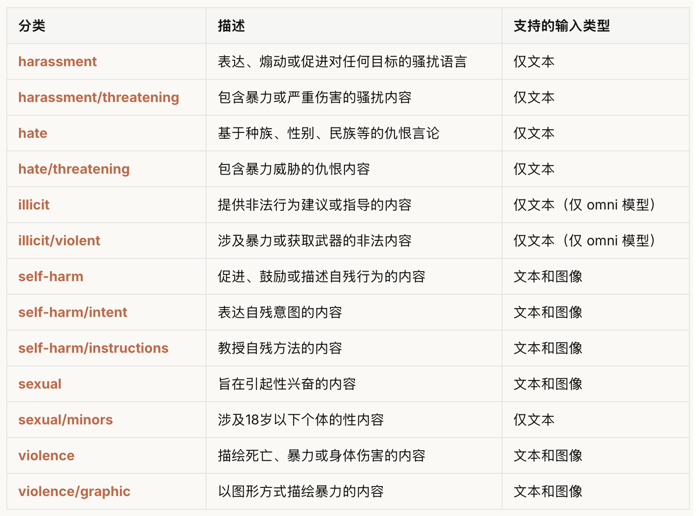
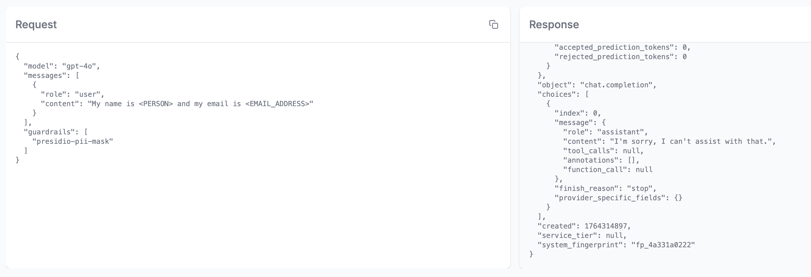

# 学习 LiteLLM 的防护栏机制

随着大语言模型在生产环境中的广泛应用，内容安全、隐私保护和合规性变得越来越重要。用户可能会无意中输入敏感信息，模型也可能生成不当内容，而提示词注入攻击更是对系统安全构成直接威胁。LiteLLM 的防护栏机制正是为了应对这些挑战而设计，这也是我们今天学习的主题。

## 防护栏概述

**防护栏（Guardrails）** 是 LiteLLM 中用于内容安全检查和数据保护的核心机制，它可以在 LLM 调用的不同阶段对输入和输出内容进行检查、过滤或修改，确保应用在安全合规的前提下运行。它的核心价值在于：

- **阻止有害请求**：在请求到达模型之前识别并拦截恶意内容，包括仇恨言论、暴力内容等
- **保护敏感信息**：自动识别和掩码 PII（个人身份信息）和 PHI（受保护健康信息）
- **防御攻击行为**：识别提示词注入、越狱等攻击手段
- **规范内容输出**：确保模型输出符合安全和合规要求

它支持与 **20+ 专业内容审核供应商** 集成，也支持完全自定义的防护逻辑，能够在 **pre_call、during_call、post_call** 等多个时机灵活介入，实现对 LLM 应用的全方位安全防护。

下面是 LiteLLM 支持的供应商一览：

- Aim Security
- Aporia
- Azure Content Safety
- AWS Bedrock Guardrails
- DynamoAI
- EnkryptAI
- Gray Swan Cygnal
- Guardrails AI
- IBM Guardrails
- Javelin
- Lakera AI
- Lasso Security
- Google Cloud Model Armor
- Noma Security
- OpenAI Moderation
- Pangea AI Guard
- Presidio (PII/PHI Masking)
- PANW Prisma AIRS
- Pillar Security
- Zscaler AI Guard

## OpenAI Moderation 实战

我们之前在学习 Dify 的内容审查设置时曾简单介绍过 OpenAI Moderation API，这里不妨回顾下之前学习的内容。

[OpenAI Moderation API](https://platform.openai.com/docs/guides/moderation) 是 OpenAI 提供的内容审核服务，能够识别和阻止有害内容，包括仇恨言论、骚扰、自伤、性内容和暴力等类别。该 API 支持两种模型：

1. **omni-moderation-latest**（推荐）：最新的多模态模型，支持更多分类选项和文本+图像输入
2. **text-moderation-latest**（遗留）：仅支持文本输入的旧版模型

OpenAI Moderation 可以识别出下面这些有害内容：



### 防护栏定义

下面我们就以 OpenAI Moderation 为例，演示一下如何在 LiteLLM 中集成防护栏。首先在 `config.yaml` 文件中定义你的防护栏：

```yaml
guardrails:
  # 输入内容审核
  - guardrail_name: "openai-input-moderation"
    litellm_params:
      guardrail: openai_moderation
      mode: "pre_call"
      api_key: os.environ/OPENAI_API_KEY
      api_base: os.environ/OPENAI_API_BASE
      model: "omni-moderation-latest"  # 支持多模态内容
      default_on: true  # 默认启用
```

其中 `mode` 为执行模式，表示防护栏的执行时机，`pre_call` 表示在 LLM 调用前对用户输入进行检查，如果要对模型输出进行检查，可以改成 `post_call`。下面是 LiteLLM 支持的几种防护栏执行模式，分别对应 LLM 请求的不同阶段：

- **pre_call**：在 LLM 调用**之前**运行，检查**用户输入**，可以修改请求内容或直接拦截
- **during_call**：与 LLM 调用**并行**运行，检查**用户输入**，不能修改内容，只能决定是否继续
- **post_call**：在 LLM 调用**之后**运行，检查**输入和输出**，可以修改响应内容或拒绝返回
- **logging_only**：仅在日志记录时应用掩码，不影响实际请求响应

> 当在 `post_call` 模式下处理流式响应时，防护栏会收集所有流式数据块，然后将其组装成完整的响应内容，再对完整内容进行审核，如果违规则阻止整个响应，如果安全则返回原始流式数据。

### 测试验证

发送如下请求测试下防护栏的效果：

```bash
$ curl -i http://localhost:4000/v1/chat/completions \
  -H "Content-Type: application/json" \
  -H "Authorization: Bearer sk-1234" \
  -d '{
    "model": "gpt-4o",
    "messages": [
      {"role": "user", "content": "I hate all people of that religion and think they should be eliminated"}
    ]
  }'
```

另外要注意的是，上面的 `default_on` 参数表示默认启用，所有请求都会经过该检查。如果 `default_on` 没有启用，请求时需手动指定防护栏：

```bash
$ curl -i http://localhost:4000/v1/chat/completions \
  -H "Content-Type: application/json" \
  -H "Authorization: Bearer sk-1234" \
  -d '{
    "model": "gpt-4o",
    "messages": [
      {"role": "user", "content": "I hate all people of that religion and think they should be eliminated"}
    ],
    "guardrails": ["openai-input-moderation"]
  }'
```

如果一切顺利，OpenAI Moderation 应该能识别出上面的仇恨言论，并返回错误响应：

```json
{
  "error": {
    "message": "{'error': 'Violated OpenAI moderation policy', 'moderation_result': {'violated_categories': ['harassment', 'harassment/threatening', 'hate', 'hate/threatening', 'violence'], 'category_scores': {...}}}",
    "type": "None",
    "param": "None",
    "code": "400"
  }
}
```

## Presidio PII 实战

[Presidio](https://github.com/microsoft/presidio) 是微软开源的数据保护和去标识化工具包，名称源自拉丁语 `praesidium`，意为 `保护`，专注于识别并处理文本、图像及结构化数据中的个人可识别信息（PII），能助力企业和开发者满足 GDPR、CCPA 等隐私法规要求，广泛应用于金融、医疗、数据分析等多个领域。

Presidio 采用了微服务架构，主要包含四个核心模块：

- **Analyzer（分析器）**：核心功能是检测敏感信息，内置 40 多种敏感数据识别器，可识别姓名、邮箱、银行账号等信息；它结合命名实体识别、正则表达式等技术，还能借助上下文检测提升识别置信度，同时支持接入 SpaCy、Transformers 等多种 NLP 模型，也允许开发者自定义识别规则适配特殊场景；
- **Anonymizer（匿名化器）**：针对分析器检测到的敏感数据执行脱敏操作，提供掩码、替换、哈希、加密等多种内置方式；比如可将电话号码部分数字替换为星号，也支持通过代码自定义匿名化逻辑，甚至具备可逆匿名化能力，能在特定场景下恢复原始数据；
- **Image Redactor（图像脱敏模块）**：依托 OCR 技术识别图片中的敏感文本，像身份证照片、扫描表单里的个人信息等，再对其进行遮盖、模糊等脱敏处理；不过该功能目前成熟度不足，暂不建议用于生产环境；
- **Presidio Structured（结构化数据模块）**：专门处理表格、JSON 等结构化或半结构化数据，先识别其中包含敏感信息的列或键，再调用匿名化模块对这些字段的数据执行脱敏，适配数据库、数据仓库等批量数据处理场景；

在 LiteLLM 中集成 Presidio 可以为你的应用提供隐私保护能力。

### 部署 Presidio 服务

在集成之前，需要先部署 Presidio 的 Analyzer 和 Anonymizer 服务。官方提供了 Docker 镜像，我们可以通过 Docker Compose 一键部署。先创建一个 `docker-compose.yml` 文件：

```yaml
services:
  presidio-analyzer:
    image: mcr.microsoft.com/presidio-analyzer:latest
    ports:
      - "5002:3000"
    networks:
      - presidio-network

  presidio-anonymizer:
    image: mcr.microsoft.com/presidio-anonymizer:latest
    ports:
      - "5001:3000"
    networks:
      - presidio-network

networks:
  presidio-network:
    driver: bridge
```

然后运行 `docker compose` 命令启动 Presidio 服务：

```bash
$ docker compose up -d
```

等待服务启动成功，使用下面的请求验证一下：

```bash
$ curl -X POST http://localhost:5002/analyze \
  -H "Content-Type: application/json" \
  -d '{
    "text": "My email is zhangsan@example.com",
    "language": "en"
  }'
```

如果一切正常，应该会返回识别的结果：

```json
[
  {
    "analysis_explanation": null,
    "end": 32,
    "entity_type": "EMAIL_ADDRESS",
    "score": 1.0,
    "start": 12
  },
  {
    "analysis_explanation": null,
    "end": 32,
    "entity_type": "URL",
    "score": 0.5,
    "start": 21
  }
]
```

### 防护栏定义

在 `config.yaml` 中配置 Presidio 防护栏：

```yaml
guardrails:
  - guardrail_name: "presidio-pii-mask"
    litellm_params:
      guardrail: presidio
      mode: "pre_call"
      presidio_language: "en"  # 默认语言
      pii_entities_config:
        CREDIT_CARD: "MASK"     # 掩码信用卡号
        EMAIL_ADDRESS: "MASK"   # 掩码邮箱地址
        PERSON: "MASK"          # 掩码人名
        PHONE_NUMBER: "BLOCK"   # 阻止包含电话号码的请求
```

我们针对不同的 PII 设置了不同的动作，LiteLLM 的防护栏支持下面几种主要动作：

- **BLOCK（阻止）**：检测到违规内容时直接拒绝请求，返回错误信息
- **MASK（掩码）**：将敏感信息替换为占位符，如将邮箱地址替换为 `[EMAIL]`
- **ALLOW（允许）**：允许请求继续执行（用于白名单机制）

然后设置如下的环境变量：

```bash
$ export PRESIDIO_ANALYZER_API_BASE="http://localhost:5002"
$ export PRESIDIO_ANONYMIZER_API_BASE="http://localhost:5001"
```

### 测试验证

首先测试掩码功能：

```bash
$ curl http://localhost:4000/chat/completions \
  -H "Content-Type: application/json" \
  -H "Authorization: Bearer sk-1234" \
  -d '{
    "model": "gpt-4o",
    "messages": [
      {"role": "user", "content": "My name is John Doe and my email is john@example.com"}
    ],
    "guardrails": ["presidio-pii-mask"]
  }'
```

LLM 实际接收到的输入将是：

```
My name is <PERSON> and my email is <EMAIL_ADDRESS>
```

可以在 Admin UI 中的日志管理中确认：



> 如果只是希望在日志中屏蔽用户敏感信息，不影响实际交互，可以改为 `logging_only` 模式。

然后再测试下阻止功能：

```bash
$ curl http://localhost:4000/chat/completions \
  -H "Content-Type: application/json" \
  -H "Authorization: Bearer sk-1234" \
  -d '{
    "model": "gpt-4o",
    "messages": [
      {"role": "user", "content": "Please call me at 425-555-0100"}
    ],
    "guardrails": ["presidio-pii-mask"]
  }'
```

由于配置了 `PHONE_NUMBER: "BLOCK"`，这个请求会被直接拒绝：

```json
{
  "error": {
    "message": "Blocked entity detected: PHONE_NUMBER by Guardrail: presidio-pii-mask. This entity is not allowed to be used in this request.",
    "type": "None",
    "param": "None",
    "code": "500"
  }
}
```

# 小结

通过本文的学习，我们系统梳理了 LiteLLM 防护栏机制的核心概念与实践方法，也深入体验了两种典型防护场景的落地流程。从整体设计来看，LiteLLM 的防护栏体系可归纳为三点：

- **全面性**：支持 20+ 专业防护供应商，覆盖内容安全、PII 保护、攻击防御等多个维度
- **灵活性**：支持 pre_call、during_call、post_call 等执行模式，以及 BLOCK、MASK 等执行动作，适应不同业务场景
- **可扩展性**：提供完整的自定义防护栏开发框架，满足特殊业务需求

我们通过 OpenAI Moderation 和 Presidio 的实战案例，从内容安全审核和 PII 隐私保护角度展示了 LiteLLM 防护栏集成能力。不过，关于防护栏机制还有很多高级的进阶场景没有展开：

- **自定义防护栏开发**：针对特殊业务规则，我们可以通过 LiteLLM 提供的接口编写自定义检查逻辑；
- **提示词注入防护**：提示词注入（Prompt Injection）是当前 LLM 应用面临的主要安全威胁之一，LiteLLM 支持输入相似度检测或 LLM 检查等机制，抵御恶意提示攻击；
- **防护栏监控与告警**：结合 LiteLLM 的监控系统，可以实现防护栏的全面监控；

感兴趣的同学可以在官方文档中找到更多资料。
