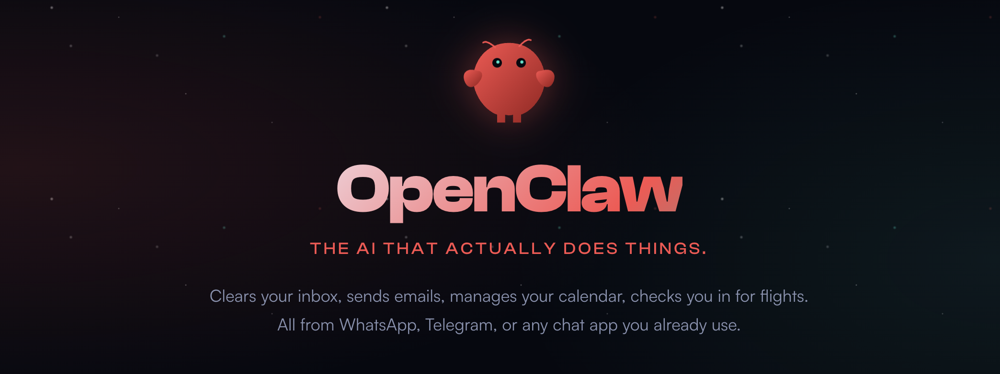
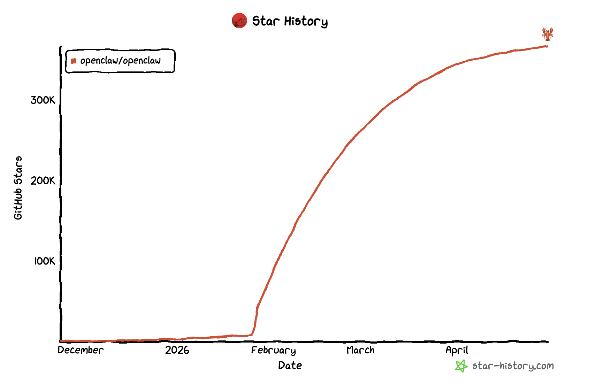

# OpenClaw 介绍：一款运行在自己设备上的开源 AI 助手

好久没和大家见面了。上一次更新还是 2025 年 12 月初那篇关于 LiteLLM 防护栏的文章，算下来已经停更了将近五个月。这段时间里，工作上的事情一茬接一茬，再加上春节前后总想给自己留点喘息的空档，公众号就这么一拖再拖。今天是 2026 年 5 月 1 日，劳动节，正好趁着假期把更新的节奏重新捡起来 —— 这是 2026 年的第一篇，也算是给自己重新定一个开始。

新的一年我打算换一个相对系统的话题来写，这就是我们今天要开篇的主角：**OpenClaw**，国内开发者圈里更熟悉的名字是 **小龙虾**。仓库地址是 `https://github.com/openclaw/openclaw`，官网 `https://openclaw.ai`，文档 `https://docs.openclaw.ai`，许可协议是 MIT。

从今年春节后开始，这个项目就在 GitHub Trending、Hacker News、X、即刻、V2EX 上接连刷屏，2 月中旬星标数甚至一度超过 React 登顶，国内外科技媒体把它形容为"近两年最具讨论度的开源 AI 项目"。截至撰文（2026 年 5 月 1 日），仓库 star 数已经突破 36.7 万，是 GitHub 上增长最陡峭的开源项目之一。

热度本身并不是我想写它的理由 —— 真正吸引我的是它解决问题的方式：把分散在 WhatsApp、Telegram、Slack、飞书、微信、iMessage 多个通道里的助手能力收拢成一个跑在自己机器上的本地 Gateway。这个形态和我们之前接触过的 ChatGPT、Claude.ai 这类云端 SaaS，以及 Open WebUI、LobeChat 这类自部署 Web UI 都不太一样，值得花一个系列的篇幅好好聊一聊。

今天这一篇是开篇，不安装、不动手，目的是先把这个项目本身讲清楚：它从哪里来，它是什么，它解决了什么问题，以及和市面上常见的 AI 助手有什么区别。后续的文章会沿着快速入门、通道接入、模型配置、工具体系、多智能体、语音、安全沙箱、远程部署这条主线，逐一动手把它跑起来。

## 一只爆火的太空龙虾

讲 OpenClaw 之前，绕不开它的几次改名史 —— 因为这直接解释了"为什么这个项目长得这么像 Claude Code、却又叫 OpenClaw"。

故事的起点是 **2025 年 11 月 24 日**，作者 Peter Steinberger 在自己的博客上发布了一个叫 **Clawdbot** 的小工具。`Clawd` 是 Claude 的发音变体，最早的定位非常朴素：把 Claude 接到 Telegram 上，方便自己出门的时候也能用一句话调起 Claude，而不必盯着 Mac 上的网页。换句话说，第一版 Clawdbot 既不通用也不开源风评，就是 Steinberger 自己用的脚本，顺手挂在 GitHub 上。

但 Clawdbot 上线第一天就拿了 9000 个 star，三天破 6 万，两周冲到 19 万。Steinberger 后来在博客里写："我以为我做了一个周末玩具，结果它在我去 Costco 的路上变成了我的全职工作。" 整个 12 月，他基本没干别的事，把渠道从 Telegram 扩到了 Slack、Discord、Signal，OpenClaw 的雏形就这样定下来了：**消息从渠道进 Gateway，Gateway 调模型，模型再走渠道回。**

热度上来之后，麻烦也跟着来了。**2026 年 1 月 27 日**，Steinberger 收到了 Anthropic 法务部一封"礼貌邮件"，大意是：`Clawd` 这个发音容易让用户误以为这是 Claude 官方的产品，希望尽快改名。Steinberger 当天就做了决定：改成 **Moltbot**，Molt 是甲壳类动物蜕壳的意思，也是吉祥物太空龙虾的名字。但 Moltbot 这个名字只活了三天，用 Steinberger 自己博客里的原话：`Moltbot never quite rolled off the tongue`，它读起来不太顺口。**1 月 30 日**，项目第二次更名为 **OpenClaw**：`Open` 强调开源，`Claw` 保留了龙虾的爪子梗，整体读起来比 Moltbot 顺。这次 Steinberger 把 GitHub 组织、域名、文档、所有社交账号一次性切干净。

3 个月，3 个名字 —— Clawdbot → Moltbot → OpenClaw，这段经历被国内外社区戏称为"开源史上最快三连改名"。

> 改名期间还夹杂着一段不太愉快的小插曲：旧的 `@clawdbot` 用户名在 Anthropic 邮件公开后没多久就被加密币骗子抢注了，对方挂出了带钱包地址的"官方空投"骗局，原 Discord 邀请链接、Telegram 群组也被克隆。Steinberger 在两个周末里追着平台举报，旧账号上最终钉了一条"已被冒用，请认准 @openclaw"的置顶。这件事和 Moltbot 改名 OpenClaw 的决定关系不大，但确实加快了 Steinberger 把所有社交资产一次性切到新名字的节奏。

故事的尾声在两周后。**2026 年 2 月 14 日**晚到 15 日，Sam Altman 在 X 上亲自发文宣布 Steinberger 加入 OpenAI，主导"下一代个人 Agent"的工作，CNBC、TechCrunch、Bloomberg 纷纷跟进报道。Steinberger 没有把 OpenClaw 卖掉、也没有交给某家公司，而是组建了一个非营利基金会接管开源治理，项目继续以 MIT 许可证的形式独立运营。

> 顺带说一下吉祥物的梗。Molty 是一只穿宇航服漂在太空里的龙虾，README 顶部那行口号 `EXFOLIATE! EXFOLIATE!` 是它的口头禅 —— 明显是在戏仿 Doctor Who 里 Dalek 那句著名的 `EXTERMINATE!`，同时 exfoliate（去角质 / 蜕皮）又呼应了龙虾蜕壳的 molt。整个项目的起名、吉祥物、slogan 是一条完整的梗链，连 Discord 里都专门有个 `#lobster-memes` 频道。国内开发者顺手把这个项目叫成了"小龙虾"，"养龙虾"也成了部署、调教、接通道、配技能这一整套折腾的统称。

## OpenClaw 是什么

按照官方 README 的定义：

> OpenClaw is a personal AI assistant you run on your own devices. It answers you on the channels you already use.

翻译过来就是：**OpenClaw 是一个跑在你自己设备上的个人 AI 助手，它在你已经在用的通道里直接回你消息。** 这一句话里有两个关键定语 —— 一个是 **personal**（个人、单用户），一个是 **on your own devices**（本地优先）。这两点决定了它和 ChatGPT、Claude.ai 这类云端 SaaS，以及 Open WebUI、LobeChat 这类自部署 Web UI 都不太一样。

它和一般的 AI 聊天 App 最大的区别在于：**它不自己造一个对话界面，而是直接接入你已经在用的消息渠道**。你的 iMessage、WhatsApp、Telegram、Slack、Discord、飞书、微信本来怎么聊天，OpenClaw 就让助手也出现在同一个聊天列表里。这种"不抢占用户界面、寄生到现有通道"的思路，在 2026 年这个时间点显得格外反潮流 —— 当所有人都在卷 AI-native 应用的时候，它反过来说：你已经有 100 个对话工具了，AI 不应该再逼你装第 101 个。

项目作者 Peter Steinberger 是奥地利开发者、PSPDFKit 的创始人，把那家公司卖掉之后，他想给自己写一个真正能干活的 AI 助手。OpenClaw 选 TypeScript 作为主语言，理由在 VISION 文档里写得很直接：

> OpenClaw is primarily an orchestration system: prompts, tools, protocols, and integrations. TypeScript was chosen to keep OpenClaw hackable by default.

也就是说，编排系统的本质是把提示词、工具、协议、集成胶在一起，TypeScript 的迭代速度和可读性更高，社区贡献门槛也更低。这一点和 Cursor、Claude Code 这些近期的 AI Agent 工具技术栈是一致的。

## 它要解决的痛点

很多人第一次听到"个人 AI 助手"这个说法时会想：现在工具不是已经够多了吗？仔细看会发现，市面上常见的方案各自都缺一块。

**云端聊天网页**（ChatGPT、Claude.ai、Gemini）在 Web 上做得很好，但要把它接到 WhatsApp、Telegram 这样的真实消息通道上，得自己写一层 Bot 适配。每多一个通道就多一份配置，多一份会话拼接。

**自部署 Web UI**（Open WebUI、LobeChat、AnythingLLM）解决了模型自主权的问题，但本质上是再开一个浏览器标签页。你和它聊天的入口和你日常和同事聊天的入口仍然是两套，记忆、历史、文件也是两套。

**消息平台 Bot**（Telegram Bot、Discord Bot、Slack Bot）入口对了，但每个平台都得单独写、单独维护，路由、工具调用、模型切换、记忆这些通用能力都得在每个 Bot 里再写一遍。

OpenClaw 的思路是把这三类切片合到一起，做成一个本地 Gateway。Gateway 是控制面：它对外暴露通道适配，对内统一管理会话、工具、事件、模型路由。具体到能力上：

- 你已经在用的 20 多个通道（WhatsApp、Telegram、Slack、Discord、Signal、iMessage、Microsoft Teams、Matrix、飞书、LINE、Mattermost、WeChat、QQ、WebChat 等）通过 Gateway 接入，回的是同一个助手
- 你的模型配置在 Gateway 里集中管理，一处配置全通道生效，并且支持多家服务商之间的故障转移与回退
- 工具调用（浏览器、Canvas、Cron、Sessions、文件读写）跑在你自己的机器上，需要时可以套一层 Docker / SSH / OpenShell 沙箱
- 在 macOS / iOS 上可以喊唤醒词进入 Talk Mode，在 Android 上是持续语音

一句话概括它的差异：**OpenClaw 不是再开一个聊天 UI，而是长在你已经用的通道里。**

## 核心特性一览

OpenClaw 的 README 把自己的亮点总结成了 8 条，按中文语境梳理一下方便有个整体概念：

* **本地优先的 Gateway**：整个系统只有一个长驻进程，负责会话、通道、工具、事件的统一调度。默认作为用户态守护进程运行（macOS launchd、Linux systemd），通过 `openclaw onboard --install-daemon` 一条命令安装，跑在你自己的机器上，不需要任何云端组件就能工作
* **多通道收件箱**：官方支持 20+ 通道，覆盖 WhatsApp、Telegram、Slack、Discord、Google Chat、Signal、iMessage、BlueBubbles、IRC、Microsoft Teams、Matrix、飞书、LINE、Mattermost、Nextcloud Talk、WeChat、QQ、WebChat 等。可以理解为把你所有聊天窗口都接进了一个 AI 路由器
* **多智能体路由**：Gateway 支持把不同的入站通道、账户、对端路由到不同的 agent 实例。每个 agent 有自己独立的 workspace 和 session 隔离，互不串台。比如可以让工作飞书路由到一个使用 GPT-5 的严肃风格 agent，把私人 Telegram 路由到一个使用 Claude 4.7 的轻松风格 agent，二者的记忆和工具权限完全分开
* **Voice Wake + Talk Mode**：macOS / iOS 支持关键词唤醒，Android 支持持续对讲，TTS 优先走 ElevenLabs，失败时回落到系统自带合成
* **Live Canvas**：Agent 可以驱动一块可视化工作区，背后是一套叫 **A2UI（Agent-to-UI）** 的协议，允许模型直接绘制、更新前端控件，而不只是回一段文字
* **首屏工具**：浏览器、Canvas、节点、Cron、会话管理、Discord/Slack 动作 —— 这些工具都是一等公民，不是插件化的添头，需要时可以套一层 Docker / SSH / OpenShell 沙箱
* **Companion apps**：macOS 有菜单栏 App，iOS 和 Android 各有一个作为节点的客户端，用于语音转发、Canvas 显示、摄像头和屏幕共享
* **Skills + ClawHub**：技能以目录形式存放在 `~/.openclaw/workspace/skills/<skill>/SKILL.md`，可以从社区维护的 [ClawHub](https://clawhub.ai) 注册中心一键安装

这里面有几个概念（尤其是 Gateway、Agent、Skill、Canvas、Sandbox）会在后续系列文章里被反复拆解，现在不需要全部搞清楚，有个印象就行，后面章节会逐一展开。

## 适用人群与场景

按 VISION 里的话，OpenClaw 是 `personal`、`single-user` 项目，它不试图做企业版多租户，也不打算成为云服务。下面这几类人最容易从中受益：

1. **多通道重度用户**：日常在 WhatsApp、Telegram、飞书、微信、Slack 之间来回切，希望由一个统一的助手回所有通道
2. **本地模型玩家**：用 Ollama、LM Studio、vLLM 在本地跑模型，想给它套一层好用的入口
3. **macOS 重度用户**：希望喊一句唤醒词就能让助手干活，而不是切到浏览器再打字
4. **个人自动化爱好者**：想用 Cron + 浏览器工具 + IM 通道做一些每天定时执行的小型 workflow
5. **AI Agent 开发者**：想要一个可 hack 的本地 Agent 框架，自己写工具、写 skill、写通道适配

如果你只是想找一个云端聊天页面，OpenClaw 不会比 ChatGPT 网页方便。但如果你想把 AI 助手真正塞进自己每天用的工具流里，Gateway 这种形态就是合理的选择。

## 后续我们会聊什么

这个系列打算带大家从浅到深地走一遍 OpenClaw，路径大致是这样：

1. **快速入门**：把 Gateway 跑起来，配好第一个通道，发出第一条消息
2. **通道接入**：重点讲飞书和 Telegram 两个通道，其他通道略过
3. **模型与工具体系**：配多家模型，研究故障转移和回退策略；接本地模型实现完全离线推理；体验 OpenClaw 的内置工具集合，包括浏览器、Canvas、Cron
4. **Skills 与 ClawHub**：理解能力扩展机制，从社区注册中心安装现成 skill，再动手写一个自己的
5. **多智能体与语音**：配多智能体路由，把工作通道和私人通道分开；试一下 Voice Wake 和 Talk Mode 的语音体验
6. **记忆与安全**：看看 Active Memory 子代理是怎么管长期上下文的；配 DM 安全策略和 Sandbox 沙箱
7. **架构与源码**：画出 Gateway + Channels + Skills + Nodes 的全景图，理清各个子系统的边界，最后从 `src/entry.ts` 出发深入控制面、通道抽象层、插件 SDK、Sandbox 与 Canvas 的实现细节
8. **远程部署**：把 OpenClaw 部署到远程服务器，并通过 Tailscale 等方式安全访问

每一篇都会尽量做到独立可读的同时，前后串成一条完整的学习曲线。

## 小结

回到这一篇要回答的几个问题：

1. **OpenClaw 是什么**：一个跑在自己设备上的个人 AI 助手，由 PSPDFKit 创始人 Peter Steinberger 于 2025 年 11 月开源，今年春节后开始爆火，2 月 star 数超过 React 时曾引起一波讨论，截至今天 GitHub star 已突破 36.7 万
2. **它解决什么问题**：把分散在多个 IM 通道、多种模型、多类工具上的助手能力收拢到一个本地 Gateway 里
3. **核心组件有哪些**：本地 Gateway、多通道收件箱、多智能体路由、Voice Wake + Talk Mode、Live Canvas + A2UI、内置工具集合、Skills + ClawHub
4. **和 Web UI 类工具的差别**：OpenClaw 不是再开一个聊天页面，而是长在已经在用的 IM 通道里
5. **适合谁用**：多通道重度用户、本地模型玩家、macOS 重度用户、个人自动化爱好者、Agent 开发者

不过光看介绍是不够的，毕竟纸上得来终觉浅。下一篇我们就动手把 OpenClaw 装起来，从 `openclaw onboard` 开始跑通第一次对话，把这只小龙虾真正养到自己的机器上。

时隔半年再开新坑，难免会有点生疏，更新节奏也需要慢慢找回来。如果你觉得这个话题感兴趣，欢迎跟着这个系列一起走一遍 —— 我们下一篇见。

## 参考

* [OpenClaw 官网](https://openclaw.ai)
* [OpenClaw GitHub 仓库](https://github.com/openclaw/openclaw)
* [OpenClaw 官方文档](https://docs.openclaw.ai)
* [OpenClaw VISION 文档](https://github.com/openclaw/openclaw/blob/main/VISION.md)
* [ClawHub Skills 注册中心](https://clawhub.ai)
* [Datawhale hello-claw 中文教程](https://github.com/datawhalechina/hello-claw)
* [Peter Steinberger：OpenClaw, OpenAI and the future](https://steipete.me/posts/2026/openclaw)
* [TechCrunch：OpenClaw creator Peter Steinberger joins OpenAI](https://techcrunch.com/2026/02/15/openclaw-creator-peter-steinberger-joins-openai/)
* [Sam Altman 在 X 上的官方公告](https://x.com/sama/status/2023150230905159801)
