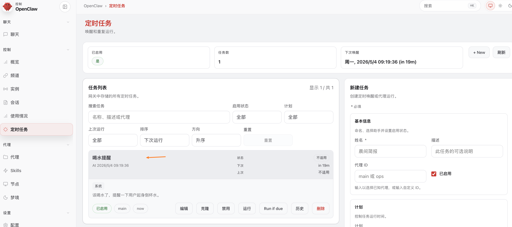
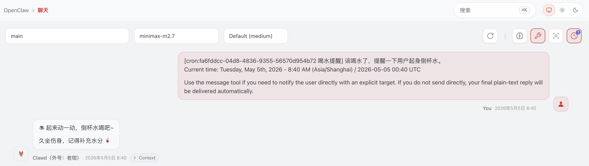
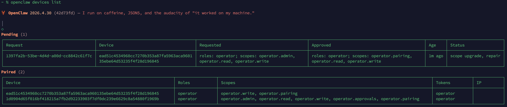
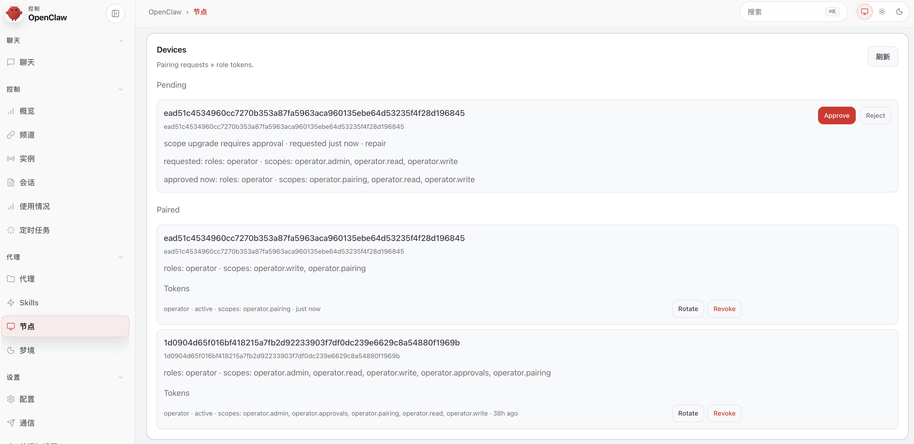
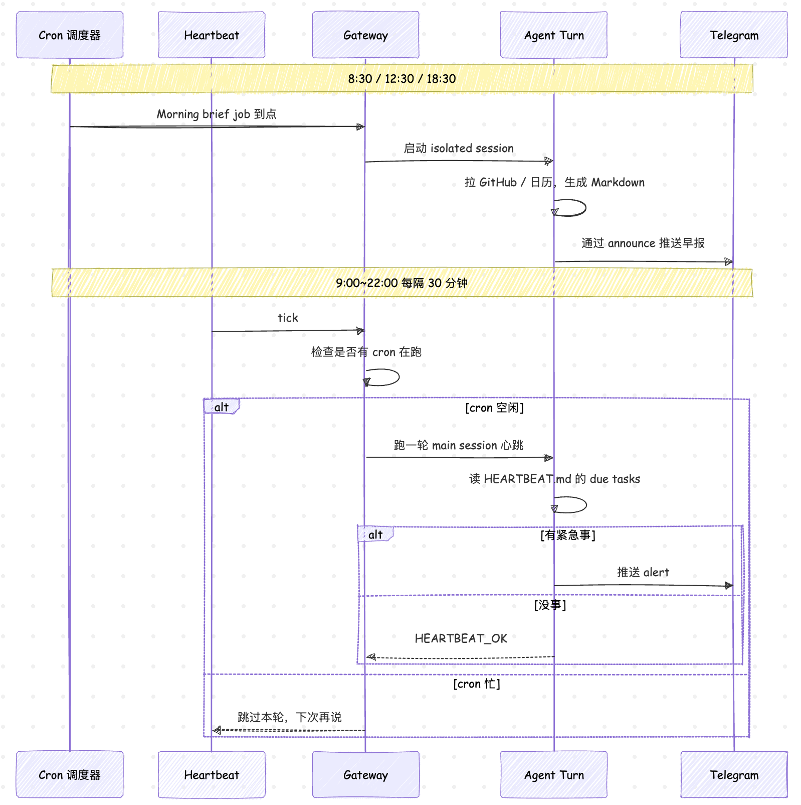

# 让 OpenClaw 自己动起来：Cron 与 Heartbeat

前面几篇我们把小龙虾接进了 Telegram 和飞书，跑通了通道侧的整套准入逻辑。但到目前为止它都是个 **被动型选手**，我们发它才回。昨天写飞书那篇结尾时我提了一个例子：让小龙虾在每天 9:30 给我发一条 DM，把昨天的 GitHub Trending、最新的新闻或订阅的博客汇总发给我。要让小龙虾反过来主动找你，就得给它装上自己启动的发条。

OpenClaw 在 [Automation & tasks](https://docs.openclaw.ai/automation) 这篇官方文档中，把这件事拆成了 6 种机制：**Scheduled Tasks（Cron）**、**Heartbeat**、**Hooks**、**Standing Orders**、**Background Tasks**、**Task Flow**。其中最基础也是最容易搞混的两个就是 **Cron** 和 **Heartbeat** —— 一个负责按精确时间表干活，一个负责主会话隔一会儿自己看一眼。今天我们就把这两个机制各自跑一遍，再用一个完整的工作日早报场景把它们组合起来。

Background Tasks、Task Flow、Hooks、Standing Orders 这几块下一篇再讲。

## Cron 和 Heartbeat 的分工

动手之前先用一张表把两者的边界讲清楚，免得后面用错了场景：

| 维度       | Cron                          | Heartbeat                       |
| ---------- | ----------------------------- | ------------------------------- |
| 触发精度   | 精确（cron 表达式、一次性时间戳） | 近似（默认每 30 分钟一次）          |
| 会话上下文 | fresh isolated 或显式指定      | 主会话完整上下文                 |
| 任务记录   | 每次运行都创建 task 条目        | 不创建                          |
| 投递方式   | 频道、Webhook 或静默            | 主会话内联，可选定向投递          |
| 适用场景   | 日报、周报、定时提醒、后台批处理  | 收件箱轮询、日历扫描、轻量通知     |

简单说，Cron 是有名有姓的定时任务，每个 job 都会写进 `~/.openclaw/cron/jobs.json` 持久化，Gateway 重启不会丢；Heartbeat 是主会话每隔一会儿自己醒一次，不留 task 记录、也不上 jobs 列表。两者并不互斥，而是经常搭配使用：Heartbeat 负责轻量轮询，Cron 负责精确报表。

> 这里要先澄清一个常见误会：OpenClaw 的 Cron **不是** Linux 那个 cron，它是 Gateway 进程内置的调度器，不会去 `/etc/cron.d/` 或 `crontab` 里写任何东西。Gateway 进程没起来，所有 cron job 都不会触发。

## Cron：让小龙虾按时间表干活

OpenClaw 的 Cron CLI 入口是 `openclaw cron add`。我们先做一个最小可跑的例子，20 分钟后在 main 会话里提醒我喝水：

```
$ openclaw cron add \
    --name "喝水提醒" \
    --at "20m" \
    --session session:agent:main:main \
    --message "该喝水了，提醒一下用户起身倒杯水。" \
    --wake now
```

这条命令各个 flag 的含义如下：

* `--name`：任务的展示名，方便 `cron list` 查看，可以中文
* `--at "20m"`：一次性触发的时间点。支持 ISO 8601 绝对时间（如 `2026-05-05T16:00:00Z`），也支持 `20m` / `1h` 这种相对时间
* `--session session:agent:main:main`：直接落到默认 agent（`main`）的 main 会话（`main`）里跑一轮 agent turn。其中 session key 的格式为 `session:<session-id>`，`session-id` 以 `agent:` 开头；第一个 `main` 是 agent id，默认 agent 就叫 main（`DEFAULT_AGENT_ID = "main"`），如果你跑了其它 agent，这里会是 work / personal 之类；第二个 `main` 表示会话槽位，`main` 是该 agent 的主会话（Main Session），如果是其他渠道或 subagent 触发的会话，其格式可能是这的：
  - agent:main:telegram:direct:user123 — Telegram 私聊            
  - agent:main:discord:group:guild-chan — Discord 群聊                                                                                                       
  - agent:main:cron:daily-briefing-uuid — cron 触发               
  - agent:main:subagent:<uuid> — 子 agent
* `--message`：这次 agent turn 的初始 prompt，会被当作用户输入直接喂给模型
* `--wake now`：立即唤醒一次心跳来执行；另一个值是 `next-heartbeat`，等到下一轮心跳再执行

加完之后 `openclaw cron list` 能看到这个 job 的下一次触发时间，也可以到 Web UI 中的定时任务列表中查看：



20 分钟到点之后，小龙虾就会在 main 会话里直接冒出一条 agent 回复，提醒你喝水：



> 一次性 job（`--at`）在成功跑完之后默认会自己删除，如果要保留该任务记录的话可以加 `--keep-after-run` 参数。

### 遭遇 scope upgrade 报错

我自己在跑这条命令时遇到了一个报错，估计有不少同学也会遇到：

```
gateway connect failed: GatewayClientRequestError: scope upgrade pending approval
  (requestId: 1397fa2b-53be-4d4d-a00d-cc8842c61f7c)
GatewayTransportError: gateway closed (1008): pairing required:
  device is asking for more scopes than currently approved
Gateway target: ws://127.0.0.1:18789
```

报错原因不在 cron 命令本身，而是底层 Gateway 的 **scope upgrade 还没审批**。前几篇 onboard 和接通道时这台设备已经跟 Gateway 配对过了，但 `openclaw cron add` 需要的 scope 比当前已批准的范围更大，Gateway 就把这次请求挂成 pending 升级，同时断开本次握手。

报错里那串 `requestId` 就是 Gateway 为这次升级生成的 pending 请求号。我们运行下面的命令，看一下待审批的请求，确认就是这一条：

```
$ openclaw devices list
```

运行结果如下：



可以看到之前的 `scopes` 是 `operator.pairing, operator.read, operator.write`，现在的 cron 命令需要 `operator.admin`，使用下面的命令批准这次 scope upgrade：

```
$ openclaw devices approve 1397fa2b-53be-4d4d-a00d-cc8842c61f7c
```

也可以在 Gateway 的 Web UI 的节点页面里点同意，效果一样：



批准之后再次运行 `openclaw cron add ...` 即可。只要 scope 不再扩大，后续 cron 命令不会再次触发审批。

### --system-event 还是 --message

我第一次写这个例子时跟着官方文档抄的不是上面那条命令，而是下面这样：

```
$ openclaw cron add \
    --name "喝水提醒" \
    --at "20m" \
    --session main \
    --system-event "该喝水了，提醒一下用户起身倒杯水。" \
    --wake now
```

结果时间到了，在任务的执行历史里看 job 状态显示 success，但 main 会话里完全没动静。这就不得不提 `--system-event` 和 `--message` 这两个容易混淆的参数了：

| 参数             | payload 类型    | 触发时实际做的事                                                       |
| ---------------- | ------------- | ------------------------------------------------------------------- |
| `--system-event` | `systemEvent` | 往目标主会话里 enqueue 一条系统事件，并按 `--wake` 唤起一次 heartbeat |
| `--message`      | `agentTurn`   | 直接在目标会话里跑一轮 agent turn，把这段文本当作 prompt              |

另外这两个参数跟 `--session` 取值是 **强绑定** 的：

* `--session main` **必须** 配 `--system-event`
* `--session isolated` / `current` / `session:<id>` **必须** 配 `--message`

回到那条官方文档的例子，`--system-event` 写的"该喝水了..."并不是要直接展示给我的一条聊天消息，它是一个 **塞给 agent 上下文的系统信号**。Gateway 收到之后按 `--wake now` 唤起 heartbeat，heartbeat 跑的是 **它自己那条默认 prompt**（"看一眼 HEARTBEAT.md，没事就回 `HEARTBEAT_OK`"），并不一定会把那段系统事件复述出来。如果 agent 判断"这条系统事件没必要打断用户"或者直接回了 `HEARTBEAT_OK`，main 会话里就什么都不会出现 —— 但 `cron list` 依然记成 success，因为 cron 端的工作确实做完了。

要让到点的时候用户在 main 会话里 **直接** 看到那条提醒，应该走 agent turn 这条路：用 `--message` 把要说的话当作 prompt 直接起一轮，agent 的回复就是用户看到的那条消息。`--system-event` 更适合"通知 agent 该看某件事了，但具体说不说、怎么说交给它判断"的场景。参考下面 Heartbeat 的章节。

### 三种调度类型

`openclaw cron add` 支持三种调度方式，正好覆盖一次性、固定间隔、复杂表达式三个场景：

| Kind    | CLI flag  | 说明                                             |
| ------- | --------- | ----------------------------------------------- |
| `at`    | `--at`    | 一次性触发，ISO 8601 时间戳或相对时间（如 `20m`）   |
| `every` | `--every` | 固定间隔触发（如 `--every 10m`、`--every 1h`）      |
| `cron`  | `--cron`  | 5 段或 6 段 cron 表达式，配合 `--tz` 指定时区        |

要注意的是，不写时区的话，`--cron` 默认走 Gateway 主机时区，`--at` 不写时区直接当 UTC。生产环境建议都强制写 `--tz "Asia/Shanghai"`，省得调试半天发现是时差的锅。

另外 OpenClaw 对整点表达式做了 **自动错峰**：默认会在原始触发时间附近随机抖动最多 5 分钟，避免一堆任务挤在 0 秒同时启动。要严格准点可以加 `--exact` 参数，要自定义抖动窗口用 `--stagger 30s`。

### 四种执行风格

光会调度还不够，**Cron 在哪个会话里跑** 直接决定了它能看到多少上下文。OpenClaw 的执行风格分四种：

| Style          | `--session` 值       | 运行环境                    | 适用场景                     |
| -------------- | ------------------- | -------------------------- | ---------------------------- |
| 主会话         | `main`              | 下一次心跳轮次              | 提醒、系统事件                |
| 隔离会话       | `isolated`          | 全新 `cron:<jobId>` 会话     | 报表、后台杂务                |
| 当前会话       | `current`           | 创建时绑定的会话             | 上下文敏感的循环任务          |
| 自定义命名会话 | `session:<id>`      | 持久化命名会话              | 需要在历史上累积上下文的工作流 |

主会话模式只是给主会话发一个系统事件，任务执行时仍然是用户自己的会话；隔离模式则会开一个全新的 `cron:<jobId>` 会话，跟主会话完全隔离，适合那种不希望污染聊天上下文的后台报表；自定义会话介于两者之间，同一个 `--session session:daily-standup` 可以在多次运行里累积上下文，比如每天的站会摘要可以基于昨天的摘要生成。

### 一次 cron 触发到底发生了什么

光看 CLI 不够直观，我们扒一眼源码。cron 的对外入口在 `src/cron/service.ts`：

```ts
export class CronService implements CronServiceContract {
  private readonly state;
  constructor(deps: CronServiceDeps) {
    this.state = createCronServiceState(deps);
  }

  async start() {
    await ops.start(this.state);
  }

  async add(input: CronJobCreate) {
    return await ops.add(this.state, input);
  }

  async run(id: string, mode?: "due" | "force"): Promise<CronServiceRunResult> {
    return await ops.run(this.state, id, mode);
  }
}
```

这里的代码做了简化，只保留了主要部分。可以看到 `CronService` 本身只是一层薄壳，真正的状态拆在了 `src/cron/service/state.ts`，下一层的 `ops.ts`、`jobs.ts`、`timer.ts`、`stagger.ts` 各自负责调度、持久化、定时器和错峰。其中 `timer.ts` 是触发的核心，它会按 `nextRunAtMs` 排定真实定时器，到点之后调用 `markCronJobActive` 写入 active 标记，再由 `delivery-plan.ts` 把投递目标解析成 `announce` / `webhook` / `none`，最后走 `isolated-agent.ts` 拉起一次真正的 agent turn。

整个链路有三个关键点：

1. **持久化**：所有 job 写在 `~/.openclaw/cron/jobs.json` 里，Gateway 重启不会丢。运行态信息单独放在同目录的 `jobs-state.json`。文档里特别提到这两个文件拆开是为了让定义可入 git、运行态不入 git
2. **错峰**：所有整点表达式默认会被 `stagger.ts` 自动错开 0~5 分钟，避免一堆 job 在 9:00:00 同时触发
3. **重试与熔断**：transient 错误（rate_limit、overloaded、network、server_error）会指数退避重试；permanent 错误直接 disable

### 三种投递方式

`openclaw cron add` 支持三种投递模式，对应不同的输出策略：

| Mode       | 行为                                                          |
| ---------- | ------------------------------------------------------------ |
| `announce` | agent 没主动发消息时，runner 把最终回复兜底发到 `--to` 目标 |
| `webhook`  | 把最终的处理结果 POST 到一个 URL                       |
| `none`     | runner 不做任何兜底投递                                         |

我们把开头那个早报场景用 announce 实现一遍 —— 让小龙虾每天 8:30 在隔离会话里汇总 GitHub 通知和今日日程，然后通过 Telegram 投递到我自己的私聊：

```
$ openclaw cron add \
    --name "morning-brief" \
    --cron "30 8 * * *" \
    --tz "Asia/Shanghai" \
    --session isolated \
    --message "汇总过去 24 小时的 GitHub 通知和今天的日程，按重要性排序。" \
    --announce \
    --channel telegram \
    --to "12345678"
```

跟前面喝水提醒例子比起来，多出来的三个 flag：

* `--announce`：开启 runner 兜底投递；其中 `--session isolated` 表示隔离会话；
* `--channel telegram`：投递通道。可选 `telegram` / `slack` / `discord` / `feishu` / `whatsapp` 等，默认 `last`（最近一次用过的通道）；
* `--to "12345678"`：目标地址，格式跟通道挂钩。Telegram 直接给数字 chat_id：私聊是用户 ID，群组带 `-100` 前缀（如 `-1001234567890`），如果是话题群再加一个 `--thread-id 42` 参数；

到 8:30 触发时，OpenClaw 会开一个全新的 `cron:<jobId>` isolated session 跑一轮 agent turn。等 agent 执行结束，runner 拿这段文本通过 Telegram 适配器 POST 到 chat_id `12345678`。整个 isolated session 跟主会话完全隔开，main 会话不会被早报刷屏。

要注意的是，对 isolated job 来说 chat 路由是共享的：如果在 prompt 里让 agent 显式调 `message` 工具发到了 `--to` 指定的目标，OpenClaw 会按 **通道 + 目标** 做去重判断，匹配就自动跳过 `announce` 兜底，避免重复消息。但只要通道或目标 ID 写法对不上，就可能出现重复发送的情况。最干净的写法是二选一：要么靠 `--announce` 兜底、prompt 里别让它主动发；要么 prompt 显式调工具发，cron 加 `--no-deliver` 把兜底关掉。

## Heartbeat：让小龙虾自己醒一下

讲完 Cron，我们再来看 Heartbeat。这是两个很容易混淆的概念。文档里的一句话定义最准确：

> Heartbeat runs **periodic agent turns** in the main session so the model can surface anything that needs attention without spamming you.

也就是说，Heartbeat 不是另一个 cron，它是主会话里 **隔一会儿自己跑一轮 agent turn**，看一下有没有什么需要冒泡给你的。**默认间隔是 30 分钟**，可以通过 `agents.defaults.heartbeat.every` 参数改，写 `0m` 完全关掉。

整个机制设计得比 Cron 轻量很多：没有 jobs 列表、不会创建 task 记录、连出现在哪都不强求。它在后台跑得勤快，但是却不张扬，专门用来做收件箱轮询、日历扫描、轻量通知这类不急但得有人盯着的事。

### 默认行为

Heartbeat 默认是开的，一个全新装好的 OpenClaw 每 30 分钟会自动跑一轮，prompt 是写死的一句话（可以在 `agents.defaults.heartbeat.prompt` 里覆盖）：

```
Read HEARTBEAT.md if it exists (workspace context). Follow it strictly. Do not infer or repeat old tasks from prior chats. If nothing needs attention, reply HEARTBEAT_OK.
```

翻译过来就是：去读 workspace 里的 `HEARTBEAT.md`（如果有的话），按它说的做；别从老聊天里翻出陈年的 task 出来重复一遍；没事的话就回 `HEARTBEAT_OK`。

最关键的是 **响应契约**：

* 没事时回 `HEARTBEAT_OK`：这串字符是 OpenClaw 跟模型约定的暗号，**只有出现在回复的开头或结尾才算数**。识别成暗号之后，OpenClaw 会把它从回复里抠掉，再看剩下的内容有多长，如果 **不到 300 字符**（默认值，可通过 `ackMaxChars` 调）就把整条回复静默吃掉，主会话里啥都看不到。比如模型回 `HEARTBEAT_OK 邮箱里没有紧急邮件` 会被直接丢弃；但如果它写了 800 字的真正邮件摘要再带个 `HEARTBEAT_OK`，还是会照常投递
* 如果有需要提醒你的事（比如收件箱里有紧急邮件），返回 alert 文本，**不要** 带 `HEARTBEAT_OK`
* 如果 `HEARTBEAT_OK` 出现在回复中间不算暗号，避免误伤模型的正常消息，也会照常投递

这个契约的好处很直接：你不会被一堆 "✅ 心跳正常，无事可做" 之类的废话淹没；只有当 agent 真有事情要跟你说，你才会在主会话里看到它的消息。

### HEARTBEAT.md：心跳清单

如果你不写 `HEARTBEAT.md`，agent 每次心跳都得自己想"我应该看点啥"，结果就是每次问的事情都不太一样，token 烧得也比较随机。OpenClaw 的推荐做法是在 workspace 里放一份小巧、稳定、安全的 `HEARTBEAT.md`，把每次心跳要做的事写成清单：

```markdown
# Heartbeat checklist

- 快速扫一眼：收件箱里有没有紧急的邮件？
- 如果是白天，闲着没事时可以来打个招呼
- 如果某个任务卡住了，在这里写下到底缺什么，记得下次问
```

每次心跳 OpenClaw 都会把这份文件作为 workspace bootstrap 注入到 system prompt 里。要让它真正小，OpenClaw 还做了一个优化：**如果 `HEARTBEAT.md` 内容是 effectively empty**（只有空行、Markdown 标题、空列表、围栏标记），OpenClaw 会直接 skip 这次心跳，省掉一次模型调用，运行日志里会看到 `reason=empty-heartbeat-file`。

### `tasks:` 块

`HEARTBEAT.md` 有一个特别好用的功能，叫 `tasks:` 块，用来在心跳里跑不同间隔的子检查：

```markdown
tasks:

- name: 邮件检查
  interval: 30m
  prompt: "检查是否有紧急的未读邮件，并标记任何对时间敏感的内容。"
- name: 日历扫描
  interval: 2h
  prompt: "检查即将到来的、需要准备或跟进的会议。"

# 额外说明

- 保持提醒简短。
- 如果在所有到期任务都执行完毕后没有需要关注的事项，回复 HEARTBEAT_OK。
```

有了 `tasks:` 块之后，OpenClaw 会按每个 task 自己的 `interval` 判断是否到期，**只把到期的 task 放进当前心跳的 prompt**。如果一轮没有任何 task 到期，整次心跳直接 skip（`reason=no-tasks-due`）。

### 投递目标与可见性

默认 `target: "none"`，也就是说心跳跑了但 **不主动投递任何外部消息**，只在主会话内部留个痕迹。要让它真正把 alert 推到你身上，得显式配 `target`：

```json5
{
  "agents": {
    "defaults": {
      "heartbeat": {
        "every": "30m",
        "target": "last",         // 投到最近一次用过的外部通道
        "directPolicy": "allow",  // 默认 allow；block 时不投递 DM 类目标
        "lightContext": true,     // 仅注入 HEARTBEAT.md，跳过其它 workspace bootstrap 文件
        "isolatedSession": true,  // 每次心跳跑在新会话里，避免拖着完整对话历史
        "skipWhenBusy": true,     // 子 agent / nested 通道繁忙时也延期
        // "activeHours": { start: "08:00", end: "24:00" },
        // "includeReasoning": true,
      },
    },
  },
}
```

几个值得展开的字段：

* `target: "last"` 表示投递到最近一次用过的外部通道。如果你想固定投到某个频道，比如 Telegram 的某个群，可以写 `target: "telegram"` 加 `to: "12345678"`；多账号场景下还得加 `accountId`
* `lightContext: true` 跟 `isolatedSession: true` 是节省 token 的两件套。前者只把 `HEARTBEAT.md` 注进 bootstrap，跳过 SOUL / IDENTITY / USER / AGENTS；后者每次新开 session，避免每次心跳都拖一份完整的主会话上下文。文档给的对照数据是从 ~100K tokens 降到 ~2-5K tokens 一次
* `directPolicy: "block"` 用来防止心跳给陌生人或 DM 对端发广播，常见于多用户共享 inbox 的场景
* `activeHours` 限定到上班时间，比如只在 9:00~22:00 之间响心跳，下班自动闭嘴

### Cron 跑的时候 Heartbeat 会让路

还有一点值得注意：**只要有 cron job 在跑或者排队，Heartbeat 就自动延期**。源码在 `src/infra/heartbeat-runner.ts`：

```ts
if (hasActiveCronJobs() || hasQueuedWorkInLanes(HEARTBEAT_ALWAYS_BUSY_LANES, getSize)) {
  // 延期，跳过本轮
  ...
}

if (heartbeat?.skipWhenBusy === true && hasOptInBusyLaneWork(getSize, getSnapshots)) {
  // skipWhenBusy 开启时，子 agent / nested 通道繁忙也延期
  ...
}
```

这个设计对本地模型用户特别友好。如果你跑的是 Ollama / vLLM 这种单进程模型服务，Cron 和 Heartbeat 同时打满会直接把请求队列堆爆。打开 `skipWhenBusy: true` 之后，连子 agent 和 nested 通道繁忙时也会让心跳延期，真正做到"忙的时候不抢资源，闲的时候才看一眼"。

### 手动触发一次心跳

平时 Heartbeat 是按 `every` 定时跑的，但你也可以随时手动催它一下：

```
$ openclaw system event --text "Check for urgent follow-ups" --mode now
```

`--mode now` 立刻起一次心跳；`--mode next-heartbeat` 等到下一轮 tick 再跑。如果配了多个 agent 都开了 heartbeat，手动触发会把每个 agent 的心跳都跑一遍。

## Cron 与 Heartbeat 的组合

到这里两个机制都讲完了，回头看一开始那个早报场景 —— 让小龙虾每天 8:30 给我发一条 DM，把 GitHub 通知和今天日程汇总好。光用 Cron 写一句"汇总 GitHub 通知和今日日程"够不够？够。但有一类需求 Cron 满足不了：**收件箱什么时候收到新邮件、日历什么时候发生变动，是不可预测的**。这种轮询型工作交给 Heartbeat 才合适。

下面是一个典型的搭配组合：

* **Cron**：负责 8:30 / 12:30 / 18:30 三个固定时间点的精确报表，每次 fresh isolated session，结果通过 `--announce` 投递到 Telegram
* **Heartbeat**：负责日间 9:00~22:00 的轻量轮询，间隔 30 分钟，主会话上下文，开 `lightContext + isolatedSession + skipWhenBusy` 三件套省 token，只在收件箱有紧急邮件、日历有冲突时才推 alert，没事就 `HEARTBEAT_OK` 静默
* **HEARTBEAT.md** 用 `tasks:` 块拆成 `inbox-triage`（30m）、`calendar-scan`（2h）、`pr-watch`（1h）三个不同 interval 的子任务

整体的触发时序长这样：



## 小结

通过这一篇，我们把 OpenClaw 自动化体系里最基础的两块拆开看了一遍：

1. **Cron**：Gateway 内置调度器，job 持久化在 `~/.openclaw/cron/jobs.json`、运行态在 `jobs-state.json`，`--at` / `--every` / `--cron` 三种调度方式覆盖一次性、固定间隔、复杂表达式三类场景；执行风格分主会话、隔离、当前、自定义命名四种；投递有 `announce` / `webhook` / `none` 三档
2. **Heartbeat**：主会话每 30 分钟自己跑一轮的轻量心跳，**不创建 task 记录**、**不上 cron list**，靠 `HEARTBEAT.md`（含 `tasks:` 块）保持稳定的清单；响应契约是没事时回 `HEARTBEAT_OK`、有事时回 alert，可以配 `lightContext` + `isolatedSession` + `skipWhenBusy` 三件套省 token、避资源
3. **两者互不打架**：Cron 跑的时候 Heartbeat 自动延期（看 `src/infra/heartbeat-runner.ts` 里 `hasActiveCronJobs()` 那一段），开 `skipWhenBusy` 之后连子 agent / nested 通道繁忙也延期
4. **典型组合**：Cron 负责精确时间点的报表（早报、周报）；Heartbeat 负责日间的轻量轮询（收件箱、日历、PR 状态）；遇到外部事件还有 Webhook 兜底

到这里，小龙虾终于不再是被动等回复的状态了，它会按表干活，也会自己醒一下看看周围有没有事。但我们说的主动还差一块：当 GitHub PR 来了新的 review、Sentry 报了一个 P0、自家服务部署完成的时候，OpenClaw 怎么被外部世界唤起？这就需要 **Webhook**，再加上一份长期生效的指令清单 **Standing Orders** 来约束 agent 干这些活时的边界。我们下一篇继续。

## 参考

* [OpenClaw 官方文档](https://docs.openclaw.ai/)
* [OpenClaw GitHub 仓库](https://github.com/openclaw/openclaw)
* [Automation & Tasks 总索引](https://docs.openclaw.ai/automation)
* [Scheduled Tasks（cron-jobs）官方文档](https://docs.openclaw.ai/automation/cron-jobs)
* [Heartbeat 官方文档](https://docs.openclaw.ai/gateway/heartbeat)
* [Cron vs Heartbeat 速查](https://docs.openclaw.ai/automation/cron-vs-heartbeat)
* [Background Tasks 官方文档](https://docs.openclaw.ai/automation/tasks)
* [Standing Orders 官方文档](https://docs.openclaw.ai/automation/standing-orders)
* [Agent Workspace 概念](https://docs.openclaw.ai/concepts/agent-workspace)
* [Timezone 配置说明](https://docs.openclaw.ai/concepts/timezone)
* [croner Cron 解析库](https://github.com/Hexagon/croner)
* [crontab guru 表达式速查](https://crontab.guru/)
